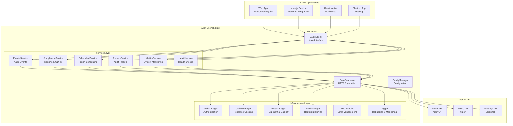
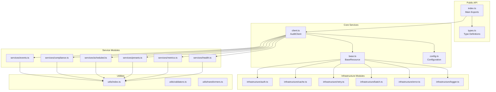

# Design Document

## Overview

The enhanced audit client library serves as a comprehensive TypeScript SDK for interacting with the SMEDREC Server REST API. Building upon the existing basic client implementation, this enhanced version provides a feature-rich, type-safe interface that abstracts the complexity of direct API calls while offering advanced capabilities including intelligent retry mechanisms, comprehensive authentication handling, response caching, request batching, and robust error management.

The library is designed with a modular architecture that supports multiple API paradigms (REST, TRPC, GraphQL), provides extensive configuration options, and maintains high performance standards. It targets web applications, Node.js services, React Native apps, and other TypeScript/JavaScript environments, ensuring consistent behavior across all platforms.

## Architecture

### High-Level Architecture



### Module Architecture



## Components and Interfaces

### 1. Enhanced Client Configuration

```typescript
interface AuditClientConfig {
	// Connection settings
	baseUrl: string
	apiVersion?: string
	timeout?: number

	// Authentication
	authentication: {
		type: 'apiKey' | 'session' | 'bearer' | 'custom'
		apiKey?: string
		sessionToken?: string
		bearerToken?: string
		customHeaders?: Record<string, string>
		autoRefresh?: boolean
		refreshEndpoint?: string
	}

	// Retry configuration
	retry: {
		enabled: boolean
		maxAttempts: number
		initialDelayMs: number
		maxDelayMs: number
		backoffMultiplier: number
		retryableStatusCodes: number[]
		retryableErrors: string[]
	}

	// Caching configuration
	cache: {
		enabled: boolean
		defaultTtlMs: number
		maxSize: number
		storage: 'memory' | 'localStorage' | 'sessionStorage' | 'custom'
		customStorage?: CacheStorage
		keyPrefix: string
		compressionEnabled: boolean
	}

	// Request batching
	batching: {
		enabled: boolean
		maxBatchSize: number
		batchTimeoutMs: number
		batchableEndpoints: string[]
	}

	// Performance optimization
	performance: {
		enableCompression: boolean
		enableStreaming: boolean
		maxConcurrentRequests: number
		requestDeduplication: boolean
		responseTransformation: boolean
	}

	// Logging and debugging
	logging: {
		enabled: boolean
		level: 'debug' | 'info' | 'warn' | 'error'
		includeRequestBody: boolean
		includeResponseBody: boolean
		maskSensitiveData: boolean
		customLogger?: Logger
	}

	// Error handling
	errorHandling: {
		throwOnError: boolean
		includeStackTrace: boolean
		errorTransformation: boolean
		customErrorHandler?: ErrorHandler
	}

	// Environment-specific settings
	environment?: 'development' | 'staging' | 'production'
	customHeaders?: Record<string, string>
	interceptors?: {
		request?: RequestInterceptor[]
		response?: ResponseInterceptor[]
	}
}
```

### 2. Enhanced Base Resource Class

```typescript
abstract class BaseResource {
	protected config: AuditClientConfig
	protected authManager: AuthManager
	protected cacheManager: CacheManager
	protected retryManager: RetryManager
	protected batchManager: BatchManager
	protected errorHandler: ErrorHandler
	protected logger: Logger

	constructor(config: AuditClientConfig) {
		this.config = this.validateAndNormalizeConfig(config)
		this.initializeManagers()
	}

	// Core request method with all enhancements
	protected async request<T>(endpoint: string, options: RequestOptions = {}): Promise<T> {
		const requestId = this.generateRequestId()
		const startTime = Date.now()

		try {
			// Apply request interceptors
			const processedOptions = await this.applyRequestInterceptors(options)

			// Check cache first
			if (this.shouldUseCache(endpoint, processedOptions)) {
				const cached = await this.cacheManager.get<T>(
					this.generateCacheKey(endpoint, processedOptions)
				)
				if (cached) {
					this.logger.debug('Cache hit', { endpoint, requestId })
					return cached
				}
			}

			// Check if request should be batched
			if (this.shouldBatch(endpoint, processedOptions)) {
				return this.batchManager.addToBatch<T>(endpoint, processedOptions)
			}

			// Execute request with retry logic
			const response = await this.retryManager.execute(
				() => this.executeRequest<T>(endpoint, processedOptions, requestId),
				{ endpoint, requestId }
			)

			// Apply response interceptors
			const processedResponse = await this.applyResponseInterceptors(response)

			// Cache successful responses
			if (this.shouldCache(endpoint, processedOptions, processedResponse)) {
				await this.cacheManager.set(
					this.generateCacheKey(endpoint, processedOptions),
					processedResponse,
					this.getCacheTtl(endpoint)
				)
			}

			// Log successful request
			this.logger.info('Request completed', {
				endpoint,
				requestId,
				duration: Date.now() - startTime,
				cached: false,
			})

			return processedResponse
		} catch (error) {
			// Handle and transform errors
			const processedError = await this.errorHandler.handleError(error, {
				endpoint,
				requestId,
				duration: Date.now() - startTime,
			})

			this.logger.error('Request failed', {
				endpoint,
				requestId,
				error: processedError,
				duration: Date.now() - startTime,
			})

			throw processedError
		}
	}

	// Enhanced HTTP execution with authentication and headers
	private async executeRequest<T>(
		endpoint: string,
		options: RequestOptions,
		requestId: string
	): Promise<T> {
		const url = this.buildUrl(endpoint)
		const headers = await this.buildHeaders(options.headers, requestId)
		const body = this.buildBody(options.body)

		const fetchOptions: RequestInit = {
			method: options.method || 'GET',
			headers,
			body,
			signal: options.signal,
			credentials: 'include',
		}

		const response = await fetch(url, fetchOptions)

		if (!response.ok) {
			throw new HttpError(
				response.status,
				response.statusText,
				await this.extractErrorBody(response),
				requestId
			)
		}

		return this.parseResponse<T>(response, options.responseType)
	}

	// Authentication header building
	private async buildHeaders(
		customHeaders: Record<string, string> = {},
		requestId: string
	): Promise<Record<string, string>> {
		const headers: Record<string, string> = {
			Accept: 'application/json',
			'Content-Type': 'application/json',
			'User-Agent': this.getUserAgent(),
			'X-Request-ID': requestId,
			...this.config.customHeaders,
			...customHeaders,
		}

		// Add authentication headers
		const authHeaders = await this.authManager.getAuthHeaders()
		Object.assign(headers, authHeaders)

		// Add API version header
		if (this.config.apiVersion) {
			headers['Accept-Version'] = this.config.apiVersion
		}

		return headers
	}
}
```

### 3. Service Layer Architecture

```typescript
// Events Service - Comprehensive audit event management
class EventsService extends BaseResource {
	// Create single audit event
	async create(event: CreateAuditEventInput): Promise<AuditEvent> {
		return this.request<AuditEvent>('/audit/events', {
			method: 'POST',
			body: event,
		})
	}

	// Bulk create audit events
	async bulkCreate(events: CreateAuditEventInput[]): Promise<BulkCreateResult> {
		return this.request<BulkCreateResult>('/audit/events/bulk', {
			method: 'POST',
			body: { events },
		})
	}

	// Query audit events with advanced filtering
	async query(params: QueryAuditEventsParams): Promise<PaginatedAuditEvents> {
		return this.request<PaginatedAuditEvents>('/audit/events', {
			method: 'GET',
			query: params,
		})
	}

	// Get audit event by ID
	async getById(id: string): Promise<AuditEvent | null> {
		try {
			return await this.request<AuditEvent>(`/audit/events/${id}`)
		} catch (error) {
			if (error instanceof HttpError && error.status === 404) {
				return null
			}
			throw error
		}
	}

	// Verify audit event integrity
	async verify(id: string): Promise<IntegrityVerificationResult> {
		return this.request<IntegrityVerificationResult>(`/audit/events/${id}/verify`, {
			method: 'POST',
		})
	}

	// Export audit events
	async export(params: ExportEventsParams): Promise<ExportResult> {
		return this.request<ExportResult>('/audit/events/export', {
			method: 'POST',
			body: params,
		})
	}

	// Stream audit events for large datasets
	async stream(params: StreamEventsParams): Promise<ReadableStream<AuditEvent>> {
		return this.request<ReadableStream<AuditEvent>>('/audit/events/stream', {
			method: 'GET',
			query: params,
			responseType: 'stream',
		})
	}

	// Real-time audit event subscription (WebSocket/SSE)
	subscribe(params: SubscriptionParams): EventSubscription {
		return new EventSubscription(this.config.baseUrl, params, this.authManager)
	}
}

// Compliance Service - HIPAA, GDPR, and custom reporting
class ComplianceService extends BaseResource {
	// Generate HIPAA compliance report
	async generateHipaaReport(criteria: ReportCriteria): Promise<HIPAAReport> {
		return this.request<HIPAAReport>('/compliance/reports/hipaa', {
			method: 'POST',
			body: { criteria },
		})
	}

	// Generate GDPR compliance report
	async generateGdprReport(criteria: ReportCriteria): Promise<GDPRReport> {
		return this.request<GDPRReport>('/compliance/reports/gdpr', {
			method: 'POST',
			body: { criteria },
		})
	}

	// Generate custom compliance report
	async generateCustomReport(params: CustomReportParams): Promise<CustomReport> {
		return this.request<CustomReport>('/compliance/reports/custom', {
			method: 'POST',
			body: params,
		})
	}

	// Export data for GDPR requests
	async exportGdprData(params: GdprExportParams): Promise<GdprExportResult> {
		return this.request<GdprExportResult>('/compliance/gdpr/export', {
			method: 'POST',
			body: params,
		})
	}

	// Pseudonymize data for GDPR compliance
	async pseudonymizeData(params: PseudonymizationParams): Promise<PseudonymizationResult> {
		return this.request<PseudonymizationResult>('/compliance/gdpr/pseudonymize', {
			method: 'POST',
			body: params,
		})
	}

	// Get compliance report templates
	async getReportTemplates(): Promise<ReportTemplate[]> {
		return this.request<ReportTemplate[]>('/compliance/templates')
	}

	// Download report as file
	async downloadReport(reportId: string, format: 'pdf' | 'csv' | 'json'): Promise<Blob> {
		return this.request<Blob>(`/compliance/reports/${reportId}/download`, {
			method: 'GET',
			query: { format },
			responseType: 'blob',
		})
	}
}

// Scheduled Reports Service
class ScheduledReportsService extends BaseResource {
	// List scheduled reports
	async list(params: ListScheduledReportsParams = {}): Promise<PaginatedScheduledReports> {
		return this.request<PaginatedScheduledReports>('/scheduled-reports', {
			method: 'GET',
			query: params,
		})
	}

	// Create scheduled report
	async create(report: CreateScheduledReportInput): Promise<ScheduledReport> {
		return this.request<ScheduledReport>('/scheduled-reports', {
			method: 'POST',
			body: report,
		})
	}

	// Update scheduled report
	async update(id: string, updates: UpdateScheduledReportInput): Promise<ScheduledReport> {
		return this.request<ScheduledReport>(`/scheduled-reports/${id}`, {
			method: 'PUT',
			body: updates,
		})
	}

	// Delete scheduled report
	async delete(id: string): Promise<void> {
		await this.request<void>(`/scheduled-reports/${id}`, {
			method: 'DELETE',
		})
	}

	// Execute scheduled report immediately
	async execute(id: string): Promise<ReportExecution> {
		return this.request<ReportExecution>(`/scheduled-reports/${id}/execute`, {
			method: 'POST',
		})
	}

	// Get execution history
	async getExecutionHistory(
		id: string,
		params: ExecutionHistoryParams = {}
	): Promise<PaginatedExecutions> {
		return this.request<PaginatedExecutions>(`/scheduled-reports/${id}/executions`, {
			method: 'GET',
			query: params,
		})
	}
}

// Audit Presets Service
class PresetsService extends BaseResource {
	// List audit presets
	async list(): Promise<AuditPreset[]> {
		return this.request<AuditPreset[]>('/audit-presets')
	}

	// Get audit preset by name
	async get(name: string): Promise<AuditPreset | null> {
		try {
			return await this.request<AuditPreset>(`/audit-presets/${name}`)
		} catch (error) {
			if (error instanceof HttpError && error.status === 404) {
				return null
			}
			throw error
		}
	}

	// Create audit preset
	async create(preset: CreateAuditPresetInput): Promise<AuditPreset> {
		return this.request<AuditPreset>('/audit-presets', {
			method: 'POST',
			body: preset,
		})
	}

	// Update audit preset
	async update(name: string, updates: UpdateAuditPresetInput): Promise<AuditPreset> {
		return this.request<AuditPreset>(`/audit-presets/${name}`, {
			method: 'PUT',
			body: updates,
		})
	}

	// Delete audit preset
	async delete(name: string): Promise<void> {
		await this.request<void>(`/audit-presets/${name}`, {
			method: 'DELETE',
		})
	}

	// Apply preset to create audit event
	async apply(name: string, context: PresetContext): Promise<AuditEvent> {
		return this.request<AuditEvent>(`/audit-presets/${name}/apply`, {
			method: 'POST',
			body: context,
		})
	}
}

// Metrics and Monitoring Service
class MetricsService extends BaseResource {
	// Get system metrics
	async getSystemMetrics(): Promise<SystemMetrics> {
		return this.request<SystemMetrics>('/metrics/system')
	}

	// Get audit metrics
	async getAuditMetrics(params: AuditMetricsParams): Promise<AuditMetrics> {
		return this.request<AuditMetrics>('/metrics/audit', {
			method: 'GET',
			query: params,
		})
	}

	// Get performance metrics
	async getPerformanceMetrics(): Promise<PerformanceMetrics> {
		return this.request<PerformanceMetrics>('/metrics/performance')
	}

	// Get API usage metrics
	async getUsageMetrics(params: UsageMetricsParams): Promise<UsageMetrics> {
		return this.request<UsageMetrics>('/metrics/usage', {
			method: 'GET',
			query: params,
		})
	}

	// Get alerts
	async getAlerts(params: AlertsParams = {}): Promise<PaginatedAlerts> {
		return this.request<PaginatedAlerts>('/alerts', {
			method: 'GET',
			query: params,
		})
	}

	// Acknowledge alert
	async acknowledgeAlert(id: string): Promise<void> {
		await this.request<void>(`/alerts/${id}/acknowledge`, {
			method: 'POST',
		})
	}

	// Resolve alert
	async resolveAlert(id: string, resolution: string): Promise<void> {
		await this.request<void>(`/alerts/${id}/resolve`, {
			method: 'POST',
			body: { resolution },
		})
	}
}

// Health Service
class HealthService extends BaseResource {
	// Simple health check
	async check(): Promise<HealthStatus> {
		return this.request<HealthStatus>('/health')
	}

	// Detailed health check
	async detailed(): Promise<DetailedHealthStatus> {
		return this.request<DetailedHealthStatus>('/health/detailed')
	}

	// Readiness check
	async ready(): Promise<ReadinessStatus> {
		return this.request<ReadinessStatus>('/ready')
	}

	// Get API version
	async version(): Promise<VersionInfo> {
		return this.request<VersionInfo>('/info')
	}
}
```

### 4. Infrastructure Layer Components

```typescript
// Authentication Manager
class AuthManager {
	private config: AuditClientConfig['authentication']
	private tokenCache: Map<string, { token: string; expiresAt: number }> = new Map()

	constructor(config: AuditClientConfig['authentication']) {
		this.config = config
	}

	async getAuthHeaders(): Promise<Record<string, string>> {
		const headers: Record<string, string> = {}

		switch (this.config.type) {
			case 'apiKey':
				if (this.config.apiKey) {
					headers['X-API-Key'] = this.config.apiKey
				}
				break

			case 'session':
				if (this.config.sessionToken) {
					headers['Authorization'] = `Bearer ${this.config.sessionToken}`
				}
				break

			case 'bearer':
				if (this.config.bearerToken) {
					headers['Authorization'] = `Bearer ${this.config.bearerToken}`
				}
				break

			case 'custom':
				if (this.config.customHeaders) {
					Object.assign(headers, this.config.customHeaders)
				}
				break
		}

		return headers
	}

	async refreshToken(): Promise<string | null> {
		if (!this.config.autoRefresh || !this.config.refreshEndpoint) {
			return null
		}

		// Implementation for token refresh
		// This would make a request to the refresh endpoint
		// and update the stored token
		return null
	}

	isTokenExpired(token: string): boolean {
		const cached = this.tokenCache.get(token)
		return cached ? Date.now() >= cached.expiresAt : false
	}
}

// Cache Manager with multiple storage backends
class CacheManager {
	private storage: CacheStorage
	private config: AuditClientConfig['cache']

	constructor(config: AuditClientConfig['cache']) {
		this.config = config
		this.storage = this.initializeStorage()
	}

	async get<T>(key: string): Promise<T | null> {
		if (!this.config.enabled) return null

		try {
			const cached = await this.storage.get(this.prefixKey(key))
			if (!cached) return null

			const { data, expiresAt } = JSON.parse(cached)
			if (Date.now() >= expiresAt) {
				await this.delete(key)
				return null
			}

			return this.config.compressionEnabled ? this.decompress(data) : data
		} catch (error) {
			console.warn('Cache get error:', error)
			return null
		}
	}

	async set<T>(key: string, value: T, ttlMs?: number): Promise<void> {
		if (!this.config.enabled) return

		try {
			const expiresAt = Date.now() + (ttlMs || this.config.defaultTtlMs)
			const data = this.config.compressionEnabled ? this.compress(value) : value
			const cached = JSON.stringify({ data, expiresAt })

			await this.storage.set(this.prefixKey(key), cached)
		} catch (error) {
			console.warn('Cache set error:', error)
		}
	}

	async delete(key: string): Promise<void> {
		if (!this.config.enabled) return

		try {
			await this.storage.delete(this.prefixKey(key))
		} catch (error) {
			console.warn('Cache delete error:', error)
		}
	}

	async clear(): Promise<void> {
		if (!this.config.enabled) return

		try {
			await this.storage.clear()
		} catch (error) {
			console.warn('Cache clear error:', error)
		}
	}

	private initializeStorage(): CacheStorage {
		switch (this.config.storage) {
			case 'localStorage':
				return new LocalStorageCache()
			case 'sessionStorage':
				return new SessionStorageCache()
			case 'custom':
				return this.config.customStorage || new MemoryCache()
			default:
				return new MemoryCache()
		}
	}

	private prefixKey(key: string): string {
		return `${this.config.keyPrefix}:${key}`
	}

	private compress<T>(data: T): string {
		// Implementation for data compression
		return JSON.stringify(data)
	}

	private decompress<T>(data: string): T {
		// Implementation for data decompression
		return JSON.parse(data)
	}
}

// Retry Manager with exponential backoff
class RetryManager {
	private config: AuditClientConfig['retry']

	constructor(config: AuditClientConfig['retry']) {
		this.config = config
	}

	async execute<T>(
		operation: () => Promise<T>,
		context: { endpoint: string; requestId: string }
	): Promise<T> {
		if (!this.config.enabled) {
			return operation()
		}

		let lastError: Error
		let delay = this.config.initialDelayMs

		for (let attempt = 1; attempt <= this.config.maxAttempts; attempt++) {
			try {
				return await operation()
			} catch (error) {
				lastError = error as Error

				if (attempt === this.config.maxAttempts || !this.shouldRetry(error)) {
					break
				}

				await this.delay(delay)
				delay = Math.min(delay * this.config.backoffMultiplier, this.config.maxDelayMs)
			}
		}

		throw new RetryExhaustedError(
			`Request failed after ${this.config.maxAttempts} attempts`,
			lastError,
			context
		)
	}

	private shouldRetry(error: Error): boolean {
		if (error instanceof HttpError) {
			return this.config.retryableStatusCodes.includes(error.status)
		}

		return this.config.retryableErrors.some((retryableError) =>
			error.message.includes(retryableError)
		)
	}

	private delay(ms: number): Promise<void> {
		return new Promise((resolve) => setTimeout(resolve, ms))
	}
}

// Batch Manager for request batching
class BatchManager {
	private config: AuditClientConfig['batching']
	private batches: Map<string, BatchRequest[]> = new Map()
	private timers: Map<string, NodeJS.Timeout> = new Map()

	constructor(config: AuditClientConfig['batching']) {
		this.config = config
	}

	async addToBatch<T>(endpoint: string, options: RequestOptions): Promise<T> {
		if (!this.config.enabled) {
			throw new Error('Batching is disabled')
		}

		const batchKey = this.getBatchKey(endpoint, options)
		const batch = this.batches.get(batchKey) || []

		return new Promise((resolve, reject) => {
			const request: BatchRequest = {
				endpoint,
				options,
				resolve,
				reject,
				timestamp: Date.now(),
			}

			batch.push(request)
			this.batches.set(batchKey, batch)

			// Set timer for batch execution if not already set
			if (!this.timers.has(batchKey)) {
				const timer = setTimeout(() => {
					this.executeBatch(batchKey)
				}, this.config.batchTimeoutMs)
				this.timers.set(batchKey, timer)
			}

			// Execute immediately if batch is full
			if (batch.length >= this.config.maxBatchSize) {
				this.executeBatch(batchKey)
			}
		})
	}

	private async executeBatch(batchKey: string): Promise<void> {
		const batch = this.batches.get(batchKey)
		if (!batch || batch.length === 0) return

		// Clear timer and batch
		const timer = this.timers.get(batchKey)
		if (timer) {
			clearTimeout(timer)
			this.timers.delete(batchKey)
		}
		this.batches.delete(batchKey)

		try {
			// Execute batch request
			const results = await this.executeBatchRequest(batch)

			// Resolve individual promises
			batch.forEach((request, index) => {
				request.resolve(results[index])
			})
		} catch (error) {
			// Reject all promises in batch
			batch.forEach((request) => {
				request.reject(error)
			})
		}
	}

	private async executeBatchRequest(batch: BatchRequest[]): Promise<any[]> {
		// Implementation for executing batched requests
		// This would combine multiple requests into a single batch request
		// and return individual results
		return []
	}

	private getBatchKey(endpoint: string, options: RequestOptions): string {
		// Generate a key for batching similar requests
		return `${endpoint}:${options.method || 'GET'}`
	}
}
```

## Data Models

### 1. Core Type Definitions

```typescript
// Enhanced audit event types
interface AuditEvent {
	id: string
	timestamp: string
	action: string
	targetResourceType: string
	targetResourceId?: string
	principalId: string
	organizationId: string
	status: 'attempt' | 'success' | 'failure'
	outcomeDescription?: string
	dataClassification: 'PUBLIC' | 'INTERNAL' | 'CONFIDENTIAL' | 'PHI'
	details?: Record<string, any>
	hash?: string
	correlationId?: string
	sessionContext?: SessionContext
	metadata?: AuditEventMetadata
}

interface CreateAuditEventInput {
	action: string
	targetResourceType: string
	targetResourceId?: string
	principalId: string
	organizationId: string
	status: 'attempt' | 'success' | 'failure'
	outcomeDescription?: string
	dataClassification: 'PUBLIC' | 'INTERNAL' | 'CONFIDENTIAL' | 'PHI'
	sessionContext?: SessionContext
	details?: Record<string, any>
}

interface QueryAuditEventsParams {
	filter?: {
		dateRange?: { startDate: string; endDate: string }
		principalIds?: string[]
		organizationIds?: string[]
		actions?: string[]
		statuses?: ('attempt' | 'success' | 'failure')[]
		dataClassifications?: ('PUBLIC' | 'INTERNAL' | 'CONFIDENTIAL' | 'PHI')[]
		resourceTypes?: string[]
		verifiedOnly?: boolean
		correlationId?: string
	}
	pagination?: {
		limit?: number
		offset?: number
	}
	sort?: {
		field: 'timestamp' | 'status' | 'action'
		direction: 'asc' | 'desc'
	}
}

interface PaginatedAuditEvents {
	events: AuditEvent[]
	pagination: {
		total: number
		limit: number
		offset: number
		hasNext: boolean
		hasPrevious: boolean
	}
	metadata?: {
		queryTime: number
		cacheHit: boolean
		totalFiltered: number
	}
}

// Compliance report types
interface HIPAAReport {
	id: string
	generatedAt: string
	criteria: ReportCriteria
	summary: {
		totalEvents: number
		complianceScore: number
		violations: number
		recommendations: string[]
	}
	sections: HIPAASection[]
	metadata: ReportMetadata
}

interface GDPRReport {
	id: string
	generatedAt: string
	criteria: ReportCriteria
	summary: {
		totalEvents: number
		dataSubjects: number
		processingActivities: number
		lawfulBases: string[]
	}
	sections: GDPRSection[]
	metadata: ReportMetadata
}

interface CustomReport {
	id: string
	generatedAt: string
	template: string
	parameters: Record<string, any>
	data: any[]
	summary: Record<string, any>
	metadata: ReportMetadata
}

// Scheduled report types
interface ScheduledReport {
	id: string
	name: string
	description?: string
	reportType: 'hipaa' | 'gdpr' | 'custom'
	criteria: ReportCriteria
	schedule: {
		frequency: 'daily' | 'weekly' | 'monthly' | 'quarterly'
		dayOfWeek?: number
		dayOfMonth?: number
		hour: number
		minute: number
		timezone: string
	}
	recipients: string[]
	format: 'pdf' | 'csv' | 'json'
	enabled: boolean
	createdAt: string
	updatedAt: string
	lastExecuted?: string
	nextExecution: string
}

// Audit preset types
interface AuditPreset {
	name: string
	description?: string
	template: {
		action: string
		targetResourceType: string
		dataClassification: 'PUBLIC' | 'INTERNAL' | 'CONFIDENTIAL' | 'PHI'
		defaultDetails?: Record<string, any>
	}
	validation: {
		requiredFields: string[]
		optionalFields: string[]
		fieldValidation: Record<string, ValidationRule>
	}
	metadata: {
		createdAt: string
		updatedAt: string
		version: string
		tags: string[]
	}
}

// System metrics types
interface SystemMetrics {
	timestamp: string
	server: {
		uptime: number
		memoryUsage: MemoryUsage
		cpuUsage: CpuUsage
	}
	database: {
		connectionCount: number
		activeQueries: number
		averageQueryTime: number
		slowQueries: number
	}
	cache: {
		hitRate: number
		missRate: number
		evictionRate: number
		memoryUsage: number
	}
	api: {
		requestsPerSecond: number
		averageResponseTime: number
		errorRate: number
		activeConnections: number
	}
}

interface AuditMetrics {
	timestamp: string
	timeRange: { startDate: string; endDate: string }
	eventsProcessed: number
	processingLatency: {
		average: number
		p50: number
		p95: number
		p99: number
	}
	integrityVerifications: {
		total: number
		passed: number
		failed: number
		averageTime: number
	}
	complianceReports: {
		generated: number
		scheduled: number
		failed: number
	}
	errorRates: {
		total: number
		byType: Record<string, number>
		byEndpoint: Record<string, number>
	}
}
```

### 2. Error Types

```typescript
// Enhanced error types
class AuditClientError extends Error {
	public readonly code: string
	public readonly requestId?: string
	public readonly timestamp: string
	public readonly context?: Record<string, any>

	constructor(message: string, code: string, requestId?: string, context?: Record<string, any>) {
		super(message)
		this.name = 'AuditClientError'
		this.code = code
		this.requestId = requestId
		this.timestamp = new Date().toISOString()
		this.context = context
	}
}

class HttpError extends AuditClientError {
	public readonly status: number
	public readonly statusText: string
	public readonly response?: any

	constructor(status: number, statusText: string, response?: any, requestId?: string) {
		super(`HTTP ${status}: ${statusText}`, 'HTTP_ERROR', requestId, {
			status,
			statusText,
			response,
		})
		this.name = 'HttpError'
		this.status = status
		this.statusText = statusText
		this.response = response
	}
}

class ValidationError extends AuditClientError {
	public readonly field?: string
	public readonly value?: any
	public readonly constraint?: string

	constructor(message: string, field?: string, value?: any, constraint?: string) {
		super(message, 'VALIDATION_ERROR', undefined, { field, value, constraint })
		this.name = 'ValidationError'
		this.field = field
		this.value = value
		this.constraint = constraint
	}
}

class AuthenticationError extends AuditClientError {
	constructor(message: string, requestId?: string) {
		super(message, 'AUTHENTICATION_ERROR', requestId)
		this.name = 'AuthenticationError'
	}
}

class RateLimitError extends AuditClientError {
	public readonly retryAfter?: number

	constructor(message: string, retryAfter?: number, requestId?: string) {
		super(message, 'RATE_LIMIT_ERROR', requestId, { retryAfter })
		this.name = 'RateLimitError'
		this.retryAfter = retryAfter
	}
}

class RetryExhaustedError extends AuditClientError {
	public readonly originalError: Error
	public readonly attempts: number

	constructor(
		message: string,
		originalError: Error,
		context: { endpoint: string; requestId: string }
	) {
		super(message, 'RETRY_EXHAUSTED', context.requestId, context)
		this.name = 'RetryExhaustedError'
		this.originalError = originalError
		this.attempts = 0 // This would be set based on retry configuration
	}
}
```

## Error Handling

### 1. Comprehensive Error Management

```typescript
class ErrorHandler {
	private config: AuditClientConfig['errorHandling']
	private logger: Logger

	constructor(config: AuditClientConfig['errorHandling'], logger: Logger) {
		this.config = config
		this.logger = logger
	}

	async handleError(
		error: Error,
		context: { endpoint: string; requestId: string; duration: number }
	): Promise<Error> {
		// Log the error
		this.logger.error('Request error', {
			error: error.message,
			stack: this.config.includeStackTrace ? error.stack : undefined,
			...context,
		})

		// Transform error if needed
		const transformedError = this.config.errorTransformation
			? await this.transformError(error, context)
			: error

		// Apply custom error handler if provided
		if (this.config.customErrorHandler) {
			return this.config.customErrorHandler(transformedError, context)
		}

		// Throw or return based on configuration
		if (this.config.throwOnError) {
			throw transformedError
		}

		return transformedError
	}

	private async transformError(
		error: Error,
		context: { endpoint: string; requestId: string; duration: number }
	): Promise<Error> {
		// Transform different types of errors
		if (error instanceof TypeError && error.message.includes('fetch')) {
			return new AuditClientError(
				'Network error: Unable to connect to the server',
				'NETWORK_ERROR',
				context.requestId,
				context
			)
		}

		if (error instanceof Error && error.message.includes('timeout')) {
			return new AuditClientError(
				'Request timeout: The server did not respond in time',
				'TIMEOUT_ERROR',
				context.requestId,
				context
			)
		}

		return error
	}
}
```

### 2. Circuit Breaker Pattern

```typescript
class CircuitBreaker {
	private state: 'CLOSED' | 'OPEN' | 'HALF_OPEN' = 'CLOSED'
	private failureCount = 0
	private lastFailureTime?: number
	private successCount = 0

	constructor(
		private config: {
			failureThreshold: number
			recoveryTimeout: number
			successThreshold: number
		}
	) {}

	async execute<T>(operation: () => Promise<T>): Promise<T> {
		if (this.state === 'OPEN') {
			if (this.shouldAttemptReset()) {
				this.state = 'HALF_OPEN'
				this.successCount = 0
			} else {
				throw new AuditClientError(
					'Circuit breaker is OPEN - service unavailable',
					'CIRCUIT_BREAKER_OPEN'
				)
			}
		}

		try {
			const result = await operation()
			this.onSuccess()
			return result
		} catch (error) {
			this.onFailure()
			throw error
		}
	}

	private onSuccess(): void {
		this.failureCount = 0

		if (this.state === 'HALF_OPEN') {
			this.successCount++
			if (this.successCount >= this.config.successThreshold) {
				this.state = 'CLOSED'
			}
		}
	}

	private onFailure(): void {
		this.failureCount++
		this.lastFailureTime = Date.now()

		if (this.failureCount >= this.config.failureThreshold) {
			this.state = 'OPEN'
		}
	}

	private shouldAttemptReset(): boolean {
		return (
			this.lastFailureTime !== undefined &&
			Date.now() - this.lastFailureTime >= this.config.recoveryTimeout
		)
	}
}
```

## Testing Strategy

### 1. Unit Testing Framework

```typescript
// Mock server for testing
class MockAuditServer {
	private responses: Map<string, any> = new Map()
	private delays: Map<string, number> = new Map()
	private errors: Map<string, Error> = new Map()

	mockResponse(endpoint: string, response: any): void {
		this.responses.set(endpoint, response)
	}

	mockDelay(endpoint: string, delayMs: number): void {
		this.delays.set(endpoint, delayMs)
	}

	mockError(endpoint: string, error: Error): void {
		this.errors.set(endpoint, error)
	}

	async handleRequest(endpoint: string, options: RequestOptions): Promise<any> {
		// Simulate delay
		const delay = this.delays.get(endpoint)
		if (delay) {
			await new Promise((resolve) => setTimeout(resolve, delay))
		}

		// Simulate error
		const error = this.errors.get(endpoint)
		if (error) {
			throw error
		}

		// Return mocked response
		return this.responses.get(endpoint) || { success: true }
	}
}

// Test utilities
class TestUtils {
	static createMockConfig(overrides: Partial<AuditClientConfig> = {}): AuditClientConfig {
		return {
			baseUrl: 'https://api.test.com',
			authentication: {
				type: 'apiKey',
				apiKey: 'test-key',
			},
			retry: {
				enabled: true,
				maxAttempts: 3,
				initialDelayMs: 100,
				maxDelayMs: 1000,
				backoffMultiplier: 2,
				retryableStatusCodes: [500, 502, 503, 504],
				retryableErrors: ['ECONNRESET', 'ETIMEDOUT'],
			},
			cache: {
				enabled: false,
				defaultTtlMs: 300000,
				maxSize: 100,
				storage: 'memory',
				keyPrefix: 'audit-client',
				compressionEnabled: false,
			},
			batching: {
				enabled: false,
				maxBatchSize: 10,
				batchTimeoutMs: 100,
				batchableEndpoints: [],
			},
			performance: {
				enableCompression: false,
				enableStreaming: false,
				maxConcurrentRequests: 10,
				requestDeduplication: false,
				responseTransformation: true,
			},
			logging: {
				enabled: false,
				level: 'error',
				includeRequestBody: false,
				includeResponseBody: false,
				maskSensitiveData: true,
			},
			errorHandling: {
				throwOnError: true,
				includeStackTrace: false,
				errorTransformation: true,
			},
			...overrides,
		}
	}

	static createMockAuditEvent(overrides: Partial<AuditEvent> = {}): AuditEvent {
		return {
			id: 'test-event-id',
			timestamp: new Date().toISOString(),
			action: 'data.read',
			targetResourceType: 'patient',
			principalId: 'user-123',
			organizationId: 'org-456',
			status: 'success',
			dataClassification: 'PHI',
			...overrides,
		}
	}
}
```

### 2. Integration Testing

```typescript
// Integration test suite
describe('AuditClient Integration Tests', () => {
	let client: AuditClient
	let mockServer: MockAuditServer

	beforeEach(() => {
		mockServer = new MockAuditServer()
		client = new AuditClient(TestUtils.createMockConfig())
	})

	describe('Events Service', () => {
		test('should create audit event successfully', async () => {
			const mockEvent = TestUtils.createMockAuditEvent()
			mockServer.mockResponse('/audit/events', mockEvent)

			const result = await client.events.create({
				action: 'data.read',
				targetResourceType: 'patient',
				principalId: 'user-123',
				organizationId: 'org-456',
				status: 'success',
				dataClassification: 'PHI',
			})

			expect(result).toEqual(mockEvent)
		})

		test('should handle retry on failure', async () => {
			mockServer.mockError('/audit/events', new HttpError(500, 'Internal Server Error'))

			await expect(
				client.events.create({
					action: 'data.read',
					targetResourceType: 'patient',
					principalId: 'user-123',
					organizationId: 'org-456',
					status: 'success',
					dataClassification: 'PHI',
				})
			).rejects.toThrow(RetryExhaustedError)
		})
	})

	describe('Caching', () => {
		test('should cache successful responses', async () => {
			const clientWithCache = new AuditClient(
				TestUtils.createMockConfig({
					cache: { enabled: true, defaultTtlMs: 60000 },
				})
			)

			const mockEvent = TestUtils.createMockAuditEvent()
			mockServer.mockResponse('/audit/events/test-id', mockEvent)

			// First request
			const result1 = await clientWithCache.events.getById('test-id')

			// Second request should use cache
			const result2 = await clientWithCache.events.getById('test-id')

			expect(result1).toEqual(result2)
			expect(result1).toEqual(mockEvent)
		})
	})
})
```

### 3. Performance Testing

```typescript
// Performance test suite
describe('AuditClient Performance Tests', () => {
	test('should handle concurrent requests efficiently', async () => {
		const client = new AuditClient(
			TestUtils.createMockConfig({
				performance: { maxConcurrentRequests: 5 },
			})
		)

		const promises = Array.from({ length: 100 }, (_, i) =>
			client.events.create({
				action: 'data.read',
				targetResourceType: 'patient',
				principalId: `user-${i}`,
				organizationId: 'org-456',
				status: 'success',
				dataClassification: 'PHI',
			})
		)

		const startTime = Date.now()
		const results = await Promise.all(promises)
		const endTime = Date.now()

		expect(results).toHaveLength(100)
		expect(endTime - startTime).toBeLessThan(10000) // Should complete within 10 seconds
	})

	test('should batch requests when enabled', async () => {
		const client = new AuditClient(
			TestUtils.createMockConfig({
				batching: {
					enabled: true,
					maxBatchSize: 10,
					batchTimeoutMs: 100,
					batchableEndpoints: ['/audit/events'],
				},
			})
		)

		// Implementation would test that multiple requests are batched together
		// and sent as a single request to the server
	})
})
```

This comprehensive design provides a robust foundation for the enhanced audit client library, covering all the requirements while maintaining extensibility and performance.
