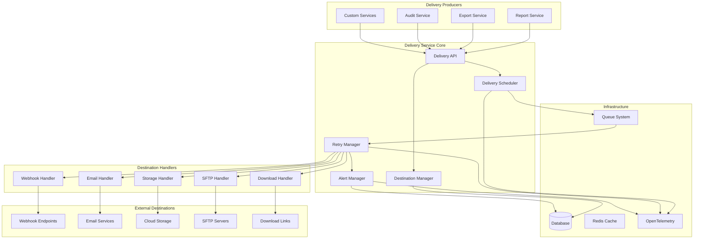

# Design Document

## Overview

The Audit Delivery Service is a comprehensive, enterprise-grade delivery system that enables reliable delivery of reports, data exports, and any exportable objects to multiple destination types. The service is designed to integrate seamlessly with the existing audit package architecture, leveraging the EnhancedAuditDatabaseClient and following established patterns for database operations, error handling, and observability.

The system provides a producer-consumer architecture where delivery producers (report generators, export services, etc.) can submit delivery requests through a simple API, while the delivery service handles the complexity of destination management, retry logic, failure handling, and observability.

## Architecture

### High-Level Architecture



### Service Layer Architecture

The delivery service follows a layered architecture pattern:

1. **API Layer**: Provides the public interface for delivery operations
2. **Service Layer**: Contains business logic for delivery orchestration
3. **Handler Layer**: Implements destination-specific delivery logic
4. **Infrastructure Layer**: Manages database operations, queuing, and observability

## Components and Interfaces

### Core Components

#### 1. DeliveryService

The main service class that orchestrates delivery operations.

```typescript
interface DeliveryService {
	// Destination management
	createDestination(input: CreateDeliveryDestinationInput): Promise<DeliveryDestination>
	updateDestination(id: string, input: UpdateDeliveryDestinationInput): Promise<DeliveryDestination>
	deleteDestination(id: string): Promise<void>
	getDestination(id: string): Promise<DeliveryDestination | null>
	listDestinations(
		options: DeliveryDestinationListOptions
	): Promise<DeliveryDestinationListResponse>

	// Delivery operations
	deliver(request: DeliveryRequest): Promise<DeliveryResponse>
	retryDelivery(deliveryId: string): Promise<DeliveryResponse>
	getDeliveryStatus(deliveryId: string): Promise<DeliveryStatus>
	listDeliveries(options: DeliveryListOptions): Promise<DeliveryListResponse>

	// Health and monitoring
	getDestinationHealth(destinationId: string): Promise<DestinationHealth>
	getDeliveryMetrics(options: MetricsOptions): Promise<DeliveryMetrics>
}
```

#### 2. DestinationManager

Manages destination configurations and validation.

```typescript
interface DestinationManager {
	validateDestination(destination: DeliveryDestination): Promise<ValidationResult>
	testConnection(destination: DeliveryDestination): Promise<ConnectionTestResult>
	getDestinationHandler(type: DestinationType): DestinationHandler
	updateDestinationHealth(destinationId: string, health: HealthStatus): Promise<void>
}
```

#### 3. DeliveryScheduler

Handles delivery scheduling and queue management.

```typescript
interface DeliveryScheduler {
	scheduleDelivery(request: DeliveryRequest): Promise<string>
	scheduleRetry(deliveryId: string, delay: number): Promise<void>
	processDeliveryQueue(): Promise<void>
	getQueueStatus(): Promise<QueueStatus>
}
```

#### 4. RetryManager

Implements retry logic with exponential backoff.

```typescript
interface RetryManager {
	shouldRetry(attempt: DeliveryAttempt): boolean
	calculateBackoff(attemptCount: number): number
	recordAttempt(deliveryId: string, attempt: DeliveryAttempt): Promise<void>
	getRetrySchedule(deliveryId: string): Promise<RetrySchedule>
}
```

#### 5. DestinationHandler Interface

Base interface for all destination-specific handlers.

```typescript
interface DestinationHandler {
	readonly type: DestinationType

	validateConfig(config: DestinationConfig): ValidationResult
	testConnection(config: DestinationConfig): Promise<ConnectionTestResult>
	deliver(payload: DeliveryPayload, config: DestinationConfig): Promise<DeliveryResult>
	supportsFeature(feature: DeliveryFeature): boolean
}
```

### Destination Handlers

#### 1. WebhookHandler

Handles HTTP webhook deliveries with signature verification.

```typescript
class WebhookHandler implements DestinationHandler {
	readonly type = 'webhook'

	// Implements webhook-specific delivery logic
	// - HTTP request with configurable method, headers, timeout
	// - HMAC-SHA256 signature generation
	// - Idempotency key generation
	// - Timestamp headers
	// - Response validation
}
```

#### 2. EmailHandler

Handles email deliveries through various providers.

```typescript
class EmailHandler implements DestinationHandler {
	readonly type = 'email'

	// Supports multiple email providers:
	// - SMTP (direct)
	// - SendGrid API
	// - Resend API
	// - AWS SES
	// - Custom providers via configuration
}
```

#### 3. StorageHandler

Handles cloud storage deliveries.

```typescript
class StorageHandler implements DestinationHandler {
	readonly type = 'storage'

	// Supports multiple storage providers:
	// - AWS S3
	// - Azure Blob Storage
	// - Google Cloud Storage
	// - Local filesystem
}
```

#### 4. SftpHandler

Handles SFTP file transfers.

```typescript
class SftpHandler implements DestinationHandler {
	readonly type = 'sftp'

	// Implements secure file transfer:
	// - SSH key authentication
	// - Password authentication
	// - Directory creation
	// - File permissions
}
```

#### 5. DownloadHandler

Generates secure download links.

```typescript
class DownloadHandler implements DestinationHandler {
	readonly type = 'download'

	// Generates time-limited download URLs:
	// - Signed URLs with expiration
	// - Access logging
	// - Download tracking
}
```

## Data Models

### Enhanced Database Schema

The service leverages existing database tables and adds new ones for comprehensive delivery tracking:

#### Delivery Destinations Table (Existing)

```sql
-- Already exists in packages/audit-db/src/db/schema.ts
-- Enhanced with additional fields for failure tracking and health monitoring
```

#### Delivery Logs Table (Existing)

```sql
-- Already exists in packages/audit-db/src/db/schema.ts
-- Enhanced with structured attempt tracking and cross-system references
```

#### New Tables

##### Delivery Queue Table

```typescript
export const deliveryQueue = pgTable('delivery_queue', {
	id: varchar('id', { length: 255 }).primaryKey(),
	organizationId: varchar('organization_id', { length: 255 }).notNull(),
	destinationId: integer('destination_id').notNull(),
	payload: jsonb('payload').notNull(),
	priority: integer('priority').notNull().default(0),
	scheduledAt: timestamp('scheduled_at', { withTimezone: true, mode: 'string' }).notNull(),
	processedAt: timestamp('processed_at', { withTimezone: true, mode: 'string' }),
	status: varchar('status', { length: 20 }).notNull().default('pending'),
	metadata: jsonb('metadata').notNull().default('{}'),
	createdAt: timestamp('created_at', { withTimezone: true, mode: 'string' }).notNull().defaultNow(),
})
```

##### Destination Health Table

```typescript
export const destinationHealth = pgTable('destination_health', {
	destinationId: integer('destination_id').primaryKey(),
	status: varchar('status', { length: 20 }).notNull(), // healthy, degraded, unhealthy, disabled
	lastCheckAt: timestamp('last_check_at', { withTimezone: true, mode: 'string' }).notNull(),
	consecutiveFailures: integer('consecutive_failures').notNull().default(0),
	totalFailures: integer('total_failures').notNull().default(0),
	totalDeliveries: integer('total_deliveries').notNull().default(0),
	averageResponseTime: integer('average_response_time'), // milliseconds
	lastFailureAt: timestamp('last_failure_at', { withTimezone: true, mode: 'string' }),
	lastSuccessAt: timestamp('last_success_at', { withTimezone: true, mode: 'string' }),
	disabledAt: timestamp('disabled_at', { withTimezone: true, mode: 'string' }),
	disabledReason: text('disabled_reason'),
	metadata: jsonb('metadata').notNull().default('{}'),
	updatedAt: timestamp('updated_at', { withTimezone: true, mode: 'string' }).notNull().defaultNow(),
})
```

##### Webhook Secrets Table

```typescript
export const webhookSecrets = pgTable('webhook_secrets', {
	id: varchar('id', { length: 255 }).primaryKey(),
	destinationId: integer('destination_id').notNull(),
	secretKey: varchar('secret_key', { length: 255 }).notNull(), // encrypted
	algorithm: varchar('algorithm', { length: 50 }).notNull().default('HMAC-SHA256'),
	isActive: varchar('is_active', { length: 10 }).notNull().default('true'),
	expiresAt: timestamp('expires_at', { withTimezone: true, mode: 'string' }),
	createdAt: timestamp('created_at', { withTimezone: true, mode: 'string' }).notNull().defaultNow(),
})
```

### Core Data Types

#### DeliveryRequest

```typescript
interface DeliveryRequest {
	organizationId: string
	destinations: string[] | 'default' // destination IDs or use default destinations
	payload: {
		type: 'report' | 'export' | 'data' | 'custom'
		data: any // the actual content to deliver
		metadata: Record<string, any>
	}
	options?: {
		priority?: number // 0-10, higher = more priority
		idempotencyKey?: string
		correlationId?: string
		tags?: string[]
	}
}
```

#### DeliveryResponse

```typescript
interface DeliveryResponse {
	deliveryId: string
	status: 'queued' | 'processing' | 'completed' | 'failed'
	destinations: {
		destinationId: string
		status: 'pending' | 'delivered' | 'failed' | 'retrying'
		deliveryLogId?: string
	}[]
	queuedAt: string
	estimatedDeliveryTime?: string
}
```

## Error Handling

### Error Categories

1. **Configuration Errors**: Invalid destination configurations, missing credentials
2. **Network Errors**: Connection timeouts, DNS failures, network unreachability
3. **Authentication Errors**: Invalid credentials, expired tokens, permission denied
4. **Rate Limiting**: API rate limits exceeded, temporary throttling
5. **Validation Errors**: Invalid payload format, size limits exceeded
6. **System Errors**: Database failures, queue system issues, internal errors

### Error Handling Strategy

#### Retry Logic

- **Exponential Backoff**: Starting at 1 second, doubling each attempt up to 5 minutes
- **Jitter**: Random variation to prevent thundering herd
- **Circuit Breaker**: Temporary disable destinations after consecutive failures
- **Dead Letter Queue**: Permanently failed deliveries for manual investigation

#### Error Recovery

```typescript
interface RetryConfig {
	maxAttempts: number // default: 5
	initialDelay: number // default: 1000ms
	maxDelay: number // default: 300000ms (5 minutes)
	backoffMultiplier: number // default: 2
	jitterFactor: number // default: 0.1
}

interface CircuitBreakerConfig {
	failureThreshold: number // default: 10
	recoveryTimeout: number // default: 300000ms (5 minutes)
	halfOpenMaxCalls: number // default: 3
}
```

### Error Monitoring and Alerting

#### Alert Conditions

1. **High Failure Rate**: >10% failure rate over 15 minutes
2. **Consecutive Failures**: >5 consecutive failures for a destination
3. **Queue Backlog**: >1000 pending deliveries
4. **Response Time**: Average response time >30 seconds
5. **Circuit Breaker**: Destination circuit breaker opened

#### Alert Debouncing

- **Time Window**: 15-minute sliding window for rate-based alerts
- **Cooldown Period**: 1-hour cooldown after alert resolution
- **Escalation**: Progressive escalation after 1 hour, 4 hours, 24 hours

## Testing Strategy

### Unit Testing

#### Service Layer Tests

- Destination CRUD operations
- Delivery request validation
- Retry logic verification
- Error handling scenarios

#### Handler Tests

- Each destination handler independently
- Configuration validation
- Connection testing
- Delivery success/failure scenarios
- Authentication mechanisms

### Integration Testing

#### Database Integration

- Database operations with real EnhancedAuditDatabaseClient
- Transaction handling
- Concurrent access scenarios
- Data consistency verification

#### External Service Integration

- Mock external services (webhooks, email providers, storage)
- Network failure simulation
- Authentication failure scenarios
- Rate limiting behavior

### End-to-End Testing

#### Delivery Workflows

- Complete delivery lifecycle from request to completion
- Multi-destination fanout scenarios
- Retry and failure recovery
- Alert generation and resolution

#### Performance Testing

- High-volume delivery scenarios
- Concurrent delivery processing
- Queue performance under load
- Database performance optimization

### Test Data Management

#### Test Fixtures

- Sample destination configurations for each type
- Test payloads of various sizes and formats
- Mock external service responses
- Error scenario simulations

#### Test Environment

- Isolated test database with sample data
- Mock external services with configurable responses
- Test-specific configuration overrides
- Cleanup procedures for test isolation

## Implementation Phases

### Phase 1: Core Infrastructure (Week 1-2)

- Database schema enhancements
- Core service interfaces
- Basic destination management
- Simple delivery queue

### Phase 2: Destination Handlers (Week 3-4)

- Webhook handler with signature support
- Email handler with SMTP support
- Basic storage handler (S3)
- Connection testing framework

### Phase 3: Reliability Features (Week 5-6)

- Retry mechanism with exponential backoff
- Circuit breaker implementation
- Health monitoring system
- Basic alerting

### Phase 4: Advanced Features (Week 7-8)

- Multi-provider email support
- SFTP handler
- Download link generation
- Webhook secret rotation

### Phase 5: Observability & Management (Week 9-10)

- OpenTelemetry integration
- Management UI components
- Advanced alerting and debouncing
- Performance optimization

### Phase 6: Production Readiness (Week 11-12)

- Comprehensive testing
- Documentation
- Security audit
- Performance benchmarking
