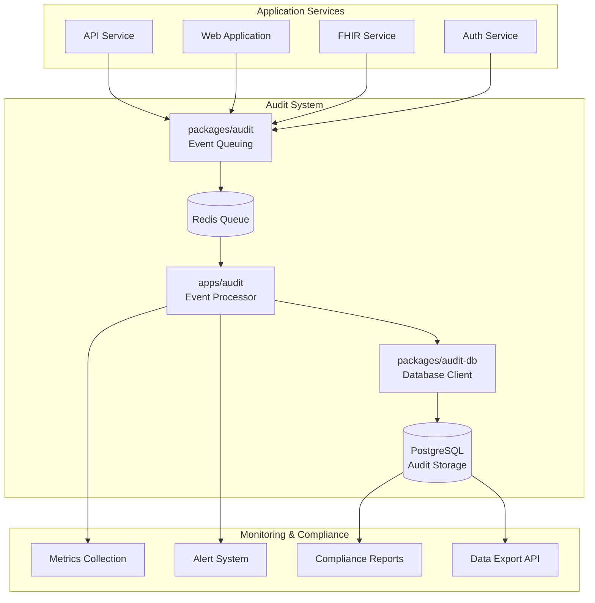

# Design Document

## Overview

The audit system enhancement design builds upon the existing three-tier architecture to create a production-ready, HIPAA and GDPR compliant audit logging system. The enhanced system will provide immutable audit logs with cryptographic integrity, comprehensive event tracking, reliable processing with guaranteed delivery, real-time monitoring, and standardized APIs for system-wide integration.

The design maintains the current architecture while adding critical compliance, security, and reliability features:

- **packages/audit-db**: Enhanced with cryptographic verification, data retention policies, and optimized querying
- **packages/audit**: Extended with standardized schemas, integrity verification, and comprehensive event types
- **apps/audit**: Upgraded with reliable processing, monitoring, alerting, and GDPR compliance features

## Architecture

### High-Level Architecture



### Enhanced Component Architecture

#### 1. Enhanced packages/audit-db

**Current State**: Basic PostgreSQL client with Drizzle ORM and audit log schema
**Enhancements**:

- Cryptographic hash verification functions
- Data retention and archival policies
- Optimized indexing for compliance queries
- GDPR-compliant pseudonymization utilities
- Performance monitoring and query optimization

#### 2. Enhanced packages/audit

**Current State**: Redis/BullMQ event queuing with basic audit event types
**Enhancements**:

- Comprehensive standardized event schemas
- Automatic cryptographic hash generation
- Event validation and sanitization
- Extensible event type system
- SDK with comprehensive documentation

#### 3. Enhanced apps/audit

**Current State**: Basic BullMQ worker processing events to PostgreSQL
**Enhancements**:

- Guaranteed delivery with retry mechanisms
- Real-time monitoring and alerting
- GDPR compliance processing
- Performance optimization
- Health monitoring and observability

## Components and Interfaces

### 1. Enhanced Audit Event Schema

```typescript
interface EnhancedAuditLogEvent extends AuditLogEvent {
	// Cryptographic integrity
	hash: string
	hashAlgorithm: 'SHA-256'

	// Enhanced metadata
	eventVersion: string
	correlationId?: string
	sessionContext?: SessionContext

	// Compliance fields
	dataClassification: 'PUBLIC' | 'INTERNAL' | 'CONFIDENTIAL' | 'PHI'
	retentionPolicy: string

	// Performance tracking
	processingLatency?: number
	queueDepth?: number
}

interface SessionContext {
	sessionId: string
	ipAddress: string
	userAgent: string
	geolocation?: string
}
```

### 2. Cryptographic Integrity Service

```typescript
interface CryptographicService {
	generateHash(event: AuditLogEvent): string
	verifyHash(event: AuditLogEvent, expectedHash: string): boolean
	generateEventSignature(event: AuditLogEvent): string
	verifyEventSignature(event: AuditLogEvent, signature: string): boolean
}
```

### 3. Compliance Service Interface

```typescript
interface ComplianceService {
	// GDPR compliance
	exportUserData(principalId: string): Promise<AuditDataExport>
	pseudonymizeUserData(principalId: string): Promise<void>

	// Data retention
	applyRetentionPolicy(policy: RetentionPolicy): Promise<void>
	archiveExpiredData(): Promise<void>

	// Reporting
	generateComplianceReport(criteria: ReportCriteria): Promise<ComplianceReport>
}
```

### 4. Monitoring and Alerting Interface

```typescript
interface MonitoringService {
	// Real-time monitoring
	trackEventProcessing(event: AuditLogEvent): void
	monitorSystemHealth(): Promise<HealthStatus>

	// Alerting
	detectSuspiciousPatterns(events: AuditLogEvent[]): Promise<Alert[]>
	sendAlert(alert: Alert): Promise<void>

	// Metrics
	emitMetrics(metrics: AuditMetrics): void
}
```

### 5. Enhanced Database Schema

```sql
-- Enhanced audit_log table with additional compliance fields
ALTER TABLE audit_log ADD COLUMN IF NOT EXISTS hash_algorithm VARCHAR(50) DEFAULT 'SHA-256';
ALTER TABLE audit_log ADD COLUMN IF NOT EXISTS event_version VARCHAR(20) DEFAULT '1.0';
ALTER TABLE audit_log ADD COLUMN IF NOT EXISTS correlation_id VARCHAR(255);
ALTER TABLE audit_log ADD COLUMN IF NOT EXISTS data_classification VARCHAR(20) DEFAULT 'INTERNAL';
ALTER TABLE audit_log ADD COLUMN IF NOT EXISTS retention_policy VARCHAR(50) DEFAULT 'standard';
ALTER TABLE audit_log ADD COLUMN IF NOT EXISTS processing_latency INTEGER;
ALTER TABLE audit_log ADD COLUMN IF NOT EXISTS archived_at TIMESTAMP WITH TIME ZONE;

-- Integrity verification table
CREATE TABLE audit_integrity_log (
  id SERIAL PRIMARY KEY,
  audit_log_id INTEGER REFERENCES audit_log(id),
  verification_timestamp TIMESTAMP WITH TIME ZONE DEFAULT NOW(),
  verification_status VARCHAR(20) NOT NULL,
  verification_details JSONB,
  verified_by VARCHAR(255)
);

-- Data retention tracking
CREATE TABLE audit_retention_policy (
  id SERIAL PRIMARY KEY,
  policy_name VARCHAR(100) UNIQUE NOT NULL,
  retention_days INTEGER NOT NULL,
  archive_after_days INTEGER,
  delete_after_days INTEGER,
  created_at TIMESTAMP WITH TIME ZONE DEFAULT NOW()
);
```

## Data Models

### 1. Enhanced Audit Event Types

```typescript
// System-wide audit event types
export type SystemAuditAction =
	| 'system.startup'
	| 'system.shutdown'
	| 'system.configuration.change'
	| 'system.backup.created'
	| 'system.backup.restored'
	| 'system.maintenance.started'
	| 'system.maintenance.completed'

// Authentication audit events
export type AuthAuditAction =
	| 'auth.login.attempt'
	| 'auth.login.success'
	| 'auth.login.failure'
	| 'auth.logout'
	| 'auth.password.change'
	| 'auth.mfa.enabled'
	| 'auth.mfa.disabled'
	| 'auth.session.expired'

// Data access audit events
export type DataAuditAction =
	| 'data.read'
	| 'data.create'
	| 'data.update'
	| 'data.delete'
	| 'data.export'
	| 'data.import'
	| 'data.share'
	| 'data.anonymize'

// FHIR-specific audit events
export type FHIRAuditAction =
	| 'fhir.patient.read'
	| 'fhir.patient.create'
	| 'fhir.patient.update'
	| 'fhir.practitioner.read'
	| 'fhir.observation.create'
	| 'fhir.bundle.process'
```

### 2. Alert and Monitoring Models

```typescript
interface Alert {
	id: string
	severity: 'LOW' | 'MEDIUM' | 'HIGH' | 'CRITICAL'
	type: 'SECURITY' | 'COMPLIANCE' | 'PERFORMANCE' | 'SYSTEM'
	title: string
	description: string
	timestamp: string
	source: string
	metadata: Record<string, any>
	resolved: boolean
	resolvedAt?: string
	resolvedBy?: string
}

interface AuditMetrics {
	eventsProcessed: number
	processingLatency: number
	queueDepth: number
	errorRate: number
	integrityViolations: number
	timestamp: string
}
```

## Error Handling

### 1. Retry Strategy

```typescript
interface RetryConfig {
	maxRetries: number
	backoffStrategy: 'exponential' | 'linear' | 'fixed'
	baseDelay: number
	maxDelay: number
	retryableErrors: string[]
}

const defaultRetryConfig: RetryConfig = {
	maxRetries: 5,
	backoffStrategy: 'exponential',
	baseDelay: 1000,
	maxDelay: 30000,
	retryableErrors: ['ECONNRESET', 'ETIMEDOUT', 'ENOTFOUND'],
}
```

### 2. Dead Letter Queue Handling

```typescript
interface DeadLetterHandler {
	processFailedEvent(event: AuditLogEvent, error: Error): Promise<void>
	alertAdministrators(event: AuditLogEvent, error: Error): Promise<void>
	archiveFailedEvent(event: AuditLogEvent): Promise<void>
}
```

### 3. Circuit Breaker Pattern

```typescript
interface CircuitBreaker {
	state: 'CLOSED' | 'OPEN' | 'HALF_OPEN'
	failureThreshold: number
	recoveryTimeout: number
	execute<T>(operation: () => Promise<T>): Promise<T>
}
```

## Testing Strategy

### 1. Unit Testing

- **Cryptographic Functions**: Test hash generation and verification
- **Event Validation**: Test schema validation and sanitization
- **Database Operations**: Test CRUD operations and integrity checks
- **Retry Logic**: Test retry mechanisms and backoff strategies

### 2. Integration Testing

- **End-to-End Flow**: Test complete audit event lifecycle
- **Database Integration**: Test PostgreSQL operations with real database
- **Redis Integration**: Test queue operations with real Redis instance
- **Monitoring Integration**: Test metrics collection and alerting

### 3. Compliance Testing

- **HIPAA Compliance**: Verify audit trail completeness and integrity
- **GDPR Compliance**: Test data export and pseudonymization
- **Data Retention**: Test archival and deletion policies
- **Integrity Verification**: Test cryptographic verification

### 4. Performance Testing

- **Load Testing**: Test system under high audit event volume
- **Stress Testing**: Test system behavior at breaking points
- **Latency Testing**: Measure and optimize processing latency
- **Scalability Testing**: Test horizontal scaling capabilities

### 5. Security Testing

- **Penetration Testing**: Test for security vulnerabilities
- **Integrity Testing**: Verify tamper detection capabilities
- **Access Control**: Test unauthorized access prevention
- **Encryption Testing**: Verify data protection in transit and at rest

### 6. Disaster Recovery Testing

- **Backup and Restore**: Test audit data backup and recovery
- **Failover Testing**: Test system behavior during component failures
- **Data Consistency**: Verify data integrity during recovery scenarios
