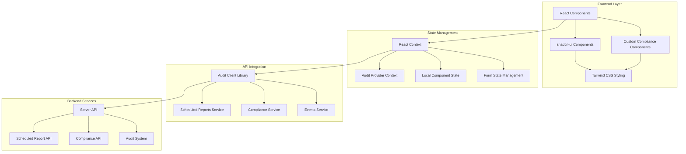
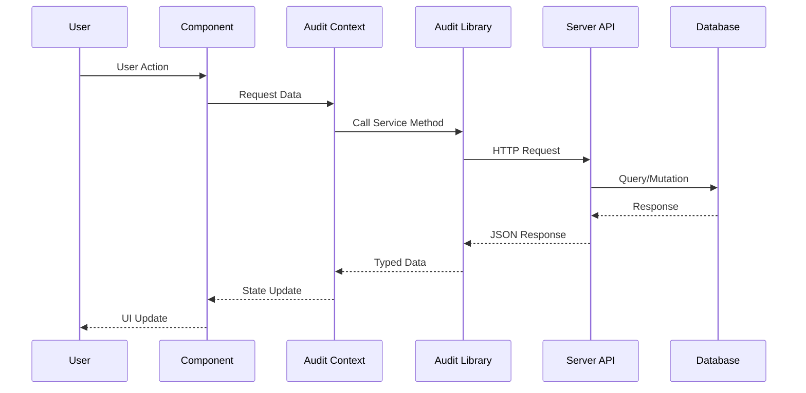

# Design Document

## Overview

The compliance reports user interface is a comprehensive React-based web application that provides healthcare compliance officers and administrators with a modern, accessible interface for managing compliance reports. The system integrates with the existing audit client library, server APIs, and audit system to deliver a seamless experience for creating, scheduling, monitoring, and analyzing compliance reports.

The interface follows a component-driven architecture using React 18, TypeScript, shadcn-ui components, and Tailwind CSS, ensuring consistency with the existing SMEDREC platform design system. The application leverages TanStack Router for client-side routing and integrates with the existing audit context provider for seamless API communication.

## Architecture

### High-Level Architecture



### Component Architecture

The UI follows a hierarchical component structure with clear separation of concerns:

1. **Page Components**: Route-level components that orchestrate data fetching and layout
2. **Feature Components**: Business logic components for specific compliance features
3. **UI Components**: Reusable shadcn-ui based components for consistent styling
4. **Form Components**: Specialized form components for report configuration
5. **Data Display Components**: Tables, cards, and visualization components

### Data Flow Architecture



## Components and Interfaces

### Core Page Components

#### 1. Compliance Dashboard (`/compliance`)

- **Purpose**: Main landing page providing overview of compliance status
- **Components**:
  - `ComplianceDashboard`: Main dashboard container
  - `DashboardStats`: Key metrics and statistics
  - `RecentExecutions`: Recent report execution summary
  - `UpcomingReports`: Next scheduled reports
  - `SystemHealth`: Audit system status indicators

#### 2. Scheduled Reports Management (`/compliance/scheduled-reports`)

- **Purpose**: Comprehensive management interface for scheduled reports
- **Components**:
  - `ScheduledReportsPage`: Main page container
  - `ReportsDataTable`: Advanced data table with filtering and sorting
  - `ReportCard`: Individual report display card
  - `BulkActions`: Bulk operation controls
  - `CreateReportDialog`: Modal for creating new reports

#### 3. Report Configuration (`/compliance/scheduled-reports/create`, `/compliance/scheduled-reports/[id]/edit`)

- **Purpose**: Form-based interface for creating and editing scheduled reports
- **Components**:
  - `ReportConfigurationForm`: Main form container
  - `ReportTypeSelector`: Report type selection component
  - `CriteriaBuilder`: Dynamic criteria configuration
  - `ScheduleBuilder`: Visual schedule configuration
  - `DeliveryConfiguration`: Delivery method setup
  - `PreviewPanel`: Configuration preview and validation

#### 4. Execution History (`/compliance/scheduled-reports/[id]/executions`)

- **Purpose**: Detailed view of report execution history and status
- **Components**:
  - `ExecutionHistoryPage`: Main history page
  - `ExecutionTimeline`: Visual timeline of executions
  - `ExecutionDetails`: Detailed execution information
  - `ExecutionLogs`: Execution logs and error details
  - `DownloadActions`: Report download and export options

### Feature Components

#### Report Management Components

```typescript
// Core report management interfaces
interface ReportManagementProps {
	organizationId: string
	onReportCreated?: (report: ScheduledReport) => void
	onReportUpdated?: (report: ScheduledReport) => void
	onReportDeleted?: (reportId: string) => void
}

interface ReportFilters {
	reportType?: ReportType[]
	status?: ('enabled' | 'disabled')[]
	createdBy?: string[]
	tags?: string[]
	dateRange?: {
		startDate: string
		endDate: string
	}
}
```

#### Form Components

```typescript
// Report configuration form interfaces
interface ReportConfigurationFormProps {
	initialData?: Partial<CreateScheduledReportInput>
	mode: 'create' | 'edit'
	onSubmit: (data: CreateScheduledReportInput | UpdateScheduledReportInput) => Promise<void>
	onCancel: () => void
}

interface ScheduleBuilderProps {
	value: ScheduleConfig
	onChange: (schedule: ScheduleConfig) => void
	errors?: Record<string, string>
}
```

### UI Component Library

#### Data Display Components

1. **ReportsDataTable**
   - Advanced filtering and sorting capabilities
   - Bulk selection and operations
   - Responsive design with mobile-friendly layouts
   - Export functionality for report lists

2. **ExecutionStatusBadge**
   - Visual status indicators for execution states
   - Color-coded status representation
   - Tooltip with detailed status information

3. **ReportMetricsCard**
   - Key performance indicators display
   - Success/failure rate visualization
   - Execution frequency statistics

#### Form Components

1. **CriteriaBuilder**
   - Dynamic form builder for report criteria
   - Conditional field rendering based on report type
   - Real-time validation and preview

2. **ScheduleBuilder**
   - Visual cron expression builder
   - Timezone selection and preview
   - Next execution time calculation

3. **DeliveryMethodSelector**
   - Multi-step delivery configuration
   - Method-specific configuration panels
   - Validation for delivery settings

#### Navigation and Layout

1. **ComplianceNavigation**
   - Sidebar navigation for compliance sections
   - Active route highlighting
   - Breadcrumb navigation support

2. **PageHeader**
   - Consistent page headers with actions
   - Search and filter controls
   - Responsive layout adaptation

## Data Models

### Frontend Data Models

The frontend uses TypeScript interfaces that mirror the audit client library types:

```typescript
// Core scheduled report interface
interface ScheduledReportUI extends ScheduledReport {
	// Additional UI-specific properties
	isLoading?: boolean
	hasErrors?: boolean
	lastExecutionStatus?: ExecutionStatus
	nextExecutionFormatted?: string
}

// Form state management
interface ReportFormState {
	data: Partial<CreateScheduledReportInput>
	errors: Record<string, string>
	touched: Record<string, boolean>
	isSubmitting: boolean
	isDirty: boolean
}

// Filter and pagination state
interface ReportsListState {
	reports: ScheduledReportUI[]
	filters: ReportFilters
	pagination: PaginationState
	selection: string[]
	loading: boolean
	error?: string
}
```

### API Integration Models

```typescript
// API response handling
interface ApiResponse<T> {
	data: T
	pagination?: PaginationMetadata
	summary?: Record<string, any>
}

// Error handling
interface UIError {
	code: string
	message: string
	field?: string
	details?: Record<string, any>
}
```

## Error Handling

### Error Handling Strategy

The application implements a comprehensive error handling strategy with multiple layers:

1. **API Level**: Audit client library handles network errors, retries, and API-specific errors
2. **Service Level**: React context providers handle service-level errors and state management
3. **Component Level**: Individual components handle UI-specific errors and validation
4. **Global Level**: Application-wide error boundary for unhandled errors

### Error Display Components

```typescript
// Error display interfaces
interface ErrorBoundaryProps {
	fallback?: React.ComponentType<{ error: Error; resetError: () => void }>
	onError?: (error: Error, errorInfo: ErrorInfo) => void
}

interface ErrorAlertProps {
	error: UIError
	onDismiss?: () => void
	onRetry?: () => void
	variant?: 'destructive' | 'warning' | 'info'
}
```

### Validation Strategy

Form validation uses a multi-layered approach:

1. **Client-side validation**: Real-time validation using Zod schemas
2. **Server-side validation**: Backend validation with detailed error responses
3. **Business logic validation**: Domain-specific validation rules
4. **Cross-field validation**: Complex validation across multiple form fields

## Testing Strategy

### Component Testing

1. **Unit Tests**: Individual component testing with React Testing Library
2. **Integration Tests**: Component interaction testing with mock API responses
3. **Accessibility Tests**: Automated accessibility testing with jest-axe
4. **Visual Regression Tests**: Screenshot-based testing for UI consistency

### API Integration Testing

1. **Mock API Tests**: Testing with mocked audit client responses
2. **Contract Tests**: Ensuring frontend-backend API compatibility
3. **Error Scenario Tests**: Testing error handling and recovery flows

### End-to-End Testing

1. **User Journey Tests**: Complete workflow testing from creation to execution
2. **Cross-browser Tests**: Compatibility testing across different browsers
3. **Performance Tests**: Load testing and performance monitoring

## Performance Considerations

### Optimization Strategies

1. **Code Splitting**: Route-based code splitting for faster initial load
2. **Lazy Loading**: Component lazy loading for non-critical features
3. **Memoization**: React.memo and useMemo for expensive computations
4. **Virtual Scrolling**: For large data tables and lists
5. **Caching**: Intelligent caching of API responses and computed data

### Bundle Optimization

```typescript
// Lazy loading example
const ReportConfigurationForm = lazy(() => import('./components/forms/ReportConfigurationForm'))

const ExecutionHistoryPage = lazy(() => import('./pages/ExecutionHistoryPage'))
```

### Data Fetching Optimization

1. **Pagination**: Server-side pagination for large datasets
2. **Filtering**: Server-side filtering to reduce data transfer
3. **Debouncing**: Search input debouncing to reduce API calls
4. **Background Refresh**: Automatic data refresh for real-time updates

## Security Considerations

### Authentication and Authorization

1. **Session Management**: Integration with existing Better Auth system
2. **Role-based Access**: Component-level access control based on user roles
3. **API Security**: Secure API communication with proper authentication headers
4. **CSRF Protection**: Cross-site request forgery protection

### Data Protection

1. **Input Sanitization**: Proper sanitization of user inputs
2. **XSS Prevention**: Content Security Policy and input validation
3. **Sensitive Data Handling**: Secure handling of compliance data
4. **Audit Logging**: Comprehensive audit logging of user actions

### Compliance Security

```typescript
// Security context interface
interface SecurityContext {
	user: User
	permissions: Permission[]
	organization: Organization
	canCreateReports: boolean
	canEditReports: boolean
	canDeleteReports: boolean
	canViewExecutions: boolean
}
```

## Accessibility Features

### WCAG 2.1 AA Compliance

1. **Keyboard Navigation**: Full keyboard accessibility for all interactive elements
2. **Screen Reader Support**: Proper ARIA labels and semantic markup
3. **Color Contrast**: High contrast color schemes for better visibility
4. **Focus Management**: Logical focus order and visible focus indicators
5. **Alternative Text**: Descriptive alt text for images and icons

### Responsive Design

1. **Mobile-First**: Mobile-first responsive design approach
2. **Touch Targets**: Appropriate touch target sizes for mobile devices
3. **Flexible Layouts**: Flexible grid layouts that adapt to different screen sizes
4. **Progressive Enhancement**: Core functionality works without JavaScript

## Integration Points

### Audit Client Library Integration

The UI integrates with the audit client library through the existing audit context provider:

```typescript
// Audit context integration
interface AuditContextValue {
	client: AuditClient
	isConnected: boolean
	error?: string
	retry: () => void
}

// Service integration
const useScheduledReports = () => {
	const { client } = useAuditContext()
	return client.scheduledReports
}
```

### Server API Compatibility

The frontend ensures compatibility with the server API through:

1. **Type Safety**: Shared TypeScript types between frontend and backend
2. **Schema Validation**: Zod schema validation for API requests and responses
3. **Error Handling**: Consistent error handling across API endpoints
4. **Versioning**: API versioning support for backward compatibility

### Existing Component Integration

The new compliance components integrate with existing UI components:

1. **Design System**: Consistent use of shadcn-ui components and Tailwind CSS
2. **Navigation**: Integration with existing sidebar and navigation components
3. **Authentication**: Integration with existing auth provider and session management
4. **Theming**: Support for existing light/dark theme system

## Deployment Considerations

### Build Configuration

1. **Environment Variables**: Proper environment variable configuration for different environments
2. **Asset Optimization**: Image optimization and compression
3. **Bundle Analysis**: Regular bundle size analysis and optimization
4. **Progressive Web App**: PWA features for offline functionality

### Monitoring and Analytics

1. **Error Tracking**: Integration with error tracking services
2. **Performance Monitoring**: Real user monitoring and performance metrics
3. **Usage Analytics**: User interaction tracking for UX improvements
4. **Accessibility Monitoring**: Automated accessibility monitoring and reporting
