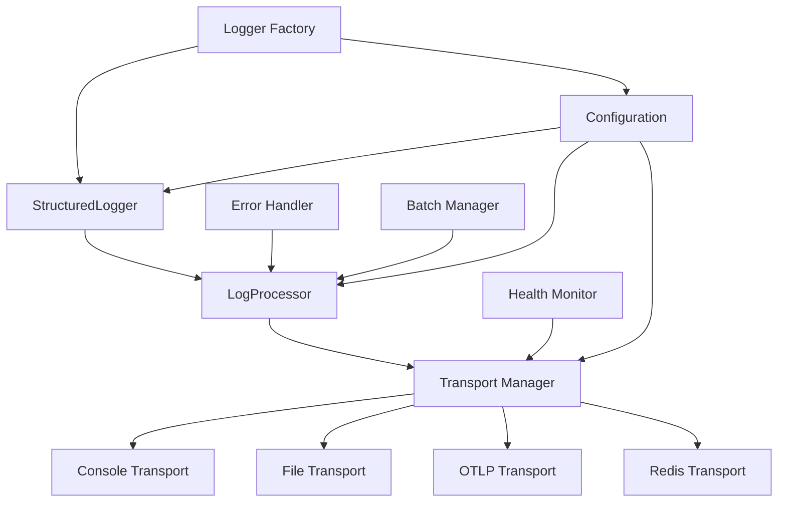

# Design Document

## Overview

This design document outlines the implementation of the LogProcessor component that will integrate multiple transports with the StructuredLogger, replacing the deprecated `logging.ts` file. The LogProcessor will serve as the central hub for distributing log entries to multiple configured transports (Console, File, OTLP, Redis) while providing proper error handling, health monitoring, and performance optimization.

The design emphasizes configuration-driven transport setup, allowing developers to pass complete configuration objects when creating StructuredLogger instances, eliminating the need for file-based configuration loading in simple use cases.

## Architecture

### Core Components Integration



### Component Responsibilities

1. **LogProcessor**: Central log processing engine that distributes entries to transports
2. **Transport Manager**: Manages transport lifecycle, health monitoring, and routing
3. **Logger Factory**: Provides convenient methods for creating pre-configured loggers
4. **Configuration Integration**: Seamless integration with existing configuration system
5. **Health Monitoring**: Real-time transport health tracking and automatic recovery

## Components and Interfaces

### LogProcessor Interface

```typescript
interface LogProcessor {
	// Core processing
	processLogEntry(entry: LogEntry): Promise<void>

	// Transport management
	addTransport(transport: LogTransport): void
	removeTransport(name: string): void
	getTransports(): LogTransport[]

	// Health and monitoring
	getHealthStatus(): TransportHealthStatus[]
	isHealthy(): boolean

	// Lifecycle management
	flush(): Promise<void>
	close(): Promise<void>
}

interface TransportHealthStatus {
	name: string
	healthy: boolean
	lastError?: Error
	lastSuccessTime?: Date
	lastFailureTime?: Date
}
```

### Enhanced StructuredLogger Integration

```typescript
class StructuredLogger implements InternalLogger {
	private readonly processor: LogProcessor

	constructor(
		config: {
			minLevel?: LogLevel | LogLevelType
			service: string
			environment: string
			version?: string
			// Transport configurations
			console?: ConsoleConfig
			file?: FileConfig
			otlp?: OTLPConfig
			redis?: RedisConfig
			// Processing options
			batch?: BatchConfig
			retry?: RetryConfig
		},
		metadata?: Partial<LogMetadata>
	) {
		// Initialize LogProcessor with configured transports
		this.processor = this.createLogProcessor(config)
		// ... existing initialization
	}

	private createLogProcessor(config: any): LogProcessor {
		const processor = new DefaultLogProcessor({
			batch: config.batch,
			retry: config.retry,
			errorHandler: new DefaultErrorHandler(),
		})

		// Add configured transports
		if (config.console?.enabled !== false) {
			processor.addTransport(new ConsoleTransport(config.console))
		}

		if (config.file?.enabled) {
			processor.addTransport(new FileTransport(config.file))
		}

		if (config.otlp?.enabled) {
			processor.addTransport(new OTLPTransport(config.otlp))
		}

		if (config.redis?.enabled) {
			processor.addTransport(new RedisTransport(config.redis))
		}

		return processor
	}

	// Replace placeholder processLogEntry method
	private async processLogEntry(entry: LogEntry): Promise<void> {
		await this.processor.processLogEntry(entry)
	}
}
```

### LogProcessor Implementation

```typescript
class DefaultLogProcessor implements LogProcessor {
	private transports = new Map<string, LogTransport>()
	private healthStatus = new Map<string, TransportHealthStatus>()
	private batchManager?: BatchManager
	private errorHandler: ErrorHandler
	private isClosing = false

	constructor(config: LogProcessorConfig) {
		this.errorHandler = config.errorHandler

		if (config.batch) {
			this.batchManager = new DefaultBatchManager(config.batch, (entries) =>
				this.processBatch(entries)
			)
		}
	}

	async processLogEntry(entry: LogEntry): Promise<void> {
		if (this.isClosing) return

		try {
			if (this.batchManager) {
				await this.batchManager.add(entry)
			} else {
				await this.processSingleEntry(entry)
			}
		} catch (error) {
			await this.errorHandler.handleError(error, entry)
		}
	}

	private async processSingleEntry(entry: LogEntry): Promise<void> {
		const healthyTransports = this.getHealthyTransports()

		if (healthyTransports.length === 0) {
			// Fallback to emergency console logging
			console.error('All transports unhealthy, using emergency logging:', JSON.stringify(entry))
			return
		}

		// Process transports concurrently for better performance
		const promises = healthyTransports.map((transport) =>
			this.processTransportSafely(transport, [entry])
		)

		await Promise.allSettled(promises)
	}

	private async processBatch(entries: LogEntry[]): Promise<void> {
		const healthyTransports = this.getHealthyTransports()

		if (healthyTransports.length === 0) {
			console.error(`All transports unhealthy, dropping ${entries.length} log entries`)
			return
		}

		const promises = healthyTransports.map((transport) =>
			this.processTransportSafely(transport, entries)
		)

		await Promise.allSettled(promises)
	}

	private async processTransportSafely(
		transport: LogTransport,
		entries: LogEntry[]
	): Promise<void> {
		try {
			await transport.send(entries)
			this.updateTransportHealth(transport.name, true)
		} catch (error) {
			this.updateTransportHealth(transport.name, false, error as Error)
			await this.errorHandler.handleTransportError(transport.name, error, entries)
		}
	}

	private getHealthyTransports(): LogTransport[] {
		return Array.from(this.transports.values()).filter((transport) => transport.isHealthy())
	}

	private updateTransportHealth(name: string, healthy: boolean, error?: Error): void {
		const status = this.healthStatus.get(name) || {
			name,
			healthy: true,
		}

		status.healthy = healthy
		if (healthy) {
			status.lastSuccessTime = new Date()
		} else {
			status.lastFailureTime = new Date()
			status.lastError = error
		}

		this.healthStatus.set(name, status)
	}
}
```

### Logger Factory Implementation

```typescript
class LoggerFactory {
	/**
	 * Create a development logger with console output and pretty formatting
	 */
	static createDevelopmentLogger(
		service: string,
		options: {
			level?: LogLevel
			environment?: string
			enablePerformance?: boolean
		} = {}
	): StructuredLogger {
		return new StructuredLogger({
			service,
			environment: options.environment || 'development',
			minLevel: options.level || LogLevel.DEBUG,
			console: {
				enabled: true,
				format: 'pretty',
				colorize: true,
				level: options.level || LogLevel.DEBUG,
			},
			performance: {
				enabled: options.enablePerformance || true,
				sampleRate: 1.0, // Full sampling in development
			},
		})
	}

	/**
	 * Create a production logger with multiple transports
	 */
	static createProductionLogger(
		service: string,
		options: {
			level?: LogLevel
			environment?: string
			otlpEndpoint?: string
			fileConfig?: Partial<FileConfig>
			redisConfig?: Partial<RedisConfig>
		} = {}
	): StructuredLogger {
		const config: any = {
			service,
			environment: options.environment || 'production',
			minLevel: options.level || LogLevel.INFO,
			console: {
				enabled: true,
				format: 'json',
				colorize: false,
				level: options.level || LogLevel.INFO,
			},
			performance: {
				enabled: true,
				sampleRate: 0.1, // 10% sampling in production
			},
			batch: {
				maxSize: 100,
				timeoutMs: 5000,
				maxConcurrency: 10,
			},
			retry: {
				maxAttempts: 3,
				initialDelayMs: 1000,
				maxDelayMs: 30000,
				multiplier: 2,
			},
		}

		// Add OTLP if endpoint provided
		if (options.otlpEndpoint) {
			config.otlp = {
				enabled: true,
				endpoint: options.otlpEndpoint,
				batchSize: 50,
				batchTimeoutMs: 10000,
				timeoutMs: 30000,
			}
		}

		// Add file logging if configured
		if (options.fileConfig) {
			config.file = {
				enabled: true,
				filename: 'application.log',
				maxSize: 10 * 1024 * 1024, // 10MB
				maxFiles: 5,
				rotateDaily: true,
				compress: true,
				...options.fileConfig,
			}
		}

		// Add Redis if configured
		if (options.redisConfig) {
			config.redis = {
				enabled: true,
				host: 'localhost',
				port: 6379,
				listName: `${service}-logs`,
				...options.redisConfig,
			}
		}

		return new StructuredLogger(config)
	}

	/**
	 * Create a logger with custom configuration
	 */
	static createCustomLogger(config: LoggingConfig): StructuredLogger {
		return new StructuredLogger(config)
	}

	/**
	 * Create a logger with console and OTLP transports (common use case)
	 */
	static createConsoleAndOTLPLogger(
		service: string,
		otlpEndpoint: string,
		options: {
			level?: LogLevel
			environment?: string
			consoleFormat?: 'json' | 'pretty'
		} = {}
	): StructuredLogger {
		return new StructuredLogger({
			service,
			environment: options.environment || 'production',
			minLevel: options.level || LogLevel.INFO,
			console: {
				enabled: true,
				format: options.consoleFormat || 'json',
				colorize: options.consoleFormat === 'pretty',
			},
			otlp: {
				enabled: true,
				endpoint: otlpEndpoint,
				batchSize: 50,
				batchTimeoutMs: 5000,
				timeoutMs: 30000,
			},
			batch: {
				maxSize: 100,
				timeoutMs: 5000,
			},
		})
	}
}
```

## Error Handling Strategy

### Transport Error Handling

```typescript
class DefaultErrorHandler implements ErrorHandler {
	async handleError(error: Error, entry: LogEntry): Promise<void> {
		// Log the error to console as fallback
		console.error('LogProcessor error:', error.message, {
			entryId: entry.id,
			timestamp: entry.timestamp,
		})
	}

	async handleTransportError(
		transportName: string,
		error: Error,
		entries: LogEntry[]
	): Promise<void> {
		// Log transport-specific errors
		console.error(`Transport ${transportName} failed:`, error.message, {
			entriesCount: entries.length,
			errorType: error.constructor.name,
		})

		// Could implement additional logic like:
		// - Alerting systems
		// - Fallback to alternative transports
		// - Temporary storage for retry
	}
}
```

### Circuit Breaker Integration

```typescript
class TransportManager {
	private circuitBreakers = new Map<string, CircuitBreaker>()

	private async executeWithCircuitBreaker(
		transportName: string,
		operation: () => Promise<void>
	): Promise<void> {
		const circuitBreaker = this.circuitBreakers.get(transportName)

		if (circuitBreaker && !circuitBreaker.canExecute()) {
			throw new Error(`Circuit breaker open for transport: ${transportName}`)
		}

		try {
			await operation()
			circuitBreaker?.onSuccess()
		} catch (error) {
			circuitBreaker?.onFailure()
			throw error
		}
	}
}
```

## Configuration Integration

### Seamless Configuration Loading

```typescript
// Support both file-based and object-based configuration
class ConfigurableLoggerFactory {
	static async createFromConfig(
		configSource: string | LoggingConfig,
		overrides: Partial<LoggingConfig> = {}
	): Promise<StructuredLogger> {
		let config: LoggingConfig

		if (typeof configSource === 'string') {
			// Load from file
			config = ConfigLoader.loadFromPath(configSource, overrides)
		} else {
			// Use provided configuration object
			config = ConfigValidator.validate({ ...configSource, ...overrides })
		}

		return new StructuredLogger(config)
	}

	static createFromEnvironment(overrides: Partial<LoggingConfig> = {}): StructuredLogger {
		const config = ConfigLoader.load(overrides)
		return new StructuredLogger(config)
	}
}
```

## Performance Optimizations

### Concurrent Transport Processing

```typescript
class OptimizedLogProcessor extends DefaultLogProcessor {
	private async processBatchOptimized(entries: LogEntry[]): Promise<void> {
		const healthyTransports = this.getHealthyTransports()

		// Group transports by processing characteristics
		const fastTransports = healthyTransports.filter(
			(t) => t.name === 'console' || t.name === 'file'
		)
		const slowTransports = healthyTransports.filter((t) => t.name === 'otlp' || t.name === 'redis')

		// Process fast transports immediately
		const fastPromises = fastTransports.map((transport) =>
			this.processTransportSafely(transport, entries)
		)

		// Process slow transports with additional batching/queuing
		const slowPromises = slowTransports.map((transport) =>
			this.processSlowTransportSafely(transport, entries)
		)

		await Promise.allSettled([...fastPromises, ...slowPromises])
	}
}
```

## Testing Strategy

### Integration Test Structure

```typescript
describe('LogProcessor Integration', () => {
	describe('Multi-Transport Processing', () => {
		it('should send logs to all enabled transports')
		it('should continue processing when one transport fails')
		it('should handle transport recovery automatically')
	})

	describe('Configuration-Based Setup', () => {
		it('should create logger with console and OTLP from config object')
		it('should validate configuration and provide clear errors')
		it('should apply sensible defaults for missing configuration')
	})

	describe('Factory Pattern', () => {
		it('should create development logger with appropriate settings')
		it('should create production logger with multiple transports')
		it('should create custom logger from configuration object')
	})

	describe('Error Handling', () => {
		it('should handle transport failures gracefully')
		it('should provide fallback logging when all transports fail')
		it('should recover transports automatically when they become healthy')
	})
})
```

## Migration Path

### Replacing Deprecated logging.ts

1. **Phase 1**: Implement LogProcessor with transport integration
2. **Phase 2**: Update StructuredLogger to use LogProcessor
3. **Phase 3**: Implement Logger Factory with convenience methods
4. **Phase 4**: Add comprehensive integration tests
5. **Phase 5**: Update documentation and examples
6. **Phase 6**: Mark logging.ts as deprecated and provide migration guide

### Backward Compatibility

```typescript
// Provide compatibility wrapper for existing code
export class LegacyLoggerAdapter {
	static createFromLegacyConfig(legacyConfig: any): StructuredLogger {
		// Convert legacy configuration to new format
		const newConfig = this.convertLegacyConfig(legacyConfig)
		return new StructuredLogger(newConfig)
	}
}
```

This design provides a comprehensive solution for integrating multiple transports with the StructuredLogger through a robust LogProcessor implementation, while maintaining backward compatibility and providing convenient factory methods for common use cases.
