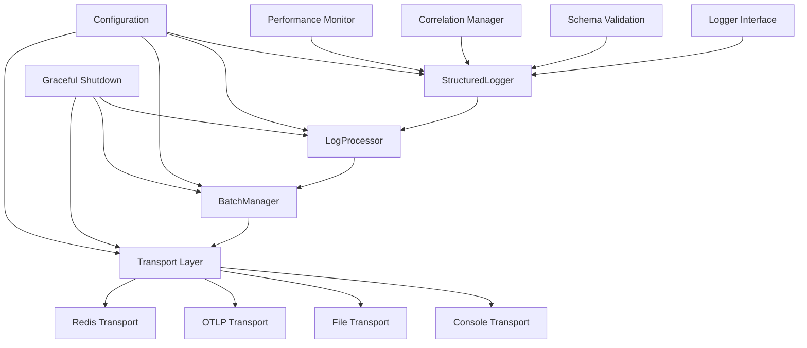

# Design Document

## Overview

This design document outlines the architecture for a production-ready structured logging system that addresses the critical issues identified in the current implementation. The new design emphasizes type safety, async operation handling, performance optimization, and proper OTLP integration while maintaining backward compatibility where possible.

The system will be built around a modular architecture with clear separation of concerns: core logging interfaces, transport implementations, batching/queuing mechanisms, and configuration management. All components will be fully typed, tested, and designed for high-throughput production environments.

## Architecture

### Core Components



### Layer Responsibilities

1. **Interface Layer**: Defines contracts and types for all logging operations
2. **Core Logger Layer**: Implements structured logging with correlation tracking and metadata management
3. **Processing Layer**: Handles async operations, batching, and queuing
4. **Transport Layer**: Manages different output destinations with proper error handling
5. **Configuration Layer**: Provides type-safe configuration with runtime validation
6. **Utility Layer**: Includes compression, serialization, and performance monitoring

## Components and Interfaces

### Core Interfaces

```typescript
// Core logging interface with complete method signatures
interface Logger {
	debug(message: string, fields?: LogFields): Promise<void>
	info(message: string, fields?: LogFields): Promise<void>
	warn(message: string, fields?: LogFields): Promise<void>
	error(message: string, fields?: LogFields): Promise<void>
	fatal(message: string, fields?: LogFields): Promise<void>

	// Correlation and context management
	setRequestId(requestId: string): void
	setCorrelationId(correlationId: string): void
	withContext(context: LogContext): Logger

	// Lifecycle management
	flush(): Promise<void>
	close(): Promise<void>
}

// Transport interface for different output destinations
interface LogTransport {
	name: string
	send(entries: LogEntry[]): Promise<void>
	flush(): Promise<void>
	close(): Promise<void>
	isHealthy(): boolean
}

// Batch manager for efficient log processing
interface BatchManager {
	add(entry: LogEntry): Promise<void>
	flush(): Promise<void>
	close(): Promise<void>
}
```

### Configuration Schema

```typescript
// Zod schema for runtime validation
const LoggingConfigSchema = z.object({
	level: z.enum(['debug', 'info', 'warn', 'error', 'fatal']),
	outputs: z.array(z.enum(['console', 'file', 'redis', 'otlp'])),

	// Performance settings
	enablePerformanceLogging: z.boolean().default(false),
	performanceSampleRate: z.number().min(0).max(1).default(0.1),

	// Batching configuration
	batchSize: z.number().min(1).default(100),
	batchTimeout: z.number().min(100).default(5000),
	maxConcurrency: z.number().min(1).default(10),

	// Transport-specific configurations
	console: ConsoleConfigSchema.optional(),
	file: FileConfigSchema.optional(),
	redis: RedisConfigSchema.optional(),
	otlp: OTLPConfigSchema.optional(),

	// Reliability settings
	retryAttempts: z.number().min(0).default(3),
	retryBackoffMs: z.number().min(100).default(1000),
	shutdownTimeoutMs: z.number().min(1000).default(30000),
})

type LoggingConfig = z.infer<typeof LoggingConfigSchema>
```

### OTLP Transport Implementation

Based on OpenTelemetry best practices, the OTLP transport will implement:

```typescript
class OTLPTransport implements LogTransport {
	private batchProcessor: BatchLogRecordProcessor
	private exporter: OTLPLogExporter
	private circuitBreaker: CircuitBreaker

	constructor(config: OTLPConfig) {
		// Initialize with proper timeout, retry, and compression settings
		this.exporter = new OTLPLogExporter({
			url: config.endpoint,
			headers: config.headers,
			timeoutMillis: config.timeoutMs,
			concurrencyLimit: config.maxConcurrency,
		})

		this.batchProcessor = new BatchLogRecordProcessor(this.exporter, {
			maxExportBatchSize: config.batchSize,
			exportTimeoutMillis: config.batchTimeoutMs,
			scheduledDelayMillis: config.flushIntervalMs,
		})

		this.circuitBreaker = new CircuitBreaker({
			failureThreshold: config.circuitBreakerThreshold,
			resetTimeoutMs: config.circuitBreakerResetMs,
		})
	}

	async send(entries: LogEntry[]): Promise<void> {
		if (!this.circuitBreaker.canExecute()) {
			throw new Error('Circuit breaker is open')
		}

		try {
			const logRecords = entries.map(this.convertToOTLPFormat)
			await this.batchProcessor.onEmit(logRecords)
			this.circuitBreaker.onSuccess()
		} catch (error) {
			this.circuitBreaker.onFailure()
			throw error
		}
	}
}
```

## Data Models

### Log Entry Structure

```typescript
interface LogEntry {
	// Core fields
	timestamp: Date
	level: LogLevel
	message: string

	// Context and correlation
	requestId?: string
	correlationId: string
	traceId?: string
	spanId?: string

	// Structured data
	fields: LogFields
	metadata: LogMetadata

	// Performance data (sampled)
	performance?: PerformanceMetrics

	// Internal tracking
	id: string
	source: string
	version: string
}

interface LogMetadata {
	service: string
	environment: string
	hostname: string
	pid: number

	// Request context
	request?: {
		method?: string
		url?: string
		userAgent?: string
		ip?: string
		duration?: number
	}

	// Database context
	database?: {
		operation: string
		table?: string
		duration: number
		rowsAffected?: number
	}

	// Security context
	security?: {
		event: string
		userId?: string
		severity: 'low' | 'medium' | 'high' | 'critical'
	}
}
```

### Serialization Strategy

```typescript
class LogSerializer {
	static serialize(entry: LogEntry): string {
		// Use structured cloning to avoid circular references
		const serializable = {
			'@timestamp': entry.timestamp.toISOString(),
			level: entry.level,
			message: entry.message,
			correlationId: entry.correlationId,
			...entry.fields,
			...entry.metadata,
		}

		// Add optional fields only if present
		if (entry.requestId) serializable.requestId = entry.requestId
		if (entry.traceId) serializable.traceId = entry.traceId
		if (entry.performance) serializable.performance = entry.performance

		return JSON.stringify(serializable)
	}

	static compress(data: string): Buffer {
		return gzipSync(Buffer.from(data, 'utf8'))
	}
}
```

## Error Handling

### Circuit Breaker Pattern

```typescript
class CircuitBreaker {
	private state: 'closed' | 'open' | 'half-open' = 'closed'
	private failureCount = 0
	private lastFailureTime = 0

	constructor(private config: CircuitBreakerConfig) {}

	canExecute(): boolean {
		if (this.state === 'closed') return true
		if (this.state === 'open') {
			if (Date.now() - this.lastFailureTime > this.config.resetTimeoutMs) {
				this.state = 'half-open'
				return true
			}
			return false
		}
		return true // half-open allows one attempt
	}

	onSuccess(): void {
		this.failureCount = 0
		this.state = 'closed'
	}

	onFailure(): void {
		this.failureCount++
		this.lastFailureTime = Date.now()

		if (this.failureCount >= this.config.failureThreshold) {
			this.state = 'open'
		}
	}
}
```

### Retry Strategy

```typescript
class RetryManager {
	async executeWithRetry<T>(operation: () => Promise<T>, config: RetryConfig): Promise<T> {
		let lastError: Error

		for (let attempt = 0; attempt <= config.maxAttempts; attempt++) {
			try {
				return await operation()
			} catch (error) {
				lastError = error as Error

				if (attempt === config.maxAttempts) break
				if (!this.isRetryableError(error)) break

				const delay = this.calculateBackoff(attempt, config)
				await this.sleep(delay)
			}
		}

		throw lastError!
	}

	private calculateBackoff(attempt: number, config: RetryConfig): number {
		return Math.min(config.initialDelayMs * Math.pow(config.multiplier, attempt), config.maxDelayMs)
	}

	private isRetryableError(error: unknown): boolean {
		if (error instanceof Error) {
			// Network errors, timeouts, and 5xx responses are retryable
			return /network|timeout|5\d\d/.test(error.message.toLowerCase())
		}
		return false
	}
}
```

## Testing Strategy

### Unit Testing Approach

1. **Interface Compliance**: Test that all logger implementations conform to the Logger interface
2. **Serialization**: Verify correct JSON output and OTLP format conversion
3. **Async Handling**: Test promise resolution, error propagation, and unhandled rejection prevention
4. **Batching Logic**: Validate batch size limits, timeout behavior, and flush operations
5. **Circuit Breaker**: Test state transitions and failure/recovery scenarios
6. **Configuration Validation**: Ensure Zod schemas catch invalid configurations

### Integration Testing

1. **Transport Integration**: Test actual log delivery to console, files, and mock OTLP endpoints
2. **Performance Testing**: Benchmark throughput and memory usage under load
3. **Graceful Shutdown**: Verify all logs are flushed during application termination
4. **Error Recovery**: Test behavior during network failures and service unavailability

### Test Structure

```typescript
describe('StructuredLogger', () => {
	describe('Interface Compliance', () => {
		it('should implement all Logger interface methods')
		it('should return promises from all log methods')
		it('should handle correlation ID management')
	})

	describe('Async Operations', () => {
		it('should await all transport operations')
		it('should handle transport failures gracefully')
		it('should not leave unhandled promise rejections')
	})

	describe('Performance', () => {
		it('should sample performance metrics when enabled')
		it('should handle high throughput without blocking')
		it('should respect concurrency limits')
	})

	describe('OTLP Integration', () => {
		it('should format logs correctly for OTLP export')
		it('should batch logs according to configuration')
		it('should handle OTLP endpoint failures with circuit breaker')
	})
})
```

### Performance Benchmarks

```typescript
// Benchmark tests to ensure performance requirements
describe('Performance Benchmarks', () => {
	it('should handle 1000 logs/second without memory leaks', async () => {
		const logger = new StructuredLogger(highThroughputConfig)
		const startMemory = process.memoryUsage()

		for (let i = 0; i < 10000; i++) {
			await logger.info(`Test message ${i}`, { iteration: i })
		}

		await logger.flush()

		const endMemory = process.memoryUsage()
		expect(endMemory.heapUsed - startMemory.heapUsed).toBeLessThan(50 * 1024 * 1024) // 50MB
	})

	it('should complete log operations within acceptable latency', async () => {
		const logger = new StructuredLogger(config)

		const start = performance.now()
		await logger.info('Test message')
		const duration = performance.now() - start

		expect(duration).toBeLessThan(10) // 10ms for local operations
	})
})
```

## Implementation Phases

### Phase 1: Core Infrastructure

- Implement type-safe interfaces and configuration schemas
- Create base Logger class with proper async handling
- Implement correlation ID management and context tracking
- Add comprehensive unit tests for core functionality

### Phase 2: Transport Layer

- Implement Console transport with proper formatting
- Create File transport with rotation support
- Build OTLP transport with batching and circuit breaker
- Add Redis transport with connection management

### Phase 3: Performance and Reliability

- Implement batching and queuing mechanisms
- Add compression support for large payloads
- Create graceful shutdown and flush capabilities
- Implement performance monitoring and sampling

### Phase 4: Production Readiness

- Add comprehensive error handling and recovery
- Implement configuration hot-reloading
- Create monitoring and health check endpoints
- Add production deployment documentation

This design provides a solid foundation for a production-ready logging system that addresses all the issues identified in the current implementation while maintaining high performance and reliability standards.
