# Audit Material Update Design

## Overview

This design outlines the modernization and restructuring of the Smart Logs documentation system, focusing on updating outdated materials, enhancing the @smedrec/audit-client documentation, and creating a professional online documentation site that reflects the current codebase architecture.

## Current State Analysis

### Documentation Issues

- Existing documentation references deprecated packages (`audit-sdk.deprecated`, `send-mail.deprecated`)
- Homepage content is outdated and contains placeholder text
- Fragmented documentation structure between individual package docs and the main docs site
- Missing comprehensive API explorer and interactive examples
- TypeDoc integration temporarily disabled due to compatibility issues

### Existing Documentation Assets

The audit-client package contains substantial documentation that needs professional restructuring:

- API Reference (239 lines)
- Getting Started Guide (201 lines)
- Code Examples (6.1KB)
- Framework Integration Guide (4.8KB)
- Plugin Architecture Documentation (13.8KB)
- Tutorials and Troubleshooting guides

## Architecture

### Documentation Site Structure

```mermaid
graph TD
    A[Documentation Site Root] --> B[Getting Started]
    A --> C[Audit Client Library]
    A --> D[Core System]
    A --> E[API Reference]
    A --> F[Guides & Tutorials]

    C --> C1[Quick Start]
    C --> C2[Installation & Setup]
    C --> C3[API Reference]
    C --> C4[Services Documentation]
    C --> C5[Configuration]
    C --> C6[Plugin Architecture]
    C --> C7[Framework Integration]
    C --> C8[Examples & Use Cases]

    D --> D1[Audit Core]
    D --> D2[Database Layer]
    D --> D3[Worker Service]
    D --> D4[Security & Compliance]

    E --> E1[Interactive API Explorer]
    E --> E2[OpenAPI Documentation]
    E --> E3[Type Definitions]

    F --> F1[Migration Guides]
    F --> F2[Best Practices]
    F --> F3[Troubleshooting]
    F --> F4[Performance Optimization]
```



### Content Organization Strategy

| Documentation Layer      | Purpose                                              | Source                         | Target Location                            |
| ------------------------ | ---------------------------------------------------- | ------------------------------ | ------------------------------------------ |
| **Homepage**             | Project introduction, key features, quick navigation | New content                    | `apps/docs/src/content/docs/index.mdx`     |
| **Audit Client Library** | Comprehensive SDK documentation                      | `packages/audit-client/docs/*` | `apps/docs/src/content/docs/audit-client/` |
| **Core System**          | Architecture and system components                   | Existing + new content         | `apps/docs/src/content/docs/core/`         |
| **API Reference**        | Interactive API explorer                             | OpenAPI + existing docs        | `apps/docs/src/content/docs/api/`          |
| **Guides**               | Tutorials and best practices                         | Enhanced existing content      | `apps/docs/src/content/docs/guides/`       |

## Implementation

### Phase 1: Content Migration and Restructuring

#### 1.1 Homepage Modernization

- Replace placeholder content with Smart Logs project introduction
- Highlight key features: HIPAA/GDPR compliance, cryptographic integrity, multi-platform support
- Add clear navigation paths to different documentation sections
- Include quick start examples and key use cases

#### 1.2 Audit Client Documentation Restructuring

Transform existing documentation into professional online format:

**Quick Start Section**

- Streamlined installation guide
- Basic configuration examples
- First API call tutorial
- Authentication setup

**API Services Documentation**

- EventsService: Event creation, querying, verification
- ComplianceService: HIPAA/GDPR reporting
- MetricsService: System monitoring
- HealthService: System health checks
- PresetsService: Event templates
- ScheduledReportsService: Automated reporting

**Advanced Topics**

- Plugin architecture system
- Custom middleware development
- Framework integration patterns
- Performance optimization strategies

#### 1.3 Package Documentation Integration

Migrate and enhance content from `packages/audit-client/docs/`:

- **GETTING_STARTED.md** → Enhanced quick start guide with interactive examples
- **API_REFERENCE.md** → Comprehensive API documentation with live examples
- **PLUGIN_ARCHITECTURE.md** → Advanced plugin development guide
- **FRAMEWORK_INTEGRATION.md** → Integration patterns for popular frameworks
- **CODE_EXAMPLES.md** → Practical use case examples
- **TUTORIALS.md** → Step-by-step implementation guides

### Phase 2: Interactive Features Implementation

#### 2.1 API Explorer Enhancement

- Configure Starlight OpenAPI plugin for interactive API exploration
- Add live code examples with copy-to-clipboard functionality
- Implement request/response playground
- Add authentication flow demonstrations

#### 2.2 Search and Navigation

- Implement comprehensive search functionality
- Add contextual navigation between related topics
- Create cross-reference links between API methods and examples
- Add breadcrumb navigation for complex topics

#### 2.3 Code Example Integration

- Interactive code playground for common use cases
- Framework-specific examples (Express, Next.js, React, etc.)
- Copy-paste ready configuration templates
- Live demo environment setup

### Phase 3: Content Enhancement and Compliance

#### 3.1 Deprecated Package Exclusion

Remove all references to deprecated packages:

- `audit-sdk.deprecated`
- `send-mail.deprecated`
- Any other `.deprecated` directories

#### 3.2 Code Compliance Updates

Ensure all examples use current package structure:

- Use `@smedrec/audit-client` instead of deprecated packages
- Update import statements to reflect current architecture
- Verify all code examples against current API specifications

#### 3.3 Professional Documentation Standards

- Consistent formatting and style guidelines
- Professional tone and technical accuracy
- Comprehensive error handling examples
- Security best practices documentation

## Technical Implementation

### Astro Configuration Updates

```typescript
// Enhanced sidebar structure
sidebar: [
	{
		label: 'Getting Started',
		items: [
			{ label: 'Introduction', slug: 'introduction' },
			{ label: 'Quick Start', slug: 'quick-start' },
			{ label: 'Installation', slug: 'installation' },
		],
	},
	{
		label: 'Audit Client Library',
		items: [
			{ label: 'Overview', slug: 'audit-client/overview' },
			{ label: 'Configuration', slug: 'audit-client/configuration' },
			{ label: 'Services', autogenerate: { directory: 'audit-client/services' } },
			{ label: 'Plugin Architecture', slug: 'audit-client/plugins' },
			{ label: 'Framework Integration', slug: 'audit-client/frameworks' },
			{ label: 'Examples', autogenerate: { directory: 'audit-client/examples' } },
		],
	},
	{
		label: 'Core System',
		items: [
			{ label: 'Architecture', slug: 'core/architecture' },
			{ label: 'Database Layer', slug: 'core/database' },
			{ label: 'Worker Service', slug: 'core/worker' },
			{ label: 'Security', slug: 'core/security' },
		],
	},
	{
		label: 'API Reference',
		autogenerate: { directory: 'api' },
	},
]
```

### Content Structure Mapping

| Original Location                                     | Target Location                                           | Enhancement                               |
| ----------------------------------------------------- | --------------------------------------------------------- | ----------------------------------------- |
| `packages/audit-client/docs/GETTING_STARTED.md`       | `apps/docs/src/content/docs/audit-client/quick-start.mdx` | Interactive examples, improved navigation |
| `packages/audit-client/docs/API_REFERENCE.md`         | `apps/docs/src/content/docs/audit-client/api/`            | Split into service-specific pages         |
| `packages/audit-client/docs/PLUGIN_ARCHITECTURE.md`   | `apps/docs/src/content/docs/audit-client/plugins.mdx`     | Enhanced diagrams, code examples          |
| `packages/audit-client/docs/FRAMEWORK_INTEGRATION.md` | `apps/docs/src/content/docs/audit-client/frameworks/`     | Framework-specific pages                  |
| `packages/audit-client/docs/CODE_EXAMPLES.md`         | `apps/docs/src/content/docs/audit-client/examples/`       | Interactive examples                      |

### Quality Assurance

#### Documentation Standards

- All code examples must be tested and functional
- Cross-references must be accurate and up-to-date
- API documentation must match current implementation
- Examples must follow TypeScript best practices

#### Content Validation

- Remove all deprecated package references
- Verify all import statements and package names
- Ensure compliance with current authentication methods
- Validate configuration examples against current schemas

#### Professional Presentation

- Consistent formatting across all documentation
- Professional language and technical accuracy
- Comprehensive coverage of all major features
- Clear navigation and discoverability

## Testing Strategy

### Content Validation Testing

- Automated link checking for internal and external references
- Code example compilation and execution testing
- API endpoint validation against current OpenAPI specifications
- Documentation coverage analysis for all public APIs

### User Experience Testing

- Navigation flow testing for common documentation paths
- Search functionality validation
- Mobile responsiveness verification
- Load time optimization for documentation assets

### Integration Testing

- Verify OpenAPI plugin integration works correctly
- Test interactive code examples functionality
- Validate cross-references between documentation sections
- Ensure proper rendering of Mermaid diagrams and interactive elements
