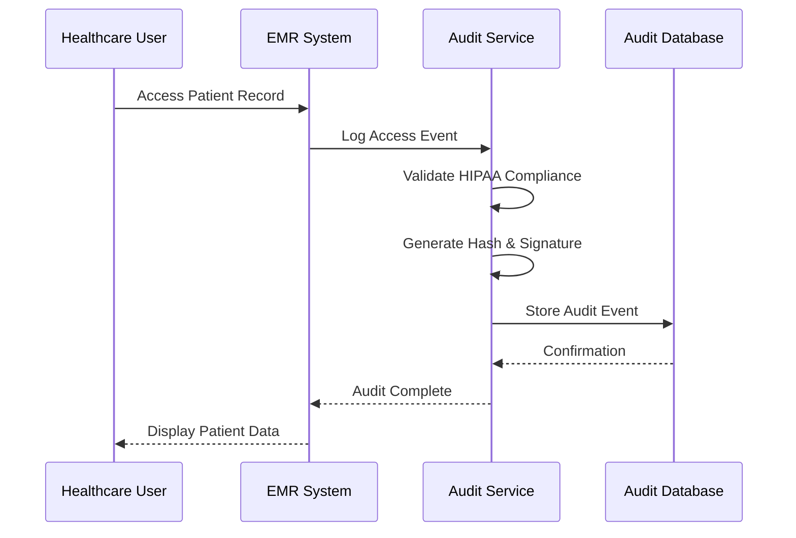
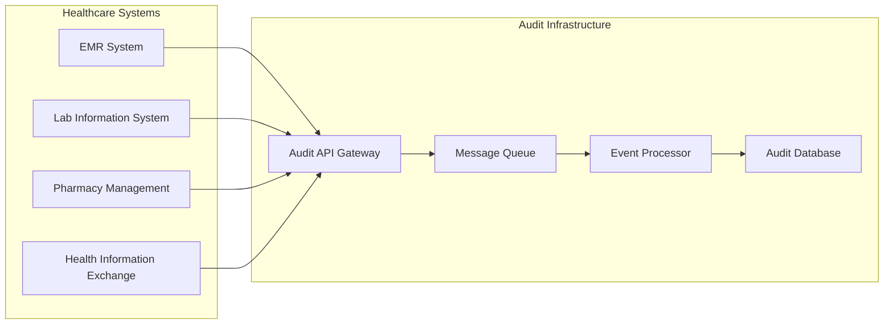
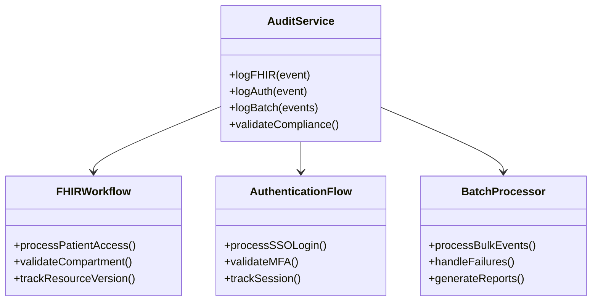

# @repo/audit Package Documentation Examples Design

## Overview

This design document outlines the creation of comprehensive documentation examples for the `@repo/audit` package, specifically focusing on the remaining TODO items identified in the README.md file. The examples will demonstrate practical implementation patterns for healthcare audit logging scenarios, covering FHIR workflows, authentication flows, batch processing, and integration patterns.

## Repository Type Detection

Based on the project structure analysis, this is a **Backend Framework/Library** system - specifically a comprehensive audit logging framework designed for healthcare applications with multiple specialized packages and full-stack application components.

## Architecture

The documentation structure follows a modular approach with four main example categories that need to be created:

### Example Documentation Structure

```mermaid
flowchart TD
    A[Examples Root] --> B[FHIR Workflows]
    A --> C[Authentication Flows]
    A --> D[Batch Processing]
    A --> E[Integration Patterns]

    B --> B1[Patient Record Access]
    B --> B2[Clinical Document Management]
    B --> B3[Medication Orders]
    B --> B4[Diagnostic Reports]
    B --> B5[Appointment Scheduling]

    C --> C1[Single Sign-On Integration]
    C --> C2[Multi-Factor Authentication]
    C --> C3[Session Management]
    C --> C4[Role-Based Access Control]
    C --> C5[Password Management]

    D --> D1[High-Volume Event Processing]
    D --> D2[Bulk Data Operations]
    D --> D3[Archival Processing]
    D --> D4[Compliance Reporting]
    D --> D5[Performance Optimization]

    E --> E1[EMR System Integration]
    E --> E2[Laboratory Information Systems]
    E --> E3[Pharmacy Management Systems]
    E --> E4[Health Information Exchange]
    E --> E5[Third-Party API Integration]
```

## FHIR Workflows Documentation

### Patient Record Access Workflows

The FHIR workflows documentation will demonstrate comprehensive audit logging patterns for healthcare-specific FHIR resource interactions. This includes patient record access with proper PHI handling, clinical document management, medication orders, diagnostic reports, and appointment scheduling.

**Key Implementation Patterns**:

- FHIR R4 resource audit events with proper compartmentalization
- Patient compartment access tracking for privacy compliance
- Practitioner action logging with role-based validation
- Resource versioning and modification tracking
- Bundle operation audit trails for transaction integrity

**Compliance Integration**:

- HIPAA minimum necessary standard implementation
- GDPR consent management for EU patients
- Retention policy management for different resource types
- Data subject rights implementation for patient requests

### Clinical Workflow Examples

The documentation will cover complex healthcare scenarios including:

- Multi-step clinical workflows with audit continuity
- Care team collaboration audit trails
- Treatment protocol adherence tracking
- Clinical decision support system audits
- Telehealth session audit logging

## Authentication Flows Documentation

### Enterprise Authentication Integration

The authentication flows documentation will provide comprehensive examples for healthcare-grade authentication and authorization audit logging, including single sign-on integration, multi-factor authentication workflows, session management patterns, and role-based access control implementations.

**Authentication Event Patterns**:

- SAML/OIDC integration with external identity providers
- MFA challenge and verification audit trails
- Session lifecycle management with security event correlation
- Privileged access management for administrative functions
- Emergency access procedures with enhanced logging

**Security Event Correlation**:

- Failed login attempt pattern detection
- Concurrent session monitoring and alerting
- Privilege escalation event tracking
- Account lockout and recovery audit trails
- Suspicious activity pattern identification

## Batch Processing Documentation

### High-Volume Healthcare Scenarios

The batch processing documentation will demonstrate scalable audit logging patterns for high-volume healthcare environments, including bulk data operations, archival processing, compliance reporting, and performance optimization strategies.

**Performance Optimization Patterns**:

- Queue partitioning strategies for different event types
- Batch processing with guaranteed delivery semantics
- Circuit breaker patterns for system resilience
- Dead letter queue handling for failed events
- Horizontal scaling with event distribution

**Bulk Operations Audit**:

- Data migration audit trails with integrity verification
- Bulk patient record updates with change tracking
- System maintenance operation logging
- Scheduled job execution audit patterns
- Backup and recovery operation tracking

## Integration Patterns Documentation

### Healthcare System Ecosystem Integration

The integration patterns documentation will provide examples for integrating the audit system with various healthcare systems, including EMR systems, laboratory information systems, pharmacy management systems, health information exchanges, and third-party API integrations.

**System Integration Approaches**:

- Message broker integration with HL7 FHIR messaging
- REST API integration with external healthcare systems
- Event-driven architecture with healthcare workflow engines
- Webhook integration for real-time audit notifications
- GraphQL integration for complex audit queries

**Data Flow Patterns**:

- Cross-system audit trail correlation
- Distributed transaction audit logging
- Event sourcing patterns for audit history
- CQRS implementation with audit projections
- Microservices audit aggregation strategies

## Healthcare Compliance Examples

### Regulatory Compliance Scenarios

Each example category will include specific compliance scenarios demonstrating:

**HIPAA Compliance Patterns**:

- Minimum necessary access logging
- Business associate audit requirements
- Breach notification audit trails
- Administrative safeguard implementations
- Technical safeguard audit verification

**GDPR Compliance Patterns**:

- Data subject rights implementation
- Consent management audit trails
- Data processing lawfulness tracking
- Cross-border data transfer auditing
- Right to be forgotten implementation

## Advanced Implementation Scenarios

### Complex Healthcare Use Cases

The documentation will include advanced scenarios such as:

**Multi-Tenant Healthcare Platforms**:

- Organization-specific audit isolation
- Tenant-aware compliance configuration
- Cross-tenant data sharing audit trails
- Hierarchical organization audit aggregation

**Disaster Recovery and Business Continuity**:

- Audit system failover procedures
- Cross-region audit replication
- Backup verification audit trails
- Recovery point objective tracking

**Performance and Scalability**:

- Auto-scaling audit infrastructure
- Load balancing with session affinity
- Database sharding for audit data
- Caching strategies for audit queries

## Testing Strategy Examples

### Comprehensive Testing Approaches

Each example will include corresponding test implementations:

**Unit Testing Patterns**:

- Mock healthcare system integration testing
- Compliance validation testing
- Security event simulation testing
- Performance benchmark testing

**Integration Testing Scenarios**:

- End-to-end workflow testing
- Cross-system integration verification
- Compliance reporting validation
- Disaster recovery testing

**Load Testing Implementations**:

- High-volume event processing tests
- Concurrent user session testing
- Database performance validation
- System resilience testing

## Documentation Format Standards

### Consistent Example Structure

Each example document will follow a standardized structure:

**Introduction Section**:

- Use case description and healthcare context
- Compliance requirements and business rationale
- Architecture overview with component relationships

**Implementation Section**:

- Step-by-step configuration examples
- Code snippets with comprehensive comments
- Configuration parameter explanations
- Best practices and common pitfalls

**Testing Section**:

- Unit test examples with mock data
- Integration test scenarios
- Performance validation approaches
- Compliance verification methods

**Troubleshooting Section**:

- Common implementation issues
- Performance optimization techniques
- Security consideration guidelines
- Monitoring and alerting recommendations

## Visual Documentation Standards

### Mermaid Diagram Standards

Each example will include appropriate visual representations:

**Workflow Diagrams**:

**Architecture Diagrams**:

**Component Relationship Diagrams**:

## Implementation Priorities

### Documentation Creation Order

The examples will be created in the following priority order:

1. **FHIR Workflows** - Core healthcare functionality with highest compliance requirements
2. **Authentication Flows** - Security-critical patterns for access control
3. **Integration Patterns** - System interoperability for healthcare ecosystems
4. **Batch Processing** - Performance and scalability for enterprise deployments

Each example document will be comprehensive yet focused, providing practical implementation guidance while maintaining security and compliance best practices throughout all scenarios.
