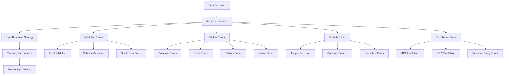
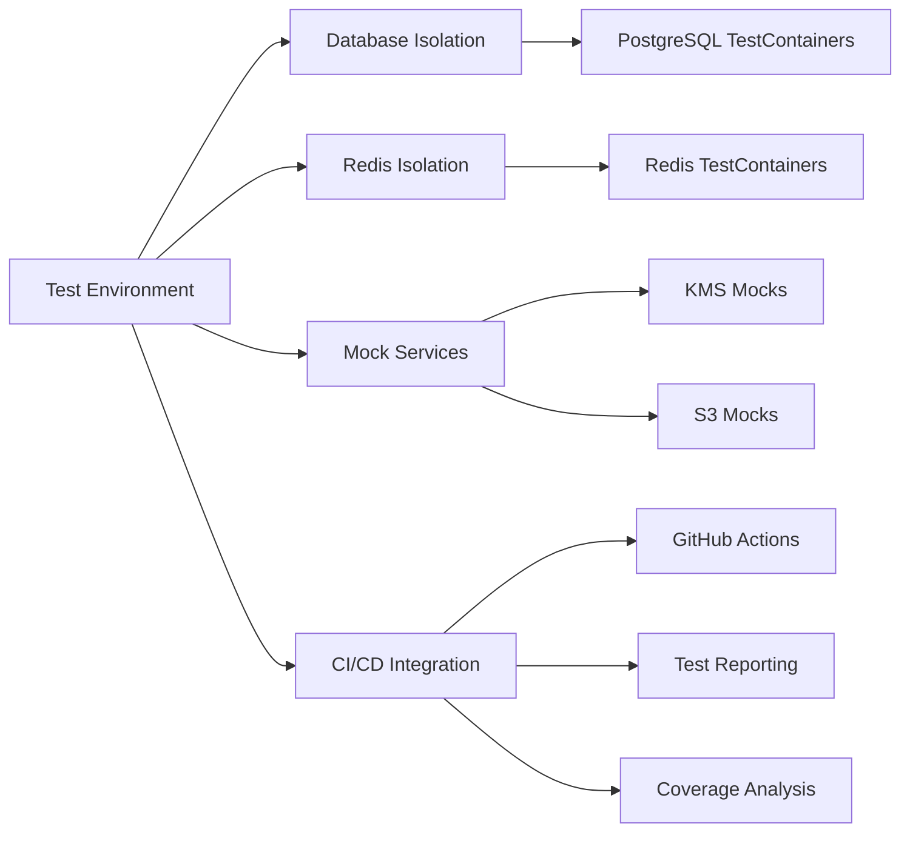
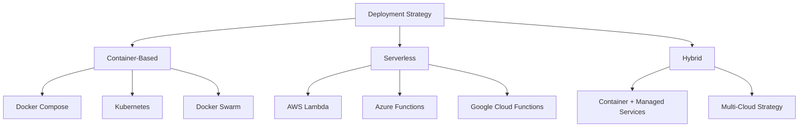
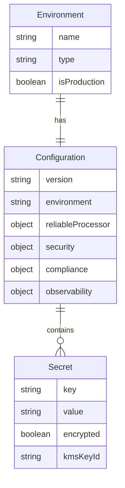
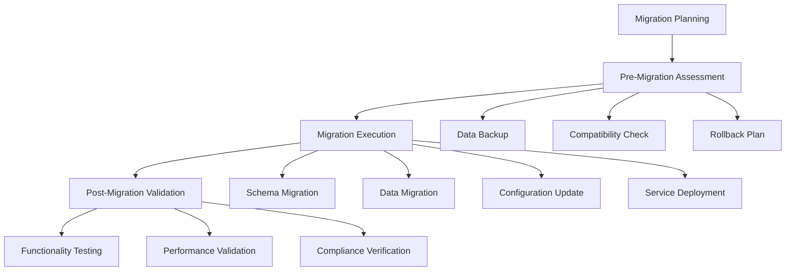

# @repo/audit Package Implementation Guides Design

## Overview

This design outlines the comprehensive implementation guides needed to complete the documentation for the `@repo/audit` package. Based on the analysis of existing documentation and codebase, four critical implementation guides remain to be documented: Error Handling, Testing Strategies, Deployment Patterns, and Migration Guide.

These guides are essential for healthcare organizations implementing the audit system, providing practical implementation guidance for production environments with emphasis on reliability, compliance, and operational excellence.

## Repository Type Analysis

The `@repo/audit` package is a **Backend Framework/Library** specifically designed for healthcare audit logging. It provides:

- Core audit event processing infrastructure
- Healthcare compliance framework (HIPAA/GDPR)
- Cryptographic security services
- Database integration with PostgreSQL and Redis
- Reliable event processing with BullMQ
- Comprehensive testing framework

## Implementation Guides Architecture

### Error Handling Guide Structure

**Purpose**: Provide comprehensive error management strategies for production audit systems

**Core Components**:



**Error Classification Framework**:

| Error Category      | Severity | Recovery Strategy       | Monitoring Level |
| ------------------- | -------- | ----------------------- | ---------------- |
| Validation Errors   | Medium   | Sanitize and Retry      | Standard         |
| Database Connection | High     | Circuit Breaker + Retry | Critical         |
| Redis Failures      | High     | Graceful Degradation    | Critical         |
| Tamper Detection    | Critical | Immediate Alert + Stop  | Emergency        |
| HIPAA Violations    | Critical | Immediate Alert + Log   | Emergency        |
| Signature Failures  | Critical | Reject Event + Alert    | Emergency        |

**Error Response Patterns**:

- **Fail-Fast Pattern**: Immediate failure for critical security violations
- **Graceful Degradation**: Continue operation with reduced functionality
- **Circuit Breaker Pattern**: Prevent cascade failures in distributed systems
- **Retry with Backoff**: Exponential backoff for transient failures
- **Dead Letter Queue**: Preserve failed events for manual review

**Implementation Patterns**:

| Pattern Type        | Use Case                | Implementation Strategy              |
| ------------------- | ----------------------- | ------------------------------------ |
| Try-Catch Blocks    | Synchronous operations  | Specific error handling with logging |
| Promise Rejection   | Asynchronous operations | Proper error propagation chains      |
| Event Emitters      | Long-running processes  | Error event broadcasting             |
| Middleware          | Request processing      | Centralized error handling           |
| Validation Pipeline | Data processing         | Multi-stage validation with recovery |

### Testing Strategies Guide Structure

**Purpose**: Comprehensive testing framework for healthcare audit systems

**Testing Pyramid Architecture**:

```mermaid
pyramid
    title Testing Strategy Pyramid
    a : Unit Tests (70%)
    b : Integration Tests (20%)
    c : End-to-End Tests (10%)
```

**Test Categories and Coverage**:

| Test Type         | Coverage Target        | Purpose                  | Tools                 |
| ----------------- | ---------------------- | ------------------------ | --------------------- |
| Unit Tests        | 90%+                   | Component validation     | Vitest, Jest          |
| Integration Tests | 80%+                   | Component interaction    | Testcontainers        |
| End-to-End Tests  | Key workflows          | Complete audit lifecycle | Custom framework      |
| Load Tests        | Performance validation | High-volume scenarios    | Artillery, k6         |
| Chaos Tests       | Resilience validation  | Failure recovery         | Custom chaos toolkit  |
| Compliance Tests  | 100%                   | Regulatory requirements  | Custom validators     |
| Security Tests    | 100%                   | Cryptographic validation | Custom security suite |

**Testing Infrastructure Requirements**:



**Test Data Management Strategy**:

- **Synthetic Data Generation**: Healthcare-compliant test data
- **Data Masking**: PHI protection in test environments
- **Test Data Lifecycle**: Creation, usage, and cleanup patterns
- **Fixture Management**: Reusable test data sets
- **Database State Management**: Isolation and cleanup strategies

**Performance Testing Framework**:

| Test Scenario    | Target Metrics               | Acceptance Criteria           |
| ---------------- | ---------------------------- | ----------------------------- |
| Sustained Load   | 1000 events/sec              | < 100ms latency               |
| Burst Traffic    | 5000 events/burst            | < 200ms latency               |
| Database Stress  | 10,000 concurrent operations | No connection pool exhaustion |
| Memory Pressure  | 24-hour continuous load      | No memory leaks               |
| Recovery Testing | Failure simulation           | < 30s recovery time           |

### Deployment Patterns Guide Structure

**Purpose**: Production deployment strategies for healthcare audit systems

**Deployment Architecture Options**:



**Environment Configuration Matrix**:

| Environment | Purpose                | Configuration Level | Monitoring Level |
| ----------- | ---------------------- | ------------------- | ---------------- |
| Development | Feature development    | Basic               | Standard         |
| Staging     | Pre-production testing | Production-like     | Enhanced         |
| Production  | Live operations        | Hardened            | Comprehensive    |
| DR/Backup   | Disaster recovery      | Mirror production   | Critical         |

**Container Deployment Patterns**:

- **Single Container**: Simple deployments with embedded dependencies
- **Multi-Container**: Separated concerns (app, database, cache)
- **Microservice Architecture**: Distributed audit components
- **Sidecar Pattern**: Audit logging as auxiliary service

**Configuration Management Strategy**:



**Health Check and Readiness Strategy**:

| Check Type        | Purpose                | Frequency | Timeout |
| ----------------- | ---------------------- | --------- | ------- |
| Liveness          | Service availability   | 30s       | 5s      |
| Readiness         | Service ready to serve | 10s       | 3s      |
| Database          | Database connectivity  | 60s       | 10s     |
| Redis             | Cache availability     | 30s       | 5s      |
| External Services | KMS, S3 connectivity   | 120s      | 15s     |

### Migration Guide Structure

**Purpose**: Version migration and upgrade strategies for production systems

**Migration Strategy Framework**:



**Migration Risk Assessment Matrix**:

| Risk Category           | Impact Level | Mitigation Strategy            | Rollback Capability    |
| ----------------------- | ------------ | ------------------------------ | ---------------------- |
| Data Loss               | Critical     | Multi-tier backup + validation | Point-in-time recovery |
| Downtime                | High         | Blue-green deployment          | Instant rollback       |
| Configuration Issues    | Medium       | Staged deployment              | Configuration rollback |
| Performance Degradation | Medium       | Load testing + monitoring      | Service rollback       |
| Compliance Gaps         | Critical     | Compliance validation suite    | Full system rollback   |

**Version Compatibility Strategy**:

- **Semantic Versioning**: Clear version impact communication
- **Backward Compatibility**: API compatibility guarantees
- **Deprecation Policy**: Structured phase-out of legacy features
- **Breaking Change Management**: Clear migration paths for breaking changes

**Data Migration Patterns**:

| Migration Type      | Strategy                         | Validation Method         | Rollback Strategy     |
| ------------------- | -------------------------------- | ------------------------- | --------------------- |
| Schema Changes      | Online migration with versioning | Checksum validation       | Schema rollback       |
| Data Format Changes | Dual-write pattern               | Data integrity checks     | Format rollback       |
| Partition Changes   | Gradual partition migration      | Count and hash validation | Partition restoration |
| Index Changes       | Background index creation        | Performance validation    | Index removal         |

## Implementation Strategy

### Documentation Structure Integration

Each implementation guide follows the established documentation architecture:

```
packages/audit/docs/guides/
├── error-handling.md
├── testing-strategies.md
├── deployment-patterns.md
└── migration-guide.md
```

**Content Organization Pattern**:

1. **Overview and Principles** - Core concepts and healthcare context
2. **Implementation Patterns** - Practical implementation strategies
3. **Configuration Examples** - Real-world configuration samples
4. **Troubleshooting Guide** - Common issues and solutions
5. **Best Practices** - Healthcare-specific recommendations
6. **Monitoring and Alerting** - Operational excellence patterns

### Healthcare-Specific Considerations

**Compliance Integration**:

- HIPAA audit trail requirements throughout all processes
- GDPR data subject rights impact on error handling and migration
- FDA validation requirements for regulated environments
- SOC 2 operational control requirements

**Security Integration**:

- PHI protection during error scenarios and testing
- Cryptographic integrity maintenance during migrations
- Key management during deployment and updates
- Secure error logging without exposing sensitive data

**Operational Excellence**:

- 24/7 healthcare operations continuity requirements
- Emergency deployment procedures for security patches
- Compliance reporting continuity during migrations
- Patient care system integration considerations

### Cross-Guide Integration Points

**Error Handling ↔ Testing Strategies**:

- Error simulation in testing frameworks
- Chaos engineering for error scenario validation
- Recovery time validation testing

**Testing Strategies ↔ Deployment Patterns**:

- Deployment validation testing
- Environment-specific test configurations
- Production deployment validation suites

**Deployment Patterns ↔ Migration Guide**:

- Zero-downtime deployment strategies
- Blue-green deployment for major migrations
- Canary deployment for gradual rollouts

**All Guides ↔ Monitoring**:

- Comprehensive observability across all operational aspects
- Alert integration for all critical scenarios
- Performance monitoring during all operations

## Quality Assurance Framework

### Documentation Standards

- **Healthcare Context**: All examples use realistic healthcare scenarios
- **Compliance Awareness**: Regulatory requirements highlighted throughout
- **Security Focus**: Security implications clearly documented
- **Practical Examples**: Real-world implementation patterns
- **Troubleshooting Coverage**: Common issues and resolution strategies

### Validation Criteria

| Validation Aspect | Criteria                        | Success Metric                 |
| ----------------- | ------------------------------- | ------------------------------ |
| Completeness      | All TODO items addressed        | 100% coverage                  |
| Accuracy          | Technical accuracy validation   | Expert review approval         |
| Usability         | Implementation feasibility      | Successful test implementation |
| Compliance        | Regulatory requirement coverage | Compliance audit approval      |
| Integration       | Cross-guide consistency         | No conflicting recommendations |

This design ensures comprehensive coverage of the remaining implementation guides while maintaining consistency with existing documentation and providing practical, healthcare-focused guidance for production audit system deployment and operation.
