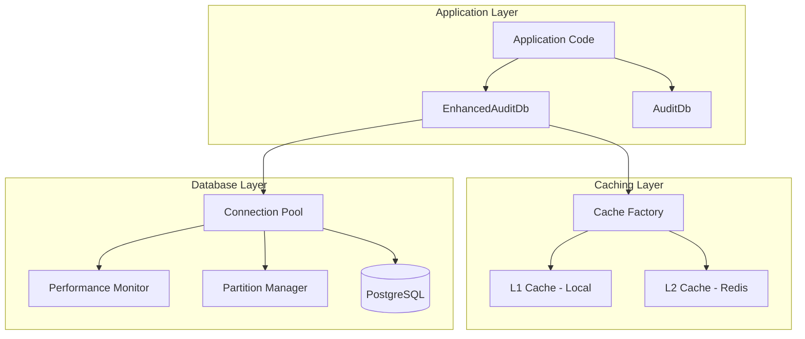
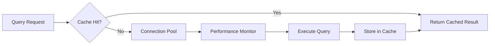
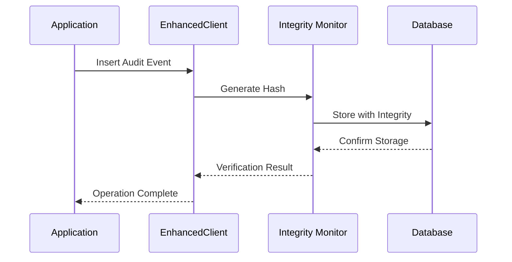

# @repo/audit-db Package Documentation Setup Design

## Overview

This design outlines the comprehensive documentation structure for the @repo/audit-db package, which has been completely redesigned to include advanced features such as performance optimization, Redis-based distributed caching, database partitioning, compliance management, and cryptographic integrity verification. The documentation will serve technical personnel who need detailed implementation guidance, troubleshooting resources, and code examples.

## Technology Stack Analysis

### Package Architecture

- **Core Database Client**: Multiple client implementations (AuditDb, AuditDbWithConfig, EnhancedAuditDb)
- **ORM Integration**: Drizzle ORM with PostgreSQL
- **Performance Layer**: Enhanced connection pooling, query caching, and monitoring
- **Caching System**: Redis-based distributed caching with L1/L2 strategy
- **Partitioning**: Time-based range partitioning for large audit datasets
- **Compliance Engine**: GDPR/HIPAA compliance with retention policies
- **CLI Tools**: Performance management and database administration commands

### Key Components

- Database schema with audit integrity tracking
- Connection pooling and performance monitoring
- Redis query caching with compression
- Automated partition management
- Migration utilities and CLI tools
- Compliance reporting and data retention

## Documentation Architecture

### Directory Structure

```
packages/audit-db/docs/
├── getting-started/
│   ├── index.md
│   ├── installation.md
│   ├── quick-start.md
│   └── configuration.md
├── tutorials/
│   ├── basic-usage.md
│   ├── performance-optimization.md
│   ├── redis-caching.md
│   ├── partitioning-setup.md
│   ├── compliance-configuration.md
│   └── migration-management.md
├── api-reference/
│   ├── core-classes.md
│   ├── enhanced-client.md
│   ├── caching-system.md
│   ├── performance-monitoring.md
│   ├── partitioning-api.md
│   └── schema-types.md
├── guides/
│   ├── troubleshooting.md
│   ├── best-practices.md
│   ├── environment-setup.md
│   ├── monitoring-alerts.md
│   └── security-compliance.md
├── examples/
│   ├── basic-operations.md
│   ├── advanced-queries.md
│   ├── performance-tuning.md
│   ├── cache-strategies.md
│   ├── compliance-reporting.md
│   └── integration-patterns.md
├── cli-reference/
│   ├── audit-db-cli.md
│   ├── performance-cli.md
│   └── migration-commands.md
├── faq.md
└── future-enhancements.md
```

## Core Documentation Components

### 1. Getting Started Section

#### Installation Guide

- Package installation via pnpm workspace
- Environment variable configuration
- Database setup requirements
- Redis configuration for caching

#### Quick Start Tutorial

- Basic AuditDb initialization
- Simple query examples
- Connection verification
- Error handling patterns

#### Configuration Guide

- Environment-specific configurations
- Connection pool parameters
- Cache configuration options
- Performance tuning settings

### 2. Comprehensive Tutorials

#### Basic Usage Tutorial

- Client initialization patterns
- Database connection management
- Schema interaction examples
- Transaction handling

#### Performance Optimization Tutorial

- Enhanced client setup
- Connection pooling configuration
- Query performance monitoring
- Optimization recommendations

#### Redis Caching Tutorial

- Cache strategy selection (local/redis/hybrid)
- Cache configuration patterns
- Query caching implementation
- Performance monitoring

#### Partitioning Setup Tutorial

- Partition strategy configuration
- Automated partition management
- Performance analysis
- Maintenance scheduling

#### Compliance Configuration Tutorial

- GDPR/HIPAA compliance setup
- Retention policy management
- Data classification
- Audit integrity verification

### 3. API Reference Documentation

#### Core Classes Reference

- AuditDb class methods and properties
- AuditDbWithConfig configuration options
- EnhancedAuditDb advanced features
- Error handling patterns

#### Enhanced Client API

- EnhancedAuditDatabaseClient methods
- Performance monitoring integration
- Health status checking
- Optimization strategies

#### Caching System API

- QueryCache interface
- RedisQueryCache implementation
- CachedQueryExecutor usage
- Cache invalidation strategies

### 4. Practical Examples

#### Code Examples for Common Use Cases

- Database initialization patterns
- Query execution with caching
- Performance monitoring setup
- Compliance reporting queries
- Migration execution
- CLI command usage

#### Integration Patterns

- Multi-instance deployment
- Health check implementation
- Monitoring integration
- Error recovery patterns

### 5. Troubleshooting Guide

#### Common Issues and Solutions

- Connection pool exhaustion
- Cache performance problems
- Partition maintenance issues
- Redis connectivity problems
- Migration failures
- Performance degradation

#### Diagnostic Tools and Commands

- Health check procedures
- Performance analysis tools
- Cache statistics monitoring
- Database maintenance commands

### 6. FAQ Section

#### Technical Questions

- When to use each client type
- Cache strategy selection
- Partition interval recommendations
- Compliance configuration
- Performance optimization priorities

## Visual Documentation Elements

### Architecture Diagrams



### Performance Optimization Flow



### Compliance Data Flow



## Future Enhancements Planning

### Roadmap Documentation Structure

Based on the PERFORMANCE_OPTIMIZATION.md future enhancements section:

#### Planned Improvements

- **Read Replicas**: Query routing to read-only instances
- **Horizontal Sharding**: Multi-database scaling strategy
- **Machine Learning**: Predictive performance optimization
- **Real-time Analytics**: Streaming performance metrics

#### Monitoring Enhancements

- **Grafana Dashboards**: Visual performance monitoring
- **Prometheus Integration**: Time-series metrics collection
- **Alertmanager**: Advanced alerting rules
- **Performance Baselines**: Regression detection

#### Implementation Timeline

- Phase 1: Read replica support (Q1)
- Phase 2: Sharding implementation (Q2)
- Phase 3: ML-based optimization (Q3)
- Phase 4: Advanced monitoring (Q4)

## Documentation Quality Standards

### Technical Writing Guidelines

- Clear, concise explanations for technical concepts
- Step-by-step procedures with verification steps
- Comprehensive code examples with comments
- Error scenarios and troubleshooting steps
- Performance considerations and best practices

### Code Example Standards

- TypeScript examples with proper typing
- Environment-specific configurations
- Error handling implementation
- Performance optimization patterns
- Security best practices

### Maintenance Strategy

- Regular updates with package changes
- Performance benchmarking examples
- Migration path documentation
- Backward compatibility notes
- Version-specific feature documentation

## Testing Integration

### Documentation Testing

- Code example validation
- CLI command verification
- Performance benchmark validation
- Configuration testing
- Integration example testing

### Continuous Documentation

- Automated example testing
- Performance regression documentation
- API change documentation
- Migration guide updates
- Troubleshooting scenario validation

This documentation structure will provide technical personnel with comprehensive guidance for implementing, optimizing, and maintaining the @repo/audit-db package across different environments and use cases.
