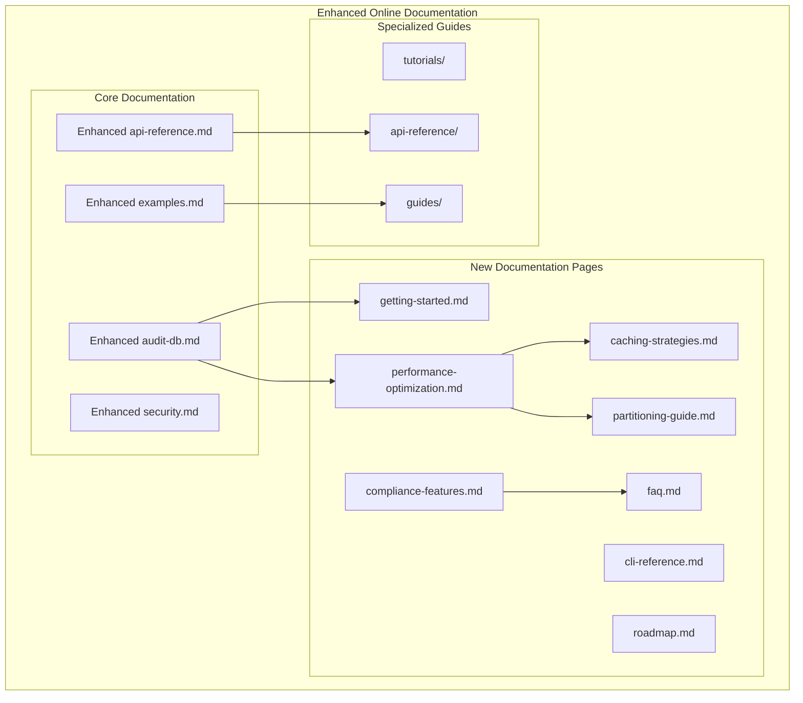
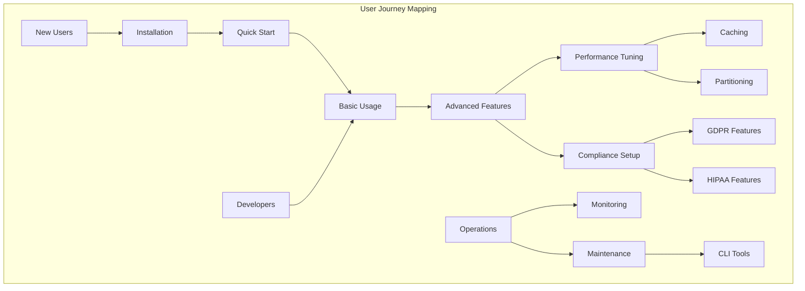

# Documentation Update Design: @repo/audit-db Online Documentation Enhancement

## Overview

This design outlines the comprehensive update of the online documentation in `apps/docs` for the `@repo/audit-db` package. The current online documentation provides basic information, but the package documentation in `packages/audit-db/docs` contains extensive, detailed documentation covering advanced features like performance optimization, Redis caching, database partitioning, compliance features, and comprehensive API references.

The goal is to replace the existing simplified documentation with the detailed, structured documentation that reflects the package's full capabilities and provides users with comprehensive guidance for implementation and optimization.

## Architecture

### Current State Analysis

The documentation architecture consists of two main documentation systems:

```mermaid
graph TB
    subgraph "Current State"
        PD[packages/audit-db/docs<br/>Comprehensive Documentation]
        OD[apps/docs/src/content/docs/audit<br/>Basic Documentation]
    end

    subgraph "Package Documentation Structure"
        IDX[index.md - Overview]
        GS[getting-started/ - Installation & Quick Start]
        TUT[tutorials/ - Step-by-step Guides]
        API[api-reference/ - Detailed API Docs]
        GUI[guides/ - Best Practices]
        EX[examples/ - Code Examples]
        CLI[cli-reference/ - CLI Tools]
        FAQ[faq.md - Common Questions]
        FE[future-enhancements.md - Roadmap]
    end

    subgraph "Online Documentation Structure"
        ADB[audit-db.md - Basic Info]
        APR[api-reference.md - Simple API]
        EXM[examples.md - Basic Examples]
        SEC[security.md - Security Info]
    end

    PD --> IDX
    PD --> GS
    PD --> TUT
    PD --> API
    PD --> GUI
    PD --> EX
    PD --> CLI
    PD --> FAQ
    PD --> FE

    OD --> ADB
    OD --> APR
    OD --> EXM
    OD --> SEC
```



### Target Architecture

The enhanced documentation will provide comprehensive coverage of all package features:



## Documentation Enhancement Strategy

### 1. Content Migration and Enhancement

#### Phase 1: Core Documentation Updates

**audit-db.md Enhancement**

- Replace basic overview with comprehensive package introduction
- Include architecture diagrams from package docs
- Add feature comparison matrix between client types
- Include performance characteristics and system requirements
- Add quick navigation to detailed sections

**api-reference.md Enhancement**

- Migrate detailed API documentation from `packages/audit-db/docs/api-reference/`
- Include comprehensive method signatures and examples
- Add error handling documentation
- Include TypeScript integration examples

**examples.md Enhancement**

- Migrate practical examples from package documentation
- Add implementation patterns for different client types
- Include performance optimization examples
- Add compliance-focused examples

**security.md Enhancement**

- Integrate compliance features documentation
- Add GDPR/HIPAA implementation guides
- Include cryptographic integrity examples
- Add security best practices

#### Phase 2: New Documentation Pages

**getting-started.md**

- Quick installation guide
- Environment setup instructions
- Client selection guidance
- First query examples

**performance-optimization.md**

- Connection pooling strategies
- Query caching implementation
- Database partitioning setup
- Monitoring and alerting configuration

**caching-strategies.md**

- Redis configuration
- L1/L2 cache architecture
- Cache invalidation strategies
- Performance tuning

**partitioning-guide.md**

- Time-based partitioning setup
- Partition maintenance automation
- Query optimization for partitioned tables
- Data retention policies

**compliance-features.md**

- GDPR compliance implementation
- HIPAA compliance features
- Audit trail integrity
- Data subject rights automation

### 2. Documentation Structure Optimization

#### Information Architecture



#### Content Organization Strategy

**Layered Documentation Approach**

1. **Overview Layer**: High-level concepts and architecture
2. **Tutorial Layer**: Step-by-step implementation guides
3. **Reference Layer**: Detailed API and configuration documentation
4. **Examples Layer**: Practical code examples and patterns
5. **Troubleshooting Layer**: Common issues and solutions

### 3. Content Quality Enhancement

#### Technical Accuracy

- Migrate exact API signatures from source documentation
- Include validated code examples
- Add comprehensive error handling patterns
- Include performance benchmarks and metrics

#### User Experience

- Add interactive code examples
- Include diagram-based explanations
- Create progressive disclosure for complex topics
- Add cross-references between related concepts

#### Maintenance Strategy

- Establish content update workflows
- Create documentation testing procedures
- Implement automated content validation
- Set up regular review cycles

## Implementation Roadmap

### Phase 1: Foundation (Week 1)

1. **Content Audit and Mapping**
   - Map existing package documentation to online structure
   - Identify content gaps and overlaps
   - Plan content migration strategy

2. **Core Page Updates**
   - Update `audit-db.md` with comprehensive overview
   - Enhance `api-reference.md` with detailed API documentation
   - Upgrade `examples.md` with practical implementation patterns

### Phase 2: Feature Documentation (Week 2)

1. **Performance Features**
   - Create `performance-optimization.md`
   - Create `caching-strategies.md`
   - Create `partitioning-guide.md`

2. **Compliance Features**
   - Create `compliance-features.md`
   - Enhance security documentation
   - Add regulatory compliance examples

### Phase 3: Developer Experience (Week 3)

1. **Getting Started Enhancement**
   - Create comprehensive `getting-started.md`
   - Add installation and setup guides
   - Create quick start tutorials

2. **Advanced Guides**
   - Create troubleshooting guides
   - Add best practices documentation
   - Create integration patterns

### Phase 4: Tools and Resources (Week 4)

1. **CLI Documentation**
   - Create `cli-reference.md`
   - Document performance monitoring tools
   - Add automation examples

2. **Support Resources**
   - Migrate `faq.md` content
   - Create `roadmap.md` from future enhancements
   - Add contribution guidelines

## Technical Implementation

### Documentation Format Standards

#### Markdown Structure

```
---
title: Page Title
description: Brief description for SEO
sidebar_position: number
---

# Page Title

## Overview
Brief introduction with key concepts

## Quick Start
Immediate action items for users

## Detailed Implementation
Step-by-step technical guidance

## Examples
Practical code examples

## Best Practices
Recommendations and patterns

## Troubleshooting
Common issues and solutions

## See Also
Related documentation links
```

#### Code Example Standards

```
// Always include imports
import { EnhancedAuditDb } from '@repo/audit-db'

// Use realistic examples
const auditDb = new EnhancedAuditDb({
  connectionPool: { maxConnections: 20 },
  queryCache: { enabled: true, maxSizeMB: 100 },
  monitoring: { enabled: true }
})

// Include error handling
try {
  const result = await auditDb.logEvent(event)
  console.log('Event logged:', result.id)
} catch (error) {
  console.error('Logging failed:', error.message)
}
```

### Content Migration Strategy

#### Automated Content Processing

1. **Content Extraction**: Parse existing documentation files
2. **Format Conversion**: Convert to online documentation format
3. **Link Resolution**: Update internal references
4. **Example Validation**: Verify code examples compile

#### Manual Enhancement Areas

1. **User Journey Optimization**: Reorganize content for better flow
2. **Cross-Reference Creation**: Add links between related concepts
3. **Visual Enhancement**: Add diagrams and illustrations
4. **Interactive Examples**: Create runnable code samples

### Quality Assurance

#### Content Validation

- Technical accuracy review by package maintainers
- User experience testing with target audiences
- Link validation and reference checking
- Code example compilation testing

#### Performance Monitoring

- Documentation load time optimization
- Search functionality effectiveness
- User engagement metrics tracking
- Feedback collection and analysis

## Success Metrics

### User Experience Metrics

- **Time to First Success**: Users completing their first audit log implementation
- **Documentation Completeness**: Coverage of all package features
- **User Satisfaction**: Feedback scores on documentation quality
- **Support Ticket Reduction**: Decrease in documentation-related questions

### Technical Metrics

- **Content Accuracy**: Percentage of validated code examples
- **Content Freshness**: Documentation update frequency
- **Cross-Reference Completeness**: Internal linking coverage
- **Performance**: Documentation site load times

### Adoption Metrics

- **Feature Discovery**: Usage of advanced features after documentation
- **Implementation Success**: Successful package implementations
- **Community Contribution**: Documentation contributions from users
- **Knowledge Retention**: User ability to implement features independently

## Risk Mitigation

### Content Consistency Risks

- **Mitigation**: Establish content review workflows
- **Validation**: Automated testing of code examples
- **Maintenance**: Regular synchronization with package updates

### User Experience Risks

- **Mitigation**: User testing and feedback collection
- **Monitoring**: Analytics tracking of user behavior
- **Improvement**: Iterative enhancement based on usage patterns

### Technical Risks

- **Mitigation**: Backup existing documentation before updates
- **Testing**: Staged deployment of documentation changes
- **Rollback**: Prepared rollback procedures for critical issues

This comprehensive documentation update will transform the online documentation from basic package information to a complete, professional resource that supports users from initial installation through advanced enterprise deployment scenarios.
