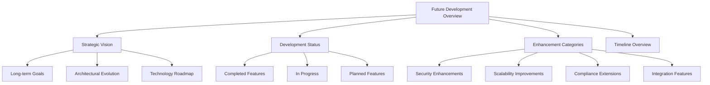
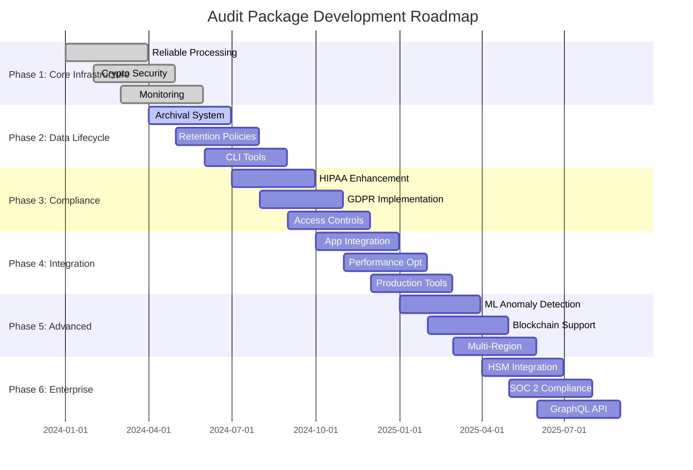
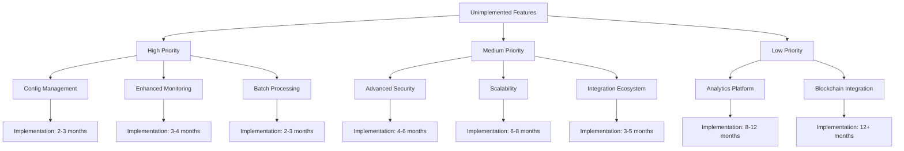
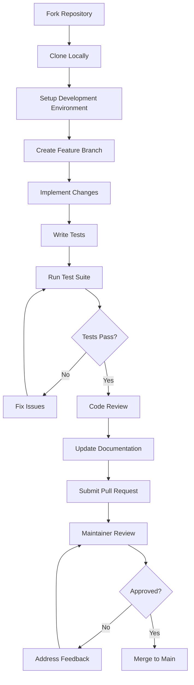

# Future Enhancements Documentation Design

## Overview

This design document outlines the comprehensive documentation structure for the Future Development section of the @repo/audit package. The documentation focuses on the roadmap, unimplemented features, and contribution guidelines that were identified as TODO items in the current README.md file.

The Future Development documentation serves as a strategic guide for developers, contributors, and stakeholders to understand the package's evolution trajectory, planned enhancements, and how to participate in its development.

## Repository Context

**Package Type**: Backend Framework/Library - Healthcare Audit Logging System
**Core Purpose**: Cryptographically secure, HIPAA/GDPR-compliant audit event processing
**Technology Stack**: TypeScript, BullMQ + Redis, PostgreSQL with Drizzle ORM
**Architecture**: Monorepo with shared packages and multi-platform applications

## Documentation Architecture

### Directory Structure for Future Enhancements

```
packages/audit/docs/future-enhancements/
├── index.md                      # Future Development overview
├── roadmap.md                    # Development roadmap with timeline
├── unimplemented-features.md     # Missing features and rationale
└── contribution-guide.md         # Developer contribution guidelines
```

### Documentation Components

#### 1. Future Development Overview (index.md)

**Purpose**: Central hub providing strategic vision and navigation for future development plans

**Key Sections**:

- Strategic Vision and Goals
- Current Development Status
- Major Enhancement Categories
- Timeline Overview
- Navigation to Detailed Documents

**Content Structure**:



#### 2. Development Roadmap (roadmap.md)

**Purpose**: Detailed timeline-based development plan with phases, milestones, and priorities

**Phase-Based Development Structure**:

**Phase 1: Core Infrastructure Enhancement (Current - Q2 2024)**

- Reliable Event Processing with Circuit Breakers
- Enhanced Cryptographic Security Layer
- Basic Monitoring and Health Checks
- PostgreSQL Schema Optimization

**Phase 2: Data Lifecycle Management (Q2 - Q3 2024)**

- Automated Archival System Implementation
- Retention Policy Management
- Data Classification Framework
- Command-Line Tools for Archive Management

**Phase 3: Compliance and Security Enhancement (Q3 - Q4 2024)**

- Advanced HIPAA Compliance Features
- GDPR Data Subject Rights Implementation
- Enhanced Access Controls and Authentication
- Security Incident Reporting and Alerting

**Phase 4: Integration and Optimization (Q4 2024 - Q1 2025)**

- Multi-Platform Application Integration
- Performance Optimization and Caching
- Load Testing and Capacity Planning
- Production Deployment Tools

**Phase 5: Advanced Features (Q1 - Q2 2025)**

- Machine Learning-Based Anomaly Detection
- Blockchain-Based Immutable Audit Trails
- Multi-Region Replication Support
- Advanced Analytics and Reporting

**Phase 6: Enterprise Features (Q2 - Q3 2025)**

- Hardware Security Module (HSM) Integration
- SOC 2 Type II Compliance Support
- Custom Regulatory Framework Support
- GraphQL API for External Integrations

**Roadmap Visualization**:



#### 3. Unimplemented Features (unimplemented-features.md)

**Purpose**: Comprehensive catalog of missing features with priority levels, implementation complexity, and rationale

**Feature Categories and Priority Matrix**:

**High Priority - Near Term Implementation**:

1. **Advanced Configuration Management**
   - Hot reloading capabilities for configuration changes
   - Encrypted configuration storage with AES-256-GCM
   - Version tracking and rollback mechanisms
   - Multi-environment configuration validation

2. **Enhanced Monitoring and Observability**
   - Real-time dashboard with customizable widgets
   - Automated alert correlation and severity escalation
   - Predictive monitoring based on historical patterns
   - Integration with external monitoring systems (Datadog, New Relic)

3. **Batch Processing Optimization**
   - Bulk event processing with configurable batch sizes
   - Parallel processing with worker thread pools
   - Memory-efficient large dataset handling
   - Progress tracking and resume capabilities

**Medium Priority - Mid-Term Implementation**:

1. **Advanced Security Features**
   - Multi-signature verification for critical events
   - Zero-knowledge proof implementations for privacy
   - Advanced threat detection using behavioral analysis
   - Secure multi-party computation for sensitive data

2. **Scalability Enhancements**
   - Horizontal queue partitioning across multiple Redis instances
   - Database sharding strategies for massive datasets
   - Event streaming integration with Apache Kafka
   - Auto-scaling based on queue depth and processing load

3. **Integration Ecosystem**
   - Webhook system for real-time event notifications
   - Plugin architecture for custom event processors
   - REST API for external system integrations
   - SDK generators for multiple programming languages

**Low Priority - Future Consideration**:

1. **Advanced Analytics Platform**
   - Machine learning models for fraud detection
   - Automated compliance risk assessment
   - Behavioral pattern recognition and alerting
   - Predictive analytics for capacity planning

2. **Blockchain Integration**
   - Immutable audit trails using distributed ledger technology
   - Smart contracts for automated compliance checking
   - Decentralized storage for long-term audit retention
   - Cross-chain interoperability for multi-organization audits

**Feature Implementation Matrix**:



#### 4. Contribution Guide (contribution-guide.md)

**Purpose**: Comprehensive guide for developers contributing to the audit package development

**Contribution Framework**:

**Development Environment Setup**:

- Repository structure and monorepo navigation
- Required tools and dependencies (Node.js, pnpm, PostgreSQL, Redis)
- Development database setup and configuration
- Testing environment configuration
- Code quality tools (ESLint, Prettier, TypeScript)

**Contribution Workflow**:



**Code Standards and Guidelines**:

- TypeScript best practices and type safety requirements
- Security coding standards for healthcare applications
- Performance optimization guidelines
- Error handling and logging patterns
- Documentation standards for API references

**Testing Requirements**:

- Unit test coverage expectations (minimum 80%)
- Integration test scenarios for database and Redis interactions
- End-to-end test patterns for complete audit workflows
- Performance test benchmarks for high-volume scenarios
- Security test validations for cryptographic functions

**Security and Compliance Considerations**:

- HIPAA compliance requirements for code changes
- GDPR data handling best practices
- Cryptographic implementation standards
- Secure coding review checklist
- Vulnerability assessment procedures

**Documentation Contributions**:

- API documentation standards using JSDoc
- User guide writing guidelines
- Example code quality requirements
- Diagram creation using Mermaid syntax
- Translation and localization processes

**Release Process and Versioning**:

- Semantic versioning strategy for the audit package
- Release candidate testing procedures
- Breaking change communication protocols
- Migration guide requirements for major versions
- Hotfix and patch release procedures

## Implementation Priorities

### Immediate Focus Areas (Next 3 Months)

1. **Configuration Management Enhancement**
   - Implement hot reloading for audit service configuration
   - Add encrypted storage for sensitive configuration parameters
   - Develop configuration validation and schema enforcement
   - Create configuration migration tools for version updates

2. **Advanced Monitoring Dashboard**
   - Build real-time metrics visualization with customizable widgets
   - Implement alert correlation and automatic severity escalation
   - Add predictive monitoring capabilities based on historical trends
   - Integrate with popular monitoring platforms (Prometheus, Grafana)

3. **Batch Processing Optimization**
   - Enhance bulk event processing with configurable batch sizes
   - Implement parallel processing using worker thread pools
   - Optimize memory usage for large dataset processing
   - Add progress tracking and resume functionality for long-running operations

### Medium-Term Objectives (3-6 Months)

1. **Security Feature Expansion**
   - Implement multi-signature verification for critical audit events
   - Add behavioral analysis for advanced threat detection
   - Develop zero-knowledge proof implementations for privacy protection
   - Create secure multi-party computation capabilities

2. **Scalability Infrastructure**
   - Design horizontal queue partitioning across multiple Redis instances
   - Implement database sharding strategies for massive audit datasets
   - Integrate with Apache Kafka for high-throughput event streaming
   - Develop auto-scaling mechanisms based on queue depth and processing load

### Long-Term Vision (6+ Months)

1. **Advanced Analytics Platform**
   - Develop machine learning models for automated fraud detection
   - Create predictive analytics for compliance risk assessment
   - Implement behavioral pattern recognition and automated alerting
   - Build capacity planning tools with predictive scaling recommendations

2. **Blockchain Integration Framework**
   - Research and prototype blockchain-based immutable audit trails
   - Develop smart contracts for automated compliance verification
   - Create decentralized storage solutions for long-term audit retention
   - Design cross-chain interoperability for multi-organization audit sharing

## Migration and Upgrade Strategy

### Version Compatibility Framework

**Breaking Change Management**:

- Clear communication of breaking changes with migration guides
- Deprecation warnings with timeline for feature removal
- Backward compatibility layers where technically feasible
- Automated migration tools for common upgrade scenarios

**Database Schema Evolution**:

- Incremental migration strategies for large audit databases
- Zero-downtime upgrade procedures for production environments
- Rollback mechanisms for failed migrations
- Data integrity validation during migration processes

**Configuration Migration**:

- Automated configuration conversion between versions
- Validation tools for configuration file compatibility
- Environment-specific migration strategies
- Security parameter updates and key rotation procedures

## Testing and Quality Assurance Strategy

### Comprehensive Testing Framework

**Test Categories and Coverage Requirements**:

1. **Unit Tests** (Minimum 80% Coverage)
   - Individual component functionality validation
   - Cryptographic function verification
   - Configuration validation and error handling
   - Mock-based testing for external dependencies

2. **Integration Tests**
   - Database interaction and transaction management
   - Redis queue operations and reliability mechanisms
   - Cross-component communication validation
   - Third-party service integration testing

3. **End-to-End Tests**
   - Complete audit event lifecycle verification
   - Multi-component workflow validation
   - Error recovery and resilience testing
   - Performance benchmarking under load

4. **Security Tests**
   - Cryptographic implementation validation
   - Access control and authorization testing
   - Data integrity and tamper detection verification
   - Vulnerability scanning and penetration testing

5. **Compliance Tests**
   - HIPAA requirement validation
   - GDPR data handling verification
   - Regulatory audit trail completeness
   - Data retention and archival compliance

### Performance Benchmarking

**Performance Metrics and Targets**:

- Event processing latency: < 100ms for 95th percentile
- Queue throughput: > 10,000 events per second
- Database write performance: < 50ms for audit event persistence
- Memory usage optimization: < 512MB for standard workloads
- CPU utilization efficiency: < 70% under normal load

**Load Testing Scenarios**:

- Burst load handling with 50,000+ events in 1 minute
- Sustained high-volume processing for 24+ hours
- Resource exhaustion recovery and graceful degradation
- Multi-tenant isolation and performance consistency

This comprehensive documentation design provides a strategic framework for the future development of the @repo/audit package, ensuring clarity for contributors and stakeholders while maintaining focus on healthcare compliance, security, and operational excellence.
