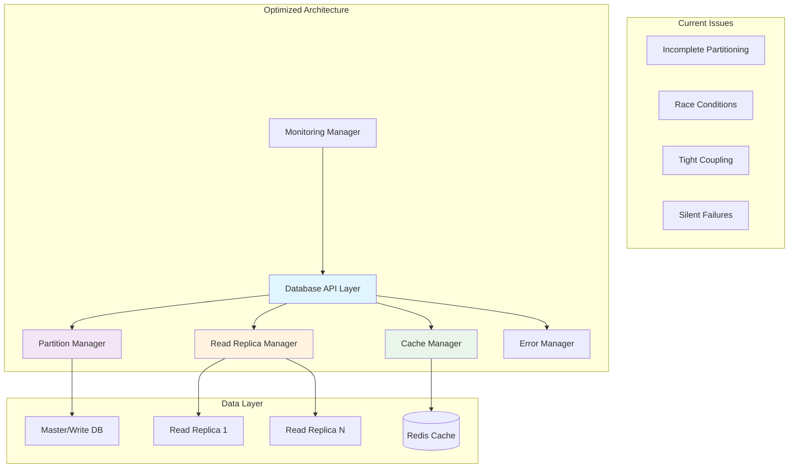
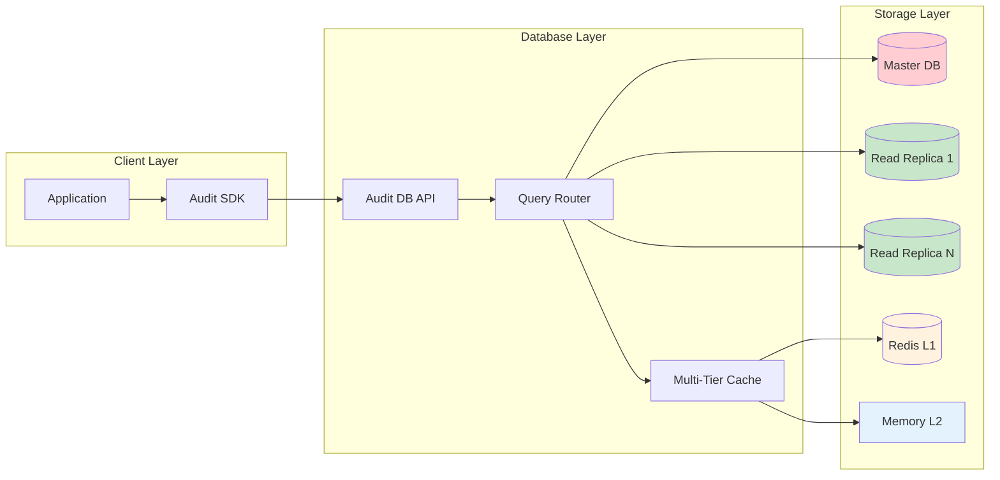
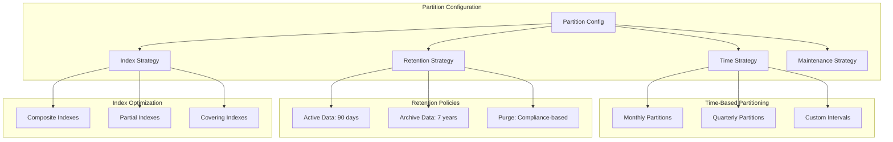
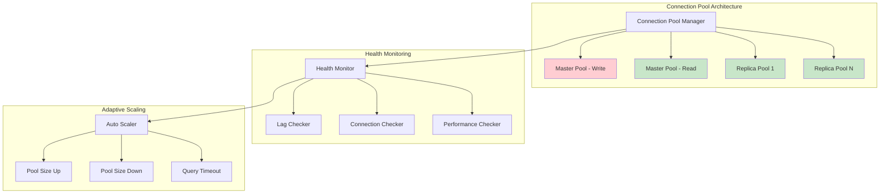
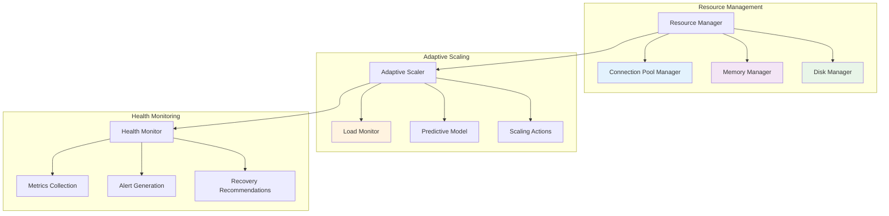
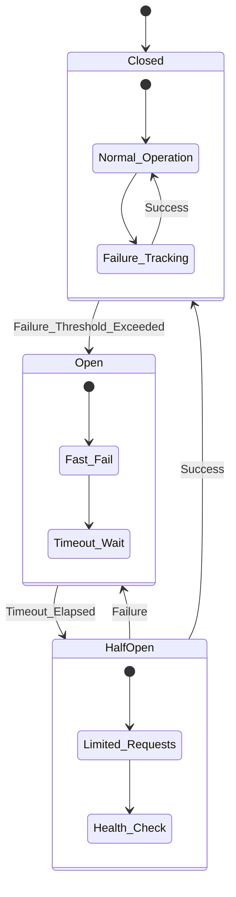
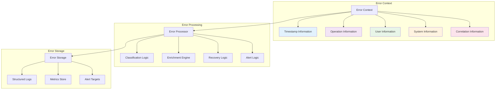
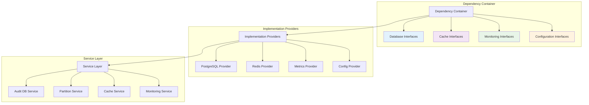
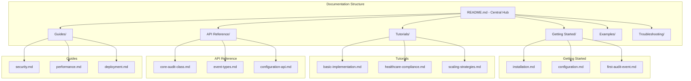
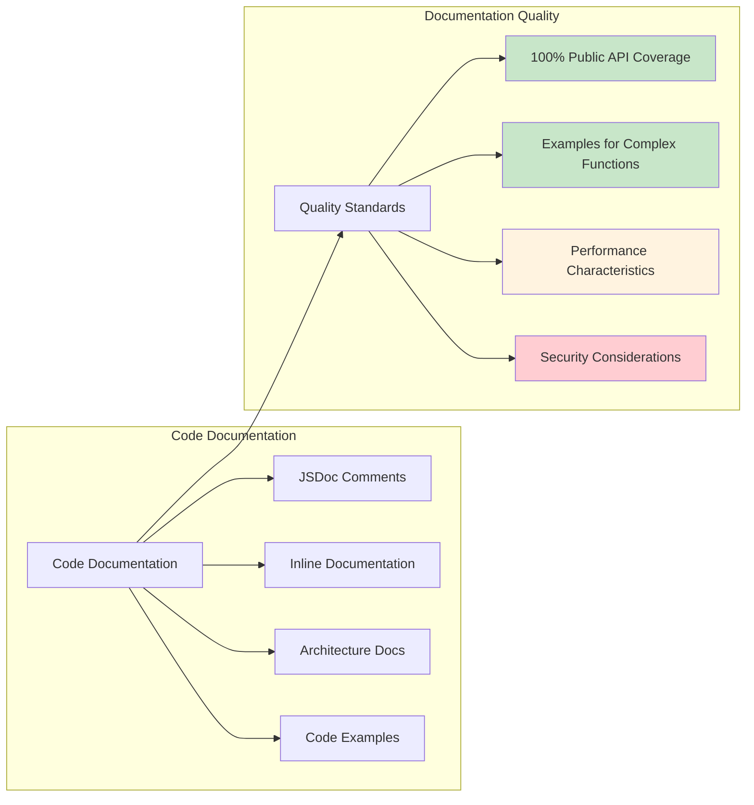

# Audit Database Package Optimization Design

## Overview

This design document outlines the comprehensive optimization strategy for the `@repo/audit-db` package to achieve production-ready status. Based on the code review findings, the optimization focuses on database performance, reliability, scalability, and minimal dependency management while maintaining HIPAA and GDPR compliance requirements.

The optimization transforms the audit-db package from its current moderate stability (70%) to a highly reliable, production-ready database layer optimized for healthcare audit logging scenarios with advanced partitioning, read replica support, and intelligent caching strategies.

### Design Objectives

The optimization addresses four critical dimensions:

- **Performance Enhancement**: Implement production-ready partitioning, optimized caching, and read replica support
- **Reliability Improvement**: Resolve race conditions, implement robust error handling, and add circuit breaker patterns
- **Scalability Enhancement**: Design horizontal scaling capabilities with minimal resource overhead
- **Maintainability Focus**: Minimize dependencies and provide comprehensive documentation

## Architecture

### Current Architecture Limitations

The existing architecture suffers from incomplete implementations, race conditions, and tight coupling between components. The optimization redesigns the architecture following dependency inversion principles and separation of concerns.



### Optimized Component Architecture

The redesigned architecture implements clear separation of concerns with dependency injection and interface-based contracts:

| Component                       | Responsibility                                                | Interface Contract           |
| ------------------------------- | ------------------------------------------------------------- | ---------------------------- |
| **Database Connection Manager** | Manage primary and replica connections with health monitoring | `IDatabaseConnectionManager` |
| **Partition Management System** | Automated partition lifecycle with concurrency control        | `IPartitionManager`          |
| **Query Cache Layer**           | Multi-tier caching with invalidation strategies               | `IQueryCache`                |
| **Read Replica Router**         | Intelligent query routing based on read/write patterns        | `IReadReplicaRouter`         |
| **Error Recovery System**       | Circuit breaker implementation with exponential backoff       | `IErrorRecoverySystem`       |
| **Performance Monitor**         | Real-time metrics collection and alerting                     | `IPerformanceMonitor`        |

### Data Flow Architecture

The optimized data flow ensures high availability, consistency, and performance through intelligent routing and caching strategies:



## Database Optimization Strategy

### Partition Management Enhancement

The current partition management system suffers from race conditions and incomplete implementations. The optimization provides a robust, production-ready partitioning strategy:

#### Automated Partition Lifecycle

| Partition Phase | Automated Process                              | Recovery Mechanism                             |
| --------------- | ---------------------------------------------- | ---------------------------------------------- |
| **Creation**    | Time-based triggers with database locks        | Idempotent operations with conflict resolution |
| **Maintenance** | Index optimization and statistics updates      | Health checks with automatic repair            |
| **Archival**    | Automated compression and read-only conversion | Backup verification and rollback capability    |
| **Cleanup**     | Retention policy enforcement                   | Audit trail preservation                       |

#### Partition Strategy Configuration



### Read Replica Integration

The optimization introduces intelligent read replica management for horizontal scaling and load distribution:

#### Read Replica Router Design

| Query Pattern                  | Routing Strategy                    | Fallback Mechanism               |
| ------------------------------ | ----------------------------------- | -------------------------------- |
| **Read-Heavy Queries**         | Round-robin across healthy replicas | Automatic failover to master     |
| **Consistency-Critical Reads** | Master database only                | Circuit breaker for availability |
| **Analytics Queries**          | Dedicated analytics replica         | Query queue with timeout         |
| **Real-time Queries**          | Nearest replica with lag monitoring | Lag-based routing decisions      |

#### Connection Management Strategy

The optimized connection management implements adaptive pooling with health monitoring:



### Query Cache Optimization

The optimization redesigns the caching layer to eliminate O(N) complexity issues and implement proper LRU mechanisms:

#### Multi-Tier Cache Architecture

| Cache Tier            | Technology        | Purpose                    | Eviction Policy                   |
| --------------------- | ----------------- | -------------------------- | --------------------------------- |
| **L1 - Memory**       | In-process Map    | Ultra-low latency access   | Size-based LRU with TTL           |
| **L2 - Redis**        | Distributed Redis | Cross-instance consistency | Redis native LRU with compression |
| **L3 - Query Result** | PostgreSQL        | Prepared statement cache   | PostgreSQL automatic management   |

#### Cache Key Strategy

The optimization implements collision-resistant cache keys with hierarchical invalidation:

```mermaid
graph LR
    subgraph "Cache Key Hierarchy"
        CK[Cache Key]
        CK --> NS[Namespace: audit-db]
        CK --> QT[Query Type: select|insert|update]
        CK --> QH[Query Hash: SHA-256]
        CK --> PH[Params Hash: SHA-256]
        CK --> VER[Schema Version]
    end

    subgraph "Invalidation Strategy"
        IS[Invalidation Strategy]
        IS --> TI[Table-based Invalidation]
        IS --> PI[Pattern-based Invalidation]
        IS --> TTL[TTL-based Expiration]
    end

    CK --> IS

    style NS fill:#e3f2fd
    style QT fill:#f3e5f5
    style QH fill:#e8f5e8
    style PH fill:#fff3e0
    style VER fill:#fce4ec
```

## Performance Enhancement

### Algorithmic Complexity Optimization

The optimization addresses critical O(N²) and O(N×M) complexity issues identified in the code review:

#### Partition Management Optimization

| Operation              | Current Complexity      | Optimized Complexity    | Implementation Strategy                   |
| ---------------------- | ----------------------- | ----------------------- | ----------------------------------------- |
| **Partition Lookup**   | O(N) linear scan        | O(log N) indexed search | B-tree index on partition metadata        |
| **Cleanup Operations** | O(N×M) nested loops     | O(N) single pass        | Batch operations with prepared statements |
| **Index Analysis**     | O(N²) comparison matrix | O(N) hash-based lookup  | Index metadata caching                    |

#### Cache Performance Optimization

The LRU cache implementation receives a complete rewrite to achieve O(1) operations:

```mermaid
graph TB
    subgraph "Optimized LRU Cache"
        OLC[O(1) LRU Cache]
        OLC --> HM[Hash Map: Key → Node]
        OLC --> DLL[Doubly Linked List]
        OLC --> ST[Size Tracker]
    end

    subgraph "Cache Operations"
        CO[Cache Operations]
        CO --> GET[Get: O(1)]
        CO --> PUT[Put: O(1)]
        CO --> EVT[Evict: O(1)]
        CO --> SIZE[Size: O(1)]
    end

    subgraph "Memory Management"
        MM[Memory Manager]
        MM --> IS[Incremental Sizing]
        MM --> BC[Batch Cleanup]
        MM --> GC[Garbage Collection]
    end

    OLC --> CO
    CO --> MM

    style GET fill:#c8e6c9
    style PUT fill:#c8e6c9
    style EVT fill:#c8e6c9
    style SIZE fill:#c8e6c9
```

### Index Strategy Optimization

The optimization implements intelligent index management with automatic optimization:

#### Index Configuration Matrix

| Query Pattern            | Index Type       | Columns                              | Maintenance Strategy              |
| ------------------------ | ---------------- | ------------------------------------ | --------------------------------- |
| **Time Range Queries**   | BRIN Index       | timestamp, created_at                | Automatic with partition creation |
| **User Activity Lookup** | B-tree Composite | user_id, timestamp                   | Monthly optimization              |
| **Event Type Filtering** | Partial Index    | event_type WHERE frequently_queried  | Usage-based creation              |
| **Full Text Search**     | GIN Index        | event_data (JSONB)                   | Weekly maintenance                |
| **Compliance Queries**   | Covering Index   | compliance_fields + included_columns | Quarterly review                  |

### Resource Management Enhancement

The optimization implements adaptive resource management with predictive scaling:



## Reliability and Error Handling

### Circuit Breaker Implementation

The optimization implements comprehensive circuit breaker patterns for all external dependencies:

#### Circuit Breaker Configuration

| Component                | Failure Threshold | Timeout | Recovery Strategy                     |
| ------------------------ | ----------------- | ------- | ------------------------------------- |
| **Master Database**      | 5 failures / 30s  | 30s     | Exponential backoff with jitter       |
| **Read Replicas**        | 3 failures / 15s  | 15s     | Replica rotation with health checks   |
| **Redis Cache**          | 10 failures / 60s | 5s      | Cache bypass with performance logging |
| **Partition Operations** | 2 failures / 10s  | 60s     | Operation queuing with retry          |

#### Error Recovery State Machine



### Structured Error Management

The optimization replaces console logging with structured error management:

#### Error Classification System

| Error Category            | Severity Level | Action Required | Recovery Strategy          |
| ------------------------- | -------------- | --------------- | -------------------------- |
| **Connection Errors**     | High           | Immediate       | Circuit breaker activation |
| **Query Timeout**         | Medium         | Monitoring      | Query optimization         |
| **Cache Miss**            | Low            | Logging         | Performance metrics update |
| **Partition Conflicts**   | High           | Resolution      | Lock-based retry           |
| **Compliance Violations** | Critical       | Alert           | Audit trail creation       |

#### Error Context Enrichment

The error handling system provides comprehensive context for operational debugging:



## Dependency Minimization

### Current Dependency Analysis

The optimization reduces external dependencies while maintaining functionality:

| Current Dependencies     | Optimization Strategy                 | Alternative Approach                          |
| ------------------------ | ------------------------------------- | --------------------------------------------- |
| **ioredis (5.8.0)**      | Maintain - Core caching functionality | Consider Redis-compatible alternatives        |
| **postgres (3.4.7)**     | Maintain - Primary database driver    | Potential for connection pooling optimization |
| **drizzle-orm (0.44.5)** | Maintain - Type-safe ORM              | Optimize query generation                     |
| **commander (^12.1.0)**  | Evaluate - CLI functionality          | Consider built-in argument parsing            |
| **@faker-js/faker**      | Remove from production                | Development-only dependency                   |

### Dependency Injection Architecture

The optimization implements dependency injection to reduce tight coupling:



### Interface Standardization

The optimization defines clear interfaces for all major components:

#### Core Interface Definitions

| Interface              | Purpose                        | Key Methods                                    |
| ---------------------- | ------------------------------ | ---------------------------------------------- |
| **IAuditDatabase**     | Primary database operations    | `insert`, `query`, `transaction`               |
| **IPartitionManager**  | Partition lifecycle management | `createPartition`, `dropPartition`, `optimize` |
| **IQueryCache**        | Cache operations               | `get`, `set`, `invalidate`, `stats`            |
| **IConnectionManager** | Connection lifecycle           | `getConnection`, `healthCheck`, `poolStats`    |
| **IErrorHandler**      | Error processing               | `handle`, `classify`, `recover`                |

## Documentation Enhancement

### Documentation Structure Redesign

The optimization provides comprehensive documentation following the established preference:

#### Documentation Hierarchy



### Interactive Documentation Features

The optimization includes interactive documentation elements:

#### Documentation Enhancement Matrix

| Documentation Type     | Format                | Interactive Elements                         | Update Frequency    |
| ---------------------- | --------------------- | -------------------------------------------- | ------------------- |
| **API Reference**      | Markdown + JSDoc      | Code examples, parameter validation          | Automated from code |
| **Performance Guides** | Markdown + Metrics    | Benchmark results, configuration calculators | Weekly updates      |
| **Troubleshooting**    | Markdown + Flowcharts | Decision trees, diagnostic scripts           | As issues arise     |
| **Examples**           | Executable code       | Runnable scenarios, test cases               | Per feature release |

### Code Documentation Standards

The optimization establishes comprehensive code documentation standards:



## Implementation Roadmap

### Phase 1: Critical Infrastructure (Weeks 1-2)

Priority 1 implementation addressing production blockers:

| Task                              | Duration | Dependencies      | Success Criteria                     |
| --------------------------------- | -------- | ----------------- | ------------------------------------ |
| **Partition System Completion**   | 5 days   | PostgreSQL setup  | Automated partition creation working |
| **Error Handling Implementation** | 3 days   | Logging framework | Structured error handling deployed   |
| **Race Condition Resolution**     | 2 days   | Database locks    | Concurrency tests passing            |
| **Circuit Breaker Integration**   | 3 days   | Error handling    | Fault tolerance verified             |

### Phase 2: Performance Optimization (Weeks 3-4)

Performance enhancement implementation:

| Task                                | Duration | Dependencies     | Success Criteria           |
| ----------------------------------- | -------- | ---------------- | -------------------------- |
| **LRU Cache Optimization**          | 4 days   | Cache framework  | O(1) operations achieved   |
| **Read Replica Integration**        | 5 days   | Database setup   | Load balancing functional  |
| **Index Strategy Implementation**   | 3 days   | Schema updates   | Query performance improved |
| **Algorithm Complexity Resolution** | 3 days   | Code refactoring | Complexity targets met     |

### Phase 3: Documentation and Testing (Week 5)

Documentation and quality assurance:

| Task                                 | Duration | Dependencies     | Success Criteria                 |
| ------------------------------------ | -------- | ---------------- | -------------------------------- |
| **Documentation Structure Creation** | 2 days   | Content strategy | Documentation hierarchy complete |
| **API Documentation Generation**     | 2 days   | Code completion  | 100% API coverage                |
| **Integration Testing**              | 3 days   | All components   | End-to-end tests passing         |

### Success Metrics

The optimization success will be measured against specific performance and reliability targets:

#### Performance Benchmarks

| Metric                             | Current Performance        | Target Performance         | Measurement Method     |
| ---------------------------------- | -------------------------- | -------------------------- | ---------------------- |
| **Query Response Time**            | Variable, up to 2s         | < 100ms for cached queries | Automated benchmarking |
| **Partition Creation Time**        | 30-60 seconds              | < 5 seconds                | Performance monitoring |
| **Cache Hit Ratio**                | 60-70%                     | > 90%                      | Redis metrics          |
| **Concurrent Connection Handling** | Limited by race conditions | 1000+ concurrent           | Load testing           |

#### Reliability Targets

| Component                | Current Uptime | Target Uptime | Recovery Time |
| ------------------------ | -------------- | ------------- | ------------- |
| **Database Connections** | 95%            | 99.9%         | < 30 seconds  |
| **Cache Operations**     | 90%            | 99.5%         | < 5 seconds   |
| **Partition Management** | 85%            | 99%           | < 2 minutes   |
| **Read Replica Routing** | N/A            | 99.5%         | < 10 seconds  |

The optimized audit-db package will provide a robust, scalable, and maintainable foundation for healthcare audit logging requirements while maintaining minimal dependencies and comprehensive documentation.
