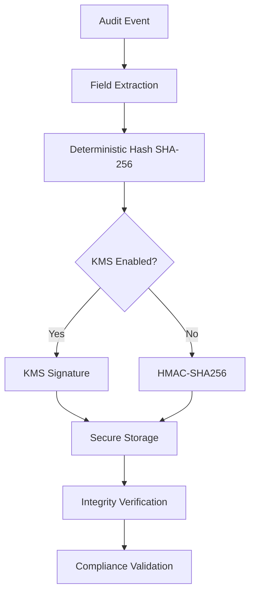
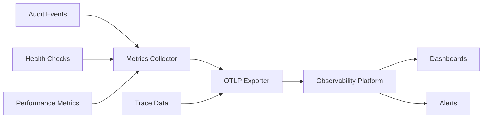
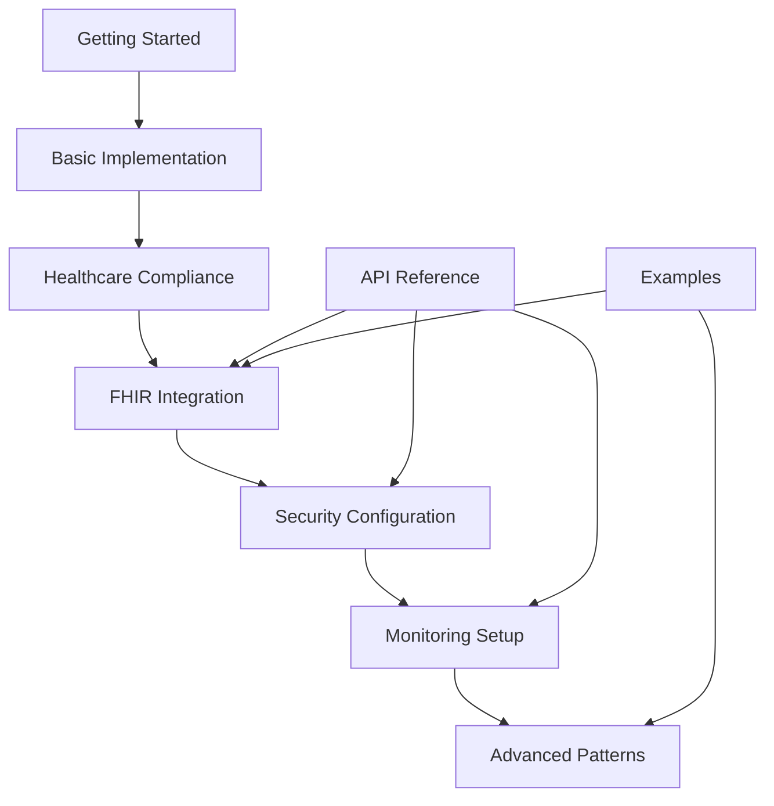

# @repo/audit Package - Tutorials Documentation Design

## Overview

This design document outlines the structure and content for the remaining tutorials documentation in the @repo/audit package. The tutorials are specifically designed for healthcare applications requiring HIPAA and GDPR compliance, focusing on practical implementation scenarios with comprehensive security and observability features.

## Repository Analysis

The @repo/audit package is a **Backend Library** specifically designed for healthcare audit logging. It provides:

- Healthcare-specific audit logging with HIPAA/GDPR compliance
- FHIR resource audit tracking
- Cryptographic integrity verification
- Observability and monitoring integration
- Secure configuration management with KMS support

## Documentation Architecture

The tutorials documentation follows a progressive learning approach, building from basic concepts to advanced implementation patterns. Each tutorial includes practical examples, configuration templates, and troubleshooting guidance.

### Document Structure Strategy

Each tutorial document will follow this consistent structure:

1. **Overview & Prerequisites**
2. **Step-by-Step Implementation**
3. **Configuration Examples**
4. **Verification & Testing**
5. **Common Pitfalls & Solutions**
6. **Next Steps**

## Tutorial Documents Design

### 1. FHIR Integration Tutorial

**File**: `tutorials/fhir-integration.md`

#### Purpose

Guide developers through implementing FHIR-compliant audit logging for healthcare applications, ensuring proper tracking of FHIR resource access and modifications.

#### Content Framework

| Section                | Description                          | Key Elements                               |
| ---------------------- | ------------------------------------ | ------------------------------------------ |
| Prerequisites          | Required knowledge and setup         | FHIR basics, audit system installation     |
| FHIR Event Types       | Available FHIR audit categories      | Patient, Practitioner, Observation, Bundle |
| Implementation         | Step-by-step FHIR audit setup        | Configuration, event logging, validation   |
| Resource Mapping       | FHIR resource to audit event mapping | Resource types, action mapping, metadata   |
| Compliance Integration | HIPAA/GDPR compliance with FHIR      | Required fields, retention policies        |
| Verification           | Testing FHIR audit implementation    | Sample events, validation checks           |

#### Key Implementation Areas

- **FHIR Resource Categories**: Patient data access, practitioner actions, observation creation, bundle processing
- **Event Structure**: FHIR-specific fields (fhirResourceType, fhirVersion, bundleType, operationOutcome)
- **Compliance Mapping**: How FHIR events satisfy regulatory requirements
- **Integration Patterns**: EMR system integration, API gateway logging, clinical workflow tracking

### 2. Security Configuration Tutorial

**File**: `tutorials/security-configuration.md`

#### Purpose

Comprehensive guide for implementing cryptographic security features, KMS integration, and secure audit trail management.

#### Content Framework

| Section            | Description                        | Key Elements                               |
| ------------------ | ---------------------------------- | ------------------------------------------ |
| Security Overview  | Audit security architecture        | Cryptographic protocols, threat model      |
| Hash Generation    | SHA-256 integrity verification     | Field selection, deterministic hashing     |
| Digital Signatures | HMAC-SHA256 authentication         | Signature generation, verification process |
| KMS Integration    | External key management setup      | Infisical KMS, encryption, key rotation    |
| Secure Storage     | Encrypted configuration management | Configuration encryption, secure defaults  |
| Threat Mitigation  | Security best practices            | Tamper detection, secure transmission      |

#### Security Architecture

#### Implementation Areas

- **Cryptographic Configuration**: Algorithm selection, key management, security levels
- **KMS Integration**: Infisical setup, key rotation, encrypted telemetry
- **Integrity Verification**: Hash validation, signature verification, tamper detection
- **Secure Transmission**: OTLP encryption, secure endpoints, authentication

### 3. Monitoring & Observability Tutorial

**File**: `tutorials/monitoring-setup.md`

#### Purpose

Guide for implementing comprehensive monitoring, metrics collection, and observability for audit system performance and health.

#### Content Framework

| Section                    | Description                     | Key Elements                            |
| -------------------------- | ------------------------------- | --------------------------------------- |
| Observability Architecture | Monitoring system design        | Metrics, traces, logs, alerts           |
| OTLP Integration           | OpenTelemetry configuration     | Exporters, batching, security           |
| Metrics Collection         | Performance and health metrics  | Processing latency, queue depth, errors |
| Distributed Tracing        | Request tracing across services | Span creation, context propagation      |
| Alert Configuration        | Proactive monitoring setup      | Severity levels, notification channels  |
| Dashboard Setup            | Visualization and analysis      | Key metrics, performance trends         |

#### Monitoring Architecture

#### Implementation Areas

- **OTLP Configuration**: Endpoint setup, authentication, batch processing, encryption
- **Metrics Definition**: Custom metrics, standard metrics, business metrics
- **Tracing Strategy**: Span creation, context propagation, performance analysis
- **Alert Management**: Threshold configuration, notification routing, escalation

### 4. Advanced Implementation Patterns Tutorial

**File**: `tutorials/advanced-patterns.md`

#### Purpose

Advanced patterns for complex healthcare environments, including multi-tenant systems, high-availability configurations, and enterprise integrations.

#### Content Framework

| Section                   | Description                           | Key Elements                                 |
| ------------------------- | ------------------------------------- | -------------------------------------------- |
| Multi-Tenant Architecture | Organization-based audit separation   | Tenant isolation, data partitioning          |
| High Availability Setup   | Resilient audit system design         | Circuit breakers, retry strategies, failover |
| Enterprise Integration    | EMR and healthcare system integration | API gateways, message queues, workflows      |
| Performance Optimization  | Scaling for high-volume environments  | Batch processing, connection pooling         |
| Compliance Automation     | Automated compliance workflows        | Scheduled reporting, data lifecycle          |
| Advanced Security         | Enterprise security patterns          | Zero-trust, certificate management           |

#### Advanced Patterns

- **Circuit Breaker Implementation**: Fault tolerance for external dependencies
- **Dead Letter Queue Handling**: Failed event recovery and analysis
- **Batch Processing Optimization**: High-throughput event processing
- **Compliance Automation**: Automated HIPAA/GDPR reporting workflows

## Integration Requirements

### Cross-Reference Structure

Each tutorial will reference and build upon:

- **Getting Started Documentation**: Basic setup and configuration
- **API Reference**: Detailed method documentation and interfaces
- **Implementation Guides**: Security and performance best practices
- **Examples**: Healthcare-specific use cases and code samples

### Navigation Flow

## Content Development Standards

### Healthcare Context Integration

Every tutorial will include:

- **Healthcare-Specific Examples**: EMR integration, clinical workflows, patient data handling
- **Compliance Considerations**: HIPAA/GDPR requirements, data retention, privacy protection
- **Security Emphasis**: PHI protection, access controls, audit trail integrity
- **Practical Scenarios**: Real-world healthcare use cases and implementations

### Technical Depth

- **Beginner Level**: FHIR Integration (assumes basic audit system knowledge)
- **Intermediate Level**: Security Configuration (requires understanding of cryptographic concepts)
- **Advanced Level**: Monitoring Setup, Advanced Patterns (assumes system administration knowledge)

### Code Examples Strategy

All tutorials will provide:

- **Complete Configuration Examples**: Ready-to-use configuration templates
- **Progressive Implementation**: Building complexity step by step
- **Error Handling**: Common error scenarios and resolution strategies
- **Verification Steps**: Testing and validation procedures

## Compliance Integration

### HIPAA Requirements

Each tutorial addresses:

- **Required Fields**: Ensuring all HIPAA-mandated audit fields are captured
- **Retention Policies**: 6-year retention requirement implementation
- **Access Controls**: Principal identification and authentication
- **Integrity Protection**: Tamper-evident audit trails

### GDPR Considerations

Documentation includes:

- **Data Subject Rights**: Audit event access and deletion procedures
- **Legal Basis Tracking**: Recording lawful basis for data processing
- **Data Minimization**: Capturing only necessary audit information
- **Cross-Border Compliance**: International data transfer considerations

## Testing Strategy

Each tutorial will include:

- **Unit Testing Examples**: Testing audit event generation and validation
- **Integration Testing**: End-to-end audit flow verification
- **Compliance Testing**: Validation of regulatory requirement adherence
- **Performance Testing**: Load testing and performance benchmarking

## Maintenance and Updates

### Version Compatibility

Documentation will address:

- **Version Migration**: Updating between audit system versions
- **Backward Compatibility**: Maintaining compatibility with existing implementations
- **Breaking Changes**: Clear documentation of breaking changes and migration paths

### Community Feedback Integration

- **Common Questions**: FAQ integration based on user feedback
- **Troubleshooting Updates**: Continuous improvement of troubleshooting guidance
- **Best Practices Evolution**: Updating recommendations based on real-world usage
