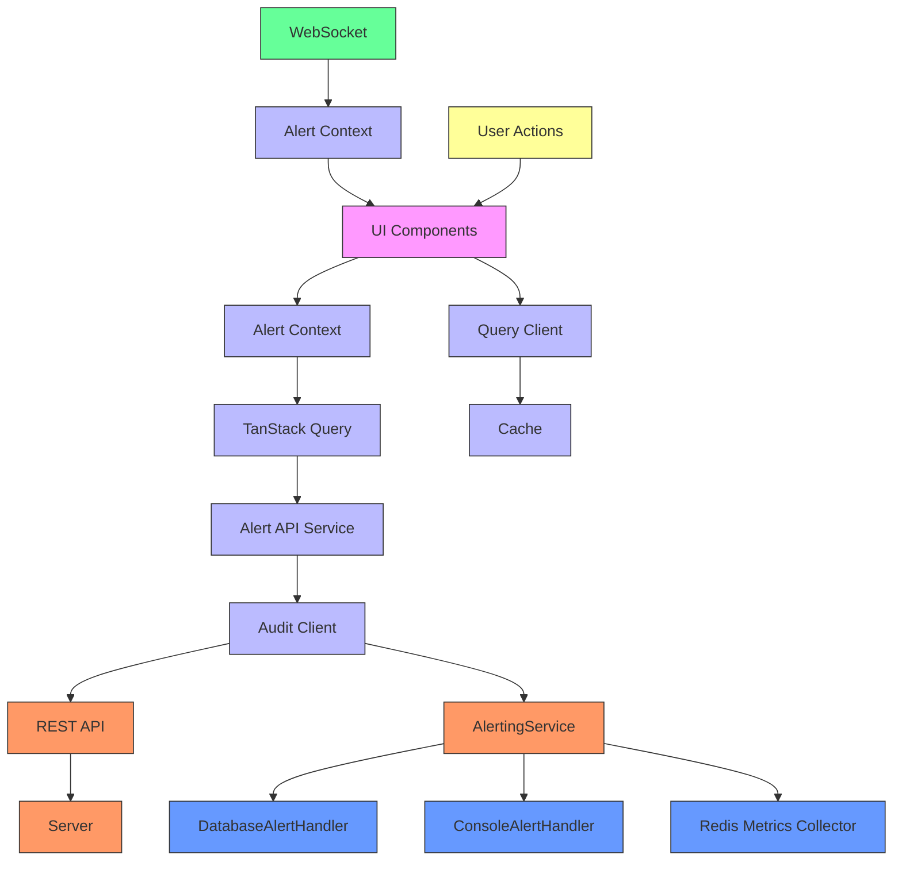
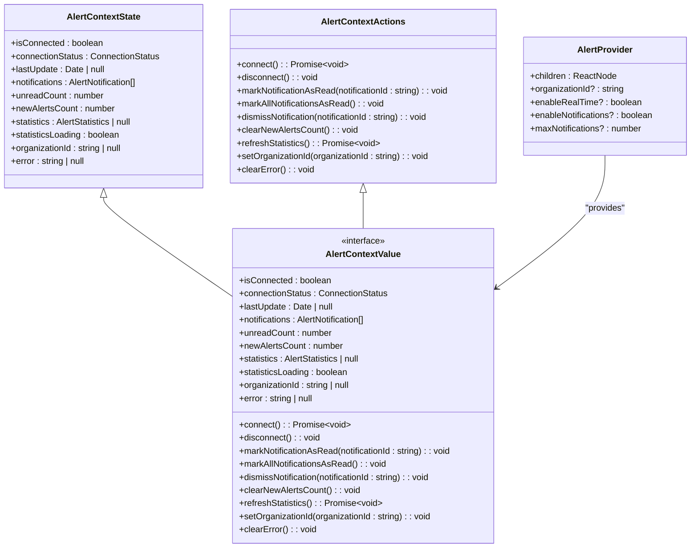
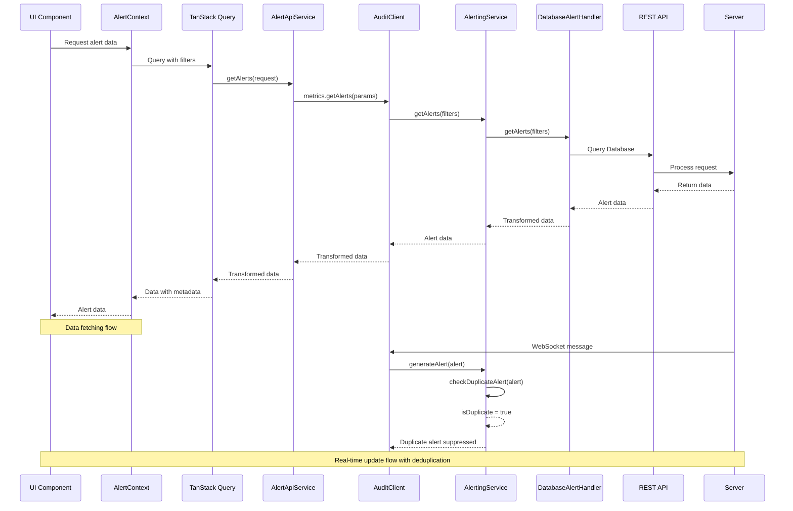
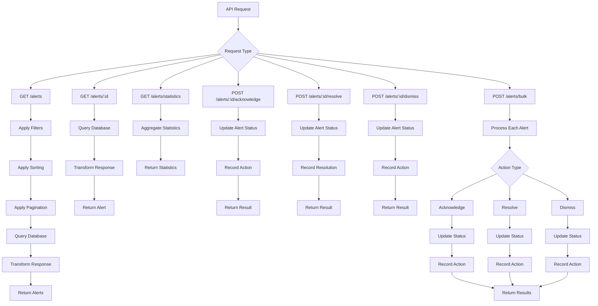
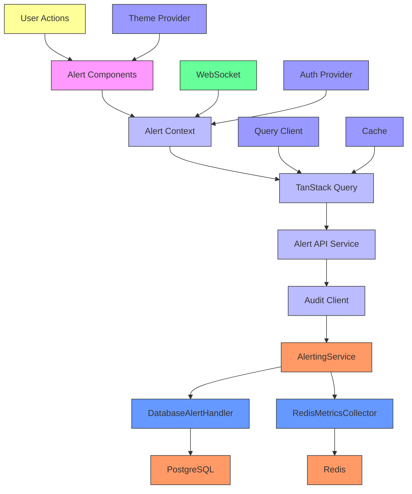

# Alert Management System

<cite>
**Referenced Files in This Document**   
- [AlertDashboard.tsx](file://apps\app\src\components\alerts\core\AlertDashboard.tsx) - *Updated in recent commit*
- [AlertDataTable.tsx](file://apps\app\src\components\alerts\data\AlertDataTable.tsx) - *Refactored for modularity*
- [details-dialog.tsx](file://apps\app\src\components\alerts\data\details-dialog.tsx) - *Added in recent commit*
- [AlertColumns.tsx](file://apps\app\src\components\alerts\data\AlertColumns.tsx) - *Updated in recent commit*
- [AlertList.tsx](file://apps\app\src\components\alerts\core\AlertList.tsx) - *Standardized properties*
- [app-sidebar.tsx](file://apps\app\src\components\app-sidebar.tsx) - *Added navigation*
- [routes.ts](file://apps\app\src\lib\routes.ts) - *Added new route*
- [page-header.tsx](file://apps\app\src\components\navigation\page-header.tsx) - *Added keyboard shortcuts*
- [active.tsx](file://apps\app\src\routes\_authenticated\alerts\active.tsx) - *Added page header*
- [alerts.ts](file://apps\server\src\routes\alerts.ts) - *Refactored to dedicated service*
- [context.ts](file://apps\server\src\lib\hono\context.ts) - *Modified for new service*
- [alerting.ts](file://packages\audit\src\monitor\alerting.ts) - *Introduced AlertingService class*
- [database-alert-handler.ts](file://packages\audit\src\monitor\database-alert-handler.ts) - *Integrated with AlertingService*
- [architecture.md](file://apps\app\docs\alerts\architecture.md) - *Updated for AlertingService*
</cite>

## Update Summary
**Changes Made**   
- Updated documentation to reflect new AlertingService class and its centralized alert management capabilities
- Added documentation for Redis-based deduplication and severity handling in the AlertingService
- Updated architecture overview to show the new centralized alert generation and distribution pattern
- Enhanced detailed component analysis with new class diagrams for AlertingService
- Updated dependency analysis to include the new AlertingService and its relationships
- Added new troubleshooting section for deduplication and notification issues
- Updated source tracking with new file references and change annotations

## Table of Contents
1. [Introduction](#introduction)
2. [Project Structure](#project-structure)
3. [Core Components](#core-components)
4. [Architecture Overview](#architecture-overview)
5. [Detailed Component Analysis](#detailed-component-analysis)
6. [Dependency Analysis](#dependency-analysis)
7. [Performance Considerations](#performance-considerations)
8. [Troubleshooting Guide](#troubleshooting-guide)
9. [Conclusion](#conclusion)

## Introduction
The Alert Management System is a comprehensive solution for monitoring, managing, and responding to system alerts within the SMEDREC healthcare audit platform. This system provides real-time alert notifications, comprehensive filtering capabilities, and multiple visualization options for alert data. The system is designed to handle various alert types including system, security, performance, compliance, and custom alerts with different severity levels from critical to informational.

The Alert Management System integrates with the existing Audit Client and leverages TanStack Query for efficient data management, TanStack Router for navigation, and WebSocket connections for real-time updates. The system follows a modular architecture with clearly defined components for different aspects of alert management, ensuring maintainability and scalability.

A significant enhancement has been introduced with the AlertingService class, which centralizes alert generation, deduplication, distribution, and notification. This new service replaces the previous distributed alert logic with a more robust and maintainable approach that uses Redis-based deduplication to prevent duplicate alerts and handles severity-based notification routing.

## Project Structure
The Alert Management System is organized in a modular structure within the application's components directory. The system follows a feature-based organization pattern with dedicated subdirectories for different functional areas.

```mermaid
graph TD
A[Alerts] --> B[core]
A --> C[forms]
A --> D[data]
A --> E[ui]
A --> F[error]
A --> G[layout]
A --> H[notifications]
A --> I[types]
A --> J[hooks]
B --> B1[AlertDashboard]
B --> B2[AlertList]
B --> B3[AlertCard]
B --> B4[AlertDetails]
C --> C1[AlertFilters]
C --> C2[AlertActions]
C --> C3[BulkActions]
C --> C4[AlertActionDialog]
D --> D1[AlertDataTable]
D --> D2[AlertColumns]
D --> D3[AlertPagination]
D --> D4[AlertTableToolbar]
D --> D5[details-dialog]
E --> E1[AlertBadge]
E --> E2[AlertIcon]
E --> E3[AlertSkeleton]
E --> E4[AlertEmptyState]
F --> F1[AlertErrorBoundary]
F --> F2[AlertErrorAlert]
F --> F3[AlertLoadingStates]
F --> F4[AlertValidationFeedback]
G --> G1[AlertLayout]
G --> G2[AlertPage]
G --> G3[AlertSection]
H --> H1[NotificationBell]
H --> H2[NotificationPanel]
H --> H3[NotificationItem]
I --> I1[alert-types]
I --> I2[api-types]
I --> I3[filter-types]
I --> I4[notification-types]
I --> I5[settings-types]
J --> J1[use-alert-queries]
J --> J2[use-alert-websocket]
J --> J3[use-alert-keyboard-navigation]
J --> J4[use-alert-responsive]
```



**Diagram sources**
- [AlertDashboard.tsx](file://apps\app\src\components\alerts\core\AlertDashboard.tsx)
- [AlertFilters.tsx](file://apps\app\src\components\alerts\forms\AlertFilters.tsx)
- [AlertDataTable.tsx](file://apps\app\src\components\alerts\data\AlertDataTable.tsx)
- [details-dialog.tsx](file://apps\app\src\components\alerts\data\details-dialog.tsx)
- [alert-types.ts](file://apps\app\src\components\alerts\types\alert-types.ts)

**Section sources**
- [README.md](file://apps\app\src\components\alerts\README.md)

## Core Components
The Alert Management System consists of several core components that work together to provide a comprehensive alert management solution. The system is built around a modular architecture with clearly defined responsibilities for each component.

The AlertDashboard component serves as the main container for the alert management interface, providing navigation between different views (list, board, and statistics) and displaying summary information about the current alert state. The AlertDataTable component provides an advanced data table for displaying alerts with sorting, filtering, and pagination capabilities. The AlertFilters component offers comprehensive filtering options for alerts based on severity, type, status, source, date range, search, and tags.

The system also includes notification components such as NotificationBell and NotificationPanel that provide real-time alert notifications with the ability to mark notifications as read or dismiss them. The AlertCard component displays individual alerts in a compact format suitable for board views, while AlertDetails provides a more comprehensive view of a specific alert.

A new AlertDetailsDialog component has been added to display detailed alert information in a modal dialog, accessible from the data table. The system now includes a dedicated ALERTS_DATA route for viewing all alerts, with navigation available in the app sidebar.

The most significant enhancement is the introduction of the AlertingService class, which centralizes alert generation, deduplication, distribution, and notification. This service replaces the previous distributed alert logic with a more robust approach that uses Redis-based deduplication to prevent duplicate alerts and handles severity-based notification routing. The AlertingService coordinates with multiple alert handlers, including the DatabaseAlertHandler for persistent storage and the ConsoleAlertHandler for development and testing.

**Section sources**
- [AlertDashboard.tsx](file://apps\app\src\components\alerts\core\AlertDashboard.tsx)
- [AlertDataTable.tsx](file://apps\app\src\components\alerts\data\AlertDataTable.tsx)
- [AlertFilters.tsx](file://apps\app\src\components\alerts\forms\AlertFilters.tsx)
- [NotificationPanel.tsx](file://apps\app\src\components\alerts\notifications\NotificationPanel.tsx)
- [AlertCard.tsx](file://apps\app\src\components\alerts\core\AlertCard.tsx)
- [details-dialog.tsx](file://apps\app\src\components\alerts\data\details-dialog.tsx)
- [alerting.ts](file://packages\audit\src\monitor\alerting.ts)

## Architecture Overview
The Alert Management System follows a layered architecture with clear separation of concerns between presentation, business logic, and data access layers. The system leverages React Context for global state management and TanStack Query for data fetching and caching.

The architecture has been enhanced with the introduction of the AlertingService class, which centralizes alert generation, deduplication, distribution, and notification. This service acts as the central coordinator for all alert-related operations, replacing the previous distributed alert logic with a more maintainable and robust approach.



**Diagram sources**
- [alert-provider.tsx](file://apps\app\src\contexts\alert-provider.tsx)
- [alert-api.ts](file://apps\app\src\lib\services\alert-api.ts)
- [use-alert-queries.ts](file://apps\app\src\components\alerts\hooks\use-alert-queries.ts)
- [use-alert-websocket.ts](file://apps\app\src\components\alerts\hooks\use-alert-websocket.ts)
- [alerting.ts](file://packages\audit\src\monitor\alerting.ts)

## Detailed Component Analysis

### Alert Context and State Management
The Alert Management System uses a React Context-based approach for global state management, providing a centralized store for alert-related data and functionality.



**Diagram sources**
- [alert-provider.tsx](file://apps\app\src\contexts\alert-provider.tsx)

**Section sources**
- [alert-provider.tsx](file://apps\app\src\contexts\alert-provider.tsx)

### Data Model and Type Definitions
The Alert Management System uses a comprehensive type system to ensure type safety and provide clear interfaces for alert data.

```mermaid
classDiagram
class AlertSeverity {
<<enumeration>>
CRITICAL
HIGH
MEDIUM
LOW
INFO
}
class AlertType {
<<enumeration>>
SYSTEM
SECURITY
PERFORMANCE
COMPLIANCE
METRICS
CUSTOM
}
class AlertStatus {
<<enumeration>>
ACTIVE
ACKNOWLEDGED
RESOLVED
DISMISSED
}
class AlertUI {
+id : string
+title : string
+description? : string
+severity : AlertSeverity
+type : AlertType
+status : AlertStatus
+source : string
+created_at : Date
+acknowledged_at? : Date
+acknowledged_by? : string
+resolved_at? : Date
+resolved_by? : string
+resolution_notes? : string
+metadata : Record~string, any~
+tags : string[]
+correlation_id? : string
}
class AlertStatistics {
+total : number
+active : number
+acknowledged : number
+resolved : number
+dismissed : number
+by_severity : Record~AlertSeverity, number~
+by_type : Record~AlertType, number~
+by_source : Record~string, number~
+trends : {
period : string
created : number
resolved : number
}[]
}
class AlertNotification {
+id : string
+alert_id : string
+title : string
+message : string
+severity : 'CRITICAL' | 'HIGH' | 'MEDIUM' | 'LOW' | 'INFO'
+timestamp : Date
+read : boolean
+action_url? : string
}
AlertUI --> AlertSeverity
AlertUI --> AlertType
AlertUI --> AlertStatus
AlertStatistics --> AlertSeverity
AlertStatistics --> AlertType
AlertNotification --> AlertSeverity
```

**Diagram sources**
- [alert-types.ts](file://apps\app\src\components\alerts\types\alert-types.ts)

**Section sources**
- [alert-types.ts](file://apps\app\src\components\alerts\types\alert-types.ts)

### Alerting Service Architecture
The AlertingService class has been introduced to centralize alert generation, deduplication, distribution, and notification. This service replaces the previous distributed alert logic with a more robust and maintainable approach.

```mermaid
classDiagram
class AlertingService {
- alertPrefix : string
- cooldownPrefix : string
- config : MonitoringConfig
- alertHandlers : AlertHandler[]
- metricsCollector : MetricsCollector
- logger : any
+ constructor(config : MonitoringConfig, metricsCollector? : MetricsCollector, logger? : any)
+ addAlertHandler(handler : AlertHandler) : void
+ sendExternalAlert(alert : Alert) : Promise~void~
+ getAlerts(filters : AlertQueryFilters) : Promise~Alert[]~
+ getActiveAlerts(organizationId? : string) : Promise~Alert[]~
+ generateAlert(alert : Alert) : Promise~void~
+ numberOfActiveAlerts(organizationId? : string) : Promise~number~
+ getAlertStatistics(organizationId? : string) : Promise~AlertStatistics~
+ resolveAlert(alertId : string, resolvedBy : string, resolutionData? : AlertResolution) : Promise~{success : boolean}~
+ acknowledgeAlert(alertId : string, acknowledgedBy : string) : Promise~{success : boolean}~
+ dismissAlert(alertId : string, dismissedBy : string) : Promise~{success : boolean}~
- checkDuplicateAlert(alert : Alert) : Promise~boolean~
- createAlertHash(alert : Alert) : string
- sendNotifications(alert : Alert) : Promise~void~
- sendCriticalAlertNotification(alert : Alert) : Promise~void~
}
class AlertHandler {
<<interface>>
+ handlerName() : string
+ sendAlert(alert : Alert) : Promise~void~
+ acknowledgeAlert(alertId : string, acknowledgedBy : string) : Promise~{success : boolean}~
+ resolveAlert(alertId : string, resolvedBy : string, resolutionData? : AlertResolution) : Promise~{success : boolean}~
+ dismissAlert(alertId : string, dismissedBy : string) : Promise~{success : boolean}~
+ getAlerts(filters : AlertQueryFilters) : Promise~Alert[]~
+ getActiveAlerts(organizationId? : string) : Promise~Alert[]~
+ numberOfActiveAlerts(organizationId? : string) : Promise~number~
+ getAlertStatistics(organizationId? : string) : Promise~AlertStatistics~
}
class DatabaseAlertHandler {
+ handlerName() : string
+ sendAlert(alert : Alert) : Promise~void~
+ acknowledgeAlert(alertId : string, acknowledgedBy : string) : Promise~{success : boolean}~
+ resolveAlert(alertId : string, resolvedBy : string, resolutionData? : AlertResolution) : Promise~{success : boolean}~
+ dismissAlert(alertId : string, dismissedBy : string) : Promise~{success : boolean}~
+ getAlerts(filters : AlertQueryFilters) : Promise~Alert[]~
+ getActiveAlerts(organizationId? : string) : Promise~Alert[]~
+ numberOfActiveAlerts(organizationId? : string) : Promise~number~
+ getAlertStatistics(organizationId? : string) : Promise~AlertStatistics~
- mapDatabaseAlertToAlert(dbAlert : any) : Alert
}
class ConsoleAlertHandler {
+ handlerName() : string
+ sendAlert(alert : Alert) : Promise~void~
+ acknowledgeAlert(alertId : string, acknowledgedBy : string) : Promise~{success : boolean}~
+ resolveAlert(alertId : string, resolvedBy : string) : Promise~{success : boolean}~
+ dismissAlert(alertId : string, dismissedBy : string) : Promise~{success : boolean}~
+ getAlerts(filters : AlertQueryFilters) : Promise~Alert[]~
+ getActiveAlerts(organizationId? : string) : Promise~Alert[]~
+ numberOfActiveAlerts(organizationId? : string) : Promise~number~
+ getAlertStatistics(organizationId? : string) : Promise~AlertStatistics~
}
class MetricsCollector {
<<interface>>
+ recordAlertGenerated() : void
+ isOnCooldown(key : string) : Promise~boolean~
+ setCooldown(key : string, seconds : number) : Promise~void~
}
class RedisMetricsCollector {
+ recordAlertGenerated() : void
+ isOnCooldown(key : string) : Promise~boolean~
+ setCooldown(key : string, seconds : number) : Promise~void~
}
AlertingService --> MetricsCollector
AlertingService --> AlertHandler
AlertingService --> DatabaseAlertHandler
AlertingService --> ConsoleAlertHandler
AlertingService --> RedisMetricsCollector
DatabaseAlertHandler ..|> AlertHandler
ConsoleAlertHandler ..|> AlertHandler
RedisMetricsCollector ..|> MetricsCollector
```

**Diagram sources**
- [alerting.ts](file://packages\audit\src\monitor\alerting.ts)
- [database-alert-handler.ts](file://packages\audit\src\monitor\database-alert-handler.ts)

**Section sources**
- [alerting.ts](file://packages\audit\src\monitor\alerting.ts)
- [database-alert-handler.ts](file://packages\audit\src\monitor\database-alert-handler.ts)

### API Integration and Data Flow
The Alert Management System integrates with the backend through a service layer that handles API communication and data transformation. The API routes have been refactored to a dedicated alerts service for better modularity and standardization.



**Diagram sources**
- [alerts.ts](file://apps\server\src\routes\alerts.ts)
- [context.ts](file://apps\server\src\lib\hono\context.ts)
- [use-alert-queries.ts](file://apps\app\src\components\alerts\hooks\use-alert-queries.ts)
- [use-alert-websocket.ts](file://apps\app\src\components\alerts\hooks\use-alert-websocket.ts)
- [alerting.ts](file://packages\audit\src\monitor\alerting.ts)

**Section sources**
- [alerts.ts](file://apps\server\src\routes\alerts.ts)
- [context.ts](file://apps\server\src\lib\hono\context.ts)
- [use-alert-queries.ts](file://apps\app\src\components\alerts\hooks\use-alert-queries.ts)
- [alerting.ts](file://packages\audit\src\monitor\alerting.ts)

### API Interface and Integration Patterns
The Alert Management System exposes a comprehensive API interface for integration with other systems and components.



**Diagram sources**
- [alerts.ts](file://apps\server\src\routes\alerts.ts)
- [context.ts](file://apps\server\src\lib\hono\context.ts)

**Section sources**
- [alerts.ts](file://apps\server\src\routes\alerts.ts)
- [context.ts](file://apps\server\src\lib\hono\context.ts)

## Dependency Analysis
The Alert Management System has a well-defined dependency structure that ensures loose coupling between components while maintaining clear integration points with external systems.



**Diagram sources**
- [package.json](file://package.json)

**Section sources**
- [alert-provider.tsx](file://apps\app\src\contexts\alert-provider.tsx)
- [alert-api.ts](file://apps\app\src\lib\services\alert-api.ts)
- [alerting.ts](file://packages\audit\src\monitor\alerting.ts)

## Performance Considerations
The Alert Management System incorporates several performance optimizations to ensure responsive user experience even with large datasets:

1. **Caching**: The system uses TanStack Query for efficient data caching with configurable stale and cache times. The AlertApiService also includes an optional cache layer for frequently accessed data like statistics.

2. **Pagination**: All list endpoints support pagination to limit the amount of data transferred and rendered at once. The default page size is 25 items with configurable limits.

3. **Virtual Scrolling**: The AlertDataTable component supports virtual scrolling for large datasets, rendering only visible rows to improve performance.

4. **Debounced Search**: Search inputs use debouncing (300ms) to prevent excessive API calls during typing.

5. **Real-time Updates**: WebSocket connections provide real-time updates without the need for polling, reducing server load and improving responsiveness.

6. **Optimistic Updates**: The system implements optimistic updates for actions like acknowledging or resolving alerts, providing immediate feedback to users while the operation completes in the background.

7. **Code Splitting**: Components are organized to enable code splitting, loading only the necessary code for the current view.

8. **Efficient Re-renders**: The system uses React's memoization features and careful state management to minimize unnecessary re-renders.

9. **Alert Deduplication**: The AlertingService implements Redis-based deduplication to prevent duplicate alerts from being processed and displayed. This reduces database load and prevents alert fatigue by ensuring similar alerts within a 5-minute cooldown period are suppressed.

10. **Batch Processing**: The system supports bulk operations for acknowledging, resolving, or dismissing multiple alerts simultaneously, reducing the number of API calls needed for common operations.

## Troubleshooting Guide
This section provides guidance for common issues encountered when working with the Alert Management System.

**Section sources**
- [alert-provider.tsx](file://apps\app\src\contexts\alert-provider.tsx)
- [alert-api.ts](file://apps\app\src\lib\services\alert-api.ts)
- [use-alert-websocket.ts](file://apps\app\src\components\alerts\hooks\use-alert-websocket.ts)
- [alerting.ts](file://packages\audit\src\monitor\alerting.ts)

### Common Issues and Solutions

1. **WebSocket Connection Issues**
   - **Symptoms**: Real-time updates not working, connection status showing as disconnected
   - **Causes**: Network connectivity issues, authentication problems, server-side WebSocket configuration
   - **Solutions**: 
     - Verify network connectivity
     - Check authentication token validity
     - Ensure WebSocket URL is correctly configured in environment variables
     - Review server logs for WebSocket connection errors

2. **Slow Data Loading**
   - **Symptoms**: Delays when loading alert lists or statistics
   - **Causes**: Large datasets, network latency, inefficient queries
   - **Solutions**:
     - Implement or verify proper pagination
     - Check database query performance
     - Ensure caching is properly configured
     - Optimize filter conditions to reduce result set size

3. **Missing Real-time Notifications**
   - **Symptoms**: New alerts not appearing in real-time, notification count not updating
   - **Causes**: WebSocket connection issues, event filtering, client-side processing errors
   - **Solutions**:
     - Verify WebSocket connection status
     - Check that the correct organization ID is set
     - Ensure event handlers are properly registered
     - Review browser console for JavaScript errors

4. **Authentication Errors**
   - **Symptoms**: 401 or 403 errors when accessing alert data
   - **Causes**: Expired session, insufficient permissions, incorrect API key
   - **Solutions**:
     - Refresh authentication token
     - Verify user has appropriate role/permissions
     - Check API key validity and scope
     - Ensure authentication headers are properly set

5. **Data Synchronization Issues**
   - **Symptoms**: Inconsistent data between views, stale information
   - **Causes**: Cache invalidation problems, race conditions, network issues
   - **Solutions**:
     - Verify cache invalidation logic
     - Check query refetch configurations
     - Implement proper error handling and retry logic
     - Ensure consistent data transformation across components

6. **Duplicate Alert Issues**
   - **Symptoms**: Similar alerts appearing multiple times, alert fatigue
   - **Causes**: Deduplication not working, Redis connection issues, incorrect alert content hashing
   - **Solutions**:
     - Verify Redis connection for the AlertingService
     - Check that the alert hash is being generated correctly from source, title, severity, and description
     - Ensure the cooldown period (5 minutes) is properly configured
     - Review logs for deduplication debug messages

7. **Notification Delivery Problems**
   - **Symptoms**: Alerts not being delivered to external notification systems
   - **Causes**: Notification service configuration issues, network connectivity problems, authentication failures
   - **Solutions**:
     - Verify notification service URL and credentials in configuration
     - Check network connectivity to the notification service
     - Ensure the notification service is properly configured to receive alerts
     - Review logs for notification delivery errors

### Debugging Tools and Techniques
- **Browser Developer Tools**: Use the Network tab to monitor API requests and WebSocket connections
- **Console Logging**: Enable debug logging in development mode to trace data flow
- **Query Devtools**: Use TanStack Query Devtools to inspect query states and cache contents
- **Error Boundaries**: The system includes AlertErrorBoundary components to catch and display errors gracefully
- **Performance Profiling**: Use React DevTools to identify performance bottlenecks and unnecessary re-renders
- **AlertingService Logs**: Monitor logs from the AlertingService for deduplication events and notification delivery status

## Conclusion
The Alert Management System provides a comprehensive solution for monitoring and managing system alerts within the SMEDREC healthcare audit platform. The system's modular architecture, real-time capabilities, and comprehensive feature set make it well-suited for handling the complex alert management needs of healthcare applications.

Key strengths of the system include its real-time WebSocket integration for immediate alert notifications, flexible filtering and visualization options, and robust error handling. The system's integration with TanStack Query provides efficient data management with caching and background updates, while the modular component structure ensures maintainability and scalability.

The system has been enhanced with new features including a detailed alert view, keyboard shortcuts for improved accessibility, and a dedicated route for viewing all alerts. The API has been refactored to a dedicated service for better modularity and standardization, and alert properties have been standardized to snake_case for consistency.

The most significant enhancement is the introduction of the AlertingService class, which centralizes alert generation, deduplication, distribution, and notification. This service replaces the previous distributed alert logic with a more robust and maintainable approach that uses Redis-based deduplication to prevent duplicate alerts and handles severity-based notification routing. This improvement reduces alert fatigue, improves system performance, and provides a more reliable alert management experience.

Overall, the Alert Management System represents a well-designed, production-ready solution that effectively addresses the requirements for comprehensive alert management in a healthcare audit context.