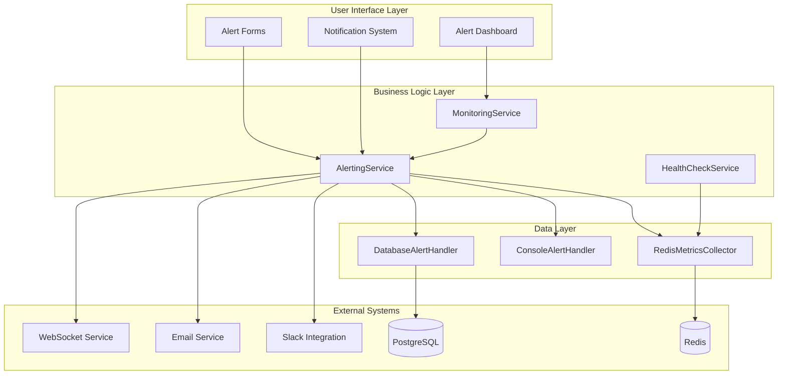
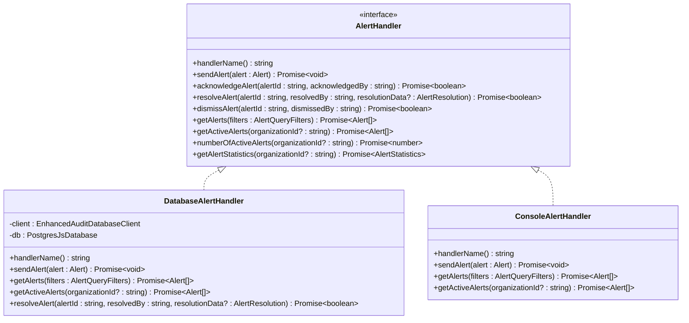
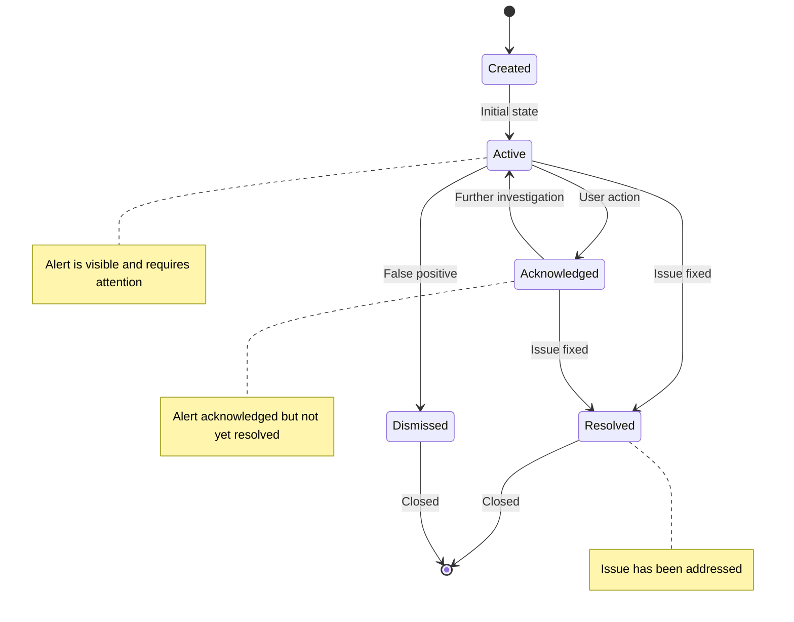
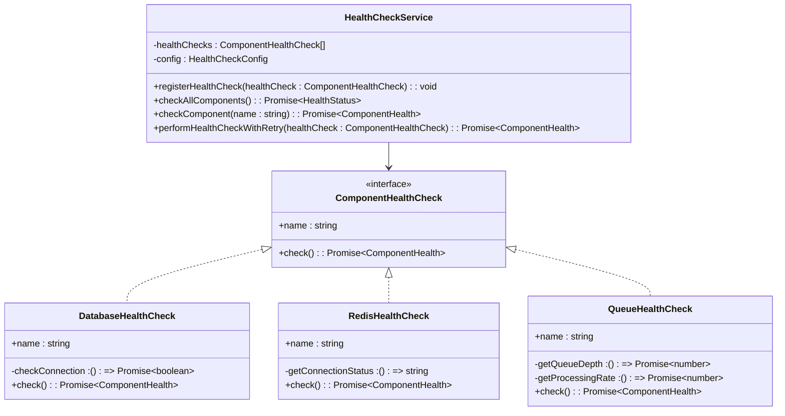
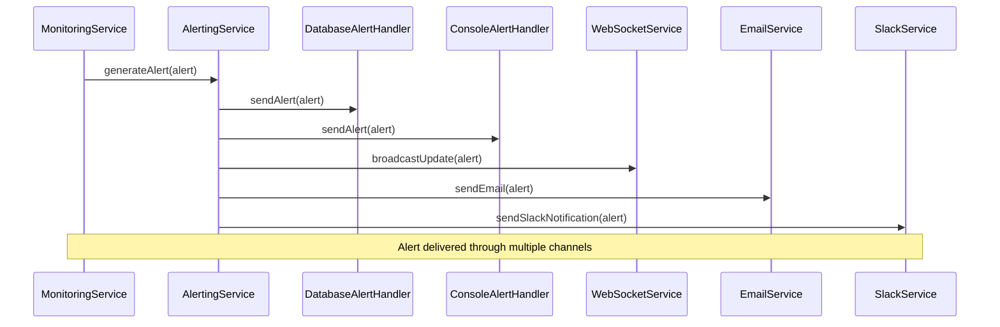

# Alerting Service Architecture

<cite>
**Referenced Files in This Document**
- [alerting.ts](file://packages/audit/src/monitor/alerting.ts)
- [database-alert-handler.ts](file://packages/audit/src/monitor/database-alert-handler.ts)
- [monitoring-types.ts](file://packages/audit/src/monitor/monitoring-types.ts)
- [metrics-collector.ts](file://packages/audit/src/monitor/metrics-collector.ts)
- [health-check.ts](file://packages/audit/src/monitor/health-check.ts)
- [monitoring.ts](file://packages/audit/src/monitor/monitoring.ts)
- [monitoring.md](file://packages/audit/docs/api-reference/monitoring.md)
- [architecture.md](file://apps/app/docs/alerts/architecture.md)
- [setup.md](file://apps/app/docs/alerts/setup.md)
- [api-integration.md](file://apps/app/docs/alerts/api-integration.md)
- [troubleshooting.md](file://apps/app/docs/alerts/troubleshooting.md)
- [user-guide.md](file://apps/app/docs/alerts/user-guide.md)
</cite>

## Table of Contents
1. [Introduction](#introduction)
2. [System Architecture](#system-architecture)
3. [Core Components](#core-components)
4. [Alert Management](#alert-management)
5. [Monitoring and Health Checks](#monitoring-and-health-checks)
6. [Integration Patterns](#integration-patterns)
7. [API Reference](#api-reference)
8. [Setup and Configuration](#setup-and-configuration)
9. [Troubleshooting Guide](#troubleshooting-guide)
10. [Best Practices](#best-practices)
11. [Conclusion](#conclusion)

## Introduction

The AlertingService is a comprehensive monitoring and alerting system designed for real-time security threat detection, system health monitoring, and operational alert management. Built as part of the smart-logs ecosystem, it provides multi-tenant support, sophisticated pattern detection, and flexible alert delivery mechanisms.

The system operates on a modular architecture that separates concerns between alert generation, storage, notification delivery, and user interface management. It supports both real-time monitoring and historical analysis, making it suitable for organizations requiring robust audit and compliance capabilities.

## System Architecture

The AlertingService follows a layered architecture with clear separation of responsibilities:



**Diagram sources**
- [alerting.ts](file://packages/audit/src/monitor/alerting.ts#L1-L50)
- [monitoring.ts](file://packages/audit/src/monitor/monitoring.ts#L1-L100)
- [health-check.ts](file://packages/audit/src/monitor/health-check.ts#L1-L50)

## Core Components

### AlertingService Class

The central orchestrator that manages alert lifecycle and delivery:

```typescript
export class AlertingService {
  private readonly alertPrefix = 'alerts:'
  private readonly cooldownPrefix = 'alert_cooldown:'
  private config: MonitoringConfig
  private alertHandlers: AlertHandler[] = []
  private metricsCollector: MetricsCollector
  private logger: any

  constructor(config: MonitoringConfig, metricsCollector?: MetricsCollector, logger?: any)
  
  addAlertHandler(handler: AlertHandler): void
  sendExternalAlert(alert: Alert): Promise<void>
  getAlerts(filters: AlertQueryFilters): Promise<Alert[]>
  generateAlert(alert: Alert): Promise<void>
  resolveAlert(alertId: string, resolvedBy: string, resolutionData?: AlertResolution): Promise<{ success: boolean }>
  acknowledgeAlert(alertId: string, acknowledgedBy: string): Promise<{ success: boolean }>
  dismissAlert(alertId: string, dismissedBy: string): Promise<{ success: boolean }>
}
```

### MonitoringService Class

Provides real-time monitoring and suspicious pattern detection:

```typescript
export class MonitoringService {
  private events: AuditLogEvent[] = []
  private config: MonitoringConfig
  private alertingService: AlertingService
  private metricsCollector: MetricsCollector

  constructor(config: MonitoringConfig, metricsCollector?: MetricsCollector, logger?: any)
  
  processEvent(event: AuditLogEvent): Promise<void>
  detectSuspiciousPatterns(events: AuditLogEvent[]): Promise<PatternDetectionResult>
  getAuditMetrics(): Promise<AuditMetrics>
  getHealthStatus(): Promise<HealthStatus>
}
```

### Alert Handlers

Multiple handler implementations for different alert delivery mechanisms:



**Diagram sources**
- [alerting.ts](file://packages/audit/src/monitor/alerting.ts#L1-L100)
- [database-alert-handler.ts](file://packages/audit/src/monitor/database-alert-handler.ts#L1-L50)

**Section sources**
- [alerting.ts](file://packages/audit/src/monitor/alerting.ts#L1-L386)
- [monitoring.ts](file://packages/audit/src/monitor/monitoring.ts#L1-L100)

## Alert Management

### Alert Lifecycle

The AlertingService manages alerts through a comprehensive lifecycle:



### Suspicious Pattern Detection

The system implements sophisticated pattern detection for security threats:

```typescript
interface SuspiciousPattern {
  type: 'FAILED_AUTH' | 'UNAUTHORIZED_ACCESS' | 'DATA_VELOCITY' | 'BULK_OPERATION' | 'OFF_HOURS'
  severity: AlertSeverity
  description: string
  events: AuditLogEvent[]
  metadata: Record<string, any>
  timestamp: string
}

// Pattern detection methods
private detectFailedAuthPattern(events: AuditLogEvent[]): SuspiciousPattern | null
private detectUnauthorizedAccessPattern(events: AuditLogEvent[]): SuspiciousPattern | null
private detectDataVelocityPattern(events: AuditLogEvent[]): SuspiciousPattern | null
private detectBulkOperationPattern(events: AuditLogEvent[]): SuspiciousPattern | null
private detectOffHoursPattern(events: AuditLogEvent[]): SuspiciousPattern | null
```

### Alert Types and Severity

The system categorizes alerts into multiple types and severity levels:

| Type | Description | Example |
|------|-------------|---------|
| SECURITY | Security threats and breaches | Failed authentication attempts, unauthorized access |
| COMPLIANCE | Compliance violations | Data access outside policy |
| PERFORMANCE | System performance issues | High latency, resource exhaustion |
| SYSTEM | Infrastructure problems | Service downtime, hardware failures |
| METRICS | Metric threshold violations | Error rate exceeding limits |

| Severity | Impact | Response Time | Example |
|----------|--------|---------------|---------|
| CRITICAL | System failure | Immediate | Database outage |
| HIGH | Significant impact | Within 1 hour | Security breach |
| MEDIUM | Moderate impact | Within 4 hours | Performance degradation |
| LOW | Minor issues | Within 24 hours | Resource warnings |
| INFO | General notifications | As needed | System updates |

**Section sources**
- [monitoring.ts](file://packages/audit/src/monitor/monitoring.ts#L100-L300)
- [alerting.ts](file://packages/audit/src/monitor/alerting.ts#L150-L250)

## Monitoring and Health Checks

### Health Check System

The HealthCheckService provides comprehensive system monitoring:



**Diagram sources**
- [health-check.ts](file://packages/audit/src/monitor/health-check.ts#L1-L100)

### Metrics Collection

The RedisMetricsCollector handles comprehensive metrics collection:

```typescript
export interface MetricsCollector {
  recordEvent(): Promise<void>
  recordProcessingLatency(latency: number): Promise<void>
  recordError(): Promise<void>
  recordIntegrityViolation(): Promise<void>
  recordQueueDepth(depth: number): Promise<void>
  getMetrics(): Promise<Metrics>
  resetMetrics(): Promise<void>
  recordSuspiciousPattern(suspiciousPatterns: number): Promise<void>
  recordAlertGenerated(): Promise<void>
  setCooldown(cooldownKey: string, cooldownPeriod: number): Promise<void>
  isOnCooldown(cooldownKey: string): Promise<boolean>
}
```

### Audit Metrics

Comprehensive audit metrics tracking:

```typescript
interface AuditMetrics {
  eventsProcessed: number
  queueDepth: number
  errorsGenerated: number
  errorRate: number
  integrityViolations: number
  timestamp: string
  alertsGenerated: number
  suspiciousPatterns: number
  processingLatency: {
    average: number
    p95: number
    p99: number
  }
  integrityVerifications: {
    total: number
    passed: number
    failed: number
  }
  complianceReports: {
    generated: number
    scheduled: number
    failed: number
  }
}
```

**Section sources**
- [health-check.ts](file://packages/audit/src/monitor/health-check.ts#L1-L491)
- [metrics-collector.ts](file://packages/audit/src/monitor/metrics-collector.ts#L1-L386)

## Integration Patterns

### Multi-Tenant Architecture

The system supports multi-tenant deployments with organization-based isolation:

```typescript
interface OrganizationalAlert extends Alert {
  organizationId: string
}

// Database schema with tenant isolation
interface DatabaseAlert {
  id: string
  organization_id: string  // Tenant isolation
  severity: string
  type: string
  title: string
  description: string
  source: string
  status: string
  metadata: any
  // ... other fields
}
```

### WebSocket Integration

Real-time alert delivery through WebSocket connections:

```typescript
// WebSocket message types
interface AlertWebSocketUpdate {
  type: 'alert_created' | 'alert_updated' | 'alert_deleted' | 'bulk_update'
  alert?: Alert
  alerts?: Alert[]
  alertId?: string
  timestamp: string
  userId?: string
}

// Real-time updates handler
function handleAlertUpdate(update: AlertWebSocketUpdate, queryClient: QueryClient) {
  switch (update.type) {
    case 'alert_created':
      queryClient.setQueryData(['alerts'], (oldData: Alert[]) => 
        [update.alert, ...(oldData || [])]
      )
      break
    case 'alert_updated':
      queryClient.setQueryData(['alerts'], (oldData: Alert[]) =>
        oldData?.map((alert) => 
          alert.id === update.alert.id ? update.alert : alert
        )
      )
      break
  }
}
```

### External Service Integration

The system integrates with various external services:



**Diagram sources**
- [alerting.ts](file://packages/audit/src/monitor/alerting.ts#L80-L120)

**Section sources**
- [database-alert-handler.ts](file://packages/audit/src/monitor/database-alert-handler.ts#L1-L200)
- [api-integration.md](file://apps/app/docs/alerts/api-integration.md#L1-L200)

## API Reference

### Core Interfaces

#### Alert Interface

```typescript
interface Alert {
  id: string
  severity: AlertSeverity
  type: AlertType
  title: string
  description: string
  createdAt: string
  source: string
  status: AlertStatus
  metadata: Record<string, any>
  acknowledged: boolean
  acknowledgedAt?: string
  acknowledgedBy?: string
  resolved: boolean
  resolvedAt?: string
  resolvedBy?: string
  resolutionNotes?: string
  correlationId?: string
  tags: string[]
}
```

#### Alert Handler Interface

```typescript
interface AlertHandler {
  handlerName(): string
  sendAlert(alert: Alert): Promise<void>
  acknowledgeAlert(alertId: string, acknowledgedBy: string): Promise<{ success: boolean }>
  resolveAlert(alertId: string, resolvedBy: string, resolutionData?: AlertResolution): Promise<{ success: boolean }>
  dismissAlert(alertId: string, dismissedBy: string): Promise<{ success: boolean }>
  getAlerts(filters: AlertQueryFilters): Promise<Alert[]>
  getActiveAlerts(organizationId?: string): Promise<Alert[]>
  numberOfActiveAlerts(organizationId?: string): Promise<number>
  getAlertStatistics(organizationId?: string): Promise<AlertStatistics>
}
```

#### Health Check Interface

```typescript
interface ComponentHealthCheck {
  name: string
  check(): Promise<ComponentHealth>
}

interface HealthStatus {
  status: 'OK' | 'WARNING' | 'CRITICAL'
  components: { [key: string]: ComponentHealth }
  timestamp: string
}

interface ComponentHealth {
  status: 'OK' | 'WARNING' | 'CRITICAL'
  message?: string
  details?: Record<string, any>
  responseTime?: number
  lastCheck: string
}
```

### Usage Examples

#### Basic Alert Generation

```typescript
// Initialize services
const monitoringService = new MonitoringService(monitoringConfig)
const alertingService = new AlertingService(monitoringConfig)

// Process audit events
await monitoringService.processEvent(auditEvent)

// Generate alerts from patterns
const detectionResult = await monitoringService.detectSuspiciousPatterns([event])
for (const alert of detectionResult.alerts) {
  await alertingService.generateAlert(alert)
}
```

#### Alert Management

```typescript
// Get active alerts
const activeAlerts = await alertingService.getActiveAlerts('org-123')

// Acknowledge an alert
await alertingService.acknowledgeAlert('alert-456', 'security-team@example.com')

// Resolve an alert
await alertingService.resolveAlert(
  'alert-456',
  'security-team@example.com',
  {
    notes: 'False positive - legitimate bulk operation',
    action: 'Whitelist IP address',
    metadata: { 
      whitelistedIp: '192.168.1.100',
      reviewedBy: 'security-analyst'
    }
  }
)
```

**Section sources**
- [monitoring-types.ts](file://packages/audit/src/monitor/monitoring-types.ts#L1-L233)
- [monitoring.md](file://packages/audit/docs/api-reference/monitoring.md#L1-L826)

## Setup and Configuration

### Installation

```bash
# Install dependencies
pnpm install @repo/audit

# Initialize monitoring service
import { MonitoringService, AlertingService } from '@repo/audit'

const monitoringService = new MonitoringService({
  patternDetection: {
    failedAuthThreshold: 5,
    unauthorizedAccessThreshold: 3,
    dataAccessVelocityThreshold: 100,
    bulkOperationThreshold: 50,
    offHoursStart: 18,
    offHoursEnd: 8
  },
  notification: {
    enabled: true,
    url: 'https://api.notifications.com',
    credentials: {
      secret: process.env.NOTIFICATION_SECRET
    }
  }
})
```

### Configuration Options

#### Monitoring Configuration

```typescript
interface MonitoringConfig {
  patternDetection: PatternDetectionConfig
  notification: NotificationConfig
  metricsRetention: number
  alertCooldown: number
}

interface PatternDetectionConfig {
  failedAuthThreshold: number
  failedAuthTimeWindow: number
  unauthorizedAccessThreshold: number
  unauthorizedAccessTimeWindow: number
  dataAccessVelocityThreshold: number
  dataAccessTimeWindow: number
  bulkOperationThreshold: number
  bulkOperationTimeWindow: number
  offHoursStart: number
  offHoursEnd: number
}
```

#### Health Check Configuration

```typescript
interface HealthCheckConfig {
  timeout: number
  retryAttempts: number
  retryDelay: number
  warningThresholds: {
    responseTime: number
    errorRate: number
    queueDepth: number
  }
  criticalThresholds: {
    responseTime: number
    errorRate: number
    queueDepth: number
  }
}
```

### Database Setup

```sql
-- Create alerts table for multi-tenant support
CREATE TABLE alerts (
  id UUID PRIMARY KEY,
  organization_id UUID NOT NULL,
  severity VARCHAR(20) NOT NULL,
  type VARCHAR(20) NOT NULL,
  title TEXT NOT NULL,
  description TEXT NOT NULL,
  source VARCHAR(50) NOT NULL,
  status VARCHAR(20) NOT NULL,
  metadata JSONB,
  acknowledged BOOLEAN DEFAULT FALSE,
  acknowledged_at TIMESTAMP WITH TIME ZONE,
  acknowledged_by VARCHAR(100),
  resolved BOOLEAN DEFAULT FALSE,
  resolved_at TIMESTAMP WITH TIME ZONE,
  resolved_by VARCHAR(100),
  resolution_notes TEXT,
  created_at TIMESTAMP WITH TIME ZONE DEFAULT CURRENT_TIMESTAMP,
  updated_at TIMESTAMP WITH TIME ZONE DEFAULT CURRENT_TIMESTAMP
);

-- Create indexes for performance
CREATE INDEX idx_alerts_organization ON alerts(organization_id);
CREATE INDEX idx_alerts_status ON alerts(status);
CREATE INDEX idx_alerts_severity ON alerts(severity);
CREATE INDEX idx_alerts_type ON alerts(type);
CREATE INDEX idx_alerts_source ON alerts(source);
CREATE INDEX idx_alerts_timestamp ON alerts(created_at);
```

**Section sources**
- [setup.md](file://apps/app/docs/alerts/setup.md#L1-L741)

## Troubleshooting Guide

### Common Issues

#### Alert Delivery Problems

**Problem:** Alerts not being sent to external systems

**Diagnosis:**
```typescript
// Check alert handlers
const handlers = alertingService.getRegisteredHandlers()
console.log('Registered handlers:', handlers)

// Verify handler configuration
const dbHandler = handlers.find(h => h.handlerName() === 'DatabaseAlertHandler')
if (!dbHandler) {
  console.error('Database alert handler not registered')
}
```

**Solutions:**
1. Verify external service connectivity
2. Check authentication credentials
3. Review alert handler registration
4. Monitor handler error logs

#### Performance Issues

**Problem:** Slow alert processing

**Diagnosis:**
```typescript
// Monitor metrics
const metrics = await monitoringService.getMetrics()
console.log('Current metrics:', metrics)

// Check pattern detection performance
const startTime = Date.now()
const patterns = await monitoringService.detectSuspiciousPatterns(events)
const duration = Date.now() - startTime
console.log(`Pattern detection took ${duration}ms`)
```

**Solutions:**
1. Optimize pattern detection thresholds
2. Increase Redis connection pool size
3. Implement alert batching
4. Use asynchronous processing

#### Database Connectivity

**Problem:** Database alerts not persisting

**Diagnosis:**
```typescript
// Test database connection
try {
  await db.query('SELECT 1')
  console.log('Database connection OK')
} catch (error) {
  console.error('Database connection failed:', error)
}
```

**Solutions:**
1. Verify database credentials
2. Check network connectivity
3. Review connection pool settings
4. Monitor database performance

### Error Handling

#### Retry Logic

```typescript
// Implement retry logic for critical operations
async function safeAlertOperation(operation: () => Promise<any>, maxRetries = 3) {
  let lastError: Error
  for (let attempt = 1; attempt <= maxRetries; attempt++) {
    try {
      return await operation()
    } catch (error) {
      lastError = error
      if (attempt < maxRetries) {
        await new Promise(resolve => setTimeout(resolve, 1000 * attempt))
      }
    }
  }
  throw lastError
}
```

#### Circuit Breaker Pattern

```typescript
// Implement circuit breaker for external services
class CircuitBreaker {
  private state: 'CLOSED' | 'OPEN' | 'HALF_OPEN' = 'CLOSED'
  private failureCount = 0
  private lastFailureTime: number = 0
  
  async call<T>(operation: () => Promise<T>): Promise<T> {
    if (this.state === 'OPEN') {
      throw new Error('Circuit breaker is OPEN')
    }
    
    try {
      const result = await operation()
      this.reset()
      return result
    } catch (error) {
      this.recordFailure()
      throw error
    }
  }
}
```

**Section sources**
- [troubleshooting.md](file://apps/app/docs/alerts/troubleshooting.md#L1-L629)

## Best Practices

### Alert Management

#### Threshold Tuning

- **Start conservative** with high thresholds and adjust based on observed patterns
- **Monitor false positive rates** and adjust detection algorithms accordingly
- **Use historical data** to establish baseline thresholds
- **Implement adaptive thresholds** that learn from system behavior

#### Alert Prioritization

```typescript
// Priority-based alert routing
const alertPriorityMap = {
  'CRITICAL': { channels: ['email', 'slack', 'sms'], delay: 0 },
  'HIGH': { channels: ['email', 'slack'], delay: 300000 }, // 5 minutes
  'MEDIUM': { channels: ['email'], delay: 900000 }, // 15 minutes
  'LOW': { channels: ['email'], delay: 3600000 }, // 1 hour
  'INFO': { channels: ['email'], delay: 86400000 } // 24 hours
}
```

### Performance Optimization

#### Caching Strategy

```typescript
// Implement intelligent caching
class AlertCache {
  private cache = new Map<string, { data: Alert, expires: number }>()
  
  async getAlert(id: string): Promise<Alert | null> {
    const cached = this.cache.get(id)
    if (cached && cached.expires > Date.now()) {
      return cached.data
    }
    
    // Fetch from database and cache
    const alert = await this.fetchFromDatabase(id)
    if (alert) {
      this.cache.set(id, { data: alert, expires: Date.now() + 300000 }) // 5 minutes
    }
    return alert
  }
}
```

#### Batch Processing

```typescript
// Batch alert processing for better performance
class AlertBatchProcessor {
  private batch: Alert[] = []
  private batchSize = 100
  private batchTimeout = 5000
  
  addAlert(alert: Alert) {
    this.batch.push(alert)
    if (this.batch.length >= this.batchSize) {
      this.processBatch()
    } else if (this.batch.length === 1) {
      setTimeout(() => this.processBatch(), this.batchTimeout)
    }
  }
  
  private async processBatch() {
    if (this.batch.length === 0) return
    
    const alertsToProcess = [...this.batch]
    this.batch = []
    
    // Process batch asynchronously
    this.processAlertsAsync(alertsToProcess)
  }
}
```

### Security Considerations

#### Access Control

```typescript
// Role-based access control for alerts
interface AlertPermission {
  canView: (alert: Alert, user: User) => boolean
  canAcknowledge: (alert: Alert, user: User) => boolean
  canResolve: (alert: Alert, user: User) => boolean
  canDismiss: (alert: Alert, user: User) => boolean
}

const alertPermissions: AlertPermission = {
  canView: (alert, user) => {
    return alert.organizationId === user.organizationId ||
           user.hasPermission('alerts:view:all')
  },
  canAcknowledge: (alert, user) => {
    return alert.organizationId === user.organizationId ||
           user.hasPermission('alerts:acknowledge:all')
  }
}
```

#### Data Protection

```typescript
// Encrypt sensitive alert data
class AlertEncryptionService {
  private encryptionKey: string
  
  encryptAlert(alert: Alert): EncryptedAlert {
    const encryptedMetadata = this.encrypt(JSON.stringify(alert.metadata))
    return {
      ...alert,
      metadata: encryptedMetadata,
      description: this.maskSensitiveData(alert.description)
    }
  }
  
  decryptAlert(encryptedAlert: EncryptedAlert): Alert {
    const decryptedMetadata = JSON.parse(this.decrypt(encryptedAlert.metadata))
    return {
      ...encryptedAlert,
      metadata: decryptedMetadata
    }
  }
}
```

### Monitoring the Monitor

#### Self-Monitoring

```typescript
// Monitor the alerting system itself
class AlertingSystemMonitor {
  private healthCheckService: HealthCheckService
  
  async monitorSystemHealth(): Promise<HealthStatus> {
    const alertHandlerHealth = await this.healthCheckService.checkComponent('alertHandlers')
    const databaseHealth = await this.healthCheckService.checkComponent('database')
    const redisHealth = await this.healthCheckService.checkComponent('redis')
    
    return {
      status: this.calculateOverallStatus([alertHandlerHealth, databaseHealth, redisHealth]),
      components: {
        alertHandlers: alertHandlerHealth,
        database: databaseHealth,
        redis: redisHealth
      },
      timestamp: new Date().toISOString()
    }
  }
}
```

## Conclusion

The AlertingService represents a comprehensive solution for real-time monitoring, threat detection, and alert management in enterprise environments. Its modular architecture, multi-tenant support, and extensive integration capabilities make it suitable for organizations requiring robust audit and compliance capabilities.

Key strengths of the system include:

- **Real-time Processing**: Immediate detection and response to security threats
- **Multi-Channel Delivery**: Flexible alert delivery through various channels
- **Scalable Architecture**: Designed for high-throughput environments
- **Comprehensive Monitoring**: Integrated health checks and metrics collection
- **Extensible Design**: Plugin-based architecture for custom integrations

The system continues to evolve with new features and improvements, making it a valuable component of the smart-logs ecosystem for organizations committed to maintaining secure and compliant operations.

Future enhancements may include machine learning-based anomaly detection, advanced correlation capabilities, and enhanced integration with third-party security tools. The solid architectural foundation ensures that these enhancements can be incorporated seamlessly without disrupting existing functionality.