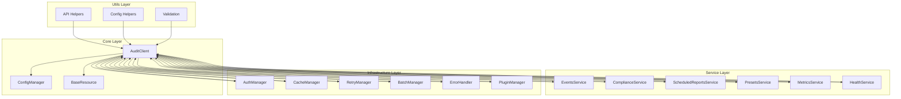
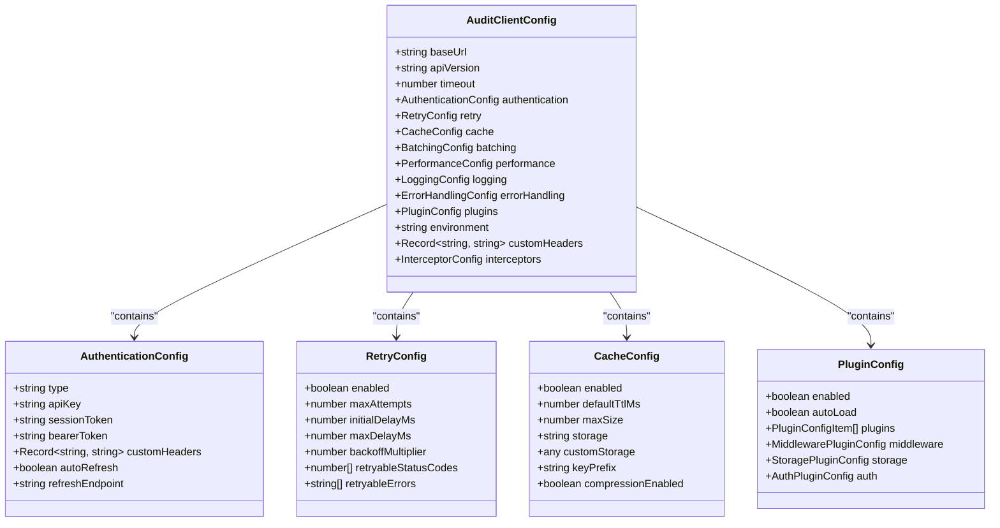
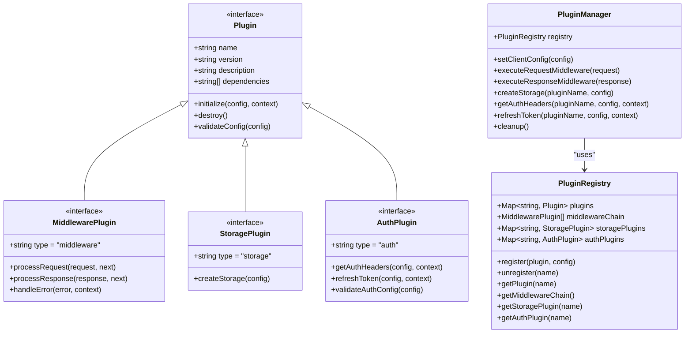
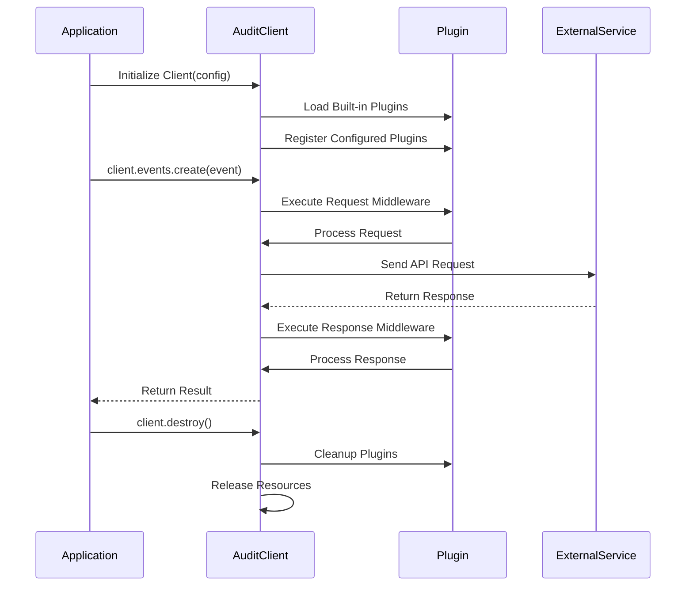
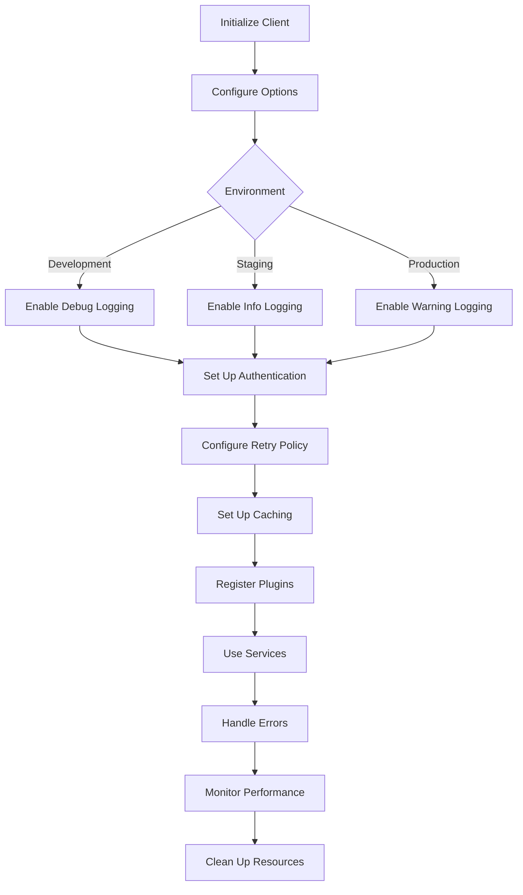

# Audit Client Library Specifications

<cite>
**Referenced Files in This Document**   
- [README.md](file://packages/audit-client/README.md)
- [client.ts](file://packages/audit-client/src/core/client.ts)
- [config.ts](file://packages/audit-client/src/core/config.ts)
- [built-in.ts](file://packages/audit-client/src/infrastructure/plugins/built-in.ts)
- [plugins.ts](file://packages/audit-client/src/infrastructure/plugins.ts)
- [auth.ts](file://packages/audit-client/src/infrastructure/auth.ts)
- [cache.ts](file://packages/audit-client/src/infrastructure/cache.ts)
</cite>

## Table of Contents
1. [Introduction](#introduction)
2. [Design Principles](#design-principles)
3. [Architecture Overview](#architecture-overview)
4. [Core Components](#core-components)
5. [Configuration System](#configuration-system)
6. [Plugin Architecture](#plugin-architecture)
7. [Integration Patterns](#integration-patterns)
8. [Implementation Tasks](#implementation-tasks)
9. [Best Practices](#best-practices)

## Introduction

The Audit Client Library is a comprehensive TypeScript SDK designed to provide enhanced functionality for interacting with the Smart Logs Audit API. This library offers a robust set of features including type safety, retry mechanisms, intelligent caching, authentication management, request batching, and comprehensive error handling. The library is specifically engineered to simplify integration with audit systems while ensuring reliability, performance, and observability in various application environments.

Built with a modular architecture, the Audit Client Library separates concerns into distinct layers: core functionality, service implementations, infrastructure components, and utility functions. This separation enables developers to leverage specific features as needed while maintaining a consistent interface across different use cases. The library supports multiple authentication methods, configurable retry policies, and flexible caching strategies to accommodate various deployment scenarios and performance requirements.

The client is designed to be developer-friendly with comprehensive TypeScript support, strict type checking, and detailed documentation. It includes built-in support for common development workflows and integrates seamlessly with modern JavaScript frameworks and Node.js applications. The library's extensible plugin architecture allows for customization and extension of its capabilities to meet specific application needs.

**Section sources**
- [README.md](file://packages/audit-client/README.md#L1-L213)

## Design Principles

The Audit Client Library is built on several core design principles that guide its architecture and implementation. These principles ensure the library is reliable, maintainable, and easy to use in various application contexts.

First, the library emphasizes type safety through comprehensive TypeScript support. All interfaces, configuration options, and API responses are strictly typed, reducing runtime errors and improving developer experience through better tooling support and autocomplete functionality. This type safety extends to configuration validation using Zod schemas, which ensure that all configuration options are properly validated at runtime.

Second, the library follows a modular architecture that separates concerns into distinct components. This modularity allows for independent development and testing of different features while maintaining a cohesive interface. The separation of core functionality, services, infrastructure, and utilities enables developers to understand and extend the library more easily.

Third, the library prioritizes reliability through robust error handling and retry mechanisms. The client implements exponential backoff with configurable retry policies, circuit breakers, and comprehensive error management with correlation IDs for tracing. These features ensure that transient failures are handled gracefully and that applications can maintain functionality even under adverse network conditions.

Fourth, performance optimization is a key design consideration. The library includes request compression, streaming capabilities, and intelligent caching with multiple storage backends. These features reduce network overhead and improve response times, particularly in high-throughput scenarios.

Finally, the library emphasizes extensibility through its plugin architecture. This design allows developers to customize and extend the client's functionality without modifying the core codebase. The plugin system supports middleware, storage, and authentication extensions, enabling integration with various third-party services and custom business logic.

**Section sources**
- [README.md](file://packages/audit-client/README.md#L25-L100)
- [client.ts](file://packages/audit-client/src/core/client.ts#L1-L825)

## Architecture Overview

The Audit Client Library follows a layered architecture that organizes functionality into distinct components with clear responsibilities and dependencies. This architecture enables maintainability, testability, and extensibility while providing a consistent interface for developers.

**Diagram sources **
- [client.ts](file://packages/audit-client/src/core/client.ts#L1-L825)
- [config.ts](file://packages/audit-client/src/core/config.ts#L1-L530)

The architecture consists of four main layers:

1. **Core Layer**: Contains the main AuditClient class and configuration management. The AuditClient serves as the primary entry point and orchestrates interactions between different components.

2. **Service Layer**: Implements domain-specific functionality such as event management, compliance reporting, scheduled reports, configuration presets, metrics collection, and health monitoring. Each service provides a focused API for specific audit-related operations.

3. **Infrastructure Layer**: Handles cross-cutting concerns including authentication, caching, retry logic, request batching, error handling, and plugin management. These components provide shared functionality used by multiple services.

4. **Utils Layer**: Contains helper functions and utilities for API interactions, configuration management, data validation, and type checking.

The architecture follows dependency inversion principles, with higher-level components depending on abstractions rather than concrete implementations. This design enables easier testing and allows for swapping implementations without affecting dependent components.

**Section sources**
- [README.md](file://packages/audit-client/README.md#L150-L200)
- [client.ts](file://packages/audit-client/src/core/client.ts#L1-L825)

## Core Components

The Audit Client Library consists of several core components that work together to provide a comprehensive audit solution. These components are designed to be loosely coupled while maintaining a cohesive interface for developers.

The **AuditClient** class serves as the main entry point and orchestrator for all operations. It manages configuration, initializes infrastructure components, and provides access to various services. The client handles lifecycle management, including initialization, cleanup, and error handling, ensuring proper resource management.

The **ConfigManager** component is responsible for managing configuration options and validation. It uses Zod schemas to validate configuration at runtime, ensuring that all settings are correct before use. The configuration system supports environment-specific settings, default values, and merging of configuration from multiple sources.

The **Service Components** provide domain-specific functionality:
- **EventsService**: Manages audit event creation, querying, and verification
- **ComplianceService**: Handles compliance reporting for standards like HIPAA and GDPR
- **ScheduledReportsService**: Manages automated reporting schedules
- **PresetsService**: Handles configuration templates for audit settings
- **MetricsService**: Provides system monitoring and performance tracking
- **HealthService**: Offers health checking capabilities for the audit system

The **Infrastructure Components** handle cross-cutting concerns:
- **AuthManager**: Manages authentication with support for API keys, session tokens, and custom methods
- **CacheManager**: Provides intelligent caching with multiple storage backends
- **RetryManager**: Implements retry logic with exponential backoff
- **BatchManager**: Handles request batching and deduplication
- **ErrorHandler**: Centralizes error handling and reporting
- **PluginManager**: Manages the plugin system for extensibility

These components work together through well-defined interfaces, allowing for independent development and testing while maintaining a consistent experience for developers using the library.

**Section sources**
- [client.ts](file://packages/audit-client/src/core/client.ts#L1-L825)
- [config.ts](file://packages/audit-client/src/core/config.ts#L1-L530)

## Configuration System

The Audit Client Library features a comprehensive configuration system that provides flexibility, validation, and ease of use. The configuration system is designed to handle various deployment scenarios while ensuring correctness and security.

**Diagram sources **
- [config.ts](file://packages/audit-client/src/core/config.ts#L1-L530)

The configuration system is built around several key principles:

1. **Type Safety**: All configuration options are strongly typed using TypeScript interfaces derived from Zod schemas. This ensures that configuration errors are caught at compile time when possible.

2. **Validation**: Configuration is validated at runtime using Zod schemas, which provide detailed error messages when invalid configuration is provided. The validation process checks for required fields, correct data types, and valid value ranges.

3. **Default Values**: The system provides sensible defaults for all configuration options, reducing the configuration burden for common use cases while allowing customization when needed.

4. **Environment Support**: The configuration system supports environment-specific settings for development, staging, and production environments. Each environment has appropriate defaults that balance usability and security.

5. **Flexibility**: Configuration can be provided through multiple sources including direct object configuration, environment variables, and programmatic updates. This flexibility allows the library to be used in various deployment scenarios.

6. **Security**: Sensitive configuration options are handled securely, with options to mask sensitive data in logs and restrict access to configuration values.

The configuration system also supports dynamic updates, allowing configuration to be modified at runtime without requiring client recreation. This capability enables adaptive behavior based on changing conditions or user preferences.

**Section sources**
- [config.ts](file://packages/audit-client/src/core/config.ts#L1-L530)
- [client.ts](file://packages/audit-client/src/core/client.ts#L1-L825)

## Plugin Architecture

The Audit Client Library features a comprehensive plugin architecture that allows developers to extend and customize its functionality. This system supports middleware, storage, and authentication plugins, enabling integration with various third-party services and custom business logic.

**Diagram sources **
- [plugins.ts](file://packages/audit-client/src/infrastructure/plugins.ts#L1-L650)
- [built-in.ts](file://packages/audit-client/src/infrastructure/plugins/built-in.ts#L1-L783)

The plugin architecture consists of several key components:

1. **Plugin Interfaces**: Define the contracts for different plugin types including middleware, storage, and authentication plugins. These interfaces ensure consistency across plugins while allowing for specific functionality.

2. **Plugin Registry**: Manages the lifecycle of registered plugins, handling registration, dependency resolution, and cleanup. The registry maintains separate collections for different plugin types and enforces dependency constraints.

3. **Plugin Manager**: Coordinates plugin operations and provides a unified interface for interacting with plugins. It handles execution of middleware chains, creation of storage instances, and authentication header generation.

4. **Built-in Plugins**: The library includes several built-in plugins for common use cases:
   - **Request Logging**: Logs all HTTP requests and responses
   - **Correlation ID**: Adds correlation IDs to requests for tracing
   - **Rate Limiting**: Implements client-side rate limiting
   - **Redis Storage**: Provides Redis-based cache storage
   - **IndexedDB Storage**: Offers IndexedDB-based storage for browsers
   - **JWT Authentication**: Supports JWT-based authentication
   - **OAuth2 Authentication**: Implements OAuth2-based authentication
   - **Custom Header Authentication**: Allows custom header-based authentication

The plugin system supports dependency resolution with cycle detection, ensuring that plugins are initialized in the correct order. It also provides validation for plugin configuration and handles error conditions gracefully.

Plugins can be loaded automatically based on configuration or manually through the API. The system supports both synchronous and asynchronous initialization, allowing for complex setup procedures when needed.

**Section sources**
- [plugins.ts](file://packages/audit-client/src/infrastructure/plugins.ts#L1-L650)
- [built-in.ts](file://packages/audit-client/src/infrastructure/plugins/built-in.ts#L1-L783)
- [utils.ts](file://packages/audit-client/src/infrastructure/plugins/utils.ts#L1-L540)

## Integration Patterns

The Audit Client Library supports various integration patterns that enable seamless incorporation into different application architectures and deployment scenarios. These patterns leverage the library's modular design and extensible architecture to provide flexible integration options.

**Diagram sources **
- [client.ts](file://packages/audit-client/src/core/client.ts#L1-L825)
- [plugins.ts](file://packages/audit-client/src/infrastructure/plugins.ts#L1-L650)

Key integration patterns include:

1. **Direct Integration**: Applications can directly instantiate the AuditClient and use its services through the provided API. This pattern is suitable for applications that need fine-grained control over audit operations.

2. **Configuration-Driven Integration**: Applications can configure the client through environment variables or configuration files, allowing for different settings in various environments without code changes.

3. **Plugin-Based Integration**: Applications can extend the client's functionality through plugins, adding custom middleware, storage backends, or authentication methods. This pattern enables integration with existing infrastructure and services.

4. **Event-Driven Integration**: Applications can use the client to publish audit events that trigger downstream processes or workflows. This pattern supports decoupled architectures and event sourcing.

5. **Batch Integration**: Applications can use the client's batching capabilities to group multiple audit operations into single requests, improving performance and reducing network overhead.

6. **Hybrid Integration**: Applications can combine multiple patterns based on specific needs, using direct integration for critical paths and plugin-based extension for specialized functionality.

The library also supports integration with popular frameworks and platforms through specific configuration and usage patterns. For example, it can be integrated into Express.js applications as middleware, used in React applications for client-side auditing, or incorporated into serverless functions for event processing.

**Section sources**
- [client.ts](file://packages/audit-client/src/core/client.ts#L1-L825)
- [plugins.ts](file://packages/audit-client/src/infrastructure/plugins.ts#L1-L650)

## Implementation Tasks

Implementing the Audit Client Library involves several key tasks that ensure proper configuration, integration, and operation within an application. These tasks cover initialization, configuration, usage patterns, and lifecycle management.

**Diagram sources **
- [client.ts](file://packages/audit-client/src/core/client.ts#L1-L825)
- [config.ts](file://packages/audit-client/src/core/config.ts#L1-L530)

Key implementation tasks include:

1. **Client Initialization**: Create an instance of the AuditClient with appropriate configuration. This involves setting the base URL, authentication credentials, and other essential options.

2. **Configuration Setup**: Configure the client with environment-specific settings, including retry policies, caching options, and logging levels. This may involve loading configuration from environment variables or configuration files.

3. **Authentication Configuration**: Set up the appropriate authentication method based on the application's requirements. This could involve API keys, session tokens, or custom authentication schemes.

4. **Plugin Registration**: Register any required plugins for extended functionality. This includes middleware for request logging or rate limiting, storage plugins for alternative cache backends, or authentication plugins for custom auth methods.

5. **Service Usage**: Implement the required audit operations using the appropriate service methods. This includes creating audit events, generating compliance reports, scheduling automated reports, or retrieving system metrics.

6. **Error Handling**: Implement proper error handling for audit operations, including retry logic for transient failures and appropriate responses for permanent errors.

7. **Performance Monitoring**: Monitor the performance of audit operations and adjust configuration as needed. This includes tracking request rates, response times, and error rates.

8. **Resource Cleanup**: Ensure proper cleanup of client resources when they are no longer needed, particularly in long-running applications or when the client is being reconfigured.

9. **Testing and Validation**: Implement comprehensive testing of the audit integration, including unit tests for individual operations and integration tests for end-to-end workflows.

10. **Documentation and Maintenance**: Document the implementation details and maintain the integration as requirements evolve or the library is updated.

**Section sources**
- [client.ts](file://packages/audit-client/src/core/client.ts#L1-L825)
- [config.ts](file://packages/audit-client/src/core/config.ts#L1-L530)

## Best Practices

Adopting best practices when using the Audit Client Library ensures optimal performance, reliability, and maintainability of audit functionality in applications. These practices cover configuration, usage patterns, error handling, and security considerations.

1. **Configuration Management**: Use environment-specific configuration to balance usability and security across different deployment environments. In development, enable verbose logging and shorter timeouts for easier debugging. In production, prioritize security and performance with appropriate logging levels and caching settings.

2. **Authentication Security**: Store authentication credentials securely using environment variables or secure configuration management systems. Avoid hardcoding credentials in source code. Use the most restrictive authentication method appropriate for the use case.

3. **Error Handling**: Implement comprehensive error handling that distinguishes between transient and permanent errors. Use the client's built-in retry mechanisms for transient failures, but implement appropriate fallbacks or user notifications for permanent errors.

4. **Performance Optimization**: Leverage the client's caching and batching capabilities to reduce network overhead and improve response times. Configure appropriate cache TTL values based on data volatility and consistency requirements.

5. **Resource Management**: Properly manage client lifecycle by cleaning up resources when they are no longer needed. This is particularly important in long-running applications or when creating multiple client instances.

6. **Monitoring and Observability**: Enable appropriate logging and monitoring to track audit operations and detect issues early. Use correlation IDs to trace requests across system boundaries and facilitate debugging.

7. **Plugin Usage**: Use built-in plugins for common functionality rather than implementing custom solutions when possible. When creating custom plugins, follow the same quality standards as the core library.

8. **Type Safety**: Leverage TypeScript's type checking to catch errors early in the development process. Use the provided type definitions and avoid type assertions unless absolutely necessary.

9. **Testing**: Implement comprehensive testing of audit functionality, including unit tests for individual operations and integration tests for end-to-end workflows. Test error conditions and edge cases to ensure robustness.

10. **Documentation**: Document the audit implementation details, including configuration options, usage patterns, and error handling strategies. This documentation helps maintain consistency across development teams and facilitates onboarding of new developers.

Following these best practices ensures that audit functionality is reliable, secure, and maintainable while providing valuable insights into application behavior and compliance status.

**Section sources**
- [README.md](file://packages/audit-client/README.md#L1-L213)
- [client.ts](file://packages/audit-client/src/core/client.ts#L1-L825)
- [config.ts](file://packages/audit-client/src/core/config.ts#L1-L530)