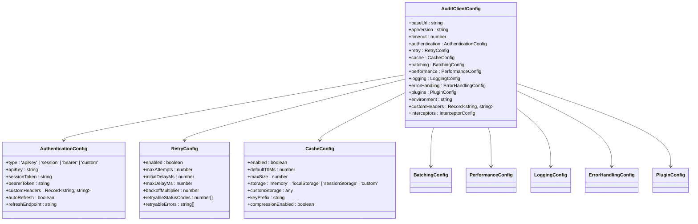

# Audit Client Library Specifications

<cite>
**Referenced Files in This Document**   
- [README.md](file://packages/audit-client/README.md)
- [client.ts](file://packages/audit-client/src/core/client.ts)
- [config.ts](file://packages/audit-client/src/core/config.ts)
- [events.ts](file://packages/audit-client/src/services/events.ts)
- [compliance.ts](file://packages/audit-client/src/services/compliance.ts)
- [metrics.ts](file://packages/audit-client/src/services/metrics.ts)
- [auth.ts](file://packages/audit-client/src/infrastructure/auth.ts)
- [cache.ts](file://packages/audit-client/src/infrastructure/cache.ts)
- [retry.ts](file://packages/audit-client/src/infrastructure/retry.ts)
</cite>

## Table of Contents
1. [Introduction](#introduction)
2. [Architecture Overview](#architecture-overview)
3. [Core Components](#core-components)
4. [API Interfaces](#api-interfaces)
5. [Configuration Management](#configuration-management)
6. [Integration Patterns](#integration-patterns)
7. [Practical Examples](#practical-examples)
8. [Troubleshooting Guide](#troubleshooting-guide)
9. [Performance Considerations](#performance-considerations)

## Introduction

The Audit Client Library is a comprehensive TypeScript SDK designed for seamless integration with the Smart Logs Audit API. It provides a robust, type-safe interface for managing audit events, compliance reporting, and system monitoring with built-in features for reliability, performance, and security.

The library follows a modular architecture with clear separation of concerns, making it easy to use while providing advanced capabilities for complex use cases. It supports modern development practices including TypeScript type safety, promise-based async operations, and configurable retry mechanisms.

Key features of the Audit Client Library include:
- **Type Safety**: Full TypeScript support with strict type checking
- **Reliability**: Exponential backoff retry logic with circuit breaker pattern
- **Performance**: Intelligent caching with multiple storage backends
- **Security**: Flexible authentication support including API keys and session tokens
- **Observability**: Structured logging and request/response inspection
- **Extensibility**: Plugin architecture for custom middleware, storage, and auth

The library is designed to work in both browser and Node.js environments, making it suitable for frontend applications, backend services, and serverless functions.

**Section sources**
- [README.md](file://packages/audit-client/README.md#L1-L50)

## Architecture Overview

The Audit Client Library follows a layered architectural pattern with four main layers that provide separation of concerns and maintainability.


**Diagram sources **
- [client.ts](file://packages/audit-client/src/core/client.ts#L1-L100)
- [config.ts](file://packages/audit-client/src/core/config.ts#L1-L50)

**Section sources**
- [README.md](file://packages/audit-client/README.md#L51-L100)

## Core Components

The Audit Client Library is composed of several core components that work together to provide a comprehensive audit management solution.

### AuditClient Class

The `AuditClient` class serves as the main entry point for the library. It orchestrates all services and manages the client lifecycle, configuration, and infrastructure components.

Key responsibilities of the AuditClient include:
- Service initialization and dependency injection
- Unified configuration management
- Client lifecycle management and cleanup
- Centralized error handling
- Performance monitoring and statistics
- Request/response interceptor management

The client follows a factory pattern, creating service instances during initialization and providing them through getter properties that validate the client state before returning the service.


**Diagram sources **
- [client.ts](file://packages/audit-client/src/core/client.ts#L101-L200)

**Section sources**
- [client.ts](file://packages/audit-client/src/core/client.ts#L1-L825)

### Configuration Management

The configuration system provides comprehensive options for customizing the client behavior. The `ConfigManager` class validates and normalizes configuration using Zod schemas, ensuring type safety and correctness.

Configuration options are organized into logical groups:
- **Connection settings**: Base URL, API version, timeout
- **Authentication**: API keys, session tokens, bearer tokens
- **Retry configuration**: Maximum attempts, delay settings, retryable status codes
- **Caching**: TTL, storage backend, compression
- **Performance**: Request batching, compression, streaming
- **Logging**: Log level, format, sensitive data masking
- **Error handling**: Error transformation, recovery options
- **Plugins**: Middleware, storage, and authentication plugins



**Diagram sources **
- [config.ts](file://packages/audit-client/src/core/config.ts#L1-L100)

**Section sources**
- [config.ts](file://packages/audit-client/src/core/config.ts#L1-L530)

## API Interfaces

The Audit Client Library provides several specialized services for different aspects of audit management.

### Events Service

The `EventsService` provides comprehensive functionality for managing audit events, including creation, querying, verification, and export.


**Diagram sources **
- [events.ts](file://packages/audit-client/src/services/events.ts#L1-L100)

**Section sources**
- [events.ts](file://packages/audit-client/src/services/events.ts#L1-L952)

### Compliance Service

The `ComplianceService` provides functionality for generating compliance reports and handling GDPR data export requests.


**Diagram sources **
- [compliance.ts](file://packages/audit-client/src/services/compliance.ts#L1-L100)

**Section sources**
- [compliance.ts](file://packages/audit-client/src/services/compliance.ts#L1-L718)

### Metrics Service

The `MetricsService` provides comprehensive system monitoring capabilities including system metrics, audit metrics, performance metrics, and alert management.


**Diagram sources **
- [metrics.ts](file://packages/audit-client/src/services/metrics.ts#L1-L100)

**Section sources**
- [metrics.ts](file://packages/audit-client/src/services/metrics.ts#L1-L903)

## Configuration Management

The Audit Client Library provides flexible configuration options through the `ConfigManager` class, which validates and normalizes configuration using Zod schemas.

### Configuration Validation

Configuration validation ensures that all settings are correct and within acceptable ranges. The library uses Zod schemas to define the structure and constraints for each configuration option.


**Diagram sources **
- [config.ts](file://packages/audit-client/src/core/config.ts#L101-L200)

**Section sources**
- [config.ts](file://packages/audit-client/src/core/config.ts#L1-L530)

### Environment-Specific Configuration

The library supports environment-specific configuration through the `createDefaultConfig` method, which provides sensible defaults for different environments.

```typescript
// Create client for specific environment
const client = AuditClient.createForEnvironment(
  'production',
  'https://api.smartlogs.com',
  {
    type: 'apiKey',
    apiKey: 'your-api-key'
  }
);
```

Environment-specific defaults:
- **Development**: Debug logging, lower retry limits, detailed error messages
- **Staging**: Info logging, standard retry configuration, performance monitoring
- **Production**: Warning logging, aggressive caching, high concurrency limits

**Section sources**
- [config.ts](file://packages/audit-client/src/core/config.ts#L400-L500)

## Integration Patterns

The Audit Client Library supports several integration patterns for different use cases and environments.

### Authentication Integration

The library supports multiple authentication methods through the `AuthManager` class.


**Diagram sources **
- [auth.ts](file://packages/audit-client/src/infrastructure/auth.ts#L1-L100)

**Section sources**
- [auth.ts](file://packages/audit-client/src/infrastructure/auth.ts#L1-L439)

### Caching Strategy

The `CacheManager` provides intelligent caching with multiple storage backends and automatic cleanup.


Supported cache storage backends:
- **Memory**: In-memory cache for Node.js environments
- **localStorage**: Persistent browser storage
- **sessionStorage**: Session-scoped browser storage
- **Custom**: Custom storage implementation

**Diagram sources **
- [cache.ts](file://packages/audit-client/src/infrastructure/cache.ts#L1-L100)

**Section sources**
- [cache.ts](file://packages/audit-client/src/infrastructure/cache.ts#L1-L781)

### Retry and Circuit Breaker

The `RetryManager` implements exponential backoff retry logic with circuit breaker pattern.


**Diagram sources **
- [retry.ts](file://packages/audit-client/src/infrastructure/retry.ts#L1-L100)

**Section sources**
- [retry.ts](file://packages/audit-client/src/infrastructure/retry.ts#L1-L522)

## Practical Examples

### Basic Usage

```typescript
import { AuditClient } from '@smedrec/audit-client'

// Create client instance
const client = new AuditClient({
  baseUrl: 'https://api.smartlogs.com',
  authentication: {
    type: 'apiKey',
    apiKey: 'your-api-key',
  },
})

// Create an audit event
const event = await client.events.create({
  action: 'user.login',
  principalId: 'user-123',
  organizationId: 'org-456',
  status: 'success',
  targetResourceType: 'user',
  dataClassification: 'PUBLIC',
})
```

**Section sources**
- [README.md](file://packages/audit-client/README.md#L101-L150)

### Advanced Configuration

```typescript
import { AuditClient } from '@smedrec/audit-client'

const config = {
  baseUrl: 'https://api.smartlogs.com',
  authentication: {
    type: 'apiKey',
    apiKey: 'your-api-key',
    autoRefresh: true,
  },
  retry: {
    enabled: true,
    maxAttempts: 3,
    initialDelayMs: 1000,
    maxDelayMs: 30000,
    backoffMultiplier: 2,
  },
  cache: {
    enabled: true,
    defaultTtlMs: 300000, // 5 minutes
    storage: 'memory',
  },
  logging: {
    enabled: true,
    level: 'info',
    maskSensitiveData: true,
  },
}

const client = new AuditClient(config)
```

**Section sources**
- [README.md](file://packages/audit-client/README.md#L151-L200)

### Event Querying

```typescript
// Query events with filtering and pagination
const events = await client.events.query({
  filter: {
    dateRange: {
      startDate: '2024-01-01',
      endDate: '2024-01-31',
    },
    principalIds: ['user-123'],
    actions: ['user.login', 'user.logout'],
  },
  pagination: {
    limit: 50,
    offset: 0,
  },
  sort: {
    field: 'timestamp',
    direction: 'desc',
  },
})
```

**Section sources**
- [events.ts](file://packages/audit-client/src/services/events.ts#L300-L400)

### Compliance Reporting

```typescript
// Generate HIPAA compliance report
const hipaaReport = await client.compliance.generateHipaaReport({
  dateRange: {
    startDate: '2024-01-01',
    endDate: '2024-01-31',
  },
  organizationIds: ['org-456'],
})

// Export GDPR data
const exportResult = await client.compliance.exportGdprData({
  dataSubjectId: 'user-123',
  organizationId: 'org-456',
  includePersonalData: true,
  format: 'json',
})
```

**Section sources**
- [compliance.ts](file://packages/audit-client/src/services/compliance.ts#L100-L200)

## Troubleshooting Guide

### Common Issues and Solutions

| Issue | Possible Cause | Solution |
|------|---------------|----------|
| Authentication errors | Invalid API key or token | Verify credentials and check expiration |
| Rate limiting | Too many requests | Implement retry logic with exponential backoff |
| Network timeouts | Poor connectivity | Increase timeout settings |
| Cache issues | Storage quota exceeded | Clear cache or switch to different storage backend |
| Type errors | Version mismatch | Ensure compatible TypeScript and library versions |

**Section sources**
- [README.md](file://packages/audit-client/README.md#L201-L250)

### Error Handling

The library provides comprehensive error handling with specific error types for different scenarios.

```typescript
try {
  const event = await client.events.create(eventData)
} catch (error) {
  if (error instanceof ConfigurationError) {
    console.error('Configuration error:', error.getFormattedErrors())
  } else if (error instanceof AuthenticationError) {
    console.error('Authentication failed:', error.message)
  } else if (error instanceof RetryExhaustedError) {
    console.error('Request failed after retries:', error.attempts)
  } else {
    console.error('Unexpected error:', error)
  }
}
```

**Section sources**
- [client.ts](file://packages/audit-client/src/core/client.ts#L500-L600)

### Debugging Tips

1. Enable debug logging to see detailed request/response information
2. Use the `getStats()` method to monitor client performance
3. Check the health status with `healthCheck()` method
4. Validate configuration with `ConfigManager.validateConfig()`
5. Monitor cache statistics with `cacheManager.getStats()`

**Section sources**
- [client.ts](file://packages/audit-client/src/core/client.ts#L600-L700)

## Performance Considerations

### Request Optimization

The library provides several features to optimize performance:

- **Request batching**: Group multiple requests into a single HTTP call
- **Caching**: Store responses locally to avoid redundant API calls
- **Compression**: Compress request/response payloads
- **Streaming**: Handle large datasets efficiently
- **Connection pooling**: Reuse HTTP connections

### Memory Management

The client implements proper cleanup to prevent memory leaks:

- Automatic cleanup of event listeners
- Proper disposal of WebSocket connections
- Cache cleanup with LRU eviction
- Interval cleanup for periodic tasks

### Best Practices

1. Reuse client instances when possible
2. Configure appropriate cache TTL values
3. Use bulk operations for multiple events
4. Implement proper error handling and retry logic
5. Monitor client statistics for performance issues

**Section sources**
- [client.ts](file://packages/audit-client/src/core/client.ts#L700-L800)