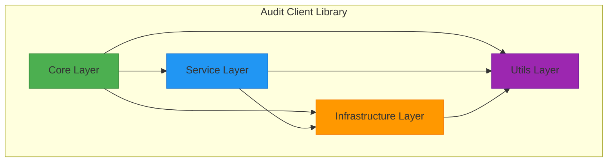
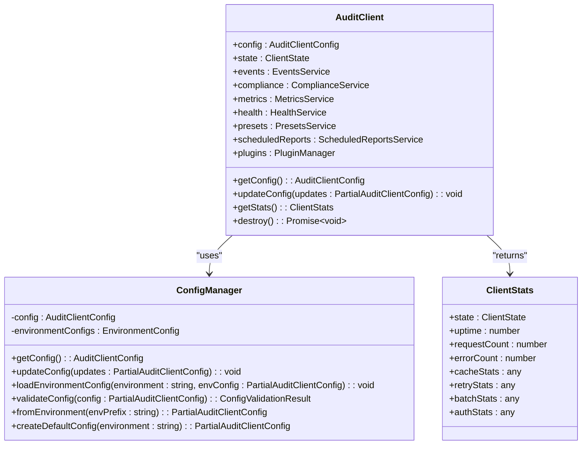
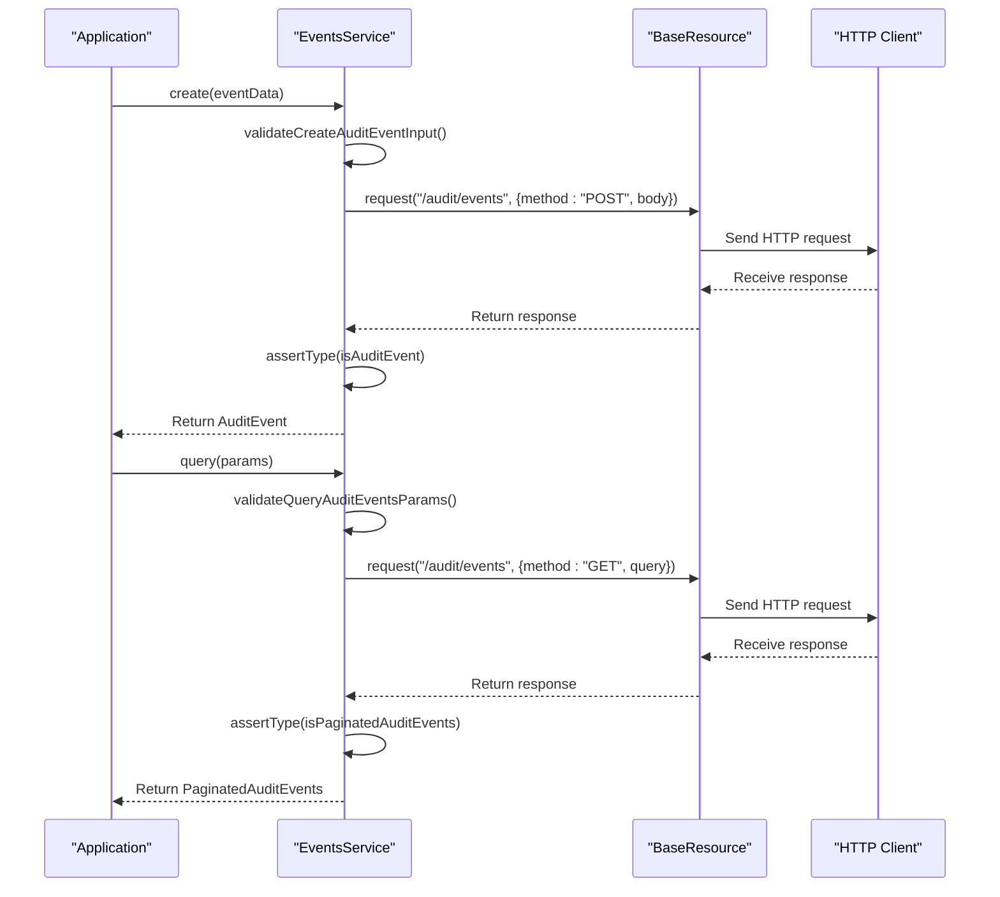
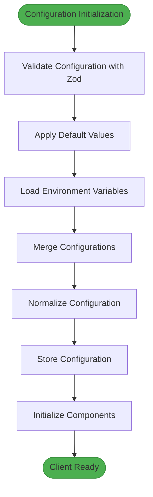

# Audit Client Library

<cite>
**Referenced Files in This Document**   
- [README.md](file://packages/audit-client/README.md)
- [client.ts](file://packages/audit-client/src/core/client.ts)
- [config.ts](file://packages/audit-client/src/core/config.ts)
- [events.ts](file://packages/audit-client/src/services/events.ts)
- [compliance.ts](file://packages/audit-client/src/services/compliance.ts)
- [metrics.ts](file://packages/audit-client/src/services/metrics.ts)
- [auth.ts](file://packages/audit-client/src/infrastructure/auth.ts)
- [cache.ts](file://packages/audit-client/src/infrastructure/cache.ts)
- [retry.ts](file://packages/audit-client/src/infrastructure/retry.ts)
- [plugins.ts](file://packages/audit-client/src/infrastructure/plugins.ts)
- [built-in.ts](file://packages/audit-client/src/infrastructure/plugins/built-in.ts)
- [PLUGIN_ARCHITECTURE.md](file://packages/audit-client/docs/PLUGIN_ARCHITECTURE.md)
- [FRAMEWORK_INTEGRATION.md](file://packages/audit-client/docs/FRAMEWORK_INTEGRATION.md)
- [plugin-usage.ts](file://packages/audit-client/src/examples/plugin-usage.ts)
</cite>

## Update Summary
- Added comprehensive documentation for the plugin architecture system
- Added framework integration examples for Express.js and Next.js
- Updated architecture overview to include plugin system
- Enhanced practical examples with plugin usage
- Added new sections for plugin development and framework integration
- Updated configuration management section to include plugin configuration
- Added troubleshooting guidance for plugin-related issues

## Table of Contents
1. [Introduction](#introduction)
2. [Architecture Overview](#architecture-overview)
3. [Core Components](#core-components)
4. [API Interfaces](#api-interfaces)
5. [Configuration Management](#configuration-management)
6. [Integration Patterns](#integration-patterns)
7. [Plugin Architecture](#plugin-architecture)
8. [Framework Integration](#framework-integration)
9. [Practical Examples](#practical-examples)
10. [Troubleshooting Guide](#troubleshooting-guide)
11. [Performance Considerations](#performance-considerations)
12. [Conclusion](#conclusion)

## Introduction

The Audit Client Library is a comprehensive TypeScript SDK designed for interacting with the Smart Logs Audit API. It provides a robust, type-safe interface for audit event management, compliance reporting, and system monitoring. The library is built with modern development practices in mind, featuring a modular architecture that separates concerns into distinct layers.

This documentation covers the complete functionality of the Audit Client Library, including its purpose, implementation details, API interfaces, and integration patterns. The library is designed to be developer-friendly while maintaining enterprise-grade reliability and security. It supports advanced features such as retry mechanisms, intelligent caching, authentication management, request batching, and comprehensive error handling.

The client library serves as a bridge between applications and the Smart Logs Audit API, abstracting away the complexities of HTTP communication, authentication, and data validation. It provides a clean, intuitive interface that allows developers to focus on business logic rather than infrastructure concerns.

**Section sources**
- [README.md](file://packages/audit-client/README.md#L1-L212)

## Architecture Overview

The Audit Client Library follows a modular, layered architecture that promotes separation of concerns and maintainability. The architecture consists of four main layers: Core, Service, Infrastructure, and Utils. Each layer has a specific responsibility and interacts with other layers through well-defined interfaces.



**Diagram sources**
- [README.md](file://packages/audit-client/README.md#L100-L130)

The Core Layer contains the main client class, configuration management, and base resource classes. This layer serves as the entry point for the library and orchestrates the interaction between other components. The Service Layer provides domain-specific functionality through specialized services such as Events, Compliance, and Metrics. Each service encapsulates the business logic for a specific domain and exposes a clean API to consumers.

The Infrastructure Layer handles cross-cutting concerns such as authentication, caching, retry mechanisms, and logging. These components are designed to be reusable across different services and provide consistent behavior throughout the application. The Utils Layer contains utility functions, validators, and transformers that support the other layers with common functionality.

This architectural approach enables the library to be both flexible and maintainable. New services can be added without affecting existing code, and infrastructure components can be updated or replaced with minimal impact on the rest of the system.

**Section sources**
- [README.md](file://packages/audit-client/README.md#L100-L130)
- [client.ts](file://packages/audit-client/src/core/client.ts#L1-L825)

## Core Components

The Audit Client Library is built around several core components that work together to provide a comprehensive solution for audit management. The main entry point is the AuditClient class, which serves as the central orchestrator for all operations. This class manages the lifecycle of the client, initializes all required components, and provides access to the various services.

The ConfigManager is responsible for managing the client's configuration, including validation, normalization, and environment-specific settings. It uses Zod schemas to ensure type safety and provides methods for updating configuration at runtime. The configuration system supports environment variables, default configurations for different environments, and deep merging of configuration objects.



**Diagram sources**
- [client.ts](file://packages/audit-client/src/core/client.ts#L1-L825)
- [config.ts](file://packages/audit-client/src/core/config.ts#L1-L530)

The client implements a robust lifecycle management system with proper cleanup of resources when destroyed. It includes process cleanup handlers for Node.js environments to ensure graceful shutdown. The client also provides comprehensive statistics and monitoring capabilities through the getStats() method, which returns information about the client's state, uptime, request counts, and infrastructure component statistics.

**Section sources**
- [client.ts](file://packages/audit-client/src/core/client.ts#L1-L825)
- [config.ts](file://packages/audit-client/src/core/config.ts#L1-L530)

## API Interfaces

The Audit Client Library provides a rich set of API interfaces through its service classes. Each service offers a domain-specific API that abstracts the underlying HTTP communication and provides a clean, intuitive interface for developers. The main services include Events, Compliance, Metrics, Health, Presets, and ScheduledReports.

The EventsService provides comprehensive functionality for audit event management, including creating single and bulk events, querying with advanced filtering and pagination, retrieving specific events by ID, verifying event integrity, exporting events in various formats, streaming large datasets, and subscribing to real-time events. The service includes robust validation of input parameters and response data to ensure type safety and data integrity.



**Diagram sources**
- [events.ts](file://packages/audit-client/src/services/events.ts#L1-L952)

The ComplianceService offers specialized functionality for generating compliance reports, including HIPAA and GDPR reports, custom report generation, data export for GDPR requests, and data pseudonymization. The service includes validation of report criteria and parameters to ensure compliance with regulatory requirements.

The MetricsService provides comprehensive system monitoring capabilities, including retrieving system metrics, audit-specific metrics, performance metrics, and usage statistics. It also includes alert management functionality for acknowledging, resolving, and suppressing alerts, as well as real-time metrics streaming through the MetricsSubscription interface.

**Section sources**
- [events.ts](file://packages/audit-client/src/services/events.ts#L1-L952)
- [compliance.ts](file://packages/audit-client/src/services/compliance.ts#L1-L718)
- [metrics.ts](file://packages/audit-client/src/services/metrics.ts#L1-L903)

## Configuration Management

The Audit Client Library features a comprehensive configuration management system that allows for flexible and robust configuration of client behavior. The configuration system is built around the AuditClientConfig interface, which defines all configurable options for the client. Configuration options are organized into logical groups such as authentication, retry, caching, batching, performance, logging, error handling, and plugins.



**Diagram sources**
- [config.ts](file://packages/audit-client/src/core/config.ts#L1-L530)

The configuration system uses Zod schemas for validation, ensuring type safety and providing detailed error messages when invalid configuration is provided. The ConfigManager class handles the validation and normalization of configuration objects, merging default values with user-provided configuration and environment variables.

The library supports environment-specific configuration through the createDefaultConfig method, which provides sensible defaults for development, staging, and production environments. For example, development environments enable debug logging and include request/response bodies in logs, while production environments prioritize security by masking sensitive data and using higher performance settings.

Configuration can be updated at runtime using the updateConfig method, which reinitializes the relevant infrastructure components with the new configuration. This allows for dynamic configuration changes without requiring client recreation. The configuration system also supports loading configuration from environment variables, making it easy to configure the client in different deployment environments.

The plugin system configuration is now a key part of the configuration management, allowing for flexible extension of client functionality through middleware, storage, and authentication plugins.

**Section sources**
- [config.ts](file://packages/audit-client/src/core/config.ts#L1-L530)
- [PLUGIN_ARCHITECTURE.md](file://packages/audit-client/docs/PLUGIN_ARCHITECTURE.md#L1-L630)

## Integration Patterns

The Audit Client Library supports several integration patterns to accommodate different application architectures and requirements. The primary integration pattern is direct instantiation of the AuditClient class with a configuration object. This pattern is suitable for most applications and provides full control over client configuration.

For applications that need to support multiple environments, the library provides the createForEnvironment static method, which creates a client instance with default configuration for a specific environment. This method simplifies configuration by providing sensible defaults based on the environment type.

The library also supports dependency injection patterns through its modular architecture. Services can be accessed through the client instance, allowing for easy testing and mocking. The client's use of interfaces and dependency injection makes it easy to replace or extend functionality as needed.

```mermaid
graph TB
subgraph "Integration Patterns"
Direct[Direct Instantiation]
Factory[Factory Pattern]
DI[Dependency Injection]
Plugin[Plugin Architecture]
end
Direct --> |new AuditClient(config)| Client
Factory --> |createForEnvironment()| Client
DI --> |Service Injection| Client
Plugin --> |register plugins| Client
Client --> |Provides| Events
Client --> |Provides| Compliance
Client --> |Provides| Metrics
Client --> |Provides| Health
style Direct fill:#2196F3,stroke:#1976D2
style Factory fill:#2196F3,stroke:#1976D2
style DI fill:#2196F3,stroke:#1976D2
style Plugin fill:#2196F3,stroke:#1976D2
```

**Diagram sources**
- [client.ts](file://packages/audit-client/src/core/client.ts#L1-L825)
- [README.md](file://packages/audit-client/README.md#L1-L212)

The plugin architecture is a key integration pattern that allows developers to extend the client's functionality. The system supports middleware plugins for processing requests and responses, storage plugins for implementing custom caching backends, and authentication plugins for integrating custom authentication methods. The client includes built-in plugins for common use cases such as request logging, correlation IDs, rate limiting, Redis/IndexedDB caching, and JWT/OAuth2 authentication.

**Section sources**
- [client.ts](file://packages/audit-client/src/core/client.ts#L1-L825)
- [README.md](file://packages/audit-client/README.md#L1-L212)

## Plugin Architecture

The Audit Client Library includes a comprehensive plugin architecture that allows developers to extend functionality through custom middleware, storage backends, and authentication methods.

### Core Concepts

All plugins must implement the base `Plugin` interface which defines required properties and methods. The system supports three main plugin types:

- **Middleware Plugins**: Process requests and responses
- **Storage Plugins**: Custom cache storage backends
- **Authentication Plugins**: Custom authentication methods

The PluginManager orchestrates plugin operations and provides a PluginRegistry for managing all registered plugins.

### Built-in Plugins

The library includes several built-in plugins for common use cases:

#### Middleware Plugins
- **Request Logging Plugin**: Logs all HTTP requests and responses with configurable detail levels
- **Correlation ID Plugin**: Adds correlation IDs to requests for distributed tracing
- **Rate Limiting Plugin**: Client-side rate limiting for API requests

#### Storage Plugins
- **Redis Storage Plugin**: Redis-based cache storage for distributed caching
- **IndexedDB Storage Plugin**: Browser-based IndexedDB storage for client-side caching

#### Authentication Plugins
- **JWT Authentication Plugin**: JWT-based authentication with automatic token refresh
- **OAuth2 Authentication Plugin**: OAuth2 client credentials flow authentication
- **Custom Header Authentication Plugin**: Custom header-based authentication

### Plugin Configuration

Plugins can be configured through the client configuration object. The configuration supports both automatic loading of built-in plugins and manual registration of custom plugins.

```typescript
const client = new AuditClient({
	baseUrl: 'https://api.example.com',
	authentication: {
		type: 'custom',
	},
	plugins: {
		enabled: true,
		autoLoad: true,
		middleware: {
			enabled: true,
			plugins: ['request-logging', 'correlation-id'],
		},
		storage: {
			enabled: true,
			defaultPlugin: 'redis-storage',
			plugins: {
				'redis-storage': {
					host: 'localhost',
					port: 6379,
				},
			},
		},
		auth: {
			enabled: true,
			defaultPlugin: 'jwt-auth',
			plugins: {
				'jwt-auth': {
					token: 'your-token',
				},
			},
		},
	},
})
```

### Creating Custom Plugins

Developers can create custom plugins by implementing the appropriate plugin interface. The system provides type definitions and base classes to facilitate plugin development.

**Section sources**
- [PLUGIN_ARCHITECTURE.md](file://packages/audit-client/docs/PLUGIN_ARCHITECTURE.md#L1-L630)
- [plugins.ts](file://packages/audit-client/src/infrastructure/plugins.ts#L1-L650)
- [built-in.ts](file://packages/audit-client/src/infrastructure/plugins/built-in.ts#L1-L783)
- [plugin-usage.ts](file://packages/audit-client/src/examples/plugin-usage.ts#L1-L551)

## Framework Integration

The Audit Client Library can be integrated with popular web frameworks following specific patterns for each framework.

### Express.js Integration

For Express.js applications, create a centralized client instance and make it available to routes and middleware.

```typescript
// src/audit-client.ts
import { AuditClient } from '@smedrec/audit-client'

export const auditClient = new AuditClient({
	baseUrl: process.env.AUDIT_API_URL || 'https://api.smartlogs.com',
	authentication: {
		type: 'apiKey',
		apiKey: process.env.AUDIT_API_KEY,
	},
	logging: {
		level: process.env.NODE_ENV === 'production' ? 'warn' : 'debug',
	},
})

// Gracefully shut down the client on app exit
process.on('SIGINT', async () => {
	await auditClient.destroy()
	process.exit(0)
})
```

Create middleware to automatically log requests:

```typescript
// src/middleware/audit-logger.ts
import { auditClient } from '../audit-client'

export function auditRequest(req, res, next) {
	const { method, path, ip, user } = req

	// Fire-and-forget the audit event
	auditClient.events
		.create({
			action: 'api.request',
			principalId: user ? user.id : 'anonymous',
			organizationId: user ? user.organizationId : 'unknown',
			status: 'attempt',
			sessionContext: {
				ipAddress: ip,
				userAgent: req.get('User-Agent'),
			},
			details: {
				method,
				path,
				params: req.params,
				query: req.query,
			},
		})
		.catch((error) => {
			console.error('Failed to log audit request:', error)
		})

	next()
}
```

### Next.js Integration

In Next.js applications, create a singleton client instance to avoid creating new connections on every request.

```typescript
// lib/audit-client.ts
import { AuditClient } from '@smedrec/audit-client'

// Use a global variable to preserve the client across hot reloads in development
declare global {
	var auditClient: AuditClient | undefined
}

const client =
	globalThis.auditClient ||
	new AuditClient({
		baseUrl: process.env.AUDIT_API_URL!,
		authentication: {
			type: 'apiKey',
			apiKey: process.env.AUDIT_API_KEY!,
		},
	})

if (process.env.NODE_ENV !== 'production') {
	globalThis.auditClient = client
}

export const auditClient = client
```

Use the client in API routes:

```typescript
// pages/api/documents/create.ts
import { auditClient } from '@/lib/audit-client'
import { getSession } from 'next-auth/react'

export default async function handler(req, res) {
	const session = await getSession({ req })

	if (!session) {
		return res.status(401).end()
	}

	// ... logic to create a document ...
	const newDocument = await createDocument(req.body)

	await auditClient.events.create(
		{
			action: 'document.create',
			principalId: session.user.id,
			organizationId: session.user.organizationId,
			status: 'success',
			targetResourceId: newDocument.id,
		},
		{ generateHash: true, generateSignature: true }
	)

	res.status(201).json(newDocument)
}
```

**Section sources**
- [FRAMEWORK_INTEGRATION.md](file://packages/audit-client/docs/FRAMEWORK_INTEGRATION.md#L1-L207)
- [plugin-usage.ts](file://packages/audit-client/src/examples/plugin-usage.ts#L1-L551)

## Practical Examples

The Audit Client Library includes numerous practical examples that demonstrate common use cases and best practices. These examples are designed to help developers quickly get started with the library and understand how to use its various features effectively.

For basic usage, developers can create an audit event with minimal configuration:

```typescript
import { AuditClient } from '@smedrec/audit-client'

const client = new AuditClient({
	baseUrl: 'https://api.smartlogs.com',
	authentication: {
		type: 'apiKey',
		apiKey: 'your-api-key',
	},
})

// Create an audit event
const event = await client.events.create({
	action: 'user.login',
	principalId: 'user-123',
	organizationId: 'org-456',
	status: 'success',
})
```

For more advanced scenarios, developers can configure the client with comprehensive options:

```typescript
import { AuditClient } from '@smedrec/audit-client'

const config = {
	baseUrl: 'https://api.smartlogs.com',
	authentication: {
		type: 'apiKey',
		apiKey: 'your-api-key',
		autoRefresh: true,
	},
	retry: {
		enabled: true,
		maxAttempts: 3,
		initialDelayMs: 100,
		maxDelayMs: 5000,
		backoffMultiplier: 2,
	},
	cache: {
		enabled: true,
		defaultTtlMs: 300000, // 5 minutes
		storage: 'memory',
	},
	logging: {
		enabled: true,
		level: 'info',
		maskSensitiveData: true,
	},
}

const client = new AuditClient(config)
```

The library also provides examples for generating compliance reports:

```typescript
// Generate HIPAA compliance report
const hipaaReport = await client.compliance.generateHipaaReport({
	dateRange: {
		startDate: '2024-01-01',
		endDate: '2024-01-31',
	},
	organizationIds: ['org-456'],
})

// Generate GDPR data export
const exportResult = await client.compliance.exportGdprData({
	dataSubjectId: 'user-123',
	organizationId: 'org-456',
	includePersonalData: true,
	format: 'json',
})
```

And for monitoring system metrics:

```typescript
// Get system metrics
const systemMetrics = await client.metrics.getSystemMetrics()

// Get audit metrics
const auditMetrics = await client.metrics.getAuditMetrics({
	timeRange: {
		startDate: '2024-01-01',
		endDate: '2024-01-31',
	},
})

// Get active alerts
const alerts = await client.metrics.getAlerts({
	status: ['active'],
	severity: ['high', 'critical'],
})
```

Plugin usage examples:

```typescript
// Using built-in plugins
const client = new AuditClient({
	baseUrl: 'https://api.example.com',
	authentication: {
		type: 'apiKey',
		apiKey: 'your-api-key',
	},
	plugins: {
		enabled: true,
		autoLoad: true,
		middleware: {
			enabled: true,
			plugins: ['request-logging', 'correlation-id'],
		},
		storage: {
			enabled: true,
			plugins: {
				'redis-storage': {
					host: 'localhost',
					port: 6379,
				},
			},
		},
	},
})
```

**Section sources**
- [README.md](file://packages/audit-client/README.md#L1-L212)
- [examples](file://packages/audit-client/src/examples)
- [plugin-usage.ts](file://packages/audit-client/src/examples/plugin-usage.ts#L1-L551)

## Troubleshooting Guide

When encountering issues with the Audit Client Library, developers should first check the client's configuration and ensure all required parameters are provided. Common issues include missing API keys, incorrect base URLs, and invalid authentication configuration.

For authentication-related errors, verify that the authentication type matches the provided credentials. For example, if using apiKey authentication, ensure the apiKey property is set in the configuration. If using session or bearer token authentication, ensure the corresponding token properties are set.

When experiencing network-related issues, check the retry configuration and ensure the retryable status codes and errors include the specific errors being encountered. The client's retry mechanism can handle transient failures such as network timeouts and server errors, but may need to be configured for specific use cases.

For performance issues, consider adjusting the caching configuration. Enabling caching and setting appropriate TTL values can significantly improve performance for frequently accessed data. Also, consider using request batching for operations that create multiple audit events.

If the client is not behaving as expected, enable debug logging to get detailed information about requests and responses:

```typescript
const client = new AuditClient({
	// ... other config
	logging: {
		enabled: true,
		level: 'debug',
		includeRequestBody: true,
		includeResponseBody: true,
	},
})
```

This will provide detailed logs of all HTTP requests and responses, which can help identify issues with data formatting or API usage.

For issues with real-time features such as event subscriptions or metrics streaming, ensure that the client environment supports WebSockets or Server-Sent Events. Some environments may have restrictions on these technologies that could affect functionality.

For plugin-related issues:
- Check that plugins are properly registered in the configuration
- Verify plugin configuration matches the expected schema
- Ensure plugin dependencies are met
- Check that the plugin manager is properly initialized

**Section sources**
- [README.md](file://packages/audit-client/README.md#L1-L212)
- [client.ts](file://packages/audit-client/src/core/client.ts#L1-L825)
- [auth.ts](file://packages/audit-client/src/infrastructure/auth.ts#L1-L439)
- [retry.ts](file://packages/audit-client/src/infrastructure/retry.ts#L1-L522)
- [PLUGIN_ARCHITECTURE.md](file://packages/audit-client/docs/PLUGIN_ARCHITECTURE.md#L1-L630)

## Performance Considerations

The Audit Client Library includes several performance optimization features designed to improve efficiency and reduce latency. The caching system supports multiple storage backends including memory, localStorage, and sessionStorage, with configurable TTL and size limits. Caching can significantly reduce the number of HTTP requests and improve response times for frequently accessed data.

The retry mechanism uses exponential backoff with jitter to prevent thundering herd problems and reduce load on the server during periods of high traffic or temporary outages. The circuit breaker pattern prevents repeated attempts to access a service that is known to be failing, allowing the system to recover more quickly.

Request batching can improve performance when creating multiple audit events by combining them into a single HTTP request. This reduces network overhead and can improve throughput. The client also supports request deduplication to prevent duplicate requests from being sent.

For large datasets, the library provides streaming capabilities that allow processing data in chunks rather than loading everything into memory at once. This is particularly useful for exporting large numbers of audit events or generating comprehensive compliance reports.

The client's type safety and validation features also contribute to performance by catching errors early in the development process, reducing the likelihood of runtime errors that could impact performance.

Plugin performance should also be considered:
- Minimize middleware processing overhead
- Cache expensive plugin operations when possible
- Use async operations to avoid blocking the main thread
- Monitor plugin execution time to identify bottlenecks

**Section sources**
- [cache.ts](file://packages/audit-client/src/infrastructure/cache.ts#L1-L781)
- [retry.ts](file://packages/audit-client/src/infrastructure/retry.ts#L1-L522)
- [client.ts](file://packages/audit-client/src/core/client.ts#L1-L825)
- [PLUGIN_ARCHITECTURE.md](file://packages/audit-client/docs/PLUGIN_ARCHITECTURE.md#L1-L630)

## Conclusion

The Audit Client Library provides a comprehensive, robust solution for integrating with the Smart Logs Audit API. Its modular architecture, rich feature set, and developer-friendly design make it an excellent choice for applications requiring audit event management, compliance reporting, and system monitoring.

The library's emphasis on type safety, validation, and error handling ensures reliable operation in production environments. Its support for advanced features such as retry mechanisms, intelligent caching, and real-time streaming makes it suitable for demanding enterprise applications.

The recently added plugin architecture extends the library's capabilities, allowing developers to customize and extend functionality through middleware, storage, and authentication plugins. Framework integration examples provide clear guidance for implementing the client in popular web frameworks.

By following the patterns and best practices outlined in this documentation, developers can effectively leverage the Audit Client Library to build secure, compliant, and high-performance applications. The library's comprehensive documentation, examples, and troubleshooting guidance provide the resources needed to successfully integrate and maintain audit functionality in any application.

**Section sources**
- [README.md](file://packages/audit-client/README.md#L1-L212)
- [client.ts](file://packages/audit-client/src/core/client.ts#L1-L825)
- [config.ts](file://packages/audit-client/src/core/config.ts#L1-L530)
- [events.ts](file://packages/audit-client/src/services/events.ts#L1-L952)
- [compliance.ts](file://packages/audit-client/src/services/compliance.ts#L1-L718)
- [metrics.ts](file://packages/audit-client/src/services/metrics.ts#L1-L903)
- [auth.ts](file://packages/audit-client/src/infrastructure/auth.ts#L1-L439)
- [cache.ts](file://packages/audit-client/src/infrastructure/cache.ts#L1-L781)
- [retry.ts](file://packages/audit-client/src/infrastructure/retry.ts#L1-L522)
- [PLUGIN_ARCHITECTURE.md](file://packages/audit-client/docs/PLUGIN_ARCHITECTURE.md#L1-L630)
- [FRAMEWORK_INTEGRATION.md](file://packages/audit-client/docs/FRAMEWORK_INTEGRATION.md#L1-L207)