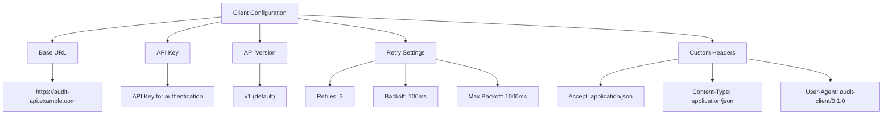
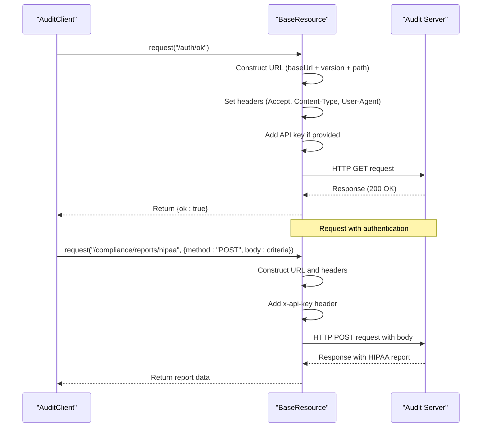
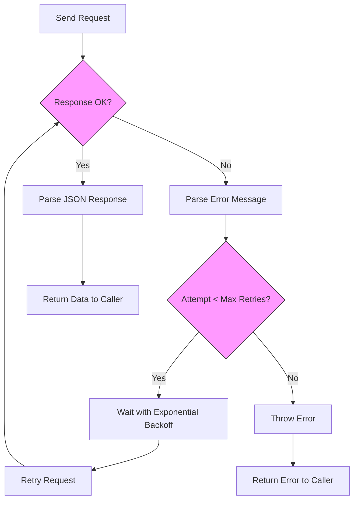
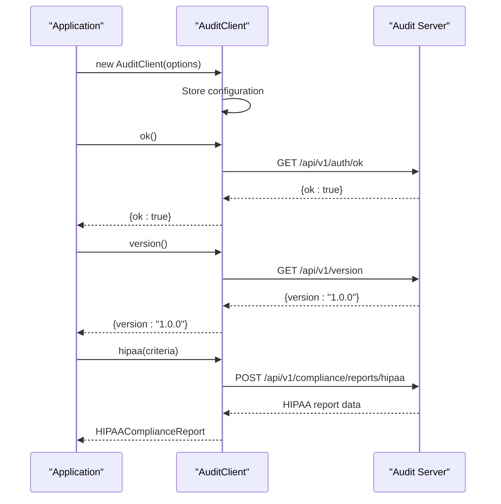
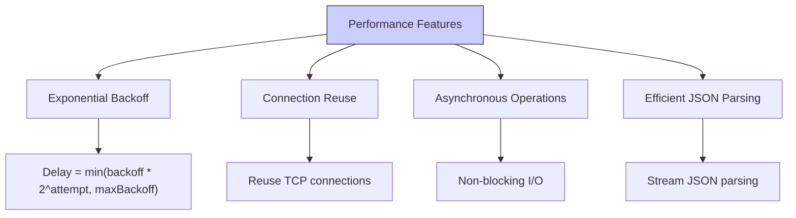
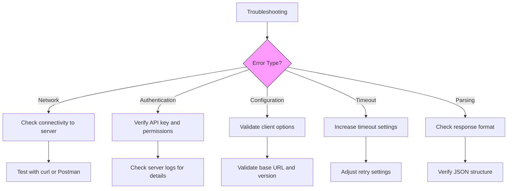

# Audit Client

<cite>
**Referenced Files in This Document**   
- [client.ts](file://packages/audit-client/src/client.ts)
- [base.ts](file://packages/audit-client/src/base.ts)
- [types.ts](file://packages/audit-client/src/types.ts)
- [index.ts](file://packages/audit-client/src/index.ts)
- [compliance-reporting.ts](file://packages/audit/src/report/compliance-reporting.ts)
</cite>

## Table of Contents
1. [Introduction](#introduction)
2. [Core Components](#core-components)
3. [Configuration Options](#configuration-options)
4. [Request Construction and Authentication](#request-construction-and-authentication)
5. [Response Parsing and Error Handling](#response-parsing-and-error-handling)
6. [Usage Patterns](#usage-patterns)
7. [Performance Considerations](#performance-considerations)
8. [Troubleshooting Guide](#troubleshooting-guide)

## Introduction
The Audit Client is a lightweight HTTP client designed to communicate with the audit server API, providing a simple interface for submitting audit events and retrieving compliance reports. As part of the SMEDREC audit ecosystem, it serves as the primary interface between applications and the audit server, abstracting away the complexities of HTTP communication, authentication, and error handling.

The client is implemented as a TypeScript package (`@repo/audit-client`) that can be easily integrated into various applications within the repository. It follows a modular design pattern, extending a base resource class that handles the core HTTP functionality while providing specific methods for audit-related operations. The client's primary role is to facilitate secure and reliable communication with the audit server, ensuring that audit events are properly recorded and compliance reports can be generated on demand.

This documentation provides a comprehensive overview of the Audit Client's implementation, configuration, and usage patterns, with detailed examples and troubleshooting guidance to help developers effectively integrate it into their applications.

## Core Components

The Audit Client consists of several core components that work together to provide a robust interface for communicating with the audit server API. The main class, `AuditClient`, extends the `BaseResource` class and provides specific methods for audit operations, while the `BaseResource` class handles the underlying HTTP request logic, including retries and error handling.

The client's architecture follows a clean separation of concerns, with distinct components for configuration, request handling, and response processing. This design allows for easy maintenance and extension of the client's functionality while maintaining a simple public API for consumers.

```mermaid
classDiagram
class AuditClient {
+constructor(options : ClientOptions)
+ok() : Promise<{ok : boolean}>
+version() : Promise<VersionResponse>
+hipaa(criteria : ReportCriteria) : Promise<HIPAAComplianceReport>
}
class BaseResource {
+options : ClientOptions
+request<T>(path : string, options : RequestOptions) : Promise<T>
}
AuditClient --> BaseResource : "extends"
```

**Diagram sources**
- [client.ts](file://packages/audit-client/src/client.ts#L1-L38)
- [base.ts](file://packages/audit-client/src/base.ts#L1-L88)

**Section sources**
- [client.ts](file://packages/audit-client/src/client.ts#L1-L38)
- [base.ts](file://packages/audit-client/src/base.ts#L1-L88)

## Configuration Options

The Audit Client provides several configuration options that allow developers to customize its behavior according to their specific requirements. These options are defined in the `ClientOptions` interface and can be passed to the client's constructor when creating a new instance.

The configuration options include settings for the base URL, API version, authentication, retry policies, and custom headers. This flexibility enables the client to be used in various environments and scenarios, from development to production.



**Diagram sources**
- [types.ts](file://packages/audit-client/src/types.ts#L1-L48)

**Section sources**
- [types.ts](file://packages/audit-client/src/types.ts#L1-L48)

## Request Construction and Authentication

The Audit Client handles request construction and authentication through its `BaseResource` class, which provides a centralized implementation for HTTP communication. When a request is made, the client constructs the appropriate URL by combining the base URL, API version, and endpoint path, then adds the necessary headers and authentication information.

Authentication is handled by including an API key in the request headers when provided in the client configuration. The client also includes standard headers such as Accept, Content-Type, and User-Agent to ensure proper communication with the server.



**Diagram sources**
- [base.ts](file://packages/audit-client/src/base.ts#L1-L88)
- [client.ts](file://packages/audit-client/src/client.ts#L1-L38)

**Section sources**
- [base.ts](file://packages/audit-client/src/base.ts#L1-L88)

## Response Parsing and Error Handling

The Audit Client implements robust response parsing and error handling mechanisms to ensure reliable communication with the audit server. The `request` method in the `BaseResource` class handles both successful responses and errors, with built-in retry logic for transient failures.

When a response is received, the client first checks if it was successful (status code 200-299). If the response is successful, the JSON data is parsed and returned to the caller. If the response indicates an error, the client attempts to parse the error message and throws an appropriate error.

For network errors or other exceptions, the client implements exponential backoff with retries, allowing it to recover from temporary connectivity issues. This resilience feature is critical for maintaining audit integrity in production environments where network conditions may vary.



**Diagram sources**
- [base.ts](file://packages/audit-client/src/base.ts#L1-L88)

**Section sources**
- [base.ts](file://packages/audit-client/src/base.ts#L1-L88)

## Usage Patterns

The Audit Client supports several usage patterns for different types of audit operations. The most common patterns include health checks, version retrieval, and compliance reporting. These patterns are implemented as methods on the `AuditClient` class, providing a simple and intuitive API for developers.

For health checks, the `ok()` method can be used to verify that the audit API is working correctly. This is useful for startup checks and monitoring. The `version()` method retrieves the API version, which can be helpful for compatibility checking. The `hipaa()` method generates HIPAA compliance reports based on specified criteria, demonstrating the client's support for specialized compliance operations.



**Diagram sources**
- [client.ts](file://packages/audit-client/src/client.ts#L1-L38)
- [base.ts](file://packages/audit-client/src/base.ts#L1-L88)

**Section sources**
- [client.ts](file://packages/audit-client/src/client.ts#L1-L38)

## Performance Considerations

The Audit Client is designed with performance in mind, implementing several strategies to optimize communication with the audit server. The most significant performance feature is the built-in retry mechanism with exponential backoff, which helps maintain reliability during periods of network instability without overwhelming the server with rapid retry requests.

The client also supports connection pooling indirectly through the underlying fetch implementation, allowing multiple requests to reuse the same TCP connection when possible. This reduces the overhead of establishing new connections for each request, improving overall performance.

For applications with high audit volume, the client's lightweight design and efficient request handling minimize the performance impact on the main application. The asynchronous nature of all client methods ensures that audit operations do not block the main execution thread, allowing applications to continue processing while audit events are being submitted.



**Diagram sources**
- [base.ts](file://packages/audit-client/src/base.ts#L1-L88)

**Section sources**
- [base.ts](file://packages/audit-client/src/base.ts#L1-L88)

## Troubleshooting Guide

When encountering issues with the Audit Client, several common problems and their solutions should be considered. The most frequent issues relate to network connectivity, authentication, and configuration errors.

For network issues, verify that the base URL is correct and that the audit server is reachable from the client environment. Check firewall rules and network security groups to ensure that outbound connections to the audit server are permitted. The client's retry mechanism can help mitigate temporary network issues, but persistent connectivity problems require network-level investigation.

Authentication failures typically occur when the API key is missing, incorrect, or has insufficient permissions. Verify that the API key is correctly configured in the client options and that it has the necessary permissions to perform the requested operations. Check the server logs for authentication error details, which can provide specific information about the nature of the failure.

Configuration errors can be identified by reviewing the client options and ensuring that all required fields are properly set. The most critical configuration options are the base URL and API key, which must be correctly specified for the client to function properly.



**Diagram sources**
- [base.ts](file://packages/audit-client/src/base.ts#L1-L88)
- [client.ts](file://packages/audit-client/src/client.ts#L1-L38)

**Section sources**
- [base.ts](file://packages/audit-client/src/base.ts#L1-L88)
- [client.ts](file://packages/audit-client/src/client.ts#L1-L38)