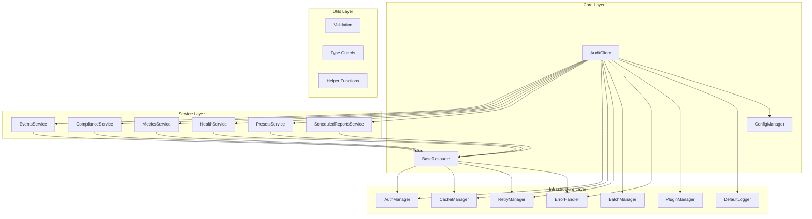
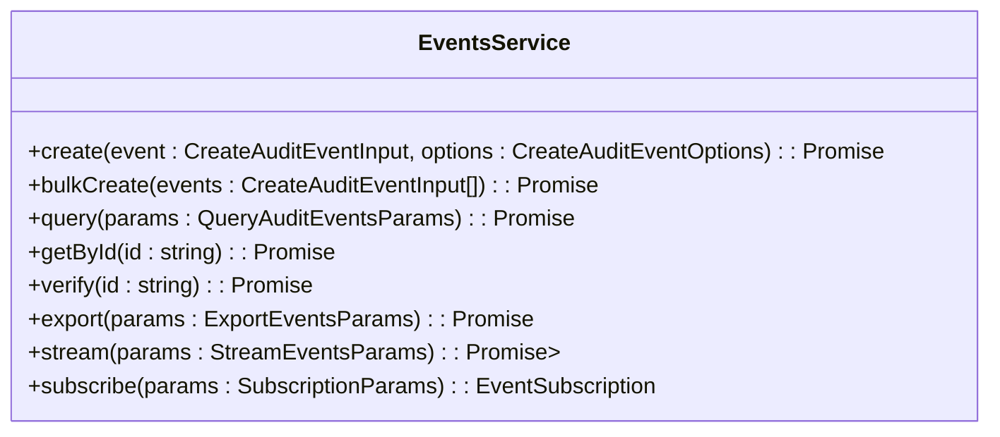
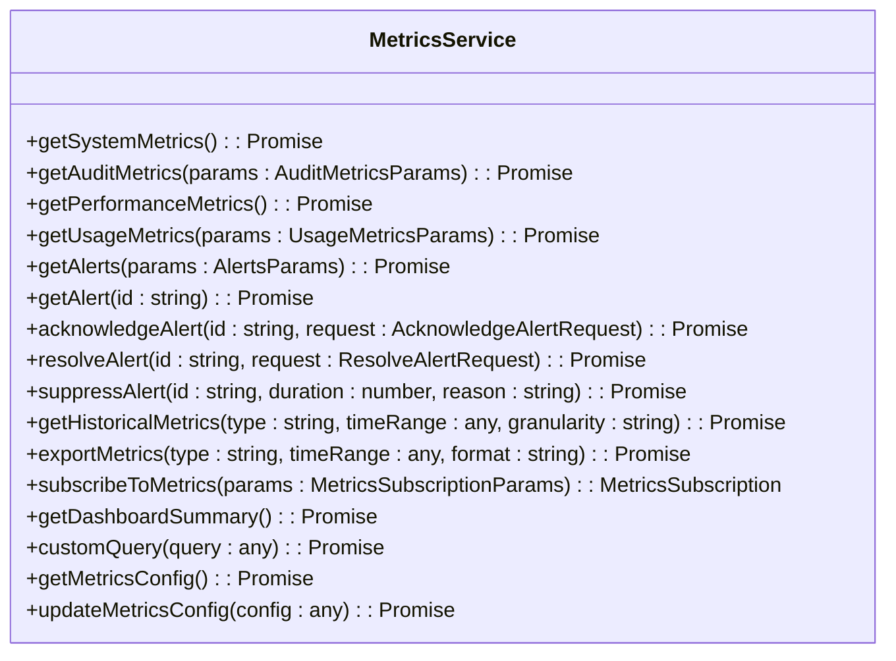
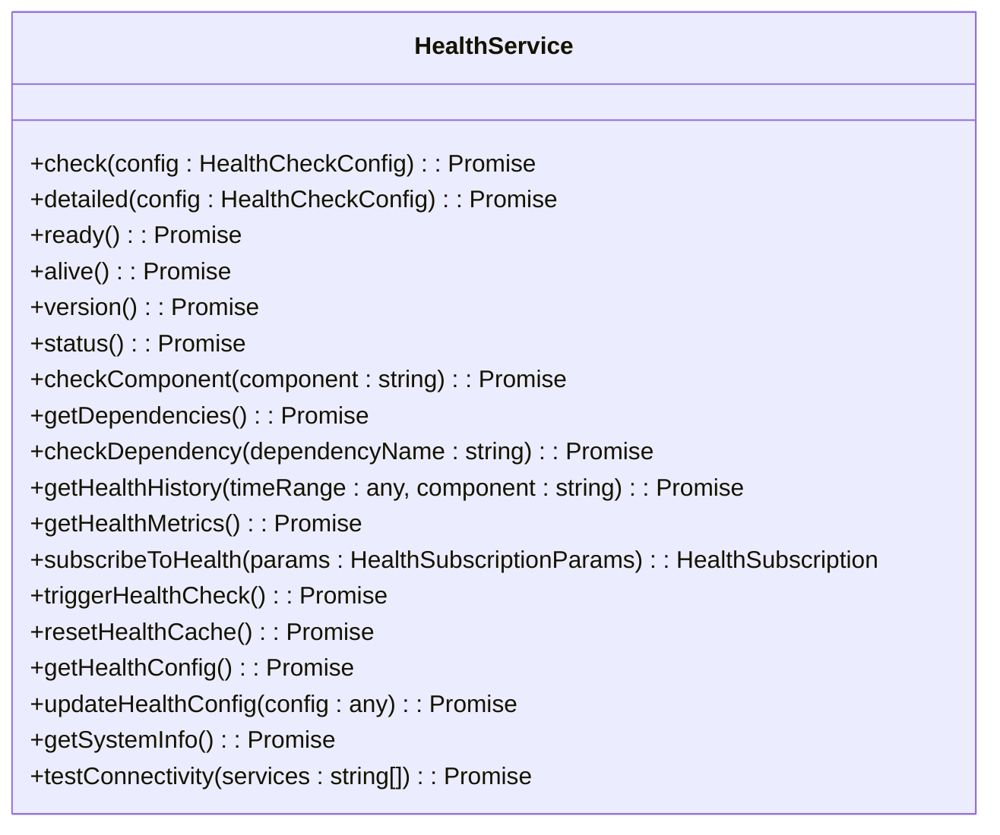
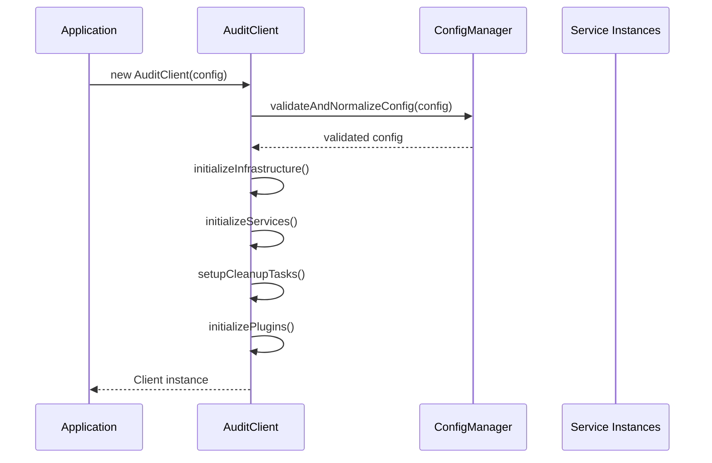
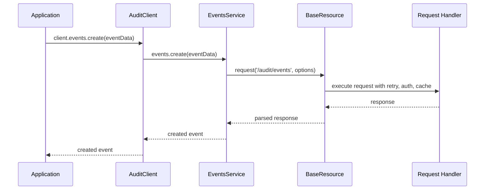
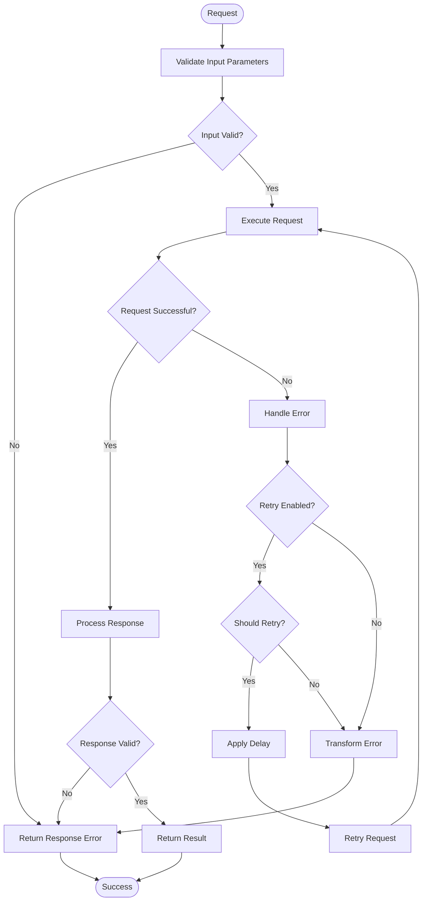

# Audit Client

<cite>
**Referenced Files in This Document**   
- [README.md](file://packages/audit-client/README.md)
- [client.ts](file://packages/audit-client/src/core/client.ts)
- [config.ts](file://packages/audit-client/src/core/config.ts)
- [events.ts](file://packages/audit-client/src/services/events.ts)
- [compliance.ts](file://packages/audit-client/src/services/compliance.ts)
- [metrics.ts](file://packages/audit-client/src/services/metrics.ts)
- [health.ts](file://packages/audit-client/src/services/health.ts)
- [presets.ts](file://packages/audit-client/src/services/presets.ts)
- [scheduled-reports.ts](file://packages/audit-client/src/services/scheduled-reports.ts)
</cite>

## Table of Contents
1. [Introduction](#introduction)
2. [Architecture Overview](#architecture-overview)
3. [Core Components](#core-components)
4. [API Interfaces](#api-interfaces)
5. [Configuration Options](#configuration-options)
6. [Usage Patterns](#usage-patterns)
7. [Integration with Core Audit System](#integration-with-core-audit-system)
8. [Examples](#examples)
9. [Troubleshooting Guide](#troubleshooting-guide)
10. [Conclusion](#conclusion)

## Introduction
The Audit Client is a comprehensive TypeScript SDK designed for interacting with the Smart Logs Audit API. It provides a robust set of features including type safety, retry mechanisms, intelligent caching, authentication support, request batching, comprehensive error handling, performance optimization, observability, and a flexible plugin architecture. The client is structured into a modular architecture with distinct layers for core functionality, services, infrastructure, and utilities, enabling developers to efficiently manage audit events, compliance reporting, system metrics, health monitoring, and scheduled reports.

**Section sources**
- [README.md](file://packages/audit-client/README.md#L1-L213)

## Architecture Overview
The Audit Client follows a modular architecture with four main layers: Core, Service, Infrastructure, and Utils. The Core layer contains the main client class and configuration management. The Service layer provides domain-specific functionality through specialized services. The Infrastructure layer handles cross-cutting concerns like authentication, caching, and retry logic. The Utils layer contains helper functions and validation utilities.



**Diagram sources**
- [client.ts](file://packages/audit-client/src/core/client.ts#L1-L825)
- [config.ts](file://packages/audit-client/src/core/config.ts#L1-L530)

## Core Components
The Audit Client consists of several core components that work together to provide a comprehensive audit management solution. The main entry point is the AuditClient class, which orchestrates all services and manages configuration. The ConfigManager handles configuration validation and normalization using Zod schemas. The BaseResource class provides common functionality for all services, including request handling and error management. The client also includes specialized services for events, compliance, metrics, health, presets, and scheduled reports, each providing domain-specific functionality.

**Section sources**
- [client.ts](file://packages/audit-client/src/core/client.ts#L1-L825)
- [config.ts](file://packages/audit-client/src/core/config.ts#L1-L530)

## API Interfaces
The Audit Client provides a comprehensive set of API interfaces through its various services. These interfaces enable developers to interact with the audit system in a type-safe and efficient manner.

### Events Service
The EventsService provides methods for creating, querying, and managing audit events.



**Diagram sources**
- [events.ts](file://packages/audit-client/src/services/events.ts#L1-L799)

### Compliance Service
The ComplianceService provides methods for generating compliance reports and managing GDPR data exports.

```mermaid
classDiagram
class ComplianceService {
+generateHipaaReport(criteria : ReportCriteria) : Promise<HIPAAReport>
+generateGdprReport(criteria : ReportCriteria) : Promise<GDPRReport>
+generateCustomReport(params : CustomReportParams) : Promise<CustomReport>
+exportGdprData(params : GdprExportParams) : Promise<GdprExportResult>
+pseudonymizeData(params : PseudonymizationParams) : Promise<PseudonymizationResult>
+getReportTemplates() : Promise<ReportTemplate[]>
+getReportTemplate(templateId : string) : Promise<ReportTemplate | null>
+createReportTemplate(template : Omit<ReportTemplate, 'id' | 'createdAt' | 'updatedAt'>) : Promise<ReportTemplate>
+updateReportTemplate(templateId : string, updates : Partial<ReportTemplate>) : Promise<ReportTemplate>
+deleteReportTemplate(templateId : string) : Promise<void>
+downloadReport(reportId : string, options : ReportDownloadOptions) : Promise<Blob>
+getReportStatus(reportId : string) : Promise<{id : string, status : string, progress : number}>
+cancelReport(reportId : string) : Promise<void>
+streamReport(reportId : string, format : 'json' | 'csv') : Promise<ReadableStream>
+getReportHistory(organizationId : string, params : any) : Promise<any>
}
```

**Diagram sources**
- [compliance.ts](file://packages/audit-client/src/services/compliance.ts#L1-L718)

### Metrics Service
The MetricsService provides methods for retrieving system metrics and managing alerts.



**Diagram sources**
- [metrics.ts](file://packages/audit-client/src/services/metrics.ts#L1-L903)

### Health Service
The HealthService provides methods for checking system health and monitoring service status.



**Diagram sources**
- [health.ts](file://packages/audit-client/src/services/health.ts#L1-L737)

### Presets Service
The PresetsService provides methods for managing audit configuration templates.

```mermaid
classDiagram
class PresetsService {
+list(params : ListAuditPresetsParams) : Promise<PaginatedAuditPresets>
+get(name : string, includeMetadata : boolean) : Promise<AuditPreset | null>
+create(preset : CreateAuditPresetInput) : Promise<AuditPreset>
+update(name : string, updates : UpdateAuditPresetInput) : Promise<AuditPreset>
+delete(name : string, force : boolean) : Promise<void>
+validate(name : string, context : PresetContext) : Promise<ValidationResult>
+apply(name : string, context : PresetContext) : Promise<PresetApplicationResult>
+getVersionHistory(name : string, limit : number) : Promise<PresetVersionHistory>
+getVersion(name : string, version : string) : Promise<PresetVersion | null>
+restoreVersion(name : string, version : string) : Promise<AuditPreset>
+getUsageStats(name : string, period : string, limit : number) : Promise<PresetUsageStats>
+duplicate(sourceName : string, targetName : string, updates : Partial<CreateAuditPresetInput>) : Promise<AuditPreset>
+export(names : string[], format : 'json' | 'yaml', includeVersionHistory : boolean) : Promise<string>
+import(data : string, format : 'json' | 'yaml', overwrite : boolean) : Promise<{imported : string[], skipped : string[], errors : Array<{name : string, error : string}>}>
}
```

**Diagram sources**
- [presets.ts](file://packages/audit-client/src/services/presets.ts#L1-L752)

### Scheduled Reports Service
The ScheduledReportsService provides methods for managing scheduled reports.

```mermaid
classDiagram
class ScheduledReportsService {
+list(params : ListScheduledReportsParams) : Promise<PaginatedScheduledReports>
+get(id : string) : Promise<ScheduledReport | null>
+create(report : CreateScheduledReportInput) : Promise<ScheduledReport>
+update(id : string, updates : UpdateScheduledReportInput) : Promise<ScheduledReport>
+delete(id : string) : Promise<void>
+execute(id : string) : Promise<ReportExecution>
+getExecutionHistory(id : string, params : ExecutionHistoryParams) : Promise<PaginatedExecutions>
+getExecutionStatus(reportId : string, executionId : string) : Promise<ReportExecution>
+cancelExecution(reportId : string, executionId : string) : Promise<void>
+downloadExecution(reportId : string, executionId : string, format : 'json' | 'csv' | 'pdf' | 'xlsx') : Promise<Blob>
+enable(id : string) : Promise<ScheduledReport>
+disable(id : string) : Promise<ScheduledReport>
+getUpcomingExecutions(organizationId : string, limit : number) : Promise<Array<{reportId : string, reportName : string, nextExecution : string, frequency : string}>>
}
```

**Diagram sources**
- [scheduled-reports.ts](file://packages/audit-client/src/services/scheduled-reports.ts#L1-L797)

## Configuration Options
The Audit Client supports comprehensive configuration options through the AuditClientConfig interface. Configuration can be provided during client initialization and updated at runtime. The configuration includes settings for connection, authentication, retry logic, caching, batching, performance optimization, logging, error handling, and plugins.

### Configuration Schema
The configuration is validated using Zod schemas to ensure type safety and correctness. The main configuration schema includes the following components:

```mermaid
classDiagram
class AuditClientConfig {
+baseUrl : string
+apiVersion : string
+timeout : number
+authentication : AuthenticationConfig
+retry : RetryConfig
+cache : CacheConfig
+batching : BatchingConfig
+performance : PerformanceConfig
+logging : LoggingConfig
+errorHandling : ErrorHandlingConfig
+plugins : PluginConfig
+environment : 'development' | 'staging' | 'production'
+customHeaders : Record<string, string>
+interceptors : InterceptorConfig
}
class AuthenticationConfig {
+type : 'apiKey' | 'session' | 'bearer' | 'custom'
+apiKey : string
+sessionToken : string
+bearerToken : string
+customHeaders : Record<string, string>
+autoRefresh : boolean
+refreshEndpoint : string
}
class RetryConfig {
+enabled : boolean
+maxAttempts : number
+initialDelayMs : number
+maxDelayMs : number
+backoffMultiplier : number
+retryableStatusCodes : number[]
+retryableErrors : string[]
}
class CacheConfig {
+enabled : boolean
+defaultTtlMs : number
+maxSize : number
+storage : 'memory' | 'localStorage' | 'sessionStorage' | 'custom'
+customStorage : any
+keyPrefix : string
+compressionEnabled : boolean
}
class BatchingConfig {
+enabled : boolean
+maxBatchSize : number
+batchTimeoutMs : number
+batchableEndpoints : string[]
}
class PerformanceConfig {
+enableCompression : boolean
+enableStreaming : boolean
+maxConcurrentRequests : number
+requestDeduplication : boolean
+responseTransformation : boolean
}
class LoggingConfig {
+enabled : boolean
+level : 'debug' | 'info' | 'warn' | 'error'
+format : 'json' | 'text' | 'structured'
+includeRequestBody : boolean
+includeResponseBody : boolean
+maskSensitiveData : boolean
+sensitiveFields : string[]
+maxLogSize : number
+enableConsole : boolean
+enableBuffer : boolean
+bufferSize : number
+component : string
+customLogger : any
}
class ErrorHandlingConfig {
+throwOnError : boolean
+includeStackTrace : boolean
+transformErrors : boolean
+sanitizeErrors : boolean
+enableRecovery : boolean
+customErrorHandler : any
}
class PluginConfig {
+enabled : boolean
+autoLoad : boolean
+plugins : Array<{name : string, type : 'middleware' | 'storage' | 'auth', enabled : boolean, config : any, priority : number}>
+middleware : {enabled : boolean, plugins : string[]}
+storage : {enabled : boolean, defaultPlugin : string, plugins : Record<string, any>}
+auth : {enabled : boolean, defaultPlugin : string, plugins : Record<string, any>}
}
AuditClientConfig --> AuthenticationConfig
AuditClientConfig --> RetryConfig
AuditClientConfig --> CacheConfig
AuditClientConfig --> BatchingConfig
AuditClientConfig --> PerformanceConfig
AuditClientConfig --> LoggingConfig
AuditClientConfig --> ErrorHandlingConfig
AuditClientConfig --> PluginConfig
```

**Diagram sources**
- [config.ts](file://packages/audit-client/src/core/config.ts#L1-L530)

### Environment-Specific Configuration
The client supports environment-specific configuration through the ConfigManager class. Default configurations are provided for development, staging, and production environments, with appropriate settings for logging, error handling, and performance optimization.

**Section sources**
- [config.ts](file://packages/audit-client/src/core/config.ts#L1-L530)

## Usage Patterns
The Audit Client follows several key usage patterns to ensure efficient and reliable interaction with the audit system.

### Client Initialization
The client is initialized with a configuration object that specifies connection settings, authentication, and other options.



**Diagram sources**
- [client.ts](file://packages/audit-client/src/core/client.ts#L1-L825)

### Service Usage
Each service is accessed through the client instance, providing a clean and intuitive API.



**Diagram sources**
- [client.ts](file://packages/audit-client/src/core/client.ts#L1-L825)
- [events.ts](file://packages/audit-client/src/services/events.ts#L1-L799)

### Error Handling
The client provides comprehensive error handling through the ErrorHandler class, with options for retry, recovery, and custom error handling.



**Diagram sources**
- [client.ts](file://packages/audit-client/src/core/client.ts#L1-L825)
- [config.ts](file://packages/audit-client/src/core/config.ts#L1-L530)

## Integration with Core Audit System
The Audit Client integrates with the core audit system through a REST API, providing a type-safe and efficient interface for all audit operations.

### API Endpoints
The client maps its methods to specific API endpoints on the audit server.

| Service | Method | HTTP Method | Endpoint |
|--------|--------|------------|---------|
| Events | create | POST | /audit/events |
| Events | bulkCreate | POST | /audit/events/bulk |
| Events | query | GET | /audit/events |
| Events | getById | GET | /audit/events/{id} |
| Events | verify | POST | /audit/events/{id}/verify |
| Events | export | POST | /audit/events/export |
| Events | stream | GET | /audit/events/stream |
| Events | subscribe | GET | /audit/events/subscribe |
| Compliance | generateHipaaReport | POST | /compliance/reports/hipaa |
| Compliance | generateGdprReport | POST | /compliance/reports/gdpr |
| Compliance | generateCustomReport | POST | /compliance/reports/custom |
| Compliance | exportGdprData | POST | /compliance/gdpr/export |
| Compliance | pseudonymizeData | POST | /compliance/gdpr/pseudonymize |
| Compliance | getReportTemplates | GET | /compliance/templates |
| Compliance | getReportTemplate | GET | /compliance/templates/{id} |
| Compliance | createReportTemplate | POST | /compliance/templates |
| Compliance | updateReportTemplate | PUT | /compliance/templates/{id} |
| Compliance | deleteReportTemplate | DELETE | /compliance/templates/{id} |
| Compliance | downloadReport | GET | /compliance/reports/{id}/download |
| Compliance | getReportStatus | GET | /compliance/reports/{id}/status |
| Compliance | cancelReport | POST | /compliance/reports/{id}/cancel |
| Compliance | streamReport | GET | /compliance/reports/{id}/stream |
| Compliance | getReportHistory | GET | /compliance/reports/history/{id} |
| Metrics | getSystemMetrics | GET | /metrics/system |
| Metrics | getAuditMetrics | GET | /metrics/audit |
| Metrics | getPerformanceMetrics | GET | /metrics/performance |
| Metrics | getUsageMetrics | GET | /metrics/usage |
| Metrics | getAlerts | GET | /alerts |
| Metrics | getAlert | GET | /alerts/{id} |
| Metrics | acknowledgeAlert | POST | /alerts/{id}/acknowledge |
| Metrics | resolveAlert | POST | /alerts/{id}/resolve |
| Metrics | suppressAlert | POST | /alerts/{id}/suppress |
| Metrics | getHistoricalMetrics | GET | /metrics/{type}/historical |
| Metrics | exportMetrics | POST | /metrics/{type}/export |
| Metrics | getDashboardSummary | GET | /metrics/dashboard |
| Metrics | customQuery | POST | /metrics/query |
| Metrics | getMetricsConfig | GET | /metrics/config |
| Metrics | updateMetricsConfig | PUT | /metrics/config |
| Health | check | GET | /health |
| Health | detailed | GET | /health/detailed |
| Health | ready | GET | /health/ready |
| Health | alive | GET | /health/alive |
| Health | version | GET | /health/version |
| Health | status | GET | /health/status |
| Health | checkComponent | GET | /health/components/{component} |
| Health | getDependencies | GET | /health/dependencies |
| Health | checkDependency | GET | /health/dependencies/{name} |
| Health | getHealthHistory | GET | /health/history |
| Health | getHealthMetrics | GET | /health/metrics |
| Health | getHealthConfig | GET | /health/config |
| Health | updateHealthConfig | PUT | /health/config |
| Health | getSystemInfo | GET | /health/system |
| Health | testConnectivity | POST | /health/connectivity |
| Presets | list | GET | /audit-presets |
| Presets | get | GET | /audit-presets/{name} |
| Presets | create | POST | /audit-presets |
| Presets | update | PUT | /audit-presets/{name} |
| Presets | delete | DELETE | /audit-presets/{name} |
| Presets | validate | POST | /audit-presets/{name}/validate |
| Presets | apply | POST | /audit-presets/{name}/apply |
| Presets | getVersionHistory | GET | /audit-presets/{name}/versions |
| Presets | getVersion | GET | /audit-presets/{name}/versions/{version} |
| Presets | restoreVersion | POST | /audit-presets/{name}/versions/{version}/restore |
| Presets | getUsageStats | GET | /audit-presets/{name}/stats |
| Presets | duplicate | POST | /audit-presets/{name}/duplicate |
| Presets | export | POST | /audit-presets/export |
| Presets | import | POST | /audit-presets/import |
| ScheduledReports | list | GET | /scheduled-reports |
| ScheduledReports | get | GET | /scheduled-reports/{id} |
| ScheduledReports | create | POST | /scheduled-reports |
| ScheduledReports | update | PUT | /scheduled-reports/{id} |
| ScheduledReports | delete | DELETE | /scheduled-reports/{id} |
| ScheduledReports | execute | POST | /scheduled-reports/{id}/execute |
| ScheduledReports | getExecutionHistory | GET | /scheduled-reports/{id}/executions |
| ScheduledReports | getExecutionStatus | GET | /scheduled-reports/{id}/executions/{executionId} |
| ScheduledReports | cancelExecution | POST | /scheduled-reports/{id}/executions/{executionId}/cancel |
| ScheduledReports | downloadExecution | GET | /scheduled-reports/{id}/executions/{executionId}/download |
| ScheduledReports | enable | POST | /scheduled-reports/{id}/enable |
| ScheduledReports | disable | POST | /scheduled-reports/{id}/disable |
| ScheduledReports | getUpcomingExecutions | GET | /scheduled-reports/upcoming |

**Section sources**
- [events.ts](file://packages/audit-client/src/services/events.ts#L1-L799)
- [compliance.ts](file://packages/audit-client/src/services/compliance.ts#L1-L718)
- [metrics.ts](file://packages/audit-client/src/services/metrics.ts#L1-L903)
- [health.ts](file://packages/audit-client/src/services/health.ts#L1-L737)
- [presets.ts](file://packages/audit-client/src/services/presets.ts#L1-L752)
- [scheduled-reports.ts](file://packages/audit-client/src/services/scheduled-reports.ts#L1-L797)

## Examples
The Audit Client provides several examples demonstrating common usage patterns.

### Quick Start
```typescript
import { AuditClient } from '@smedrec/audit-client'

const client = new AuditClient({
	baseUrl: 'https://api.smartlogs.com',
	authentication: {
		type: 'apiKey',
		apiKey: 'your-api-key',
	},
})

// Create an audit event
const event = await client.events.create({
	action: 'user.login',
	principalId: 'user-123',
	organizationId: 'org-456',
	status: 'success',
})
```

**Section sources**
- [README.md](file://packages/audit-client/README.md#L1-L213)

### Configuration Example
```typescript
import { AuditClient } from '@smedrec/audit-client'

const config = {
	baseUrl: 'https://api.smartlogs.com',
	authentication: {
		type: 'apiKey',
		apiKey: 'your-api-key',
		autoRefresh: true,
	},
	retry: {
		enabled: true,
		maxAttempts: 3,
		initialDelayMs: 100,
		maxDelayMs: 5000,
		backoffMultiplier: 2,
	},
	cache: {
		enabled: true,
		defaultTtlMs: 300000, // 5 minutes
		storage: 'memory',
	},
	logging: {
		enabled: true,
		level: 'info',
		maskSensitiveData: true,
	},
}

const client = new AuditClient(config)
```

**Section sources**
- [README.md](file://packages/audit-client/README.md#L1-L213)

### Events Service Example
```typescript
// Create audit events
await client.events.create(eventData, options)
await client.events.bulkCreate([event1, event2])

// Query events
const events = await client.events.query({
	filter: { dateRange: { startDate: '2024-01-01', endDate: '2024-01-31' } },
})

// Verify event integrity
const verification = await client.events.verify(eventId)
```

**Section sources**
- [README.md](file://packages/audit-client/README.md#L1-L213)

### Compliance Service Example
```typescript
// Generate compliance reports
const hipaaReport = await client.compliance.generateHipaaReport(criteria)
const gdprReport = await client.compliance.generateGdprReport(criteria)

// GDPR data export
const exportResult = await client.compliance.exportGdprData(params)
```

**Section sources**
- [README.md](file://packages/audit-client/README.md#L1-L213)

### Metrics Service Example
```typescript
// Get system metrics
const systemMetrics = await client.metrics.getSystemMetrics()
const auditMetrics = await client.metrics.getAuditMetrics(params)

// Manage alerts
const alerts = await client.metrics.getAlerts()
await client.metrics.acknowledgeAlert(alertId)
```

**Section sources**
- [README.md](file://packages/audit-client/README.md#L1-L213)

## Troubleshooting Guide
This section provides guidance for troubleshooting common issues with the Audit Client.

### Configuration Errors
Configuration errors typically occur when invalid configuration options are provided. These errors are caught during client initialization and provide detailed validation messages.

**Common Issues:**
- Invalid URL format for baseUrl
- Invalid retry configuration values
- Invalid cache storage type
- Missing required authentication information

**Solution:**
Ensure all configuration options are valid and meet the requirements specified in the configuration schema.

**Section sources**
- [config.ts](file://packages/audit-client/src/core/config.ts#L1-L530)

### Authentication Issues
Authentication issues occur when the client cannot authenticate with the audit server.

**Common Issues:**
- Invalid API key, session token, or bearer token
- Token expiration
- Authentication endpoint failure

**Solution:**
Verify authentication credentials and ensure the authentication configuration is correct. Enable autoRefresh for tokens that expire.

**Section sources**
- [client.ts](file://packages/audit-client/src/core/client.ts#L1-L825)
- [config.ts](file://packages/audit-client/src/core/config.ts#L1-L530)

### Network and Connectivity Issues
Network issues occur when the client cannot connect to the audit server.

**Common Issues:**
- Server unreachable
- Timeout errors
- SSL/TLS handshake failures
- DNS resolution failures

**Solution:**
Verify the baseUrl is correct and accessible. Check network connectivity and firewall settings. Adjust timeout settings if needed.

**Section sources**
- [client.ts](file://packages/audit-client/src/core/client.ts#L1-L825)

### Rate Limiting
The audit server may enforce rate limits on API requests.

**Symptoms:**
- 429 status codes
- Request throttling
- Delayed responses

**Solution:**
Implement request batching to reduce the number of requests. Adjust retry configuration to handle rate limiting. Monitor usage metrics to stay within limits.

**Section sources**
- [client.ts](file://packages/audit-client/src/core/client.ts#L1-L825)
- [config.ts](file://packages/audit-client/src/core/config.ts#L1-L530)

### Performance Issues
Performance issues may occur with large datasets or high request volumes.

**Symptoms:**
- Slow response times
- High memory usage
- Request timeouts

**Solution:**
Enable request compression and streaming. Use pagination for large result sets. Implement caching for frequently accessed data. Monitor performance metrics to identify bottlenecks.

**Section sources**
- [client.ts](file://packages/audit-client/src/core/client.ts#L1-L825)
- [config.ts](file://packages/audit-client/src/core/config.ts#L1-L530)

## Conclusion
The Audit Client provides a comprehensive and robust solution for interacting with the Smart Logs Audit API. Its modular architecture, type safety, and extensive feature set make it an ideal choice for applications requiring audit functionality. The client's support for configuration, retry logic, caching, and observability ensures reliable and efficient operation in various environments. With its comprehensive API interfaces and clear usage patterns, the Audit Client simplifies the integration of audit capabilities into applications while maintaining high performance and reliability.