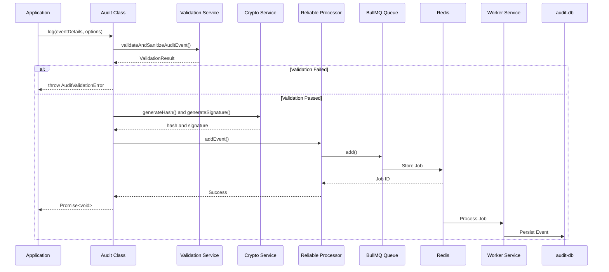
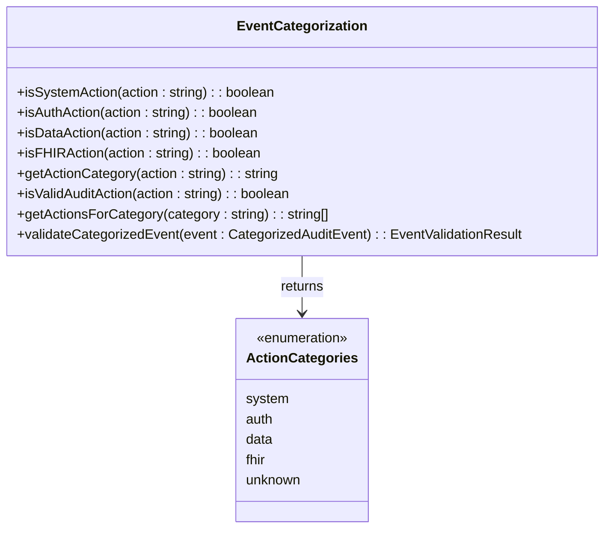
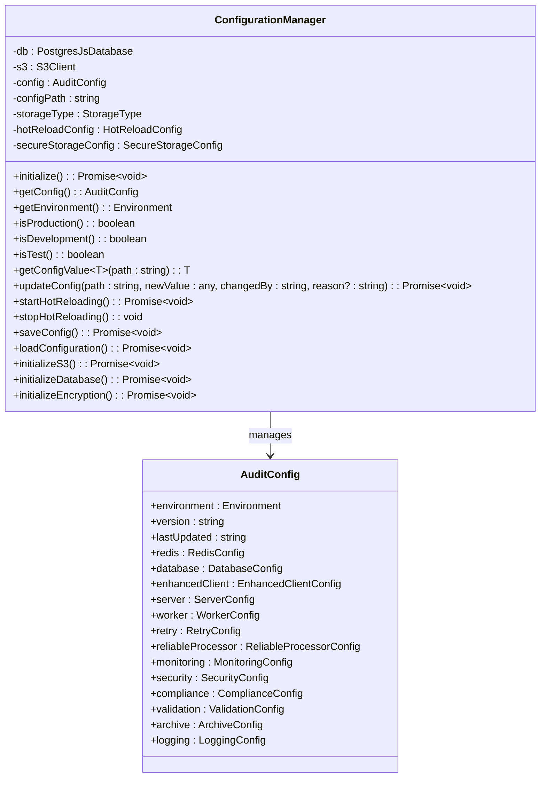
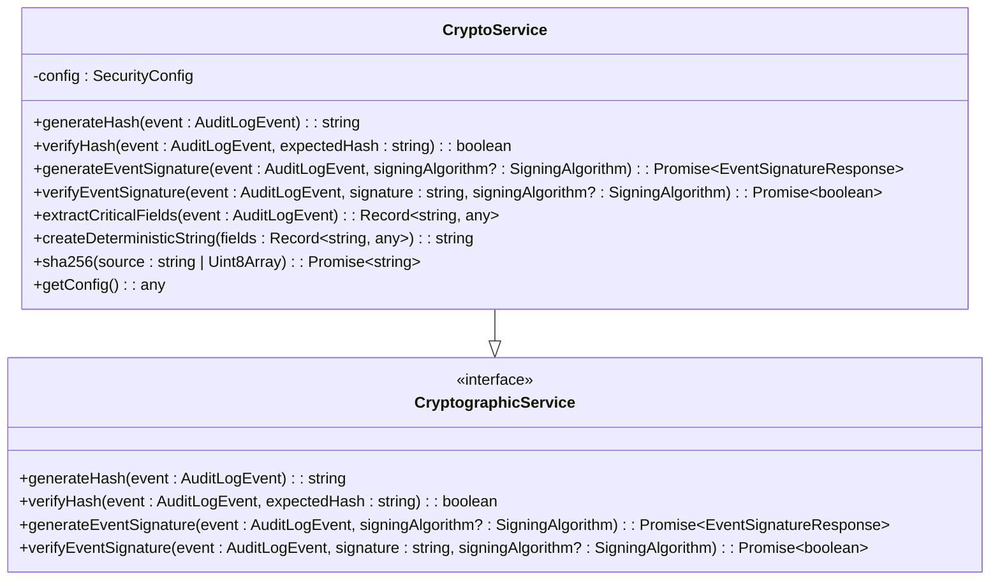
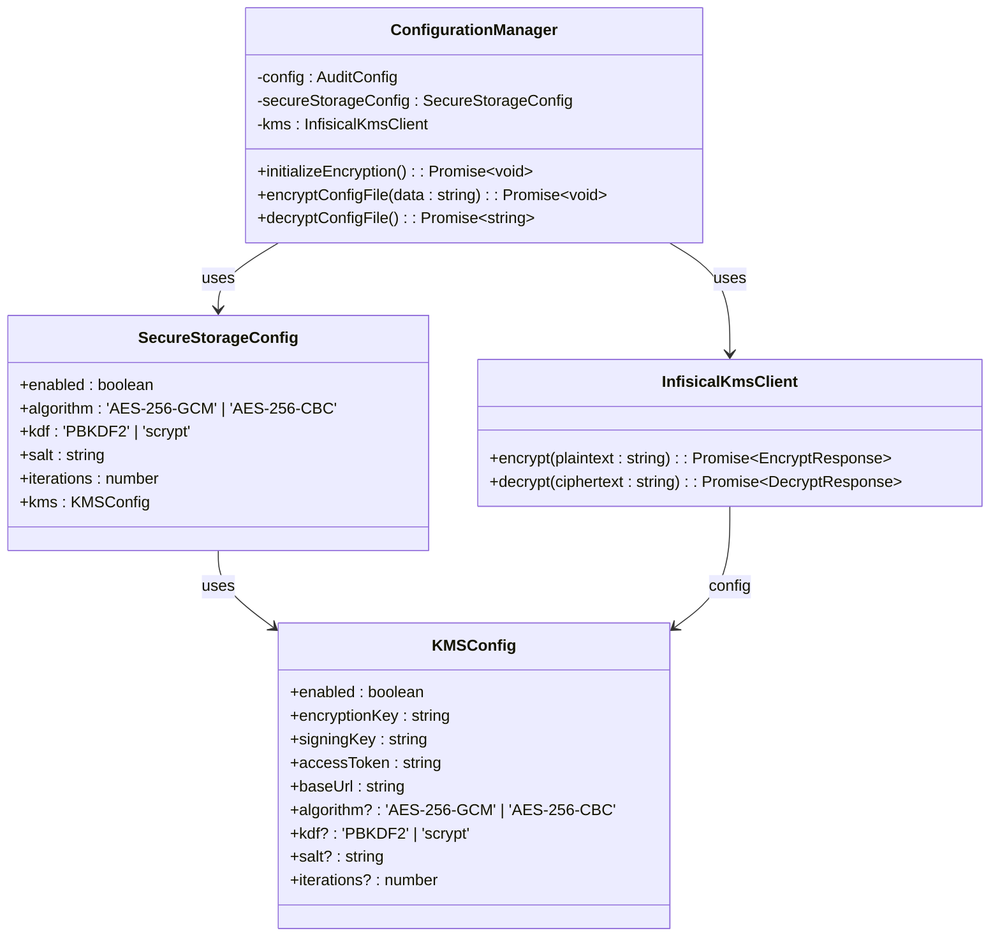
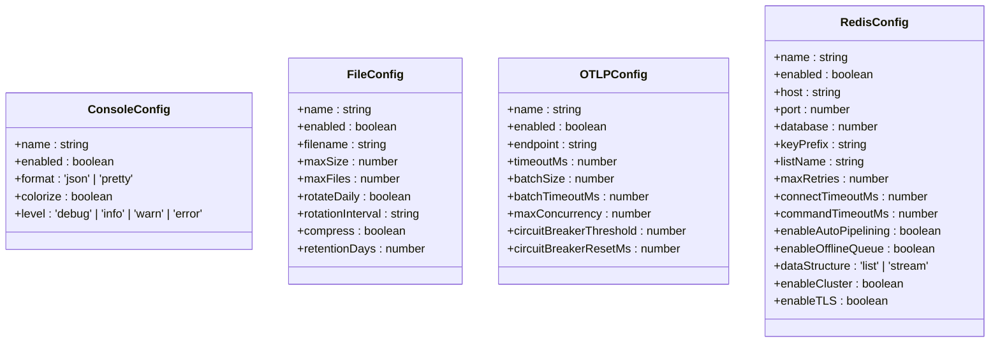
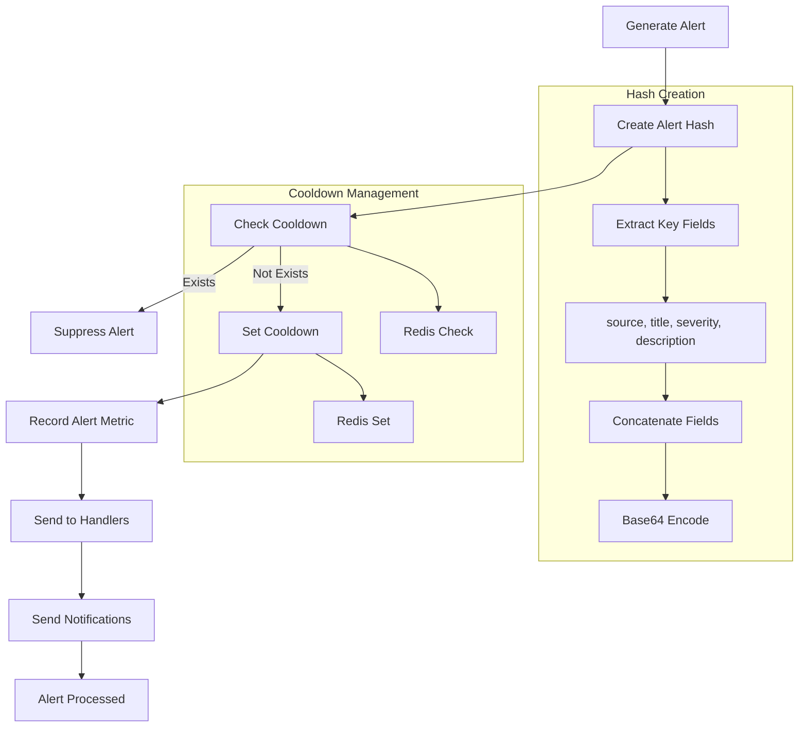

# Audit Core System

<cite>
**Referenced Files in This Document**   
- [audit.ts](file://packages\audit\src\audit.ts) - *Updated in recent commit*
- [types.ts](file://packages\audit\src\types.ts) - *Updated in recent commit*
- [crypto.ts](file://packages\audit\src\crypto.ts) - *Updated in recent commit*
- [config/types.ts](file://packages\audit\src\config\types.ts)
- [validation.ts](file://packages\audit\src\validation.ts)
- [config/manager.ts](file://packages\audit\src\config\manager.ts)
- [event/event-categorization.ts](file://packages\audit\src\event\event-categorization.ts)
- [event/event-types.ts](file://packages\audit\src\event\event-types.ts)
- [index.ts](file://packages\audit\src\index.ts)
- [audit.md](file://apps\docs\src\content\docs\audit\audit.md)
- [examples.md](file://apps\docs\src\content\docs\audit\examples.md)
- [api-reference.md](file://apps\docs\src\content\docs\audit\api-reference.md)
- [gdpr-compliance.ts](file://packages\audit\src\gdpr\gdpr-compliance.ts) - *Added in recent commit*
- [gdpr-utils.ts](file://packages\audit\src\gdpr\gdpr-utils.ts) - *Added in recent commit*
- [README.md](file://packages\audit\README.md) - *Updated with link to detailed documentation*
- [docs/README.md](file://packages\audit\docs\README.md) - *Updated with comprehensive documentation structure*
- [api-reference/audit-class.md](file://packages\audit\docs\api-reference\audit-class.md) - *Updated with detailed API reference*
- [api-reference/event-types.md](file://packages\audit\docs\api-reference\event-types.md) - *Updated with comprehensive event types*
- [observability/tracer.ts](file://packages\audit\src\observability\tracer.ts) - *Updated with OTLP exporter implementation*
- [config/types.ts](file://packages\audit\src\config\types.ts) - *Updated with KMS encryption options*
- [config/manager.ts](file://packages\audit\src\config\manager.ts) - *Updated with KMS integration*
- [infisical-kms/client.ts](file://packages\infisical-kms\src\client.ts) - *KMS client implementation*
- [preset/database-preset-handler.ts](file://packages\audit\src\preset\database-preset-handler.ts) - *Updated with optimized queries and organization priority*
- [lib/hono/init.ts](file://apps\server\src\lib\hono\init.ts) - *Updated with database preset handler and Sentry initialization*
- [index.ts](file://apps\server\src\index.ts) - *Updated with configuration manager initialization*
- [monitor/alerting.ts](file://packages\audit\src\monitor\alerting.ts) - *Refactored to new AlertingService class*
- [monitor/monitoring.ts](file://packages\audit\src\monitor\monitoring.ts) - *Updated to use AlertingService*
- [middleware/monitoring.ts](file://apps\server\src\lib\middleware\monitoring.ts) - *Updated alert method calls and hash content*
- [lib/logger.ts](file://packages\audit\src\lib\logger.ts) - *Refactored to use StructuredLogger*
- [core/audit-processor.ts](file://packages\audit\src\core\audit-processor.ts) - *Updated with new logging architecture*
- [services/event-service.ts](file://packages\audit\src\services\event-service.ts) - *Updated with new logging architecture*
- [structured-logger.ts](file://packages\logs\src\core\structured-logger.ts) - *New logging architecture implementation*
- [logger-factory.ts](file://packages\logs\src\core\logger-factory.ts) - *New logging factory implementation*
</cite>

## Update Summary
**Changes Made**   
- Replaced legacy LoggerFactory with StructuredLogger across audit packages
- Implemented new logging architecture with LogProcessor and enhanced transports
- Updated logging initialization and usage patterns in Audit class
- Enhanced error handling and performance monitoring in logging system
- Added support for multiple transport types (console, file, OTLP, Redis)
- Improved structured logging with better metadata collection and context management
- Updated source tracking system to reflect changes in logging implementation

**List of new sections added**
- Structured Logging Architecture
- Log Processor Implementation
- Transport Configuration

**List of deprecated/removed sections**
- Legacy LoggerFactory Implementation

**Source tracking system updates and new source files**
- Added annotations for new StructuredLogger implementation
- Updated section sources to reflect changes in logging architecture
- Added new sources for log processor and transport implementations
- Updated sources for Audit class to reflect new logging initialization
- Added sources for enhanced logging transports and configuration

## Table of Contents
1. [Introduction](#introduction)
2. [Core Components](#core-components)
3. [Audit Event Structure](#audit-event-structure)
4. [Event Ingestion Pipeline](#event-ingestion-pipeline)
5. [Validation and Sanitization](#validation-and-sanitization)
6. [Event Categorization](#event-categorization)
7. [Configuration Management](#configuration-management)
8. [Cryptographic Security](#cryptographic-security)
9. [Reliable Event Processing](#reliable-event-processing)
10. [Integration Patterns](#integration-patterns)
11. [Usage Examples](#usage-examples)
12. [Performance and Scalability](#performance-and-scalability)
13. [GDPR Compliance and Pseudonymization](#gdpr-compliance-and-pseudonymization)
14. [Plugin Architecture](#plugin-architecture)
15. [Observability and OTLP Exporter Configuration](#observability-and-otlp-exporter-configuration)
16. [KMS Encryption in Configuration Management](#kms-encryption-in-configuration-management)
17. [Structured Logging Architecture](#structured-logging-architecture)
18. [Log Processor Implementation](#log-processor-implementation)
19. [Transport Configuration](#transport-configuration)
20. [Database Preset Handler with Organization Priority](#database-preset-handler-with-organization-priority)
21. [Alerting Service Architecture](#alerting-service-architecture)
22. [Alert Deduplication Mechanism](#alert-deduplication-mechanism)
23. [Console Alert Handler](#console-alert-handler)

## Introduction

The Audit Core System serves as the central engine for audit event processing, validation, and routing within the SMEDREC platform. It provides a robust, secure, and reliable mechanism for capturing, validating, and persisting audit events across the system. The core functionality is implemented in the `@repo/audit` package, which offers cryptographic integrity verification, compliance validation, and guaranteed delivery through a sophisticated queuing system.

This documentation provides a comprehensive overview of the Audit Core System, detailing its architecture, implementation, and usage patterns. The system is designed with healthcare compliance in mind, supporting HIPAA and GDPR requirements while maintaining high performance and reliability.

**Section sources**
- [audit.md](file://apps\docs\src\content\docs\audit\audit.md)
- [docs/README.md](file://packages\audit\docs\README.md)

## Core Components

The Audit Core System consists of several interconnected components that work together to provide a comprehensive audit logging solution. The primary component is the `Audit` class, which serves as the main interface for logging audit events. This class orchestrates the validation, cryptographic security, and queuing of events through various supporting services.

The system architecture follows a modular design, with distinct components for configuration management, event validation, cryptographic operations, and reliable processing. This separation of concerns allows for flexible configuration and extensibility while maintaining a clean and maintainable codebase.

```mermaid
graph TD
A[Audit Class] --> B[Configuration Manager]
A --> C[Validation Service]
A --> D[Crypto Service]
A --> E[Reliable Processor]
A --> F[Event Categorization]
A --> G[Plugin System]
A --> H[GDPR Compliance]
A --> I[Observability Tracer]
A --> J[Structured Logger]
A --> K[Database Preset Handler]
A --> L[Alerting Service]
B --> M[File Storage]
B --> N[S3 Storage]
B --> O[KMS Encryption]
C --> P[Validation Rules]
D --> Q[SHA-256 Hashing]
D --> R[HMAC-SHA256 Signatures]
E --> S[BullMQ Queue]
E --> T[Redis]
E --> U[Circuit Breaker]
E --> V[Dead Letter Queue]
G --> W[Middleware Plugins]
G --> X[Storage Plugins]
G --> Y[Auth Plugins]
H --> Z[Data Pseudonymization]
H --> AA[Retention Policies]
H --> AB[Data Export]
I --> AC[OTLP Exporter]
I --> AD[Batch Processing]
I --> AE[Error Handling]
J --> AF[Performance Logging]
J --> AG[Error Tracking]
J --> AH[Metrics Collection]
K --> AI[Optimized Database Queries]
K --> AJ[Organization Priority]
L --> AK[Alert Handlers]
L --> AL[Metrics Collector]
L --> AM[Notification System]
```



**Diagram sources**
- [audit.ts](file://packages\audit\src\audit.ts)
- [config/manager.ts](file://packages\audit\src\config\manager.ts)
- [validation.ts](file://packages\audit\src\validation.ts)
- [crypto.ts](file://packages\audit\src\crypto.ts)
- [queue/reliable-processor.ts](file://packages\audit\src\queue\reliable-processor.ts)
- [gdpr/gdpr-compliance.ts](file://c:\Users\josea\Documents\WORK\smedrec\smart-los\packages\audit\src\gdpr\gdpr-compliance.ts)
- [observability/tracer.ts](file://packages\audit\src\observability\tracer.ts)
- [structured-logger.ts](file://packages\logs\src\core\structured-logger.ts)
- [logger-factory.ts](file://packages\logs\src\core\logger-factory.ts)
- [preset/database-preset-handler.ts](file://packages\audit\src\preset\database-preset-handler.ts)
- [monitor/alerting.ts](file://packages\audit\src\monitor\alerting.ts)
- [monitor/monitoring.ts](file://packages\audit\src\monitor\monitoring.ts)

**Section sources**
- [audit.ts](file://packages\audit\src\audit.ts)
- [index.ts](file://packages\audit\src\index.ts)

## Audit Event Structure

The `AuditLogEvent` interface defines the structure of audit events within the system. This standardized format ensures consistency across all logged events and facilitates processing, analysis, and reporting.

```typescript
interface AuditLogEvent {
	timestamp: string
	action: string
	status: AuditEventStatus
	principalId?: string
	organizationId?: string
	targetResourceType?: string
	targetResourceId?: string
	outcomeDescription?: string
	hash?: string
	hashAlgorithm?: 'SHA-256'
	signature?: string
	algorithm?:
		| 'HMAC-SHA256'
		| 'RSASSA_PSS_SHA_256'
		| 'RSASSA_PSS_SHA_384'
		| 'RSASSA_PSS_SHA_512'
		| 'RSASSA_PKCS1_V1_5_SHA_256'
		| 'RSASSA_PKCS1_V1_5_SHA_384'
		| 'RSASSA_PKCS1_V1_5_SHA_512'
	eventVersion?: string
	correlationId?: string
	sessionContext?: SessionContext
	dataClassification?: DataClassification
	retentionPolicy?: string
	processingLatency?: number
	queueDepth?: number
	[key: string]: any
}
```

The event structure includes both mandatory and optional fields. The mandatory fields (`timestamp`, `action`, `status`) ensure that every event contains essential information about when it occurred, what action was performed, and the outcome of that action. Optional fields provide additional context, such as the principal responsible for the action, the target resource affected, and session information.

Data classification is a critical aspect of the event structure, with predefined levels including 'PUBLIC', 'INTERNAL', 'CONFIDENTIAL', and 'PHI' (Protected Health Information). This classification enables appropriate handling and retention policies based on the sensitivity of the information.

**Section sources**
- [types.ts](file://packages\audit\src\types.ts)
- [api-reference/event-types.md](file://packages\audit\docs\api-reference\event-types.md)

## Event Ingestion Pipeline

The event ingestion pipeline is the core workflow that processes audit events from creation to persistence. This pipeline ensures that events are properly validated, secured, and routed to the appropriate processing system.



**Diagram sources**
- [audit.ts](file://packages\audit\src\audit.ts)
- [validation.ts](file://packages\audit\src\validation.ts)
- [crypto.ts](file://packages\audit\src\crypto.ts)
- [queue/reliable-processor.ts](file://packages\audit\src\queue\reliable-processor.ts)

**Section sources**
- [audit.ts](file://packages\audit\src\audit.ts)

## Validation and Sanitization

The validation system ensures that audit events conform to the expected schema and contain valid data. The `validateAndSanitizeAuditEvent` function performs comprehensive validation based on configurable rules defined in the `ValidationConfig` interface.


**Diagram sources**
- [validation.ts](file://packages\audit\src\validation.ts)

The validation process checks several aspects of the audit event:

- **Required fields**: Ensures that mandatory fields like `timestamp`, `action`, and `status` are present
- **Field types and formats**: Validates that fields contain data of the correct type and format (e.g., ISO 8601 timestamp)
- **Value constraints**: Checks that values fall within acceptable ranges or are part of predefined sets
- **String length**: Enforces maximum string lengths to prevent abuse
- **Data classification**: Validates that the data classification is one of the allowed values

The default validation configuration includes rules such as a maximum string length of 10,000 characters, allowed data classifications, required fields, maximum custom field depth of 3, and allowed event versions.

**Section sources**
- [validation.ts](file://packages\audit\src\validation.ts)
- [config/types.ts](file://packages\audit\src\config\types.ts)

## Event Categorization

The event categorization system classifies audit events based on their action type, enabling targeted processing and analysis. The categorization is implemented through type guards and category determination functions in the `event-categorization.ts` file.



**Diagram sources**
- [event/event-categorization.ts](file://packages\audit\src\event\event-categorization.ts)

The system defines several action categories:

- **System**: Events related to system operations (e.g., 'system.startup', 'system.shutdown')
- **Auth**: Authentication and authorization events (e.g., 'auth.login.success', 'auth.logout')
- **Data**: Data operations (e.g., 'data.read', 'data.create')
- **FHIR**: FHIR-specific operations (e.g., 'fhir.patient.read', 'fhir.observation.create')

The categorization process uses predefined lists of valid actions for each category and provides functions to validate that an action belongs to a specific category. This enables category-specific validation rules and processing logic.

The `validateCategorizedEvent` function performs category-specific validation and returns warnings for missing recommended fields:

- **System events**: Warns about missing systemComponent, configurationChanges, maintenanceDetails, or backupDetails
- **Authentication events**: Warns about missing principalId, failureReason, sessionContext, or mfaDetails
- **Data events**: Warns about incomplete target resource information, missing export format, or share recipient
- **FHIR events**: Warns about incomplete FHIR resource information, missing patientId, or practitionerId

The system also provides factory functions in `event-types.ts` for creating properly structured events with recommended defaults, including automatic timestamp generation and appropriate data classification defaults (e.g., PHI for FHIR events).

**Section sources**
- [event/event-categorization.ts](file://packages\audit\src\event\event-categorization.ts)
- [event/event-types.ts](file://packages\audit\src\event\event-types.ts)
- [types.ts](file://packages\audit\src\types.ts)

## Configuration Management

The configuration system provides a flexible and secure way to manage audit system settings across different environments. The `ConfigurationManager` class handles configuration loading, validation, and hot-reloading.



**Diagram sources**
- [config/manager.ts](file://packages\audit\src\config\manager.ts)
- [config/types.ts](file://packages\audit\src\config\types.ts)

The configuration manager supports multiple storage types ('s3' or 'file') and provides features such as:

- **Hot reloading**: Configuration can be updated at runtime without restarting the application
- **Secure storage**: Configuration can be encrypted using AES-256-GCM with PBKDF2 key derivation
- **Validation**: Configuration is validated against a comprehensive schema before use
- **Versioning**: Configuration changes are tracked with version and timestamp
- **Environment-specific settings**: Different configurations for development, staging, production, and test environments

The validation schema enforces strict rules for each configuration field, including required status, data types, value ranges, regular expression patterns, and enumerated values.

**Section sources**
- [config/manager.ts](file://packages\audit\src\config\manager.ts)
- [config/validator.ts](file://packages\audit\src\config\validator.ts)
- [config/types.ts](file://packages\audit\src\config\types.ts)

## Cryptographic Security

The cryptographic system ensures the integrity and authenticity of audit events through SHA-256 hashing and HMAC-SHA256 signatures. The `CryptoService` class implements these security features.



**Diagram sources**
- [crypto.ts](file://packages\audit\src\crypto.ts)
- [types.ts](file://packages\audit\src\types.ts)

The cryptographic service performs the following operations:

- **Hash generation**: Creates a SHA-256 hash of critical event fields to ensure data integrity
- **Signature generation**: Creates an HMAC-SHA256 signature using a secret key to verify authenticity
- **Hash verification**: Validates that an event has not been tampered with by comparing hashes
- **Signature verification**: Confirms that an event was generated by a trusted source

The hash is generated from a deterministic string representation of critical fields, including timestamp, action, status, principalId, organizationId, targetResourceType, targetResourceId, and outcomeDescription. This ensures that the same event will always produce the same hash, regardless of property order in the object.

The `CryptoService` class has been extended with new asynchronous methods for event signature generation with KMS algorithms and base64-encoded SHA-256 hashing. The `generateEventSignature` method now supports multiple signing algorithms through the Infisical KMS integration, including RSASSA-PSS and RSASSA-PKCS1-v1_5 with various SHA algorithms. This enhancement provides additional cryptographic flexibility for scenarios requiring stronger security than HMAC-SHA256.

The new `sha256` method generates a base64-encoded SHA-256 hash from a string or Uint8Array input. This method uses the Web Crypto API's `crypto.subtle.digest` function for hashing and implements RFC4648 base64 encoding through the `b64` helper method. This enhancement provides additional cryptographic utility for scenarios requiring base64-encoded hashes rather than hexadecimal representations.

**Section sources**
- [crypto.ts](file://packages\audit\src\crypto.ts)
- [types.ts](file://packages\audit\src\types.ts)
- [config/types.ts](file://packages\audit\src\config\types.ts)

## Reliable Event Processing

The reliable event processing system ensures that audit events are delivered even in the face of failures. The `ReliableEventProcessor` class implements this functionality using BullMQ, Redis, and several resilience patterns.

```mermaid
classDiagram
class ReliableEventProcessor {
-queue : Queue~T~
-worker : Worker~T~
-circuitBreaker : CircuitBreaker
-deadLetterHandler : DeadLetterHandler
-metricsCollector : ProcessorMetricsCollector
-isRunning : boolean
-processingTimes : number[]
+start() : Promise~void~
+stop() : Promise~void~
+addEvent(event : T, options : { priority? : number; delay? : number }) : Promise~void~
+processJobWithReliability(job : Job~T~) : Promise~void~
+startMetricsUpdater() : void
+updateProcessingTime(job : Job~T~) : void
}
class CircuitBreaker {
-connection : RedisType
-config : CircuitBreakerConfig
-queueName : string
-state : 'CLOSED' | 'OPEN' | 'HALF_OPEN'
-failureCount : number
-lastFailureTime : number
+isAllowed() : boolean
+onSuccess() : void
+onFailure() : void
+getState() : string
+onStateChange(callback : (state : string, metrics : any) => void) : void
}
class DeadLetterHandler {
-connection : RedisType
-db : PostgresJsDatabase
-config : DeadLetterConfig
-worker : Worker~any~
+startWorker() : void
+stopWorker() : Promise~void~
+moveToDeadLetter(job : Job~any~) : Promise~void~
+processDeadLetterJob(job : Job~any~) : Promise~void~
+onAlert(callback : (metrics : any) => void) : void
}
ReliableEventProcessor --> CircuitBreaker : uses
ReliableEventProcessor --> DeadLetterHandler : uses
ReliableEventProcessor --> Queue : manages
ReliableEventProcessor --> Worker : creates
```

**Diagram sources**
- [queue/reliable-processor.ts](file://packages\audit\src\queue\reliable-processor.ts)
- [queue/circuit-breaker.ts](file://packages\audit\src\queue\circuit-breaker.ts)
- [queue/dead-letter-queue.ts](file://packages\audit\src\queue\dead-letter-queue.ts)

The reliable processing system incorporates several key components:

- **Circuit Breaker**: Prevents cascading failures by temporarily stopping requests to a failing system
- **Dead Letter Queue**: Stores failed events for later analysis and reprocessing
- **Retry Mechanism**: Automatically retries failed events with configurable backoff strategies
- **Metrics Collection**: Monitors processing performance and system health
- **Durability Guarantees**: Ensures events are not lost even if the system crashes

The processor configuration includes settings for concurrency, retry policies, circuit breaker thresholds, and dead letter queue behavior, allowing fine-tuning for different performance and reliability requirements.

**Section sources**
- [queue/reliable-processor.ts](file://packages\audit\src\queue\reliable-processor.ts)
- [queue/circuit-breaker.ts](file://packages\audit\src\queue\circuit-breaker.ts)
- [queue/dead-letter-queue.ts](file://packages\audit\src\queue\dead-letter-queue.ts)

## Integration Patterns

The Audit Core System integrates with several other components in the SMEDREC platform:

- **audit-db**: Responsible for persisting audit events to the database
- **audit-sdk**: Provides a higher-level interface with additional features for application developers
- **worker services**: Process events from the queue and perform various actions, including persistence, alerting, and reporting

The integration with external systems follows a consistent pattern:

1. The Audit class validates and secures the event
2. The event is added to a BullMQ queue backed by Redis
3. Worker services consume events from the queue
4. Events are processed according to their type and requirements
5. Results are persisted to audit-db or other systems

This decoupled architecture allows for scalability and resilience, as the event producers and consumers operate independently.

**Section sources**
- [audit.ts](file://packages\audit\src\audit.ts)
- [index.ts](file://packages\audit\src\index.ts)

## Usage Examples

The following examples demonstrate common usage patterns for the Audit Core System:

### Basic Event Logging

```typescript
import { Audit } from '@repo/audit'

const auditService = new Audit('user-activity-queue')

// Log user login
await auditService.log({
  principalId: 'user-123',
  action: 'auth.login.success',
  status: 'success',
  outcomeDescription: 'User successfully logged in',
  sessionContext: {
    sessionId: 'sess-abc123',
    ipAddress: '192.168.1.100',
    userAgent: 'Mozilla/5.0 (Windows NT 10.0; Win64; x64) AppleWebKit/537.36',
  },
})
```

### FHIR Resource Access Logging

```typescript
// Patient record access
await auditService.log({
  principalId: 'practitioner-456',
  organizationId: 'org-hospital-1',
  action: 'fhir.patient.read',
  targetResourceType: 'Patient',
  targetResourceId: 'patient-789',
  status: 'success',
  outcomeDescription: 'Practitioner accessed patient record for treatment',
  dataClassification: 'PHI',
  sessionContext: {
    sessionId: 'sess-def456',
    ipAddress: '10.0.1.50',
    userAgent: 'FHIR-Client/1.0',
  },
  fhirContext: {
    resourceVersion: '1',
    compartment: 'Patient/patient-789',
    interaction: 'read',
  },
})
```

### High-Security Event with Guaranteed Delivery

```typescript
// Critical system changes with full security
await auditService.logWithGuaranteedDelivery(
  {
    principalId: 'admin-001',
    action: 'system.configuration.change',
    targetResourceType: 'SystemConfig',
    targetResourceId: 'security-policy',
    status: 'success',
    outcomeDescription: 'Updated system security policy',
    dataClassification: 'CONFIDENTIAL',
    changes: {
      oldValue: { maxLoginAttempts: 3 },
      newValue: { maxLoginAttempts: 5 },
    },
  },
  {
    priority: 1,
    durabilityGuarantees: true,
    generateHash: true,
    generateSignature: true,
    correlationId: 'config-change-2024-001',
  }
)
```

### Asynchronous Event Signature with KMS

```typescript
// Generate signature using KMS with RSASSA-PSS-SHA-256 algorithm
const { signature, algorithm } = await auditService.generateEventSignature(
  event,
  'RSASSA_PSS_SHA_256'
);

// The event will now include both the signature and the algorithm used
await auditService.log({
  ...event,
  signature,
  algorithm
});
```

**Section sources**
- [examples.md](file://apps\docs\src\content\docs\audit\examples.md)
- [api-reference.md](file://apps\docs\src\content\docs\audit\api-reference.md)

## Performance and Scalability

The Audit Core System is designed for high performance and scalability in production environments. Key performance considerations include:

- **Asynchronous Processing**: Events are queued and processed asynchronously, minimizing impact on application performance
- **Batch Operations**: Multiple events can be processed efficiently through batch operations
- **Caching**: Frequently accessed data is cached to reduce database load
- **Connection Pooling**: Database connections are pooled to minimize connection overhead
- **Partitioning**: Audit data is partitioned in the database for improved query performance

Scalability patterns include:

- **Horizontal Scaling**: Multiple worker instances can process events from the same queue
- **Queue Prioritization**: High-priority events can be processed before lower-priority ones
- **Load Shedding**: The circuit breaker pattern prevents system overload during high load
- **Elastic Scaling**: Worker instances can be scaled up or down based on queue depth

The system's performance can be monitored through various metrics, including processing latency, queue depth, success/failure rates, and system resource utilization.

**Section sources**
- [audit.ts](file://packages\audit\src\audit.ts)
- [queue/reliable-processor.ts](file://packages\audit\src\queue\reliable-processor.ts)
- [config/types.ts](file://packages\audit\src\config\types.ts)

## GDPR Compliance and Pseudonymization

The Audit Core System includes comprehensive GDPR compliance features to support data subject rights and privacy-by-design principles. The `GDPRComplianceService` class implements these features, providing data export, pseudonymization, retention policies, and right to be forgotten functionality.

```mermaid
classDiagram
class GDPRComplianceService {
-db : PostgresJsDatabase
-client : EnhancedAuditDatabaseClient
-audit : Audit
-kms : InfisicalKmsClient
+exportUserData(request : GDPRDataExportRequest) : Promise~GDPRDataExport~
+pseudonymizeUserData(principalId : string, strategy? : PseudonymizationStrategy, requestedBy : string) : Promise~{ pseudonymId : string; recordsAffected : number }~
+applyRetentionPolicies() : Promise~ArchivalResult[]~
+deleteUserDataWithAuditTrail(principalId : string, requestedBy : string, preserveComplianceAudits : boolean) : Promise~{ recordsDeleted : number; complianceRecordsPreserved : number }~
+getOriginalId(pseudonymId : string) : Promise~string | undefined~
+generateRequestId() : string
+generatePseudonymId(originalId : string, strategy : PseudonymizationStrategy) : string
+formatExportData(auditLogs : any[], format : GDPRExportFormat, includeMetadata? : boolean) : Promise~Buffer~
+generateCSVExport(auditLogs : any[]) : Buffer
+generateXMLExport(exportData : any) : Buffer
+objectToXML(obj : any, rootName : string) : string
+logGDPRActivity(event : AuditLogEvent) : Promise~void~
}
class GDPRDataExportRequest {
+principalId : string
+organizationId : string
+requestType : DataSubjectRightType
+format : GDPRExportFormat
+dateRange? : { start : string; end : string }
+includeMetadata? : boolean
+requestedBy : string
+requestTimestamp : string
}
class GDPRDataExport {
+requestId : string
+principalId : string
+organizationId : string
+exportTimestamp : string
+format : GDPRExportFormat
+recordCount : number
+dataSize : number
+data : Buffer
+metadata : { dateRange : { start : string; end : string }; categories : string[]; retentionPolicies : string[]; exportedBy : string }
}
class PseudonymizationMapping {
+originalId : string
+pseudonymId : string
+strategy : PseudonymizationStrategy
+createdAt : string
+context : string
}
class RetentionPolicy {
+policyName : string
+dataClassification : DataClassification
+retentionDays : number
+archiveAfterDays? : number
+deleteAfterDays? : number
+isActive : boolean
}
class ArchivalResult {
+recordsArchived : number
+recordsDeleted : number
+archivedAt : string
+policy : string
+summary : { byClassification : Record~string, number~; byAction : Record~string, number~; dateRange : { start : string; end : string } }
}
GDPRComplianceService --> GDPRDataExportRequest
GDPRComplianceService --> GDPRDataExport
GDPRComplianceService --> PseudonymizationMapping
GDPRComplianceService --> RetentionPolicy
GDPRComplianceService --> ArchivalResult
```

**Diagram sources**
- [gdpr/gdpr-compliance.ts](file://packages\audit\src\gdpr\gdpr-compliance.ts)
- [gdpr/gdpr-utils.ts](file://packages\audit\src\gdpr\gdpr-utils.ts)

Key GDPR compliance features include:

- **Data Export**: Implements GDPR Article 20 (Right to data portability) with support for JSON, CSV, and XML formats
- **Pseudonymization**: Implements GDPR Article 17 (Right to erasure) with referential integrity preservation using hash, token, or encryption strategies
- **Retention Policies**: Automated application of data retention policies with archival and deletion based on classification and age
- **Right to be Forgotten**: Deletion of user data while preserving compliance-critical audit trails through pseudonymization
- **Reverse Mapping**: Authorized access to original identifiers for compliance investigations

The system uses Infisical KMS for secure storage of pseudonymization mappings, ensuring that original identifiers are encrypted and only accessible through proper authorization. The `pseudonymizeUserData` method replaces all instances of a principal ID with a deterministic pseudonym, maintaining referential integrity across audit records while protecting personal data.

**Section sources**
- [gdpr/gdpr-compliance.ts](file://packages\audit\src\gdpr\gdpr-compliance.ts)
- [gdpr/gdpr-utils.ts](file://packages\audit\src\gdpr\gdpr-utils.ts)
- [config/types.ts](file://packages\audit\src\config\types.ts)

## Plugin Architecture

The Audit Core System supports a flexible plugin architecture that allows for extensibility through middleware, storage, and authentication plugins. This architecture enables customization of the audit system behavior without modifying the core implementation.

```mermaid
classDiagram
class Audit {
-config : AuditConfig
-connection : RedisType
-queueName : string
-bullmq_queue : Queue~AuditLogEvent~
-isSharedConnection : boolean
-cryptoService : CryptoService
-logger : Logger
-presetsService : DatabasePresetHandler
+log(eventDetails : Omit~AuditLogEvent, 'timestamp'~) : Promise~void~
+logWithEnhancements(eventDetails : Omit~AuditLogEvent, 'timestamp'~) : Promise~void~
+logFHIR(details : { principalId : string; action : string; resourceType : string; resourceId : string; status : 'attempt' | 'success' | 'failure'; outcomeDescription? : string; organizationId? : string; sessionContext? : any; fhirContext? : { version? : string; interaction? : string; compartment? : string } }) : Promise~void~
+logAuth(details : { principalId? : string; organizationId? : string; action : 'login' | 'logout' | 'password_change' | 'mfa_enable' | 'mfa_disable' | 'account' | 'session' | 'permission'; status : 'attempt' | 'success' | 'failure'; sessionContext? : any; reason? : string }) : Promise~void~
+logSystem(details : { action : string; status : 'attempt' | 'success' | 'failure'; component? : string; outcomeDescription? : string; systemContext? : any }) : Promise~void~
+logData(details : { principalId : string; organizationId? : string; action : 'create' | 'read' | 'update' | 'delete' | 'export' | 'import' | 'pseudonymize'; resourceType : string; resourceId : string; status : 'attempt' | 'success' | 'failure'; dataClassification? : 'PUBLIC' | 'INTERNAL' | 'CONFIDENTIAL' | 'PHI'; changes? : any; outcomeDescription? : string; exportResult? : any; metadata? : any }) : Promise~void~
}
class Plugin {
+name : string
+version : string
+description : string
+initialize(audit : Audit) : void
+shutdown() : void
}
class MiddlewarePlugin {
<<interface>>
+beforeLog(event : AuditLogEvent) : Promise~AuditLogEvent~
+afterLog(event : AuditLogEvent, result : any) : Promise~void~
}
class StoragePlugin {
<<interface>>
+store(event : AuditLogEvent) : Promise~void~
+retrieve(query : any) : Promise~AuditLogEvent[]~
}
class AuthPlugin {
<<interface>>
+authenticate(event : AuditLogEvent) : Promise~boolean~
+authorize(event : AuditLogEvent, action : string) : Promise~boolean~
}
class CustomEnrichmentPlugin {
+beforeLog(event : AuditLogEvent) : Promise~AuditLogEvent~
}
class CompliancePlugin {
+beforeLog(event : AuditLogEvent) : Promise~AuditLogEvent~
}
Audit --> Plugin : uses
Plugin --> MiddlewarePlugin : implements
Plugin --> StoragePlugin : implements
Plugin --> AuthPlugin : implements
CustomEnrichmentPlugin --> MiddlewarePlugin : implements
CompliancePlugin --> MiddlewarePlugin : implements
```

**Diagram sources**
- [audit.ts](file://packages\audit\src\audit.ts)
- [config/types.ts](file://packages\audit\src\config\types.ts)

The plugin system supports three main plugin types:

- **Middleware Plugins**: Intercept audit events before and after logging to modify event data or trigger additional actions
- **Storage Plugins**: Provide alternative storage backends for audit events beyond the default Redis and database storage
- **Authentication Plugins**: Implement custom authentication and authorization logic for audit operations

The system includes several built-in plugin implementations:

- **Custom Enrichment Plugin**: Adds organization-specific metadata to audit events based on configuration
- **Compliance Plugin**: Enforces additional compliance rules based on regulatory requirements
- **Anomaly Detection Plugin**: Analyzes event patterns to detect suspicious activity
- **External Notification Plugin**: Sends audit events to external monitoring systems

Plugins are configured through the `AuditConfig` object and can be dynamically loaded at runtime. The plugin system follows the Open/Closed Principle, allowing new functionality to be added without modifying existing code.

**Section sources**
- [audit.ts](file://packages\audit\src\audit.ts)
- [config/types.ts](file://packages\audit\src\config\types.ts)
- [config/manager.ts](file://packages\audit\src\config\manager.ts)

## Observability and OTLP Exporter Configuration

The Audit Core System now supports OTLP (OpenTelemetry Protocol) HTTP exporter for distributed tracing, replacing the previous console-based exporter. This enhancement enables integration with modern observability platforms for comprehensive monitoring and analysis.

```mermaid
classDiagram
class AuditTracer {
-config : TracingConfig
-spans : Map~string, Span~
-activeSpans : Map~string, Span~
-spanBatch : Span[]
-batchTimeout : Timeout
+BATCH_SIZE : 100
+BATCH_TIMEOUT_MS : 5000
+startSpan(operationName : string, parentContext? : TraceContext) : Span
+finishSpan(span : Span) : void
+injectContext(span : Span) : TraceContext
+extractContext(headers : Record~string, string~) : TraceContext | null
+createChildSpan(parentSpan : Span, operationName : string) : Span
+getTraceSpans(traceId : string) : Span[]
+getActiveSpans() : Span[]
+exportSpan(span : Span) : void
+exportToConsole(span : Span) : void
+exportToJaeger(span : Span) : void
+exportToZipkin(span : Span) : void
+exportToOTLP(span : Span) : void
+addToBatch(span : Span) : void
+flushBatch() : Promise~void~
+sendSpansToOTLP(spans : Span[]) : Promise~void~
+createOTLPPayload(spans : Span[]) : any
+getAuthHeaders() : Record~string, string~
+compressPayload(data : string) : Promise~{ data : string; encoding : string } | null~
+hexToBase64(hex : string) : string
+timestampToNanos(timestamp : number) : string
+getSpanKind(kind? : string) : number
+getStatusCode(status : string) : number
+convertAttributes(obj : Record~string, any~) : { key : string; value : any }[]
+cleanup() : void
}
class TracingConfig {
+enabled : boolean
+serviceName : string
+sampleRate : number
+exporterType : 'console' | 'jaeger' | 'zipkin' | 'otlp'
+exporterEndpoint? : string
+headers? : Record~string, string~
}
class Span {
+traceId : string
+spanId : string
+parentSpanId? : string
+operationName : string
+startTime : number
+endTime? : number
+duration? : number
+tags : Record~string, any~
+logs : SpanLog[]
+status : SpanStatus
+component : string
+setTag(key : string, value : any) : void
+setTags(tags : Record~string, any~) : void
+log(level : 'debug' | 'info' | 'warn' | 'error', message : string, fields? : Record~string, any~) : void
+setStatus(code : 'OK' | 'ERROR' | 'TIMEOUT' | 'CANCELLED', message? : string) : void
+finish() : void
}
AuditTracer --> TracingConfig : uses
AuditTracer --> Span : creates
```

**Diagram sources**
- [observability/tracer.ts](file://packages\audit\src\observability\tracer.ts)
- [observability/types.ts](file://packages\audit\src\observability\types.ts)

The OTLP exporter provides several key features:

- **Multiple Exporter Types**: Support for console, Jaeger, Zipkin, and OTLP exporters
- **Batch Processing**: Automatic batching of spans for efficient transmission with configurable batch size (default 100) and timeout (default 5 seconds)
- **Authentication Support**: Multiple authentication methods including Bearer tokens via OTLP_API_KEY environment variable and custom headers via OTLP_AUTH_HEADER
- **Error Handling**: Robust error handling with exponential backoff (up to 3 retries), rate limiting support (respects Retry-After headers), and circuit breaking for client errors (4xx)
- **Compression**: Support for payload compression (future feature) to reduce network overhead
- **Standard Compliance**: Full OTLP compliance with proper base64 encoding of trace and span IDs

The exporter can be configured to send traces to various observability platforms:

```typescript
// Configuration for different platforms
const config = {
  enabled: true,
  serviceName: 'audit-system',
  sampleRate: 0.1,
  exporterType: 'otlp' as const,
  exporterEndpoint: 'https://your-platform.com/v1/traces'
}

// Environment variables for authentication
// OTLP_API_KEY=your-api-key-here
// OTLP_AUTH_HEADER="Authorization: Basic base64credentials"
```

Supported platforms include Grafana Tempo, DataDog, OpenObserve, Honeycomb, New Relic, and AWS X-Ray (via OTEL Collector). The migration from previous exporters is seamless, requiring only a change in the exporter type and endpoint configuration.

**Section sources**
- [observability/tracer.ts](file://packages\audit\src\observability\tracer.ts)
- [observability/types.ts](file://packages\audit\src\observability\types.ts)
- [docs/observability/otlp-configuration.md](file://packages\audit\docs\observability\otlp-configuration.md)

## KMS Encryption in Configuration Management

The Configuration Manager now supports KMS (Key Management Service) encryption for secure storage of configuration files, enhancing security for sensitive configuration data.



**Diagram sources**
- [config/manager.ts](file://packages\audit\src\config\manager.ts)
- [config/types.ts](file://packages\audit\src\config\types.ts)
- [infisical-kms/client.ts](file://packages\infisical-kms\src\client.ts)

The KMS encryption feature provides:

- **Secure Configuration Storage**: Configuration files can be encrypted using either local AES-256-GCM with PBKDF2 key derivation or via Infisical KMS
- **Flexible Encryption Options**: Support for both local encryption and cloud-based KMS services
- **Environment Variable Configuration**: KMS settings can be configured through environment variables (INFISICAL_URL, INFISICAL_ACCESS_TOKEN, KMS_ENCRYPTION_KEY, KMS_SIGNING_KEY)
- **Seamless Integration**: The KMS client automatically handles encryption and decryption operations when secure storage is enabled
- **Error Handling**: Comprehensive error handling for KMS operations with specific error types (KmsError, KmsApiError)

Configuration example:

```typescript
const secureStorageConfig = {
  enabled: true,
  algorithm: 'AES-256-GCM',
  kdf: 'PBKDF2',
  salt: process.env.AUDIT_CONFIG_SALT,
  iterations: 100000,
  kms: {
    enabled: true,
    encryptionKey: process.env.KMS_ENCRYPTION_KEY,
    signingKey: process.env.KMS_SIGNING_KEY,
    accessToken: process.env.INFISICAL_ACCESS_TOKEN,
    baseUrl: process.env.INFISICAL_URL,
  },
}
```

The system automatically detects whether to use local encryption or KMS based on the configuration. When KMS is enabled, all configuration operations (load, save) are transparently encrypted and decrypted using the KMS service.

The `InfisicalKmsClient` class provides a robust interface for interacting with the Infisical KMS API. It supports encryption, decryption, signing, and verification operations with comprehensive error handling. The client implements retry logic with exponential backoff and handles different authentication methods. It also provides type-safe interfaces for all operations, ensuring type safety throughout the encryption workflow.

**Section sources**
- [config/manager.ts](file://packages\audit\src\config\manager.ts)
- [config/types.ts](file://packages\audit\src\config\types.ts)
- [infisical-kms/client.ts](file://packages\infisical-kms\src\client.ts)
- [infisical-kms/types.ts](file://packages\infisical-kms\src\types.ts)

## Structured Logging Architecture

The Audit Core System has been updated to replace the legacy LoggerFactory with a modern StructuredLogger and LoggerFactory system. This enhancement provides consistent, factory-based logging across the system with improved observability, performance metrics, and error tracking capabilities.

```mermaid
classDiagram
class LoggerFactory {
+defaultConfig : LoggerConfig
+setDefaultConfig(config : Partial~LoggerConfig~) : void
+createLogger(context : LogContext, config? : Partial~LoggerConfig~) : StructuredLogger
+createRequestLogger(requestId : string, method : string, path : string, additionalContext : LogContext) : StructuredLogger
+createServiceLogger(service : string, additionalContext : LogContext) : StructuredLogger
}
class StructuredLogger {
-config : LoggerConfig
-baseContext : LogContext
-performanceStart : [number, number]
+child(context : LogContext) : StructuredLogger
+startTiming() : void
+endTiming() : number | undefined
+debug(message : string, metadata? : Record~string, any~, context? : LogContext) : void
+info(message : string, metadata? : Record~string, any~, context? : LogContext) : void
+warn(message : string, metadata? : Record~string, any~, context? : LogContext) : void
+error(message : string, error? : Error | string, metadata? : Record~string, any~, context? : LogContext) : void
+logRequestStart(method : string, path : string, context : LogContext, metadata? : Record~string, any~) : void
+logRequestEnd(method : string, path : string, statusCode : number, context : LogContext, metadata? : Record~string, any~) : void
+logDatabaseOperation(operation : string, table : string, duration : number, context : LogContext, metadata? : Record~string, any~) : void
+logAuthEvent(event : 'login' | 'logout' | 'token_refresh' | 'auth_failure', userId? : string, context? : LogContext, metadata? : Record~string, any~) : void
+logSecurityEvent(event : string, severity : 'low' | 'medium' | 'high' | 'critical', context : LogContext, metadata? : Record~string, any~) : void
+logPerformanceMetrics(operation : string, metrics : Record~string, number~, context : LogContext, metadata? : Record~string, any~) : void
+log(level : 'debug' | 'info' | 'warn' | 'error', message : string, metadata? : Record~string, any~, context? : LogContext) : void
+shouldLog(level : 'debug' | 'info' | 'warn' | 'error') : boolean
+extractErrorInfo(error? : Error | string) : any
+generateCorrelationId() : string
+output(logEntry : LogEntry) : void
+outputToConsole(logEntry : LogEntry) : void
+outputToOtpl(logEntry : LogEntry) : Promise~void~
+outputToFile(logEntry : LogEntry) : void
+outputToRedis(logEntry : LogEntry) : void
+compressPayload(data : string) : Promise~{ data : string; encoding : string } | null~
}
class LoggerConfig {
+level : 'debug' | 'info' | 'warn' | 'error'
+enablePerformanceLogging : boolean
+enableErrorTracking : boolean
+enableMetrics : boolean
+format : 'json' | 'pretty'
+outputs : string[]
+otplConfig? : OTPLConfig
}
class LogEntry {
+timestamp : string
+level : 'debug' | 'info' | 'warn' | 'error'
+message : string
+context : LogContext
+metadata? : Record~string, any~
+performance? : { memoryUsage : NodeJS.MemoryUsage; cpuUsage : { user : number; system : number } }
+duration? : number
}
class OTPLConfig {
+endpoint : string
+headers : Record~string, string~
}
LoggerFactory --> StructuredLogger : creates
StructuredLogger --> LoggerConfig : uses
StructuredLogger --> LogEntry : creates
StructuredLogger --> OTPLConfig : uses
```

**Diagram sources**
- [structured-logger.ts](file://packages\logs\src\core\structured-logger.ts)
- [logger-factory.ts](file://packages\logs\src\core\logger-factory.ts)
- [audit.ts](file://packages\audit\src\audit.ts)

The structured logging system provides several key features:

- **Factory Pattern**: The LoggerFactory provides a consistent interface for creating logger instances with shared configuration
- **Hierarchical Context**: Loggers can be created with additional context that is inherited by child loggers
- **Performance Timing**: Built-in support for measuring and logging operation durations
- **Multiple Outputs**: Support for console, file, Redis, and OTLP outputs with configurable routing
- **Structured Format**: JSON output format enables easy parsing and analysis by monitoring systems
- **OTLP Integration**: Direct export to OTLP endpoints for integration with observability platforms
- **Error Tracking**: Comprehensive error information including stack traces (when enabled)
- **Performance Metrics**: Automatic collection of memory and CPU usage with log entries

The LoggerFactory is initialized with default configuration that can be overridden at runtime:

```typescript
LoggerFactory.setDefaultConfig({
    level: (process.env.LOG_LEVEL || 'info') as 'debug' | 'info' | 'warn' | 'error',
    enablePerformanceLogging: true,
    enableErrorTracking: true,
    enableMetrics: false,
    format: 'json',
    outputs: ['otpl'],
    otplConfig: {
        endpoint: 'http://localhost:5080/api/default/default/_json',
        headers: {
            Authorization: process.env.OTLP_AUTH_HEADER || '',
        },
    },
})

const logger = LoggerFactory.createLogger({
    service: '@repo/audit - audit',
})
```

The structured logger provides specialized methods for common logging scenarios:

- **Request Logging**: `logRequestStart` and `logRequestEnd` methods for HTTP request lifecycle tracking
- **Database Operations**: `logDatabaseOperation` for tracking database query performance
- **Authentication Events**: `logAuthEvent` for security-related authentication events
- **Security Events**: `logSecurityEvent` for logging security incidents with severity levels
- **Performance Metrics**: `logPerformanceMetrics` for capturing operation-specific performance data

**Section sources**
- [structured-logger.ts](file://packages\logs\src\core\structured-logger.ts)
- [logger-factory.ts](file://packages\logs\src\core\logger-factory.ts)
- [audit.ts](file://packages\audit\src\audit.ts)

## Log Processor Implementation

The LogProcessor is the core component responsible for handling log entries and routing them to appropriate transports. It implements a robust processing pipeline with error handling, batching, and health monitoring.

```mermaid
classDiagram
class LogProcessor {
+transports : Transport[]
+isHealthy() : boolean
+addTransport(transport : Transport) : void
+removeTransport(name : string) : void
+processLogEntry(entry : LogEntry) : Promise~void~
+flush() : Promise~void~
+close() : Promise~void~
+getHealthStatus() : { name : string; healthy : boolean; lastError? : Error }[]
}
class Transport {
<<interface>>
+name : string
+enabled : boolean
+processLogEntry(entry : LogEntry) : Promise~void~
+flush() : Promise~void~
+close() : Promise~void~
+isHealthy() : boolean
}
class ConsoleTransport {
+processLogEntry(entry : LogEntry) : Promise~void~
+flush() : Promise~void~
+close() : Promise~void~
+isHealthy() : boolean
}
class FileTransport {
+processLogEntry(entry : LogEntry) : Promise~void~
+flush() : Promise~void~
+close() : Promise~void~
+isHealthy() : boolean
}
class OTLPTransport {
+processLogEntry(entry : LogEntry) : Promise~void~
+flush() : Promise~void~
+close() : Promise~void~
+isHealthy() : boolean
}
class RedisTransport {
+processLogEntry(entry : LogEntry) : Promise~void~
+flush() : Promise~void~
+close() : Promise~void~
+isHealthy() : boolean
}
LogProcessor --> Transport : uses
Transport <|-- ConsoleTransport
Transport <|-- FileTransport
Transport <|-- OTLPTransport
Transport <|-- RedisTransport
```

**Diagram sources**
- [log-processor.ts](file://packages\logs\src\core\log-processor.ts)
- [structured-logger.ts](file://packages\logs\src\core\structured-logger.ts)

The LogProcessor provides the following key features:

- **Transport Management**: Dynamically add, remove, and manage multiple transport instances
- **Error Resilience**: Implements circuit breaker pattern and fallback mechanisms for failed transports
- **Batch Processing**: Supports batched processing for improved performance with external systems
- **Health Monitoring**: Tracks transport health and provides status information for monitoring
- **Graceful Shutdown**: Ensures all pending log operations are completed during shutdown
- **Performance Monitoring**: Integrates with performance monitoring systems to track processing latency

The processor uses a concurrent processing model with configurable maximum concurrency to balance performance and resource usage. It also implements a fallback logging mechanism to ensure log entries are not lost when primary transports fail.

**Section sources**
- [log-processor.ts](file://packages\logs\src\core\log-processor.ts)
- [structured-logger.ts](file://packages\logs\src\core\structured-logger.ts)

## Transport Configuration

The logging system supports multiple transport types, each with configurable options for different deployment scenarios.



**Diagram sources**
- [config.ts](file://packages\logs\src\types\config.ts)
- [structured-logger.ts](file://packages\logs\src\core\structured-logger.ts)

### Console Transport
The console transport provides human-readable output with optional colorization:

```typescript
const consoleConfig = {
  name: 'console',
  enabled: true,
  format: 'pretty',
  colorize: true,
  level: 'info',
}
```

### File Transport
The file transport writes logs to rotating files with compression and retention:

```typescript
const fileConfig = {
  name: 'file',
  enabled: true,
  filename: 'application.log',
  maxSize: 10 * 1024 * 1024, // 10MB
  maxFiles: 5,
  rotateDaily: true,
  compress: true,
  retentionDays: 30,
}
```

### OTLP Transport
The OTLP transport exports logs to observability platforms:

```typescript
const otlpConfig = {
  name: 'otlp',
  enabled: true,
  endpoint: 'http://localhost:5080/api/default/default/_json',
  batchSize: 100,
  batchTimeoutMs: 5000,
  timeoutMs: 30000,
  circuitBreakerThreshold: 5,
  circuitBreakerResetMs: 60000,
}
```

### Redis Transport
The Redis transport sends logs to Redis for aggregation and processing:

```typescript
const redisConfig = {
  name: 'redis',
  enabled: true,
  host: 'localhost',
  port: 6379,
  listName: 'audit-logs',
  maxRetries: 3,
  connectTimeoutMs: 10000,
  commandTimeoutMs: 10000,
  enableAutoPipelining: true,
  dataStructure: 'list',
}
```

Each transport can be enabled or disabled independently, allowing flexible configuration for different environments.

**Section sources**
- [config.ts](file://packages\logs\src\types\config.ts)
- [structured-logger.ts](file://packages\logs\src\core\structured-logger.ts)
- [audit.ts](file://packages\audit\src\audit.ts)

## Database Preset Handler with Organization Priority

The DatabasePresetHandler has been enhanced with optimized queries and organization priority handling, allowing for more efficient and flexible preset management. This component enables organizations to define custom audit event configurations that take precedence over default presets.

```mermaid
classDiagram
class DatabasePresetHandler {
-client : EnhancedAuditDatabaseClient
+getPresets(organizationId? : string) : Promise~(AuditPreset & { id? : string })[]~
+getPreset(name : string, organizationId? : string) : Promise~(AuditPreset & { id? : string }) | null~
+getDefaultPresets() : Promise~(AuditPreset & { id? : string })[]~
+getDefaultPreset(name : string) : Promise~(AuditPreset & { id? : string }) | null~
+createPreset(preset : AuditPreset & { createdBy : string }) : Promise~AuditPreset & { id? : string }~
+updatePreset(preset : AuditPreset & { id : string; updatedBy : string }) : Promise~AuditPreset & { id? : string }~
+deletePreset(name : string, organizationId : string) : Promise~{ success : true }~
+mapDatabasePresetToPreset(dbPreset : any) : AuditPreset & { id? : string }
}
class AuditPreset {
+name : string
+description? : string
+organizationId : string
+action : string
+dataClassification : DataClassification
+requiredFields : string[]
+defaultValues? : Record~string, any~
+validation? : Partial~ValidationConfig~
}
class EnhancedAuditDatabaseClient {
+executeOptimizedQuery(query : Function, options : { cacheKey : string }) : Promise~any~
+getDatabase() : NodePgDatabase
+getEnhancedClientInstance() : EnhancedAuditDatabaseClient
}
DatabasePresetHandler --> EnhancedAuditDatabaseClient : uses
DatabasePresetHandler --> AuditPreset : returns
```

**Diagram sources**
- [preset/database-preset-handler.ts](file://packages\audit\src\preset\database-preset-handler.ts)
- [index.ts](file://packages\audit\src\index.ts)

The enhanced DatabasePresetHandler provides several key improvements:

- **Organization Priority**: Organization-specific presets take precedence over default presets with the same name
- **Optimized Queries**: Single optimized queries fetch both organization and default presets with priority sorting
- **Caching**: Query results are cached using cache keys based on organization ID and preset name
- **Merged Results**: Presets are merged with organization presets overwriting defaults
- **Database Integration**: Uses the EnhancedAuditDatabaseClient for efficient database operations

The handler implements a priority-based merging strategy where organization-specific presets override default presets with the same name. This is achieved through a SQL query that assigns priority values (1 for organization presets, 0 for defaults) and sorts by name and priority in descending order.

Key methods include:

- **getPresets**: Retrieves all presets for an organization with default fallbacks, giving priority to organization-specific presets
- **getPreset**: Gets a specific preset by name with organization priority and default fallback
- **createPreset**: Creates or updates a preset with conflict resolution
- **updatePreset**: Updates an existing preset
- **deletePreset**: Removes a preset for a specific organization

The handler is integrated into the server initialization process through the init.ts file, where it's instantiated with the audit database instance and made available to the Audit class for preset-based event enrichment.

**Section sources**
- [preset/database-preset-handler.ts](file://packages\audit\src\preset\database-preset-handler.ts)
- [lib/hono/init.ts](file://apps\server\src\lib\hono\init.ts)
- [index.ts](file://apps\server\src\index.ts)

## Alerting Service Architecture

The AlertingService class has been extracted from the MonitoringService to provide a dedicated and focused implementation for alert handling. This refactoring improves code organization, testability, and maintainability by separating concerns between monitoring and alerting functionality.

```mermaid
classDiagram
class AlertingService {
-config : MonitoringConfig
-alertHandlers : AlertHandler[]
-metricsCollector : MetricsCollector
-logger : any
+addAlertHandler(handler : AlertHandler) : void
+sendExternalAlert(alert : Alert) : Promise~void~
+getAlerts(filters : AlertQueryFilters) : Promise~Alert[]~
+getActiveAlerts(organizationId? : string) : Promise~Alert[]~
+generateAlert(alert : Alert) : Promise~void~
+numberOfActiveAlerts(organizationId? : string) : Promise~number~
+getAlertStatistics(organizationId? : string) : Promise~AlertStatistics~
+resolveAlert(alertId : string, resolvedBy : string, resolutionData? : AlertResolution) : Promise~{ success : boolean }~
+acknowledgeAlert(alertId : string, acknowledgedBy : string) : Promise~{ success : boolean }~
+dismissAlert(alertId : string, dismissedBy : string) : Promise~{ success : boolean }~
+checkDuplicateAlert(alert : Alert) : Promise~boolean~
+createAlertHash(alert : Alert) : string
+sendNotifications(alert : Alert) : Promise~void~
+sendCriticalAlertNotification(alert : Alert) : Promise~void~
}
class AlertHandler {
<<interface>>
+handlerName() : string
+sendAlert(alert : Alert) : Promise~void~
+getAlerts(filters : AlertQueryFilters) : Promise~Alert[]~
+getActiveAlerts(organizationId? : string) : Promise~Alert[]~
+numberOfActiveAlerts(organizationId? : string) : Promise~number~
+getAlertStatistics(organizationId? : string) : Promise~AlertStatistics~
+resolveAlert(alertId : string, resolvedBy : string, resolutionData? : AlertResolution) : Promise~{ success : boolean }~
+acknowledgeAlert(alertId : string, acknowledgedBy : string) : Promise~{ success : boolean }~
+dismissAlert(alertId : string, dismissedBy : string) : Promise~{ success : boolean }~
}
class DatabaseAlertHandler {
<<implementation>>
+handlerName() : string
+sendAlert(alert : Alert) : Promise~void~
+getAlerts(filters : AlertQueryFilters) : Promise~Alert[]~
+getActiveAlerts(organizationId? : string) : Promise~Alert[]~
+numberOfActiveAlerts(organizationId? : string) : Promise~number~
+getAlertStatistics(organizationId? : string) : Promise~AlertStatistics~
+resolveAlert(alertId : string, resolvedBy : string, resolutionData? : AlertResolution) : Promise~{ success : boolean }~
+acknowledgeAlert(alertId : string, acknowledgedBy : string) : Promise~{ success : boolean }~
+dismissAlert(alertId : string, dismissedBy : string) : Promise~{ success : boolean }~
}
class ConsoleAlertHandler {
<<implementation>>
+handlerName() : string
+sendAlert(alert : Alert) : Promise~void~
+getAlerts(filters : AlertQueryFilters) : Promise~Alert[]~
+getActiveAlerts(organizationId? : string) : Promise~Alert[]~
+numberOfActiveAlerts(organizationId? : string) : Promise~number~
+getAlertStatistics(organizationId? : string) : Promise~AlertStatistics~
+resolveAlert(alertId : string, resolvedBy : string, resolutionData? : AlertResolution) : Promise~{ success : boolean }~
+acknowledgeAlert(alertId : string, acknowledgedBy : string) : Promise~{ success : boolean }~
+dismissAlert(alertId : string, dismissedBy : string) : Promise~{ success : boolean }~
}
AlertingService --> AlertHandler : uses
AlertHandler <|-- DatabaseAlertHandler
AlertHandler <|-- ConsoleAlertHandler
```

**Diagram sources**
- [monitor/alerting.ts](file://packages\audit\src\monitor\alerting.ts)
- [monitor/monitoring.ts](file://packages\audit\src\monitor\monitoring.ts)

The AlertingService provides a comprehensive interface for alert management with the following key features:

- **Modular Design**: Alert handling is separated into a dedicated service, allowing for independent development and testing
- **Handler Pattern**: Supports multiple alert handlers through a common interface, enabling different storage and notification backends
- **Deduplication**: Implements alert deduplication to prevent notification spam for similar events
- **Metrics Integration**: Records alert generation metrics for monitoring and analysis
- **Notification System**: Sends notifications based on alert severity with different handling for critical alerts
- **External Integration**: Provides methods for external systems to send and manage alerts

The service is designed to be extensible, allowing new alert handlers to be added without modifying the core implementation. This follows the Open/Closed Principle, making the system more maintainable and adaptable to changing requirements.

**Section sources**
- [monitor/alerting.ts](file://packages\audit\src\monitor\alerting.ts)
- [monitor/monitoring.ts](file://packages\audit\src\monitor\monitoring.ts)

## Alert Deduplication Mechanism

The AlertingService implements a sophisticated deduplication mechanism to prevent the generation of duplicate alerts for similar events within a cooldown period. This ensures that alert notifications are meaningful and not overwhelming to recipients.



**Diagram sources**
- [monitor/alerting.ts](file://packages\audit\src\monitor\alerting.ts)

The deduplication process works as follows:

1. **Hash Creation**: When an alert is generated, a hash is created from key fields of the alert (source, title, severity, and description) using Base64 encoding
2. **Cooldown Check**: The system checks if a cooldown key exists in Redis for the alert hash
3. **Deduplication Decision**: If the cooldown key exists, the alert is suppressed; otherwise, it proceeds
4. **Cooldown Setting**: After processing, a cooldown key is set in Redis with a TTL of 300 seconds (5 minutes)

The hash creation process has been enhanced to include more relevant fields for better deduplication accuracy:

```typescript
private createAlertHash(alert: Alert): string {
    const content = `${alert.source}:${alert.title}:${alert.severity}:${alert.description}`
    return Buffer.from(content).toString('base64')
}
```

This approach ensures that alerts with identical source, title, severity, and description are considered duplicates, while allowing variations in other fields (such as timestamps or metadata) to still generate alerts if they represent genuinely different events.

The deduplication mechanism uses Redis as a distributed cache, allowing it to work across multiple instances of the service. The cooldown period is configurable through the monitoring configuration, providing flexibility based on operational requirements.

**Section sources**
- [monitor/alerting.ts](file://packages\audit\src\monitor\alerting.ts)

## Console Alert Handler

The ConsoleAlertHandler is a development and testing implementation of the AlertHandler interface that outputs alert information to the console. This handler is particularly useful for debugging and local development environments where external alerting systems may not be available.

```mermaid
classDiagram
class ConsoleAlertHandler {
+handlerName() : string
+sendAlert(alert : Alert) : Promise~void~
+getAlerts(filters : AlertQueryFilters) : Promise~Alert[]~
+getActiveAlerts(organizationId? : string) : Promise~Alert[]~
+numberOfActiveAlerts(organizationId? : string) : Promise~number~
+getAlertStatistics(organizationId? : string) : Promise~AlertStatistics~
+resolveAlert(alertId : string, resolvedBy : string) : Promise~{ success : boolean }~
+acknowledgeAlert(alertId : string, acknowledgedBy : string) : Promise~{ success : boolean }~
+dismissAlert(alertId : string, dismissedBy : string) : Promise~{ success : boolean }~
}
```

**Diagram sources**
- [monitor/alerting.ts](file://packages\audit\src\monitor\alerting.ts)

The ConsoleAlertHandler provides the following functionality:

- **Alert Display**: Outputs alert information to the console with appropriate log levels based on severity
- **Management Operations**: Implements all required alert management operations (resolve, acknowledge, dismiss)
- **Query Support**: Supports filtering of alerts by organization ID
- **Statistics**: Provides basic alert statistics for monitoring purposes

Example output from the ConsoleAlertHandler:

```text
🚨 ALERT [HIGH]: Suspicious Pattern Detected: FAILED_AUTH
   Description: 5 failed authentication attempts detected from user-123 within 300 seconds
   Source: audit-monitoring
   Timestamp: 2024-01-15T10:30:00.000Z
   Metadata: { patternType: 'FAILED_AUTH', eventCount: 5, source: 'user-123', ... }
```

The handler is automatically registered when the AlertingService is initialized in development environments, providing immediate feedback on alert generation without requiring external systems. This makes it easier to test alerting logic and verify that suspicious patterns are being detected correctly.

**Section sources**
- [monitor/alerting.ts](file://packages\audit\src\monitor\alerting.ts)