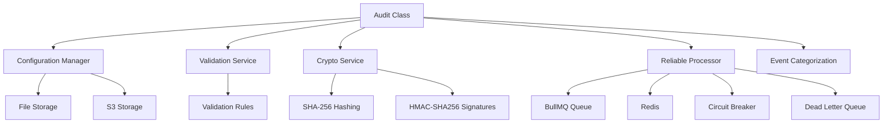
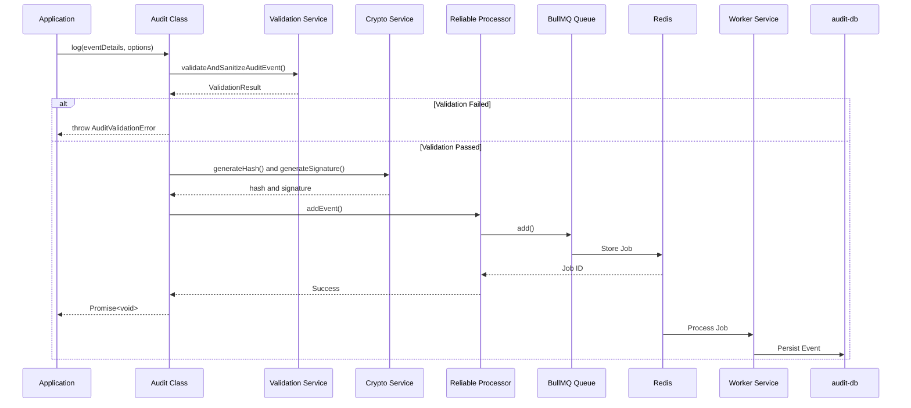
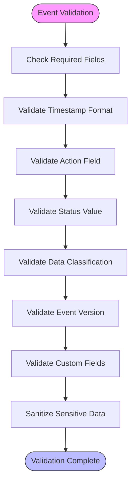
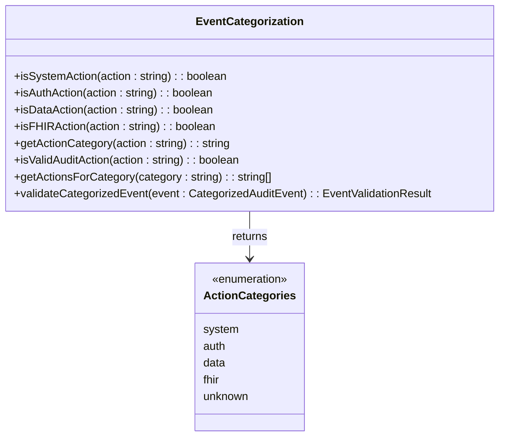
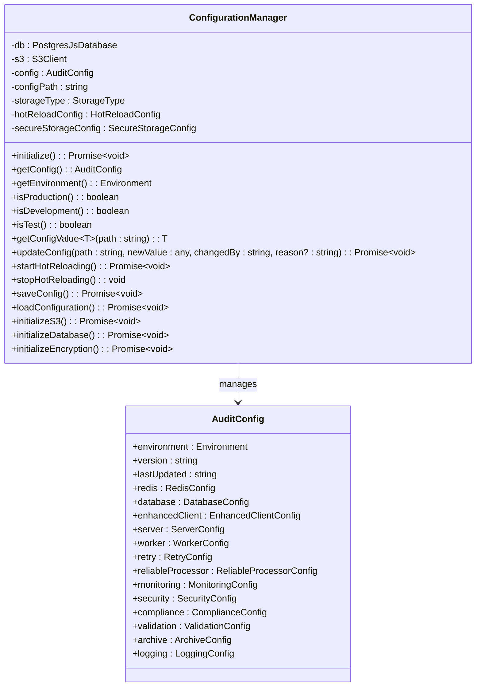
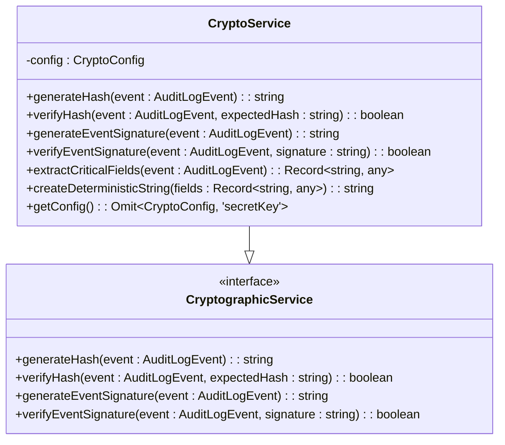

# Audit Core System

<cite>
**Referenced Files in This Document**   
- [audit.ts](file://packages/audit/src/audit.ts)
- [types.ts](file://packages/audit/src/types.ts)
- [validation.ts](file://packages/audit/src/validation.ts)
- [config/types.ts](file://packages/audit/src/config/types.ts)
- [config/manager.ts](file://packages/audit/src/config/manager.ts)
- [config/validator.ts](file://packages/audit/src/config/validator.ts)
- [event/event-categorization.ts](file://packages/audit/src/event/event-categorization.ts)
- [event/event-types.ts](file://packages/audit/src/event/event-types.ts)
- [crypto.ts](file://packages/audit/src/crypto.ts)
- [queue/reliable-processor.ts](file://packages/audit/src/queue/reliable-processor.ts)
- [index.ts](file://packages/audit/src/index.ts)
- [audit.md](file://apps/docs/src/content/docs/audit/audit.md)
- [examples.md](file://apps/docs/src/content/docs/audit/examples.md)
- [api-reference.md](file://apps/docs/src/content/docs/audit/api-reference.md)
</cite>

## Table of Contents
1. [Introduction](#introduction)
2. [Core Components](#core-components)
3. [Audit Event Structure](#audit-event-structure)
4. [Event Ingestion Pipeline](#event-ingestion-pipeline)
5. [Validation and Sanitization](#validation-and-sanitization)
6. [Event Categorization](#event-categorization)
7. [Configuration Management](#configuration-management)
8. [Cryptographic Security](#cryptographic-security)
9. [Reliable Event Processing](#reliable-event-processing)
10. [Integration Patterns](#integration-patterns)
11. [Usage Examples](#usage-examples)
12. [Performance and Scalability](#performance-and-scalability)

## Introduction

The Audit Core System serves as the central engine for audit event processing, validation, and routing within the SMEDREC platform. It provides a robust, secure, and reliable mechanism for capturing, validating, and persisting audit events across the system. The core functionality is implemented in the `@repo/audit` package, which offers cryptographic integrity verification, compliance validation, and guaranteed delivery through a sophisticated queuing system.

This documentation provides a comprehensive overview of the Audit Core System, detailing its architecture, implementation, and usage patterns. The system is designed with healthcare compliance in mind, supporting HIPAA and GDPR requirements while maintaining high performance and reliability.

**Section sources**
- [audit.md](file://apps/docs/src/content/docs/audit/audit.md)

## Core Components

The Audit Core System consists of several interconnected components that work together to provide a comprehensive audit logging solution. The primary component is the `Audit` class, which serves as the main interface for logging audit events. This class orchestrates the validation, cryptographic security, and queuing of events through various supporting services.

The system architecture follows a modular design, with distinct components for configuration management, event validation, cryptographic operations, and reliable processing. This separation of concerns allows for flexible configuration and extensibility while maintaining a clean and maintainable codebase.



**Diagram sources**
- [audit.ts](file://packages/audit/src/audit.ts)
- [config/manager.ts](file://packages/audit/src/config/manager.ts)
- [validation.ts](file://packages/audit/src/validation.ts)
- [crypto.ts](file://packages/audit/src/crypto.ts)
- [queue/reliable-processor.ts](file://packages/audit/src/queue/reliable-processor.ts)

**Section sources**
- [audit.ts](file://packages/audit/src/audit.ts)
- [index.ts](file://packages/audit/src/index.ts)

## Audit Event Structure

The `AuditLogEvent` interface defines the structure of audit events within the system. This standardized format ensures consistency across all logged events and facilitates processing, analysis, and reporting.

```typescript
interface AuditLogEvent {
	timestamp: string
	action: string
	status: AuditEventStatus
	principalId?: string
	organizationId?: string
	targetResourceType?: string
	targetResourceId?: string
	outcomeDescription?: string
	hash?: string
	hashAlgorithm?: 'SHA-256'
	signature?: string
	eventVersion?: string
	correlationId?: string
	sessionContext?: SessionContext
	dataClassification?: DataClassification
	retentionPolicy?: string
	processingLatency?: number
	queueDepth?: number
	[key: string]: any
}
```

The event structure includes both mandatory and optional fields. The mandatory fields (`timestamp`, `action`, `status`) ensure that every event contains essential information about when it occurred, what action was performed, and the outcome of that action. Optional fields provide additional context, such as the principal responsible for the action, the target resource affected, and session information.

Data classification is a critical aspect of the event structure, with predefined levels including 'PUBLIC', 'INTERNAL', 'CONFIDENTIAL', and 'PHI' (Protected Health Information). This classification enables appropriate handling and retention policies based on the sensitivity of the information.

**Section sources**
- [types.ts](file://packages/audit/src/types.ts)

## Event Ingestion Pipeline

The event ingestion pipeline is the core workflow that processes audit events from creation to persistence. This pipeline ensures that events are properly validated, secured, and routed to the appropriate processing system.



**Diagram sources**
- [audit.ts](file://packages/audit/src/audit.ts)
- [validation.ts](file://packages/audit/src/validation.ts)
- [crypto.ts](file://packages/audit/src/crypto.ts)
- [queue/reliable-processor.ts](file://packages/audit/src/queue/reliable-processor.ts)

**Section sources**
- [audit.ts](file://packages/audit/src/audit.ts)

## Validation and Sanitization

The validation system ensures that audit events conform to the expected schema and contain valid data. The `validateAndSanitizeAuditEvent` function performs comprehensive validation based on configurable rules defined in the `ValidationConfig` interface.



**Diagram sources**
- [validation.ts](file://packages/audit/src/validation.ts)

The validation process checks several aspects of the audit event:

- **Required fields**: Ensures that mandatory fields like `timestamp`, `action`, and `status` are present
- **Field types and formats**: Validates that fields contain data of the correct type and format (e.g., ISO 8601 timestamp)
- **Value constraints**: Checks that values fall within acceptable ranges or are part of predefined sets
- **String length**: Enforces maximum string lengths to prevent abuse
- **Data classification**: Validates that the data classification is one of the allowed values

The default validation configuration includes rules such as a maximum string length of 10,000 characters, allowed data classifications, required fields, maximum custom field depth of 3, and allowed event versions.

**Section sources**
- [validation.ts](file://packages/audit/src/validation.ts)
- [config/types.ts](file://packages/audit/src/config/types.ts)

## Event Categorization

The event categorization system classifies audit events based on their action type, enabling targeted processing and analysis. The categorization is implemented through type guards and category determination functions in the `event-categorization.ts` file.



**Diagram sources**
- [event/event-categorization.ts](file://packages/audit/src/event/event-categorization.ts)

The system defines several action categories:

- **System**: Events related to system operations (e.g., 'system.startup', 'system.shutdown')
- **Auth**: Authentication and authorization events (e.g., 'auth.login.success', 'auth.logout')
- **Data**: Data operations (e.g., 'data.read', 'data.create')
- **FHIR**: FHIR-specific operations (e.g., 'fhir.patient.read', 'fhir.observation.create')

The categorization process uses predefined lists of valid actions for each category and provides functions to validate that an action belongs to a specific category. This enables category-specific validation rules and processing logic.

The `validateCategorizedEvent` function performs category-specific validation and returns warnings for missing recommended fields:

- **System events**: Warns about missing systemComponent, configurationChanges, maintenanceDetails, or backupDetails
- **Authentication events**: Warns about missing principalId, failureReason, sessionContext, or mfaDetails
- **Data events**: Warns about incomplete target resource information, missing export format, or share recipient
- **FHIR events**: Warns about incomplete FHIR resource information, missing patientId, or practitionerId

The system also provides factory functions in `event-types.ts` for creating properly structured events with recommended defaults, including automatic timestamp generation and appropriate data classification defaults (e.g., PHI for FHIR events).

**Section sources**
- [event/event-categorization.ts](file://packages/audit/src/event/event-categorization.ts)
- [event/event-types.ts](file://packages/audit/src/event/event-types.ts)
- [types.ts](file://packages/audit/src/types.ts)

## Configuration Management

The configuration system provides a flexible and secure way to manage audit system settings across different environments. The `ConfigurationManager` class handles configuration loading, validation, and hot-reloading.



**Diagram sources**
- [config/manager.ts](file://packages/audit/src/config/manager.ts)
- [config/types.ts](file://packages/audit/src/config/types.ts)

The configuration manager supports multiple storage types ('s3' or 'file') and provides features such as:

- **Hot reloading**: Configuration can be updated at runtime without restarting the application
- **Secure storage**: Configuration can be encrypted using AES-256-GCM with PBKDF2 key derivation
- **Validation**: Configuration is validated against a comprehensive schema before use
- **Versioning**: Configuration changes are tracked with version and timestamp
- **Environment-specific settings**: Different configurations for development, staging, production, and test environments

The validation schema enforces strict rules for each configuration field, including required status, data types, value ranges, regular expression patterns, and enumerated values.

**Section sources**
- [config/manager.ts](file://packages/audit/src/config/manager.ts)
- [config/validator.ts](file://packages/audit/src/config/validator.ts)
- [config/types.ts](file://packages/audit/src/config/types.ts)

## Cryptographic Security

The cryptographic system ensures the integrity and authenticity of audit events through SHA-256 hashing and HMAC-SHA256 signatures. The `CryptoService` class implements these security features.



**Diagram sources**
- [crypto.ts](file://packages/audit/src/crypto.ts)

The cryptographic service performs the following operations:

- **Hash generation**: Creates a SHA-256 hash of critical event fields to ensure data integrity
- **Signature generation**: Creates an HMAC-SHA256 signature using a secret key to verify authenticity
- **Hash verification**: Validates that an event has not been tampered with by comparing hashes
- **Signature verification**: Confirms that an event was generated by a trusted source

The hash is generated from a deterministic string representation of critical fields, including timestamp, action, status, principalId, organizationId, targetResourceType, targetResourceId, and outcomeDescription. This ensures that the same event will always produce the same hash, regardless of property order in the object.

**Section sources**
- [crypto.ts](file://packages/audit/src/crypto.ts)
- [types.ts](file://packages/audit/src/types.ts)

## Reliable Event Processing

The reliable event processing system ensures that audit events are delivered even in the face of failures. The `ReliableEventProcessor` class implements this functionality using BullMQ, Redis, and several resilience patterns.

```mermaid
classDiagram
class ReliableEventProcessor {
-queue : Queue~T~
-worker : Worker~T~
-circuitBreaker : CircuitBreaker
-deadLetterHandler : DeadLetterHandler
-metricsCollector : ProcessorMetricsCollector
-isRunning : boolean
-processingTimes : number[]
+start() : Promise~void~
+stop() : Promise~void~
+addEvent(event : T, options : { priority? : number; delay? : number }) : Promise~void~
+processJobWithReliability(job : Job~T~) : Promise~void~
+startMetricsUpdater() : void
+updateProcessingTime(job : Job~T~) : void
}
class CircuitBreaker {
-connection : RedisType
-config : CircuitBreakerConfig
-queueName : string
-state : 'CLOSED' | 'OPEN' | 'HALF_OPEN'
-failureCount : number
-lastFailureTime : number
+isAllowed() : boolean
+onSuccess() : void
+onFailure() : void
+getState() : string
+onStateChange(callback : (state : string, metrics : any) => void) : void
}
class DeadLetterHandler {
-connection : RedisType
-db : PostgresJsDatabase
-config : DeadLetterConfig
-worker : Worker~any~
+startWorker() : void
+stopWorker() : Promise~void~
+moveToDeadLetter(job : Job~any~) : Promise~void~
+processDeadLetterJob(job : Job~any~) : Promise~void~
+onAlert(callback : (metrics : any) => void) : void
}
ReliableEventProcessor --> CircuitBreaker : uses
ReliableEventProcessor --> DeadLetterHandler : uses
ReliableEventProcessor --> Queue : manages
ReliableEventProcessor --> Worker : creates
```

**Diagram sources**
- [queue/reliable-processor.ts](file://packages/audit/src/queue/reliable-processor.ts)
- [queue/circuit-breaker.ts](file://packages/audit/src/queue/circuit-breaker.ts)
- [queue/dead-letter-queue.ts](file://packages/audit/src/queue/dead-letter-queue.ts)

The reliable processing system incorporates several key components:

- **Circuit Breaker**: Prevents cascading failures by temporarily stopping requests to a failing system
- **Dead Letter Queue**: Stores failed events for later analysis and reprocessing
- **Retry Mechanism**: Automatically retries failed events with configurable backoff strategies
- **Metrics Collection**: Monitors processing performance and system health
- **Durability Guarantees**: Ensures events are not lost even if the system crashes

The processor configuration includes settings for concurrency, retry policies, circuit breaker thresholds, and dead letter queue behavior, allowing fine-tuning for different performance and reliability requirements.

**Section sources**
- [queue/reliable-processor.ts](file://packages/audit/src/queue/reliable-processor.ts)
- [queue/circuit-breaker.ts](file://packages/audit/src/queue/circuit-breaker.ts)
- [queue/dead-letter-queue.ts](file://packages/audit/src/queue/dead-letter-queue.ts)

## Integration Patterns

The Audit Core System integrates with several other components in the SMEDREC platform:

- **audit-db**: Responsible for persisting audit events to the database
- **audit-sdk**: Provides a higher-level interface with additional features for application developers
- **worker services**: Process events from the queue and perform various actions, including persistence, alerting, and reporting

The integration with external systems follows a consistent pattern:

1. The Audit class validates and secures the event
2. The event is added to a BullMQ queue backed by Redis
3. Worker services consume events from the queue
4. Events are processed according to their type and requirements
5. Results are persisted to audit-db or other systems

This decoupled architecture allows for scalability and resilience, as the event producers and consumers operate independently.

**Section sources**
- [audit.ts](file://packages/audit/src/audit.ts)
- [index.ts](file://packages/audit/src/index.ts)

## Usage Examples

The following examples demonstrate common usage patterns for the Audit Core System:

### Basic Event Logging

```typescript
import { Audit } from '@repo/audit'

const auditService = new Audit('user-activity-queue')

// Log user login
await auditService.log({
  principalId: 'user-123',
  action: 'auth.login.success',
  status: 'success',
  outcomeDescription: 'User successfully logged in',
  sessionContext: {
    sessionId: 'sess-abc123',
    ipAddress: '192.168.1.100',
    userAgent: 'Mozilla/5.0 (Windows NT 10.0; Win64; x64) AppleWebKit/537.36',
  },
})
```

### FHIR Resource Access Logging

```typescript
// Patient record access
await auditService.log({
  principalId: 'practitioner-456',
  organizationId: 'org-hospital-1',
  action: 'fhir.patient.read',
  targetResourceType: 'Patient',
  targetResourceId: 'patient-789',
  status: 'success',
  outcomeDescription: 'Practitioner accessed patient record for treatment',
  dataClassification: 'PHI',
  sessionContext: {
    sessionId: 'sess-def456',
    ipAddress: '10.0.1.50',
    userAgent: 'FHIR-Client/1.0',
  },
  fhirContext: {
    resourceVersion: '1',
    compartment: 'Patient/patient-789',
    interaction: 'read',
  },
})
```

### High-Security Event with Guaranteed Delivery

```typescript
// Critical system changes with full security
await auditService.logWithGuaranteedDelivery(
  {
    principalId: 'admin-001',
    action: 'system.configuration.change',
    targetResourceType: 'SystemConfig',
    targetResourceId: 'security-policy',
    status: 'success',
    outcomeDescription: 'Updated system security policy',
    dataClassification: 'CONFIDENTIAL',
    changes: {
      oldValue: { maxLoginAttempts: 3 },
      newValue: { maxLoginAttempts: 5 },
    },
  },
  {
    priority: 1,
    durabilityGuarantees: true,
    generateHash: true,
    generateSignature: true,
    correlationId: 'config-change-2024-001',
  }
)
```

**Section sources**
- [examples.md](file://apps/docs/src/content/docs/audit/examples.md)
- [api-reference.md](file://apps/docs/src/content/docs/audit/api-reference.md)

## Performance and Scalability

The Audit Core System is designed for high performance and scalability in production environments. Key performance considerations include:

- **Asynchronous Processing**: Events are queued and processed asynchronously, minimizing impact on application performance
- **Batch Operations**: Multiple events can be processed efficiently through batch operations
- **Caching**: Frequently accessed data is cached to reduce database load
- **Connection Pooling**: Database connections are pooled to minimize connection overhead
- **Partitioning**: Audit data is partitioned in the database for improved query performance

Scalability patterns include:

- **Horizontal Scaling**: Multiple worker instances can process events from the same queue
- **Queue Prioritization**: High-priority events can be processed before lower-priority ones
- **Load Shedding**: The circuit breaker pattern prevents system overload during high load
- **Elastic Scaling**: Worker instances can be scaled up or down based on queue depth

The system's performance can be monitored through various metrics, including processing latency, queue depth, success/failure rates, and system resource utilization.

**Section sources**
- [audit.ts](file://packages/audit/src/audit.ts)
- [queue/reliable-processor.ts](file://packages/audit/src/queue/reliable-processor.ts)
- [config/types.ts](file://packages/audit/src/config/types.ts)