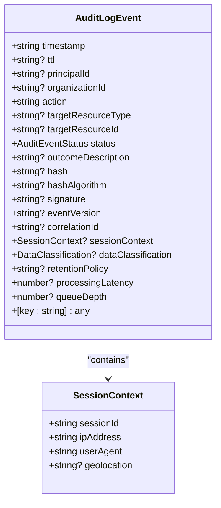
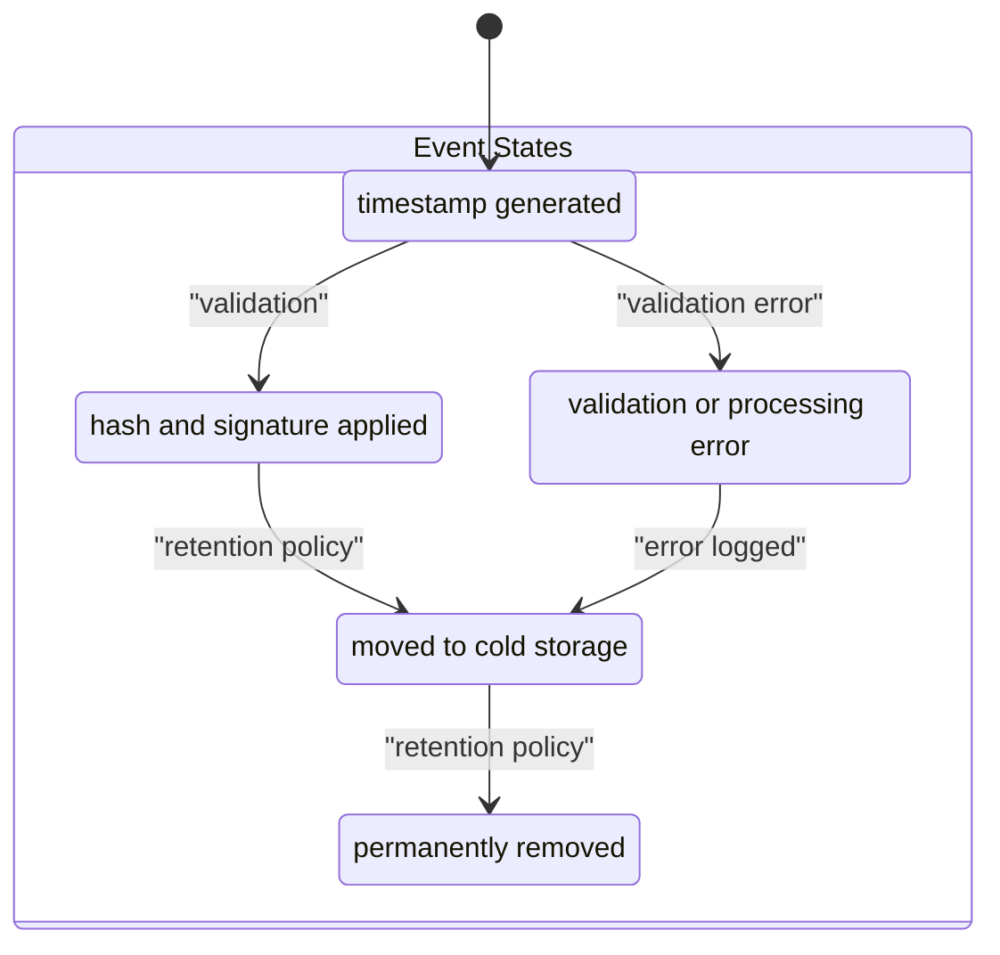
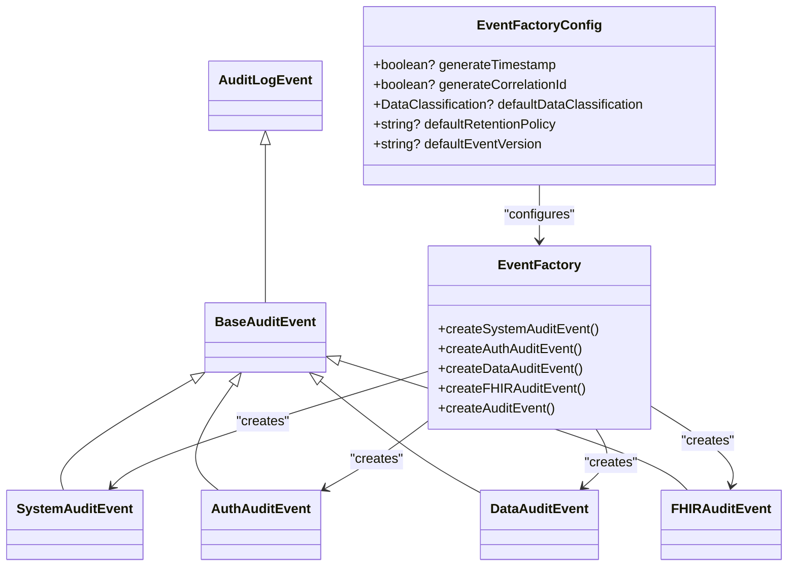
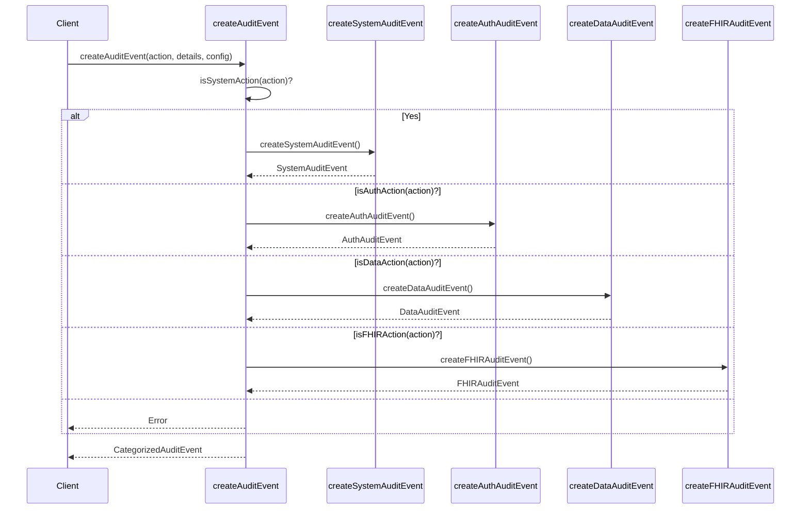
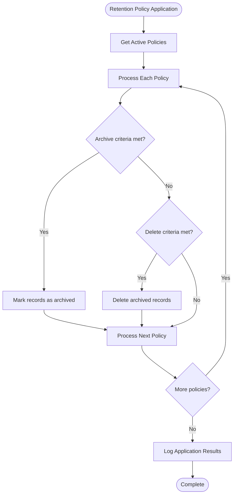

# Audit Event Domain Model

<cite>
**Referenced Files in This Document**   
- [types.ts](file://packages/audit/src/types.ts) - *Updated with comprehensive audit event definitions*
- [event-types.ts](file://packages/audit/src/event/event-types.ts) - *Enhanced with factory patterns and categorization*
- [gdpr-compliance.ts](file://packages/audit/src/gdpr/gdpr-compliance.ts) - *Updated with GDPR compliance features*
- [archival-service.ts](file://packages/audit/src/archival/archival-service.ts) - *Modified with archival functionality*
- [schema.ts](file://packages/audit-db/src/db/schema.ts) - *Updated database schema definitions*
</cite>

## Update Summary
**Changes Made**   
- Updated core entity structure with enhanced type definitions and documentation
- Added detailed event lifecycle and status state information
- Expanded event taxonomy with new categorization system
- Enhanced object composition and inheritance patterns with factory implementation details
- Updated data validation and immutability constraints with cryptographic details
- Improved versioning and backward compatibility strategies
- Enhanced retention policies and GDPR compliance features with new implementation details
- Updated sample JSON representations with current event types
- Added comprehensive archival system and data lifecycle management
- Integrated plugin architecture and advanced GDPR pseudonymization strategies

## Table of Contents
1. [Introduction](#introduction)
2. [Core Entity Structure](#core-entity-structure)
3. [Event Lifecycle and Status States](#event-lifecycle-and-status-states)
4. [Event Taxonomy and Categorization](#event-taxonomy-and-categorization)
5. [Object Composition and Inheritance Patterns](#object-composition-and-inheritance-patterns)
6. [Data Validation and Immutability](#data-validation-and-immutability)
7. [Versioning and Backward Compatibility](#versioning-and-backward-compatibility)
8. [Retention Policies and GDPR Compliance](#retention-policies-and-gdpr-compliance)
9. [Sample JSON Representations](#sample-json-representations)
10. [Archival System and Data Lifecycle](#archival-system-and-data-lifecycle)

## Introduction
The Audit Event Domain Model defines a comprehensive system for capturing, categorizing, and managing audit events across a healthcare technology platform. This model provides a standardized structure for recording system activities, authentication events, data access operations, and FHIR-specific interactions. The domain model emphasizes data integrity, compliance with regulatory requirements (particularly GDPR), and long-term data lifecycle management. Built with extensibility in mind, the model supports multiple event categories through a factory pattern and inheritance hierarchy, while ensuring immutability through cryptographic hashing and digital signatures.

## Core Entity Structure

The core of the audit event model is defined by the `AuditLogEvent` interface, which establishes the fundamental properties and data types for all audit events. This interface serves as the foundation for more specialized event types and ensures consistency across the system.



**Diagram sources**
- [types.ts](file://packages/audit/src/types.ts#L30-L150)

**Section sources**
- [types.ts](file://packages/audit/src/types.ts#L1-L199)

### Core Properties and Data Types

The `AuditLogEvent` interface defines the following key properties:

**:timestamp**  
- **Type**: `string`  
- **Description**: ISO 8601 timestamp indicating when the event occurred. Automatically generated when the event is logged.  
- **Example**: `"2023-10-26T10:30:00.000Z"`

**:action**  
- **Type**: `string`  
- **Description**: A standardized string describing the action performed, typically in verbNoun format.  
- **Example**: `"fhirPatientRead"`, `"userLogin"`

**:status**  
- **Type**: `AuditEventStatus`  
- **Description**: The outcome of the attempted action, with possible values of 'attempt', 'success', or 'failure'.  
- **Example**: `'success'`

**:principalId**  
- **Type**: `string`  
- **Description**: Optional identifier for the user or system principal that initiated the action.  
- **Example**: `"user-12345"`

**:organizationId**  
- **Type**: `string`  
- **Description**: Optional identifier for the organization associated with the event, essential in multi-tenant systems.  
- **Example**: `"org-67890"`

**:targetResourceType** and **:targetResourceId**  
- **Type**: `string`  
- **Description**: Optional identifiers for the resource involved in the action.  
- **Examples**: `"Patient"` and `"pat-abc-123"`

**:outcomeDescription**  
- **Type**: `string`  
- **Description**: Provides additional context about the outcome beyond the basic status.  
- **Example**: `"Successfully read Patient resource with ID pat-abc-123"`

**:dataClassification**  
- **Type**: `DataClassification`  
- **Description**: Indicates the sensitivity level of the data involved, with values of 'PUBLIC', 'INTERNAL', 'CONFIDENTIAL', or 'PHI' (Protected Health Information).  
- **Default**: `"INTERNAL"`

**:retentionPolicy**  
- **Type**: `string`  
- **Description**: Identifier for the retention policy governing the event's lifecycle.  
- **Example**: `"standard"`, `"extended"`

The model also includes technical properties for integrity verification and system monitoring:
- **:hash**: Cryptographic hash (SHA-256) for immutability verification
- **:hashAlgorithm**: Algorithm used for hashing (standardized to SHA-256)
- **:signature**: Cryptographic signature for additional security
- **:eventVersion**: Schema version for backward compatibility
- **:correlationId**: Identifier for tracking related events across systems
- **:processingLatency**: Processing time in milliseconds for performance monitoring
- **:queueDepth**: Queue depth at processing time for system monitoring

The interface supports extensibility through an index signature `[key: string]: any`, allowing for arbitrary additional context specific to particular event types.

## Event Lifecycle and Status States

The audit event lifecycle is managed through a well-defined state model that tracks events from creation through processing, archival, and eventual deletion. The core status states are defined by the `AuditEventStatus` type, which provides a standardized way to represent the outcome of any auditable action.



**Diagram sources**
- [types.ts](file://packages/audit/src/types.ts#L6-L6)
- [event-types.ts](file://packages/audit/src/event/event-types.ts#L10-L10)

**Section sources**
- [types.ts](file://packages/audit/src/types.ts#L1-L20)
- [event-types.ts](file://packages/audit/src/event/event-types.ts#L1-L50)

### Status State Definitions

The `AuditEventStatus` type defines three possible states for any auditable action:

**:attempt**  
Represents that an action was initiated or attempted. This status is typically used for events that precede a success or failure outcome, such as a login attempt before authentication is completed.

**:success**  
Indicates that an action was successfully completed. This status confirms that the operation achieved its intended outcome without errors.

**:failure**  
Signifies that an action failed to complete successfully. This status is accompanied by an `outcomeDescription` that provides details about the nature of the failure.

These status states form the basis for monitoring system health, detecting security incidents, and generating compliance reports. For example, a sequence of `auth.login.attempt` events with `failure` status followed by a `success` status might indicate a potential brute force attack.

## Event Taxonomy and Categorization

The audit event model implements a hierarchical taxonomy of event kinds through a categorization system that organizes events into distinct domains: system, authentication, data, and FHIR-specific operations. This taxonomy provides semantic meaning to events and enables specialized processing based on event category.

```mermaid
classDiagram
class BaseAuditEvent {
+category : 'system' | 'auth' | 'data' | 'fhir'
+subcategory? : string
}
class SystemAuditEvent {
+action : SystemAuditAction
+systemComponent? : string
+configurationChanges? : Record<string, { old : any; new : any }>
+maintenanceDetails? : { type : 'scheduled' | 'emergency' | 'routine', duration? : number, affectedServices? : string[] }
+backupDetails? : { type : 'full' | 'incremental' | 'differential', size? : number, location? : string }
}
class AuthAuditEvent {
+action : AuthAuditAction
+authMethod? : 'password' | 'mfa' | 'sso' | 'api_key' | 'oauth'
+failureReason? : string
+sessionDuration? : number
+mfaDetails? : { method : 'totp' | 'sms' | 'email' | 'hardware', verified : boolean }
+passwordPolicy? : { complexity : boolean, length : boolean, history : boolean }
}
class DataAuditEvent {
+action : DataAuditAction
+dataType? : string
+recordCount? : number
+dataSize? : number
+exportFormat? : 'json' | 'csv' | 'xml' | 'pdf'
+shareRecipient? : string
+anonymizationMethod? : 'pseudonymization' | 'generalization' | 'suppression'
+queryDetails? : { filters? : Record<string, any>, sortBy? : string, limit? : number, offset? : number }
}
class FHIRAuditEvent {
+action : FHIRAuditAction
+fhirResourceType? : string
+fhirResourceId? : string
+fhirVersion? : string
+bundleType? : 'document' | 'message' | 'transaction' | 'batch' | 'collection'
+bundleSize? : number
+operationOutcome? : { severity : 'information' | 'warning' | 'error' | 'fatal', code : string, details? : string }
+patientId? : string
+practitionerId? : string
}
BaseAuditEvent <|-- SystemAuditEvent
BaseAuditEvent <|-- AuthAuditEvent
BaseAuditEvent <|-- DataAuditEvent
BaseAuditEvent <|-- FHIRAuditEvent
AuditLogEvent <|-- BaseAuditEvent
```

**Diagram sources**
- [event-types.ts](file://packages/audit/src/event/event-types.ts#L14-L138)

**Section sources**
- [event-types.ts](file://packages/audit/src/event/event-types.ts#L1-L199)

### Category Definitions

#### System Audit Events
System events capture infrastructure-level operations and are identified by the `system` category. These events use actions prefixed with `system.` and include additional context specific to system operations:

**:system.startup** - System initialization
**:system.shutdown** - System termination
**:system.configuration.change** - Configuration modifications
**:system.backup.created** - Backup operations
**:system.maintenance.started** - Maintenance windows

System events may include `maintenanceDetails` with information about the maintenance type, duration, and affected services, or `backupDetails` with backup type, size, and storage location.

#### Authentication Audit Events
Authentication events track security-related activities and are categorized under `auth`. These events use actions prefixed with `auth.` and provide detailed context about authentication processes:

**:auth.login.attempt** - Login initiation
**:auth.login.success** - Successful authentication
**:auth.login.failure** - Failed authentication
**:auth.logout** - Session termination
**:auth.mfa.enabled** - Multi-factor authentication setup

Authentication events include properties like `authMethod` (password, MFA, SSO, etc.), `failureReason` for failed attempts, and `mfaDetails` for multi-factor authentication specifics.

#### Data Audit Events
Data events monitor data access and manipulation operations under the `data` category. These events capture data governance activities:

**:data.read** - Data retrieval
**:data.create** - Data creation
**:data.update** - Data modification
**:data.delete** - Data removal
**:data.export** - Data export operations
**:data.share** - Data sharing activities

Data events include metadata about the data type, record count, data size, export format, and query parameters used in data retrieval.

#### FHIR Audit Events
FHIR events are specialized for healthcare interoperability and follow HL7 FHIR standards. Categorized under `fhir`, these events capture FHIR-specific operations:

**:fhir.patient.read** - Patient data access
**:fhir.practitioner.read** - Practitioner search
**:fhir.observation.create** - Observation creation
**:fhir.bundle.process** - Bundle processing

FHIR events include FHIR-specific context such as `fhirResourceType`, `fhirVersion`, `bundleType`, and `operationOutcome` with severity levels and error codes.

## Object Composition and Inheritance Patterns

The audit event model employs a sophisticated inheritance and composition pattern to balance type safety with flexibility. The architecture uses interface extension and union types to create a type-safe hierarchy while maintaining the ability to add custom properties.



**Diagram sources**
- [event-types.ts](file://packages/audit/src/event/event-types.ts#L10-L307)

**Section sources**
- [event-types.ts](file://packages/audit/src/event/event-types.ts#L1-L308)

### Inheritance Hierarchy

The model implements a single-inheritance hierarchy where specialized event types extend from `BaseAuditEvent`, which itself extends `AuditLogEvent`. This pattern ensures that all events inherit the core properties while adding category-specific fields.

The inheritance chain is:
`AuditLogEvent` → `BaseAuditEvent` → `[Category-Specific Event]`

This approach provides several benefits:
- **Type Safety**: TypeScript can validate that all required fields are present
- **Code Reuse**: Common functionality is inherited rather than duplicated
- **Extensibility**: New categories can be added without modifying existing code
- **Polymorphism**: Functions can accept the base type and work with any specialized event

### Factory Pattern Implementation

The model uses a factory pattern to instantiate events, with `createAuditEvent` serving as the primary entry point. This function routes to category-specific factory functions based on the action type:



**Diagram sources**
- [event-types.ts](file://packages/audit/src/event/event-types.ts#L270-L307)

**Section sources**
- [event-types.ts](file://packages/audit/src/event/event-types.ts#L140-L308)

The factory functions accept a configuration object (`EventFactoryConfig`) that allows customization of default behaviors such as timestamp generation, correlation ID creation, and default values for data classification and retention policies. This pattern ensures consistent event creation while allowing for environment-specific configurations.

## Data Validation and Immutability

The audit event model implements robust data validation and immutability constraints to ensure the integrity and trustworthiness of audit records. These mechanisms are critical for compliance, security, and forensic analysis.

### Validation Rules

The model enforces validation through TypeScript's type system and runtime checks. Key validation rules include:

- **Required Fields**: `timestamp`, `action`, and `status` are mandatory
- **Enum Constraints**: `status`, `dataClassification`, and `hashAlgorithm` must match predefined values
- **Format Validation**: `timestamp` must be valid ISO 8601 format
- **Contextual Validation**: Category-specific fields are validated based on the event type

The factory functions perform validation during event creation, ensuring that only properly structured events are generated.

### Immutability Constraints

Immutability is enforced through cryptographic mechanisms that detect any tampering with event data:

**:hash**  
- Generated using SHA-256 algorithm on the serialized event data
- Allows verification that the event content has not been altered
- Any modification to the event would result in a different hash

**:hashAlgorithm**  
- Standardized to SHA-256 for consistency across the system
- Ensures interoperability and predictable verification behavior

**:signature**  
- Cryptographic signature generated using HMAC-SHA256 with a secret key
- Provides additional security beyond hashing by requiring knowledge of the secret key to generate valid signatures
- Protects against unauthorized modifications even if the hash algorithm is known

These immutability features create a tamper-evident log that can be trusted for compliance audits and security investigations. The combination of hashing and digital signatures ensures both data integrity and authenticity.

**Section sources**
- [types.ts](file://packages/audit/src/types.ts#L100-L115)
- [crypto.ts](file://packages/audit/src/crypto.ts#L8-L8)

## Versioning and Backward Compatibility

The audit event model incorporates versioning strategies to ensure backward compatibility as the system evolves. This is critical for maintaining a consistent audit trail over time, even as new features and properties are added.

### Schema Versioning

The `eventVersion` property tracks the schema version of each event:

- **Default Value**: `"1.0"`
- **Purpose**: Allows consumers to understand the structure and capabilities of an event
- **Usage**: Enables version-specific processing logic and migration paths

Versioning follows semantic versioning principles:
- **Major versions** indicate breaking changes
- **Minor versions** indicate backward-compatible additions
- **Patch versions** indicate backward-compatible bug fixes

### Backward Compatibility Strategies

The model employs several strategies to maintain backward compatibility:

**:Optional Properties**  
New fields are added as optional properties, allowing older systems to ignore them while newer systems can utilize the additional context.

**:Default Values**  
The factory configuration (`EventFactoryConfig`) provides default values for common properties, ensuring consistent behavior across different versions.

**:Union Types**  
The `CategorizedAuditEvent` union type allows the system to handle multiple event types while maintaining type safety.

**:Extensible Interface**  
The index signature `[key: string]: any` allows for custom properties without requiring schema changes, providing flexibility for specialized use cases.

These versioning strategies ensure that audit events remain interpretable over time, even as the system evolves. Consumers can reliably process events from different time periods, and migration paths can be implemented for schema changes.

**Section sources**
- [types.ts](file://packages/audit/src/types.ts#L120-L125)
- [event-types.ts](file://packages/audit/src/event/event-types.ts#L70-L80)

## Retention Policies and GDPR Compliance

The audit event model integrates comprehensive retention policies and GDPR compliance features to meet regulatory requirements for data protection and privacy. These mechanisms ensure that audit data is managed according to legal and organizational policies.

### Retention Policy Implementation

Retention policies are defined by the `RetentionPolicy` interface and implemented through automated processes:



**Diagram sources**
- [gdpr-compliance.ts](file://packages/audit/src/gdpr/gdpr-compliance.ts#L300-L450)

**Section sources**
- [gdpr-compliance.ts](file://packages/audit/src/gdpr/gdpr-compliance.ts#L1-L685)

Each retention policy specifies:
- **:dataClassification**: The sensitivity level the policy applies to
- **:retentionDays**: Total retention period in days
- **:archiveAfterDays**: When to move records to archival storage
- **:deleteAfterDays**: When to permanently delete records
- **:isActive**: Whether the policy is currently enforced

### GDPR Compliance Features

The model implements several GDPR-specific features to support data subject rights:

**:Data Subject Rights**  
The system supports all major GDPR rights through specialized services:
- **Right to Access**: Export user audit data
- **Right to Rectification**: Update incorrect audit information
- **Right to Erasure**: Delete user data with compliance preservation
- **Right to Portability**: Export data in standard formats
- **Right to Restriction**: Limit processing of audit data

**:Pseudonymization**  
The `pseudonymizeUserData` function implements data minimization by replacing identifiable information with pseudonyms while maintaining referential integrity:

- **Strategies**: Hash, token, or encryption-based pseudonymization
- **Mapping**: Original-to-pseudonym mappings are maintained for authorized access
- **Audit Trail**: All pseudonymization activities are themselves audited

**:Data Export**  
The `exportUserData` function enables data portability by exporting audit records in multiple formats (JSON, CSV, XML) with metadata about the export.

**:Right to Be Forgotten**  
The `deleteUserDataWithAuditTrail` function implements the "right to be forgotten" while preserving compliance-critical audit records by pseudonymizing them instead of deletion.

These GDPR compliance features ensure that the audit system itself adheres to the privacy principles it helps enforce, creating a self-referential compliance framework.

**Section sources**
- [gdpr-compliance.ts](file://packages/audit/src/gdpr/gdpr-compliance.ts#L1-L685)

## Sample JSON Representations

The following examples illustrate the JSON structure of different event types, demonstrating how the domain model is implemented in practice.

### System Audit Event
```json
{
  "timestamp": "2023-10-26T10:30:00.000Z",
  "action": "system.startup",
  "status": "success",
  "category": "system",
  "systemComponent": "audit-service",
  "configurationChanges": {
    "logLevel": { "old": "info", "new": "debug" }
  },
  "eventVersion": "1.0",
  "hash": "a1b2c3d4e5f6...",
  "hashAlgorithm": "SHA-256",
  "dataClassification": "INTERNAL",
  "retentionPolicy": "standard"
}
```

### Authentication Audit Event
```json
{
  "timestamp": "2023-10-26T10:35:00.000Z",
  "action": "auth.login.success",
  "status": "success",
  "category": "auth",
  "principalId": "user-12345",
  "organizationId": "org-67890",
  "authMethod": "mfa",
  "sessionDuration": 3600,
  "mfaDetails": {
    "method": "totp",
    "verified": true
  },
  "sessionContext": {
    "sessionId": "sess-abc-123",
    "ipAddress": "192.168.1.100",
    "userAgent": "Mozilla/5.0"
  },
  "eventVersion": "1.0",
  "hash": "x1y2z3a4b5c6...",
  "dataClassification": "INTERNAL",
  "retentionPolicy": "extended"
}
```

### Data Audit Event
```json
{
  "timestamp": "2023-10-26T10:40:00.000Z",
  "action": "data.export",
  "status": "success",
  "category": "data",
  "principalId": "user-12345",
  "dataType": "audit-logs",
  "recordCount": 1000,
  "dataSize": 524288,
  "exportFormat": "json",
  "queryDetails": {
    "filters": { "actionDate": "2023-10-25" },
    "limit": 1000
  },
  "eventVersion": "1.0",
  "hash": "m7n8o9p0q1r2...",
  "dataClassification": "CONFIDENTIAL",
  "retentionPolicy": "minimal"
}
```

### FHIR Audit Event
```json
{
  "timestamp": "2023-10-26T10:45:00.000Z",
  "action": "fhir.patient.read",
  "status": "success",
  "category": "fhir",
  "principalId": "user-12345",
  "fhirResourceType": "Patient",
  "fhirResourceId": "pat-abc-123",
  "fhirVersion": "4.0.1",
  "patientId": "pat-abc-123",
  "practitionerId": "prac-xyz-789",
  "operationOutcome": {
    "severity": "information",
    "code": "OK",
    "details": "Successful read operation"
  },
  "eventVersion": "1.0",
  "hash": "d4e5f6g7h8i9...",
  "dataClassification": "PHI",
  "retentionPolicy": "extended"
}
```

These examples demonstrate the consistent structure across event types, with category-specific properties providing additional context while maintaining the core audit event schema.

**Section sources**
- [types.ts](file://packages/audit/src/types.ts#L30-L150)
- [event-types.ts](file://packages/audit/src/event/event-types.ts#L14-L138)

## Archival System and Data Lifecycle

The audit event model includes a comprehensive archival system that manages the complete data lifecycle from creation to deletion. This system ensures efficient storage, retrieval, and compliance with retention policies.

### Archival Service Architecture

The archival system is implemented through the `ArchivalService` class, which provides methods for creating, retrieving, and managing archives:

```mermaid
classDiagram
class ArchiveConfig {
+compressionAlgorithm : 'gzip' | 'deflate' | 'none'
+compressionLevel : number
+format : 'json' | 'jsonl' | 'parquet'
+batchSize : number
+verifyIntegrity : boolean
+encryptArchive : boolean
}
class ArchiveResult {
+archiveId : string
+recordCount : number
+originalSize : number
+compressedSize : number
+compressionRatio : number
+checksumOriginal : string
+checksumCompressed : string
+verificationStatus : 'verified' | 'failed' | 'skipped'
+timestamp : string
+processingTime : number
}
class ArchiveRetrievalRequest {
+archiveId? : string
+principalId? : string
+organizationId? : string
+dateRange? : { start : string, end : string }
+actions? : string[]
+dataClassifications? : string[]
+retentionPolicies? : string[]
+limit? : number
+offset? : number
}
class ArchivalService {
+createArchive() : Promise<ArchiveResult>
+retrieveArchive() : Promise<ArchiveRetrievalResult>
+applyRetentionPolicies() : Promise<RetentionArchiveResult[]>
+validateArchive() : Promise<ArchiveValidationResult>
+cleanupArchives() : Promise<ArchiveCleanupResult>
+getStatistics() : Promise<ArchiveStatistics>
}
ArchivalService --> ArchiveConfig : "uses"
ArchivalService --> ArchiveResult : "returns"
ArchivalService --> ArchiveRetrievalRequest : "accepts"
```

**Diagram sources**
- [archival-service.ts](file://packages/audit/src/archival/archival-service.ts#L10-L500)

**Section sources**
- [archival-service.ts](file://packages/audit/src/archival/archival-service.ts#L1-L1188)

### Data Lifecycle Management

The archival system implements a multi-stage data lifecycle:

1. **Active Storage**: Recent events are stored in primary databases for quick access
2. **Archival Storage**: Older events are compressed and moved to cold storage based on retention policies
3. **Deletion**: Events are permanently removed when they exceed their retention period

The system supports multiple compression algorithms (gzip, deflate) and serialization formats (JSON, JSONL, Parquet) to optimize storage efficiency. Integrity verification ensures that archived data remains uncorrupted, and optional encryption provides an additional security layer.

The `applyRetentionPolicies` method automates the lifecycle management process, identifying records that meet archival or deletion criteria based on their age, data classification, and retention policy. This automated approach ensures consistent enforcement of data governance policies across the organization.

**Section sources**
- [archival-service.ts](file://packages/audit/src/archival/archival-service.ts#L1-L1188)
- [gdpr-compliance.ts](file://packages/audit/src/gdpr/gdpr-compliance.ts#L300-L450)