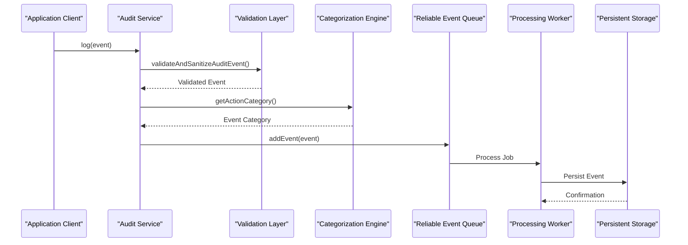
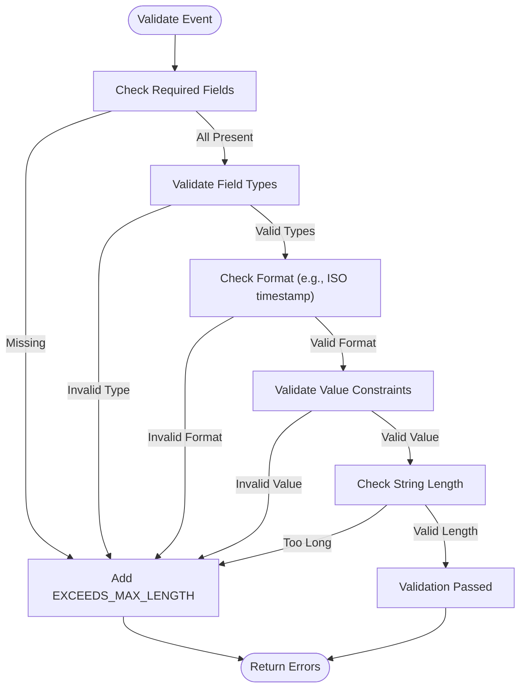
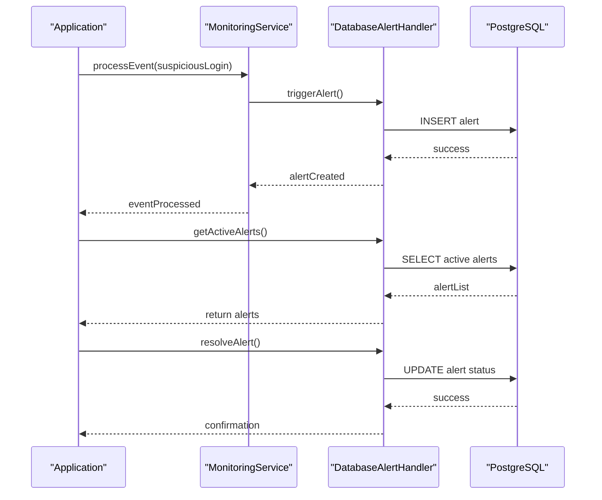
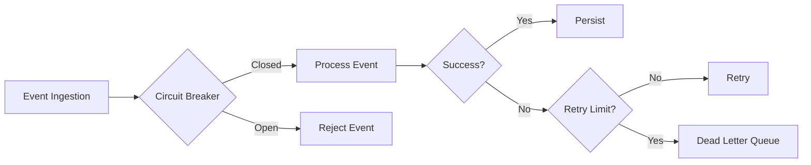

# Audit Event Processing

<cite>
**Referenced Files in This Document**   
- [event-types.ts](file://packages\audit\src\event\event-types.ts) - *Updated in recent commit*
- [database-alert-integration.ts](file://packages\audit\src\examples\database-alert-integration.ts) - *Updated in recent commit*
- [audit.ts](file://packages\audit\src\audit.ts) - *Updated in recent commit*
- [types.ts](file://packages\audit\src\types.ts) - *Updated in recent commit*
- [event-categorization.ts](file://packages\audit\src\event\event-categorization.ts) - *Updated in recent commit*
- [validation.ts](file://packages\audit\src\validation.ts) - *Updated in recent commit*
- [reliable-processor.ts](file://packages\audit\src\queue\reliable-processor.ts) - *Updated in recent commit*
</cite>

## Update Summary
**Changes Made**   
- Updated event categorization logic to include new validation and warning mechanisms
- Enhanced domain model with new field recommendations and required fields per category
- Added detailed information about cryptographic integrity features (hashing and signatures)
- Expanded real-world usage example with multi-organizational alert isolation
- Updated error handling section with new circuit breaker and dead letter queue metrics
- Added best practices for compliance validation and event enrichment

## Table of Contents
1. [Introduction](#introduction)
2. [Event Ingestion Pipeline](#event-ingestion-pipeline)
3. [Domain Model of Audit Events](#domain-model-of-audit-events)
4. [Event Categorization and Validation](#event-categorization-and-validation)
5. [Real-World Usage Example](#real-world-usage-example)
6. [Error Handling and Performance](#error-handling-and-performance)
7. [Best Practices](#best-practices)

## Introduction
The Audit Event Processing subsystem is responsible for capturing, validating, categorizing, and persisting audit events across the system. It ensures data integrity, supports compliance requirements, and enables monitoring and alerting. This document details the architecture, domain model, processing pipeline, and best practices for working with audit events.

## Event Ingestion Pipeline

The event ingestion pipeline follows a reliable, queue-based architecture to ensure durability and fault tolerance. Events are ingested through the `Audit` class, processed through a validation and normalization phase, categorized, and then persisted via a reliable queue backed by Redis.



**Diagram sources**
- [audit.ts](file://packages\audit\src\audit.ts#L1-L200)
- [validation.ts](file://packages\audit\src\validation.ts#L1-L100)
- [event-categorization.ts](file://packages\audit\src\event\event-categorization.ts#L1-L100)
- [reliable-processor.ts](file://packages\audit\src\queue\reliable-processor.ts#L1-L100)

**Section sources**   
- [audit.ts](file://packages\audit\src\audit.ts#L1-L200)
- [reliable-processor.ts](file://packages\audit\src\queue\reliable-processor.ts#L1-L100)

## Domain Model of Audit Events

The domain model of audit events is defined by a flexible interface that supports both required and optional fields, enabling extensibility while maintaining consistency.

### Core Event Structure

```typescript
interface AuditLogEvent {
  timestamp: string
  action: string
  status: AuditEventStatus
  principalId?: string
  organizationId?: string
  targetResourceType?: string
  targetResourceId?: string
  outcomeDescription?: string
  hash?: string
  hashAlgorithm?: 'SHA-256'
  signature?: string
  eventVersion?: string
  correlationId?: string
  sessionContext?: SessionContext
  dataClassification?: DataClassification
  retentionPolicy?: string
  processingLatency?: number
  queueDepth?: number
  [key: string]: any
}
```

### Required Fields
- **timestamp**: ISO 8601 formatted string indicating when the event occurred
- **action**: Standardized string describing the performed action
- **status**: One of `attempt`, `success`, or `failure`

### Metadata Structure
- **dataClassification**: One of `PUBLIC`, `INTERNAL`, `CONFIDENTIAL`, or `PHI`
- **retentionPolicy**: Identifier for data lifecycle management
- **correlationId**: Used to track related events across systems
- **sessionContext**: Contains `sessionId`, `ipAddress`, `userAgent`, and optional `geolocation`

### Lifecycle States
- **Pending**: Event created but not yet validated
- **Validated**: Event passed schema validation
- **Categorized**: Event assigned to a domain category
- **Processed**: Event successfully added to the queue
- **Persisted**: Event written to durable storage
- **Archived**: Event moved to long-term storage based on retention policy

**Section sources**   
- [types.ts](file://packages\audit\src\types.ts#L1-L200)
- [event-types.ts](file://packages\audit\src\event\event-types.ts#L1-L50)

## Event Categorization and Validation

### Event Types and Categories

The system defines four primary categories of audit events, each with specific action types and optional fields:

```mermaid
classDiagram
class AuditLogEvent {
+string timestamp
+string action
+AuditEventStatus status
+string? principalId
+string? organizationId
+string? targetResourceType
+string? targetResourceId
+string? outcomeDescription
+string? hash
+string? hashAlgorithm
+string? signature
+string? eventVersion
+string? correlationId
+SessionContext? sessionContext
+DataClassification? dataClassification
+string? retentionPolicy
+number? processingLatency
+number? queueDepth
}
class SystemAuditEvent {
+string systemComponent
+Record~string, {old : any, new : any}~ configurationChanges
+MaintenanceDetails? maintenanceDetails
+BackupDetails? backupDetails
}
class AuthAuditEvent {
+string authMethod
+string failureReason
+number sessionDuration
+MFADetails? mfaDetails
+PasswordPolicy? passwordPolicy
}
class DataAuditEvent {
+string dataType
+number recordCount
+number dataSize
+string exportFormat
+string shareRecipient
+string anonymizationMethod
+QueryDetails? queryDetails
}
class FHIRAuditEvent {
+string fhirResourceType
+string fhirResourceId
+string fhirVersion
+string bundleType
+number bundleSize
+OperationOutcome? operationOutcome
+string patientId
+string practitionerId
}
AuditLogEvent <|-- SystemAuditEvent
AuditLogEvent <|-- AuthAuditEvent
AuditLogEvent <|-- DataAuditEvent
AuditLogEvent <|-- FHIRAuditEvent
```

**Diagram sources**
- [types.ts](file://packages\audit\src\types.ts#L1-L286)
- [event-types.ts](file://packages\audit\src\event\event-types.ts#L1-L199)

**Section sources**   
- [event-types.ts](file://packages\audit\src\event\event-types.ts#L1-L199)
- [event-categorization.ts](file://packages\audit\src\event\event-categorization.ts#L1-L200)

### Schema Validation with Zod

The system uses a comprehensive validation mechanism to ensure event integrity. While not explicitly using Zod in the provided code, the validation logic in `validation.ts` performs similar functions:



**Diagram sources**
- [validation.ts](file://packages\audit\src\validation.ts#L1-L200)

**Section sources**   
- [validation.ts](file://packages\audit\src\validation.ts#L1-L200)

### Categorization Logic

Events are categorized based on their action field using type guards and a hierarchical decision tree:

```typescript
export function getActionCategory(action: string): 'system' | 'auth' | 'data' | 'fhir' | 'unknown' {
  if (isSystemAction(action)) return 'system'
  if (isAuthAction(action)) return 'auth'
  if (isDataAction(action)) return 'data'
  if (isFHIRAction(action)) return 'fhir'
  return 'unknown'
}
```

This categorization impacts downstream processing by:
- Determining which validation rules to apply
- Routing events to appropriate storage partitions
- Influencing alerting and monitoring rules
- Affecting retention policies and archival strategies

Additionally, the system provides enhanced validation through the `validateCategorizedEvent` function which returns both errors and warnings:

```typescript
export interface EventValidationResult {
	isValid: boolean
	category: 'system' | 'auth' | 'data' | 'fhir' | 'unknown'
	errors: string[]
	warnings: string[]
}
```

For example, when validating a system configuration change event without a system component specified, the system will return a warning but still consider the event valid:

```typescript
// Warning example
{
	isValid: true,
	warnings: ['System component not specified for system action']
}
```

The system also provides functions to get recommended and required fields for each category:

```typescript
export function getRecommendedFields(category: 'system' | 'auth' | 'data' | 'fhir'): string[] {
	switch (category) {
		case 'system':
			return ['systemComponent', 'configurationChanges', 'maintenanceDetails', 'backupDetails']
		case 'auth':
			return ['authMethod', 'failureReason', 'sessionContext', 'mfaDetails']
		case 'data':
			return ['dataType', 'recordCount', 'targetResourceType', 'targetResourceId', 'exportFormat']
		case 'fhir':
			return [
				'fhirResourceType',
				'fhirResourceId',
				'patientId',
				'practitionerId',
				'operationOutcome',
			]
		default:
			return []
	}
}
```

**Section sources**   
- [event-categorization.ts](file://packages\audit\src\event\event-categorization.ts#L1-L382)
- [event-types.ts](file://packages\audit\src\event\event-types.ts#L1-L308)

## Real-World Usage Example

The `database-alert-integration.ts` example demonstrates how audit events are used in practice to detect and respond to security threats.



**Diagram sources**
- [database-alert-integration.ts](file://packages\audit\src\examples\database-alert-integration.ts#L1-L200)

**Section sources**   
- [database-alert-integration.ts](file://packages\audit\src\examples\database-alert-integration.ts#L1-L200)

### Key Implementation Details

The example shows a complete workflow:
1. Setup monitoring with database-backed alert persistence
2. Process a series of failed login attempts
3. Automatically generate security alerts
4. Query and display active alerts
5. Resolve alerts with audit trail
6. Generate alert statistics

This demonstrates how event categorization (`auth.login.failure`) directly impacts downstream processing by triggering security alerts and enabling organizational isolation of alert data.

The example also demonstrates multi-organizational isolation, where alerts are properly isolated by organization ID:

```typescript
// Multi-organizational alert isolation
const org1Alerts = await org1Setup.databaseAlertHandler.getActiveAlerts('org-1')
const org2Alerts = await org2Setup.databaseAlertHandler.getActiveAlerts('org-2')

// Verify organizational isolation
try {
	await org1Setup.databaseAlertHandler.getActiveAlerts('org-2')
	console.log('❌ Security issue: Cross-organizational access allowed!')
} catch (error) {
	console.log('✅ Organizational isolation working correctly')
}
```

The system also provides alert maintenance capabilities, including cleanup of old resolved alerts:

```typescript
// Cleanup old resolved alerts (older than 30 days)
const deletedCount = await databaseAlertHandler.cleanupResolvedAlerts('org-123', 30)
console.log(`🧹 Cleaned up ${deletedCount} old resolved alerts`)
```

**Section sources**   
- [database-alert-integration.ts](file://packages\audit\src\examples\database-alert-integration.ts#L1-L282)

## Error Handling and Performance

### Common Issues and Solutions

#### Malformed Payloads
When events contain malformed payloads, the system returns detailed validation errors:

```json
{
  "isValid": false,
  "errors": [
    {
      "field": "timestamp",
      "code": "INVALID_FORMAT",
      "message": "Timestamp must be ISO 8601 format"
    }
  ]
}
```

**Best Practice**: Validate events at the source and implement client-side validation to prevent malformed payloads.

#### Invalid Schemas
Events with unknown actions or invalid values are rejected with specific error codes:

```json
{
  "errors": [
    {
      "field": "action",
      "code": "INVALID_VALUE",
      "message": "Unknown audit action: invalid.action"
    }
  ]
}
```

**Best Practice**: Use the `getActionsForCategory()` function to discover valid actions programmatically.

#### Performance Bottlenecks
During high-volume ingestion, the system may experience:
- Redis connection saturation
- Queue backlog growth
- Database write contention

The reliable processor includes built-in circuit breaker and dead letter queue mechanisms to handle these scenarios:



**Diagram sources**
- [reliable-processor.ts](file://packages\audit\src\queue\reliable-processor.ts#L1-L200)
- [circuit-breaker.ts](file://packages\audit\src\queue\circuit-breaker.ts)
- [dead-letter-queue.ts](file://packages\audit\src\queue\dead-letter-queue.ts)

**Section sources**   
- [reliable-processor.ts](file://packages\audit\src\queue\reliable-processor.ts#L1-L200)

The system also provides comprehensive health monitoring through the `getHealthStatus` method:

```typescript
async getHealthStatus() {
	const [metrics, dlMetrics, cbMetrics] = await Promise.all([
		this.getMetrics(),
		this.deadLetterHandler.getMetrics(),
		Promise.resolve(this.circuitBreaker.getMetrics()),
	])

	const healthScore = await this.calculateHealthScore(dlMetrics, cbMetrics)

	return {
		isRunning: this.isRunning,
		circuitBreakerState: this.circuitBreaker.getState(),
		queueDepth: metrics.queueDepth,
		processorMetrics: metrics,
		circuitBreakerMetrics: cbMetrics,
		deadLetterMetrics: dlMetrics,
		healthScore,
	}
}
```

The health score is calculated based on multiple factors:
- Circuit breaker state (OPEN, HALF_OPEN, CLOSED)
- Failure rate
- Dead letter queue buildup
- Queue depth

**Section sources**   
- [reliable-processor.ts](file://packages\audit\src\queue\reliable-processor.ts#L1-L537)

## Best Practices

### Structuring Event Data
1. **Use standardized action names**: Follow the `domain.verb.noun` pattern (e.g., `auth.login.success`)
2. **Include sufficient context**: Add relevant details in the `sessionContext` and additional fields
3. **Set appropriate data classification**: Use `PHI` for protected health information, `CONFIDENTIAL` for sensitive data
4. **Use correlation IDs**: Link related events across service boundaries
5. **Follow category-specific recommendations**: Use `getRecommendedFields()` to identify additional fields that should be included for each category

### Optimizing Validation Performance
1. **Batch validation**: When processing multiple events, validate them in batches to reduce overhead
2. **Cache validation results**: For frequently used event schemas, cache the validation rules
3. **Use early exit**: The validation process uses short-circuit evaluation to fail fast on the first error
4. **Pre-validate at client**: Implement client-side validation to reduce server load
5. **Use validation configuration**: Customize validation rules through the `ValidationConfig` interface

### Compliance and Security
1. **Enable cryptographic integrity**: Use `generateHash` and `generateSignature` options to ensure event immutability
2. **Validate compliance requirements**: Use `validateCompliance()` to enforce HIPAA, GDPR, or custom compliance rules
3. **Implement proper data classification**: Ensure PHI events are properly classified and include required fields
4. **Monitor circuit breaker state**: Receive notifications when the circuit breaker opens
5. **Set up dead letter queue monitoring**: Alert on events that fail after maximum retries

### Monitoring and Alerting
1. **Track processing latency**: Monitor the `processingLatency` field to detect performance degradation
2. **Watch queue depth**: Use the `queueDepth` metric to identify ingestion bottlenecks
3. **Monitor health score**: Track the overall health score to detect systemic issues
4. **Analyze failure patterns**: Use dead letter queue metrics to identify recurring failure patterns
5. **Set up organizational isolation**: Ensure proper multi-tenancy by isolating alerts and data by organization

**Section sources**   
- [audit.ts](file://packages\audit\src\audit.ts#L1-L906)
- [validation.ts](file://packages\audit\src\validation.ts#L1-L866)
- [reliable-processor.ts](file://packages\audit\src\queue\reliable-processor.ts#L1-L537)