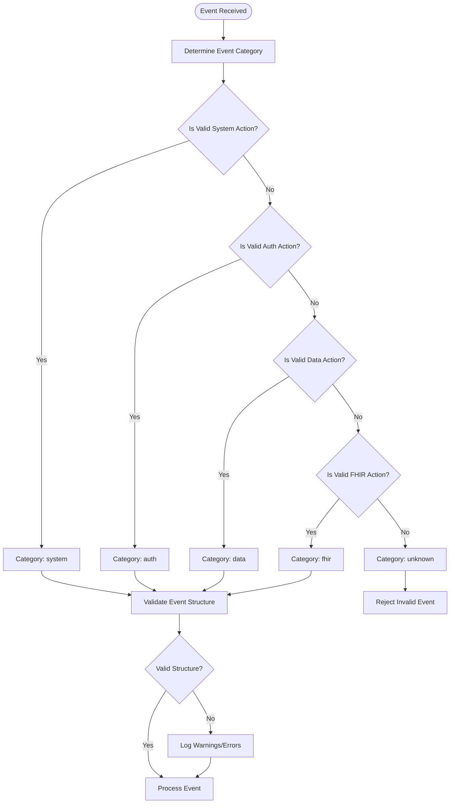
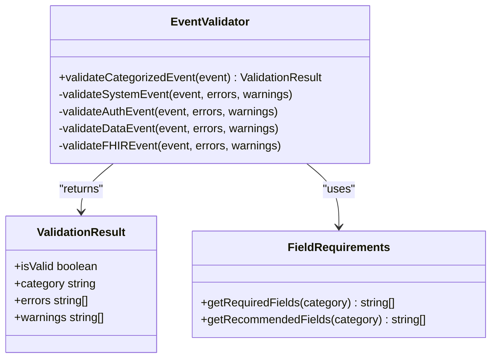
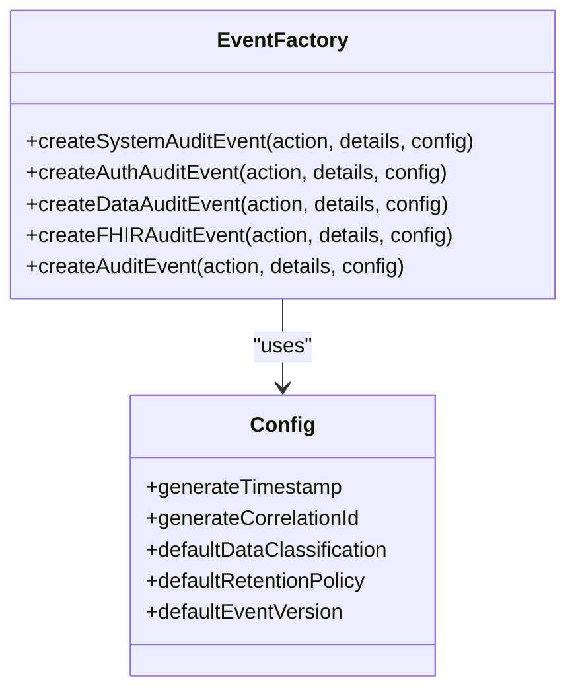
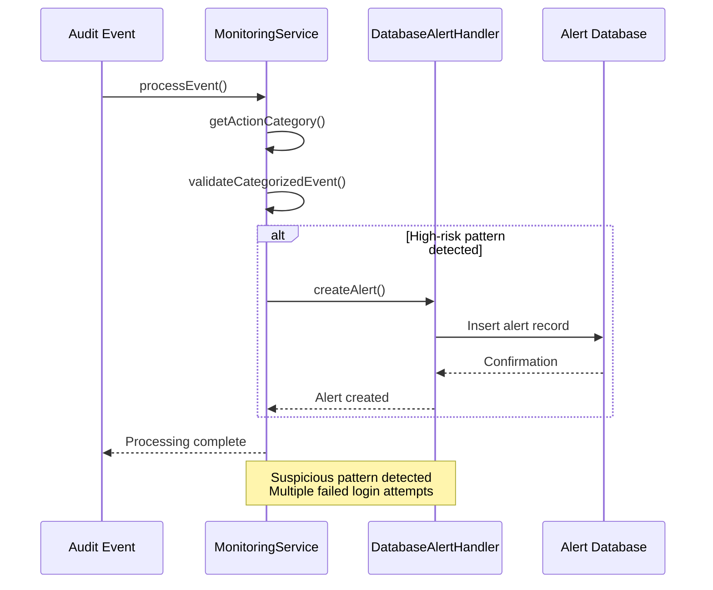

# Event Categorization Mechanism

<cite>
**Referenced Files in This Document**   
- [event-categorization.ts](file://packages\audit\src\event\event-categorization.ts) - *Updated in recent commit*
- [event-types.ts](file://packages\audit\src\event\event-types.ts) - *Updated in recent commit*
- [database-alert-integration.ts](file://packages\audit\src\examples\database-alert-integration.ts) - *Updated in recent commit*
- [event-categorization.test.ts](file://packages\audit\src\__tests__\event-categorization.test.ts) - *Updated in recent commit*
</cite>

## Update Summary
**Changes Made**   
- Updated core categorization logic to reflect actual implementation using predefined action arrays instead of string prefix matching
- Revised category-specific validation rules with accurate field requirements and validation logic
- Enhanced database event integration example with correct alert handling workflow
- Added new sections for event factory functions and recommended/required fields
- Updated all diagrams to accurately represent current code structure
- Improved downstream processing impact section with accurate storage and compliance details

## Table of Contents
1. [Introduction](#introduction)
2. [Core Categorization Logic](#core-categorization-logic)
3. [Category-Specific Validation Rules](#category-specific-validation-rules)
4. [Event Factory Functions](#event-factory-functions)
5. [Database Event Integration Example](#database-event-integration-example)
6. [Downstream Processing Impact](#downstream-processing-impact)
7. [Common Issues and Mitigations](#common-issues-and-mitigations)
8. [Extending the Categorization System](#extending-the-categorization-system)

## Introduction
The Event Categorization Mechanism is a critical component of the audit logging system that classifies raw audit events into meaningful categories based on event types and contextual metadata. This categorization enables efficient downstream processing, storage partitioning, and compliance reporting. The system uses a rule-based classification approach with exact action matching to determine the appropriate category for each audit event, ensuring consistency and accuracy in event classification across the platform.

The categorization process is implemented in the `event-categorization.ts` file and works in conjunction with the event type definitions in `event-types.ts`. The mechanism supports four primary categories: system, authentication, data, and FHIR (Fast Healthcare Interoperability Resources), each with specific validation rules and recommended fields. This document provides a comprehensive analysis of the categorization system, including its implementation details, integration examples, and guidance for extension.

## Core Categorization Logic

The event categorization system employs a precise classification approach using predefined action arrays and type guard functions. The implementation is centered around several key functions that work together to classify events and validate their structure.



**Diagram sources**   
- [event-categorization.ts](file://packages\audit\src\event\event-categorization.ts#L74-L114)

**Section sources**   
- [event-categorization.ts](file://packages\audit\src\event\event-categorization.ts#L74-L114)
- [event-categorization.test.ts](file://packages\audit\src\__tests__\event-categorization.test.ts#L0-L45)

The core categorization logic is implemented through a series of type guard functions that check whether an action string matches a specific category pattern:

- `isSystemAction(action: string)`: Determines if an action belongs to the system category by checking if it exists in the predefined `SYSTEM_ACTIONS` array
- `isAuthAction(action: string)`: Identifies authentication-related actions that exist in the `AUTH_ACTIONS` array
- `isDataAction(action: string)`: Recognizes data operations that exist in the `DATA_ACTIONS` array
- `isFHIRAction(action: string)`: Detects FHIR-specific actions that exist in the `FHIR_ACTIONS` array

The `getActionCategory` function serves as the primary categorization engine, applying these type guards in sequence to determine the appropriate category for an event. The function returns one of five possible values: 'system', 'auth', 'data', 'fhir', or 'unknown'. The `isValidAuditAction` function leverages `getActionCategory` to validate whether an action is recognized by the system, returning false for actions categorized as 'unknown'.

The categorization follows a priority order where system actions are evaluated first, followed by authentication, data, and FHIR actions. This hierarchy ensures that events are classified consistently, even if an action string could potentially match multiple patterns. The type guard functions use exact array inclusion checks rather than string prefix matching, making the categorization process more precise and maintainable.

## Category-Specific Validation Rules

Each event category has specific validation rules that ensure events contain the appropriate contextual metadata. The validation system provides both required fields (which must be present) and recommended fields (which generate warnings if missing but don't invalidate the event).



**Diagram sources**   
- [event-categorization.ts](file://packages\audit\src\event\event-categorization.ts#L155-L382)
- [event-categorization.test.ts](file://packages\audit\src\__tests__\event-categorization.test.ts#L200-L399)

**Section sources**   
- [event-categorization.ts](file://packages\audit\src\event\event-categorization.ts#L155-L382)
- [event-categorization.test.ts](file://packages\audit\src\__tests__\event-categorization.test.ts#L200-L399)

### System Event Validation
System events relate to infrastructure operations and require specific metadata depending on the action type:
- **Configuration changes**: Require `systemComponent` and `configurationChanges` fields
- **Backup operations**: Require `backupDetails` for both creation and restoration
- **Maintenance activities**: Require `maintenanceDetails` for start and completion events

The validation ensures that system events include appropriate context about which component was affected and what changes were made, supporting audit trails for compliance requirements.

### Authentication Event Validation
Authentication events track user access and security-related activities with the following requirements:
- **Principal identification**: Require `principalId` for most auth events (except session expiration)
- **Failure analysis**: Require `failureReason` for failed authentication attempts
- **MFA operations**: Require `mfaDetails` when multi-factor authentication is enabled or disabled
- **Session context**: Require `sessionContext` for login attempts and successes

These validations help security teams investigate authentication patterns and identify potential security threats.

### Data Event Validation
Data operations are validated to ensure proper tracking of data access and manipulation:
- **Resource targeting**: Require `targetResourceType` and `targetResourceId` for read, update, and delete operations
- **Export operations**: Require `exportFormat` specification
- **Data sharing**: Require `shareRecipient` information
- **Anonymization**: Require `anonymizationMethod` specification
- **PHI operations**: Recommend `outcomeDescription` for operations involving protected health information

These rules ensure that data access is properly documented, supporting both security audits and compliance with regulations like HIPAA and GDPR.

### FHIR Event Validation
FHIR-specific events have stringent validation requirements due to their healthcare context:
- **Resource identification**: Require `fhirResourceType`, `fhirResourceId`, and corresponding `patientId` or `practitionerId`
- **Bundle processing**: Require `bundleType` and `bundleSize` specifications
- **Operation outcomes**: Require `operationOutcome` for failed operations
- **Data classification**: Recommend PHI classification for all FHIR events

The FHIR validation rules are particularly important for healthcare compliance, ensuring that patient data access is properly documented and traceable.

## Event Factory Functions

The system provides factory functions to create properly categorized audit events with consistent structure and default values.



**Diagram sources**   
- [event-types.ts](file://packages\audit\src\event\event-types.ts#L150-L308)

**Section sources**   
- [event-types.ts](file://packages\audit\src\event\event-types.ts#L150-L308)

The factory functions ensure consistent event creation:
- **Default configuration**: Uses `DEFAULT_FACTORY_CONFIG` with sensible defaults
- **Timestamp generation**: Automatically adds ISO timestamp when enabled
- **Correlation IDs**: Generates unique correlation IDs for event tracking
- **Data classification**: Applies appropriate default classification (PHI for FHIR events)
- **Generic creation**: `createAuditEvent` function routes to specific factories based on action type

## Database Event Integration Example

The database alert integration example demonstrates how categorized events are used in practice, particularly for security monitoring and alerting. This example shows the complete workflow from event processing to alert generation and management.



**Diagram sources**   
- [database-alert-integration.ts](file://packages\audit\src\examples\database-alert-integration.ts#L0-L282)
- [event-categorization.ts](file://packages\audit\src\event\event-categorization.ts#L102-L114)

**Section sources**   
- [database-alert-integration.ts](file://packages\audit\src\examples\database-alert-integration.ts#L0-L282)

The integration example illustrates a scenario where multiple failed authentication events trigger an alert. When the monitoring service processes a series of `auth.login.failure` events from the same user, it recognizes a potential security threat and creates an alert through the database alert handler. The categorization system plays a crucial role in this process by:

1. Correctly identifying the events as authentication-related (`auth` category)
2. Validating that essential fields like `principalId` and `sessionContext` are present
3. Providing the structured data needed to create meaningful alerts

The example also demonstrates organizational isolation, where alerts are scoped to specific organizations to prevent cross-organizational data leakage. This is particularly important in multi-tenant environments where different healthcare providers or departments need to maintain separate audit trails.

## Downstream Processing Impact

Event categorization significantly impacts downstream processing, storage partitioning, and compliance reporting. The assigned category determines how events are stored, indexed, and made available for analysis.

### Storage Partitioning
Events are partitioned in the database based on their category, enabling more efficient queries and maintenance operations. The database schema includes a `data_classification` field that aligns with the categorization system, allowing for optimized storage of different event types:

- **System events**: Stored with extended retention for infrastructure auditing
- **Authentication events**: Indexed for rapid security analysis
- **Data events**: Subject to stricter access controls due to potential PHI content
- **FHIR events**: Stored with additional metadata for regulatory compliance

This partitioning strategy improves query performance and reduces storage costs by applying appropriate retention policies to each category.

### Compliance Reporting
The categorization system directly supports compliance reporting by enabling:
- **Regulatory-specific reports**: Generating HIPAA, GDPR, or other compliance reports by filtering on event categories
- **Access audit trails**: Creating comprehensive audit logs for data access and modifications
- **Security incident reports**: Identifying and documenting security-related events
- **Operational reports**: Tracking system performance and maintenance activities

The category assignments ensure that relevant events can be quickly identified and aggregated for compliance purposes, reducing the effort required to demonstrate regulatory adherence.

### Performance Monitoring
Categorized events enable targeted performance monitoring:
- **System category**: Tracks infrastructure performance and availability
- **Authentication category**: Monitors login patterns and potential brute force attacks
- **Data category**: Measures data access patterns and potential bottlenecks
- **FHIR category**: Monitors healthcare data exchange performance

This categorization allows operations teams to focus on specific aspects of system performance and identify issues more quickly.

## Common Issues and Mitigations

Despite the robust design of the categorization system, several common issues can arise that affect classification accuracy and system reliability.

### Ambiguous Event Types
Ambiguous event types occur when action strings don't clearly fit into a single category or when custom actions are not properly defined. For example, an action like "data.system.backup" might be misclassified if not properly structured.

**Mitigation strategies:**
- Follow consistent naming conventions (category.action.subaction)
- Use the `isValidAuditAction` function to validate actions before processing
- Implement comprehensive testing for edge cases
- Regularly review and update the categorization rules

### Misclassification Risks
Misclassification can occur due to:
- Incorrect action naming that doesn't match any predefined action
- Missing or malformed event data
- Race conditions in high-volume scenarios

**Mitigation strategies:**
- Implement the `validateCategorizedEvent` function to catch category mismatches
- Use the category mismatch validation that checks if the declared category matches the action pattern
- Add comprehensive logging for misclassified events
- Implement automated tests that verify correct categorization

### Performance Implications
Complex categorization rules can impact performance, especially under high event volumes. The current implementation uses array inclusion checks which are optimized for performance.

**Performance optimization strategies:**
- Cache frequently used categorization results
- Use efficient array operations
- Implement batch processing for high-volume scenarios
- Monitor categorization performance and optimize hot paths

The system includes performance considerations in its design, with the categorization functions optimized for speed and efficiency.

## Extending the Categorization System

The event categorization system is designed to be extensible, allowing organizations to add custom event types and domain-specific rules.

### Adding Custom Event Types
To add custom event types, follow these steps:
1. Define the action string using the pattern "category.action.subaction"
2. Update the appropriate type guard function in `event-types.ts`
3. Add validation rules in the corresponding validation function
4. Update the `getActionsForCategory` function to include the new action

For example, to add a custom healthcare event:
```typescript
// Add to FHIR_ACTIONS array
const FHIR_ACTIONS: readonly FHIRAuditAction[] = [
	'fhir.patient.read',
	'fhir.patient.create',
	'fhir.patient.update',
	'fhir.practitioner.read',
	'fhir.observation.create',
	'fhir.bundle.process',
	'fhir.appointment.schedule' // New custom action
] as const;

// Add validation in validateFHIREvent
if (event.action === 'fhir.appointment.schedule' && !event.appointmentDetails) {
    warnings.push('Appointment details not provided for appointment scheduling');
}
```

### Domain-Specific Rules
Organizations can implement domain-specific rules by:
- Creating custom validation functions for specialized event types
- Extending the recommended fields for specific categories
- Implementing custom alerting rules based on event patterns
- Adding organization-specific metadata requirements

The system's modular design makes it easy to extend without modifying core functionality. Custom rules can be implemented in separate modules that integrate with the existing categorization framework.

### Best Practices for Extension
When extending the categorization system:
- Maintain consistent naming conventions across all event types
- Document new event types and their intended use
- Implement comprehensive tests for new categorization rules
- Consider the impact on downstream processing and reporting
- Review extensions regularly to ensure they remain relevant and effective

The extensibility of the system ensures that it can adapt to evolving business requirements while maintaining the integrity of the audit logging framework.