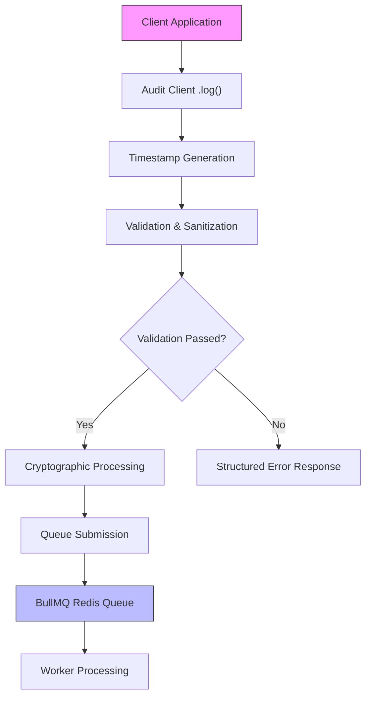

# Event Ingestion Pipeline

<cite>
**Referenced Files in This Document**   
- [types.ts](file://packages/audit/src/types.ts)
- [validation.ts](file://packages/audit/src/validation.ts)
- [audit.test.ts](file://packages/audit/src/__tests__/audit.test.ts)
- [api-reference.md](file://apps/docs/src/content/docs/audit/api-reference.md)
- [audit.md](file://apps/docs/src/content/docs/audit/audit.md)
</cite>

## Table of Contents
1. [Introduction](#introduction)
2. [Event Payload Structure](#event-payload-structure)
3. [Ingestion Flow Overview](#ingestion-flow-overview)
4. [Schema Validation with Zod](#schema-validation-with-zod)
5. [Metadata Enrichment Process](#metadata-enrichment-process)
6. [Error Handling and Response](#error-handling-and-response)
7. [Validation Performance Considerations](#validation-performance-considerations)
8. [Common Ingestion Issues and Solutions](#common-ingestion-issues-and-solutions)
9. [Best Practices for Event Producers](#best-practices-for-event-producers)
10. [Conclusion](#conclusion)

## Introduction

The Event Ingestion Pipeline is the core mechanism for capturing, validating, and processing audit events within the SMEDREC platform. It ensures that all system actions are securely logged with integrity, compliance, and reliability. This document details the complete lifecycle of an audit event from initial receipt through normalization, schema validation using Zod, metadata enrichment, and final queuing for downstream processing.

The pipeline is designed to handle high-throughput scenarios while maintaining strict data integrity and security standards. It leverages cryptographic hashing, HMAC signatures, and comprehensive validation rules to ensure that only properly structured and authorized events are persisted.

**Section sources**
- [audit.md](file://apps/docs/src/content/docs/audit/audit.md#L1-L100)

## Event Payload Structure

The structure of an audit event is defined by the `AuditLogEvent` interface, which specifies both required and optional fields for comprehensive event tracking.

### Core Event Fields

The following fields are essential components of every audit event:

**:timestamp**
- **Type**: string (ISO 8601 format)
- **Requirement**: Required
- **Example**: `"2023-10-26T10:30:00.000Z"`
- Automatically generated if not provided during ingestion

**:action**
- **Type**: string
- **Requirement**: Required
- **Example**: `"fhirPatientRead"`, `"userLogin"`, `"cerbosAuthCheck"`
- Should follow standardized verbNoun format for consistency

**:status**
- **Type**: `AuditEventStatus` ('attempt' | 'success' | 'failure')
- **Requirement**: Required
- Indicates the outcome of the attempted action

### Contextual Metadata Fields

**:principalId**
- **Type**: string
- **Optional**: Yes
- Identifier for the user or system principal that initiated the action
- **Example**: `"user-12345"`, `"system-service-abc"`

**:organizationId**
- **Type**: string
- **Optional**: Yes
- Identifier for the organization in multi-tenant systems
- **Example**: `"org-67890"`

**:targetResourceType**
- **Type**: string
- **Optional**: Yes
- Type of resource affected by the action
- **Example**: `"Patient"`, `"Practitioner"`, `"Document"`

**:targetResourceId**
- **Type**: string
- **Optional**: Yes
- Specific identifier of the target resource
- **Example**: `"pat-abc-123"`, `"doc-xyz-789"`

### Security and Compliance Fields

**:dataClassification**
- **Type**: `DataClassification` ('PUBLIC' | 'INTERNAL' | 'CONFIDENTIAL' | 'PHI')
- **Optional**: Yes
- Default: `"INTERNAL"`
- Critical for HIPAA and GDPR compliance

**:hash**
- **Type**: string
- **Optional**: Yes
- Cryptographic hash (SHA-256) for immutability verification
- Generated automatically when requested

**:signature**
- **Type**: string
- **Optional**: Yes
- HMAC-SHA256 signature for additional security
- Generated using secret key when requested

### Session Context

The `SessionContext` interface provides client-specific information:

```typescript
interface SessionContext {
	sessionId: string
	ipAddress: string
	userAgent: string
	geolocation?: string
}
```

This context helps in forensic analysis and security monitoring by capturing the environment from which the action was initiated.

### Custom Fields

The event schema supports arbitrary additional fields through index signature:

```typescript
[key: string]: any
```

This allows for flexible extension of events with context-specific data while maintaining a consistent core structure.

**Section sources**
- [types.ts](file://packages/audit/src/types.ts#L50-L200)

## Ingestion Flow Overview

The event ingestion process follows a well-defined sequence to ensure data integrity and reliability:



**Diagram sources**
- [api-reference.md](file://apps/docs/src/content/docs/audit/api-reference.md#L20-L100)
- [validation.ts](file://packages/audit/src/validation.ts#L100-L200)

**Section sources**
- [api-reference.md](file://apps/docs/src/content/docs/audit/api-reference.md#L20-L100)

## Schema Validation with Zod

The validation system enforces data integrity through comprehensive schema validation implemented in `validation.ts`. While the code shows custom validation functions, the architecture is designed to support Zod for type-safe schema definition.

### Validation Configuration

The `ValidationConfig` interface defines configurable validation rules:

**:maxStringLength**
- **Default**: 10,000 characters
- Prevents excessively large string fields

**:allowedDataClassifications**
- **Default**: ['PUBLIC', 'INTERNAL', 'CONFIDENTIAL', 'PHI']
- Ensures compliance with data sensitivity policies

**:requiredFields**
- **Default**: ['timestamp', 'action', 'status']
- Core fields that must be present

**:maxCustomFieldDepth**
- **Default**: 3 levels
- Prevents deeply nested objects that could impact performance

**:allowedEventVersions**
- **Default**: ['1.0', '1.1', '2.0']
- Supports versioned event schemas for backward compatibility

### Field-Level Validation Rules


**Diagram sources**
- [validation.ts](file://packages/audit/src/validation.ts#L150-L300)

**Section sources**
- [validation.ts](file://packages/audit/src/validation.ts#L150-L300)

## Metadata Enrichment Process

During ingestion, several metadata fields are automatically enriched to ensure completeness and consistency.

### Automatic Timestamp Generation

If the `timestamp` field is omitted, it is automatically populated with the current ISO 8601 timestamp:

```typescript
if (!event.timestamp) {
  event.timestamp = new Date().toISOString();
}
```

This ensures that every event has a precise time reference even if the client fails to provide one.

### Data Classification Normalization

The `dataClassification` field is automatically normalized to uppercase:

```typescript
if (sanitizedEvent.dataClassification) {
  const normalized = sanitizedEvent.dataClassification.toUpperCase() as DataClassification
  if (normalized !== sanitizedEvent.dataClassification) {
    sanitizedEvent.dataClassification = normalized
    modified = true
  }
}
```

This prevents inconsistencies due to case variations.

### Cryptographic Enrichment

When requested, the system automatically generates security artifacts:

**:generateEventHash()**
- Uses SHA-256 algorithm
- Applied to the entire event object
- Ensures data integrity

**:generateEventSignature()**
- Uses HMAC-SHA256 with secret key
- Provides authentication and non-repudiation

These can be enabled via the `options` parameter in the `log()` method.

**Section sources**
- [validation.ts](file://packages/audit/src/validation.ts#L500-L600)

## Error Handling and Response

The ingestion pipeline provides structured error handling to help clients diagnose and correct issues.

### Validation Error Structure

The `AuditValidationError` class provides detailed error information:

**:field**
- Name of the field that failed validation
- Supports nested paths (e.g., "sessionContext.ipAddress")

**:value**
- The actual value that was provided
- Useful for debugging

**:code**
- Standardized error code for programmatic handling
- Examples: 'REQUIRED_FIELD_MISSING', 'INVALID_TYPE', 'EXCEEDS_MAX_LENGTH'

### Validation Result Interface

```typescript
interface ValidationResult {
	isValid: boolean
	errors: AuditValidationError[]
	warnings: string[]
}
```

This structure allows clients to receive comprehensive feedback about validation issues.

### Example Error Responses

**Missing Required Field**
```json
{
  "isValid": false,
  "errors": [
    {
      "message": "Required field 'action' is missing",
      "field": "action",
      "value": null,
      "code": "REQUIRED_FIELD_MISSING"
    }
  ],
  "warnings": []
}
```

**Invalid Format**
```json
{
  "isValid": false,
  "errors": [
    {
      "message": "Timestamp must be a valid ISO 8601 string",
      "field": "timestamp",
      "value": "2023-13-45",
      "code": "INVALID_FORMAT"
    }
  ],
  "warnings": []
}
```

**Section sources**
- [validation.ts](file://packages/audit/src/validation.ts#L10-L50)

## Validation Performance Considerations

The validation system is optimized for high-throughput scenarios with several performance-focused design decisions.

### Efficient Validation Order

The validation process follows an optimized order:

1. **Required field checks** - Fast property existence checks
2. **Type validation** - Simple typeof checks
3. **Format validation** - More expensive regex/parsing operations
4. **Custom field depth** - Recursive but depth-limited

This ordering ensures that most validation failures are caught quickly with minimal processing.

### Depth-Limited Recursion

Custom field validation is limited to prevent performance degradation:

```typescript
function validateCustomFieldsDepth(
	obj: any,
	maxDepth: number,
	currentDepth: number = 0,
	path: string = ''
): AuditValidationError[] {
	if (currentDepth > maxDepth) {
		// Return early on depth violation
		return [new AuditValidationError(/* ... */)];
	}
	// Continue with recursion
}
```

The default maximum depth of 3 ensures that deeply nested objects don't cause excessive processing.

### Caching Opportunities

While not currently implemented, the architecture supports validation rule caching:

- **Schema compilation caching** - Zod schemas can be compiled once and reused
- **Frequent pattern caching** - Common validation patterns can be pre-compiled
- **Result caching** - For idempotent operations with identical payloads

These optimizations could be implemented to further improve throughput in high-volume scenarios.

**Section sources**
- [validation.ts](file://packages/audit/src/validation.ts#L300-L400)

## Common Ingestion Issues and Solutions

### Malformed JSON

**Issue**: Invalid JSON structure in the request body
- **Symptom**: `SyntaxError: Unexpected token` during parsing
- **Solution**: Validate JSON structure before submission using JSON linters

### Missing Required Fields

**Issue**: Omitting required fields (timestamp, action, status)
- **Example**: 
```json
{
  "principalId": "user-123",
  "action": "userLogin"
  // Missing 'status' field
}
```
- **Solution**: Always include all required fields; use client-side validation

### Type Mismatches

**Issue**: Providing incorrect data types
- **Common cases**:
  - Number instead of string for `action`
  - Boolean instead of string for `dataClassification`
  - Invalid ISO 8601 format for `timestamp`

**Example Invalid Payload**:
```json
{
  "timestamp": 1698312600000, // Unix timestamp (number) instead of ISO string
  "action": "userLogin",
  "status": "success",
  "processingLatency": "150" // String instead of number
}
```

**Solution**: Ensure proper type conversion before submission

### Exceeding Length Limits

**Issue**: String fields exceeding maximum length (10,000 characters)
- **Common culprits**: `outcomeDescription`, custom fields with large payloads
- **Solution**: Truncate or summarize long descriptions; use references to external logs

### Invalid Enumerated Values

**Issue**: Using values not in allowed lists
- **Examples**:
  - `status: "succeeded"` instead of `"success"`
  - `dataClassification: "private"` instead of `"CONFIDENTIAL"`

**Solution**: Use exact values from the allowed lists; implement client-side enums

### Session Context Issues

**Issue**: Invalid or missing session context
- **Common problems**:
  - Missing `sessionId`, `ipAddress`, or `userAgent`
  - Invalid IP address format
  - Empty strings for required session fields

**Solution**: Validate session context completeness and format before submission

**Section sources**
- [validation.ts](file://packages/audit/src/validation.ts#L100-L600)
- [audit.test.ts](file://packages/audit/src/__tests__/audit.test.ts#L10-L100)

## Best Practices for Event Producers

### Client-Side Validation

Implement pre-submission validation to reduce server-side errors:

```typescript
// Example client-side validation
function validateEventLocally(event: Partial<AuditLogEvent>): string[] {
  const errors: string[] = [];
  
  if (!event.action || typeof event.action !== 'string') {
    errors.push('Action is required and must be a string');
  }
  
  if (!['attempt', 'success', 'failure'].includes(event.status || '')) {
    errors.push('Status must be one of: attempt, success, failure');
  }
  
  return errors;
}
```

### Batch Processing

For high-volume scenarios, consider batching events:

- **Benefits**:
  - Reduced network overhead
  - Fewer connection establishments
  - Better throughput

- **Considerations**:
  - Increased memory usage
  - Higher risk of data loss if batch fails
  - More complex error handling

### Error Handling Strategy

Implement robust error handling for failed submissions:

```typescript
async function sendWithRetry(event: AuditLogEvent, maxRetries = 3) {
  for (let i = 0; i <= maxRetries; i++) {
    try {
      await auditClient.log(event);
      return; // Success
    } catch (error) {
      if (i === maxRetries) throw error;
      await sleep(1000 * Math.pow(2, i)); // Exponential backoff
    }
  }
}
```

### Monitoring and Metrics

Track key metrics for ingestion health:

- **Success rate**: Percentage of successful submissions
- **Latency**: Time from submission to acknowledgment
- **Error distribution**: Types of validation errors encountered
- **Throughput**: Events processed per second

### Security Considerations

- **Avoid logging sensitive data** directly in event details
- **Use references** to external logs instead of embedding large payloads
- **Implement proper access controls** for event submission endpoints
- **Rotate cryptographic secrets** regularly

### Testing Strategy

Comprehensive testing should include:

- **Valid payloads** with all required and optional fields
- **Edge cases** (maximum length strings, boundary values)
- **Invalid payloads** to verify proper error handling
- **Performance testing** under high load conditions

**Section sources**
- [api-reference.md](file://apps/docs/src/content/docs/audit/api-reference.md#L20-L200)
- [audit.md](file://apps/docs/src/content/docs/audit/audit.md#L50-L100)

## Conclusion

The Event Ingestion Pipeline provides a robust, secure, and efficient mechanism for capturing audit events in the SMEDREC platform. By enforcing strict schema validation, providing comprehensive error handling, and supporting cryptographic integrity verification, it ensures that audit logs are reliable and compliant with regulatory requirements.

The pipeline's design balances thorough validation with performance considerations, making it suitable for high-throughput scenarios while maintaining data integrity. Client applications should implement proper validation and error handling to minimize ingestion failures and optimize system performance.

By following the best practices outlined in this document, developers can ensure smooth integration with the audit system and maintain the highest standards of security and compliance in their applications.