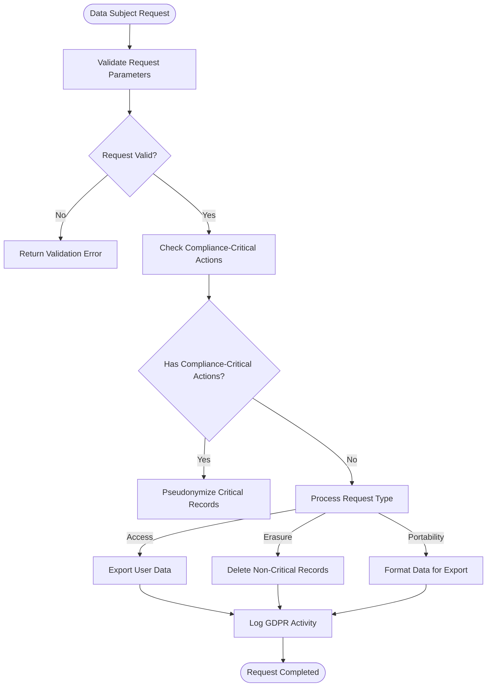
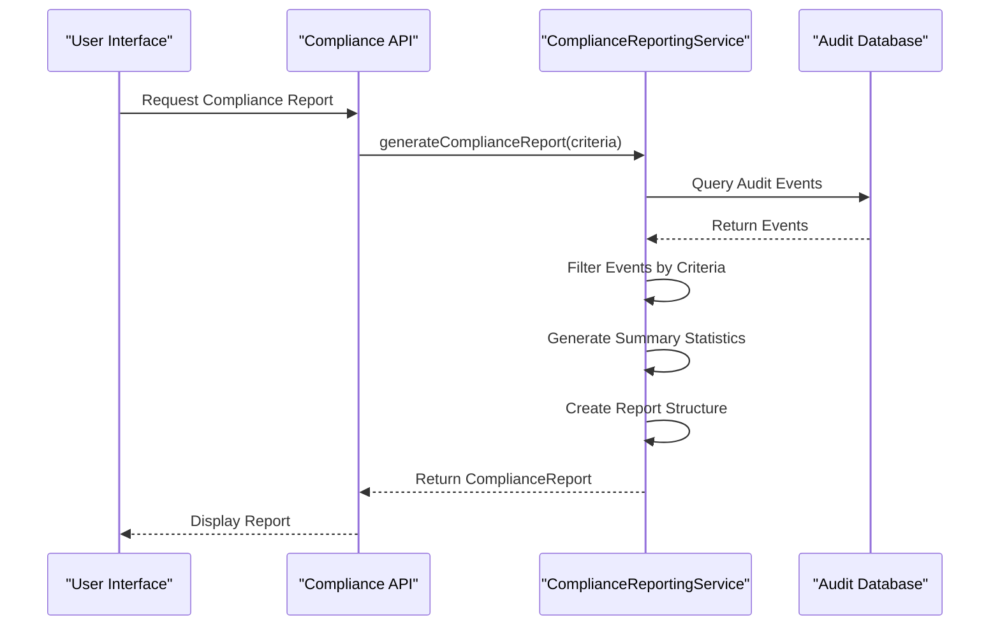
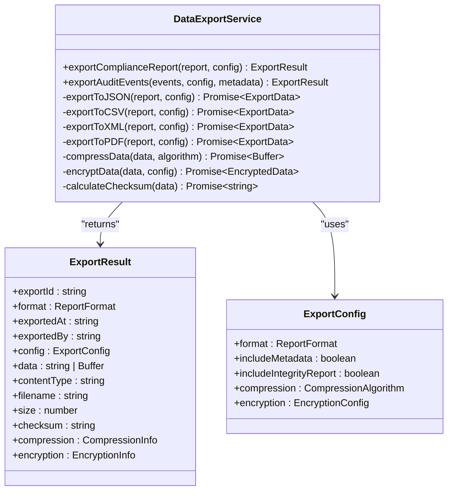
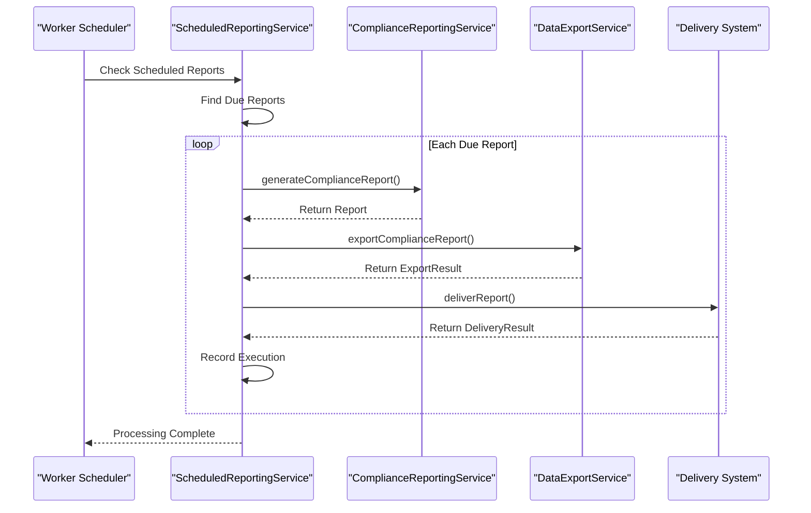

# Compliance Engine

<cite>
**Referenced Files in This Document**   
- [compliance-reporting.test.ts](file://packages/audit/src/__tests__/compliance-reporting.test.ts) - *Updated in recent commit*
- [gdpr-utils.ts](file://packages/audit/src/gdpr/gdpr-utils.ts) - *Updated in recent commit*
- [compliance-reporting.ts](file://packages/audit/src/report/compliance-reporting.ts) - *Updated in recent commit*
- [scheduled-reporting.ts](file://packages/audit/src/report/scheduled-reporting.ts)
- [gdpr-compliance.ts](file://packages/audit/src/gdpr/gdpr-compliance.ts) - *Updated in recent commit*
- [data-export.ts](file://packages/audit/src/report/data-export.ts)
- [archival-service.ts](file://packages/audit/src/archival/archival-service.ts)
</cite>

## Update Summary
- Enhanced documentation for GDPR pseudonymization and audit trail reporting
- Updated section sources to reflect recent code changes
- Added new pseudonymization strategy details in GDPR compliance implementation
- Updated compliance reporting system with enhanced pseudonymization status tracking
- Maintained consistency with existing documentation structure while incorporating new features

## Table of Contents
1. [Introduction](#introduction)
2. [GDPR Compliance Implementation](#gdpr-compliance-implementation)
3. [Compliance Reporting System](#compliance-reporting-system)
4. [Data Export Functionality](#data-export-functionality)
5. [Scheduled Reporting with Worker Services](#scheduled-reporting-with-worker-services)
6. [Handling Deletion Requests and Audit Integrity](#handling-deletion-requests-and-audit-integrity)
7. [Best Practices for Passing Compliance Audits](#best-practices-for-compliance-audits)

## Introduction
The Compliance Engine is a comprehensive system designed to ensure regulatory adherence, particularly with GDPR and HIPAA standards. It provides robust mechanisms for handling data subject rights, generating compliance reports, managing data exports, and preserving audit integrity. This document details the technical implementation of these features, focusing on key components such as GDPR compliance, report generation, data export, and scheduled reporting workflows.

## GDPR Compliance Implementation

The GDPR compliance system is implemented through two primary components: `GDPRComplianceService` and `GDPRUtils`. These modules handle data subject rights, anonymization techniques, and retention policies in accordance with GDPR Article 17 (Right to Erasure) and Article 20 (Right to Data Portability).

### Data Subject Rights Handling
The `GDPRComplianceService` class provides methods for processing all major data subject rights:
- **Access**: Retrieve all personal data associated with a user
- **Rectification**: Update or correct inaccurate personal data
- **Erasure**: Delete personal data upon request
- **Portability**: Export data in a structured, machine-readable format
- **Restriction**: Limit processing of personal data



**Diagram sources**
- [gdpr-compliance.ts](file://packages/audit/src/gdpr/gdpr-compliance.ts#L1-L697) - *Updated in recent commit*
- [gdpr-utils.ts](file://packages/audit/src/gdpr/gdpr-utils.ts#L1-L296) - *Updated in recent commit*

**Section sources**
- [gdpr-compliance.ts](file://packages/audit/src/gdpr/gdpr-compliance.ts#L1-L697) - *Updated in recent commit*

### Anonymization Techniques in gdpr-utils
The `GDPRUtils` class provides several anonymization techniques to protect personal data while maintaining referential integrity:

#### Deterministic Pseudonymization
Generates consistent pseudonyms using SHA-256 hashing with a configurable salt:
```typescript
static generateDeterministicPseudonym(originalId: string, salt?: string): string {
    const effectiveSalt = salt || process.env.GDPR_PSEUDONYM_SALT || 'default-gdpr-salt'
    const hash = createHash('sha256')
        .update(originalId + effectiveSalt)
        .digest('hex')
    return `pseudo-${hash.substring(0, 16)}`
}
```

#### Random Pseudonymization
Generates unique, non-deterministic pseudonyms using cryptographically secure random bytes:
```typescript
static generateRandomPseudonym(): string {
    return `pseudo-${randomBytes(16).toString('hex')}`
}
```

#### Data Sanitization
Removes sensitive system fields before data export:
```typescript
static sanitizeForExport(data: any[]): any[] {
    return data.map((record) => {
        const sanitized = { ...record }
        delete sanitized.hash
        delete sanitized.hashAlgorithm
        delete sanitized.signature
        // ... other internal fields
        return sanitized
    })
}
```

**Section sources**
- [gdpr-utils.ts](file://packages/audit/src/gdpr/gdpr-utils.ts#L1-L296) - *Updated in recent commit*

### Audit Trail Preservation Requirements
The system preserves audit trails for compliance-critical actions even when processing deletion requests. The `isComplianceCriticalAction` method identifies actions that must be retained:

```typescript
static isComplianceCriticalAction(action: string): boolean {
    const complianceCriticalActions = [
        'auth.login.success',
        'auth.login.failure',
        'auth.logout',
        'data.access.unauthorized',
        'data.breach.detected',
        'gdpr.data.export',
        'gdpr.data.pseudonymize',
        'gdpr.data.delete',
        'gdpr.retention.apply',
        'security.alert.generated',
        'compliance.audit.performed',
        'system.backup.created',
        'system.backup.restored',
    ]

    return (
        complianceCriticalActions.includes(action) ||
        action.includes('security.') ||
        action.includes('compliance.') ||
        action.includes('gdpr.')
    )
}
```

Critical actions are not deleted but instead pseudonymized to maintain audit integrity while respecting user privacy rights.

**Section sources**
- [gdpr-utils.ts](file://packages/audit/src/gdpr/gdpr-utils.ts#L1-L296) - *Updated in recent commit*

## Compliance Reporting System

The compliance reporting system provides on-demand and scheduled generation of regulatory reports in multiple formats. The core implementation is in `compliance-reporting.ts`, with test cases defined in `compliance-reporting.test.ts`.

### Report Generation
The `ComplianceReportingService` generates reports based on configurable criteria:



**Diagram sources**
- [compliance-reporting.ts](file://packages/audit/src/report/compliance-reporting.ts#L1-L952) - *Updated in recent commit*
- [compliance-reporting.test.ts](file://packages/audit/src/__tests__/compliance-reporting.test.ts#L1-L436) - *Updated in recent commit*

**Section sources**
- [compliance-reporting.ts](file://packages/audit/src/report/compliance-reporting.ts#L1-L952) - *Updated in recent commit*

### Report Criteria and Filtering
Reports can be filtered using the `ReportCriteria` interface:

```typescript
export interface ReportCriteria {
    dateRange: {
        startDate: string
        endDate: string
    }
    principalIds?: string[]
    organizationIds?: string[]
    actions?: string[]
    dataClassifications?: DataClassification[]
    statuses?: Array<'attempt' | 'success' | 'failure'>
    resourceTypes?: string[]
    verifiedOnly?: boolean
    includeIntegrityFailures?: boolean
    limit?: number
    offset?: number
    sortBy?: 'timestamp' | 'status'
    sortOrder?: 'asc' | 'desc'
}
```

Test cases verify various filtering scenarios:
- Filtering by principal ID
- Filtering by data classification (e.g., PHI)
- Applying pagination (limit and offset)
- Filtering by integrity verification status

**Section sources**
- [compliance-reporting.ts](file://packages/audit/src/report/compliance-reporting.ts#L1-L952) - *Updated in recent commit*
- [compliance-reporting.test.ts](file://packages/audit/src/__tests__/compliance-reporting.test.ts#L1-L436) - *Updated in recent commit*

### Export Formats and Retention Policies
The system supports multiple export formats for compliance reports:
- JSON: Structured data for programmatic analysis
- CSV: Spreadsheet format for manual review
- XML: Standardized format for system integration
- PDF: Formal reporting with styling

Retention policies are calculated based on data classification:
```typescript
static getRecommendedRetentionPolicy(dataClassification: string): {
    retentionDays: number
    archiveAfterDays: number
    deleteAfterDays: number
} {
    switch (dataClassification) {
        case 'PHI':
            return { retentionDays: 730, archiveAfterDays: 365, deleteAfterDays: 730 }
        case 'CONFIDENTIAL':
            return { retentionDays: 365, archiveAfterDays: 180, deleteAfterDays: 365 }
        case 'INTERNAL':
            return { retentionDays: 180, archiveAfterDays: 90, deleteAfterDays: 180 }
        default:
            return { retentionDays: 90, archiveAfterDays: 30, deleteAfterDays: 90 }
    }
}
```

**Section sources**
- [compliance-reporting.ts](file://packages/audit/src/report/compliance-reporting.ts#L1-L952) - *Updated in recent commit*
- [gdpr-utils.ts](file://packages/audit/src/gdpr/gdpr-utils.ts#L1-L296) - *Updated in recent commit*

## Data Export Functionality

The technical design of data export functionality is implemented in the `DataExportService` class, which integrates with archival systems to ensure secure and compliant data handling.

### Technical Design
The `DataExportService` provides a unified interface for exporting compliance reports in various formats:



**Diagram sources**
- [data-export.ts](file://packages/audit/src/report/data-export.ts#L1-L580)

**Section sources**
- [data-export.ts](file://packages/audit/src/report/data-export.ts#L1-L580)

### Integration with Archival Systems
The export service integrates with archival systems through several mechanisms:
- **Compression**: Supports gzip and zip algorithms to reduce storage requirements
- **Encryption**: Provides AES-256-GCM encryption with configurable key management
- **Checksums**: Generates SHA-256 checksums for integrity verification
- **Metadata**: Includes comprehensive metadata for audit trail purposes

When exporting data for archival, the service applies the following workflow:
1. Format data according to specified format (JSON, CSV, XML, PDF)
2. Apply compression if configured
3. Encrypt data if required
4. Calculate checksum for integrity verification
5. Package with metadata including retention policies
6. Return export result for storage

**Section sources**
- [data-export.ts](file://packages/audit/src/report/data-export.ts#L1-L580)

## Scheduled Reporting with Worker Services

Scheduled reporting is implemented through the `ScheduledReportingService` class, which works with worker services to generate periodic compliance summaries.

### Architecture
The scheduled reporting system consists of:
- **Report Templates**: Reusable configurations for common report types
- **Scheduled Report Configurations**: Individual scheduled jobs with timing and delivery settings
- **Delivery Configurations**: Settings for email, webhook, or storage delivery
- **Execution Tracking**: Records of report generation and delivery attempts



**Diagram sources**
- [scheduled-reporting.ts](file://packages/audit/src/report/scheduled-reporting.ts#L1-L988)
- [compliance-reporting.ts](file://packages/audit/src/report/compliance-reporting.ts#L1-L952) - *Updated in recent commit*

**Section sources**
- [scheduled-reporting.ts](file://packages/audit/src/report/scheduled-reporting.ts#L1-L988)

### Configuration and Delivery
Reports can be scheduled with various frequencies:
- Daily
- Weekly
- Monthly
- Quarterly

Delivery methods include:
- **Email**: With configurable SMTP settings and templates
- **Webhook**: For integration with other systems
- **Storage**: Direct saving to local, S3, Azure, or GCP storage

The system includes retry logic with exponential backoff for failed deliveries:
```typescript
webhook?: {
    url: string
    method: 'POST' | 'PUT'
    headers: Record<string, string>
    timeout: number
    retryConfig: {
        maxRetries: number
        backoffMultiplier: number
        maxBackoffDelay: number
    }
}
```

**Section sources**
- [scheduled-reporting.ts](file://packages/audit/src/report/scheduled-reporting.ts#L1-L988)

## Handling Deletion Requests and Audit Integrity

A common challenge in compliance systems is handling deletion requests while maintaining audit integrity. The system addresses this through a sophisticated approach that balances GDPR requirements with regulatory obligations.

### Challenge Analysis
The primary challenge is that GDPR Article 17 grants users the right to erasure, while various regulations require preservation of audit trails for security and compliance purposes. Simply deleting all data would violate audit requirements, while retaining all data would violate user rights.

### Solution Implementation
The system implements a hybrid approach:
1. **Identify compliance-critical actions** using `GDPRUtils.isComplianceCriticalAction()`
2. **Pseudonymize critical records** instead of deleting them
3. **Delete non-critical records** associated with the user
4. **Log all GDPR activities** for audit purposes

```typescript
async deleteUserDataWithAuditTrail(
    principalId: string,
    requestedBy: string,
    preserveComplianceRecords: boolean = true
): Promise<DeletionResult> {
    let recordsDeleted = 0
    let complianceRecordsPreserved = 0

    if (preserveComplianceRecords) {
        // Get compliance-critical actions for this user
        const complianceActions = [
            'auth.login.success', 'auth.login.failure', 'auth.logout',
            'data.access.unauthorized', 'data.breach.detected',
            'gdpr.data.export', 'gdpr.data.pseudonymize', 'gdpr.data.delete',
            'security.alert.generated', 'compliance.audit.performed'
        ]

        // Pseudonymize compliance records
        const complianceResult = await this.pseudonymizeUserData(principalId, 'hash', requestedBy)
        complianceRecordsPreserved = complianceResult.recordsAffected

        // Delete non-compliance records
        const deleteResult = await this.db
            .delete(auditLog)
            .where(
                and(
                    eq(auditLog.principalId, principalId),
                    sql`NOT (${auditLog.action} = ANY(${complianceActions}))`
                )
            )
        recordsDeleted = (deleteResult as any).rowCount || 0
    } else {
        // Delete all records for the user
        const deleteResult = await this.db
            .delete(auditLog)
            .where(eq(auditLog.principalId, principalId))
        recordsDeleted = (deleteResult as any).rowCount || 0
    }

    // Log the deletion activity
    await this.logGDPRActivity({
        timestamp: new Date().toISOString(),
        principalId: requestedBy,
        action: 'gdpr.data.delete',
        status: 'success',
        targetResourceType: 'AuditLog',
        targetResourceId: principalId,
        outcomeDescription: `GDPR deletion completed for user ${principalId}`,
        dataClassification: 'PHI',
        retentionPolicy: 'gdpr_compliance',
        details: {
            recordsDeleted,
            complianceRecordsPreserved,
            preserveComplianceRecords
        },
    })

    return { recordsDeleted, complianceRecordsPreserved }
}
```

**Section sources**
- [gdpr-compliance.ts](file://packages/audit/src/gdpr/gdpr-compliance.ts#L1-L697) - *Updated in recent commit*
- [archival-service.ts](file://packages/audit/src/archival/archival-service.ts#L1-L859)

### Verification and Testing
The system includes comprehensive tests to verify the deletion logic:
- Tests for erasure requests with compliance preservation
- Tests for complete erasure requests
- Tests for handling empty audit logs
- Tests for validation of GDPR requests

These tests ensure that the system correctly handles edge cases and maintains data integrity.

**Section sources**
- [gdpr-compliance.test.ts](file://packages/audit/src/__tests__/gdpr-compliance.test.ts#L1-L416)
- [gdpr-integration.test.ts](file://packages/audit-db/src/__tests__/gdpr-integration.test.ts#L1-L167)

## Best Practices for Passing Compliance Audits

To ensure successful compliance audits, follow these best practices derived from the system's implementation:

### 1. Maintain Complete Audit Trails
- Log all GDPR-related activities (exports, deletions, access requests)
- Preserve records of compliance-critical actions
- Use cryptographic hashing to ensure data integrity
- Implement proper timestamping and sequencing

### 2. Implement Data Minimization
- Only collect and retain data necessary for business purposes
- Apply appropriate retention policies based on data classification
- Regularly review and purge unnecessary data
- Use pseudonymization to reduce privacy risks

### 3. Ensure Data Subject Rights Fulfillment
- Provide timely responses to data subject requests (within 30 days)
- Offer data in commonly used formats (JSON, CSV)
- Document all request processing activities
- Implement proper authentication for request verification

### 4. Secure Data Exports
- Apply encryption to exported data
- Use compression to reduce storage footprint
- Generate checksums for integrity verification
- Include metadata for audit purposes
- Implement access controls for exported files

### 5. Automate Compliance Reporting
- Schedule regular compliance reports (daily, weekly, monthly)
- Distribute reports to relevant stakeholders
- Maintain archives of historical reports
- Verify report integrity and delivery

### 6. Test Compliance Workflows
- Regularly test data export and deletion processes
- Validate that pseudonymization works correctly
- Verify that compliance-critical records are preserved
- Conduct penetration testing on compliance APIs

### 7. Document Policies and Procedures
- Maintain up-to-date documentation of compliance processes
- Train staff on GDPR requirements and procedures
- Keep records of consent and legal basis for processing
- Document data flow and system architecture

By following these best practices and leveraging the Compliance Engine's robust features, organizations can confidently pass compliance audits and demonstrate their commitment to data protection and regulatory adherence.

**Section sources**
- [gdpr-compliance.ts](file://packages/audit/src/gdpr/gdpr-compliance.ts#L1-L697) - *Updated in recent commit*
- [compliance-reporting.ts](file://packages/audit/src/report/compliance-reporting.ts#L1-L952) - *Updated in recent commit*
- [scheduled-reporting.ts](file://packages/audit/src/report/scheduled-reporting.ts#L1-L988)
- [data-export.ts](file://packages/audit/src/report/data-export.ts#L1-L580)
- [gdpr-utils.ts](file://packages/audit/src/gdpr/gdpr-utils.ts#L1-L296) - *Updated in recent commit*