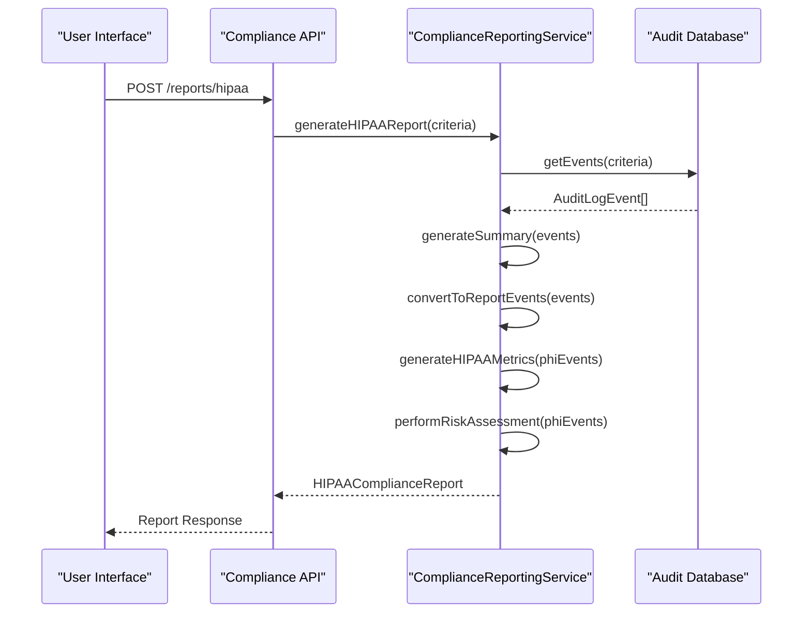
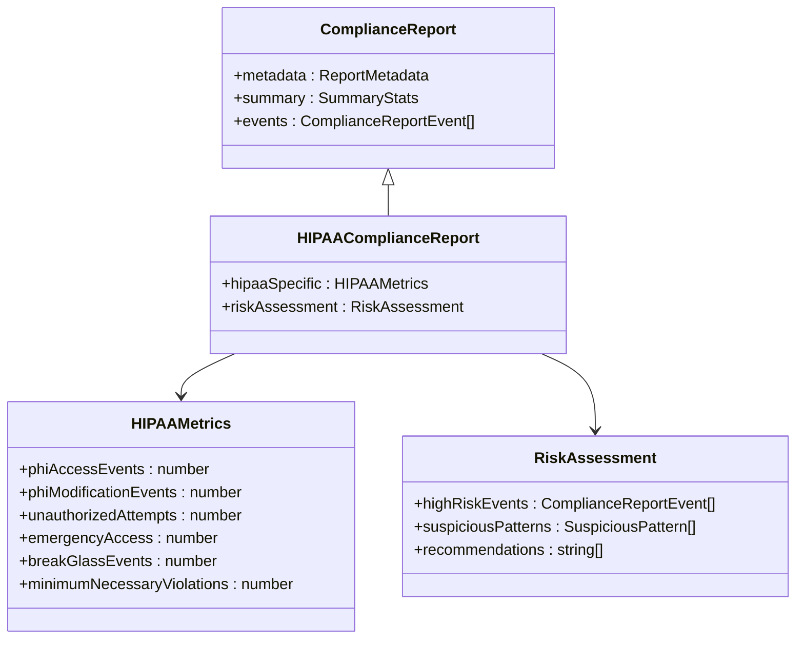
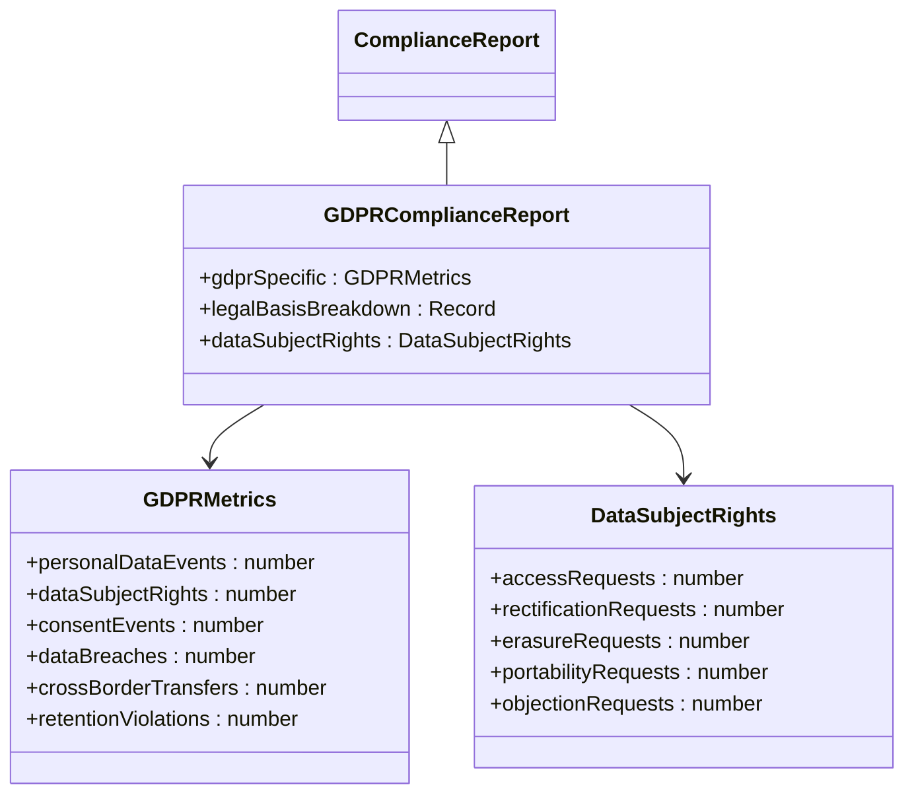
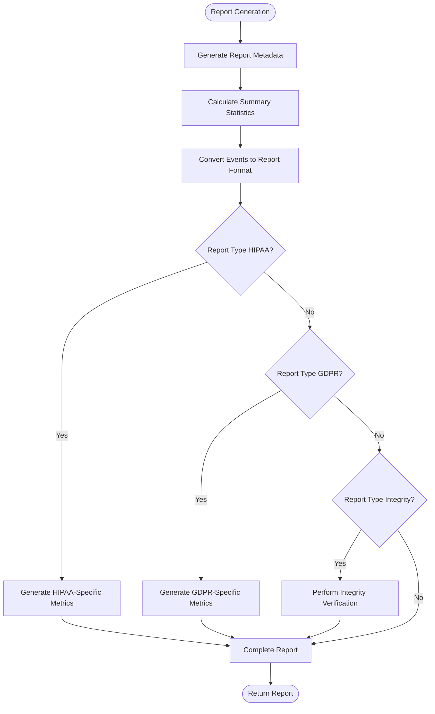
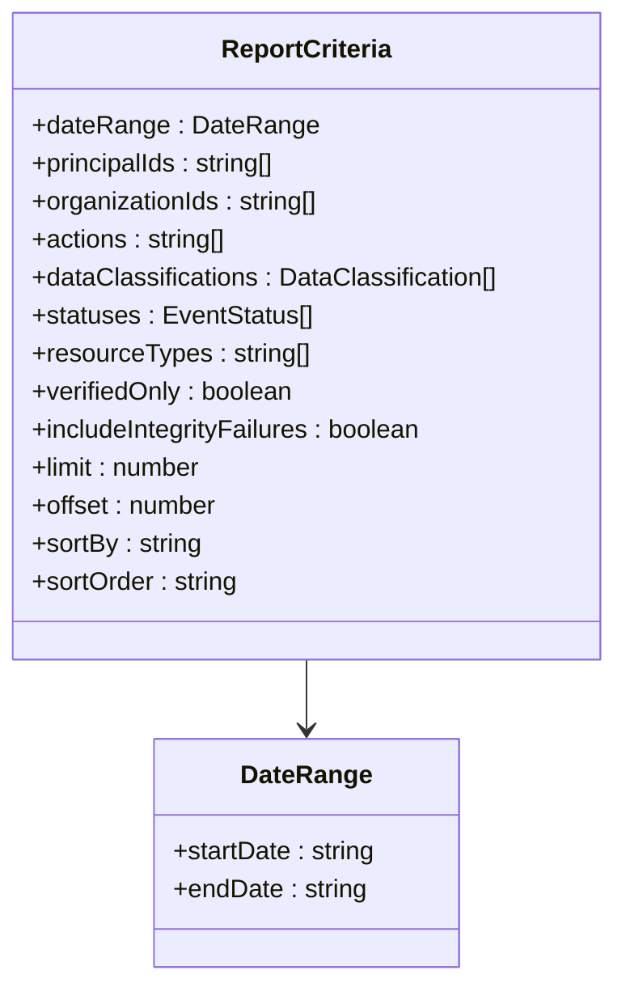
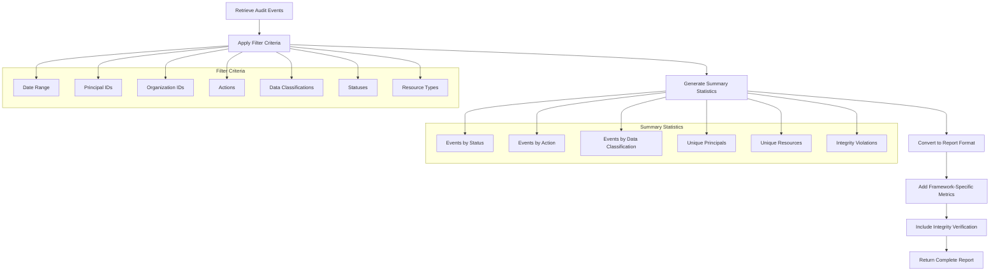
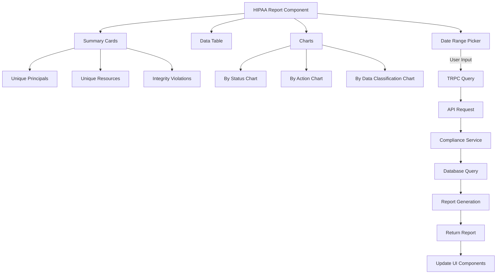
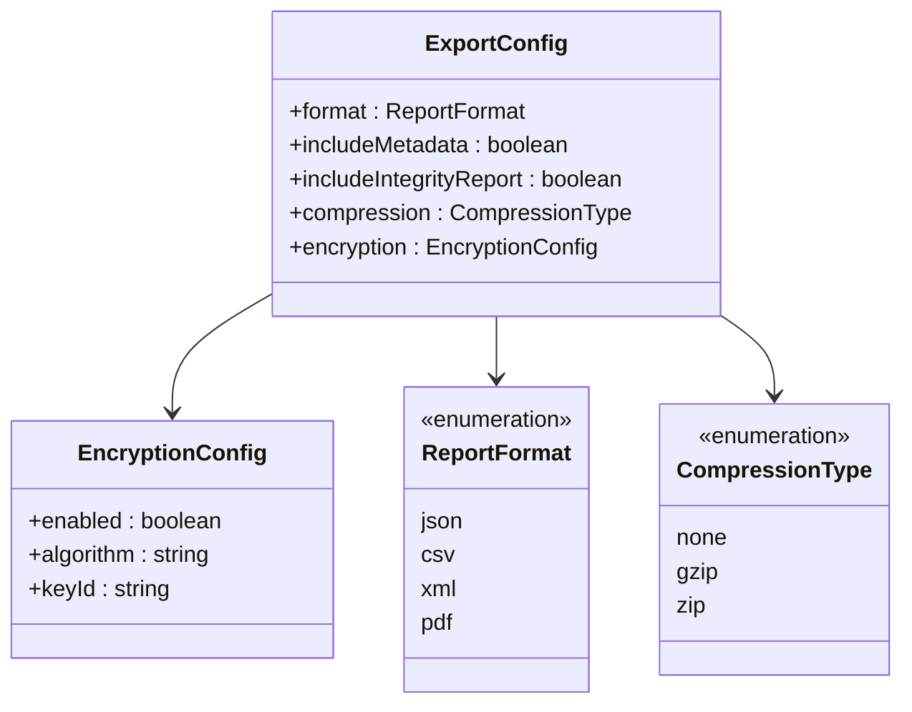
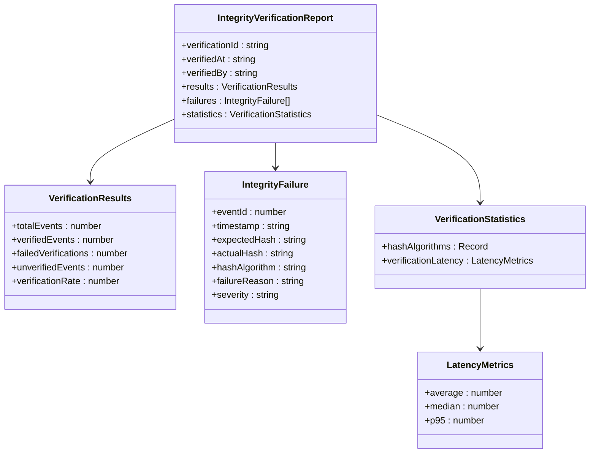

# Compliance Reporting System

<cite>
**Referenced Files in This Document**   
- [compliance-reporting.ts](file://packages/audit/src/report/compliance-reporting.ts)
- [compliance-reporting.test.ts](file://packages/audit/src/__tests__/compliance-reporting.test.ts)
- [compliance-api.ts](file://apps/server/src/routes/compliance-api.ts)
- [hipaa.tsx](file://apps/web/src/routes/dashboard/compliance/hipaa.tsx)
</cite>

## Table of Contents
1. [Introduction](#introduction)
2. [On-Demand Report Generation](#on-demand-report-generation)
3. [Supported Regulatory Frameworks](#supported-regulatory-frameworks)
4. [Report Structure and Content](#report-structure-and-content)
5. [Data Aggregation and Filtering Logic](#data-aggregation-and-filtering-logic)
6. [UI Integration for Report Generation](#ui-integration-for-report-generation)
7. [Customization Options](#customization-options)
8. [Immutability and Tamper-Evidence](#immutability-and-tamper-evidence)
9. [Interpreting Report Findings](#interpreting-report-findings)
10. [Preparing for External Audits](#preparing-for-external-audits)

## Introduction
The Compliance Reporting System provides comprehensive functionality for generating on-demand compliance reports across multiple regulatory frameworks. The system supports HIPAA, GDPR, and general compliance reporting with detailed data aggregation, filtering, and analysis capabilities. Reports are generated based on audit log events and include extensive metadata, summary statistics, and detailed event information. The implementation ensures tamper-evidence through cryptographic integrity verification and provides both API and UI interfaces for report generation and viewing.

## On-Demand Report Generation
The compliance reporting system enables on-demand generation of compliance reports through a robust service implementation. The core functionality is provided by the `ComplianceReportingService` class, which orchestrates the report generation process based on user-defined criteria.



**Diagram sources**
- [compliance-reporting.ts](file://packages/audit/src/report/compliance-reporting.ts#L250-L350)
- [compliance-api.ts](file://apps/server/src/routes/compliance-api.ts#L600-L650)

**Section sources**
- [compliance-reporting.ts](file://packages/audit/src/report/compliance-reporting.ts#L1-L50)
- [compliance-api.ts](file://apps/server/src/routes/compliance-api.ts#L1-L100)

## Supported Regulatory Frameworks
The system supports multiple regulatory frameworks, each with specialized report types and metrics tailored to specific compliance requirements.

### HIPAA Compliance Reporting
The system implements HIPAA-specific reporting through the `HIPAAComplianceReport` interface, which extends the base compliance report with healthcare-specific metrics.



**Diagram sources**
- [compliance-reporting.ts](file://packages/audit/src/report/compliance-reporting.ts#L100-L150)

**Section sources**
- [compliance-reporting.ts](file://packages/audit/src/report/compliance-reporting.ts#L80-L200)

### GDPR Compliance Reporting
GDPR compliance reporting is implemented through the `GDPRComplianceReport` interface, which includes data protection-specific metrics and legal basis tracking.



**Diagram sources**
- [compliance-reporting.ts](file://packages/audit/src/report/compliance-reporting.ts#L150-L180)

**Section sources**
- [compliance-reporting.ts](file://packages/audit/src/report/compliance-reporting.ts#L80-L200)

## Report Structure and Content
Compliance reports follow a standardized structure with consistent sections across all report types, ensuring comprehensive coverage of compliance requirements.

### Base Report Structure
All compliance reports share a common structure defined by the `ComplianceReport` interface, which includes metadata, summary statistics, and detailed event data.



**Diagram sources**
- [compliance-reporting.ts](file://packages/audit/src/report/compliance-reporting.ts#L300-L350)

**Section sources**
- [compliance-reporting.ts](file://packages/audit/src/report/compliance-reporting.ts#L50-L200)

### Required Report Sections
Each compliance report contains the following required sections:

**Metadata Section**
- reportId: Unique identifier for the report
- reportType: Type of compliance report (HIPAA, GDPR, etc.)
- generatedAt: Timestamp when the report was generated
- generatedBy: User or system that generated the report
- criteria: Filtering criteria used for the report
- totalEvents: Total number of events included in the report

**Summary Statistics**
- eventsByStatus: Breakdown of events by status (success, failure, attempt)
- eventsByAction: Breakdown of events by action type
- eventsByDataClassification: Breakdown by data classification (PHI, INTERNAL, etc.)
- uniquePrincipals: Count of unique users/principals
- uniqueResources: Count of unique resources accessed
- integrityViolations: Number of integrity violations detected
- timeRange: Earliest and latest timestamps in the report

**Detailed Event Data**
The events array contains individual audit events in a standardized format with essential information for compliance review.

## Data Aggregation and Filtering Logic
The system implements sophisticated data aggregation and filtering logic to support comprehensive compliance reporting requirements.

### Report Criteria and Filtering
The `ReportCriteria` interface defines the parameters for filtering and configuring compliance reports:



**Diagram sources**
- [compliance-reporting.ts](file://packages/audit/src/report/compliance-reporting.ts#L30-L70)

**Section sources**
- [compliance-reporting.ts](file://packages/audit/src/report/compliance-reporting.ts#L30-L200)

### Data Aggregation Process
The data aggregation process follows a systematic approach to transform raw audit events into meaningful compliance reports:



**Diagram sources**
- [compliance-reporting.ts](file://packages/audit/src/report/compliance-reporting.ts#L600-L800)

**Section sources**
- [compliance-reporting.ts](file://packages/audit/src/report/compliance-reporting.ts#L600-L900)

## UI Integration for Report Generation
The web application provides a user-friendly interface for generating and viewing compliance reports, with specific implementations for different regulatory frameworks.

### HIPAA Report UI Implementation
The HIPAA compliance reporting UI is implemented in the `hipaa.tsx` component, which provides a comprehensive dashboard for viewing HIPAA audit trail reports.



**Diagram sources**
- [hipaa.tsx](file://apps/web/src/routes/dashboard/compliance/hipaa.tsx#L1-L347)
- [compliance-api.ts](file://apps/server/src/routes/compliance-api.ts#L600-L650)

**Section sources**
- [hipaa.tsx](file://apps/web/src/routes/dashboard/compliance/hipaa.tsx#L1-L347)

### API Integration
The UI integrates with the backend compliance API through TRPC queries, enabling seamless report generation and retrieval:

```typescript
const { data: report, isLoading } = useQuery(
  trpc.reports.hipaa.queryOptions({
    criteria: {
      dateRange: {
        startDate: formatDate(dateRange.from, 'yyyy-MM-dd'),
        endDate: formatDate(dateRange.to, 'yyyy-MM-dd'),
      },
      limit: 50,
    },
  })
)
```

This integration allows users to select date ranges and other criteria, which are then passed to the backend service to generate the appropriate compliance report.

## Customization Options
The compliance reporting system offers extensive customization options for both report scope and format, allowing users to tailor reports to their specific needs.

### Report Scope Customization
Users can customize the scope of compliance reports through various filtering criteria:

**Section sources**
- [compliance-reporting.ts](file://packages/audit/src/report/compliance-reporting.ts#L30-L70)

### Report Format Options
The system supports multiple export formats through the `ExportConfig` interface:



**Diagram sources**
- [compliance-reporting.ts](file://packages/audit/src/report/compliance-reporting.ts#L180-L200)

**Section sources**
- [compliance-reporting.ts](file://packages/audit/src/report/compliance-reporting.ts#L180-L200)

## Immutability and Tamper-Evidence
The system implements robust mechanisms to ensure report immutability and provide tamper-evidence for audit purposes.

### Integrity Verification
The `IntegrityVerificationReport` interface provides comprehensive verification of audit trail integrity:



**Diagram sources**
- [compliance-reporting.ts](file://packages/audit/src/report/compliance-reporting.ts#L130-L150)

**Section sources**
- [compliance-reporting.ts](file://packages/audit/src/report/compliance-reporting.ts#L400-L500)

The integrity verification process compares the stored hash of each audit event with a newly computed hash, flagging any discrepancies as potential tampering.

## Interpreting Report Findings
The compliance reports provide comprehensive information that can be interpreted to assess compliance posture and identify potential issues.

### Key Indicators to Monitor
When reviewing compliance reports, focus on the following key indicators:

**High-Risk Events**
- Failed access attempts to sensitive resources
- Emergency access or "break glass" events
- Modifications to protected health information (PHI)
- Access outside normal business hours
- High-volume access patterns from a single principal

**Integrity Concerns**
- Hash mismatches in the integrity verification report
- Events without cryptographic signatures
- Discrepancies between expected and actual hash algorithms
- High latency in verification processes

**Compliance Gaps**
- Missing consent records for data processing
- Data retention violations
- Unauthorized cross-border data transfers
- Inadequate minimum necessary access controls

## Preparing for External Audits
The compliance reporting system provides essential functionality to support preparation for external audits.

### Audit Readiness Features
The system includes several features specifically designed to facilitate external audits:

**Comprehensive Documentation**
- Complete audit trail of all system activities
- Detailed metadata for each compliance report
- Clear lineage from raw events to final report
- Timestamps for all critical operations

**Evidence Preservation**
- Cryptographic integrity verification of audit logs
- Immutable report generation with unique identifiers
- Tamper-evident storage of compliance artifacts
- Chain of custody documentation

**Regulatory Alignment**
- Pre-configured report templates for major regulations
- Standardized metrics aligned with regulatory requirements
- Automated calculation of compliance indicators
- Export functionality for sharing with auditors

Organizations can leverage these features to demonstrate compliance with regulatory requirements and provide auditors with the necessary evidence to validate their compliance posture.