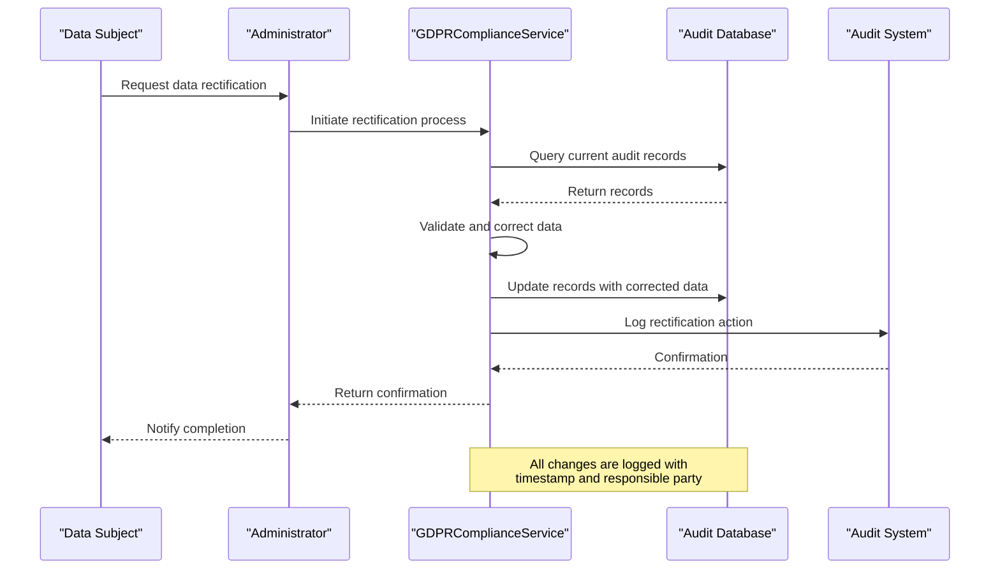
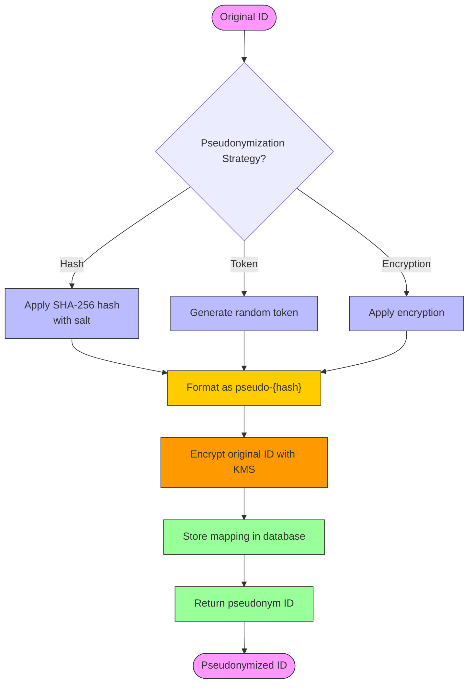
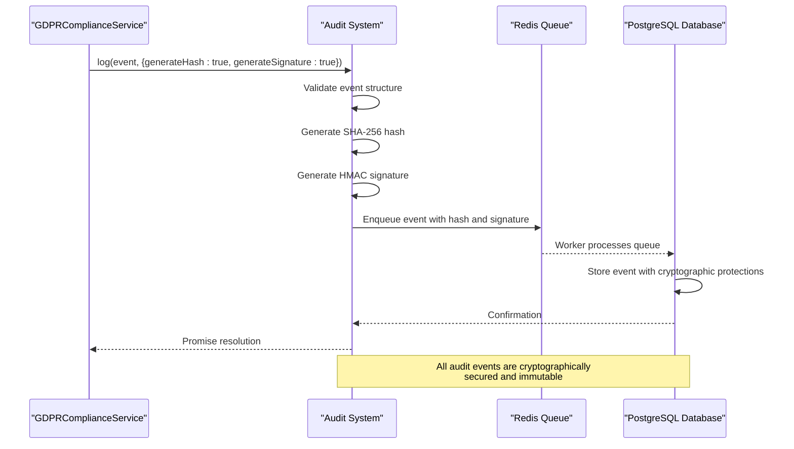

# GDPR Compliance Implementation

<cite>
**Referenced Files in This Document**   
- [gdpr-compliance.ts](file://packages/audit/src/gdpr/gdpr-compliance.ts) - *Updated with pseudonym mapping and KMS integration*
- [gdpr-utils.ts](file://packages/audit/src/gdpr/gdpr-utils.ts) - *Updated with enhanced compliance utilities*
- [pseudonym_mapping.sql](file://packages/audit-db/drizzle/migrations/0006_silly_tyger_tiger.sql) - *Added pseudonym mapping table*
- [infisical-kms](file://packages/infisical-kms) - *Added for secure pseudonym mapping storage*
</cite>

## Update Summary
**Changes Made**   
- Updated pseudonymization implementation to use secure database storage with KMS encryption
- Added detailed documentation for pseudonym mapping lifecycle and re-identification controls
- Enhanced audit trail integration with new compliance-critical actions
- Updated code examples to reflect secure pseudonym mapping storage
- Added information about Infisical KMS integration for pseudonym mapping protection

## Table of Contents
1. [Introduction](#introduction)
2. [Core Components](#core-components)
3. [Data Subject Rights Implementation](#data-subject-rights-implementation)
4. [Anonymization and Pseudonymization Techniques](#anonymization-and-pseudonymization-techniques)
5. [Data Minimization and Storage Limitation](#data-minimization-and-storage-limitation)
6. [Audit Trail Integration](#audit-trail-integration)
7. [Common Compliance Scenarios](#common-compliance-scenarios)
8. [Best Practices](#best-practices)

## Introduction
The GDPR Compliance Implementation provides a comprehensive framework for handling data subject rights within the audit logging system. This implementation ensures compliance with key GDPR articles including the right to access (Article 15), right to erasure (Article 17), right to rectification (Article 16), and right to data portability (Article 20). The system is built around two core components: the GDPRComplianceService for handling compliance operations and GDPRUtils for providing utility functions for data protection.

The implementation follows privacy-by-design principles, ensuring that personal data is properly identified, tagged, and processed while maintaining the integrity of audit trails. All compliance actions are themselves audited, creating a transparent and verifiable compliance process. Recent updates have enhanced the pseudonymization system with secure database storage and KMS encryption for pseudonym mappings.

## Core Components

The GDPR compliance system consists of two primary components that work together to implement data protection requirements:

1. **GDPRComplianceService**: The main service class that implements data subject rights and retention policies
2. **GDPRUtils**: A utility class providing helper functions for data anonymization, validation, and policy management

These components are designed to work with the audit logging system, which captures all user activities and system events. The integration with the Audit class ensures that all compliance actions are properly recorded and secured with cryptographic hashing and signatures.

```mermaid
classDiagram
class GDPRComplianceService {
+exportUserData(request) GDPRDataExport
+pseudonymizeUserData(principalId, strategy, requestedBy) Promise~{pseudonymId, recordsAffected}~
+deleteUserDataWithAuditTrail(principalId, requestedBy, preserveComplianceAudits) Promise~{recordsDeleted, complianceRecordsPreserved}~
+applyRetentionPolicies() Promise~ArchivalResult[]~
+getPseudonymMapping(originalId) string | undefined
+getOriginalId(pseudonymId) string | undefined
}
class GDPRUtils {
+static generateDeterministicPseudonym(originalId, salt) string
+static generateRandomPseudonym() string
+static validateExportRequest(request) {valid, errors}
+static sanitizeForExport(data) any[]
+static isComplianceCriticalAction(action) boolean
+static calculateRetentionExpiry(createdDate, retentionDays) string
+static isEligibleForArchival(createdDate, archiveAfterDays, currentDate) boolean
+static isEligibleForDeletion(createdDate, deleteAfterDays, currentDate) boolean
+static generateComplianceMetadata(operation, principalId, requestedBy, additionalData) Record~string, any~
+static validateDataClassification(classification) boolean
+static getRecommendedRetentionPolicy(dataClassification) RetentionPolicy
+static createGDPRAuditEntry(operation, principalId, targetId, requestedBy, outcome, details) any
+static maskSensitiveData(data, visibleChars) string
+static generateTrackingId(operation) string
}
class Audit {
+log(eventDetails, options) Promise~void~
+logWithGuaranteedDelivery(eventDetails, options) Promise~void~
+generateEventHash(event) string
+verifyEventHash(event, expectedHash) boolean
+generateEventSignature(event) string
+verifyEventSignature(event, signature) boolean
+closeConnection() Promise~void~
}
class InfisicalKmsClient {
+encrypt(plaintext) Promise~EncryptResponse~
+decrypt(ciphertext) Promise~DecryptResponse~
+sign(data, algorithm) Promise~SignResponse~
+verify(data, signature, algorithm) Promise~VerifyResponse~
}
class pseudonym_mapping {
+id : serial
+timestamp : timestamp with time zone
+pseudonym_id : text
+original_id : text
}
GDPRComplianceService --> Audit : "uses for logging"
GDPRComplianceService --> GDPRUtils : "uses for utilities"
GDPRComplianceService --> InfisicalKmsClient : "uses for encryption"
GDPRComplianceService --> pseudonym_mapping : "stores mappings"
GDPRUtils --> "crypto" : "uses for hashing"
```

**Diagram sources**
- [gdpr-compliance.ts](file://packages/audit/src/gdpr/gdpr-compliance.ts)
- [gdpr-utils.ts](file://packages/audit/src/gdpr/gdpr-utils.ts)
- [pseudonym_mapping.sql](file://packages/audit-db/drizzle/migrations/0006_silly_tyger_tiger.sql)
- [infisical-kms](file://packages/infisical-kms)

**Section sources**
- [gdpr-compliance.ts](file://packages/audit/src/gdpr/gdpr-compliance.ts)
- [gdpr-utils.ts](file://packages/audit/src/gdpr/gdpr-utils.ts)
- [pseudonym_mapping.sql](file://packages/audit-db/drizzle/migrations/0006_silly_tyger_tiger.sql)

## Data Subject Rights Implementation

### Right to Access and Data Portability
The right to access and data portability are implemented through the `exportUserData` method in the GDPRComplianceService. This method allows data subjects to obtain their personal data in a structured, commonly used, and machine-readable format.

```typescript
async exportUserData(request: GDPRDataExportRequest): Promise<GDPRDataExport> {
    const requestId = this.generateRequestId()

    // Build query conditions
    const conditions = [eq(auditLog.principalId, request.principalId)]
    conditions.push(eq(auditLog.organizationId, request.organizationId))

    if (request.dateRange) {
        conditions.push(
            gte(auditLog.timestamp, request.dateRange.start),
            lte(auditLog.timestamp, request.dateRange.end)
        )
    }

    // Query audit logs for the user
    const auditLogs = await this.client.executeMonitoredQuery(
        (db) =>
            db
                .select()
                .from(auditLog)
                .where(and(...conditions))
                .orderBy(auditLog.timestamp),
        'export_user_data',
        { cacheKey }
    )

    // Collect metadata
    const categories = new Set<string>()
    const retentionPolicies = new Set<string>()
    let earliestDate = new Date().toISOString()
    let latestDate = new Date(0).toISOString()

    for (const log of auditLogs) {
        if (log.action) categories.add(log.action)
        if (log.retentionPolicy) retentionPolicies.add(log.retentionPolicy)
        if (log.timestamp < earliestDate) earliestDate = log.timestamp
        if (log.timestamp > latestDate) latestDate = log.timestamp
    }

    // Format data according to requested format
    const exportData = await this.formatExportData(
        auditLogs,
        request.format,
        request.includeMetadata
    )
    
    // Log the export request for audit trail
    await this.logGDPRActivity({
        timestamp: new Date().toISOString(),
        principalId: request.requestedBy,
        organizationId: request.organizationId,
        action: 'gdpr.data.export',
        status: 'success',
        targetResourceType: 'AuditLog',
        targetResourceId: request.principalId,
        outcomeDescription: `GDPR data export completed for user ${request.principalId}`,
        dataClassification: 'PHI',
        retentionPolicy: 'gdpr_compliance',
        details: {
            requestId,
            format: request.format,
            recordCount: auditLogs.length,
            requestType: request.requestType,
        },
    })

    return {
        requestId,
        principalId: request.principalId,
        organizationId: request.organizationId,
        exportTimestamp: new Date().toISOString(),
        format: request.format,
        recordCount: auditLogs.length,
        dataSize: exportData.length,
        data: exportData,
        metadata: {
            dateRange: {
                start: request.dateRange?.start || earliestDate,
                end: request.dateRange?.end || latestDate,
            },
            categories: Array.from(categories),
            retentionPolicies: Array.from(retentionPolicies),
            exportedBy: request.requestedBy,
        },
    }
}
```

The implementation supports multiple export formats including JSON, CSV, and XML, allowing data subjects to choose the most convenient format for their needs. The exported data is sanitized to remove sensitive system fields while preserving the integrity of the personal data.

### Right to Erasure
The right to erasure (also known as the "right to be forgotten") is implemented through the `deleteUserDataWithAuditTrail` method. This method provides a GDPR-compliant deletion process that balances the data subject's right to erasure with the organization's need to maintain compliance audit trails.

```typescript
async deleteUserDataWithAuditTrail(
    principalId: string,
    requestedBy: string,
    preserveComplianceAudits: boolean = true
): Promise<{ recordsDeleted: number; complianceRecordsPreserved: number }> {
    let recordsDeleted = 0
    let complianceRecordsPreserved = 0

    if (preserveComplianceAudits) {
        // First, identify compliance-critical audit records to preserve
        const complianceActions = [
            'auth.login.success',
            'auth.login.failure',
            'data.access.unauthorized',
            'gdpr.data.export',
            'gdpr.data.pseudonymize',
            'gdpr.data.delete',
        ]

        const complianceRecords = await this.client.executeMonitoredQuery(
            (db) =>
                db
                    .select()
                    .from(auditLog)
                    .where(
                        and(
                            eq(auditLog.principalId, principalId),
                            sql`${auditLog.action} = ANY(${complianceActions})`
                        )
                    ),
            'compliance_audit_records',
            { cacheKey: `compliance_audit_records_${principalId}` }
        )

        // Pseudonymize compliance records instead of deleting
        if (complianceRecords.length > 0) {
            const pseudonymResult = await this.pseudonymizeUserData(principalId, 'hash', requestedBy)
            complianceRecordsPreserved = pseudonymResult.recordsAffected
        }

        // Delete non-compliance records
        const deleteResult = await this.db
            .delete(auditLog)
            .where(
                and(
                    eq(auditLog.principalId, principalId),
                    sql`NOT (${auditLog.action} = ANY(${complianceActions}))`
                )
            )

        recordsDeleted = (deleteResult as any).rowCount || 0
    } else {
        // Delete all records for the user
        const deleteResult = await this.db
            .delete(auditLog)
            .where(eq(auditLog.principalId, principalId))

        recordsDeleted = (deleteResult as any).rowCount || 0
    }

    // Log the deletion activity
    await this.logGDPRActivity({
        timestamp: new Date().toISOString(),
        principalId: requestedBy,
        action: 'gdpr.data.delete',
        status: 'success',
        targetResourceType: 'AuditLog',
        targetResourceId: principalId,
        outcomeDescription: `GDPR deletion completed for user ${principalId}`,
        dataClassification: 'PHI',
        retentionPolicy: 'gdpr_compliance',
        details: {
            recordsDeleted,
            complianceRecordsPreserved,
            preserveComplianceAudits,
        },
    })

    return {
        recordsDeleted,
        complianceRecordsPreserved,
    }
}
```

The implementation provides a configurable approach to data deletion, allowing organizations to preserve compliance-critical records while still honoring the data subject's request for erasure. Compliance-critical actions include authentication events, unauthorized access attempts, and previous GDPR compliance actions.

### Right to Rectification
While not explicitly implemented as a separate method, the right to rectification is supported through the audit system's immutable design. When personal data needs to be corrected, a new audit event is created with the corrected information, preserving the history of changes while ensuring the current data is accurate.

The system maintains referential integrity through pseudonymization mappings, allowing for the correction of personal data across related records while maintaining the ability to trace the data subject's activities.



**Diagram sources**
- [gdpr-compliance.ts](file://packages/audit/src/gdpr/gdpr-compliance.ts)

**Section sources**
- [gdpr-compliance.ts](file://packages/audit/src/gdpr/gdpr-compliance.ts)

## Anonymization and Pseudonymization Techniques

### Pseudonymization Strategies
The system implements multiple pseudonymization strategies to protect personal data while maintaining referential integrity. These strategies are implemented in both the GDPRComplianceService and GDPRUtils classes.

```typescript
private generatePseudonymId(originalId: string, strategy: PseudonymizationStrategy): string {
    switch (strategy) {
        case 'hash':
            // TODO: add PSEUDONYM_SALT to config
            return `pseudo-${createHash('sha256')
                .update(originalId + process.env.PSEUDONYM_SALT || 'default-salt')
                .digest('hex')
                .substring(0, 16)}`
        case 'token':
            return `pseudo-${randomBytes(16).toString('hex')}`
        case 'encryption':
            // TODO: For production, implement proper encryption
            return `pseudo-enc-${Buffer.from(originalId)
                .toString('base64')
                .replace(/[^a-zA-Z0-9]/g, '')
                .substring(0, 16)}`
        default:
            throw new Error(`Unsupported pseudonymization strategy: ${strategy}`)
    }
}
```

The three supported strategies are:

1. **Hash-based pseudonymization**: Uses SHA-256 hashing with a salt to create a deterministic pseudonym. This allows the same original ID to always produce the same pseudonym, preserving referential integrity.
2. **Token-based pseudonymization**: Generates a random token for each pseudonym, providing stronger privacy protection but requiring additional mapping storage.
3. **Encryption-based pseudonymization**: Uses base64 encoding (placeholder for actual encryption) to create reversible pseudonyms for authorized use cases.

### Data Masking
For logging and display purposes, the system implements data masking to protect sensitive information. The `maskSensitiveData` utility function replaces portions of sensitive data with masking characters while preserving a configurable number of leading characters.

```typescript
static maskSensitiveData(data: string, visibleChars: number = 4): string {
    if (!data || data.length <= visibleChars) {
        return '*'.repeat(data?.length || 0)
    }

    const visible = data.substring(0, visibleChars)
    const masked = '*'.repeat(data.length - visibleChars)
    return visible + masked
}
```

This approach allows for partial visibility of data (useful for debugging and support) while protecting the full sensitive information. The number of visible characters can be configured based on security requirements.

### Irreversible Transformation Methods
The system uses several irreversible transformation methods to ensure data cannot be easily re-identified:

1. **Cryptographic hashing**: SHA-256 hashing with salt ensures that pseudonyms cannot be reversed to obtain the original identifier.
2. **Random token generation**: Cryptographically secure random tokens provide strong privacy protection.
3. **Data truncation**: Sensitive data is truncated when stored in certain contexts to minimize exposure.

The pseudonymization mappings are now securely stored in the database with KMS encryption, replacing the previous in-memory storage approach. The `pseudonym_mapping` table stores the relationship between original IDs and pseudonym IDs with the following schema:

```sql
CREATE TABLE "pseudonym_mapping" (
	"id" serial PRIMARY KEY NOT NULL,
	"timestamp" timestamp with time zone NOT NULL,
	"pseudonym_id" text NOT NULL,
	"original_id" text NOT NULL
);
```

The `getOriginalId` method has been updated to retrieve and decrypt the original ID from the secure storage:

```typescript
async getOriginalId(pseudonymId: string): Promise<string | undefined> {
    const mapping = await this.db
        .select()
        .from(pseudonymMapping)
        .where(eq(pseudonymMapping.pseudonymId, pseudonymId))
    if (mapping.length > 0) {
        const encryptedOrigialId = mapping[0].originalId
        try {
            const decryptedOriginalId = await this.kms.decrypt(encryptedOrigialId)
            return decryptedOriginalId.plaintext
        } catch (error) {
            console.error('Error decrypting pseudonym mapping:', error)
            return undefined
        }
    }

    console.error('No pseudonym mapping found for ID:', pseudonymId)
    return undefined
}
```

This implementation ensures that pseudonym mappings are protected with enterprise-grade encryption while still allowing authorized access for compliance investigations.



**Diagram sources**
- [gdpr-compliance.ts](file://packages/audit/src/gdpr/gdpr-compliance.ts)
- [pseudonym_mapping.sql](file://packages/audit-db/drizzle/migrations/0006_silly_tyger_tiger.sql)
- [infisical-kms](file://packages/infisical-kms)

**Section sources**
- [gdpr-compliance.ts](file://packages/audit/src/gdpr/gdpr-compliance.ts)
- [pseudonym_mapping.sql](file://packages/audit-db/drizzle/migrations/0006_silly_tyger_tiger.sql)
- [infisical-kms](file://packages/infisical-kms)

## Data Minimization and Storage Limitation

### Data Identification and Tagging
Personal data is identified and tagged through a combination of schema design and data classification. The audit system uses a data classification field with predefined values:

- PUBLIC
- INTERNAL
- CONFIDENTIAL
- PHI (Protected Health Information)

The GDPRUtils class provides validation for these classifications:

```typescript
static validateDataClassification(classification: string): boolean {
    const validClassifications = ['PUBLIC', 'INTERNAL', 'CONFIDENTIAL', 'PHI']
    return validClassifications.includes(classification)
}
```

Data is automatically tagged with the appropriate classification based on the context of the audit event. For example, authentication events are classified as PHI, while system health checks are classified as INTERNAL.

### Storage Limitation Implementation
The system implements storage limitation through automated retention policies that archive and delete data based on predefined rules. The `applyRetentionPolicies` method processes all active retention policies:

```typescript
async applyRetentionPolicies(): Promise<ArchivalResult[]> {
    // Get active retention policies
    const policies = await this.client.executeOptimizedQuery(
        (db) =>
            db.select().from(auditRetentionPolicy).where(eq(auditRetentionPolicy.isActive, 'true')),
        { cacheKey: 'active_retention_policies', cacheTTL: 3600 }
    )

    const results: ArchivalResult[] = []

    const retentionPolicies: RetentionPolicy[] = policies.map((policy) => ({
        policyName: policy.policyName,
        dataClassification: policy.dataClassification,
        retentionDays: policy.retentionDays,
        archiveAfterDays: policy.archiveAfterDays || undefined,
        deleteAfterDays: policy.deleteAfterDays || undefined,
        isActive: policy.isActive === 'true',
    }))

    for (const policy of retentionPolicies) {
        const result = await this.applyRetentionPolicy(policy as RetentionPolicy)
        results.push(result)
    }

    return results
}
```

The retention policy application follows a two-step process:

1. **Archival**: Records are marked as archived after a specified period
2. **Deletion**: Archived records are permanently deleted after an additional retention period

```typescript
private async applyRetentionPolicy(policy: RetentionPolicy): Promise<ArchivalResult> {
    const now = new Date()
    const archiveDate = new Date(
        now.getTime() - (policy.archiveAfterDays || policy.retentionDays) * 24 * 60 * 60 * 1000
    )
    const deleteDate = policy.deleteAfterDays
        ? new Date(now.getTime() - policy.deleteAfterDays * 24 * 60 * 60 * 1000)
        : null

    // Archive records that meet archival criteria
    if (policy.archiveAfterDays) {
        const recordsToArchive = await this.client.executeOptimizedQuery(
            (db) =>
                db
                    .select()
                    .from(auditLog)
                    .where(
                        and(
                            eq(auditLog.dataClassification, policy.dataClassification),
                            lte(auditLog.timestamp, archiveDate.toISOString()),
                            sql`${auditLog.archivedAt} IS NULL`
                        )
                    ),
            { skipCache: true }
        )

        // Mark records as archived
        const archiveResult = await this.db
            .update(auditLog)
            .set({ archivedAt: now.toISOString() })
            .where(
                and(
                    eq(auditLog.dataClassification, policy.dataClassification),
                    lte(auditLog.timestamp, archiveDate.toISOString()),
                    sql`${auditLog.archivedAt} IS NULL`
                )
            )

        recordsArchived = (archiveResult as any).rowCount || 0
    }

    // Delete records that meet deletion criteria
    if (deleteDate) {
        const deleteResult = await this.db
            .delete(auditLog)
            .where(
                and(
                    eq(auditLog.dataClassification, policy.dataClassification),
                    lte(auditLog.timestamp, deleteDate.toISOString()),
                    isNotNull(auditLog.archivedAt)
                )
            )

        recordsDeleted = (deleteResult as any).rowCount || 0
    }
}
```

The system provides recommended retention policies based on data classification:

```typescript
static getRecommendedRetentionPolicy(dataClassification: string): {
    retentionDays: number
    archiveAfterDays: number
    deleteAfterDays: number
    policyName: string
} {
    switch (dataClassification) {
        case 'PHI':
            return {
                retentionDays: 2555, // 7 years for healthcare data
                archiveAfterDays: 365, // 1 year
                deleteAfterDays: 2555,
                policyName: 'healthcare_phi',
            }
        case 'CONFIDENTIAL':
            return {
                retentionDays: 1095, // 3 years
                archiveAfterDays: 365, // 1 year
                deleteAfterDays: 1095,
                policyName: 'confidential_data',
            }
        // Additional cases...
    }
}
```

**Section sources**
- [gdpr-compliance.ts](file://packages/audit/src/gdpr/gdpr-compliance.ts)
- [gdpr-utils.ts](file://packages/audit/src/gdpr/gdpr-utils.ts)

## Audit Trail Integration

### Compliance Action Auditing
All GDPR compliance actions are themselves audited to ensure transparency and accountability. The `logGDPRActivity` method records these actions in the audit system:

```typescript
private async logGDPRActivity(event: AuditLogEvent): Promise<void> {
    await this.audit.log(event, {
        generateHash: true,
        generateSignature: true,
    })
}
```

Each compliance action generates a detailed audit entry that includes:

- Timestamp of the action
- Principal ID of the requester
- Action type (e.g., 'gdpr.data.export')
- Status (success/failure)
- Target resource type and ID
- Outcome description
- Data classification
- Retention policy
- Detailed metadata specific to the operation

For example, when a data export is performed, the audit entry includes the request ID, format, record count, and request type.

### Audit Event Ingestion
The integration with the audit event ingestion system ensures that all compliance actions are securely recorded. The Audit class provides methods for logging events with cryptographic security:

```typescript
async log(
  eventDetails: Omit<AuditLogEvent, 'timestamp'>,
  options?: {
    generateHash?: boolean
    generateSignature?: boolean
    correlationId?: string
    eventVersion?: string
    skipValidation?: boolean
    validationConfig?: ValidationConfig
  }
): Promise<void>
```

The system generates both cryptographic hashes and HMAC signatures for audit events, ensuring data integrity and authenticity. This prevents tampering with audit records and provides verifiable proof of compliance actions.



**Diagram sources**
- [gdpr-compliance.ts](file://packages/audit/src/gdpr/gdpr-compliance.ts)
- [api-reference.md](file://apps/docs/src/content/docs/audit/api-reference.md)

**Section sources**
- [gdpr-compliance.ts](file://packages/audit/src/gdpr/gdpr-compliance.ts)
- [api-reference.md](file://apps/docs/src/content/docs/audit/api-reference.md)

## Common Compliance Scenarios

### Partial Data Deletion Across Services
When implementing data deletion across multiple services, the system uses a coordinated approach:

1. The GDPRComplianceService identifies all audit records associated with the data subject
2. Compliance-critical records are pseudonymized rather than deleted
3. Non-compliance records are permanently deleted
4. The operation is logged in the audit system
5. Other services are notified via event queue to perform their own data deletion

This ensures that while personal data is removed from most systems, essential compliance records are preserved in pseudonymized form.

### Consent Record Reconciliation
The system handles consent records by:

1. Storing consent events as audit logs with the action type 'consent.granted' or 'consent.revoked'
2. Linking consent records to the data subject through the principal ID
3. When a right to erasure is requested, consent revocation records are preserved as compliance-critical actions
4. New consent events can be linked to pseudonymized records for ongoing compliance

### Joint Data Controller Scenarios
In joint data controller scenarios, the system supports:

1. Multiple organization IDs in audit records
2. Shared audit databases with proper access controls
3. Clear attribution of processing activities to specific controllers
4. Coordinated data subject request handling through a shared API

The audit system records which organization requested each compliance action, providing transparency in joint controller arrangements.

**Section sources**
- [gdpr-compliance.ts](file://packages/audit/src/gdpr/gdpr-compliance.ts)

## Best Practices

### Configuring GDPR Rules
When configuring GDPR rules, follow these best practices:

1. **Set appropriate retention policies**: Use the recommended policies based on data classification, adjusting for specific regulatory requirements
2. **Configure pseudonymization salt**: Set a strong, secret salt value in the PSEUDONYM_SALT environment variable
3. **Define compliance-critical actions**: Customize the list of actions that should be preserved during data deletion
4. **Set up monitoring**: Implement alerts for GDPR compliance actions to detect potential abuse
5. **Secure pseudonym mappings**: Ensure the Infisical KMS integration is properly configured with secure access controls

### Validating Compliance Workflows
To validate compliance workflows:

1. **Test data export functionality**: Verify that data can be exported in all supported formats and that the exported data is complete and accurate
2. **Test data deletion**: Verify that personal data is properly deleted while compliance records are preserved
3. **Test pseudonymization**: Verify that pseudonymized data maintains referential integrity and cannot be easily reversed
4. **Audit trail verification**: Verify that all compliance actions are properly recorded in the audit system
5. **Re-identification testing**: Verify that authorized re-identification works correctly through the `getOriginalId` method
6. **Performance testing**: Ensure that compliance operations perform well even with large datasets

Regular testing and validation are essential to maintain GDPR compliance and ensure that the system functions correctly when real data subject requests are received.

**Section sources**
- [gdpr-compliance.ts](file://packages/audit/src/gdpr/gdpr-compliance.ts)
- [gdpr-utils.ts](file://packages/audit/src/gdpr/gdpr-utils.ts)
- [infisical-kms](file://packages/infisical-kms)