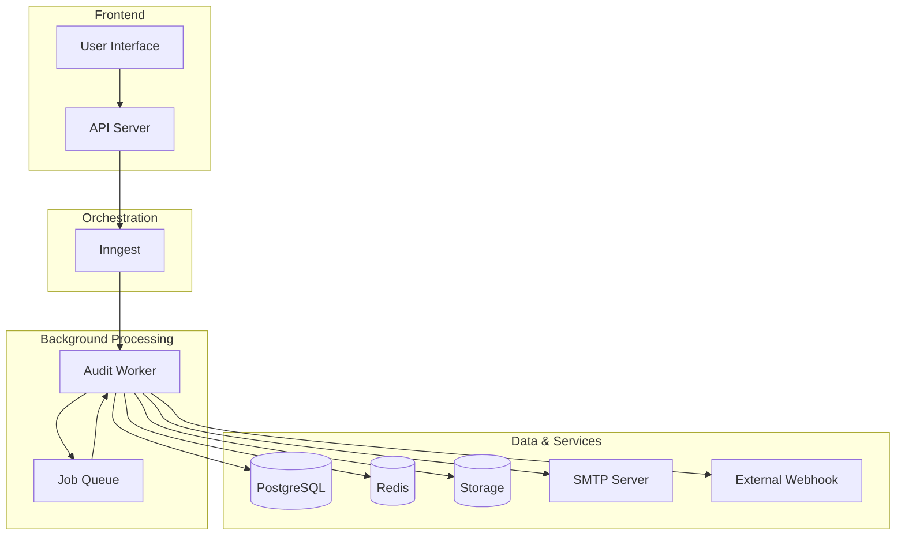
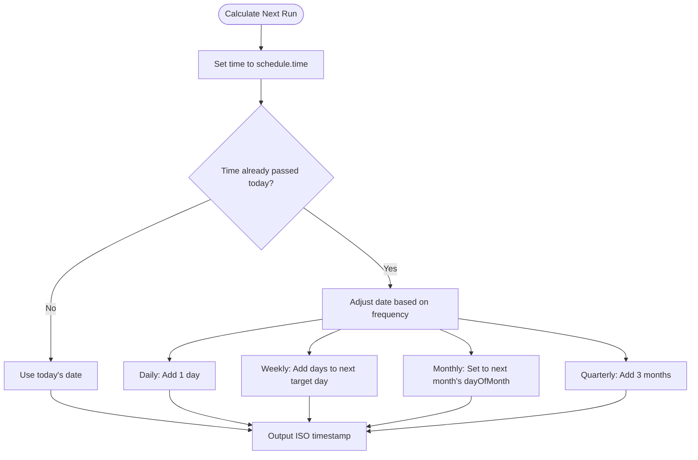
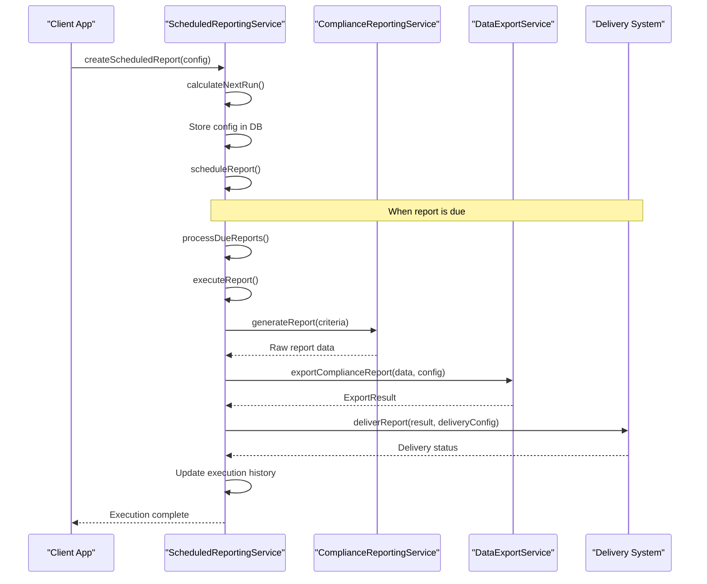
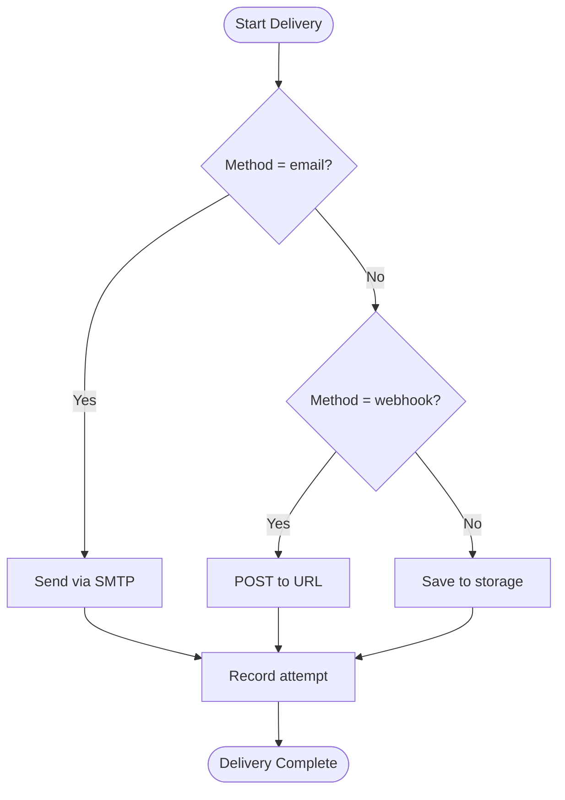
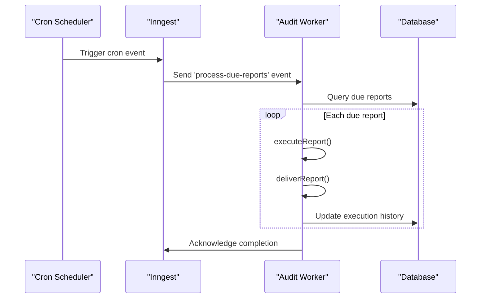
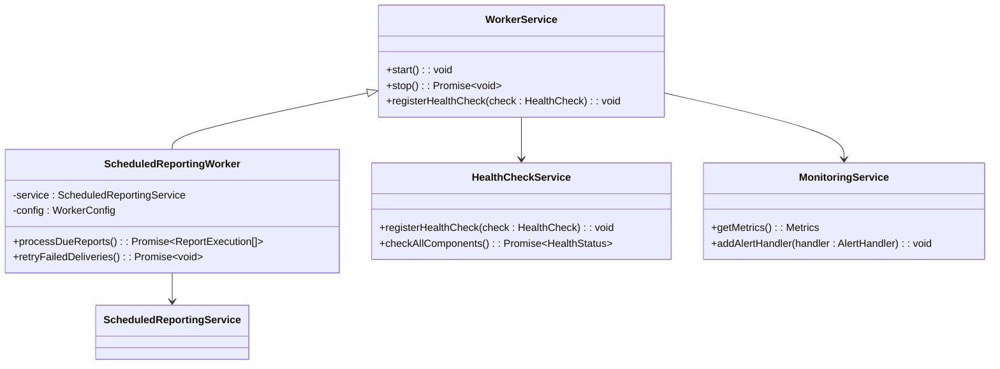

# Scheduled Reporting Mechanism

<cite>
**Referenced Files in This Document**   
- [scheduled-reporting.test.ts](file://packages/audit/src/__tests__/scheduled-reporting.test.ts)
- [scheduled-reporting.ts](file://packages/audit/src/report/scheduled-reporting.ts)
- [inngest/functions/alerts/cleanup-old-alerts.ts](file://apps/inngest/src/inngest/functions/alerts/cleanup-old-alerts.ts)
- [index.ts](file://apps/worker/src/index.ts)
- [data-export.ts](file://packages/audit/src/report/data-export.ts)
- [compliance-reporting.ts](file://packages/audit/src/report/compliance-reporting.ts)
</cite>

## Table of Contents
1. [Introduction](#introduction)
2. [Architecture Overview](#architecture-overview)
3. [Core Components](#core-components)
4. [Cron-Based Triggers and Scheduling](#cron-based-triggers-and-scheduling)
5. [Report Generation Pipeline](#report-generation-pipeline)
6. [Delivery Mechanisms](#delivery-mechanisms)
7. [Inngest Integration for Workflow Orchestration](#inngest-integration-for-workflow-orchestration)
8. [Worker Service for Background Processing](#worker-service-for-background-processing)
9. [Configuration Options](#configuration-options)
10. [Test Cases and Error Recovery](#test-cases-and-error-recovery)
11. [Monitoring and Alerting](#monitoring-and-alerting)
12. [Best Practices for Scalability](#best-practices-for-scalability)

## Introduction
The Scheduled Reporting Mechanism is a comprehensive system designed to automate compliance reporting within the smart-logs platform. It enables organizations to generate, schedule, and deliver audit and compliance reports based on predefined templates and criteria. The system integrates with Inngest for workflow orchestration and leverages a dedicated worker service for background processing, ensuring reliable execution even under high load. This document details the architecture, functionality, and operational aspects of the mechanism, providing insights into its implementation and best practices for scaling.

## Architecture Overview



**Diagram sources**
- [scheduled-reporting.ts](file://packages/audit/src/report/scheduled-reporting.ts)
- [index.ts](file://apps/worker/src/index.ts)
- [cleanup-old-alerts.ts](file://apps/inngest/src/inngest/functions/alerts/cleanup-old-alerts.ts)

## Core Components

The Scheduled Reporting Mechanism consists of several key components that work together to enable automated report generation and delivery:

- **ScheduledReportingService**: Central service responsible for managing scheduled reports, executing them, and handling delivery.
- **ComplianceReportingService**: Generates compliance-specific reports (e.g., HIPAA, GDPR).
- **DataExportService**: Exports generated reports in various formats (JSON, CSV, XML, PDF).
- **Inngest Functions**: Orchestrate workflows using event-driven triggers.
- **Audit Worker**: Background service that processes scheduled jobs and report executions.

These components are decoupled through well-defined interfaces, enabling independent development and testing.

**Section sources**
- [scheduled-reporting.ts](file://packages/audit/src/report/scheduled-reporting.ts#L133-L915)
- [data-export.ts](file://packages/audit/src/report/data-export.ts#L55-L111)
- [compliance-reporting.ts](file://packages/audit/src/report/compliance-reporting.ts)

## Cron-Based Triggers and Scheduling

The system uses a time-based scheduling mechanism to trigger report generation at specified intervals. While not directly using Unix cron syntax, it implements equivalent functionality through internal scheduling logic.

### Schedule Configuration
The `schedule` property in `ScheduledReportConfig` defines when a report should run:

```typescript
interface ScheduleConfig {
  frequency: 'daily' | 'weekly' | 'monthly' | 'quarterly'
  time: string // HH:mm format
  timezone?: string
  dayOfWeek?: number // 0-6 (Sunday-Saturday), for weekly
  dayOfMonth?: number // 1-31, for monthly/quarterly
}
```

### Next Run Calculation
The `calculateNextRun()` method determines when a report should next execute:



**Diagram sources**
- [scheduled-reporting.ts](file://packages/audit/src/report/scheduled-reporting.ts#L830-L878)

**Section sources**
- [scheduled-reporting.ts](file://packages/audit/src/report/scheduled-reporting.ts#L830-L878)

## Report Generation Pipeline

The report generation pipeline follows a structured sequence from configuration to final delivery:



**Diagram sources**
- [scheduled-reporting.ts](file://packages/audit/src/report/scheduled-reporting.ts#L500-L700)
- [data-export.ts](file://packages/audit/src/report/data-export.ts#L55-L111)

**Section sources**
- [scheduled-reporting.ts](file://packages/audit/src/report/scheduled-reporting.ts#L500-L700)

## Delivery Mechanisms

The system supports multiple delivery methods for generated reports, each with configurable parameters.

### Supported Delivery Methods
- **Email**: Delivers reports as email attachments
- **Webhook**: Posts reports to external endpoints
- **Storage**: Saves reports to local or cloud storage

### Delivery Configuration
```typescript
interface DeliveryConfig {
  email?: {
    smtpConfig: SMTPConfig
    from: string
    subject: string
    bodyTemplate: string
  }
  webhook?: {
    url: string
    method: 'POST' | 'PUT'
    headers: Record<string, string>
    timeout: number
    retryConfig: RetryConfig
  }
  storage?: {
    provider: 'local' | 's3' | 'gcs'
    path: string
    retention: { days: number; autoCleanup: boolean }
  }
}
```

### Delivery Flow


**Diagram sources**
- [scheduled-reporting.ts](file://packages/audit/src/report/scheduled-reporting.ts#L750-L800)

**Section sources**
- [scheduled-reporting.ts](file://packages/audit/src/report/scheduled-reporting.ts#L750-L800)

## Inngest Integration for Workflow Orchestration

Inngest serves as the workflow orchestration engine, enabling event-driven execution of scheduled reporting tasks.

### Inngest Function Structure
```typescript
export const processDueReports = inngest.createFunction(
  { id: 'process-due-reports' },
  { cron: 'TZ=UTC 0 9 * * *' }, // Daily at 9 AM UTC
  async ({ step, event, services }) => {
    const { scheduledReporting } = services
    await step.run('process-due-reports', () => scheduledReporting.processDueReports())
  }
)
```

### Event Flow


**Diagram sources**
- [cleanup-old-alerts.ts](file://apps/inngest/src/inngest/functions/alerts/cleanup-old-alerts.ts#L15-L41)
- [index.ts](file://apps/inngest/src/index.ts#L45-L62)

**Section sources**
- [cleanup-old-alerts.ts](file://apps/inngest/src/inngest/functions/alerts/cleanup-old-alerts.ts#L15-L41)

## Worker Service for Background Processing

The worker service handles all background processing for scheduled reports, ensuring non-blocking execution.

### Worker Architecture


**Diagram sources**
- [index.ts](file://apps/worker/src/index.ts#L82-L128)
- [scheduled-reporting.ts](file://packages/audit/src/report/scheduled-reporting.ts)

**Section sources**
- [index.ts](file://apps/worker/src/index.ts#L82-L128)

## Configuration Options

The system provides extensive configuration options for tailoring report behavior.

### Report Frequency Options
| Frequency | Description | Example |
|---------|-------------|---------|
| daily | Every day at specified time | 09:00 daily |
| weekly | Every week on specified day | Monday at 09:00 |
| monthly | Every month on specified date | 1st of month at 09:00 |
| quarterly | Every three months | First day of quarter |

### Recipient Configuration
Recipients can be configured per delivery method:
```typescript
delivery: {
  method: 'email',
  recipients: ['compliance@company.com', 'admin@company.com'],
  cc: ['archive@company.com'],
  bcc: ['monitor@company.com']
}
```

### Escalation Rules
Failed deliveries trigger automatic retries with exponential backoff:
```typescript
retryConfig: {
  maxRetries: 3,
  backoffMultiplier: 2,
  maxBackoffDelay: 30000 // 30 seconds
}
```

**Section sources**
- [scheduled-reporting.test.ts](file://packages/audit/src/__tests__/scheduled-reporting.test.ts#L10-L50)
- [scheduled-reporting.ts](file://packages/audit/src/report/scheduled-reporting.ts#L750-L800)

## Test Cases and Error Recovery

The system includes comprehensive test coverage for time-based execution and error recovery scenarios.

### Time-Based Execution Tests
```typescript
it('should calculate next run time correctly for daily schedule', async () => {
  const config = {
    name: 'Test Report',
    schedule: { frequency: 'daily', time: '09:00' },
    delivery: { method: 'email', recipients: ['test@test.com'] },
    enabled: true,
    createdBy: 'test-user',
  }

  const result = await service.createScheduledReport(config)
  
  expect(result.nextRun).toBeDefined()
  const nextRun = new Date(result.nextRun!)
  expect(nextRun.getHours()).toBe(9)
  expect(nextRun.getMinutes()).toBe(0)
})
```

### Error Recovery Tests
```typescript
it('should retry failed deliveries', async () => {
  // Setup report with failing delivery
  const config = { /* ... */ }
  const created = await service.createScheduledReport(config)
  
  // Force failure in delivery
  jest.spyOn(service as any, 'deliverViaEmail').mockImplementation(() => {
    throw new Error('SMTP server unavailable')
  })

  // Execute report (will fail delivery)
  await service.executeReport(created.id)

  // Retry failed deliveries
  await service.retryFailedDeliveries()

  // Verify retry was attempted
  expect(service['deliverViaEmail']).toHaveBeenCalledTimes(2) // Original + retry
})
```

### Process Due Reports Test
```typescript
it('should process reports that are due', async () => {
  const created = await service.createScheduledReport(config)
  
  // Manually set next run to past time
  const pastTime = new Date(Date.now() - 60000).toISOString()
  await service.updateScheduledReport(created.id, { nextRun: pastTime })

  const executions = await service.processDueReports()

  expect(executions).toHaveLength(1)
  expect(executions[0].reportConfigId).toBe(created.id)
})
```

**Section sources**
- [scheduled-reporting.test.ts](file://packages/audit/src/__tests__/scheduled-reporting.test.ts#L200-L651)

## Monitoring and Alerting

The system includes robust monitoring and alerting for failed report generations.

### Health Check Endpoints
The worker exposes health check endpoints:
- `GET /healthz` - Overall health status
- `GET /metrics` - Performance metrics
- `GET /alerts` - Active alerts

### Failure Detection
The system monitors for:
- Report generation failures
- Delivery failures
- Database connectivity issues
- Storage quota exceeded

### Alerting Configuration
```typescript
// Register alert handlers
monitoringService.addAlertHandler(new EmailAlertHandler({
  recipients: ['alerts@company.com'],
  severity: 'critical'
}))

monitoringService.addAlertHandler(new WebhookAlertHandler({
  url: 'https://monitoring.company.com/alerts',
  headers: { 'Authorization': 'Bearer token' }
}))
```

### Metrics Collection
Collected metrics include:
- Queue depth
- Processing latency
- Success/failure rates
- Resource utilization

**Section sources**
- [index.ts](file://apps/worker/src/index.ts#L82-L128)
- [monitoring-integration.test.ts](file://apps/worker/src/__tests__/monitoring-integration.test.ts#L47-L93)

## Best Practices for Scalability

### Load Distribution
- Distribute scheduled reports across time windows to avoid peak loads
- Use staggered execution times for similar reports
- Implement rate limiting for external delivery endpoints

### Resource Optimization
- Cache frequently accessed report templates
- Use connection pooling for database access
- Compress large report outputs
- Implement efficient query patterns for data retrieval

### Horizontal Scaling
- Deploy multiple worker instances behind a load balancer
- Use distributed job queues (e.g., Redis, RabbitMQ)
- Implement leader election for cron-triggered tasks

### Performance Monitoring
- Track execution duration and queue wait times
- Monitor memory and CPU usage
- Set up alerts for performance degradation
- Regularly review and optimize slow queries

### Configuration Management
- Use environment-specific configuration files
- Implement configuration validation
- Support dynamic configuration updates
- Maintain version history of report templates

**Section sources**
- [index.ts](file://apps/worker/src/index.ts#L621-L666)
- [resilience.ts](file://apps/server/src/lib/errors/resilience.ts#L342-L396)
- [worker.config.ts](file://packages/audit/src/config/types.ts#L149-L202)