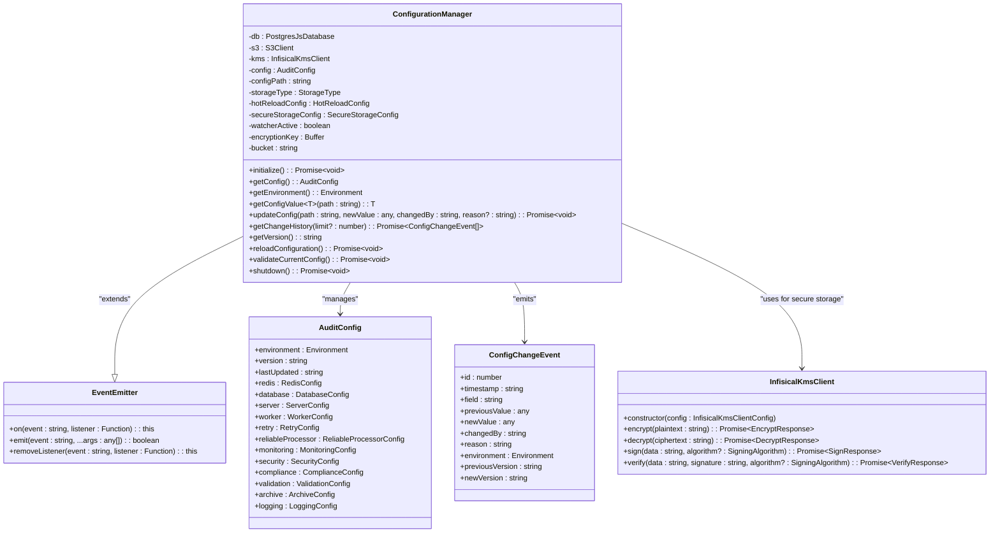
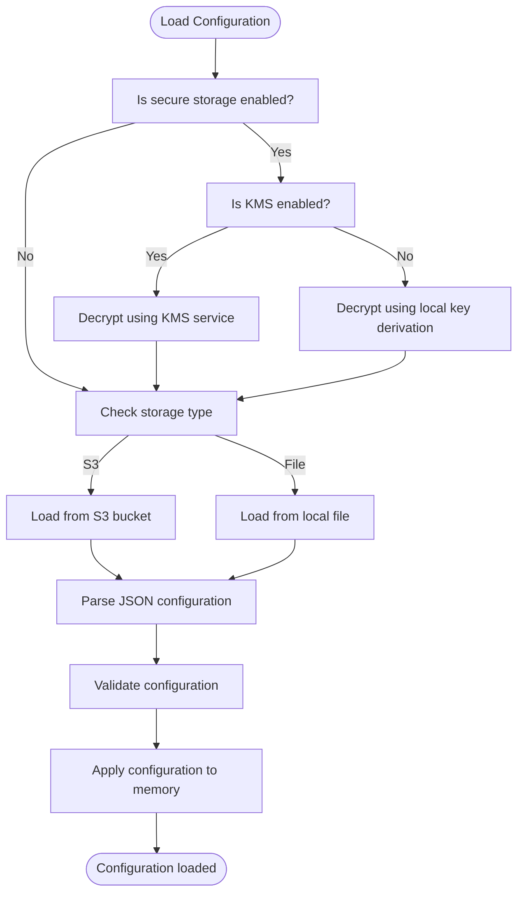
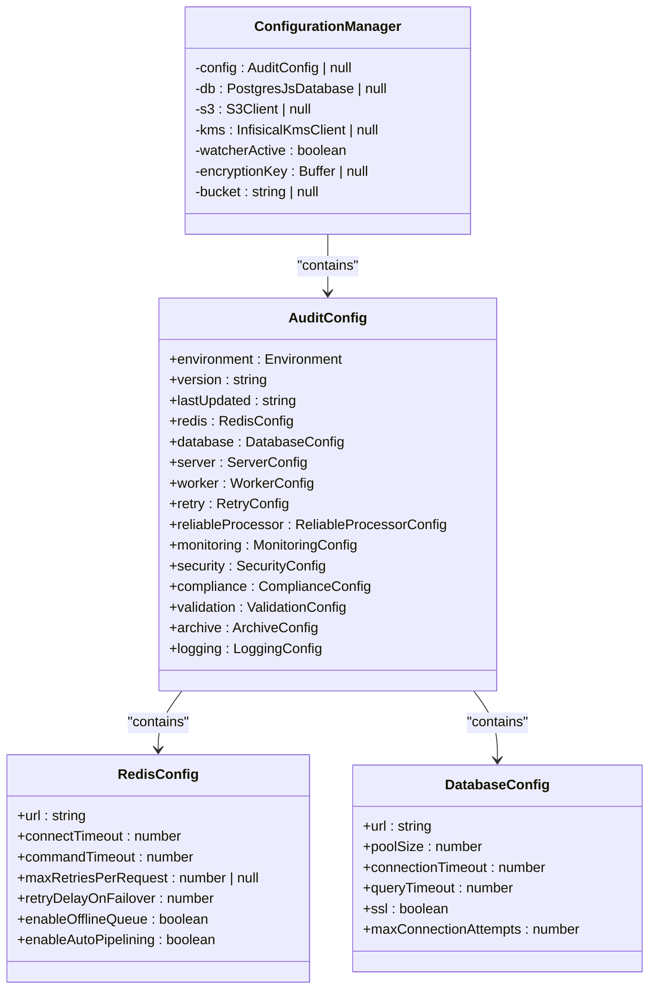
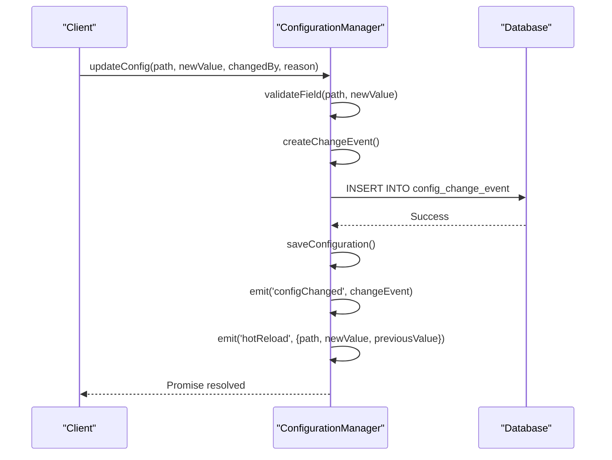
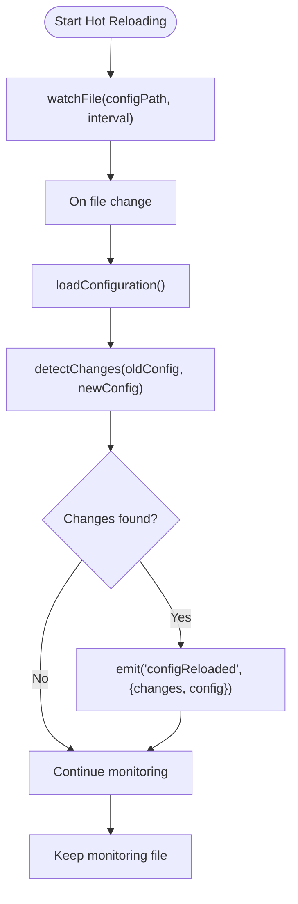
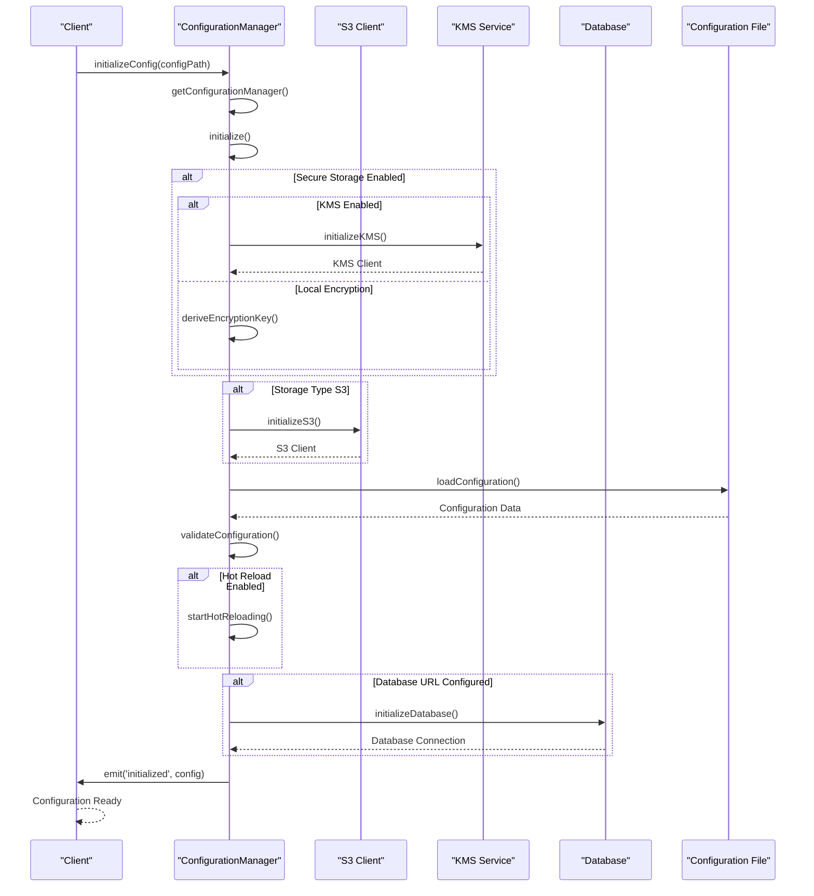
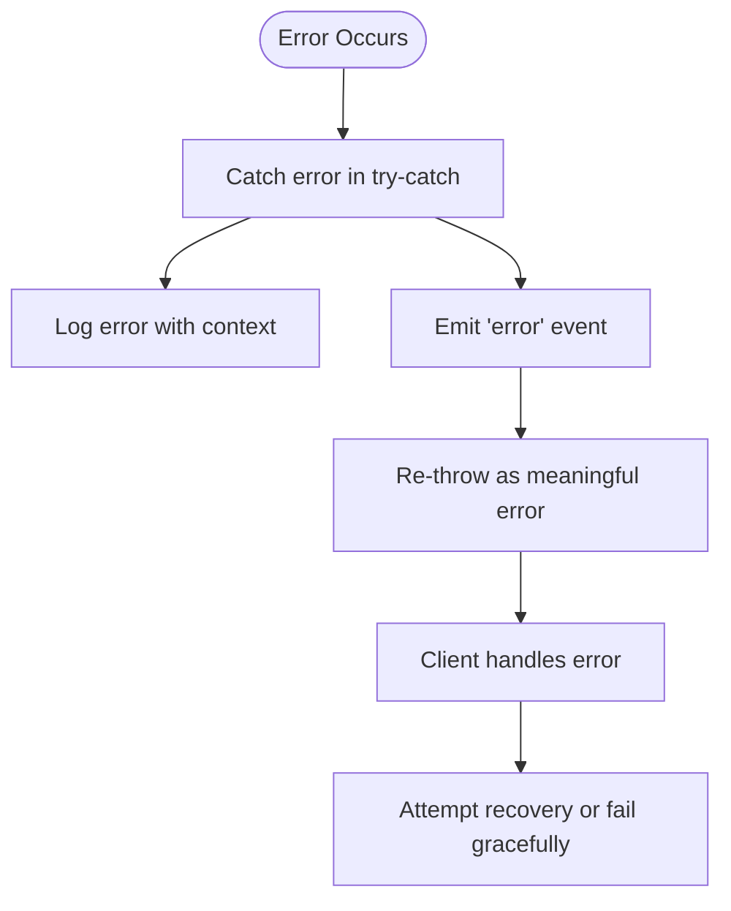
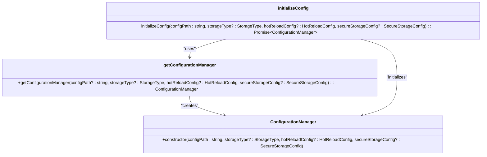

# Config Manager Implementation

<cite>
**Referenced Files in This Document**   
- [manager.ts](file://packages/audit/src/config/manager.ts) - *Updated in recent commit with KMS encryption support*
- [types.ts](file://packages/audit/src/config/types.ts) - *Updated with KMS configuration types*
- [validator.ts](file://packages/audit/src/config/validator.ts) - *Updated in recent commit*
- [infisical-kms/client.ts](file://packages/infisical-kms/src/client.ts) - *KMS client implementation*
- [infisical-kms/types.ts](file://packages/infisical-kms/src/types.ts) - *KMS configuration types*
</cite>

## Update Summary
**Changes Made**   
- Added comprehensive documentation for KMS encryption integration in the ConfigurationManager
- Updated Secure Storage section to include KMS configuration and workflow
- Enhanced Configuration Loading and Storage section with KMS encryption flow
- Updated Core Architecture diagram to include KMS client relationship
- Added new code examples for KMS configuration and usage
- Updated Factory Pattern Integration section with secure storage configuration
- Maintained all existing technical content about the Config Manager implementation
- Updated source references to maintain accuracy with recent changes

## Table of Contents
1. [Introduction](#introduction)
2. [Core Architecture](#core-architecture)
3. [Configuration Loading and Storage](#configuration-loading-and-storage)
4. [Hierarchical Overrides and Validation](#hierarchical-overrides-and-validation)
5. [Thread-Safe Access and State Management](#thread-safe-access-and-state-management)
6. [Change Detection and Event Emission](#change-detection-and-event-emission)
7. [Runtime Reconfiguration and Hot Reloading](#runtime-reconfiguration-and-hot-reloading)
8. [Integration with Archival and Monitoring](#integration-with-archival-and-monitoring)
9. [Initialization Lifecycle](#initialization-lifecycle)
10. [Error Handling](#error-handling)
11. [Factory Pattern Integration](#factory-pattern-integration)
12. [Code Examples](#code-examples)

## Introduction
The ConfigurationManager class provides a comprehensive solution for centralized configuration management in the audit system. It enables loading configuration from multiple sources, handling hierarchical overrides, ensuring thread-safe access, and supporting runtime reconfiguration through event-driven architecture. This document details the implementation, covering its role in the system architecture, internal state management, change detection mechanisms, and integration patterns with other components. Recent updates have added KMS (Key Management Service) integration for enhanced security of configuration data.

## Core Architecture
The ConfigurationManager implements a centralized configuration management system that serves as the single source of truth for application settings. It extends Node.js's EventEmitter class, enabling an event-driven architecture for configuration changes. The system now includes integration with Infisical KMS for secure encryption and decryption of configuration data.



**Diagram sources**
- [manager.ts](file://packages/audit/src/config/manager.ts#L33-L825)
- [infisical-kms/client.ts](file://packages/infisical-kms/src/client.ts#L15-L145)

**Section sources**
- [manager.ts](file://packages/audit/src/config/manager.ts#L33-L825)

## Configuration Loading and Storage
The ConfigurationManager supports multiple storage backends for configuration data, including local file system and Amazon S3. It also provides secure storage capabilities through encryption, now enhanced with KMS (Key Management Service) integration for improved security.

### Storage Types
The system supports two primary storage types:
- **File**: Local file system storage
- **S3**: Amazon S3 cloud storage

### Secure Storage with KMS
When secure storage is enabled with KMS, configurations are encrypted using the Infisical KMS service. The system supports both local encryption (AES-256-GCM with PBKDF2 or scrypt key derivation) and KMS-based encryption.



**Diagram sources**
- [manager.ts](file://packages/audit/src/config/manager.ts#L400-L600)

**Section sources**
- [manager.ts](file://packages/audit/src/config/manager.ts#L400-L600)

## Hierarchical Overrides and Validation
The configuration system implements a hierarchical validation approach with comprehensive rules for different configuration sections.

### Validation Schema
The validation system uses a schema-based approach with rules for required fields, data types, value ranges, patterns, and custom validation functions.

```typescript
const validationSchema: Record<string, ValidationRule> = {
    // Root level
    environment: {
        required: true,
        type: 'string',
        enum: ['development', 'staging', 'production', 'test'],
    },
    version: {
        required: true,
        type: 'string',
        pattern: /^[\d\w\-\.]+$/,
    },
    // Redis configuration
    'redis.url': {
        required: true,
        type: 'string',
        custom: (value) => {
            try {
                const url = new URL(value)
                return url.protocol === 'redis:' || url.protocol === 'rediss:' || 'Invalid Redis URL'
            } catch {
                return 'Invalid URL format'
            }
        },
    },
    // Database configuration
    'database.url': {
        required: true,
        type: 'string',
        custom: (value) => {
            try {
                const url = new URL(value)
                return (
                    url.protocol === 'postgresql:' || url.protocol === 'postgres:' || 'Invalid PostgreSQL URL'
                )
            } catch {
                return 'Invalid URL format'
            }
        },
    },
    // Cross-field validations
    'retry.maxDelay': {
        required: true,
        type: 'number',
        min: 1000,
        max: 300000,
    },
    'retry.baseDelay': {
        required: true,
        type: 'number',
        min: 100,
        max: 10000,
    }
}
```

### Cross-Field Validation
The system implements cross-field validation to ensure consistency between related configuration values:

```typescript
function validateCrossFieldConstraints(config: AuditConfig): void {
    // Validate retry configuration consistency
    if (config.retry.maxDelay < config.retry.baseDelay) {
        throw new ConfigValidationError(
            'retry.maxDelay must be greater than or equal to retry.baseDelay',
            'retry.maxDelay',
            config.retry.maxDelay,
            'cross-field'
        )
    }

    // Environment-specific validations
    if (config.environment === 'production') {
        if (!config.security.enableIntegrityVerification) {
            throw new ConfigValidationError(
                'security.enableIntegrityVerification must be true in production',
                'security.enableIntegrityVerification',
                config.security.enableIntegrityVerification,
                'production-required'
            )
        }

        if (!config.database.ssl) {
            throw new ConfigValidationError(
                'database.ssl must be true in production',
                'database.ssl',
                config.database.ssl,
                'production-required'
            )
        }
    }
}
```

**Section sources**
- [validator.ts](file://packages/audit/src/config/validator.ts#L0-L658)

## Thread-Safe Access and State Management
The ConfigurationManager ensures thread-safe access to configuration values through several mechanisms.

### Internal State Management
The configuration manager maintains its state in memory after loading, providing fast access to configuration values without repeated file I/O operations.



**Diagram sources**
- [manager.ts](file://packages/audit/src/config/manager.ts#L33-L825)
- [types.ts](file://packages/audit/src/config/types.ts#L0-L110)

**Section sources**
- [manager.ts](file://packages/audit/src/config/manager.ts#L33-L825)

## Change Detection and Event Emission
The configuration manager implements a robust change detection system that tracks modifications and emits events for subscribers.

### Change Event Structure
When a configuration value is updated, a ConfigChangeEvent is created and emitted:

```typescript
interface ConfigChangeEvent {
    id: number
    timestamp: string
    field: string
    previousValue: any
    newValue: any
    changedBy: string
    reason?: string
    environment: Environment
    previousVersion: string
    newVersion: string
}
```

### Change Detection Process
The system detects changes by comparing the current configuration with the previous version:



**Diagram sources**
- [manager.ts](file://packages/audit/src/config/manager.ts#L194-L240)

**Section sources**
- [manager.ts](file://packages/audit/src/config/manager.ts#L194-L240)

## Runtime Reconfiguration and Hot Reloading
The ConfigurationManager supports runtime reconfiguration through both programmatic updates and file-based hot reloading.

### Hot Reloading Configuration
The system can monitor the configuration file for changes and automatically reload when modifications are detected:

```typescript
interface HotReloadConfig {
    enabled: boolean
    reloadableFields: string[]
    checkInterval: number
}
```

### Hot Reloading Process


**Section sources**
- [manager.ts](file://packages/audit/src/config/manager.ts#L600-L698)

## Integration with Archival and Monitoring
Components such as archival and monitoring systems subscribe to configuration changes to adapt their behavior at runtime.

### Event Subscription Pattern
Components can subscribe to configuration change events to react to updates:

```typescript
// Example of how archival service might subscribe
const configManager = getConfigurationManager(configPath)
configManager.on('configChanged', (changeEvent) => {
    // Handle configuration changes
    if (changeEvent.field === 'archive.enabled') {
        if (changeEvent.newValue) {
            archivalService.start()
        } else {
            archivalService.stop()
        }
    }
    
    if (changeEvent.field === 'archive.retentionPeriod') {
        archivalService.updateRetentionPeriod(changeEvent.newValue)
    }
})

// Subscribe to hot reload events for specific fields
configManager.on('hotReload', ({ path, newValue, previousValue }) => {
    if (path === 'monitoring.enabled') {
        if (newValue) {
            monitoringService.start()
        } else {
            monitoringService.stop()
        }
    }
    
    if (path === 'monitoring.metricsInterval') {
        monitoringService.updateInterval(newValue)
    }
})
```

### Configuration Change History
The system maintains a history of configuration changes in the database:

```typescript
async getChangeHistory(limit?: number): Promise<ConfigChangeEvent[]> {
    const result = this.db
        ? await this.db.execute(sql`
            SELECT * FROM config_change_event
            ORDER BY timestamp DESC
            LIMIT ${limit || 10}
        `)
        : []

    const rows = result || []
    return rows.map(this.mapDatabaseChangeEventToChangeEvent)
}
```

**Section sources**
- [manager.ts](file://packages/audit/src/config/manager.ts#L237-L290)

## Initialization Lifecycle
The ConfigurationManager follows a well-defined initialization lifecycle that ensures proper setup before use.

### Initialization Sequence


**Diagram sources**
- [manager.ts](file://packages/audit/src/config/manager.ts#L80-L130)

**Section sources**
- [manager.ts](file://packages/audit/src/config/manager.ts#L80-L130)

## Error Handling
The configuration manager implements comprehensive error handling for various failure scenarios.

### Error Handling Strategy
The system uses a multi-layered approach to error handling:



### Specific Error Scenarios
The system handles various error scenarios:

1. **Configuration Loading Errors**: When the configuration file cannot be found or read
2. **Validation Errors**: When configuration values fail validation rules
3. **Storage Errors**: When S3 or file operations fail
4. **Database Errors**: When database operations fail
5. **Hot Reload Errors**: When configuration reloading fails
6. **KMS Errors**: When KMS encryption/decryption operations fail

```typescript
async initialize(): Promise<void> {
    try {
        // Initialization steps
    } catch (error) {
        this.emit('error', error)
        throw new Error(
            `Failed to load configuration: ${error instanceof Error ? error.message : 'Unknown error'}`
        )
    }
}

private async startHotReloading(): Promise<void> {
    watchFile(this.configPath, { interval: this.hotReloadConfig.checkInterval }, async () => {
        try {
            await this.reloadConfiguration()
        } catch (error) {
            this.emit(
                'error',
                new Error(
                    `Hot reload failed: ${error instanceof Error ? error.message : 'Unknown error'}`
                )
            )
        }
    })
}
```

**Section sources**
- [manager.ts](file://packages/audit/src/config/manager.ts#L80-L130)

## Factory Pattern Integration
The configuration manager integrates with the factory pattern through several factory functions that simplify instantiation.

### Factory Functions
The system provides factory functions to create and manage configuration manager instances:

```typescript
/**
 * Default configuration manager instance
 */
let defaultManager: ConfigurationManager | null = null

/**
 * Get or create the default configuration manager
 */
export function getConfigurationManager(
    configPath?: string,
    storageType?: StorageType,
    hotReloadConfig?: HotReloadConfig,
    secureStorageConfig?: SecureStorageConfig
): ConfigurationManager {
    if (!defaultManager) {
        if (!configPath) {
            throw new Error('Configuration path required for first initialization')
        }
        defaultManager = new ConfigurationManager(
            configPath,
            storageType,
            hotReloadConfig,
            secureStorageConfig
        )
    }
    return defaultManager
}

/**
 * Initialize the default configuration manager
 */
export async function initializeConfig(
    configPath: string,
    storageType?: StorageType,
    hotReloadConfig?: HotReloadConfig,
    secureStorageConfig?: SecureStorageConfig
): Promise<ConfigurationManager> {
    const manager = getConfigurationManager(
        configPath,
        storageType,
        hotReloadConfig,
        secureStorageConfig
    )
    await manager.initialize()
    return manager
}
```

### Factory Usage with KMS
```typescript
// Example of initializing with KMS secure storage
const secureConfig: SecureStorageConfig = {
    enabled: true,
    algorithm: 'AES-256-GCM',
    kdf: 'PBKDF2',
    salt: process.env.AUDIT_CONFIG_SALT || randomBytes(32).toString('hex'),
    iterations: 100000,
    kms: {
        enabled: true,
        encryptionKey: process.env.KMS_ENCRYPTION_KEY || '',
        signingKey: process.env.KMS_SIGNING_KEY || '',
        accessToken: process.env.INFISICAL_ACCESS_TOKEN || '',
        baseUrl: process.env.INFISICAL_URL || '',
    },
}

const configManager = await initializeConfig('./config.json', 'file', undefined, secureConfig)
```



**Diagram sources**
- [manager.ts](file://packages/audit/src/config/manager.ts#L835-L872)

**Section sources**
- [manager.ts](file://packages/audit/src/config/manager.ts#L835-L872)

## Code Examples
This section provides practical examples of using the ConfigurationManager for various operations.

### Basic Usage
```typescript
import { initializeConfig, getConfigurationManager } from '@repo/audit/config'

// Initialize the configuration manager
const configManager = await initializeConfig('./config.json')

// Get the default configuration manager instance
const defaultManager = getConfigurationManager()

// Get configuration values
const environment = defaultManager.getEnvironment()
const isProduction = defaultManager.isProduction()
const redisUrl = defaultManager.getConfigValue<string>('redis.url')
const poolSize = defaultManager.getConfigValue<number>('database.poolSize')
```

### Configuration Update
```typescript
// Update a configuration value
await defaultManager.updateConfig(
    'monitoring.enabled', 
    true, 
    'admin-user', 
    'Enabling monitoring for performance tracking'
)

// Update nested configuration
await defaultManager.updateConfig(
    'retry.maxRetries', 
    5, 
    'system', 
    'Increasing retry attempts for reliability'
)
```

### Event Subscription
```typescript
// Subscribe to configuration changes
defaultManager.on('configChanged', (changeEvent) => {
    console.log(`Configuration changed: ${changeEvent.field}`)
    console.log(`Previous value: ${changeEvent.previousValue}`)
    console.log(`New value: ${changeEvent.newValue}`)
    console.log(`Changed by: ${changeEvent.changedBy}`)
})

// Subscribe to initialization
defaultManager.on('initialized', (config) => {
    console.log('Configuration manager initialized')
    console.log(`Environment: ${config.environment}`)
    console.log(`Version: ${config.version}`)
})

// Subscribe to errors
defaultManager.on('error', (error) => {
    console.error('Configuration error:', error.message)
})
```

### Watch Pattern
```typescript
// Watch for specific configuration changes
const watchMonitoring = (configManager: ConfigurationManager) => {
    configManager.on('hotReload', ({ path, newValue }) => {
        if (path === 'monitoring.enabled') {
            if (newValue) {
                startMonitoring()
            } else {
                stopMonitoring()
            }
        }
        
        if (path === 'monitoring.metricsInterval') {
            updateMetricsInterval(newValue)
        }
    })
}

// Watch archival configuration
const watchArchival = (configManager: ConfigurationManager) => {
    configManager.on('configChanged', (changeEvent) => {
        if (changeEvent.field === 'archive.enabled') {
            if (changeEvent.newValue) {
                archivalService.start()
            } else {
                archivalService.stop()
            }
        }
        
        if (changeEvent.field === 'archive.retentionPeriod') {
            archivalService.updateRetentionPeriod(changeEvent.newValue)
        }
    })
}
```

### Type-Safe Accessors
```typescript
// Type-safe configuration access
interface DatabaseConfig {
    url: string
    poolSize: number
    connectionTimeout: number
    queryTimeout: number
    ssl: boolean
    maxConnectionAttempts: number
}

interface RedisConfig {
    url: string
    connectTimeout: number
    commandTimeout: number
    maxRetriesPerRequest: number | null
    retryDelayOnFailover: number
    enableOfflineQueue: boolean
    enableAutoPipelining: boolean
}

// Type-safe access to database configuration
const getDatabaseConfig = (configManager: ConfigurationManager): DatabaseConfig => {
    return {
        url: configManager.getConfigValue<string>('database.url'),
        poolSize: configManager.getConfigValue<number>('database.poolSize'),
        connectionTimeout: configManager.getConfigValue<number>('database.connectionTimeout'),
        queryTimeout: configManager.getConfigValue<number>('database.queryTimeout'),
        ssl: configManager.getConfigValue<boolean>('database.ssl'),
        maxConnectionAttempts: configManager.getConfigValue<number>('database.maxConnectionAttempts')
    }
}

// Type-safe access to redis configuration
const getRedisConfig = (configManager: ConfigurationManager): RedisConfig => {
    return {
        url: configManager.getConfigValue<string>('redis.url'),
        connectTimeout: configManager.getConfigValue<number>('redis.connectTimeout'),
        commandTimeout: configManager.getConfigValue<number>('redis.commandTimeout'),
        maxRetriesPerRequest: configManager.getConfigValue<number | null>('redis.maxRetriesPerRequest'),
        retryDelayOnFailover: configManager.getConfigValue<number>('redis.retryDelayOnFailover'),
        enableOfflineQueue: configManager.getConfigValue<boolean>('redis.enableOfflineQueue'),
        enableAutoPipelining: configManager.getConfigValue<boolean>('redis.enableAutoPipelining')
    }
}
```

### KMS Secure Storage Configuration
```typescript
import { ConfigurationManager } from '@repo/audit/config'
import { InfisicalKmsClient } from '@repo/infisical-kms'

// Configure secure storage with KMS
const secureStorageConfig = {
    enabled: true,
    algorithm: 'AES-256-GCM',
    kdf: 'PBKDF2',
    salt: process.env.AUDIT_CONFIG_SALT || randomBytes(32).toString('hex'),
    iterations: 100000,
    kms: {
        enabled: true,
        encryptionKey: process.env.KMS_ENCRYPTION_KEY || '',
        signingKey: process.env.KMS_SIGNING_KEY || '',
        accessToken: process.env.INFISICAL_ACCESS_TOKEN || '',
        baseUrl: process.env.INFISICAL_URL || '',
    },
}

// Initialize configuration manager with KMS
const configManager = new ConfigurationManager(
    './config.json',
    'file',
    { enabled: true, reloadableFields: ['monitoring.enabled', 'archive.enabled'], checkInterval: 30000 },
    secureStorageConfig
)

await configManager.initialize()

// The configuration will be automatically encrypted/decrypted using KMS
await configManager.updateConfig('database.url', 'postgresql://new-host:5432/audit', 'admin', 'Database migration')
```

**Section sources**
- [manager.ts](file://packages/audit/src/config/manager.ts#L133-L197)
- [infisical-kms/client.ts](file://packages/infisical-kms/src/client.ts#L15-L145)