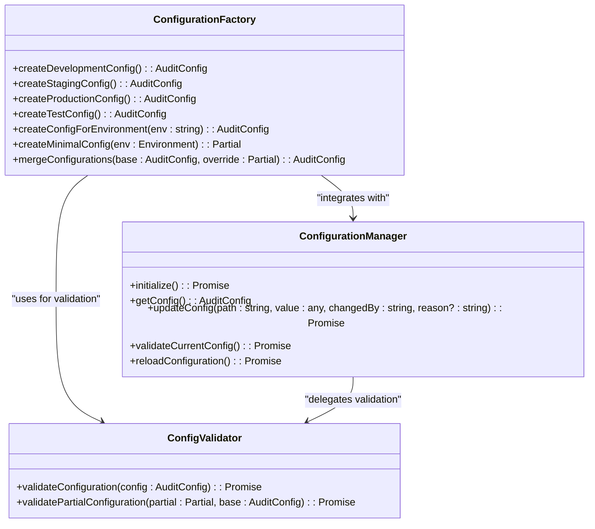
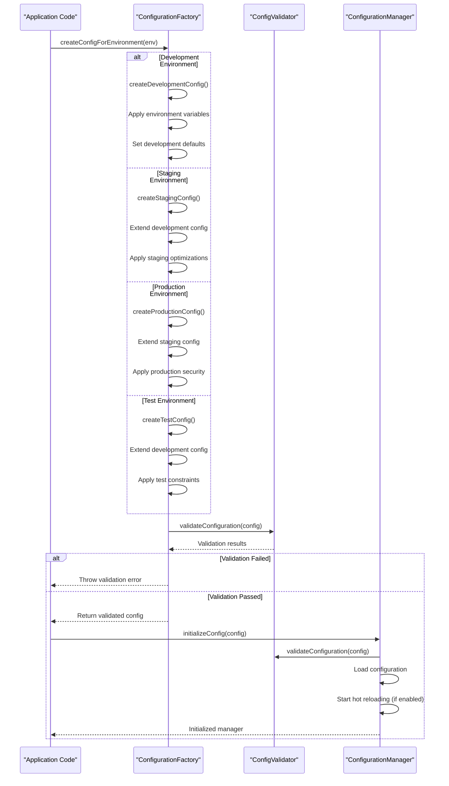

# Configuration Factory Pattern

<cite>
**Referenced Files in This Document**   
- [factory.ts](file://packages/audit/src/config/factory.ts)
- [types.ts](file://packages/audit/src/config/types.ts)
- [validator.ts](file://packages/audit/src/config/validator.ts)
- [manager.ts](file://packages/audit/src/config/manager.ts)
- [index.ts](file://packages/audit/src/index.ts)
</cite>

## Table of Contents
1. [Introduction](#introduction)
2. [Configuration Factory Overview](#configuration-factory-overview)
3. [Core Configuration Types](#core-configuration-types)
4. [Factory Creation Workflow](#factory-creation-workflow)
5. [Environment-Specific Configuration Profiles](#environment-specific-configuration-profiles)
6. [Configuration Validation Pipeline](#configuration-validation-pipeline)
7. [Configuration Manager Integration](#configuration-manager-integration)
8. [Factory Usage Examples](#factory-usage-examples)
9. [Advanced Configuration Patterns](#advanced-configuration-patterns)
10. [Error Handling and Validation](#error-handling-and-validation)
11. [Extension Points and Customization](#extension-points-and-customization)

## Introduction
The Configuration Factory Pattern in the audit system provides a robust mechanism for creating and managing environment-specific configurations with proper defaults, validation, and dependency injection. This document details the implementation of the factory pattern, its integration with the configuration manager and validator, and practical usage patterns for initializing audit systems across different deployment scenarios.

**Section sources**
- [factory.ts](file://packages/audit/src/config/factory.ts#L1-L750)
- [types.ts](file://packages/audit/src/config/types.ts#L1-L545)

## Configuration Factory Overview
The Configuration Factory Pattern implements a comprehensive system for creating audit configurations with environment-specific defaults, validation, and merging capabilities. The factory provides multiple entry points for configuration creation, including environment-specific profiles, minimal configurations, and merged configurations with override precedence.

The factory system is designed to handle the complexity of audit system configuration across development, staging, production, and test environments, ensuring consistent defaults while allowing for environment-specific optimizations and security requirements.



**Diagram sources**
- [factory.ts](file://packages/audit/src/config/factory.ts#L1-L750)
- [manager.ts](file://packages/audit/src/config/manager.ts#L1-L873)
- [validator.ts](file://packages/audit/src/config/validator.ts#L1-L658)

**Section sources**
- [factory.ts](file://packages/audit/src/config/factory.ts#L1-L750)
- [manager.ts](file://packages/audit/src/config/manager.ts#L1-L873)
- [validator.ts](file://packages/audit/src/config/validator.ts#L1-L658)

## Core Configuration Types
The configuration system is built around the `AuditConfig` interface, which defines the complete structure of the audit system configuration. The interface includes nested configurations for various system components, ensuring type safety and comprehensive documentation.

The configuration types define a hierarchical structure that covers all aspects of the audit system, from database and Redis connections to server settings, worker configurations, security policies, and compliance requirements.


**Diagram sources**
- [types.ts](file://packages/audit/src/config/types.ts#L1-L545)

**Section sources**
- [types.ts](file://packages/audit/src/config/types.ts#L1-L545)

## Factory Creation Workflow
The configuration factory follows a hierarchical creation workflow that starts with environment-specific base configurations and allows for merging and customization. The workflow ensures that configurations are validated and properly bootstrapped before being used by the system.

The creation process begins with the selection of an environment profile, which provides sensible defaults for that environment. The factory then allows for merging with custom configurations, ensuring that environment-specific requirements are maintained while allowing for necessary overrides.



**Diagram sources**
- [factory.ts](file://packages/audit/src/config/factory.ts#L1-L750)
- [validator.ts](file://packages/audit/src/config/validator.ts#L1-L658)
- [manager.ts](file://packages/audit/src/config/manager.ts#L1-L873)

**Section sources**
- [factory.ts](file://packages/audit/src/config/factory.ts#L1-L750)
- [validator.ts](file://packages/audit/src/config/validator.ts#L1-L658)
- [manager.ts](file://packages/audit/src/config/manager.ts#L1-L873)

## Environment-Specific Configuration Profiles
The factory provides four distinct configuration profiles tailored to different deployment scenarios: development, staging, production, and test. Each profile inherits from the previous one, creating a hierarchy of increasing strictness and optimization.

The environment-specific profiles ensure that appropriate defaults are applied based on the deployment context, from relaxed settings in development to stringent security requirements in production.

### Development Configuration
The development configuration profile provides permissive settings optimized for local development and debugging. It includes features like verbose logging, relaxed security, and accessible endpoints to facilitate rapid development.

```typescript
export function createDevelopmentConfig(): AuditConfig {
	return {
		environment: 'development',
		version: '1.0.0',
		lastUpdated: new Date().toISOString(),
		redis: {
			url: process.env.REDIS_URL || 'redis://localhost:6379',
			connectTimeout: 10000,
			commandTimeout: 10000,
			maxRetriesPerRequest: null,
			retryDelayOnFailover: 100,
			enableOfflineQueue: true,
			enableAutoPipelining: true,
		},
		database: {
			url: process.env.AUDIT_DB_URL || 'postgresql://localhost:5432/audit_dev',
			poolSize: 10,
			connectionTimeout: 10000,
			queryTimeout: 30000,
			ssl: false,
			maxConnectionAttempts: 3,
		},
		server: {
			port: 3000,
			host: '0.0.0.0',
			environment: 'development',
			timeout: 30000,
			cors: {
				origin: '*',
				credentials: true,
				allowedMethods: ['GET', 'POST', 'PUT', 'DELETE', 'OPTIONS'],
				allowedHeaders: [
					'Content-Type',
					'Authorization',
					'x-application',
					'x-requestid',
					'x-version',
				],
			},
			logging: {
				level: 'debug',
				structured: true,
				format: 'json',
				enableCorrelationIds: true,
				retentionDays: 30,
			},
		},
		// ... other configuration properties
	}
}
```

**Section sources**
- [factory.ts](file://packages/audit/src/config/factory.ts#L15-L150)

### Staging Configuration
The staging configuration extends the development profile with more restrictive settings that mirror production. It includes enhanced security, performance monitoring, and compliance features to validate the system before production deployment.

```typescript
export function createStagingConfig(): AuditConfig {
	const baseConfig = createDevelopmentConfig()

	return {
		...baseConfig,
		environment: 'staging',
		redis: {
			...baseConfig.redis,
			url: process.env.REDIS_URL || 'redis://redis-staging:6379',
		},
		database: {
			...baseConfig.database,
			url: process.env.AUDIT_DB_URL || 'postgresql://postgres-staging:5432/audit_staging',
			ssl: true,
			poolSize: 15,
		},
		security: {
			...baseConfig.security,
			enableEventSigning: true,
			enableLogEncryption: true,
		},
		logging: {
			...baseConfig.logging,
			level: 'info',
			retentionDays: 90,
		},
		// ... other configuration properties
	}
}
```

**Section sources**
- [factory.ts](file://packages/audit/src/config/factory.ts#L152-L350)

### Production Configuration
The production configuration extends the staging profile with the most stringent security and performance settings. It includes production-grade security requirements, optimized performance parameters, and strict compliance policies.

```typescript
export function createProductionConfig(): AuditConfig {
	const baseConfig = createStagingConfig()

	return {
		...baseConfig,
		environment: 'production',
		redis: {
			...baseConfig.redis,
			url: process.env.REDIS_URL || 'rediss://redis-prod:6380',
			connectTimeout: 5000,
			commandTimeout: 3000,
			maxRetriesPerRequest: 5,
		},
		database: {
			...baseConfig.database,
			url: process.env.AUDIT_DB_URL || 'postgresql://postgres-prod:5432/audit_prod',
			ssl: true,
			poolSize: 25,
			connectionTimeout: 5000,
			queryTimeout: 60000,
			maxConnectionAttempts: 5,
		},
		security: {
			...baseConfig.security,
			enableIntegrityVerification: true,
			hashAlgorithm: 'SHA-256',
			enableEventSigning: true,
			enableLogEncryption: true,
		},
		logging: {
			...baseConfig.logging,
			level: 'warn',
			retentionDays: 365,
		},
		// ... other configuration properties
	}
}
```

**Section sources**
- [factory.ts](file://packages/audit/src/config/factory.ts#L352-L550)

### Test Configuration
The test configuration extends the development profile with settings optimized for automated testing. It includes reduced timeouts, minimal logging, and disabled monitoring to ensure fast test execution and predictable behavior.

```typescript
export function createTestConfig(): AuditConfig {
	const baseConfig = createDevelopmentConfig()

	return {
		...baseConfig,
		environment: 'test',
		monitoring: {
			...baseConfig.monitoring,
			enabled: false,
			metricsInterval: 60000,
			healthCheckInterval: 60000,
		},
		security: {
			...baseConfig.security,
			enableIntegrityVerification: false,
			enableEventSigning: false,
			enableLogEncryption: false,
		},
		compliance: {
			...baseConfig.compliance,
			defaultRetentionDays: 1,
			enableAutoArchival: false,
			enablePseudonymization: false,
		},
		logging: {
			...baseConfig.logging,
			level: 'error',
			retentionDays: 1,
		},
		// ... other configuration properties
	}
}
```

**Section sources**
- [factory.ts](file://packages/audit/src/config/factory.ts#L552-L700)

## Configuration Validation Pipeline
The configuration validation system provides comprehensive validation for audit system configurations, ensuring that all settings meet required constraints before the system is initialized. The validation pipeline executes during configuration creation and instantiation, preventing invalid configurations from being used.

The validation system uses a schema-based approach with field-specific rules for type checking, range validation, pattern matching, and custom validation logic. It also includes cross-field validation to ensure consistency between related configuration parameters.


**Diagram sources**
- [validator.ts](file://packages/audit/src/config/validator.ts#L1-L658)

**Section sources**
- [validator.ts](file://packages/audit/src/config/validator.ts#L1-L658)

## Configuration Manager Integration
The Configuration Factory Pattern integrates closely with the ConfigurationManager to provide a complete configuration lifecycle management system. The manager handles configuration loading, validation, hot-reloading, and secure storage, while the factory provides the initial configuration templates.

The integration between the factory and manager ensures that configurations are properly validated, persisted, and monitored throughout their lifecycle, providing a robust foundation for the audit system.


**Diagram sources**
- [manager.ts](file://packages/audit/src/config/manager.ts#L1-L873)
- [factory.ts](file://packages/audit/src/config/factory.ts#L1-L750)

**Section sources**
- [manager.ts](file://packages/audit/src/config/manager.ts#L1-L873)
- [factory.ts](file://packages/audit/src/config/factory.ts#L1-L750)

## Factory Usage Examples
The Configuration Factory Pattern provides several practical usage patterns for initializing audit systems with custom configurations. These examples demonstrate how to use the factory in different scenarios, from simple environment-based initialization to complex configuration merging.

### Basic Environment-Based Initialization
The simplest usage pattern is to create a configuration based on the current environment, which automatically applies appropriate defaults.

```typescript
import { createConfigForEnvironment } from '@smart-logs/audit/config/factory'
import { initializeConfig } from '@smart-logs/audit/config/manager'

// Initialize configuration based on environment
const environment = process.env.NODE_ENV || 'development'
const config = createConfigForEnvironment(environment)
const configManager = await initializeConfig(config, './config/audit.json')

// Use the configuration
const serverPort = configManager.getConfigValue<number>('server.port')
console.log(`Server will run on port ${serverPort}`)
```

**Section sources**
- [factory.ts](file://packages/audit/src/config/factory.ts#L702-L725)
- [manager.ts](file://packages/audit/src/config/manager.ts#L814-L872)

### Custom Configuration with Merging
For scenarios requiring custom settings while maintaining environment-specific defaults, the factory provides a merge configuration function.

```typescript
import { 
  createConfigForEnvironment, 
  mergeConfigurations 
} from '@smart-logs/audit/config/factory'
import { initializeConfig } from '@smart-logs/audit/config/manager'

// Create base configuration for production
const baseConfig = createConfigForEnvironment('production')

// Define custom overrides
const customConfig = {
  server: {
    port: 8080,
    cors: {
      origin: ['https://myapp.com', 'https://admin.myapp.com']
    }
  },
  logging: {
    level: 'info',
    retentionDays: 180
  },
  compliance: {
    reportingSchedule: {
      enabled: true,
      frequency: 'daily',
      recipients: ['compliance@mycompany.com']
    }
  }
}

// Merge configurations with override precedence
const finalConfig = mergeConfigurations(baseConfig, customConfig)
const configManager = await initializeConfig(finalConfig, './config/audit.json')
```

**Section sources**
- [factory.ts](file://packages/audit/src/config/factory.ts#L727-L750)

### Minimal Configuration for Testing
For testing scenarios, the factory provides a minimal configuration function that includes only required fields.

```typescript
import { createMinimalConfig } from '@smart-logs/audit/config/factory'
import { initializeConfig } from '@smart-logs/audit/config/manager'

// Create minimal configuration for testing
const minimalConfig = createMinimalConfig('test')
const configManager = await initializeConfig(minimalConfig, './config/test.json')

// The minimal configuration includes only essential fields
// while allowing the system to function for testing purposes
console.log('Minimal config created with environment:', minimalConfig.environment)
```

**Section sources**
- [factory.ts](file://packages/audit/src/config/factory.ts#L600-L650)

### Dynamic Configuration Updates
The configuration manager allows for dynamic updates to the configuration at runtime, with proper validation and change tracking.

```typescript
import { createConfigForEnvironment } from '@smart-logs/audit/config/factory'
import { initializeConfig } from '@smart-logs/audit/config/manager'

// Initialize configuration
const config = createConfigForEnvironment('production')
const configManager = await initializeConfig(config, './config/audit.json')

// Listen for configuration changes
configManager.on('configChanged', (changeEvent) => {
  console.log(`Configuration changed: ${changeEvent.field}`)
  console.log(`Previous value: ${changeEvent.previousValue}`)
  console.log(`New value: ${changeEvent.newValue}`)
  console.log(`Changed by: ${changeEvent.changedBy}`)
})

// Update configuration dynamically
await configManager.updateConfig(
  'server.rateLimit.maxRequests', 
  200, 
  'system', 
  'Increase rate limit for high traffic period'
)

// The change is validated, persisted, and events are emitted
console.log('Rate limit updated successfully')
```

**Section sources**
- [manager.ts](file://packages/audit/src/config/manager.ts#L200-L300)

## Advanced Configuration Patterns
The Configuration Factory Pattern supports several advanced patterns for complex deployment scenarios, including secure configuration storage, hot-reloading, and multi-environment deployment strategies.

### Secure Configuration Storage
The configuration system supports secure storage of configuration files using encryption, protecting sensitive information like database credentials and encryption keys.

```typescript
import { initializeConfig } from '@smart-logs/audit/config/manager'

// Initialize configuration manager with secure storage
const secureStorageConfig = {
  enabled: true,
  algorithm: 'AES-256-GCM',
  kdf: 'PBKDF2',
  salt: process.env.AUDIT_CONFIG_SALT || 'your-salt-here',
  iterations: 100000,
}

const configManager = await initializeConfig(
  './config/audit.json',
  'file',
  undefined,
  secureStorageConfig
)

// The configuration file is encrypted when saved and decrypted when loaded
// protecting sensitive information at rest
```

**Section sources**
- [manager.ts](file://packages/audit/src/config/manager.ts#L100-L150)

### Configuration Hot-Reloading
The system supports hot-reloading of configuration files, allowing changes to be applied without restarting the application.

```typescript
import { initializeConfig } from '@smart-logs/audit/config/manager'

// Initialize configuration manager with hot-reloading
const hotReloadConfig = {
  enabled: true,
  reloadableFields: [
    'server.rateLimit.maxRequests',
    'server.rateLimit.windowMs',
    'monitoring.alertThresholds.errorRate',
    'monitoring.alertThresholds.processingLatency'
  ],
  checkInterval: 10000, // Check every 10 seconds
}

const configManager = await initializeConfig(
  './config/audit.json',
  'file',
  hotReloadConfig
)

// Listen for hot-reload events
configManager.on('hotReload', (event) => {
  console.log(`Hot-reload applied: ${event.path}`)
  console.log(`New value: ${event.newValue}`)
  
  // Apply runtime changes based on the updated configuration
  if (event.path === 'server.rateLimit.maxRequests') {
    // Update rate limiter with new value
    rateLimiter.updateMaxRequests(event.newValue)
  }
})
```

**Section sources**
- [manager.ts](file://packages/audit/src/config/manager.ts#L500-L600)

## Error Handling and Validation
The configuration system implements comprehensive error handling and validation to ensure that invalid configurations are caught early and provide meaningful error messages.

### Validation Error Handling
The validation system aggregates all validation errors and provides detailed information about each failure, making it easier to diagnose configuration issues.

```typescript
import { validateConfiguration } from '@smart-logs/audit/config/validator'

try {
  await validateConfiguration(config)
  console.log('Configuration is valid')
} catch (error) {
  if (error instanceof Error) {
    console.error('Configuration validation failed:')
    console.error(error.message)
    
    // Extract individual validation errors from the message
    const validationErrors = error.message
      .replace('Configuration validation failed: ', '')
      .split('; ')
      .map(err => {
        const [field, ...rest] = err.split(': ')
        return {
          field,
          message: rest.join(': ')
        }
      })
    
    validationErrors.forEach(err => {
      console.error(`- ${err.field}: ${err.message}`)
    })
  }
}
```

**Section sources**
- [validator.ts](file://packages/audit/src/config/validator.ts#L100-L200)

### Environment-Specific Validation Rules
The validation system includes environment-specific rules that enforce stricter requirements in production environments.

```typescript
function validateCrossFieldConstraints(config: AuditConfig): void {
  // Environment-specific validations
  if (config.environment === 'production') {
    if (!config.security.enableIntegrityVerification) {
      throw new ConfigValidationError(
        'security.enableIntegrityVerification must be true in production',
        'security.enableIntegrityVerification',
        config.security.enableIntegrityVerification,
        'production-required'
      )
    }

    if (!config.database.ssl) {
      throw new ConfigValidationError(
        'database.ssl must be true in production',
        'database.ssl',
        config.database.ssl,
        'production-required'
      )
    }

    if (config.logging.level === 'debug') {
      throw new ConfigValidationError(
        'logging.level should not be debug in production',
        'logging.level',
        config.logging.level,
        'production-constraint'
      )
    }
  }
}
```

**Section sources**
- [validator.ts](file://packages/audit/src/config/validator.ts#L500-L550)

## Extension Points and Customization
The Configuration Factory Pattern provides several extension points for customizing the configuration system to meet specific requirements.

### Custom Configuration Factories
Applications can extend the factory pattern to create custom configuration profiles for specialized deployment scenarios.

```typescript
// Custom factory for high-availability environments
function createHighAvailabilityConfig(): AuditConfig {
  const baseConfig = createProductionConfig()
  
  return {
    ...baseConfig,
    database: {
      ...baseConfig.database,
      url: process.env.AUDIT_DB_URL || 'postgresql://cluster-primary:5432/audit_prod',
      readReplica: {
        url: process.env.AUDIT_DB_READ_REPLICA_URL || 'postgresql://cluster-secondary:5432/audit_prod',
        poolSize: 10,
      }
    },
    reliableProcessor: {
      ...baseConfig.reliableProcessor,
      retryConfig: {
        ...baseConfig.reliableProcessor.retryConfig,
        maxRetries: 10,
        baseDelay: 5000,
      },
      circuitBreakerConfig: {
        ...baseConfig.reliableProcessor.circuitBreakerConfig,
        failureThreshold: 2,
        recoveryTimeout: 120000,
      }
    },
    monitoring: {
      ...baseConfig.monitoring,
      alertThresholds: {
        ...baseConfig.monitoring.alertThresholds,
        errorRate: 0.005,
        processingLatency: 1000,
      }
    }
  }
}
```

**Section sources**
- [factory.ts](file://packages/audit/src/config/factory.ts#L1-L750)

### Integration with Dependency Injection Containers
The configuration system can be integrated with dependency injection containers to provide configuration-driven service instantiation.

```typescript
// Example with a hypothetical DI container
import { Container } from 'inversify'
import { createConfigForEnvironment } from '@smart-logs/audit/config/factory'

// Create container
const container = new Container()

// Register configuration
const config = createConfigForEnvironment(process.env.NODE_ENV || 'development')
container.bind<AuditConfig>('AuditConfig').toConstantValue(config)

// Register services that depend on configuration
container.bind<DatabaseService>('DatabaseService').toDynamicValue((context) => {
  const config = context.container.get<AuditConfig>('AuditConfig')
  return new DatabaseService(config.database.url, config.database.poolSize)
})

// Register monitoring service
container.bind<MonitoringService>('MonitoringService').toDynamicValue((context) => {
  const config = context.container.get<AuditConfig>('AuditConfig')
  return new MonitoringService({
    enabled: config.monitoring.enabled,
    metricsInterval: config.monitoring.metricsInterval,
    alertThresholds: config.monitoring.alertThresholds
  })
})
```

**Section sources**
- [factory.ts](file://packages/audit/src/config/factory.ts#L1-L750)
- [index.ts](file://packages/audit/src/index.ts#L1-L73)