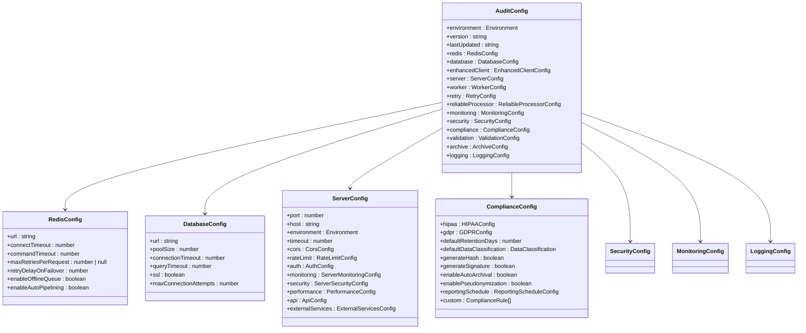
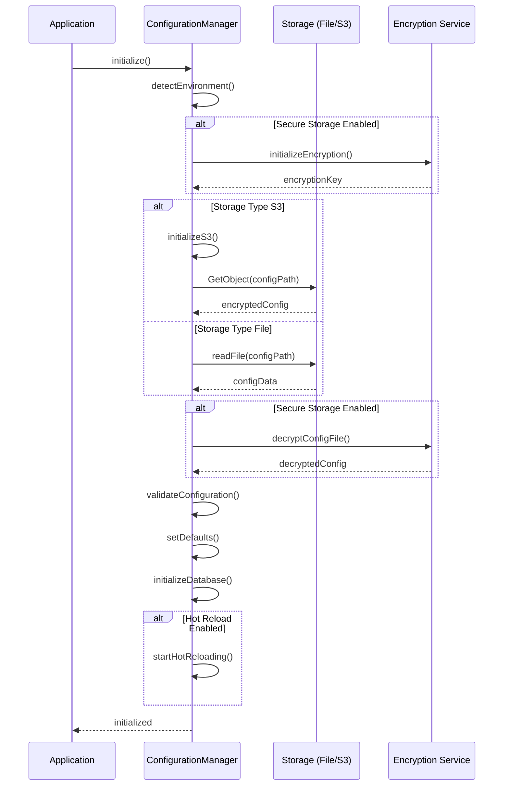
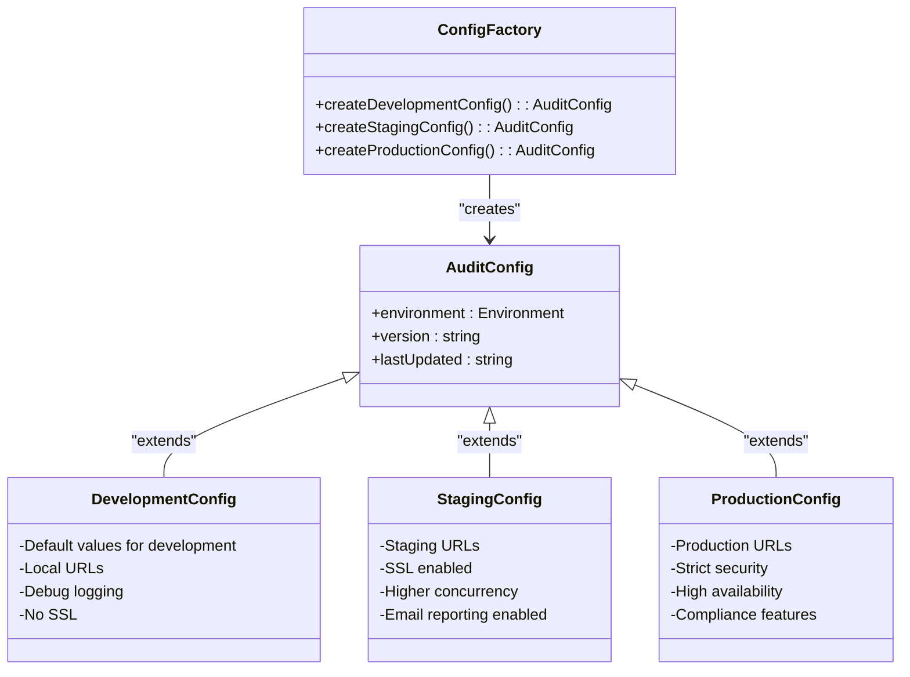
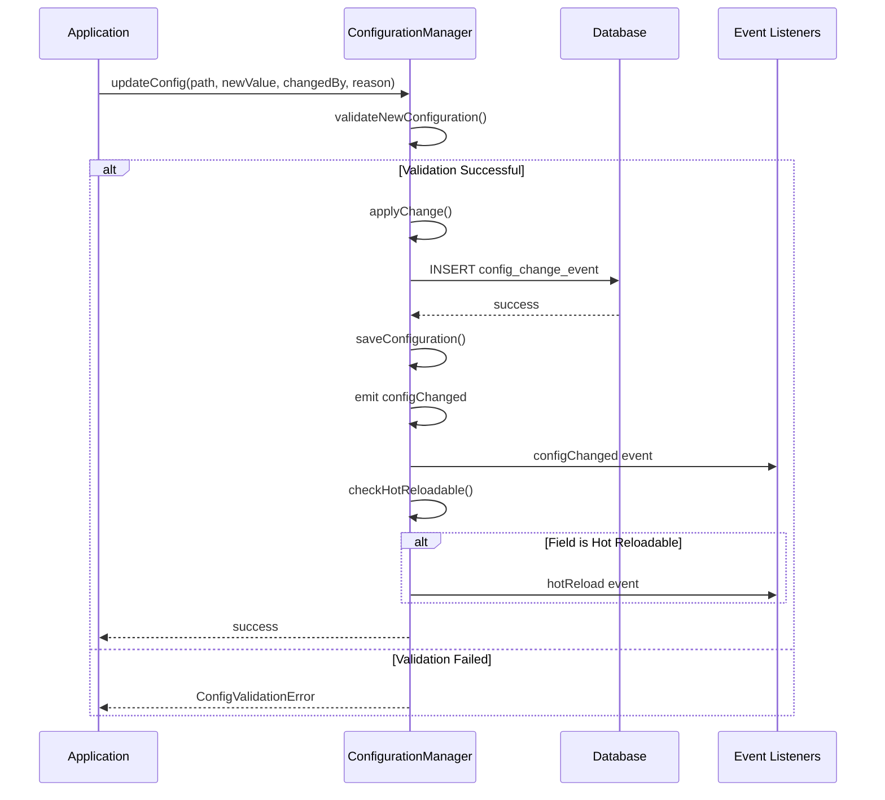
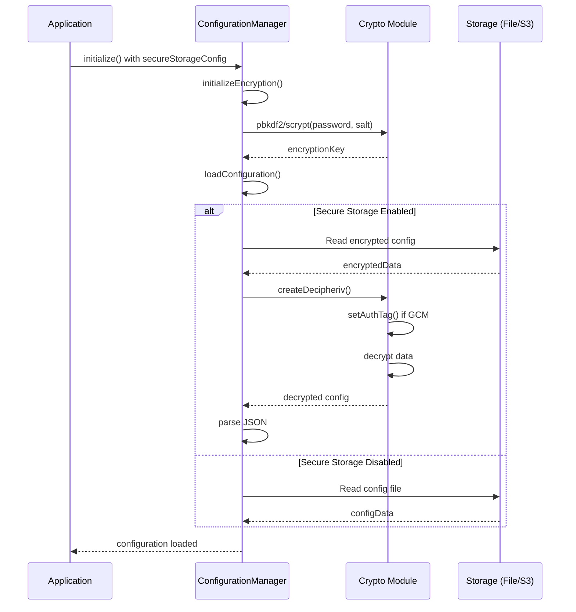
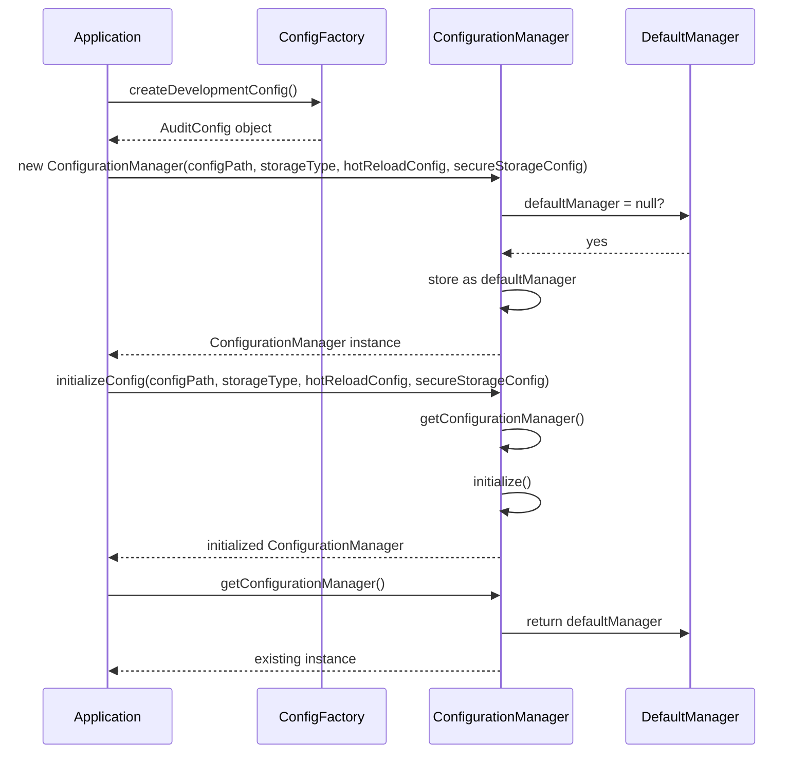
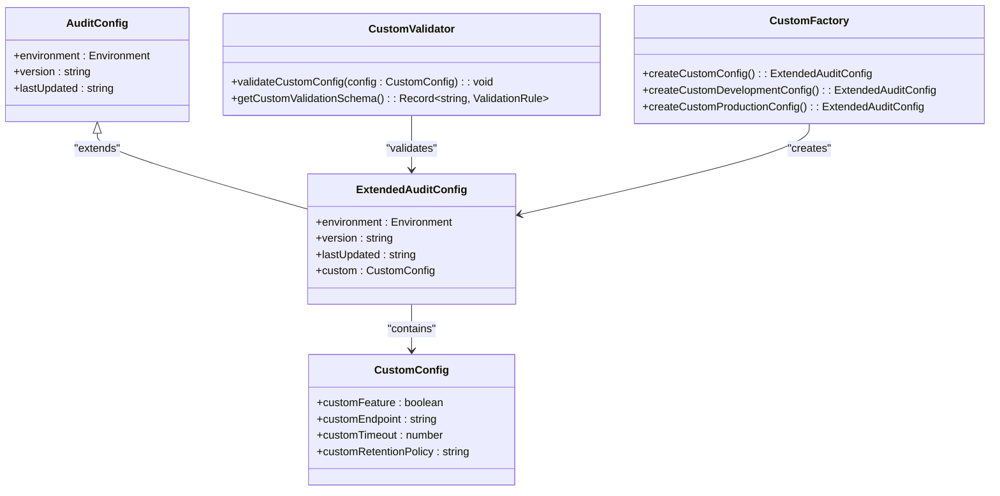

# Configuration Management

<cite>
**Referenced Files in This Document**   
- [manager.ts](file://packages/audit/src/config/manager.ts)
- [types.ts](file://packages/audit/src/config/types.ts)
- [validator.ts](file://packages/audit/src/config/validator.ts)
- [factory.ts](file://packages/audit/src/config/factory.ts)
- [api-reference.md](file://apps/docs/src/content/docs/audit/api-reference.md)
</cite>

## Table of Contents
1. [Introduction](#introduction)
2. [Configuration Manager Design](#configuration-manager-design)
3. [Configuration Schema and Options](#configuration-schema-and-options)
4. [Hierarchical Configuration Loading](#hierarchical-configuration-loading)
5. [Environment-Specific Configuration](#environment-specific-configuration)
6. [Runtime Reconfiguration and Hot Reloading](#runtime-reconfiguration-and-hot-reloading)
7. [Configuration Validation](#configuration-validation)
8. [Secure Configuration Storage](#secure-configuration-storage)
9. [Integration with Subsystems](#integration-with-subsystems)
10. [Configuration Initialization Patterns](#configuration-initialization-patterns)
11. [Common Configuration Errors](#common-configuration-errors)
12. [Extending the Configuration Schema](#extending-the-configuration-schema)

## Introduction
The Configuration Management system provides a comprehensive solution for managing application settings across different environments. It supports hierarchical configuration loading, environment-specific overrides, runtime reconfiguration, and secure storage. The system is designed to handle complex configuration needs for audit logging, database connections, retention policies, compliance requirements, and integration endpoints. This document details the design and implementation of the Config Manager class, its integration with various subsystems, and best practices for configuration management.

## Configuration Manager Design

The ConfigurationManager class implements a robust configuration management system with support for hot-reloading, versioning, and secure storage. It extends EventEmitter to provide event-driven notifications for configuration changes and initialization events.

```mermaid
classDiagram
class ConfigurationManager {
-db : PostgresJsDatabase
-s3 : S3Client
-config : AuditConfig
-configPath : string
-storageType : StorageType
-hotReloadConfig : HotReloadConfig
-secureStorageConfig : SecureStorageConfig
-watcherActive : boolean
-encryptionKey : Buffer
-bucket : string
+initialize() : Promise~void~
+getConfig() : AuditConfig
+getEnvironment() : Environment
+isProduction() : boolean
+isDevelopment() : boolean
+isTest() : boolean
+getConfigValue~T~(path : string) : T
+updateConfig(path : string, newValue : any, changedBy : string, reason? : string) : Promise~void~
+getChangeHistory(limit? : number) : Promise~ConfigChangeEvent[]~
+getVersion() : string
+reloadConfiguration() : Promise~void~
+validateCurrentConfig() : Promise~void~
+toJSON() : string
+exportConfig(includeSensitive : boolean) : Partial~AuditConfig~
+shutdown() : Promise~void~
}
class ConfigurationManager "extends" EventEmitter
ConfigurationManager --> AuditConfig : "manages"
ConfigurationManager --> ConfigChangeEvent : "emits"
ConfigurationManager --> EventEmitter : "extends"
```

**Diagram sources**
- [manager.ts](file://packages/audit/src/config/manager.ts#L0-L874)

**Section sources**
- [manager.ts](file://packages/audit/src/config/manager.ts#L0-L874)

## Configuration Schema and Options

The configuration schema is defined through TypeScript interfaces that provide type safety and comprehensive documentation for all configuration options. The AuditConfig interface serves as the root configuration object, containing nested configurations for various subsystems.



**Diagram sources**
- [types.ts](file://packages/audit/src/config/types.ts#L0-L546)

**Section sources**
- [types.ts](file://packages/audit/src/config/types.ts#L0-L546)

## Hierarchical Configuration Loading

The configuration manager supports multiple storage types and hierarchical loading from different sources. It can load configuration from local files or S3 storage, with optional encryption for secure storage.



**Diagram sources**
- [manager.ts](file://packages/audit/src/config/manager.ts#L0-L874)

**Section sources**
- [manager.ts](file://packages/audit/src/config/manager.ts#L0-L874)

## Environment-Specific Configuration

The system provides factory functions for creating environment-specific configurations with appropriate defaults for development, staging, and production environments. These configurations inherit from a base configuration with environment-appropriate overrides.



**Diagram sources**
- [factory.ts](file://packages/audit/src/config/factory.ts#L0-L751)

**Section sources**
- [factory.ts](file://packages/audit/src/config/factory.ts#L0-L751)

## Runtime Reconfiguration and Hot Reloading

The configuration manager supports runtime reconfiguration through the updateConfig method, which validates changes before applying them and records all changes in the database for audit purposes. It also supports hot reloading of configuration files when enabled.



**Diagram sources**
- [manager.ts](file://packages/audit/src/config/manager.ts#L0-L874)

**Section sources**
- [manager.ts](file://packages/audit/src/config/manager.ts#L0-L874)

## Configuration Validation

The validation system ensures that all configuration values meet required constraints through a comprehensive schema with type checking, range validation, pattern matching, and custom validation functions. It also enforces cross-field constraints and environment-specific requirements.


**Diagram sources**
- [validator.ts](file://packages/audit/src/config/validator.ts#L0-L659)

**Section sources**
- [validator.ts](file://packages/audit/src/config/validator.ts#L0-L659)

## Secure Configuration Storage

The configuration manager supports secure storage of configuration files through encryption using AES-256-GCM or AES-256-CBC algorithms with PBKDF2 or scrypt key derivation. This ensures that sensitive configuration data is protected at rest.



**Diagram sources**
- [manager.ts](file://packages/audit/src/config/manager.ts#L0-L874)

**Section sources**
- [manager.ts](file://packages/audit/src/config/manager.ts#L0-L874)

## Integration with Subsystems

The configuration system integrates with various subsystems including archival, monitoring, and GDPR compliance. It provides configuration options that directly affect the behavior of these subsystems and enables runtime reconfiguration of their settings.

```mermaid
graph TD
ConfigurationManager --> Archival
ConfigurationManager --> Monitoring
ConfigurationManager --> GDPRCompliance
ConfigurationManager --> Database
ConfigurationManager --> Redis
ConfigurationManager --> Security
subgraph Archival
A1[Archive Configuration]
A2[Compression Settings]
A3[Batch Size]
A4[Integrity Verification]
end
subgraph Monitoring
M1[Metrics Collection]
M2[Alert Thresholds]
M3[Health Checks]
M4[Performance Monitoring]
end
subgraph GDPRCompliance
G1[Data Retention]
G2[Pseudonymization]
G3[Reporting Schedule]
G4[Legal Basis]
end
ConfigurationManager --> A1
ConfigurationManager --> M1
ConfigurationManager --> G1
ConfigurationManager --> Database
ConfigurationManager --> Redis
ConfigurationManager --> Security
```



**Diagram sources**
- [types.ts](file://packages/audit/src/config/types.ts#L0-L546)
- [manager.ts](file://packages/audit/src/config/manager.ts#L0-L874)

**Section sources**
- [types.ts](file://packages/audit/src/config/types.ts#L0-L546)
- [manager.ts](file://packages/audit/src/config/manager.ts#L0-L874)

## Configuration Initialization Patterns

The system provides multiple patterns for configuration initialization, including factory functions for environment-specific defaults and utility functions for creating and retrieving configuration manager instances.



**Diagram sources**
- [factory.ts](file://packages/audit/src/config/factory.ts#L0-L751)
- [manager.ts](file://packages/audit/src/config/manager.ts#L0-L874)

**Section sources**
- [factory.ts](file://packages/audit/src/config/factory.ts#L0-L751)
- [manager.ts](file://packages/audit/src/config/manager.ts#L0-L874)

## Common Configuration Errors

The validation system identifies and reports common configuration errors, including invalid types, out-of-range values, missing required fields, and environment-specific violations. These errors are aggregated and reported with detailed messages.


**Diagram sources**
- [validator.ts](file://packages/audit/src/config/validator.ts#L0-L659)

**Section sources**
- [validator.ts](file://packages/audit/src/config/validator.ts#L0-L659)

## Extending the Configuration Schema

The configuration schema can be extended for custom deployments by adding new configuration sections or modifying existing ones. The system's modular design allows for easy extension while maintaining type safety and validation.



**Diagram sources**
- [types.ts](file://packages/audit/src/config/types.ts#L0-L546)
- [validator.ts](file://packages/audit/src/config/validator.ts#L0-L659)
- [factory.ts](file://packages/audit/src/config/factory.ts#L0-L751)

**Section sources**
- [types.ts](file://packages/audit/src/config/types.ts#L0-L546)
- [validator.ts](file://packages/audit/src/config/validator.ts#L0-L659)
- [factory.ts](file://packages/audit/src/config/factory.ts#L0-L751)