# Configuration Management

<cite>
**Referenced Files in This Document**   
- [manager.ts](file://packages\audit\src\config\manager.ts) - *Updated in recent commit with KMS encryption support and structured logging*
- [types.ts](file://packages\audit\src\config\types.ts) - *Updated in recent commit with KMS configuration options and logging enhancements*
- [validator.ts](file://packages\audit\src\config\validator.ts) - *Updated in recent commit*
- [factory.ts](file://packages\audit\src\config\factory.ts) - *Updated with structured logging defaults*
- [api-reference.md](file://apps\docs\src\content\docs\audit\api-reference.md)
- [gdpr-compliance.ts](file://packages\audit\src\gdpr\gdpr-compliance.ts) - *Added GDPR pseudonymization features*
- [gdpr-utils.ts](file://packages\audit\src\gdpr\gdpr-utils.ts) - *Added GDPR utility functions*
- [audit-client/src/infrastructure/plugins/utils.ts](file://packages\audit-client\src\infrastructure\plugins\utils.ts) - *Added plugin architecture*
- [infisical-kms/src/client.ts](file://packages\infisical-kms\src\client.ts) - *Added in recent commit for KMS integration*
- [infisical-kms/src/types.ts](file://packages\infisical-kms\src\types.ts) - *Added in recent commit for KMS configuration*
- [logging.ts](file://packages\logs\src\logging.ts) - *Introduced StructuredLogger and LoggerFactory*
- [index.ts](file://apps\worker\src\index.ts) - *Updated to use ConfigurationManager and DatabasePresetHandler*
- [database-preset-handler.ts](file://packages\audit\src\preset\database-preset-handler.ts) - *Added in recent commit for database preset handling*
- [preset-types.ts](file://packages\audit\src\preset\preset-types.ts) - *Added in recent commit for preset type definitions*
- [audit-preset.ts](file://packages\audit\src\preset\audit-preset.ts) - *Added in recent commit for audit preset interface*
</cite>

## Update Summary
**Changes Made**   
- Added new section on Preset Configuration System to document the DatabasePresetHandler and its integration with the configuration system
- Updated Configuration Initialization Patterns to include usage of createDatabasePresetHandler factory function
- Updated Integration with Subsystems to include preset system integration
- Added references to new preset-related files in relevant sections
- Maintained all existing documentation while enhancing content related to preset configuration

## Table of Contents
1. [Introduction](#introduction)
2. [Configuration Manager Design](#configuration-manager-design)
3. [Configuration Schema and Options](#configuration-schema-and-options)
4. [Hierarchical Configuration Loading](#hierarchical-configuration-loading)
5. [Environment-Specific Configuration](#environment-specific-configuration)
6. [Runtime Reconfiguration and Hot Reloading](#runtime-reconfiguration-and-hot-reloading)
7. [Configuration Validation](#configuration-validation)
8. [Secure Configuration Storage](#secure-configuration-storage)
9. [Integration with Subsystems](#integration-with-subsystems)
10. [Configuration Initialization Patterns](#configuration-initialization-patterns)
11. [Common Configuration Errors](#common-configuration-errors)
12. [Extending the Configuration Schema](#extending-the-configuration-schema)
13. [Plugin Architecture](#plugin-architecture)
14. [GDPR Pseudonymization Configuration](#gdpr-pseudonymization-configuration)
15. [KMS Encryption Integration](#kms-encryption-integration)
16. [Structured Logging Configuration](#structured-logging-configuration)
17. [Preset Configuration System](#preset-configuration-system)

## Introduction
The Configuration Management system provides a comprehensive solution for managing application settings across different environments. It supports hierarchical configuration loading, environment-specific overrides, runtime reconfiguration, and secure storage. The system is designed to handle complex configuration needs for audit logging, database connections, retention policies, compliance requirements, and integration endpoints. This document details the design and implementation of the Config Manager class, its integration with various subsystems, and best practices for configuration management.

## Configuration Manager Design

The ConfigurationManager class implements a robust configuration management system with support for hot-reloading, versioning, and secure storage. It extends EventEmitter to provide event-driven notifications for configuration changes and initialization events.

```mermaid
classDiagram
class ConfigurationManager {
-db : PostgresJsDatabase
-s3 : S3Client
-config : AuditConfig
-configPath : string
-storageType : StorageType
-hotReloadConfig : HotReloadConfig
-secureStorageConfig : SecureStorageConfig
-watcherActive : boolean
-encryptionKey : Buffer
-bucket : string
+initialize() : Promise~void~
+getConfig() : AuditConfig
+getEnvironment() : Environment
+isProduction() : boolean
+isDevelopment() : boolean
+isTest() : boolean
+getConfigValue~T~(path : string) : T
+updateConfig(path : string, newValue : any, changedBy : string, reason? : string) : Promise~void~
+getChangeHistory(limit? : number) : Promise~ConfigChangeEvent[]~
+getVersion() : string
+reloadConfiguration() : Promise~void~
+validateCurrentConfig() : Promise~void~
+toJSON() : string
+exportConfig(includeSensitive : boolean) : Partial~AuditConfig~
+shutdown() : Promise~void~
}
class ConfigurationManager "extends" EventEmitter
ConfigurationManager --> AuditConfig : "manages"
ConfigurationManager --> ConfigChangeEvent : "emits"
ConfigurationManager --> EventEmitter : "extends"
```

**Section sources**
- [manager.ts](file://packages\audit\src\config\manager.ts#L0-L874)

## Configuration Schema and Options

The configuration schema is defined through TypeScript interfaces that provide type safety and comprehensive documentation for all configuration options. The AuditConfig interface serves as the root configuration object, containing nested configurations for various subsystems.

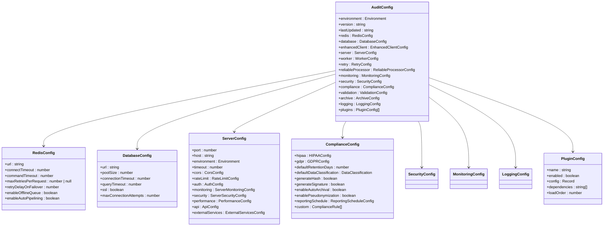

**Section sources**
- [types.ts](file://packages\audit\src\config\types.ts#L0-L712)

## Hierarchical Configuration Loading

The configuration manager supports multiple storage types and hierarchical loading from different sources. It can load configuration from local files or S3 storage, with optional encryption for secure storage.

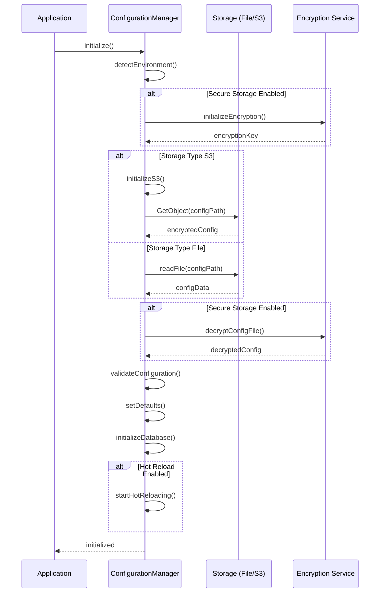

**Section sources**
- [manager.ts](file://packages\audit\src\config\manager.ts#L0-L874)

## Environment-Specific Configuration

The system provides factory functions for creating environment-specific configurations with appropriate defaults for development, staging, and production environments. These configurations inherit from a base configuration with environment-appropriate overrides.

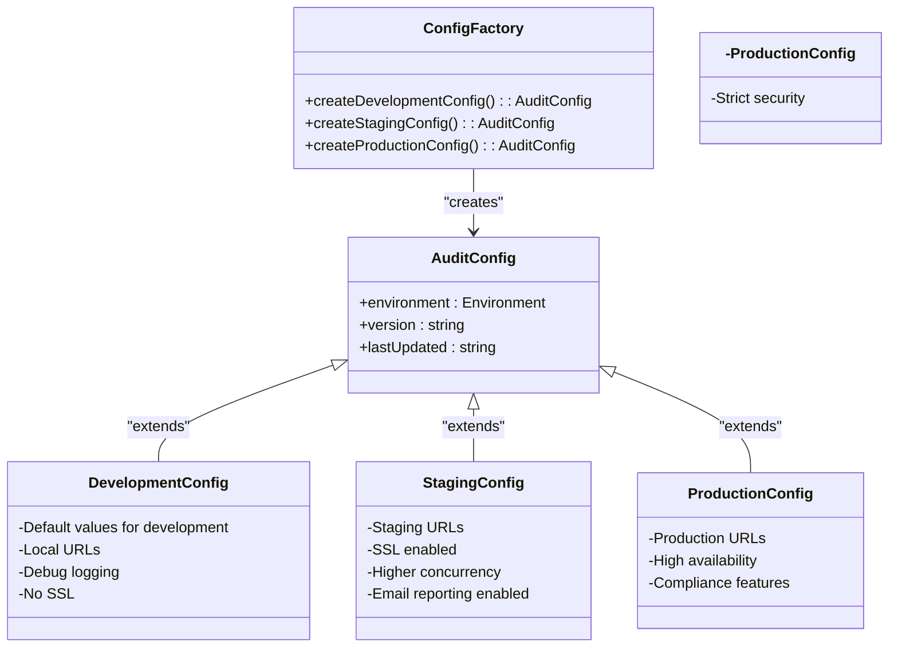

**Section sources**
- [factory.ts](file://packages\audit\src\config\factory.ts#L0-L751)

## Runtime Reconfiguration and Hot Reloading

The configuration manager supports runtime reconfiguration through the updateConfig method, which validates changes before applying them and records all changes in the database for audit purposes. It also supports hot reloading of configuration files when enabled.

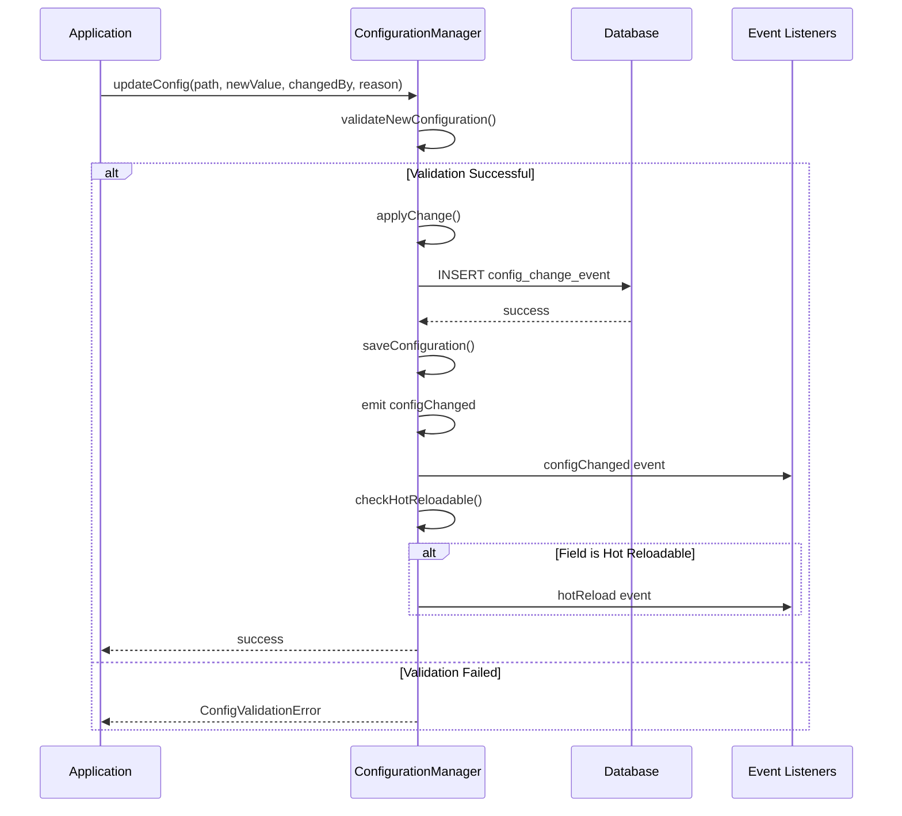

**Section sources**
- [manager.ts](file://packages\audit\src\config\manager.ts#L0-L874)

## Configuration Validation

The validation system ensures that all configuration values meet required constraints through a comprehensive schema with type checking, range validation, pattern matching, and custom validation functions. It also enforces cross-field constraints and environment-specific requirements.

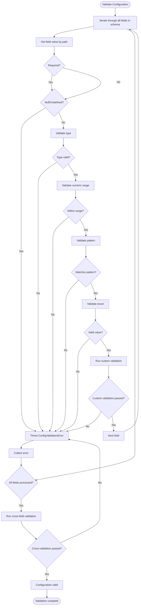

**Section sources**
- [validator.ts](file://packages\audit\src\config\validator.ts#L0-L659)

## Secure Configuration Storage

The configuration manager supports secure storage of configuration files through encryption using AES-256-GCM or AES-256-CBC algorithms with PBKDF2 or scrypt key derivation. This ensures that sensitive configuration data is protected at rest.

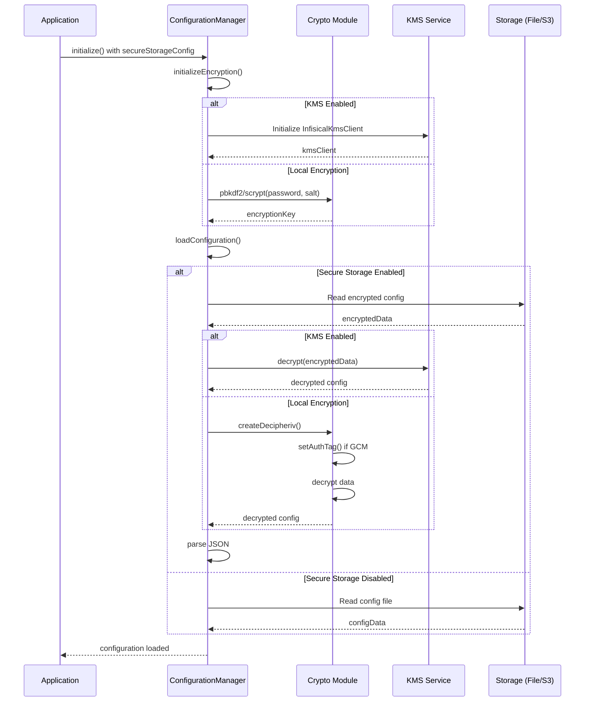

**Section sources**
- [manager.ts](file://packages\audit\src\config\manager.ts#L0-L874)
- [types.ts](file://packages\audit\src\config\types.ts#L0-L712)

## Integration with Subsystems

The configuration system integrates with various subsystems including archival, monitoring, and GDPR compliance. It provides configuration options that directly affect the behavior of these subsystems and enables runtime reconfiguration of their settings.

```mermaid
graph TD
ConfigurationManager --> Archival
ConfigurationManager --> Monitoring
ConfigurationManager --> GDPRCompliance
ConfigurationManager --> Database
ConfigurationManager --> Redis
ConfigurationManager --> Security
ConfigurationManager --> PluginSystem
ConfigurationManager --> PresetSystem
subgraph Archival
A1[Archive Configuration]
A2[Compression Settings]
A3[Batch Size]
A4[Integrity Verification]
end
subgraph Monitoring
M1[Metrics Collection]
M2[Alert Thresholds]
M3[Health Checks]
M4[Performance Monitoring]
end
subgraph GDPRCompliance
G1[Data Retention]
G2[Pseudonymization]
G3[Reporting Schedule]
G4[Legal Basis]
end
subgraph PluginSystem
P1[Plugin Registration]
P2[Dependency Management]
P3[Lifecycle Hooks]
P4[Configuration Validation]
end
subgraph PresetSystem
PR1[Preset Configuration]
PR2[Organization Presets]
PR3[Default Presets]
PR4[Priority Merging]
end
ConfigurationManager --> A1
ConfigurationManager --> M1
ConfigurationManager --> G1
ConfigurationManager --> P1
ConfigurationManager --> PR1
ConfigurationManager --> Database
ConfigurationManager --> Redis
ConfigurationManager --> Security
```

**Section sources**
- [types.ts](file://packages\audit\src\config\types.ts#L0-L712)
- [manager.ts](file://packages\audit\src\config\manager.ts#L0-L874)
- [gdpr-compliance.ts](file://packages\audit\src\gdpr\gdpr-compliance.ts#L0-L600)

## Configuration Initialization Patterns

The system provides multiple patterns for configuration initialization, including factory functions for environment-specific defaults and utility functions for creating and retrieving configuration manager instances.

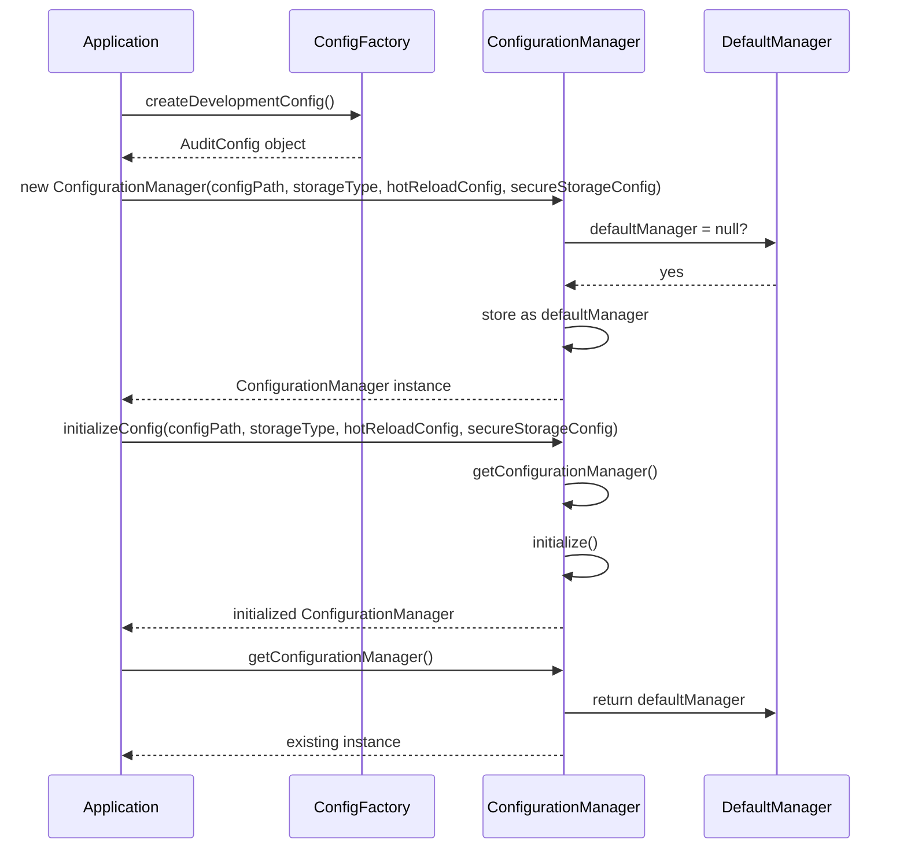

**Section sources**
- [factory.ts](file://packages\audit\src\config\factory.ts#L0-L751)
- [manager.ts](file://packages\audit\src\config\manager.ts#L0-L874)

## Common Configuration Errors

The validation system identifies and reports common configuration errors, including invalid types, out-of-range values, missing required fields, and environment-specific violations. These errors are aggregated and reported with detailed messages.

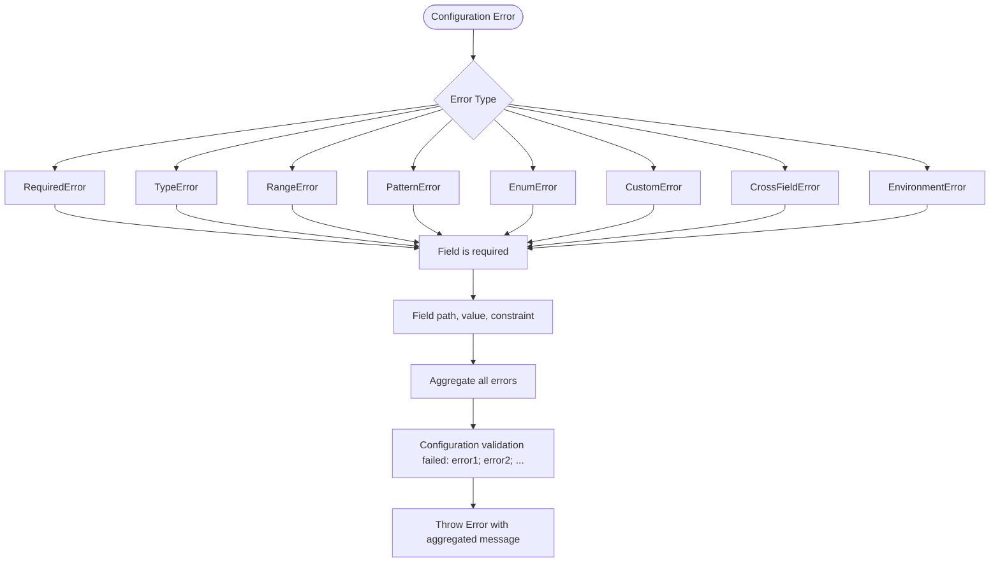

**Section sources**
- [validator.ts](file://packages\audit\src\config\validator.ts#L0-L659)

## Extending the Configuration Schema

The configuration schema can be extended for custom deployments by adding new configuration sections or modifying existing ones. The system's modular design allows for easy extension while maintaining type safety and validation.

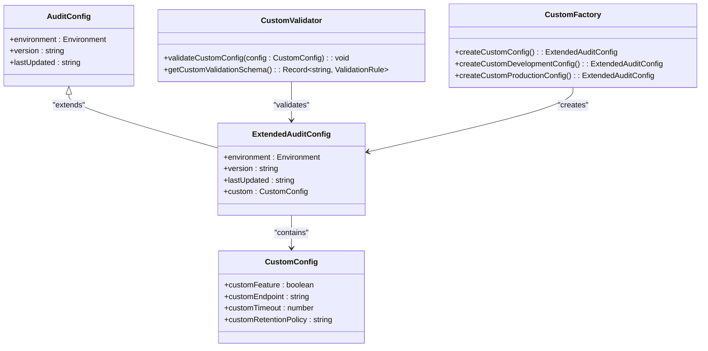

**Section sources**
- [types.ts](file://packages\audit\src\config\types.ts#L0-L712)
- [validator.ts](file://packages\audit\src\config\validator.ts#L0-L659)
- [factory.ts](file://packages\audit\src\config\factory.ts#L0-L751)

## Plugin Architecture

The configuration system now supports a comprehensive plugin architecture that allows for extensibility and customization. Plugins can be registered, configured, and managed through the configuration system, with support for dependency resolution and lifecycle management.

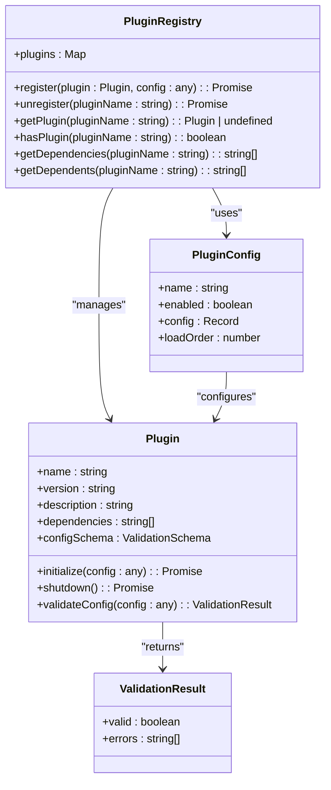

**Section sources**
- [audit-client/src/infrastructure/plugins/utils.ts](file://packages\audit-client\src\infrastructure\plugins\utils.ts#L0-L500)
- [audit-client/src/infrastructure/plugins/index.ts](file://packages\audit-client\src\infrastructure\plugins\index.ts#L0-L11)

## GDPR Pseudonymization Configuration

The GDPR compliance system provides robust pseudonymization capabilities to support data protection requirements. The configuration enables different pseudonymization strategies and ensures referential integrity is maintained.

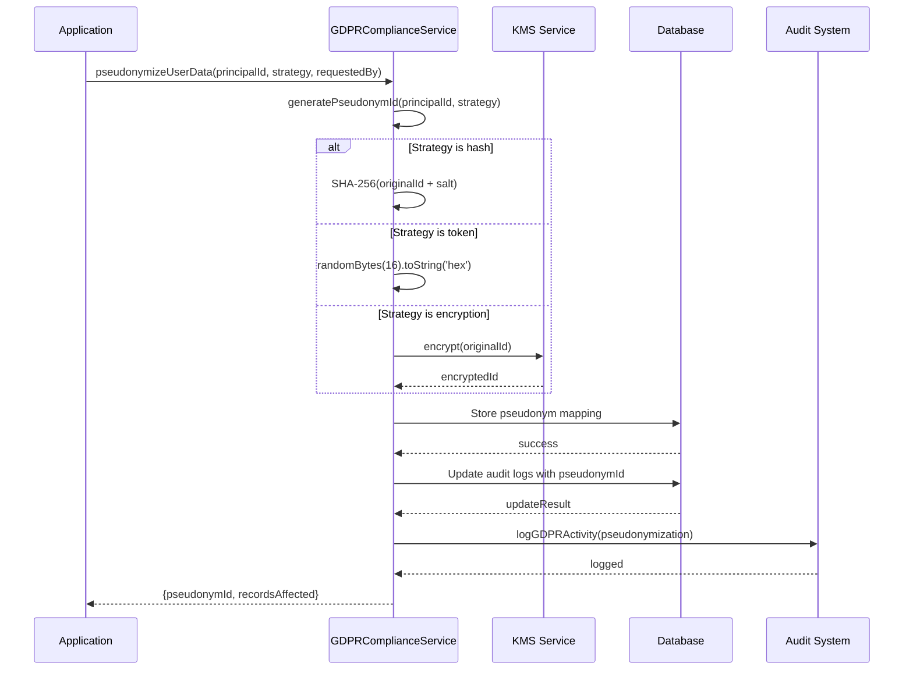

**Section sources**
- [gdpr-compliance.ts](file://packages\audit\src\gdpr\gdpr-compliance.ts#L192-L275)
- [gdpr-utils.ts](file://packages\audit\src\gdpr\gdpr-utils.ts#L0-L45)
- [types.ts](file://packages\audit\src\config\types.ts#L500-L550)

## KMS Encryption Integration

The configuration manager now supports integration with external Key Management Systems (KMS) through the Infisical KMS client. This allows for centralized key management and enhanced security for configuration encryption.

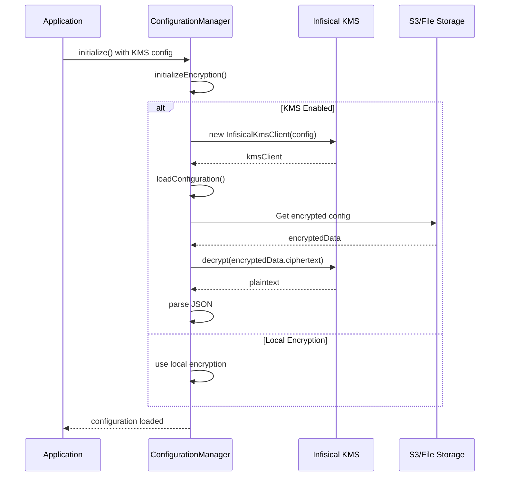

The KMS integration is configured through the `secureStorageConfig.kms` object in the configuration, which includes the following properties:

- **enabled**: Boolean flag to enable KMS encryption
- **encryptionKey**: KMS encryption key ID  
- **signingKey**: KMS signing key ID  
- **accessToken**: KMS access token for authentication
- **baseUrl**: Base URL for the KMS service
- **algorithm**: Encryption algorithm to use (optional, defaults to AES-256-GCM)
- **kdf**: Key derivation function (optional)
- **salt**: Salt for key derivation (optional)
- **iterations**: Number of iterations for key derivation (optional)

When KMS is enabled, the configuration manager uses the InfisicalKmsClient to encrypt and decrypt configuration files, eliminating the need to manage encryption keys locally. This provides enhanced security through centralized key management and key rotation capabilities.

The KMS client handles encryption and decryption operations asynchronously and includes built-in retry logic with exponential backoff for resilience against network issues. Error handling is comprehensive, with specific error types for KMS API errors and general KMS errors.

**Section sources**
- [manager.ts](file://packages\audit\src\config\manager.ts#L38-L83)
- [types.ts](file://packages\audit\src\config\types.ts#L0-L712)
- [infisical-kms/src/client.ts](file://packages\infisical-kms\src\client.ts#L0-L146)
- [infisical-kms/src/types.ts](file://packages\infisical-kms\src\types.ts#L0-L56)

## Structured Logging Configuration

The logging system has been upgraded from ConsoleLogger to StructuredLogger with LoggerFactory for enhanced logging capabilities. The new system provides structured JSON logging, OTLP export support, and configurable log levels with correlation IDs.

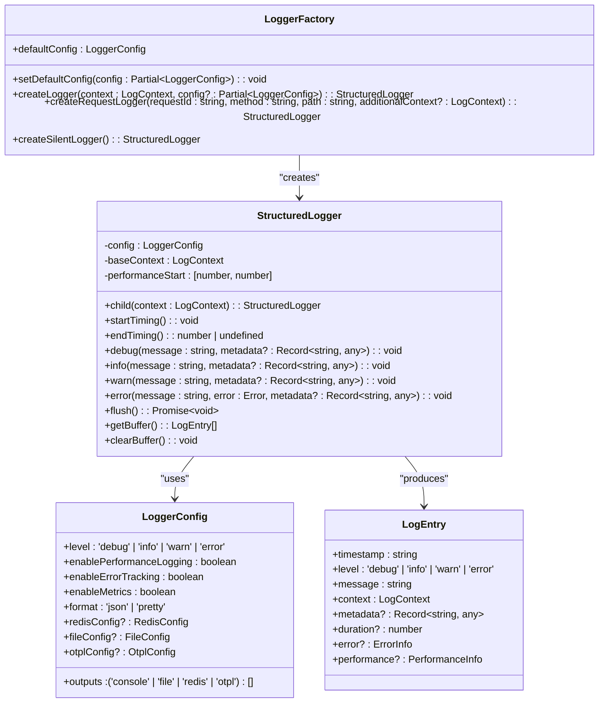

The logging configuration is defined in the `logging` section of the AuditConfig interface with the following properties:

- **level**: Log level threshold (debug, info, warn, error)
- **structured**: Boolean flag to enable structured logging
- **format**: Output format (json or text)
- **enableCorrelationIds**: Enable correlation and trace IDs in logs
- **retentionDays**: Number of days to retain logs
- **exporterType**: Log export destination (console, jaeger, zipkin, otlp)
- **exporterEndpoint**: OTLP endpoint URL for distributed tracing
- **exporterHeaders**: Headers for OTLP exporter authentication

The LoggerFactory provides a consistent way to create loggers with default configuration. It supports creating specialized loggers for requests with automatic correlation IDs and silent loggers for testing environments.

**Section sources**
- [types.ts](file://packages\audit\src\config\types.ts#L0-L712)
- [factory.ts](file://packages\audit\src\config\factory.ts#L0-L751)
- [logging.ts](file://packages\logs\src\logging.ts#L0-L585)
- [manager.ts](file://packages\audit\src\config\manager.ts#L0-L874)

## Preset Configuration System

The configuration system now includes a comprehensive preset management system that allows for organization-specific configurations with default fallbacks. The DatabasePresetHandler provides a factory-based approach to managing audit presets stored in the database.

```mermaid
classDiagram
class PresetHandler {
+getPresets(organizationId? : string) : Promise~(AuditPreset & { id? : string })[]~
+getPreset(name : string, organizationId? : string) : Promise~(AuditPreset & { id? : string }) | null~
+createPreset(preset : AuditPreset & { createdBy : string }) : Promise~AuditPreset & { id? : string }~
+updatePreset(preset : AuditPreset & { id : string; updatedBy : string }) : Promise~AuditPreset & { id? : string }~
+deletePreset(name : string, organizationId : string) : Promise~{ success : true }~
}
class DatabasePresetHandler {
-client : EnhancedAuditDatabaseClient
+constructor(auditDbInstance : EnhancedAuditDb)
+getPresets(organizationId? : string) : Promise~(AuditPreset & { id? : string })[]~
+getPreset(name : string, organizationId? : string) : Promise~(AuditPreset & { id? : string }) | null~
+createPreset(preset : AuditPreset & { createdBy : string }) : Promise~AuditPreset & { id? : string }~
+updatePreset(preset : AuditPreset & { id : string; updatedBy : string }) : Promise~AuditPreset & { id? : string }~
+deletePreset(name : string, organizationId : string) : Promise~{ success : true }~
+mapDatabasePresetToPreset(dbPreset : any) : AuditPreset & { id? : string }
}
class AuditPreset {
+name : string
+description? : string
+organizationId : string
+action : string
+dataClassification : DataClassification
+requiredFields : string[]
+defaultValues? : Record~string, any~
+validation? : Partial~ValidationConfig~
}
class createDatabasePresetHandler {
+createDatabasePresetHandler(auditDbInstance : EnhancedAuditDb) : DatabasePresetHandler
}
PresetHandler <|-- DatabasePresetHandler : "implements"
DatabasePresetHandler --> EnhancedAuditDb : "uses"
DatabasePresetHandler --> AuditPreset : "manages"
createDatabasePresetHandler --> DatabasePresetHandler : "creates"
```

The preset system is designed to handle organization-specific configurations with priority over default presets. When retrieving presets, organization-specific presets take precedence over default ones with the same name. The system uses a single optimized query to fetch both organization and default presets, then merges them with organization presets having priority.

The DatabasePresetHandler is initialized with an EnhancedAuditDb instance and provides methods for CRUD operations on presets. It uses the enhanced client's executeOptimizedQuery method with caching to improve performance. The handler supports creating, updating, and deleting presets, as well as retrieving them by name or organization.

The factory function `createDatabasePresetHandler` provides a clean way to instantiate the handler, promoting dependency injection and testability. This pattern is used in the worker initialization to create the preset handler and pass it to the Audit service.

**Section sources**
- [index.ts](file://apps\worker\src\index.ts#L40-L45)
- [database-preset-handler.ts](file://packages\audit\src\preset\database-preset-handler.ts#L0-L284)
- [preset-types.ts](file://packages\audit\src\preset\preset-types.ts#L0-L17)
- [audit-preset.ts](file://packages\audit\src\preset\audit-preset.ts#L0-L15)