# Configuration Schema and Types

<cite>
**Referenced Files in This Document**   
- [types.ts](file://packages\audit\src\config\types.ts) - *Updated in recent commit*
- [manager.ts](file://packages\audit\src\config\manager.ts) - *Modified in recent commit*
- [integration.ts](file://packages\audit\src\config\integration.ts) - *Modified in recent commit*
- [archival-service.ts](file://packages\audit\src\archival\archival-service.ts) - *Unchanged*
- [monitoring.ts](file://packages\audit\src\monitor\monitoring.ts) - *Unchanged*
- [gdpr-compliance.ts](file://packages\audit\src\gdpr\gdpr-compliance.ts) - *Updated in recent commit*
- [audit-preset.ts](file://packages\audit\src\preset\audit-preset.ts) - *Unchanged*
- [preset-types.ts](file://packages\audit\src\preset\preset-types.ts) - *Unchanged*
- [infisical-kms/README.md](file://packages\infisical-kms\README.md) - *KMS integration documentation*
- [infisical-kms/src/client.ts](file://packages\infisical-kms\src\client.ts) - *KMS client implementation*
- [infisical-kms/src/types.ts](file://packages\infisical-kms\src\types.ts) - *KMS type definitions*
- [tracer.ts](file://packages\audit\src\observability\tracer.ts) - *OTLP exporter implementation*
- [types.ts](file://packages\audit\src\observability\types.ts) - *Observability type definitions*
- [otpl.ts](file://packages\logs\src\otpl.ts) - *OTLP logging implementation*
</cite>

## Update Summary
**Changes Made**   
- Added comprehensive documentation for OTLP exporter configuration and implementation
- Updated Security Configuration section with detailed KMS properties and integration
- Enhanced Configuration Management section with KMS client initialization details
- Added new section for OTLP Exporter and observability integration
- Updated source tracking annotations to reflect recent changes and new dependencies
- Added documentation for secure configuration storage with KMS encryption
- Integrated observability configuration types into the core documentation

## Table of Contents
1. [Introduction](#introduction)
2. [Configuration Schema Overview](#configuration-schema-overview)
3. [Core Configuration Types](#core-configuration-types)
4. [Compliance Configuration](#compliance-configuration)
5. [Archival Configuration](#archival-configuration)
6. [Monitoring Configuration](#monitoring-configuration)
7. [Security and Validation](#security-and-validation)
8. [Configuration Management](#configuration-management)
9. [Integration and Extensibility](#integration-and-extensibility)
10. [Plugin Architecture](#plugin-architecture)
11. [Configuration Change Tracking](#configuration-change-tracking)
12. [KMS Integration](#kms-integration)
13. [OTLP Exporter](#otlp-exporter)

## Introduction
The Configuration Schema and Types system provides a comprehensive, type-safe framework for managing audit system configuration across environments. Built with TypeScript, the system enforces compile-time validation, supports IDE autocompletion, and enables runtime safety through comprehensive validation. The configuration schema is structured hierarchically, covering database connections, retention policies, compliance requirements (GDPR/HIPAA), integration endpoints, monitoring thresholds, and plugin extensions. This documentation details every configuration option, type hierarchy, and integration point, providing guidance for both standard and custom deployments.

## Configuration Schema Overview

The configuration system is centered around the `AuditConfig` interface, which serves as the root type for all configuration options. The schema is organized into logical modules, each with its own configuration interface that is composed into the main configuration object. This modular approach enables focused configuration management while maintaining a unified configuration structure.

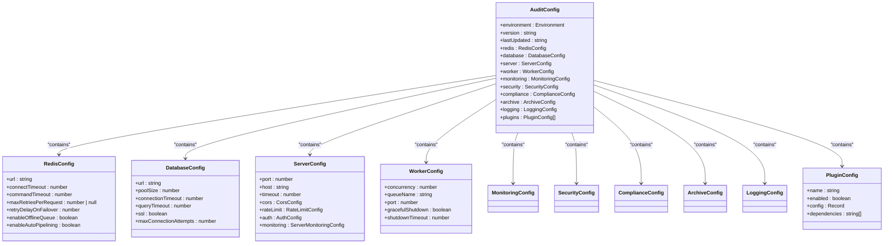

**Section sources**
- [types.ts](file://packages\audit\src\config\types.ts#L45-L110)

## Core Configuration Types

The configuration schema defines several core types that represent fundamental system components. These types include connection settings, server configurations, worker parameters, and plugin configurations that control the basic operation of the audit system.

### Database and Redis Configuration
The database and Redis configurations provide connection parameters for the primary data stores used by the audit system. These configurations include connection URLs, timeout settings, and pool management options.

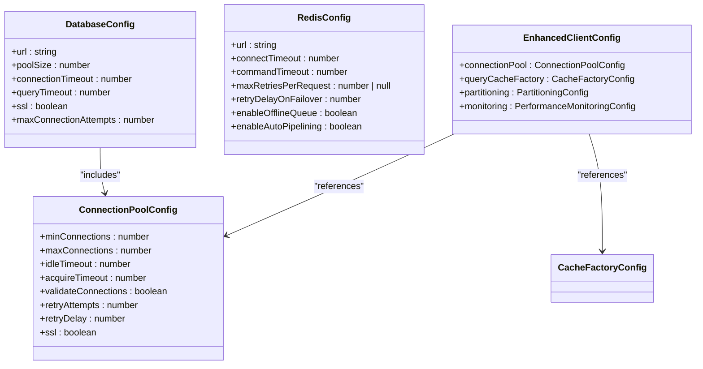

**Section sources**
- [types.ts](file://packages\audit\src\config\types.ts#L112-L188)

## Compliance Configuration

The compliance configuration module provides settings for regulatory requirements including GDPR and HIPAA. These configurations enable or disable compliance features, set retention policies, and define reporting schedules.

### GDPR and HIPAA Settings
The compliance configuration includes specific settings for GDPR and HIPAA regulations, allowing organizations to configure their audit system according to applicable legal requirements.

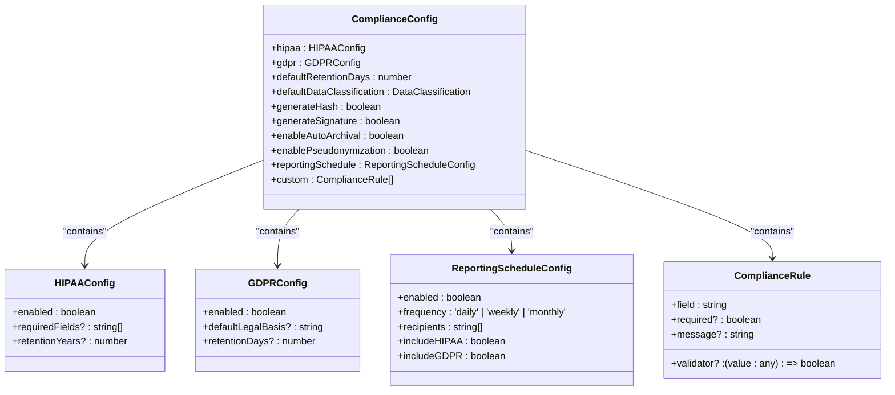

**Section sources**
- [types.ts](file://packages\audit\src\config\types.ts#L386-L428)

### GDPR Compliance Implementation
The GDPR compliance service implements data subject rights and privacy-by-design principles, enabling data export, pseudonymization, and retention policy enforcement.

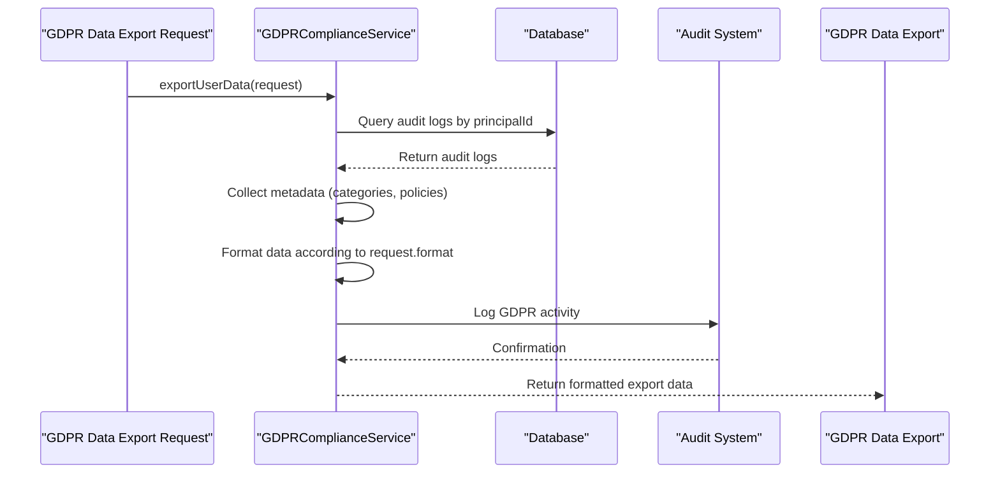

**Diagram sources**
- [gdpr-compliance.ts](file://packages\audit\src\gdpr\gdpr-compliance.ts#L100-L150)

## Archival Configuration

The archival configuration defines settings for data archiving, including compression algorithms, batch sizes, and integrity verification. This configuration controls how audit data is archived and stored for long-term retention.

### Archival Settings
The archival configuration includes options for compression, encryption, and format selection, allowing organizations to optimize storage and retrieval of archived data.

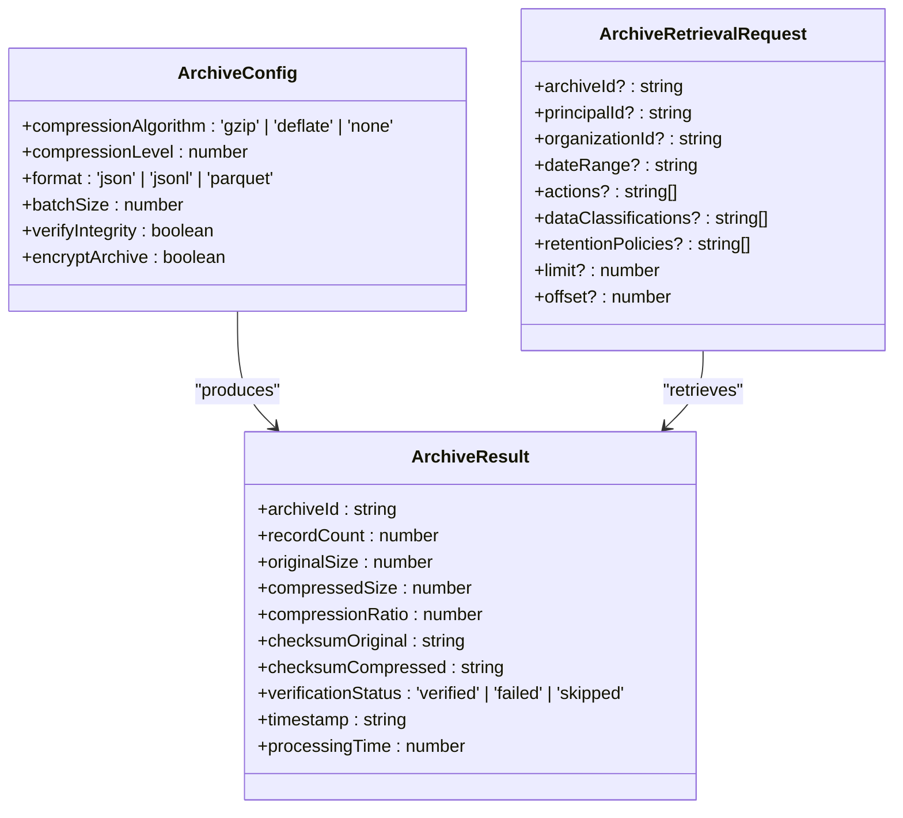

**Section sources**
- [archival-service.ts](file://packages\audit\src\archival\archival-service.ts#L15-L100)

## Monitoring Configuration

The monitoring configuration defines settings for real-time monitoring, alerting, and metrics collection. These settings control how the system detects suspicious patterns, generates alerts, and collects performance metrics.

### Monitoring and Alerting Settings
The monitoring configuration includes thresholds for error rates, processing latency, queue depth, and memory usage, enabling proactive system monitoring and alerting.

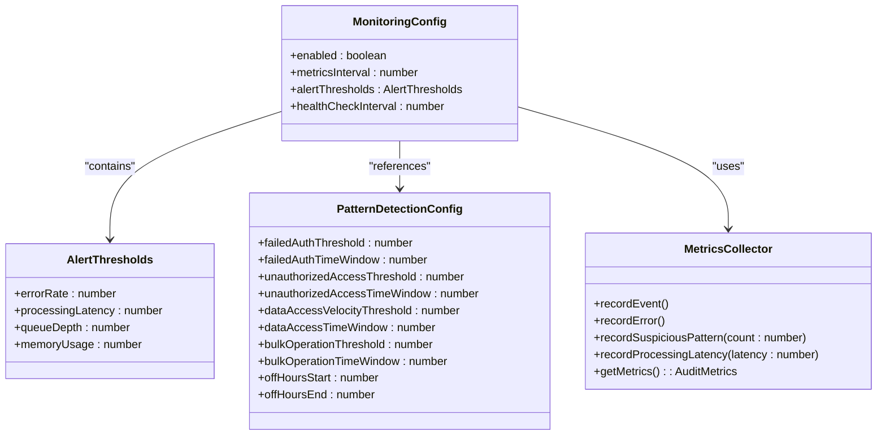

**Section sources**
- [monitoring.ts](file://packages\audit\src\monitor\monitoring.ts#L25-L75)

## Security and Validation

The security and validation configuration defines settings for data integrity, encryption, and input validation. These settings ensure that audit data remains secure and tamper-proof throughout its lifecycle.

### Security Configuration
The security configuration includes options for integrity verification, event signing, and log encryption, providing multiple layers of protection for audit data.

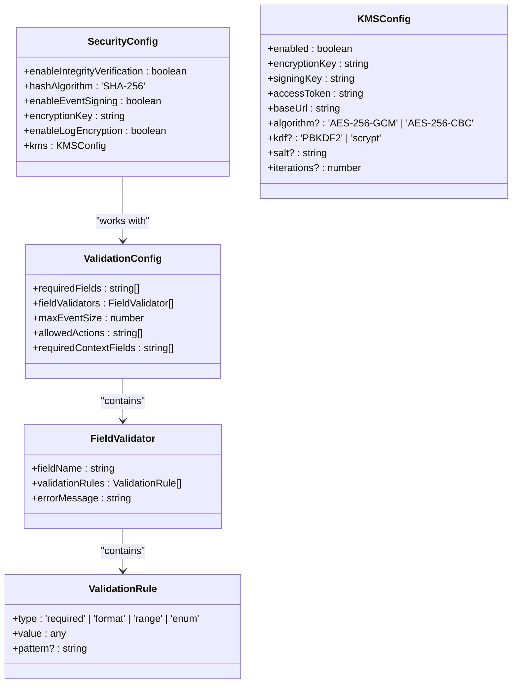

**Section sources**
- [types.ts](file://packages\audit\src\config\types.ts#L320-L360)
- [types.ts](file://packages\audit\src\config\types.ts#L291-L296)

## Configuration Management

The configuration management system provides a robust framework for loading, validating, updating, and persisting configuration. The system supports multiple storage types, hot reloading, and secure storage with encryption.

### Configuration Manager
The ConfigurationManager class serves as the central component for configuration management, handling initialization, validation, updates, and change tracking.

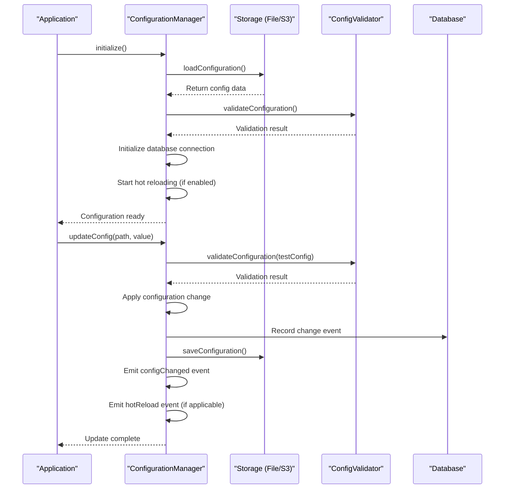

**Section sources**
- [manager.ts](file://packages\audit\src\config\manager.ts#L50-L150)

## Integration and Extensibility

The configuration system provides integration points for extending the base configuration and adapting it to specific deployment requirements. The integration module offers utilities for initializing configuration with environment-specific defaults and handling configuration changes.

### Configuration Integration
The configuration integration module provides functions for initializing audit configuration with environment-specific defaults and setting up event handlers for configuration changes.

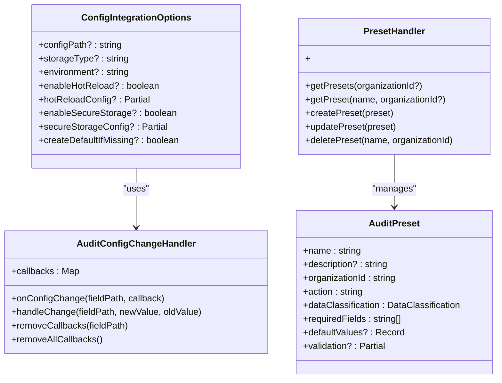

**Section sources**
- [integration.ts](file://packages\audit\src\config\integration.ts#L50-L100)
- [preset-types.ts](file://packages\audit\src\preset\preset-types.ts#L10-L25)

## Plugin Architecture

The plugin architecture provides a flexible system for extending the audit functionality through modular components. Plugins can be enabled or disabled through configuration and support dependency management.

### Plugin Configuration
Plugins are configured through the main configuration object and can be dynamically loaded at runtime. Each plugin has its own configuration schema and lifecycle hooks.

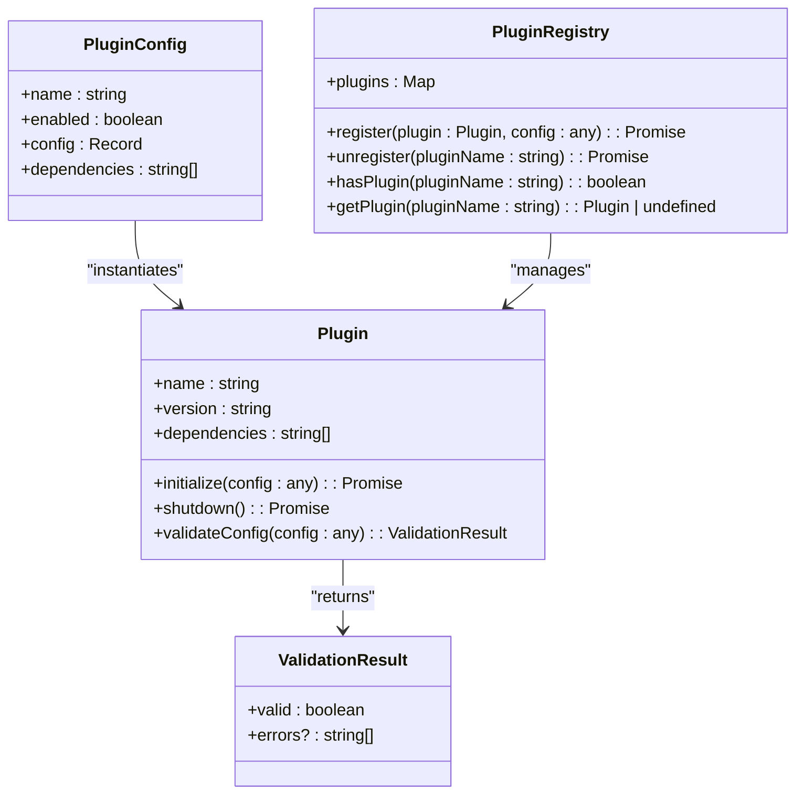

**Section sources**
- [types.ts](file://packages\audit\src\config\types.ts#L45-L110)
- [integration.ts](file://packages\audit\src\config\integration.ts#L200-L250)

## Configuration Change Tracking

The configuration system includes comprehensive change tracking that records all configuration modifications, providing an audit trail of configuration changes. Each change is stored with metadata including timestamps, previous and new values, and the user or system that made the change.

### Configuration Change Events
The system records configuration changes in a dedicated database table, capturing detailed information about each modification for audit and troubleshooting purposes.

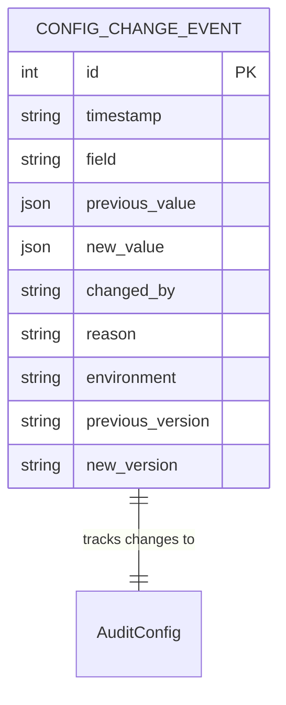

**Section sources**
- [manager.ts](file://packages\audit\src\config\manager.ts#L200-L240)
- [types.ts](file://packages\audit\src\config\types.ts#L377-L400)

## KMS Integration

The Key Management Service (KMS) integration provides enterprise-grade encryption for configuration storage and sensitive data protection. The system integrates with Infisical KMS to manage encryption keys, perform cryptographic operations, and ensure secure configuration storage.

### KMS Configuration
The KMS configuration enables secure storage of configuration files using external key management services. This feature is particularly important for production environments where configuration files may contain sensitive information.

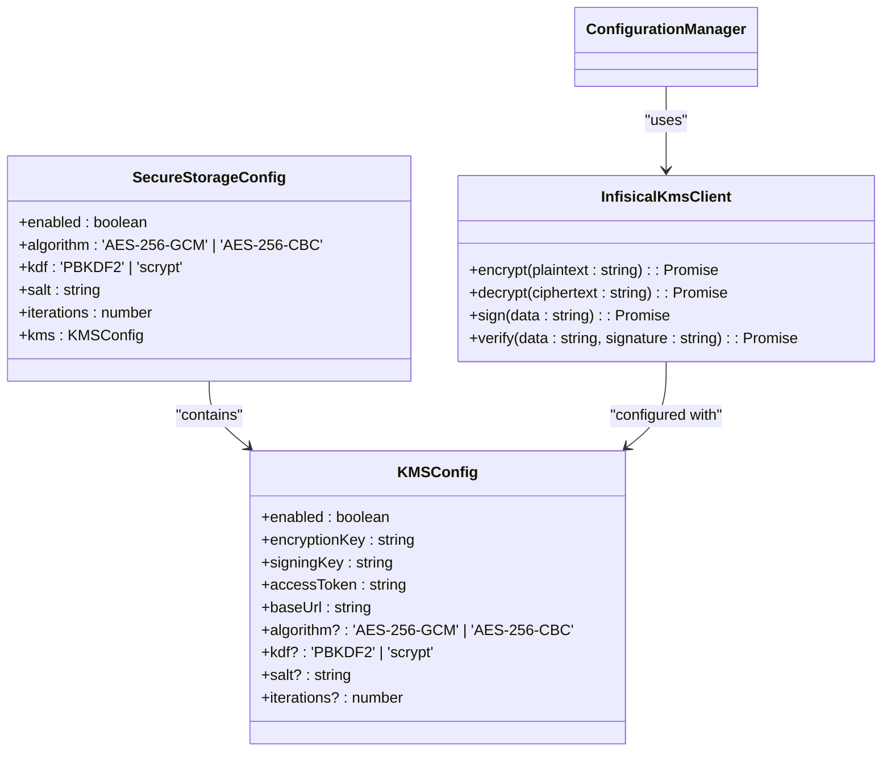

**Section sources**
- [types.ts](file://packages\audit\src\config\types.ts#L400-L450)
- [manager.ts](file://packages\audit\src\config\manager.ts#L150-L200)
- [integration.ts](file://packages\audit\src\config\integration.ts#L100-L150)

### KMS Integration Workflow
The KMS integration follows a secure workflow for encrypting and decrypting configuration files, ensuring that sensitive data is protected both at rest and in transit.

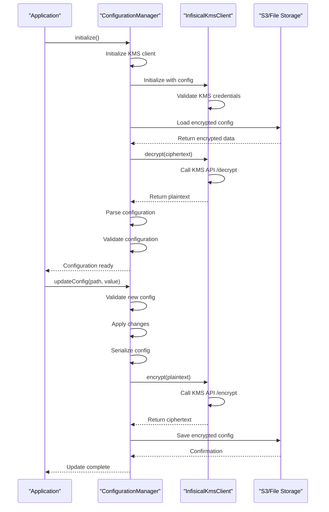

**Diagram sources**
- [manager.ts](file://packages\audit\src\config\manager.ts#L250-L300)
- [infisical-kms/src/client.ts](file://packages\infisical-kms\src\client.ts#L15-L145)
- [infisical-kms/src/types.ts](file://packages\infisical-kms\src\types.ts#L1-L56)

## OTLP Exporter

The OpenTelemetry Protocol (OTLP) exporter provides standardized observability data export for distributed tracing and metrics collection. This integration enables seamless connection with various observability platforms while maintaining data consistency and reliability.

### OTLP Configuration
The OTLP exporter is configured through the logging configuration interface, allowing flexible setup for different observability backends. The configuration supports multiple authentication methods and export formats.

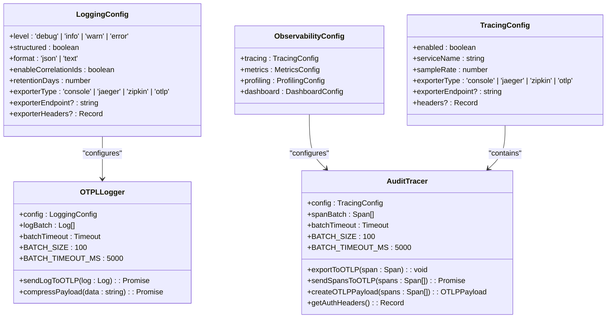

**Section sources**
- [types.ts](file://packages\audit\src\config\types.ts#L488-L555)
- [tracer.ts](file://packages\audit\src\observability\tracer.ts#L207-L676)
- [otpl.ts](file://packages\logs\src\otpl.ts#L0-L165)
- [types.ts](file://packages\audit\src\observability\types.ts#L254-L302)

### OTLP Export Workflow
The OTLP export workflow implements batch processing, error handling, and authentication to ensure reliable data transmission to observability platforms. The system automatically handles network issues and rate limiting.

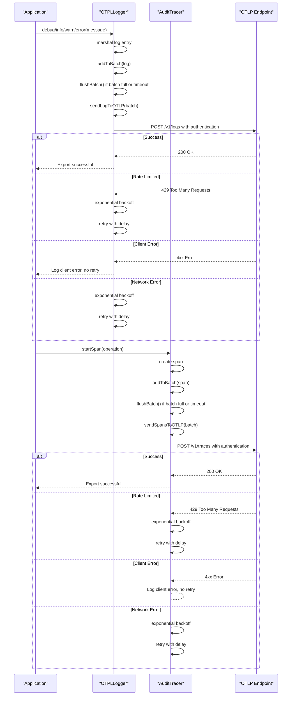

**Diagram sources**
- [tracer.ts](file://packages\audit\src\observability\tracer.ts#L304-L452)
- [otpl.ts](file://packages\logs\src\otpl.ts#L129-L165)
- [types.ts](file://packages\audit\src\config\types.ts#L488-L555)