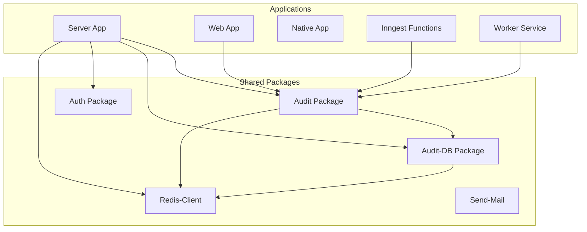
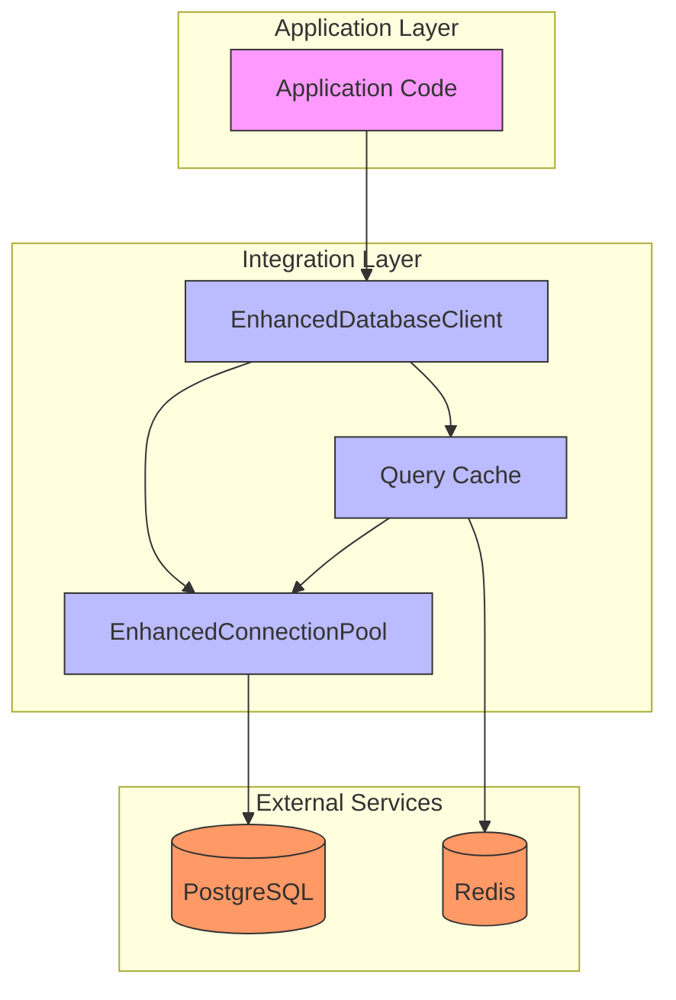
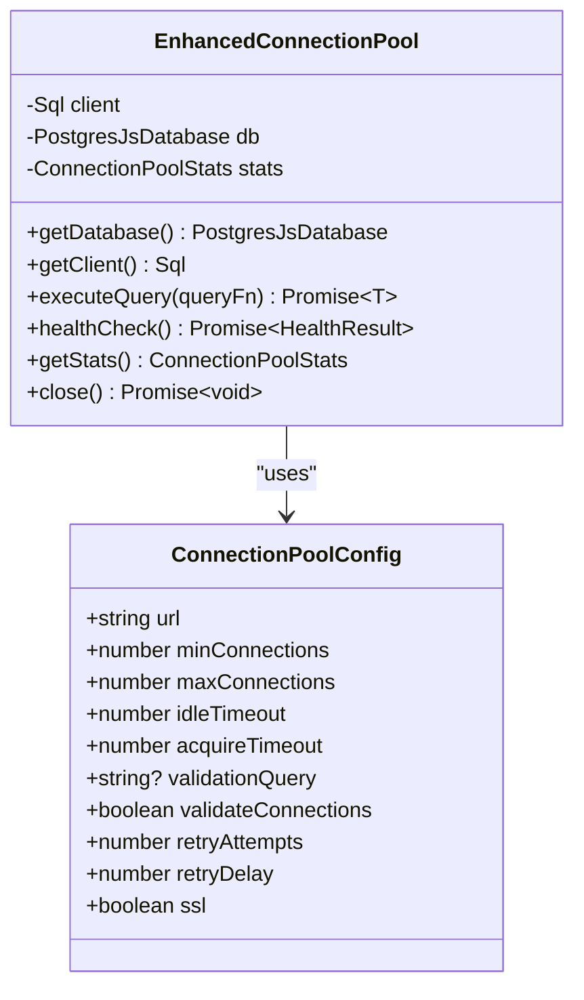
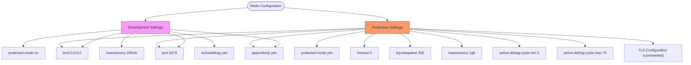
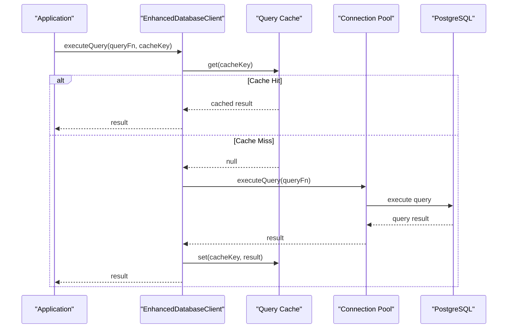
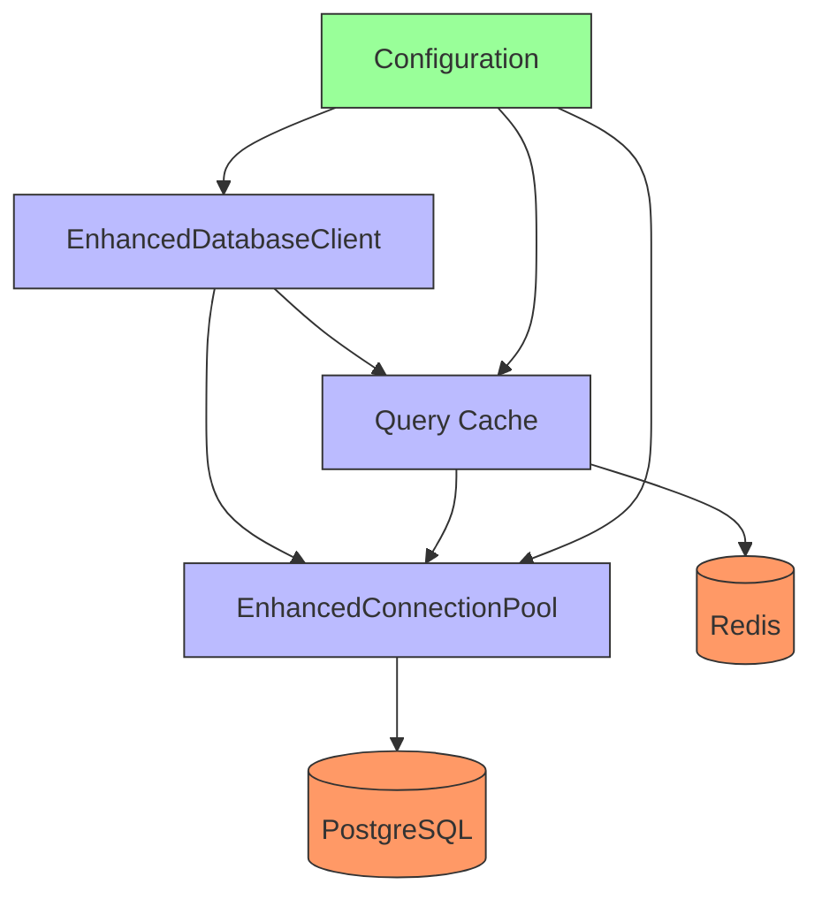

# Integration Configuration

<cite>
**Referenced Files in This Document**   
- [apps/server/docker-compose.yml](file://apps/server/docker-compose.yml)
- [apps/server/docker-compose.prod.yml](file://apps/server/docker-compose.prod.yml)
- [apps/server/docker/redis.conf](file://apps/server/docker/redis.conf)
- [apps/server/docker/redis.prod.conf](file://apps/server/docker/redis.prod.conf)
- [packages/audit/src/config/types.ts](file://packages/audit/src/config/types.ts)
- [packages/audit-db/src/db/connection-pool.ts](file://packages/audit-db/src/db/connection-pool.ts)
- [packages/audit-db/src/db/enhanced-client.ts](file://packages/audit-db/src/db/enhanced-client.ts)
- [apps/server/init-scripts/01-init-audit-db.sql](file://apps/server/init-scripts/01-init-audit-db.sql)
</cite>

## Table of Contents
1. [Introduction](#introduction)
2. [Project Structure](#project-structure)
3. [Core Components](#core-components)
4. [Architecture Overview](#architecture-overview)
5. [Detailed Component Analysis](#detailed-component-analysis)
6. [Dependency Analysis](#dependency-analysis)
7. [Performance Considerations](#performance-considerations)
8. [Troubleshooting Guide](#troubleshooting-guide)
9. [Conclusion](#conclusion)

## Introduction
This document provides a comprehensive overview of integration configuration management within the SMEDREC Audit Server system. It details how external system connections are configured and managed, including database endpoints, message queues, monitoring systems, and third-party services. The document covers connection pooling settings, retry policies, timeout configurations, and authentication methods for integrations. Special attention is given to PostgreSQL and Redis configurations, security considerations for credential storage, certificate management, and network configuration. The impact of integration settings on archival, monitoring, and compliance workflows is explained, along with best practices for production deployment and testing environments.

## Project Structure
The project follows a monorepo structure with multiple applications and shared packages. The integration configuration is primarily managed through Docker Compose files, environment variables, and configuration classes in the codebase. The main applications include server, web, native, inngest, and worker components, while shared packages provide reusable functionality for audit, authentication, database access, and other services.

**Diagram sources**
- [apps/server/docker-compose.yml](file://apps/server/docker-compose.yml)
- [packages/audit/src/config/types.ts](file://packages/audit/src/config/types.ts)

**Section sources**
- [apps/server/docker-compose.yml](file://apps/server/docker-compose.yml)
- [packages/audit/src/config/types.ts](file://packages/audit/src/config/types.ts)

## Core Components
The core components for integration configuration include the EnhancedConnectionPool class for database connections, the EnhancedDatabaseClient for query execution with caching, and the configuration interfaces that define the structure of integration settings. These components work together to provide a robust, performant, and secure integration layer between the application and external services.

**Section sources**
- [packages/audit-db/src/db/connection-pool.ts](file://packages/audit-db/src/db/connection-pool.ts)
- [packages/audit-db/src/db/enhanced-client.ts](file://packages/audit-db/src/db/enhanced-client.ts)
- [packages/audit/src/config/types.ts](file://packages/audit/src/config/types.ts)

## Architecture Overview
The integration architecture is designed to provide reliable, secure, and performant connections to external services. The system uses a layered approach with connection pooling, query caching, and health monitoring to ensure optimal performance and resilience. Configuration is managed through environment variables and configuration files, with different settings for development and production environments.

**Diagram sources**
- [packages/audit-db/src/db/enhanced-client.ts](file://packages/audit-db/src/db/enhanced-client.ts)
- [packages/audit-db/src/db/connection-pool.ts](file://packages/audit-db/src/db/connection-pool.ts)

## Detailed Component Analysis

### Database Connection Configuration
The database connection configuration is defined through the ConnectionPoolConfig interface, which specifies parameters for connection pooling, timeouts, and retry policies. This configuration is used by the EnhancedConnectionPool class to manage connections to the PostgreSQL database.

#### Connection Pool Configuration

**Diagram sources**
- [packages/audit/src/config/types.ts](file://packages/audit/src/config/types.ts#L103-L152)
- [packages/audit-db/src/db/connection-pool.ts](file://packages/audit-db/src/db/connection-pool.ts#L40-L84)

**Section sources**
- [packages/audit/src/config/types.ts](file://packages/audit/src/config/types.ts#L103-L152)
- [packages/audit-db/src/db/connection-pool.ts](file://packages/audit-db/src/db/connection-pool.ts#L40-L84)

### Redis Integration Configuration
Redis is used for both caching and as a message queue in the system. The configuration differs between development and production environments, with more stringent security and performance settings in production.

#### Redis Configuration Comparison

**Diagram sources**
- [apps/server/docker/redis.conf](file://apps/server/docker/redis.conf)
- [apps/server/docker/redis.prod.conf](file://apps/server/docker/redis.prod.conf)

**Section sources**
- [apps/server/docker/redis.conf](file://apps/server/docker/redis.conf)
- [apps/server/docker/redis.prod.conf](file://apps/server/docker/redis.prod.conf)

### Query Caching Implementation
The query caching system provides a multi-layered approach to caching query results, improving performance by reducing database load and response times.

#### Query Caching Flow

**Diagram sources**
- [packages/audit-db/src/db/enhanced-client.ts](file://packages/audit-db/src/db/enhanced-client.ts#L160-L215)
- [packages/audit-db/src/db/connection-pool.ts](file://packages/audit-db/src/db/connection-pool.ts#L200-L348)

**Section sources**
- [packages/audit-db/src/db/enhanced-client.ts](file://packages/audit-db/src/db/enhanced-client.ts#L160-L215)
- [packages/audit-db/src/db/connection-pool.ts](file://packages/audit-db/src/db/connection-pool.ts#L200-L348)

## Dependency Analysis
The integration components have a clear dependency hierarchy, with higher-level components depending on lower-level ones. The EnhancedDatabaseClient depends on both the EnhancedConnectionPool and the query cache implementation, while these components in turn depend on external services like PostgreSQL and Redis.

**Diagram sources**
- [packages/audit-db/src/db/enhanced-client.ts](file://packages/audit-db/src/db/enhanced-client.ts)
- [packages/audit-db/src/db/connection-pool.ts](file://packages/audit-db/src/db/connection-pool.ts)

**Section sources**
- [packages/audit-db/src/db/enhanced-client.ts](file://packages/audit-db/src/db/enhanced-client.ts)
- [packages/audit-db/src/db/connection-pool.ts](file://packages/audit-db/src/db/connection-pool.ts)

## Performance Considerations
The integration configuration includes several performance optimization features, including connection pooling, query caching, and database-level performance tuning. These features work together to ensure the system can handle high loads efficiently while maintaining low latency.

### Connection Pooling Settings
The connection pool is configured with the following parameters:
- **minConnections**: Minimum number of connections to maintain in the pool
- **maxConnections**: Maximum number of connections allowed in the pool
- **idleTimeout**: Time after which idle connections are closed (in milliseconds)
- **acquireTimeout**: Maximum time to wait for a connection from the pool (in milliseconds)
- **retryAttempts**: Number of times to retry connection acquisition on failure
- **retryDelay**: Delay between retry attempts (in milliseconds)

These settings help balance resource usage with performance, ensuring that connections are available when needed while avoiding excessive resource consumption.

### Query Caching Strategy
The query caching system uses a configurable strategy with the following parameters:
- **enabled**: Whether caching is enabled
- **maxSizeMB**: Maximum size of the cache in megabytes
- **defaultTTL**: Default time-to-live for cached queries in seconds
- **maxQueries**: Maximum number of queries to cache
- **keyPrefix**: Prefix for cache keys to avoid collisions

The system supports different cache types including local, Redis, and hybrid (local + Redis) configurations, allowing for flexibility in deployment scenarios.

### Database Performance Tuning
The PostgreSQL database is configured with several performance optimizations:
- **shared_preload_libraries**: pg_stat_statements for query performance monitoring
- **log_statement**: Set to 'mod' to log all data-modifying statements
- **log_min_duration_statement**: Set to 1000ms to log slow queries
- **log_checkpoints**, **log_connections**, **log_disconnections**, **log_lock_waits**: Enabled for comprehensive monitoring

These settings help identify performance bottlenecks and optimize query performance.

**Section sources**
- [apps/server/init-scripts/01-init-audit-db.sql](file://apps/server/init-scripts/01-init-audit-db.sql#L33-L45)
- [packages/audit/src/config/types.ts](file://packages/audit/src/config/types.ts#L100-L299)

## Troubleshooting Guide
When troubleshooting integration issues, consider the following common problems and solutions:

### Database Connection Issues
- **Symptom**: Application fails to start with database connection errors
- **Check**: Verify DATABASE_URL environment variable is correctly set
- **Check**: Ensure PostgreSQL service is running and accessible
- **Check**: Verify database credentials are correct
- **Check**: Confirm SSL settings match the database configuration

### Redis Connection Issues
- **Symptom**: Cache misses are higher than expected
- **Check**: Verify REDIS_URL environment variable is correctly set
- **Check**: Ensure Redis service is running and accessible
- **Check**: Verify Redis configuration allows connections from the application
- **Check**: Monitor Redis memory usage and eviction policies

### Performance Problems
- **Symptom**: Slow query response times
- **Check**: Review connection pool settings (maxConnections, acquireTimeout)
- **Check**: Verify query cache is working properly
- **Check**: Examine slow query logs in PostgreSQL
- **Check**: Monitor system resources (CPU, memory, network)

### Configuration Issues
- **Symptom**: Application behaves differently between environments
- **Check**: Compare environment variables between environments
- **Check**: Verify configuration files are correctly loaded
- **Check**: Ensure sensitive credentials are properly secured

**Section sources**
- [apps/server/docker-compose.yml](file://apps/server/docker-compose.yml)
- [apps/server/docker-compose.prod.yml](file://apps/server/docker-compose.prod.yml)
- [packages/audit-db/src/db/connection-pool.ts](file://packages/audit-db/src/db/connection-pool.ts)

## Conclusion
The integration configuration system in the SMEDREC Audit Server provides a robust, secure, and performant foundation for connecting to external services. By leveraging connection pooling, query caching, and comprehensive monitoring, the system ensures reliable operation under various load conditions. The configuration is flexible enough to support different deployment scenarios while maintaining security best practices. For production deployments, it is recommended to use environment variables or secret management systems for sensitive credentials, implement proper monitoring and alerting, and regularly review performance metrics to identify and address potential bottlenecks.