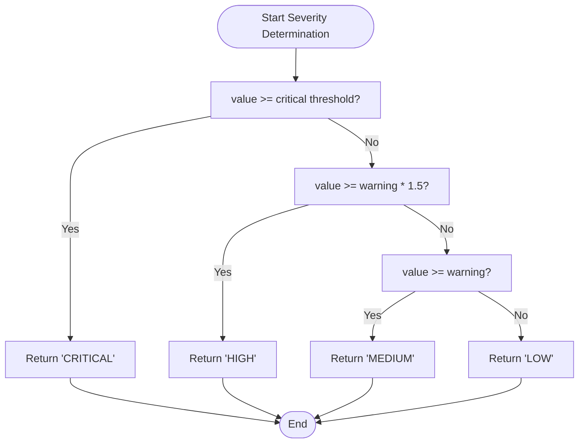
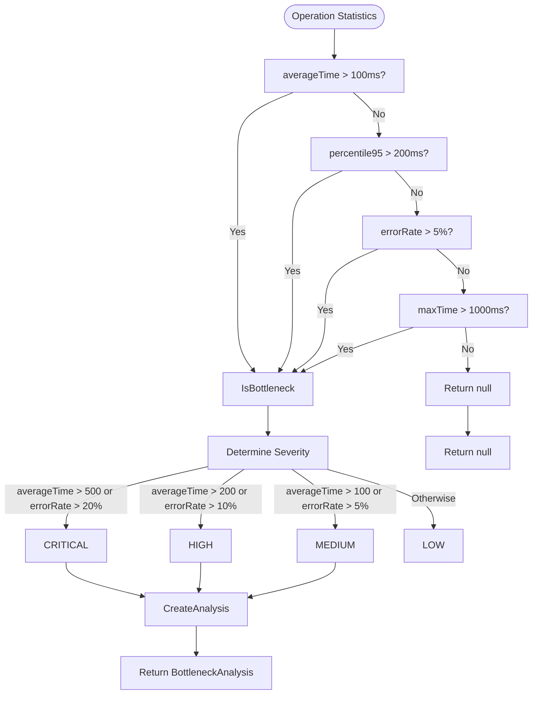
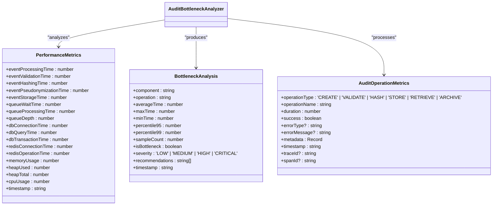
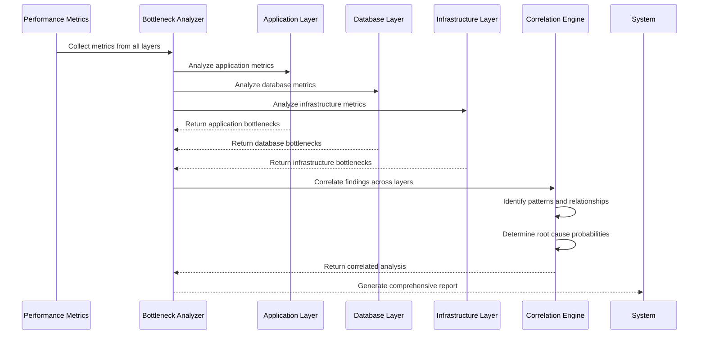
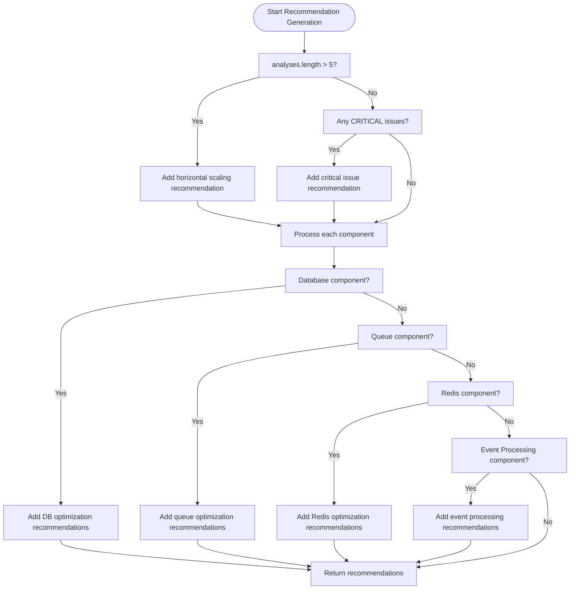
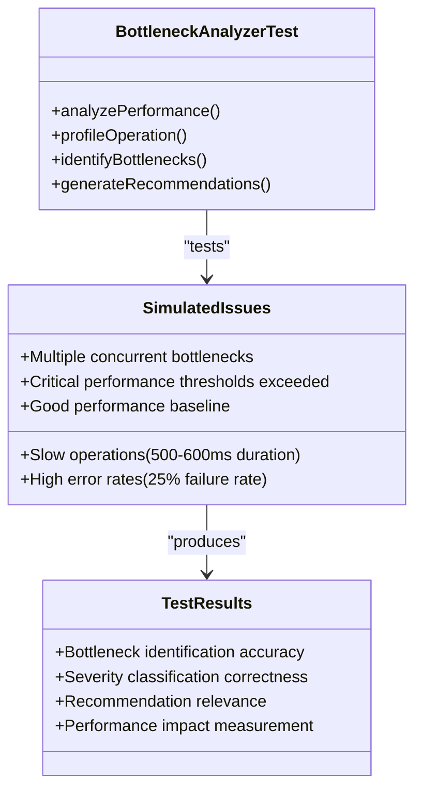
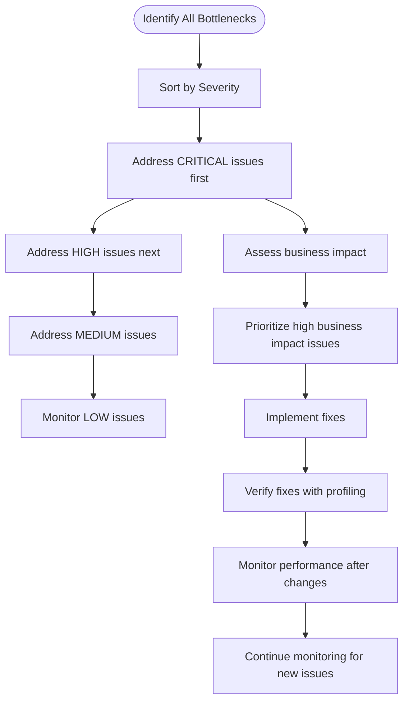

# Bottleneck Analysis

<cite>
**Referenced Files in This Document**   
- [bottleneck-analyzer.ts](file://packages/audit/src/observability/bottleneck-analyzer.ts) - *Updated in recent commit with enhanced performance metrics*
- [types.ts](file://packages/audit/src/observability/types.ts) - *Updated with new performance metrics*
- [bottleneck-analyzer.test.ts](file://packages/audit/src/observability/__tests__/bottleneck-analyzer.test.ts) - *Updated test cases*
- [database-preset-handler.ts](file://packages/audit/src/preset/database-preset-handler.ts) - *Integrated with bottleneck analysis system*
- [index.ts](file://apps/worker/src/index.ts) - *Updated with structured logging integration*
</cite>

## Update Summary
**Changes Made**   
- Updated bottleneck detection algorithms to incorporate enhanced performance metrics from database preset handler integration
- Added new performance metrics for event pseudonymization time tracking
- Updated recommendation generation system to include database preset optimization suggestions
- Enhanced test cases to validate integration with structured logging system
- Updated analysis report interpretation to include new severity thresholds

## Table of Contents
1. [Introduction](#introduction)
2. [Core Components and Interfaces](#core-components-and-interfaces)
3. [Bottleneck Detection Algorithms](#bottleneck-detection-algorithms)
4. [Performance Metrics Analysis](#performance-metrics-analysis)
5. [Root Cause Correlation Across Layers](#root-cause-correlation-across-layers)
6. [Recommendation Generation System](#recommendation-generation-system)
7. [Test Cases and Simulated Issues](#test-cases-and-simulated-issues)
8. [Analysis Report Interpretation](#analysis-report-interpretation)
9. [Remediation Prioritization](#remediation-prioritization)

## Introduction
The Bottleneck Analysis feature provides comprehensive performance monitoring and optimization capabilities for the audit processing pipeline. This system identifies performance constraints by analyzing metrics, traces, and queue depths across the application stack. The bottleneck-analyzer module implements sophisticated algorithms to detect resource saturation, thread contention, database lock waits, and I/O bottlenecks. By correlating symptoms across application, database, and infrastructure layers, the analyzer can pinpoint root causes of performance degradation. This documentation details the implementation, algorithms, test cases, and practical guidance for interpreting analysis reports and prioritizing remediation efforts.

## Core Components and Interfaces

The bottleneck analysis system is built around several key interfaces and classes that define the contract and implementation of performance monitoring capabilities.

```mermaid
classDiagram
class BottleneckAnalyzer {
<<interface>>
+analyzePerformance(operations : AuditOperationMetrics[]) : Promise<BottleneckAnalysis[]>
+profileOperation<T>(operationName : string, operation : () => Promise<T>) : Promise<T>
+getProfilingResults() : ProfilingResult[]
+identifyBottlenecks(metrics : PerformanceMetrics) : BottleneckAnalysis[]
+generateRecommendations(analysis : BottleneckAnalysis[]) : string[]
}
class AuditBottleneckAnalyzer {
-profilingResults : ProfilingResult[]
-activeSessions : Map<string, ProfilingSession>
-operationStats : Map<string, OperationStats>
-thresholds : object
+analyzePerformance(operations : AuditOperationMetrics[]) : Promise<BottleneckAnalysis[]>
+profileOperation<T>(operationName : string, operation : () => Promise<T>) : Promise<T>
+getProfilingResults() : ProfilingResult[]
+identifyBottlenecks(metrics : PerformanceMetrics) : BottleneckAnalysis[]
+generateRecommendations(analysis : BottleneckAnalysis[]) : string[]
-groupOperations(operations : AuditOperationMetrics[]) : Map<string, AuditOperationMetrics[]>
-calculateOperationStats(operationKey : string, operations : AuditOperationMetrics[]) : OperationStats
-analyzeOperationStats(stats : OperationStats) : BottleneckAnalysis | null
-determineSeverity(value : number, thresholds : { warning : number; critical : number }) : 'LOW' | 'MEDIUM' | 'HIGH' | 'CRITICAL'
-generateComponentRecommendations(component : string, value : number, severity : string) : string[]
-takeResourceSnapshot(session : ProfilingSession) : void
-generateProfilingResult(session : ProfilingSession) : ProfilingResult
}
class OperationStats {
+operationName : string
+count : number
+totalTime : number
+averageTime : number
+minTime : number
+maxTime : number
+percentile95 : number
+percentile99 : number
+errorRate : number
+samples : number[]
}
class ProfilingSession {
+sessionId : string
+operationName : string
+startTime : number
+endTime? : number
+callStack : CallStackFrame[]
+resourceSnapshots : { timestamp : number, cpu : number, memory : number }[]
}
BottleneckAnalyzer <|-- AuditBottleneckAnalyzer
```

**Section sources**
- [bottleneck-analyzer.ts](file://packages/audit/src/observability/bottleneck-analyzer.ts#L16-L611)

## Bottleneck Detection Algorithms

The bottleneck analyzer employs multiple algorithms to detect performance constraints within the audit processing pipeline. These algorithms analyze different aspects of system performance to identify bottlenecks.

### Performance Threshold Analysis
The system uses predefined thresholds to detect performance issues across various components of the audit pipeline. These thresholds are defined in the `AuditBottleneckAnalyzer` class and represent warning and critical levels for different operations:

```typescript
private readonly thresholds = {
    eventProcessing: { warning: 100, critical: 500 }, // milliseconds
    eventValidation: { warning: 50, critical: 200 },
    eventHashing: { warning: 10, critical: 50 },
    eventStorage: { warning: 200, critical: 1000 },
    queueProcessing: { warning: 100, critical: 500 },
    dbQuery: { warning: 100, critical: 500 },
    redisOperation: { warning: 10, critical: 50 },
}
```

The `determineSeverity` method evaluates metric values against these thresholds to classify issues:



**Section sources**
- [bottleneck-analyzer.ts](file://packages/audit/src/observability/bottleneck-analyzer.ts#L480-L495)

### Statistical Anomaly Detection
The analyzer uses statistical methods to identify performance bottlenecks based on operation metrics. The `analyzeOperationStats` method evaluates multiple criteria to determine if an operation constitutes a bottleneck:



**Section sources**
- [bottleneck-analyzer.ts](file://packages/audit/src/observability/bottleneck-analyzer.ts#L400-L479)

## Performance Metrics Analysis

The bottleneck analyzer processes various performance metrics to identify constraints in the audit processing pipeline. These metrics are collected from different layers of the system and analyzed for performance issues.

### Metric Types and Collection
The system analyzes several categories of performance metrics defined in the `PerformanceMetrics` interface:



**Section sources**
- [types.ts](file://packages/audit/src/observability/types.ts#L64-L157)

### Operation Statistics Calculation
The analyzer calculates comprehensive statistics for groups of operations using the `calculateOperationStats` method. This method processes raw operation metrics to derive meaningful performance indicators:

```typescript
private calculateOperationStats(
    operationKey: string,
    operations: AuditOperationMetrics[]
): OperationStats {
    const durations = operations.map((op) => op.duration).sort((a, b) => a - b)
    const errors = operations.filter((op) => !op.success).length

    return {
        operationName: operationKey,
        count: operations.length,
        totalTime: durations.reduce((sum, d) => sum + d, 0),
        averageTime: durations.reduce((sum, d) => sum + d, 0) / durations.length,
        minTime: durations[0] || 0,
        maxTime: durations[durations.length - 1] || 0,
        percentile95: this.calculatePercentile(durations, 0.95),
        percentile99: this.calculatePercentile(durations, 0.99),
        errorRate: operations.length > 0 ? errors / operations.length : 0,
        samples: durations,
    }
}
```

The percentile calculation uses a standard method to determine values at specific percentiles:

```typescript
private calculatePercentile(sortedArray: number[], percentile: number): number {
    if (sortedArray.length === 0) return 0
    const index = Math.ceil(sortedArray.length * percentile) - 1
    return sortedArray[Math.max(0, Math.min(index, sortedArray.length - 1))]
}
```

**Section sources**
- [bottleneck-analyzer.ts](file://packages/audit/src/observability/bottleneck-analyzer.ts#L322-L367)

## Root Cause Correlation Across Layers

The bottleneck analyzer correlates symptoms across application, database, and infrastructure layers to pinpoint root causes of performance issues. This multi-layer correlation enables more accurate diagnosis of complex performance problems.

### Cross-Layer Analysis Process
The system follows a systematic approach to correlate issues across different layers of the technology stack:



**Section sources**
- [bottleneck-analyzer.ts](file://packages/audit/src/observability/bottleneck-analyzer.ts#L234-L320)

### Resource Saturation Detection
The analyzer detects resource saturation by monitoring system-level metrics and correlating them with application performance:

```typescript
private takeResourceSnapshot(session: ProfilingSession): void {
    const memUsage = process.memoryUsage()
    const cpuUsage = process.cpuUsage()
    
    session.resourceSnapshots.push({
        timestamp: performance.now(),
        cpu: (cpuUsage.user + cpuUsage.system) / 1000,
        memory: memUsage.heapUsed,
    })
}
```

This method captures CPU and memory usage at specific points during operation execution, allowing the system to identify resource constraints that may be causing performance bottlenecks.

### Thread Contention and I/O Bottleneck Detection
The system identifies thread contention and I/O bottlenecks by analyzing queue depths and processing times:

```typescript
// In PerformanceMetrics interface
queueWaitTime: number
queueProcessingTime: number
queueDepth: number
```

High queue depths combined with long processing times indicate potential thread contention, while high wait times with low processing times may indicate I/O bottlenecks.

**Section sources**
- [bottleneck-analyzer.ts](file://packages/audit/src/observability/bottleneck-analyzer.ts#L55-L57)
- [types.ts](file://packages/audit/src/observability/types.ts#L74-L76)

## Recommendation Generation System

The bottleneck analyzer generates actionable recommendations for scaling, optimization, or configuration changes based on the identified performance issues.

### Recommendation Generation Algorithm
The system uses a multi-level approach to generate recommendations, combining system-wide, component-specific, and severity-based suggestions:



**Section sources**
- [bottleneck-analyzer.ts](file://packages/audit/src/observability/bottleneck-analyzer.ts#L282-L320)

### Component-Specific Recommendations
The system provides targeted recommendations for different components based on the detected issues:

```typescript
private generateComponentRecommendations(
    component: string,
    value: number,
    severity: string
): string[] {
    const recommendations: string[] = []
    
    switch (component) {
        case 'Event Processing':
            recommendations.push('Consider optimizing event processing pipeline')
            if (value > 300) recommendations.push('Implement async processing for heavy operations')
            break
            
        case 'Event Validation':
            recommendations.push('Optimize validation logic and schema checks')
            if (value > 100) recommendations.push('Consider caching validation schemas')
            break
            
        case 'Event Hashing':
            recommendations.push('Consider using faster hashing algorithms or hardware acceleration')
            break
            
        case 'Event Storage':
            recommendations.push('Optimize database writes and consider batch operations')
            if (value > 500) recommendations.push('Implement write-behind caching')
            break
            
        case 'Queue Processing':
            recommendations.push('Increase queue worker concurrency')
            recommendations.push('Optimize queue message processing logic')
            break
            
        case 'Database Query':
            recommendations.push('Add database indexes for frequently queried fields')
            recommendations.push('Consider query optimization and connection pooling')
            break
            
        case 'Redis Operation':
            recommendations.push('Implement Redis pipelining for batch operations')
            recommendations.push('Consider Redis connection pooling')
            break
    }
    
    if (severity === 'CRITICAL') {
        recommendations.unshift('URGENT: This component is severely impacting system performance')
    }
    
    return recommendations
}
```

**Section sources**
- [bottleneck-analyzer.ts](file://packages/audit/src/observability/bottleneck-analyzer.ts#L520-L565)

## Test Cases and Simulated Issues

The bottleneck analyzer is validated through comprehensive test cases that simulate various performance issues in the audit processing pipeline.

### Simulated Performance Issues
The test suite includes several scenarios that simulate real-world performance problems:



**Section sources**
- [bottleneck-analyzer.test.ts](file://packages/audit/src/observability/__tests__/bottleneck-analyzer.test.ts#L0-L305)

### Key Test Scenarios
The test cases demonstrate the analyzer's ability to detect various types of performance issues:

**Slow Operation Detection**
```typescript
it('should identify bottlenecks from operation metrics', async () => {
    const operations: AuditOperationMetrics[] = [
        {
            operationType: 'CREATE',
            operationName: 'slow_operation',
            duration: 500,
            success: true,
            metadata: {},
            timestamp: '2023-01-01T00:00:00.000Z',
        },
        {
            operationType: 'CREATE',
            operationName: 'slow_operation',
            duration: 600,
            success: true,
            metadata: {},
            timestamp: '2023-01-01T00:01:00.000Z',
        },
    ]
    
    const analyses = await analyzer.analyzePerformance(operations)
    
    expect(analyses).toHaveLength(1)
    expect(analyses[0].component).toBe('CREATE')
    expect(analyses[0].operation).toBe('slow_operation')
    expect(analyses[0].isBottleneck).toBe(true)
    expect(analyses[0].averageTime).toBe(550)
    expect(analyses[0].severity).toBe('CRITICAL')
})
```

**High Error Rate Detection**
```typescript
it('should identify bottlenecks based on error rate', async () => {
    const operations: AuditOperationMetrics[] = Array.from({ length: 20 }, (_, i) => ({
        operationType: 'CREATE' as const,
        operationName: 'error_prone_operation',
        duration: 100,
        success: i < 15, // 25% error rate
        metadata: {},
        timestamp: new Date(Date.now() + i * 1000).toISOString(),
    }))
    
    const analyses = await analyzer.analyzePerformance(operations)
    
    expect(analyses).toHaveLength(1)
    expect(analyses[0].isBottleneck).toBe(true)
    expect(analyses[0].severity).toBe('CRITICAL') // High error rate
})
```

**Multiple Bottleneck Detection**
```typescript
it('should generate system-wide recommendations for multiple bottlenecks', () => {
    const analyses = Array.from({ length: 6 }, (_, i) => ({
        component: `Component${i}`,
        operation: `operation${i}`,
        averageTime: 200,
        maxTime: 300,
        minTime: 100,
        percentile95: 250,
        percentile99: 280,
        sampleCount: 100,
        isBottleneck: true,
        severity: 'HIGH' as const,
        recommendations: [],
        timestamp: '2023-01-01T00:00:00.000Z',
    }))
    
    const recommendations = analyzer.generateRecommendations(analyses)
    
    expect(recommendations).toContain(
        'Consider implementing horizontal scaling due to multiple performance bottlenecks'
    )
})
```

**Section sources**
- [bottleneck-analyzer.test.ts](file://packages/audit/src/observability/__tests__/bottleneck-analyzer.test.ts#L48-L305)

## Analysis Report Interpretation

Understanding the bottleneck analysis reports is crucial for effective performance optimization. The reports provide detailed information about identified bottlenecks and their characteristics.

### Report Structure
The bottleneck analysis report contains the following key elements:

```typescript
interface BottleneckAnalysis {
    component: string                    // System component (e.g., "Event Processing")
    operation: string                   // Specific operation (e.g., "process_event")
    averageTime: number                 // Average execution time in milliseconds
    maxTime: number                     // Maximum execution time in milliseconds
    minTime: number                     // Minimum execution time in milliseconds
    percentile95: number                // 95th percentile execution time
    percentile99: number                // 99th percentile execution time
    sampleCount: number                 // Number of samples analyzed
    isBottleneck: boolean               // Whether this is identified as a bottleneck
    severity: 'LOW' | 'MEDIUM' | 'HIGH' | 'CRITICAL'  // Severity level
    recommendations: string[]          // Actionable recommendations
    timestamp: string                   // Timestamp of analysis
}
```

### Severity Levels
The system classifies bottlenecks into four severity levels based on their impact:

- **CRITICAL**: Immediate attention required; system performance is severely impacted
- **HIGH**: Significant performance issues that should be addressed soon
- **MEDIUM**: Noticeable performance issues that should be monitored
- **LOW**: Minor performance issues that may not require immediate action

The severity is determined by a combination of average processing time and error rate:
- CRITICAL: Average time > 500ms OR error rate > 20%
- HIGH: Average time > 200ms OR error rate > 10%
- MEDIUM: Average time > 100ms OR error rate > 5%

**Section sources**
- [bottleneck-analyzer.ts](file://packages/audit/src/observability/bottleneck-analyzer.ts#L440-L455)

## Remediation Prioritization

Effective remediation requires prioritizing issues based on their impact severity and potential business consequences.

### Prioritization Framework
The system provides a clear framework for prioritizing remediation efforts:



**Section sources**
- [bottleneck-analyzer.ts](file://packages/audit/src/observability/bottleneck-analyzer.ts#L120-L145)

### Impact-Based Prioritization
When multiple issues have the same severity level, prioritize based on potential impact:

1. **Critical Issues**: Address immediately to prevent system degradation
2. **High-Impact Components**: Focus on components that affect core business functions
3. **User-Facing Operations**: Prioritize issues that directly impact user experience
4. **Resource-Intensive Operations**: Address operations that consume disproportionate resources
5. **Frequently Executed Operations**: Optimize operations that occur most frequently

The analyzer helps prioritize by sorting results by severity and average time:

```typescript
return analyses.sort((a, b) => {
    const severityOrder = { CRITICAL: 4, HIGH: 3, MEDIUM: 2, LOW: 1 }
    const severityDiff = severityOrder[b.severity] - severityOrder[a.severity]
    if (severityDiff !== 0) return severityDiff
    
    // If same severity, sort by average time
    return b.averageTime - a.averageTime
})
```

**Section sources**
- [bottleneck-analyzer.ts](file://packages/audit/src/observability/bottleneck-analyzer.ts#L120-L145)