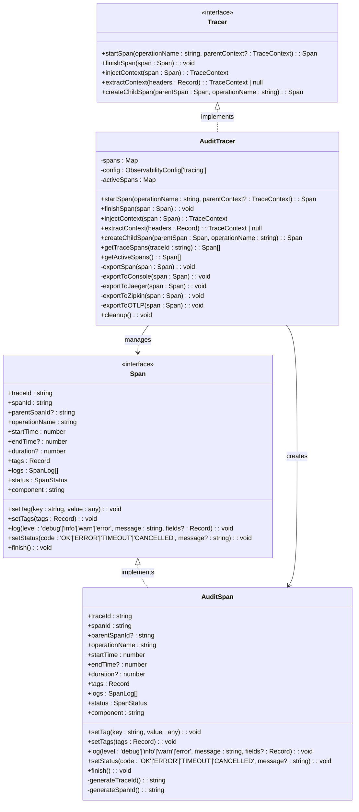
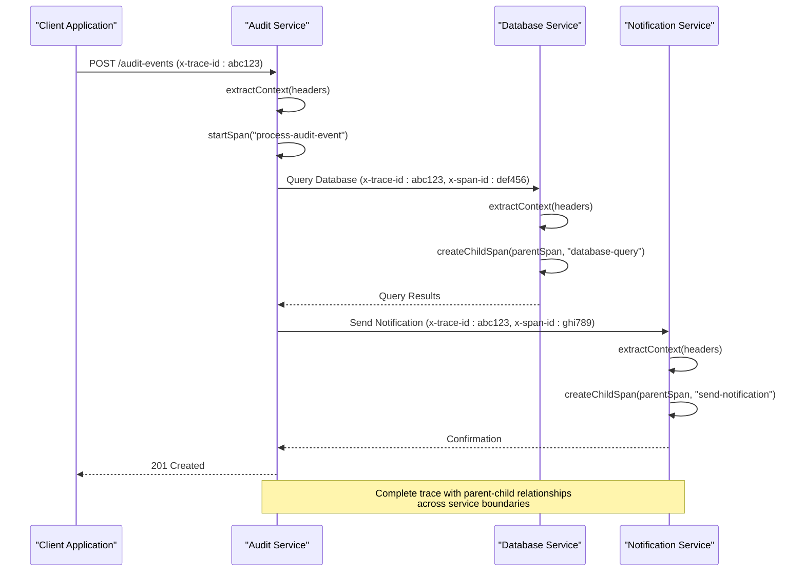
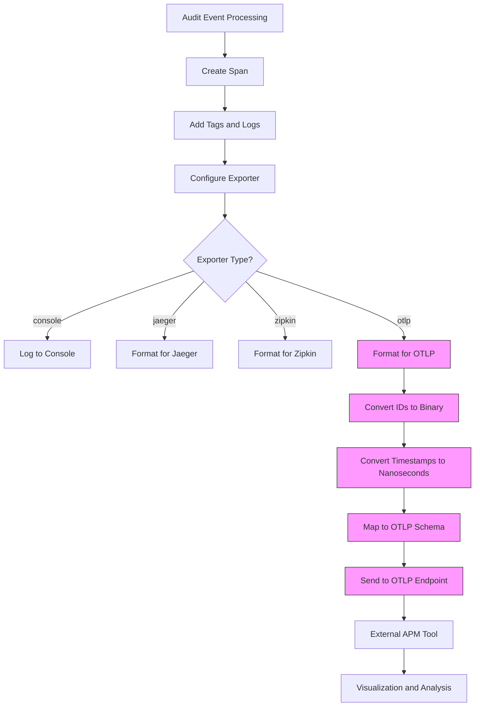
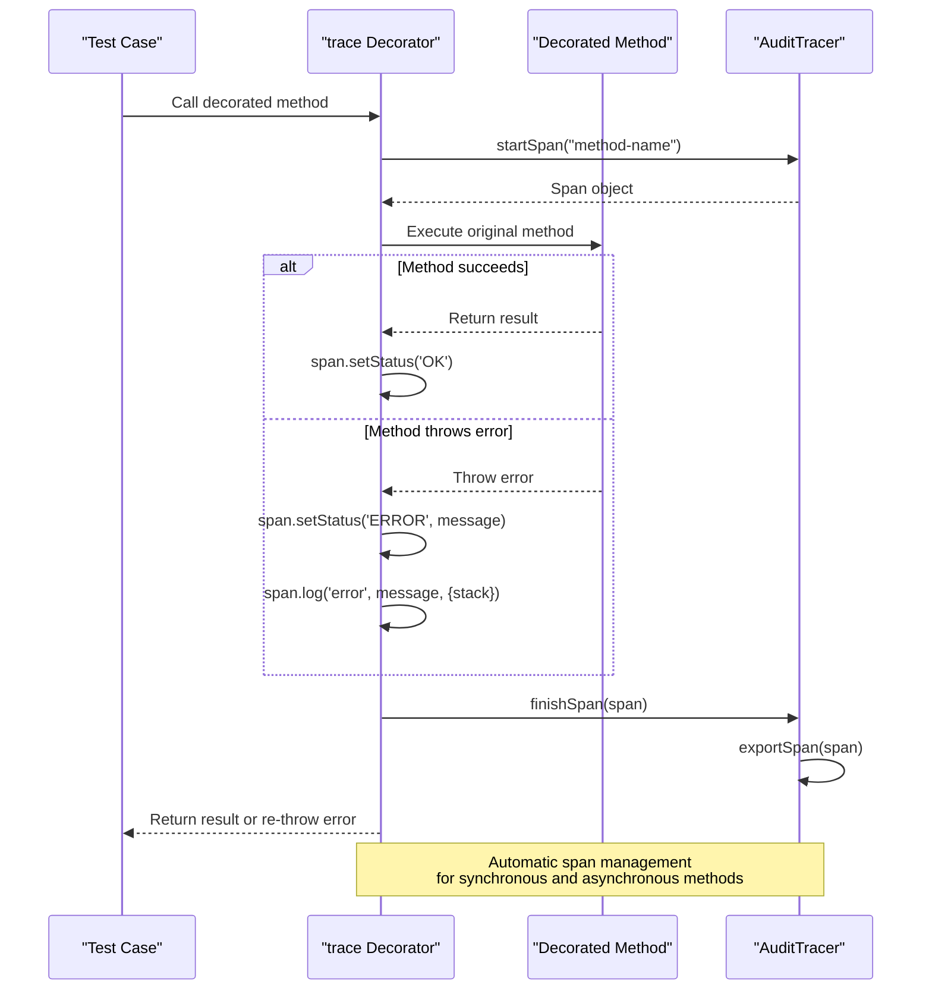
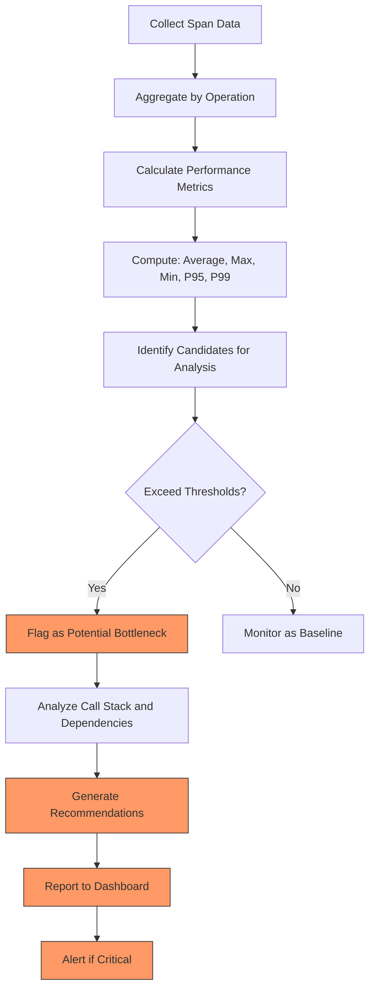
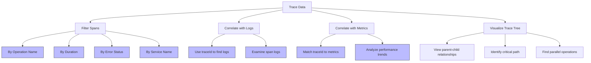

# Distributed Tracing

<cite>
**Referenced Files in This Document**   
- [tracer.ts](file://packages/audit/src/observability/tracer.ts#L1-L426)
- [types.ts](file://packages/audit/src/observability/types.ts#L1-L303)
- [tracer.test.ts](file://packages/audit/src/observability/__tests__/tracer.test.ts#L1-L216)
- [index.ts](file://packages/audit/src/observability/index.ts#L1-L70)
</cite>

## Table of Contents
1. [Introduction](#introduction)
2. [Core Tracing Components](#core-tracing-components)
3. [Trace Context Propagation](#trace-context-propagation)
4. [Integration with External APM Tools](#integration-with-external-apm-tools)
5. [Trace Context Preservation in Asynchronous Operations](#trace-context-preservation-in-asynchronous-operations)
6. [Performance Analysis and Bottleneck Identification](#performance-analysis-and-bottleneck-identification)
7. [Trace Data Interpretation and Correlation](#trace-data-interpretation-and-correlation)

## Introduction
The Distributed Tracing system in the audit event processing workflow provides end-to-end visibility across microservices, enabling comprehensive monitoring of audit events from creation to archival. This documentation details the implementation of the tracer module, which creates and propagates trace IDs, span contexts, and parent-child relationships throughout the system. The tracing infrastructure supports integration with external Application Performance Monitoring (APM) tools through OpenTelemetry standards, allowing organizations to leverage existing monitoring ecosystems. The system captures detailed performance metrics, error information, and execution context, which can be used to identify bottlenecks, debug complex failures, and measure latency across distributed components.

## Core Tracing Components

The distributed tracing implementation consists of several key components that work together to provide comprehensive visibility into audit event processing workflows. At the core is the `AuditTracer` class, which implements the `Tracer` interface and manages the lifecycle of spans throughout the system. Each span represents a logical unit of work with a defined start and end time, allowing for precise measurement of operation duration.

**Diagram sources**
- [tracer.ts](file://packages/audit/src/observability/tracer.ts#L1-L426)
- [types.ts](file://packages/audit/src/observability/types.ts#L1-L303)

**Section sources**
- [tracer.ts](file://packages/audit/src/observability/tracer.ts#L1-L426)
- [types.ts](file://packages/audit/src/observability/types.ts#L1-L303)

## Trace Context Propagation

The tracing system implements robust context propagation mechanisms to maintain trace continuity across service boundaries and asynchronous operations. The `TraceContext` interface defines the essential elements that must be preserved when propagating traces: `traceId`, `spanId`, and optional `parentSpanId`. This context can be extracted from HTTP headers using the `extractContext` method, which recognizes both standard and custom header formats (`x-trace-id`, `traceid`, etc.).

When a service receives a request with trace context, it uses this information to create child spans that maintain the parent-child relationship within the trace. The `createChildSpan` method automatically inherits the trace ID from the parent span while generating a new span ID, establishing the hierarchical relationship. This approach ensures that all operations within a distributed workflow are linked together, forming a complete trace tree that can be reconstructed for analysis.

**Diagram sources**
- [tracer.ts](file://packages/audit/src/observability/tracer.ts#L1-L426)
- [types.ts](file://packages/audit/src/observability/types.ts#L1-L303)

**Section sources**
- [tracer.ts](file://packages/audit/src/observability/tracer.ts#L1-L426)
- [types.ts](file://packages/audit/src/observability/types.ts#L1-L303)

## Integration with External APM Tools

The tracing system supports integration with external APM tools through multiple exporter types, with a particular focus on OpenTelemetry via the OTLP (OpenTelemetry Protocol) exporter. The `ObservabilityConfig` interface defines the configuration options for tracing, including the `exporterType` which can be set to 'console', 'jaeger', 'zipkin', or 'otlp'. When configured for OTLP export, the system formats trace data according to the OpenTelemetry specification, enabling seamless integration with any OpenTelemetry-compatible backend.

The `exportToOTLP` method transforms the internal span representation into the OTLP format, converting trace and span IDs from hexadecimal strings to binary buffers, and adjusting timestamps from milliseconds to nanoseconds as required by the specification. The exported data includes resource attributes, instrumentation library spans, and detailed span information with attributes, events (logs), and status. This comprehensive data model allows external APM tools to provide rich visualizations of system behavior, including service maps, dependency graphs, and performance heatmaps.

**Diagram sources**
- [tracer.ts](file://packages/audit/src/observability/tracer.ts#L1-L426)
- [types.ts](file://packages/audit/src/observability/types.ts#L1-L303)

**Section sources**
- [tracer.ts](file://packages/audit/src/observability/tracer.ts#L1-L426)
- [types.ts](file://packages/audit/src/observability/types.ts#L1-L303)

## Trace Context Preservation in Asynchronous Operations

The tracer implementation includes comprehensive test coverage for trace context preservation across asynchronous operations and service boundaries, as demonstrated in the `tracer.test.ts` file. The tests verify that when a parent span is created and used to generate a child span, the trace ID is properly inherited while a new span ID is generated, maintaining the hierarchical relationship. This is critical for accurately representing the call flow in distributed systems where operations may execute concurrently or with delays.

The `trace` decorator provides an automated mechanism for creating spans around method executions, handling both successful completions and exceptions. When a decorated method completes successfully, the span status is set to 'OK'; when an exception occurs, the span status is set to 'ERROR' with the error message, and an error log entry is added with the stack trace. This automatic error handling ensures that failures are properly captured in the trace data, making it easier to diagnose issues in production environments.

**Diagram sources**
- [tracer.test.ts](file://packages/audit/src/observability/__tests__/tracer.test.ts#L1-L216)
- [tracer.ts](file://packages/audit/src/observability/tracer.ts#L1-L426)

**Section sources**
- [tracer.test.ts](file://packages/audit/src/observability/__tests__/tracer.test.ts#L1-L216)
- [tracer.ts](file://packages/audit/src/observability/tracer.ts#L1-L426)

## Performance Analysis and Bottleneck Identification

The tracing data collected by the system serves as a foundation for performance analysis and bottleneck identification. Each span captures detailed timing information, including start time, end time, and calculated duration, which can be aggregated to identify operations with high latency. The system also supports sampling based on the configured `sampleRate`, allowing organizations to balance the overhead of tracing with the need for comprehensive data collection.

The `BottleneckAnalysis` interface, defined in the types, provides a structured approach to identifying performance issues, including metrics such as average time, maximum time, 95th and 99th percentiles, and sample count. These metrics can be used to detect operations that are consistently slow or exhibit high variance in execution time. The severity level (LOW, MEDIUM, HIGH, CRITICAL) helps prioritize remediation efforts, while recommendations provide actionable guidance for improving performance.

**Diagram sources**
- [types.ts](file://packages/audit/src/observability/types.ts#L1-L303)
- [tracer.ts](file://packages/audit/src/observability/tracer.ts#L1-L426)

**Section sources**
- [types.ts](file://packages/audit/src/observability/types.ts#L1-L303)
- [tracer.ts](file://packages/audit/src/observability/tracer.ts#L1-L426)

## Trace Data Interpretation and Correlation

Interpreting trace data effectively requires correlating traces with logs and metrics to gain a comprehensive understanding of system behavior. The tracing system facilitates this correlation through several mechanisms. Each span includes a `traceId` that can be used to search across log entries, allowing developers to find all log messages associated with a specific trace. The span logs capture structured data with levels, messages, and additional fields, providing context about events that occurred during the span's execution.

When analyzing trace data, it's important to filter relevant spans based on criteria such as operation name, service name, duration, or error status. For example, filtering for spans with duration greater than a threshold can quickly identify slow operations. Similarly, filtering for spans with error status can help diagnose failure patterns. The hierarchical nature of spans, with parent-child relationships, enables navigation from high-level service calls down to individual database queries or external API calls, providing both breadth and depth of visibility.

**Diagram sources**
- [tracer.ts](file://packages/audit/src/observability/tracer.ts#L1-L426)
- [types.ts](file://packages/audit/src/observability/types.ts#L1-L303)

**Section sources**
- [tracer.ts](file://packages/audit/src/observability/tracer.ts#L1-L426)
- [types.ts](file://packages/audit/src/observability/types.ts#L1-L303)