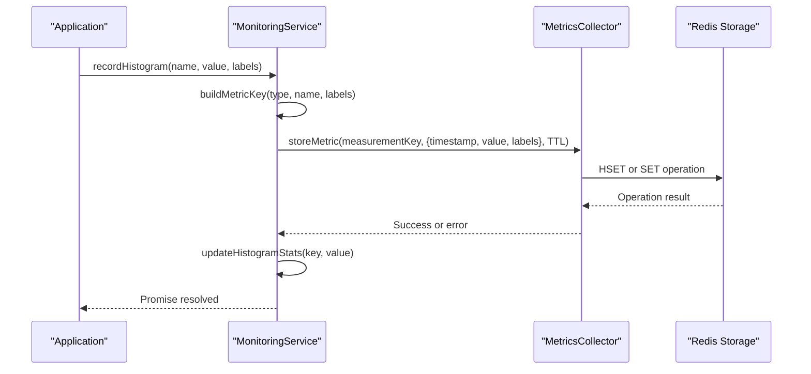
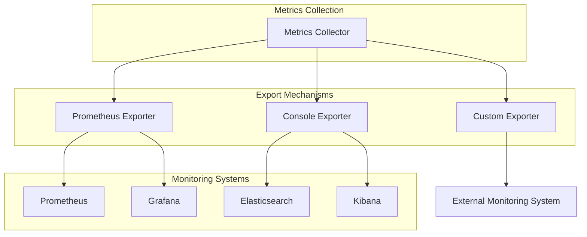
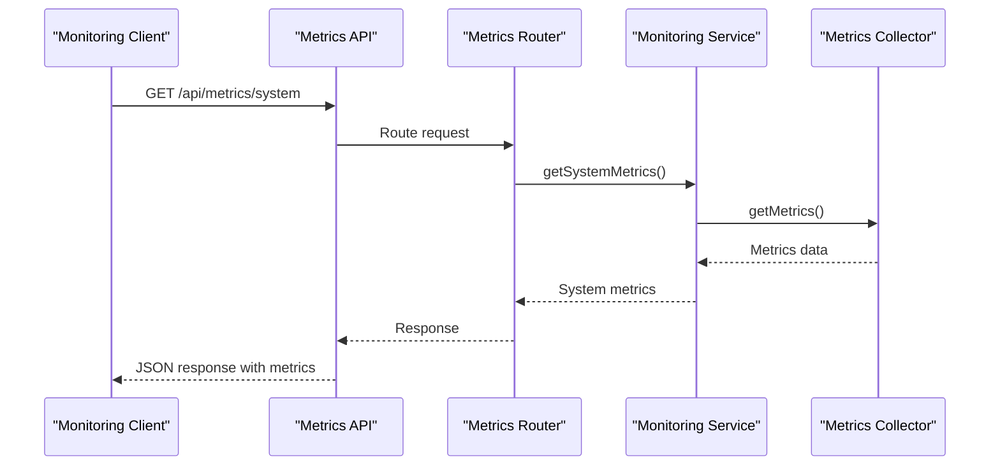
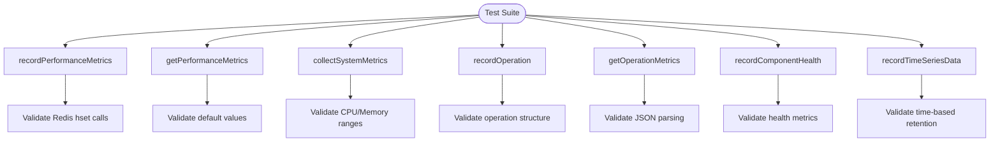
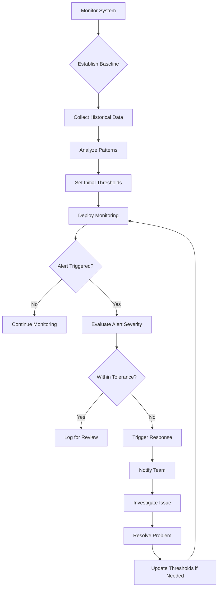

# Metrics Collection

<cite>
**Referenced Files in This Document**   
- [metrics-collector.ts](file://packages/audit/src/monitor/metrics-collector.ts)
- [metrics-collector.test.ts](file://packages/audit/src/observability/__tests__/metrics-collector.test.ts)
- [monitoring.ts](file://packages/audit/src/monitor/monitoring.ts)
- [monitoring-types.ts](file://packages/audit/src/monitor/monitoring-types.ts)
- [types.ts](file://packages/audit/src/observability/types.ts)
- [index.ts](file://packages/audit/src/observability/index.ts)
</cite>

## Table of Contents
1. [Metrics Collection System Overview](#metrics-collection-system-overview)
2. [Core Metrics Collector Implementation](#core-metrics-collector-implementation)
3. [Metric Types and Structure](#metric-types-and-structure)
4. [Tagging and Dimensional Analysis](#tagging-and-dimensional-analysis)
5. [Integration with Monitoring Systems](#integration-with-monitoring-systems)
6. [Configuration Options](#configuration-options)
7. [Testing and Validation](#testing-and-validation)
8. [Best Practices for Monitoring and Alerting](#best-practices-for-monitoring-and-alerting)

## Metrics Collection System Overview

The Metrics Collection system is a comprehensive observability framework designed to capture key performance indicators across the audit pipeline. It provides real-time monitoring of event throughput, processing latency, error rates, and system resource utilization. The system is built around two primary implementations: the basic `RedisMetricsCollector` for core monitoring needs and the enhanced `RedisEnhancedMetricsCollector` for comprehensive observability.

The metrics collection system serves as the foundation for monitoring service health, enabling teams to establish baselines, detect anomalies, and set up proactive alerting. It integrates seamlessly with the broader monitoring ecosystem, providing data for dashboards, alerting systems, and compliance reporting.

**Section sources**
- [metrics-collector.ts](file://packages/audit/src/monitor/metrics-collector.ts#L1-L50)
- [monitoring.ts](file://packages/audit/src/monitor/monitoring.ts#L1-L50)

## Core Metrics Collector Implementation

The core metrics collection functionality is implemented through the `RedisMetricsCollector` class, which provides a robust interface for capturing and storing performance data. This implementation uses Redis as the primary storage backend, leveraging its high-performance characteristics for real-time metrics collection.

```mermaid
classDiagram
class MetricsCollector {
<<interface>>
+recordEvent() : Promise~void~
+recordProcessingLatency(latency : number) : Promise~void~
+recordError() : Promise~void~
+recordIntegrityViolation() : Promise~void~
+recordQueueDepth(depth : number) : Promise~void~
+getMetrics() : Promise~Metrics~
+resetMetrics() : Promise~void~
+recordSuspiciousPattern(suspiciousPatterns : number) : Promise~void~
+recordAlertGenerated() : Promise~void~
+setCooldown(cooldownKey : string, cooldownPeriod : number) : Promise~void~
+isOnCooldown(cooldownKey : string) : Promise~boolean~
+storeMetric(key : string, value : any, ttl? : number) : Promise~void~
+getMetric(key : string) : Promise~any~
+getMetricsByPattern(pattern : string) : Promise~any[]~
+incrementCounter(key : string, value? : number) : Promise~void~
+info(type? : string) : Promise~string~
+dbsize() : Promise~number~
}
class RedisMetricsCollector {
-metricsPrefix : string
-retentionPeriod : number
-connection : RedisType
-isSharedConnection : boolean
+constructor(redisOrUrlOrOptions? : string | RedisType | { url? : string; options? : RedisOptions }, directConnectionOptions? : RedisOptions)
+recordEvent() : Promise~void~
+recordProcessingLatency(latency : number) : Promise~void~
+recordError() : Promise~void~
+getMetrics() : Promise~Metrics~
+resetMetrics() : Promise~void~
+recordSuspiciousPattern(suspiciousPatterns : number) : Promise~void~
+recordAlertGenerated() : Promise~void~
+setCooldown(cooldownKey : string, cooldownPeriod : number) : Promise~void~
+isOnCooldown(cooldownKey : string) : Promise~boolean~
+storeMetric(key : string, value : any, ttl? : number) : Promise~void~
+getMetric(key : string) : Promise~any~
+getMetricsByPattern(pattern : string) : Promise~any[]~
+incrementCounter(key : string, value? : number) : Promise~void~
+info(type? : string) : Promise~string~
+dbsize() : Promise~number~
+buildMetricKey(type : string, name : string, labels? : Record~string, string~) : string
}
MetricsCollector <|.. RedisMetricsCollector : implements
```

**Diagram sources**
- [metrics-collector.ts](file://packages/audit/src/monitor/metrics-collector.ts#L25-L200)

**Section sources**
- [metrics-collector.ts](file://packages/audit/src/monitor/metrics-collector.ts#L1-L200)

## Metric Types and Structure

The metrics collection system supports multiple metric types to capture different aspects of system performance and behavior. These include counters, gauges, and histograms, each serving specific monitoring purposes.

### Counter Metrics
Counters are used to track the number of occurrences of specific events. They are monotonically increasing and reset only when the system restarts or metrics are explicitly reset.


### Gauge Metrics
Gauges represent a single numerical value that can go up and down, such as current queue depth or memory usage.

### Histogram Metrics
Histograms capture the distribution of values, particularly useful for measuring response times and processing latencies.



**Diagram sources**
- [monitoring.ts](file://packages/audit/src/monitor/monitoring.ts#L1100-L1200)
- [monitoring-types.ts](file://packages/audit/src/monitor/monitoring-types.ts#L1-L50)

**Section sources**
- [monitoring.ts](file://packages/audit/src/monitor/monitoring.ts#L1100-L1200)
- [monitoring-types.ts](file://packages/audit/src/monitor/monitoring-types.ts#L1-L100)

## Tagging and Dimensional Analysis

The metrics collection system implements a comprehensive tagging mechanism that enables dimensional analysis of performance data. Metrics are tagged by service, component, and status, allowing for detailed filtering and aggregation.

### Tagging Implementation
The `buildMetricKey` method in the `MonitoringService` class is responsible for constructing metric keys with labels. This method sorts labels alphabetically to ensure consistent key generation and prevent duplication.

```typescript
private buildMetricKey(type: string, name: string, labels?: Record<string, string>): string {
    let key = `{type}:${name}`
    
    if (labels) {
        const labelString = Object.entries(labels)
            .sort(([a], [b]) => a.localeCompare(b))
            .map(([k, v]) => `${k}=${v}`)
            .join(',')
        key += `:${labelString}`
    }
    
    return key
}
```

### Dimensional Analysis Capabilities
The tagging system supports the following dimensions:

- **Service**: Identifies the specific service generating the metric
- **Component**: Specifies the component within the service
- **Status**: Indicates the operational status (e.g., success, error)
- **Severity**: For alert-related metrics, indicates the severity level
- **Type**: Categorizes the metric type (e.g., security, compliance)

This dimensional approach enables powerful analytical capabilities, such as:
- Comparing performance across different services
- Identifying components with high error rates
- Tracking metrics by severity level for prioritized response
- Analyzing trends for specific metric types

**Section sources**
- [monitoring.ts](file://packages/audit/src/monitor/monitoring.ts#L1105-L1158)

## Integration with Monitoring Systems

The metrics collection system integrates with various monitoring systems through multiple export mechanisms and API endpoints. This integration enables comprehensive observability across the entire audit pipeline.

### Export Formats
The system supports multiple export formats to accommodate different monitoring backends:

- **Prometheus**: Exposes metrics in Prometheus text format for scraping
- **Console**: Outputs metrics to console for debugging and development
- **Custom**: Allows integration with proprietary monitoring systems



**Diagram sources**
- [types.ts](file://packages/audit/src/observability/types.ts#L268-L302)

### API Integration
The system exposes metrics through REST API endpoints, enabling integration with external monitoring tools and dashboards.



**Diagram sources**
- [metrics-api.ts](file://apps/server/src/routes/metrics-api.ts#L308-L360)
- [metrics.ts](file://apps/server/src/routers/metrics.ts#L1-L38)

**Section sources**
- [types.ts](file://packages/audit/src/observability/types.ts#L268-L302)
- [metrics-api.ts](file://apps/server/src/routes/metrics-api.ts#L308-L360)

## Configuration Options

The metrics collection system provides extensive configuration options to customize behavior based on deployment requirements and performance considerations.

### Configuration Structure
The `ObservabilityConfig` interface defines all configurable parameters for the metrics collector:

```typescript
export interface ObservabilityConfig {
    // Metrics configuration
    metrics: {
        enabled: boolean
        collectionInterval: number
        retentionPeriod: number
        exporterType: 'prometheus' | 'console' | 'custom'
        exporterEndpoint?: string
    }
}
```

### Key Configuration Parameters

**Sampling Configuration**
- **sampleRate**: Controls the percentage of events to sample (e.g., 0.1 for 10% sampling)
- Reduces overhead in high-throughput environments while maintaining statistical accuracy

**Aggregation Intervals**
- **collectionInterval**: Specifies how frequently metrics are aggregated (in milliseconds)
- Default: 1000ms (1 second)
- Adjustable based on monitoring requirements and system load

**Retention Period**
- **retentionPeriod**: Determines how long metrics are retained in storage (in seconds)
- Default: 3600 seconds (1 hour)
- Configurable to balance storage requirements with historical analysis needs

**Export Formats**
- **exporterType**: Specifies the output format for metrics
  - 'prometheus': Exposes metrics in Prometheus format
  - 'console': Outputs to console for debugging
  - 'custom': Enables integration with custom monitoring systems

**Section sources**
- [types.ts](file://packages/audit/src/observability/types.ts#L268-L302)
- [index.ts](file://packages/audit/src/observability/index.ts#L48-L69)

## Testing and Validation

The metrics collection system includes comprehensive test coverage to ensure reliability and correctness of metric emission and validation.

### Test Scenarios
The `metrics-collector.test.ts` file contains test cases that validate various aspects of the metrics collection functionality:



### Example Test Case
```typescript
describe('recordPerformanceMetrics', () => {
    it('should record performance metrics to Redis', async () => {
        const metrics = {
            eventProcessingTime: 100,
            eventValidationTime: 50,
            queueDepth: 10,
        }
        
        await collector.recordPerformanceMetrics(metrics)
        
        expect(mockRedis.hset).toHaveBeenCalledWith(
            'audit:observability:performance',
            expect.objectContaining({
                eventProcessingTime: '100',
                eventValidationTime: '50',
                queueDepth: '10',
            })
        )
        expect(mockRedis.expire).toHaveBeenCalled()
    })
})
```

The tests validate that:
- Metrics are correctly stored in Redis with appropriate keys
- Data types are properly serialized and deserialized
- Default values are returned when no data exists
- Time-to-live (TTL) settings are applied correctly
- Aggregated statistics are updated appropriately

**Section sources**
- [metrics-collector.test.ts](file://packages/audit/src/observability/__tests__/metrics-collector.test.ts#L1-L200)

## Best Practices for Monitoring and Alerting

The metrics collection system supports best practices for monitoring service health and establishing effective alerting thresholds based on observed baselines.

### Alert Threshold Configuration
The system includes default alert thresholds based on industry best practices:

```typescript
export const DEFAULT_DASHBOARD_CONFIG = {
    alertThresholds: {
        errorRate: 0.05, // 5% error rate threshold
        latency: 1000, // 1 second maximum latency
        throughput: 100, // 100 events per second minimum
    },
    components: ['audit-processor', 'database', 'redis', 'queue', 'monitoring', 'health-check'],
}
```

### Monitoring Best Practices

**Establish Baselines**
- Monitor system behavior during normal operations to establish performance baselines
- Use historical data to set realistic thresholds
- Account for expected variations (e.g., daily, weekly patterns)

**Set Appropriate Thresholds**
- **Error Rate**: Alert when error rate exceeds 5% of total requests
- **Latency**: Trigger alerts when average processing latency exceeds 1 second
- **Throughput**: Alert on significant deviations from expected event processing rates
- **Resource Utilization**: Monitor CPU, memory, and storage usage with tiered alerts

**Implement Tiered Alerting**
- **Warning**: For issues that require attention but don't impact service
- **High**: For problems affecting performance or user experience
- **Critical**: For outages or severe degradation requiring immediate response

**Use Dimensional Analysis**
- Analyze metrics across different dimensions (service, component, status)
- Compare current performance against historical baselines
- Identify patterns and correlations between different metrics

**Regular Review and Tuning**
- Periodically review alert thresholds and adjust based on system evolution
- Eliminate false positives and refine alerting rules
- Document alerting logic and response procedures



**Section sources**
- [index.ts](file://packages/audit/src/observability/index.ts#L59-L68)
- [monitoring.ts](file://packages/audit/src/monitor/monitoring.ts#L535-L582)