# Observability Dashboard

<cite>
**Referenced Files in This Document**   
- [dashboard.ts](file://packages\audit\src\observability\dashboard.ts) - *Updated in recent commit with database preset handler and structured logging integration*
- [types.ts](file://packages\audit\src\observability\types.ts) - *Updated with bottleneck analysis support*
- [bottleneck-analyzer.ts](file://packages\audit\src\observability\bottleneck-analyzer.ts) - *New bottleneck analysis component added*
- [metrics-collector.ts](file://packages\audit\src\observability\metrics-collector.ts) - *Enhanced with operation metrics collection*
- [dashboard.test.ts](file://packages\audit\src\observability\__tests__\dashboard.test.ts) - *Updated to test bottleneck analysis integration*
</cite>

## Update Summary
**Changes Made**   
- Updated documentation to reflect integration of bottleneck analyzer and database preset handler
- Added information about performance profiling and bottleneck detection
- Enhanced architecture overview to include bottleneck analysis component
- Updated test examples to reflect bottleneck analysis validation
- Added new section on bottleneck analysis and performance profiling

## Table of Contents
1. [Introduction](#introduction)
2. [Data Sources](#data-sources)
3. [Metrics Collection and Aggregation](#metrics-collection-and-aggregation)
4. [Health Status Monitoring](#health-status-monitoring)
5. [Dashboard Metrics Aggregation](#dashboard-metrics-aggregation)
6. [Visualization Components](#visualization-components)
7. [User Customization and Interaction](#user-customization-and-interaction)
8. [Performance and Caching](#performance-and-caching)
9. [Testing and Validation](#testing-and-validation)
10. [Architecture Overview](#architecture-overview)
11. [Bottleneck Analysis and Performance Profiling](#bottleneck-analysis-and-performance-profiling)

## Introduction
The Observability Dashboard provides a unified view for monitoring system performance, health, and security across the audit system. It aggregates metrics, traces, and health status from various components into a comprehensive interface that enables real-time monitoring and historical analysis. The dashboard serves as a central hub for system administrators and operations teams to identify issues, track performance trends, and respond to security incidents.

The dashboard integrates data from multiple sources including real-time metrics streams, trace repositories, and health check endpoints. It provides visualization components for displaying system performance over time, error trends, and service dependencies. Users can customize views, set comparison periods, and drill down into specific incidents for detailed analysis.

**Section sources**
- [dashboard.ts](file://packages\audit\src\observability\dashboard.ts#L1-L600)
- [types.ts](file://packages\audit\src\observability\types.ts#L1-L304)

## Data Sources
The Observability Dashboard consumes data from three primary sources: real-time metrics streams, trace repositories, and health check endpoints. These sources provide comprehensive coverage of system performance, reliability, and security.

### Real-time Metrics Streams
The dashboard receives real-time metrics through Redis-based collectors that capture various performance indicators. The `RedisEnhancedMetricsCollector` class implements the `EnhancedMetricsCollector` interface to record events, processing latency, errors, queue depth, and other key metrics.

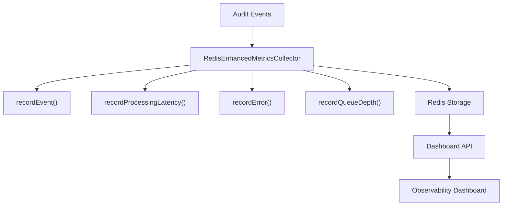

**Diagram sources**
- [metrics-collector.ts](file://packages\audit\src\observability\metrics-collector.ts#L1-L602)

### Trace Repositories
Distributed tracing data is collected through the observability system, which captures trace context, spans, and span logs. The `Span` interface defines the structure for trace data, including operation names, timestamps, duration, tags, and logs.

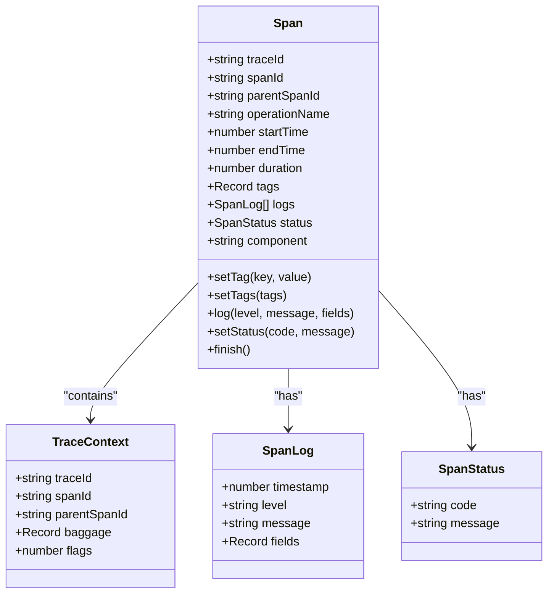

**Diagram sources**
- [types.ts](file://packages\audit\src\observability\types.ts#L1-L304)

### Health Check Endpoints
Health status is monitored through a comprehensive health check service that evaluates the status of various system components. The `HealthCheckService` class manages multiple health check implementations for database, Redis, queue, processing, and circuit breaker components.

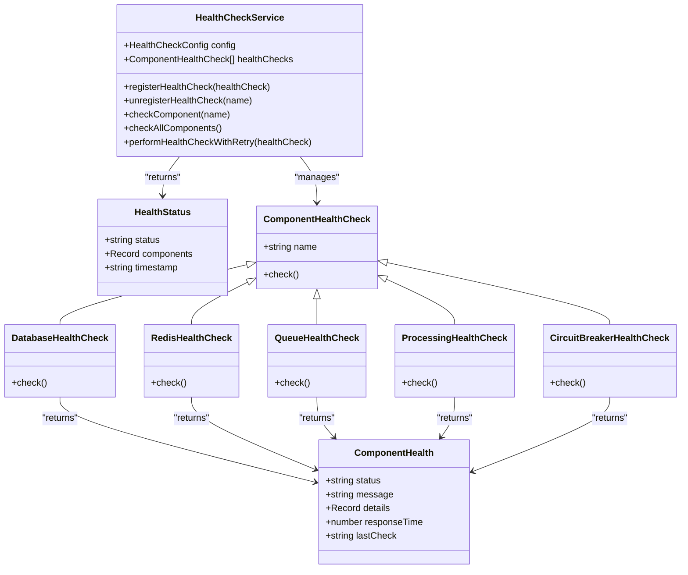

**Diagram sources**
- [health-check.ts](file://packages\audit\src\monitor\health-check.ts#L1-L491)

## Metrics Collection and Aggregation
The dashboard aggregates metrics through a multi-layered collection system that captures both basic and enhanced metrics from various system components.

### Basic Metrics Collection
The `RedisEnhancedMetricsCollector` class implements the `EnhancedMetricsCollector` interface to collect fundamental metrics such as events processed, processing latency, queue depth, and error rates. These metrics are stored in Redis with a configurable retention period.

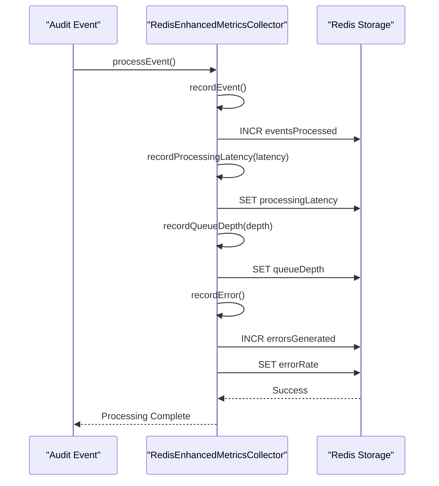

**Diagram sources**
- [metrics-collector.ts](file://packages\audit\src\observability\metrics-collector.ts#L1-L602)

### Enhanced Metrics Collection
The `RedisEnhancedMetricsCollector` class extends basic metrics collection with additional capabilities for performance metrics, system metrics, operation metrics, and time series data. This collector integrates with the monitoring service to provide comprehensive observability data.

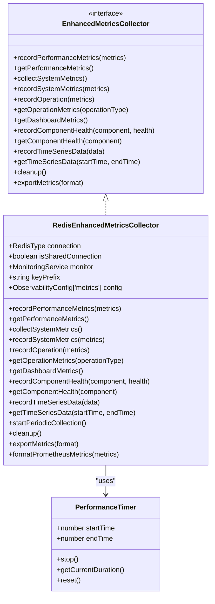

**Diagram sources**
- [metrics-collector.ts](file://packages\audit\src\observability\metrics-collector.ts#L1-L602)

## Health Status Monitoring
The health monitoring system provides real-time status information for all critical components of the audit system. The `HealthCheckService` coordinates multiple health check implementations to provide a comprehensive view of system health.

### Health Check Configuration
The system uses configurable thresholds to determine warning and critical status levels for various metrics including response time, error rate, and queue depth.

```json
{
  "timeout": 5000,
  "retryAttempts": 3,
  "retryDelay": 1000,
  "warningThresholds": {
    "responseTime": 2000,
    "errorRate": 0.05,
    "queueDepth": 100
  },
  "criticalThresholds": {
    "responseTime": 5000,
    "errorRate": 0.1,
    "queueDepth": 500
  }
}
```

**Section sources**
- [health-check.ts](file://packages\audit\src\monitor\health-check.ts#L1-L491)

### Component Health Checks
Each component health check follows a standardized pattern of measuring response time, evaluating against thresholds, and returning detailed status information.

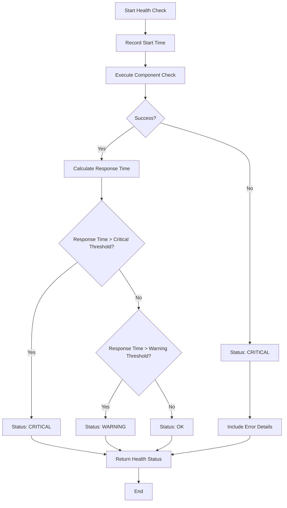

**Diagram sources**
- [health-check.ts](file://packages\audit\src\monitor\health-check.ts#L1-L491)

## Dashboard Metrics Aggregation
The dashboard metrics aggregation system combines data from multiple sources to provide a unified view of system performance and health.

### Dashboard Metrics Structure
The `DashboardMetrics` interface defines the structure of aggregated metrics returned to the dashboard UI.

```typescript
interface DashboardMetrics {
  // Overview metrics
  totalEvents: number
  eventsPerSecond: number
  averageProcessingTime: number
  errorRate: number

  // Performance metrics
  throughput: number
  latency: PerformanceMetrics
  bottlenecks: BottleneckAnalysis[]

  // System health
  systemMetrics: SystemMetrics
  componentHealth: Record<string, ComponentHealthMetrics>

  // Alerts and patterns
  activeAlerts: number
  suspiciousPatterns: number

  // Time series data
  timeSeriesData: TimeSeriesMetrics[]

  timestamp: string
}
```

**Section sources**
- [types.ts](file://packages\audit\src\observability\types.ts#L1-L304)

### Metrics Aggregation Process
The `getDashboardMetrics()` method in `RedisEnhancedMetricsCollector` orchestrates the collection of metrics from various sources and aggregates them into the dashboard format.

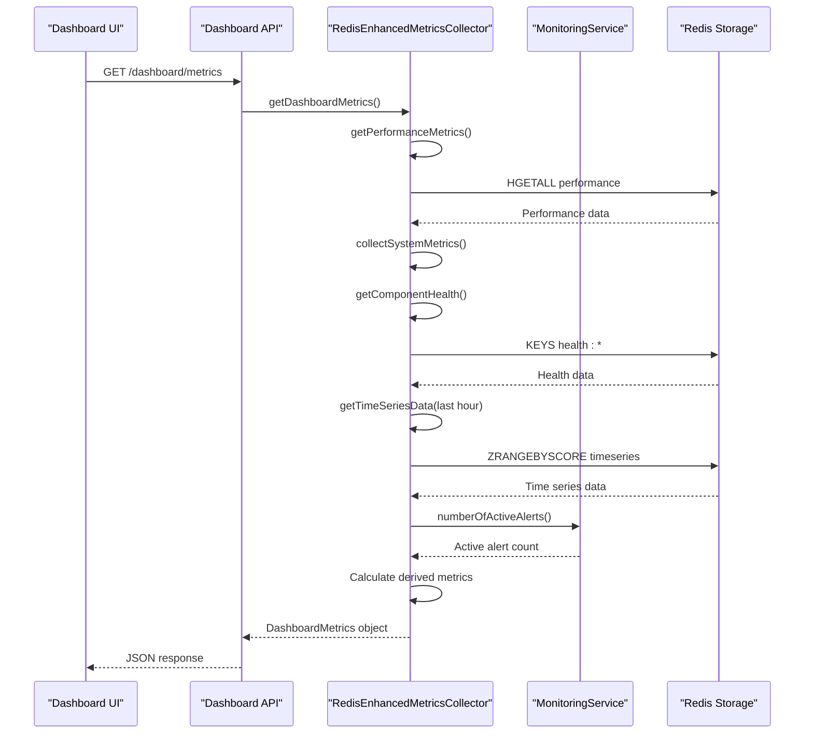

**Diagram sources**
- [metrics-collector.ts](file://packages\audit\src\observability\metrics-collector.ts#L1-L602)

## Visualization Components
The dashboard provides several visualization components to display system performance, error trends, and service dependencies.

### Performance Over Time
The time series data is visualized as line charts showing key metrics over configurable time periods. The `TimeSeriesMetrics` interface defines the data structure for these visualizations.

```typescript
interface TimeSeriesMetrics {
  timestamp: string
  eventsProcessed: number
  processingLatency: number
  errorRate: number
  queueDepth: number
  cpuUsage: number
  memoryUsage: number
}
```

**Section sources**
- [types.ts](file://packages\audit\src\observability\types.ts#L1-L304)

### Error Trends
Error rates are displayed as percentage trends with thresholds indicating warning and critical levels. The system calculates error rate based on the ratio of failed operations to total operations.

### Service Dependencies
The dashboard visualizes service dependencies through a component health matrix that shows the status of all system components and their interdependencies.

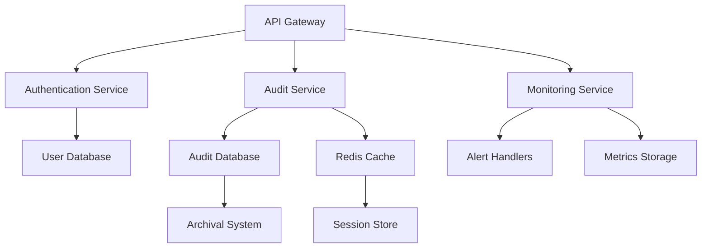

**Diagram sources**
- [health-check.ts](file://packages\audit\src\monitor\health-check.ts#L1-L491)

## User Customization and Interaction
The dashboard supports user customization through configurable views, comparison periods, and drill-down capabilities.

### View Customization
Users can customize dashboard views by selecting specific components, metrics, and time ranges. The system stores user preferences for personalized dashboards.

### Comparison Periods
The dashboard allows users to set comparison periods (e.g., week-over-week, month-over-month) to identify trends and anomalies in system performance.

### Incident Drill-down
Users can drill down into specific incidents by clicking on alerts or anomalous data points. This reveals detailed information about the incident, including related events, traces, and system state.

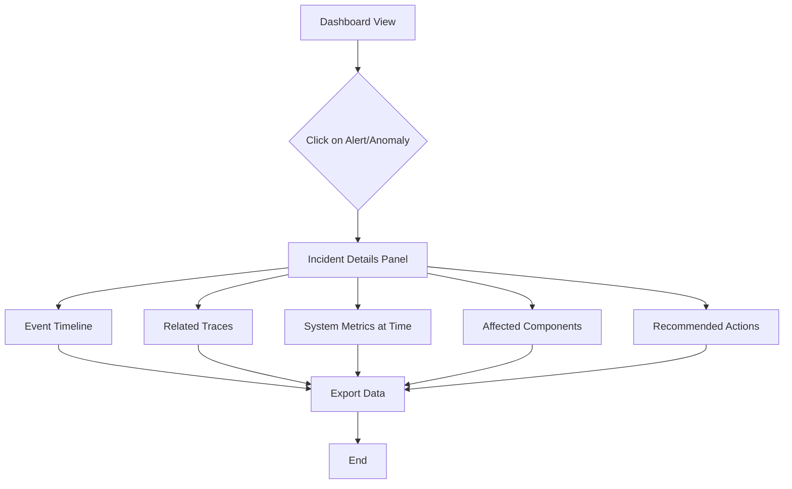

**Section sources**
- [monitoring.ts](file://packages\audit\src\monitor\monitoring.ts#L1-L1399)

## Performance and Caching
The dashboard implements several performance optimizations to ensure responsiveness when rendering large datasets.

### Data Caching
The system uses Redis to cache frequently accessed metrics and aggregated data. The `RedisEnhancedMetricsCollector` automatically expires cached data based on the configured retention period.

```typescript
// Cache metrics with retention period
await this.connection.expire(key, this.config.retentionPeriod)
```

**Section sources**
- [metrics-collector.ts](file://packages\audit\src\observability\metrics-collector.ts#L1-L602)

### Time Series Data Optimization
Time series data is stored in Redis using sorted sets (ZSET) with timestamps as scores. This allows efficient range queries and automatic cleanup of expired data.

```typescript
// Store time series data with timestamp score
await this.connection.zadd(key, score, JSON.stringify(data))

// Remove expired data
await this.connection.zremrangebyscore(key, 0, cutoffTime)
```

**Section sources**
- [metrics-collector.ts](file://packages\audit\src\observability\metrics-collector.ts#L1-L602)

### Periodic Data Collection
The system performs periodic collection of system metrics to reduce the overhead of on-demand calculations.

```typescript
private startPeriodicCollection(): void {
  setInterval(async () => {
    try {
      const systemMetrics = await this.collectSystemMetrics()
      await this.recordSystemMetrics(systemMetrics)
      const auditMetrics = await this.monitor.getMetrics()

      // Record time series data
      const timeSeriesData: TimeSeriesMetrics = {
        timestamp: systemMetrics.timestamp,
        eventsProcessed: auditMetrics.eventsProcessed,
        processingLatency: auditMetrics.processingLatency,
        errorRate: auditMetrics.errorRate,
        queueDepth: auditMetrics.queueDepth,
        cpuUsage: systemMetrics.cpu.usage,
        memoryUsage: (systemMetrics.memory.used / systemMetrics.memory.total) * 100,
      }

      await this.recordTimeSeriesData(timeSeriesData)
    } catch (error) {
      console.error('Failed to collect periodic metrics:', error)
    }
  }, this.config.collectionInterval)
}
```

**Section sources**
- [metrics-collector.ts](file://packages\audit\src\observability\metrics-collector.ts#L1-L602)

## Testing and Validation
The dashboard's data aggregation logic and display formatting are validated through comprehensive unit tests.

### Dashboard Test Example
The `dashboard.test.ts` file contains tests that validate the dashboard metrics aggregation logic.

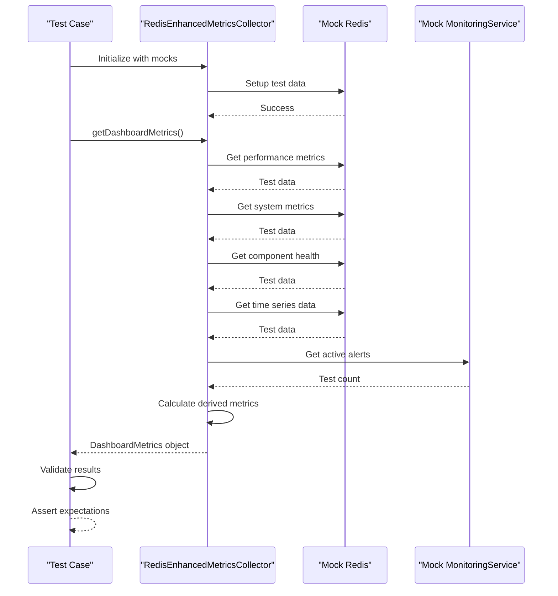

**Diagram sources**
- [dashboard.test.ts](file://packages\audit\src\observability\__tests__\dashboard.test.ts#L1-L453)

### Test Coverage
The tests validate various aspects of the dashboard functionality:

- **Data Aggregation**: Tests verify that metrics from different sources are correctly combined
- **Derived Metrics**: Tests ensure that calculated metrics (e.g., error rate, events per second) are accurate
- **Time Series Handling**: Tests validate that time series data is properly retrieved and formatted
- **Component Health**: Tests confirm that component health status is correctly aggregated
- **Error Conditions**: Tests verify proper handling of missing or invalid data

**Section sources**
- [dashboard.test.ts](file://packages\audit\src\observability\__tests__\dashboard.test.ts#L1-L453)

## Architecture Overview
The Observability Dashboard architecture consists of multiple interconnected components that work together to provide comprehensive system monitoring.

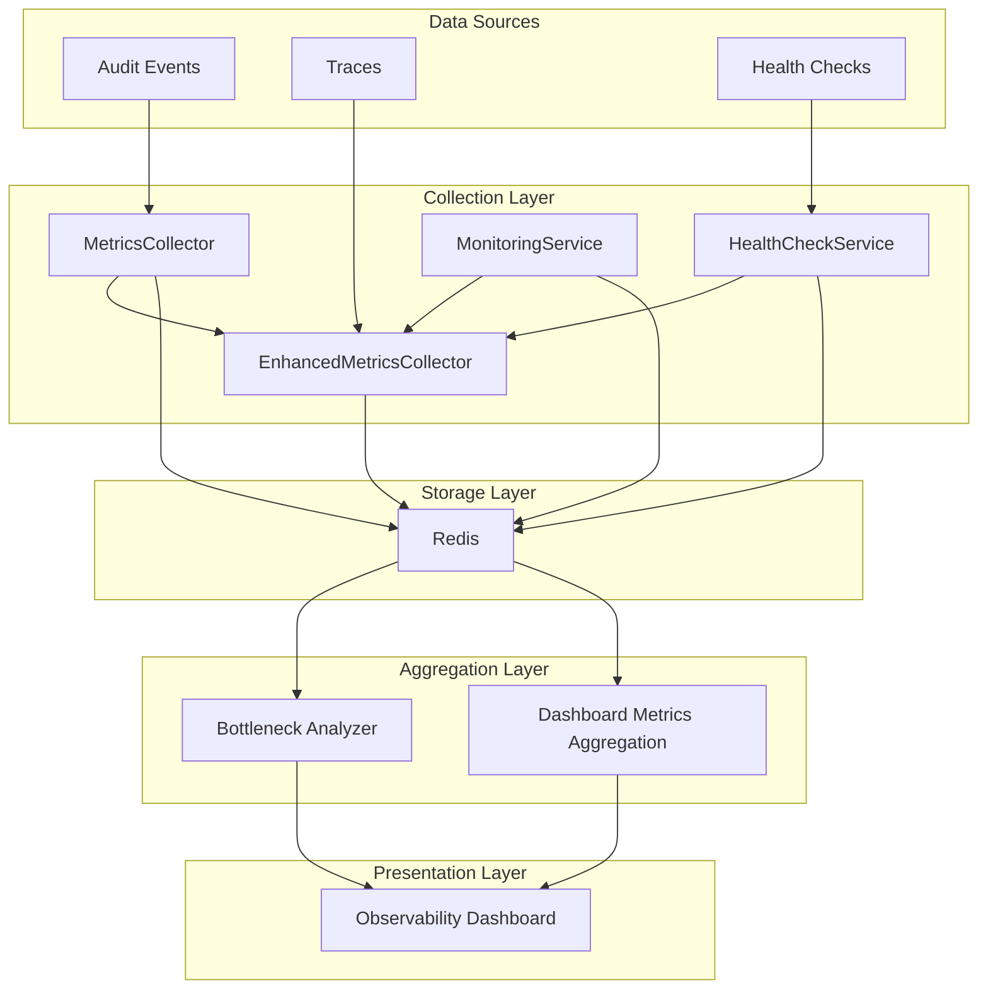

**Diagram sources**
- [metrics-collector.ts](file://packages\audit\src\observability\metrics-collector.ts#L1-L602)
- [bottleneck-analyzer.ts](file://packages\audit\src\observability\bottleneck-analyzer.ts#L1-L611)
- [health-check.ts](file://packages\audit\src\monitor\health-check.ts#L1-L491)
- [monitoring.ts](file://packages\audit\src\monitor\monitoring.ts#L1-L1399)

The architecture follows a layered approach with clear separation of concerns. Data sources generate raw telemetry data which is collected by specialized collectors. The collected data is stored in Redis for persistence and fast access. The aggregation layer combines data from multiple sources to create the dashboard metrics. Finally, the presentation layer displays the aggregated data in a user-friendly interface.

This design enables the dashboard to provide real-time insights while maintaining good performance through caching and periodic data collection. The modular architecture allows for easy extension with additional data sources and visualization components.

## Bottleneck Analysis and Performance Profiling
The Observability Dashboard has been enhanced with a bottleneck analyzer and performance profiling system to identify performance issues and optimize system performance.

### Bottleneck Analyzer Integration
The dashboard now integrates with the `AuditBottleneckAnalyzer` to identify performance bottlenecks in the audit system. The analyzer examines operation metrics to detect components with high latency, error rates, or resource usage.

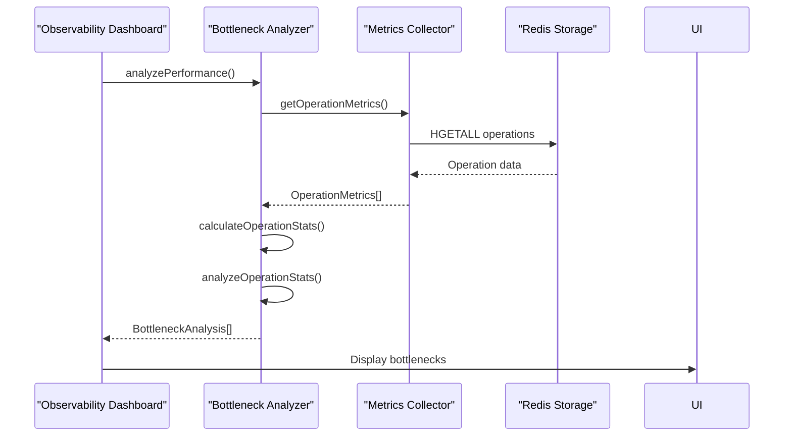

**Diagram sources**
- [bottleneck-analyzer.ts](file://packages\audit\src\observability\bottleneck-analyzer.ts#L1-L611)
- [dashboard.ts](file://packages\audit\src\observability\dashboard.ts#L1-L600)

### Performance Profiling
The system provides detailed performance profiling capabilities through the `profileOperation` method, which captures execution time, call stack, and resource usage during operation execution.

```typescript
// Example profiling flow in bottleneck-analyzer.ts
async profileOperation<T>(operationName: string, operation: () => Promise<T>): Promise<T> {
  const sessionId = generateSessionId()
  const startTime = performance.now()
  
  // Start resource monitoring
  const resourceSnapshot = takeResourceSnapshot()
  
  try {
    // Execute the operation
    const result = await operation()
    
    // Calculate duration and generate profiling result
    const duration = performance.now() - startTime
    const profilingResult = generateProfilingResult(sessionId, duration, resourceSnapshot)
    
    // Store result for analysis
    this.profilingResults.push(profilingResult)
    
    return result
  } catch (error) {
    // Handle errors and still capture profiling data
    const duration = performance.now() - startTime
    const profilingResult = generateProfilingResult(sessionId, duration, resourceSnapshot)
    profilingResult.breakdown['error'] = { /* error details */ }
    this.profilingResults.push(profilingResult)
    
    throw error
  }
}
```

**Section sources**
- [bottleneck-analyzer.ts](file://packages\audit\src\observability\bottleneck-analyzer.ts#L1-L611)

### Bottleneck Detection
The bottleneck analyzer uses multiple criteria to identify performance issues, including average processing time, error rate, and percentile thresholds.

```json
{
  "thresholds": {
    "eventProcessing": {
      "warning": 100,
      "critical": 500
    },
    "eventValidation": {
      "warning": 50,
      "critical": 200
    },
    "eventHashing": {
      "warning": 10,
      "critical": 50
    },
    "eventStorage": {
      "warning": 200,
      "critical": 1000
    }
  }
}
```

**Section sources**
- [bottleneck-analyzer.ts](file://packages\audit\src\observability\bottleneck-analyzer.ts#L1-L611)

### Recommendations Engine
The bottleneck analyzer generates actionable recommendations based on the type and severity of identified bottlenecks.

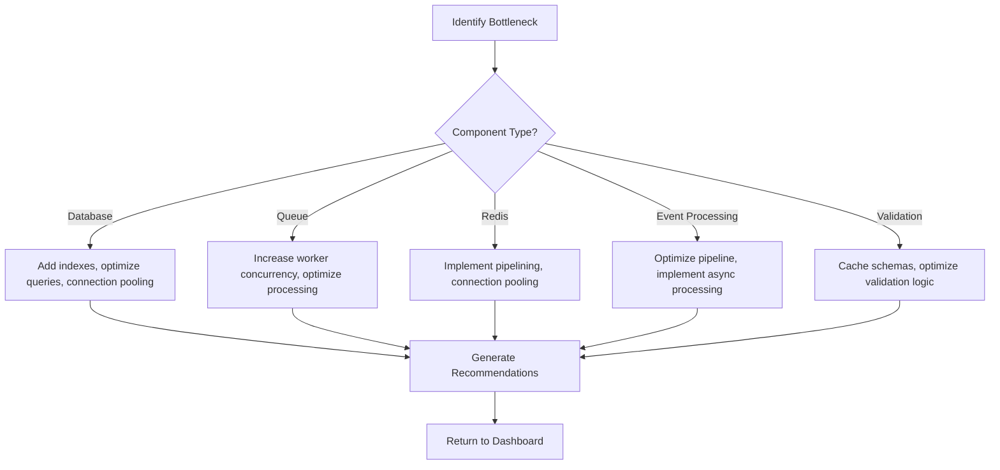

**Diagram sources**
- [bottleneck-analyzer.ts](file://packages\audit\src\observability\bottleneck-analyzer.ts#L1-L611)

### Security Considerations
The bottleneck analysis system follows security best practices:

- **Data Protection**: All profiling data is stored in Redis with appropriate access controls
- **Resource Limits**: Profiling sessions are limited in duration and frequency to prevent resource exhaustion
- **Access Control**: Only authorized components can initiate performance profiling
- **Audit Logging**: All profiling operations are logged for security auditing

```json
{
  "profiling": {
    "enabled": true,
    "sampleRate": 0.1,
    "maxProfiles": 100,
    "profileDuration": 30000
  }
}
```

**Section sources**
- [bottleneck-analyzer.ts](file://packages\audit\src\observability\bottleneck-analyzer.ts#L1-L611)
- [types.ts](file://packages\audit\src\observability\types.ts#L1-L304)

The integration of the bottleneck analyzer ensures that performance issues are proactively identified and addressed, maintaining optimal system performance while providing actionable insights for optimization.