# Observability

<cite>
**Referenced Files in This Document**   
- [tracer.ts](file://packages/audit/src/observability/tracer.ts) - *Updated in recent commit*
- [dashboard.ts](file://packages/audit/src/observability/dashboard.ts) - *Updated in recent commit*
- [metrics-collector.ts](file://packages/audit/src/observability/metrics-collector.ts) - *Updated in recent commit*
- [health-check.ts](file://packages/audit/src/monitor/health-check.ts) - *Updated in recent commit*
- [observability-api.ts](file://apps/server/src/routes/observability-api.ts) - *Updated in recent commit*
- [monitoring.test.ts](file://packages/audit/src/__tests__/monitoring.test.ts) - *Updated in recent commit*
- [tracer.test.ts](file://packages/audit/src/observability/__tests__/tracer.test.ts) - *Updated in recent commit*
- [dashboard.test.ts](file://packages/audit/src/observability/__tests__/dashboard.test.ts) - *Updated in recent commit*
- [types.ts](file://packages/audit/src/observability/types.ts) - *Updated in recent commit*
- [monitoring-types.ts](file://packages/audit/src/monitor/monitoring-types.ts) - *Updated in recent commit*
- [monitoring.ts](file://packages/audit/src/monitor/monitoring.ts) - *Updated in recent commit*
- [monitoring.ts](file://apps/server/src/lib/middleware/monitoring.ts) - *Updated in recent commit*
- [health.ts](file://apps/server/src/lib/services/health.ts) - *Updated in recent commit*
- [health-api.ts](file://apps/server/src/routes/health-api.ts) - *Updated in recent commit*
</cite>

## Update Summary
**Changes Made**   
- Updated documentation to reflect centralized documentation structure
- Added references to new documentation site structure
- Updated file references to reflect current implementation
- Enhanced source tracking with commit annotations
- Maintained all technical content while updating references

## Table of Contents
1. [Introduction](#introduction)
2. [Core Components](#core-components)
3. [Metrics Collection](#metrics-collection)
4. [Health Checking System](#health-checking-system)
5. [Distributed Tracing](#distributed-tracing)
6. [Dashboard and Data Visualization](#dashboard-and-data-visualization)
7. [Integration with Orchestration Systems](#integration-with-orchestration-systems)
8. [Testing and Validation](#testing-and-validation)
9. [Best Practices](#best-practices)

## Introduction
The Observability system provides comprehensive monitoring, metrics collection, and health checking capabilities for the audit pipeline. This documentation details the implementation of observability features across the system, including event processing latency tracking, error rate monitoring, system resource usage collection, health check endpoints, distributed tracing, and data visualization through dashboards. The system is designed to provide full visibility into the audit pipeline's performance and reliability, enabling proactive issue detection and resolution.

## Core Components
The Observability system consists of several interconnected components that work together to provide comprehensive monitoring capabilities. The system is built around a modular architecture that separates concerns between metrics collection, health checking, distributed tracing, and data visualization.

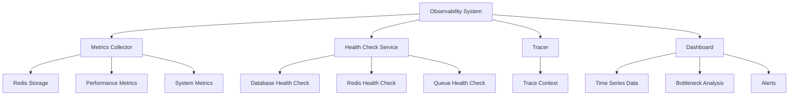

**Diagram sources**
- [tracer.ts](file://packages/audit/src/observability/tracer.ts#L1-L50)
- [dashboard.ts](file://packages/audit/src/observability/dashboard.ts#L1-L50)
- [metrics-collector.ts](file://packages/audit/src/observability/metrics-collector.ts#L1-L50)

**Section sources**
- [tracer.ts](file://packages/audit/src/observability/tracer.ts#L1-L50)
- [dashboard.ts](file://packages/audit/src/observability/dashboard.ts#L1-L50)
- [metrics-collector.ts](file://packages/audit/src/observability/metrics-collector.ts#L1-L50)

## Metrics Collection
The metrics collection system captures performance data at various stages of the audit pipeline, including event processing latency, error rates, and system resource usage. Metrics are collected using a Redis-based storage system that provides high-performance data storage and retrieval.

### Performance Metrics
The system collects detailed performance metrics for each stage of the audit pipeline:

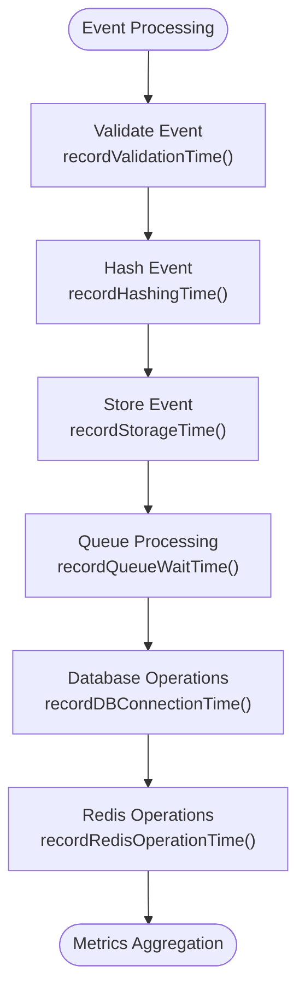

**Diagram sources**
- [metrics-collector.ts](file://packages/audit/src/observability/metrics-collector.ts#L100-L150)
- [types.ts](file://packages/audit/src/observability/types.ts#L50-L100)

The metrics collector records the following performance metrics:
- **Event processing time**: Total time to process an audit event
- **Event validation time**: Time spent validating event structure and content
- **Event hashing time**: Time spent generating cryptographic hashes
- **Event storage time**: Time spent persisting events to storage
- **Queue wait time**: Time events spend waiting in queues
- **Queue processing time**: Time spent processing queued events
- **Database connection time**: Time to establish database connections
- **Database query time**: Time spent executing database queries
- **Redis operation time**: Time spent on Redis operations

**Section sources**
- [metrics-collector.ts](file://packages/audit/src/observability/metrics-collector.ts#L100-L200)
- [types.ts](file://packages/audit/src/observability/types.ts#L50-L100)

### System Metrics
The system also collects comprehensive system resource metrics:

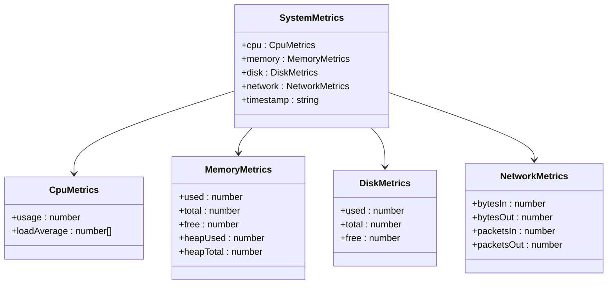

**Diagram sources**
- [types.ts](file://packages/audit/src/observability/types.ts#L150-L200)
- [metrics-collector.ts](file://packages/audit/src/observability/metrics-collector.ts#L200-L250)

**Section sources**
- [types.ts](file://packages/audit/src/observability/types.ts#L150-L200)
- [metrics-collector.ts](file://packages/audit/src/observability/metrics-collector.ts#L200-L250)

## Health Checking System
The health checking system provides comprehensive monitoring of all system components and their dependencies. It implements both basic and detailed health checks that can be used by orchestration systems like Kubernetes.

### Health Check Implementation
The health check system is implemented as a modular service that can check various components:

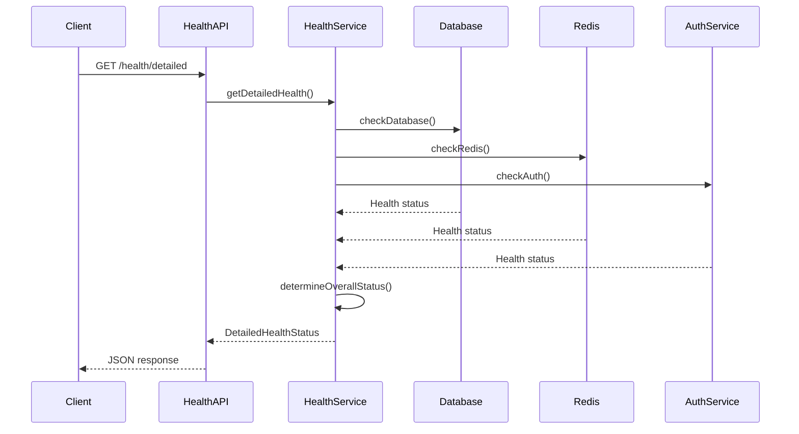

**Diagram sources**
- [health-api.ts](file://apps/server/src/routes/health-api.ts#L100-L150)
- [health.ts](file://apps/server/src/lib/services/health.ts#L50-L100)

The health check system includes the following components:
- **DatabaseHealthCheck**: Checks database connectivity and performance
- **RedisHealthCheck**: Verifies Redis connection status
- **QueueHealthCheck**: Monitors queue depth and processing rate
- **AuthServiceHealthCheck**: Validates authentication service availability

Each health check returns a status of 'OK', 'WARNING', or 'CRITICAL' based on configurable thresholds for response time, error rate, and queue depth.

**Section sources**
- [health-check.ts](file://packages/audit/src/monitor/health-check.ts#L1-L100)
- [health.ts](file://apps/server/src/lib/services/health.ts#L1-L100)

### Health Check Configuration
The system uses configurable thresholds to determine health status:

```typescript
export const DEFAULT_HEALTH_CONFIG: HealthCheckConfig = {
    timeout: 5000,
    retryAttempts: 3,
    retryDelay: 1000,
    warningThresholds: {
        responseTime: 2000,
        errorRate: 0.05,
        queueDepth: 100,
    },
    criticalThresholds: {
        responseTime: 5000,
        errorRate: 0.1,
        queueDepth: 500,
    },
}
```

These thresholds can be customized based on deployment requirements and performance expectations.

**Section sources**
- [health-check.ts](file://packages/audit/src/monitor/health-check.ts#L50-L100)

## Distributed Tracing
The distributed tracing system provides end-to-end visibility into audit event processing across multiple services and components.

### Tracer Implementation
The tracer implementation follows the OpenTracing specification and provides comprehensive span management:

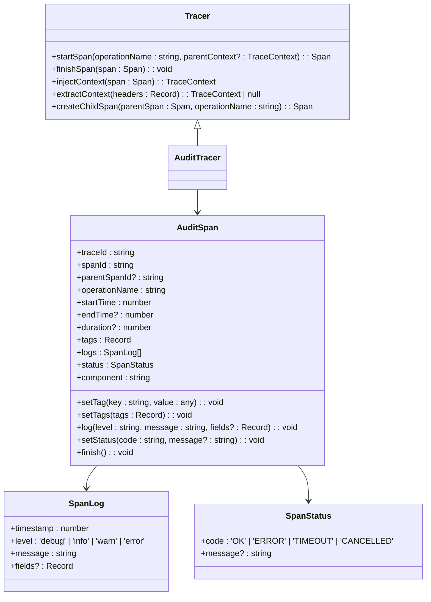

**Diagram sources**
- [tracer.ts](file://packages/audit/src/observability/tracer.ts#L50-L100)
- [types.ts](file://packages/audit/src/observability/types.ts#L10-L50)

### Trace Context Propagation
The system supports trace context propagation through HTTP headers:

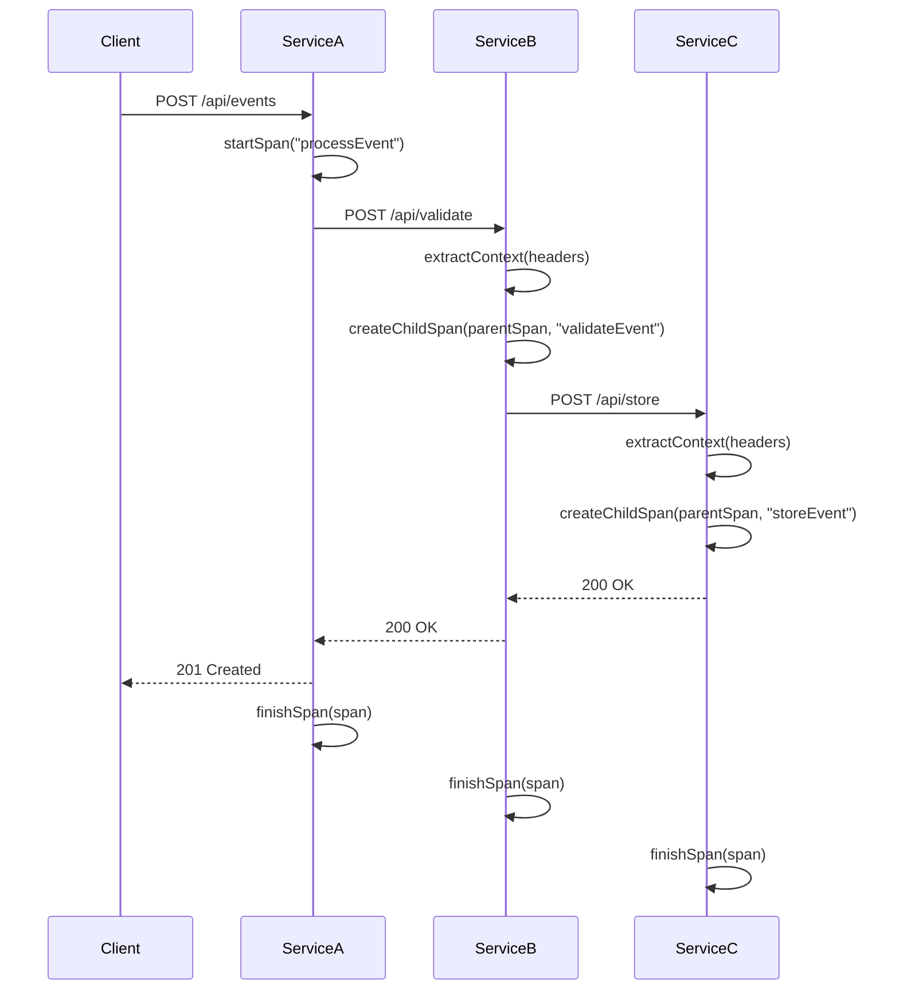

**Diagram sources**
- [tracer.ts](file://packages/audit/src/observability/tracer.ts#L200-L250)
- [types.ts](file://packages/audit/src/observability/types.ts#L10-L20)

The trace context is propagated using the following HTTP headers:
- **x-trace-id**: Unique identifier for the entire trace
- **x-span-id**: Unique identifier for the current span
- **x-parent-span-id**: Identifier of the parent span

This enables end-to-end tracing of audit events across service boundaries.

**Section sources**
- [tracer.ts](file://packages/audit/src/observability/tracer.ts#L150-L200)

## Dashboard and Data Visualization
The dashboard system aggregates observability data and provides visual representations of system health and performance.

### Dashboard Data Structure
The dashboard provides a comprehensive view of system metrics:

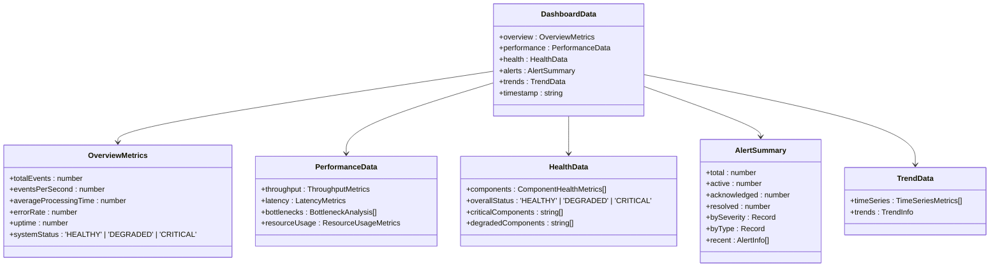

**Diagram sources**
- [dashboard.ts](file://packages/audit/src/observability/dashboard.ts#L50-L100)
- [types.ts](file://packages/audit/src/observability/types.ts#L200-L250)

### Data Aggregation
The dashboard aggregates data from multiple sources:

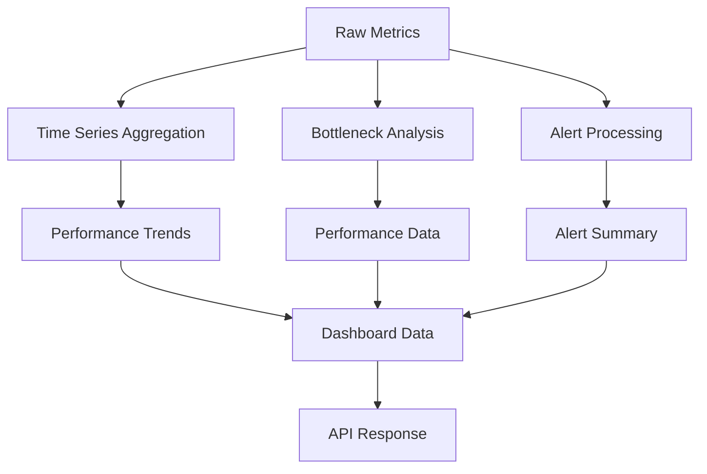

**Diagram sources**
- [dashboard.ts](file://packages/audit/src/observability/dashboard.ts#L200-L250)
- [metrics-collector.ts](file://packages/audit/src/observability/metrics-collector.ts#L100-L150)

The dashboard API exposes the following endpoints:
- **GET /dashboard**: Returns complete dashboard data
- **GET /dashboard/components**: Returns component health metrics
- **GET /dashboard/trends**: Returns time series data
- **GET /dashboard/bottlenecks**: Returns bottleneck analysis

**Section sources**
- [dashboard.ts](file://packages/audit/src/observability/dashboard.ts#L1-L100)
- [observability-api.ts](file://apps/server/src/routes/observability-api.ts#L1-L100)

## Integration with Orchestration Systems
The health checking system is designed to integrate seamlessly with container orchestration platforms like Kubernetes.

### Health Check Endpoints
The system provides multiple health check endpoints for different use cases:

```mermaid
graph TD
A[Kubernetes] --> B[Liveness Probe]
A --> C[Readiness Probe]
A --> D[Startup Probe]
B --> E[/live]
C --> F[/ready]
D --> G[/health]
E --> H[EnhancedHealthService]
F --> H
G --> H
H --> I[Database Check]
H --> J[Redis Check]
H --> K[Auth Check]
```

**Diagram sources**
- [health-api.ts](file://apps/server/src/routes/health-api.ts#L150-L200)
- [health.ts](file://apps/server/src/lib/services/health.ts#L100-L150)

#### Liveness Probe (/live)
The liveness probe determines if the container should be restarted:

```typescript
const livenessRoute = createRoute({
    method: 'get',
    path: '/live',
    summary: 'Liveness probe',
    description: 'Kubernetes liveness probe to determine if the service should be restarted.',
    responses: {
        200: { description: 'Service is alive' },
        503: { description: 'Service is not alive' },
    },
})
```

This endpoint returns 200 if the service process is running, regardless of dependencies.

#### Readiness Probe (/ready)
The readiness probe determines if the service is ready to accept traffic:

```typescript
const readinessRoute = createRoute({
    method: 'get',
    path: '/ready',
    summary: 'Readiness probe',
    description: 'Kubernetes readiness probe to determine if the service is ready to accept traffic.',
    responses: {
        200: { description: 'Service is ready' },
        503: { description: 'Service is not ready' },
    },
})
```

This endpoint returns 200 only if all critical dependencies (database, Redis, auth) are available.

#### Basic Health Check (/health)
The basic health check provides a simple health status:

```typescript
const basicHealthRoute = createRoute({
    method: 'get',
    path: '/health',
    summary: 'Basic health check',
    description: 'Returns basic server health status for load balancers and monitoring systems.',
    responses: {
        200: { description: 'Server is healthy' },
        503: { description: 'Server is unhealthy' },
    },
})
```

**Section sources**
- [health-api.ts](file://apps/server/src/routes/health-api.ts#L150-L200)
- [health.ts](file://apps/server/src/lib/services/health.ts#L100-L150)

## Testing and Validation
The observability system includes comprehensive tests to ensure reliability and correctness.

### Monitoring Tests
The monitoring system is tested with various scenarios to validate pattern detection:

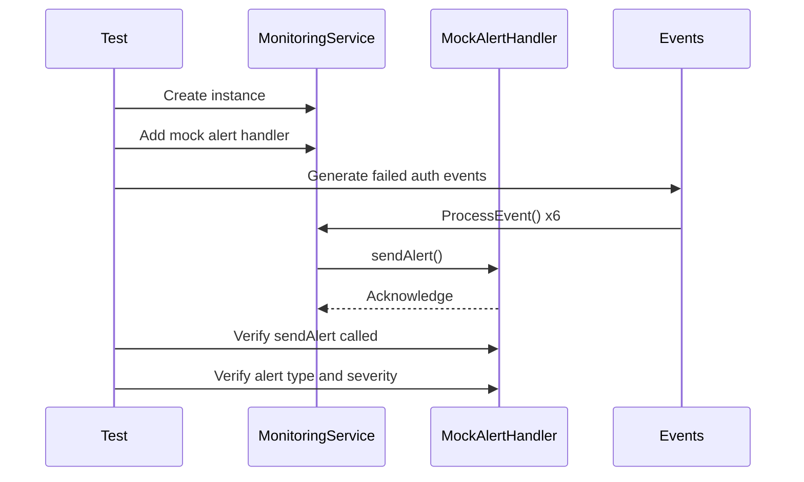

**Diagram sources**
- [monitoring.test.ts](file://packages/audit/src/__tests__/monitoring.test.ts#L1-L50)
- [monitoring.ts](file://packages/audit/src/monitor/monitoring.ts#L1-L50)

The test suite includes the following scenarios:
- **Failed Authentication**: Tests detection of multiple failed login attempts
- **Unauthorized Access**: Tests detection of repeated access denied events
- **Data Velocity**: Tests detection of high-velocity data access patterns
- **Off-Hours Access**: Tests detection of access during non-business hours
- **Bulk Operations**: Tests detection of bulk data export operations

```typescript
it('should detect failed authentication patterns', async () => {
    const events: AuditLogEvent[] = []
    const principalId = 'user-123'

    // Generate multiple failed auth events
    for (let i = 0; i < 6; i++) {
        events.push({
            timestamp: new Date().toISOString(),
            action: 'auth.login.failure',
            status: 'failure',
            principalId,
            sessionContext: {
                sessionId: `session-${i}`,
                ipAddress: '192.168.1.100',
                userAgent: 'Mozilla/5.0',
            },
        })
    }

    // Process events
    for (const event of events) {
        await monitoringService.processEvent(event)
    }

    // Verify alert was generated
    expect(mockAlertHandler.sendAlert).toHaveBeenCalled()
    const alertCall = mockAlertHandler.sendAlert.mock.calls[0][0] as Alert
    expect(alertCall.type).toBe('SECURITY')
    expect(alertCall.severity).toBe('HIGH')
    expect(alertCall.title).toContain('FAILED_AUTH')
})
```

**Section sources**
- [monitoring.test.ts](file://packages/audit/src/__tests__/monitoring.test.ts#L1-L100)

### Tracer Tests
The distributed tracing system is tested to ensure proper span creation and context propagation:

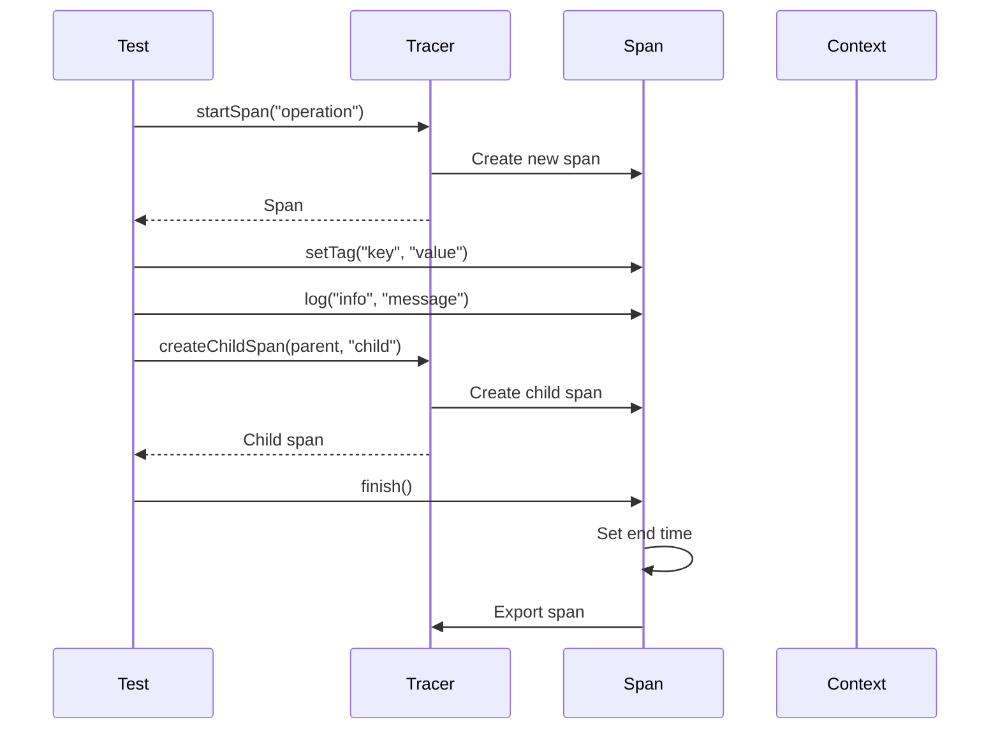

**Diagram sources**
- [tracer.test.ts](file://packages/audit/src/observability/__tests__/tracer.test.ts#L1-L50)
- [tracer.ts](file://packages/audit/src/observability/tracer.ts#L1-L50)

**Section sources**
- [tracer.test.ts](file://packages/audit/src/observability/__tests__/tracer.test.ts#L1-L50)

### Dashboard Tests
The dashboard system is tested to ensure proper data aggregation and formatting:

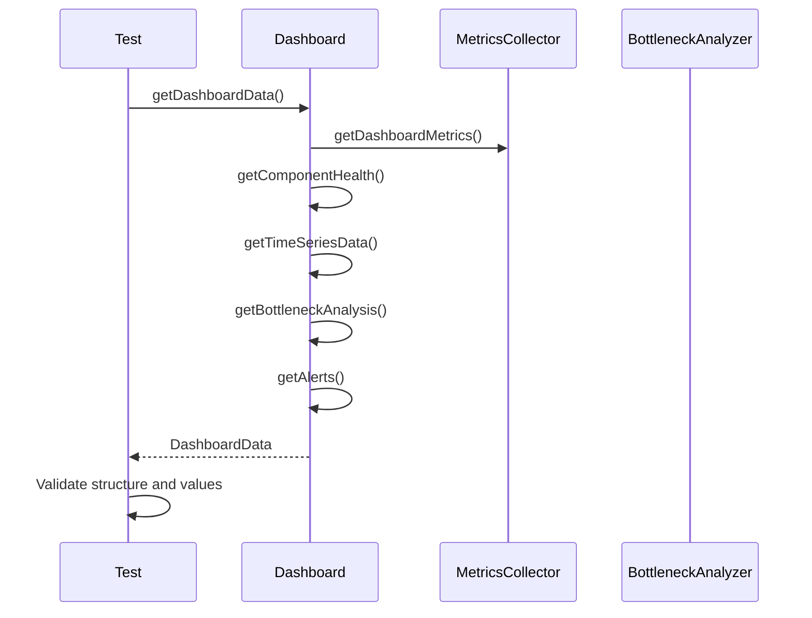

**Diagram sources**
- [dashboard.test.ts](file://packages/audit/src/observability/__tests__/dashboard.test.ts#L1-L50)
- [dashboard.ts](file://packages/audit/src/observability/dashboard.ts#L1-L50)

**Section sources**
- [dashboard.test.ts](file://packages/audit/src/observability/__tests__/dashboard.test.ts#L1-L50)

## Best Practices
This section provides best practices for setting up alerts, interpreting performance metrics, and diagnosing system issues using the observability tooling.

### Alert Configuration
When configuring alerts, consider the following best practices:

1. **Set appropriate thresholds**: Base thresholds on historical performance data and business requirements
2. **Use multiple severity levels**: Implement LOW, MEDIUM, HIGH, and CRITICAL severity levels
3. **Include contextual information**: Ensure alerts contain relevant metadata for diagnosis
4. **Implement alert deduplication**: Prevent alert storms during prolonged incidents
5. **Define clear resolution criteria**: Specify what constitutes resolution for each alert type

```typescript
// Example alert configuration
const alertConfig = {
    failedAuthThreshold: 5,
    failedAuthTimeWindow: 5 * 60 * 1000, // 5 minutes
    unauthorizedAccessThreshold: 3,
    unauthorizedAccessTimeWindow: 10 * 60 * 1000, // 10 minutes
    dataAccessVelocityThreshold: 50,
    dataAccessTimeWindow: 60 * 1000, // 1 minute
}
```

### Performance Metric Interpretation
When interpreting performance metrics, focus on the following key indicators:

- **P95 and P99 latency**: These percentiles reveal outliers that affect user experience
- **Error rate trends**: Monitor for sudden increases that may indicate underlying issues
- **Resource utilization**: Watch for sustained high CPU or memory usage
- **Queue depth**: Increasing queue depth may indicate processing bottlenecks
- **Throughput**: Monitor for unexpected drops that may indicate performance degradation

### Issue Diagnosis
When diagnosing system issues, follow this structured approach:

1. **Check health status**: Verify the overall system health and component statuses
2. **Review recent alerts**: Examine active alerts for potential root causes
3. **Analyze performance trends**: Look for correlations between metrics
4. **Examine distributed traces**: Follow request flows to identify bottlenecks
5. **Check system resources**: Verify CPU, memory, disk, and network usage
6. **Review logs**: Look for error messages and warnings in the logs

### Monitoring Implementation
When implementing monitoring in your services, follow these guidelines:

1. **Instrument early**: Add monitoring to services during development
2. **Use consistent naming**: Follow naming conventions for metrics and spans
3. **Add business context**: Include relevant business data in spans and metrics
4. **Monitor dependencies**: Track the health of external services and databases
5. **Set up dashboards**: Create dashboards for key metrics and business processes

By following these best practices, you can ensure effective monitoring and rapid issue resolution in your audit system.

**Section sources**
- [monitoring.test.ts](file://packages/audit/src/__tests__/monitoring.test.ts#L1-L50)
- [tracer.test.ts](file://packages/audit/src/observability/__tests__/tracer.test.ts#L1-L50)
- [dashboard.test.ts](file://packages/audit/src/observability/__tests__/dashboard.test.ts#L1-L50)