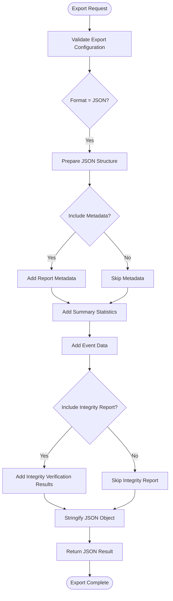
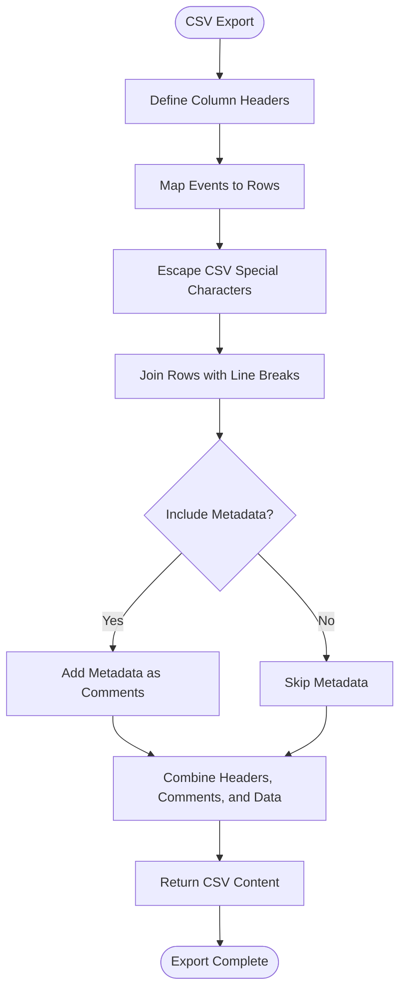
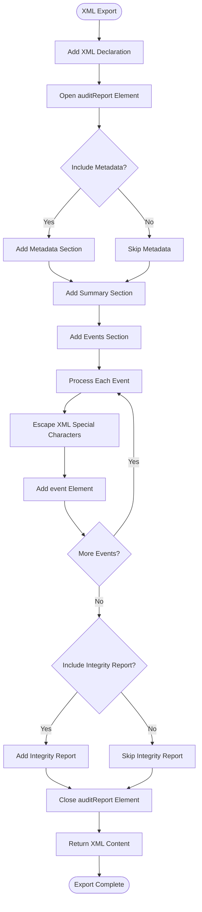
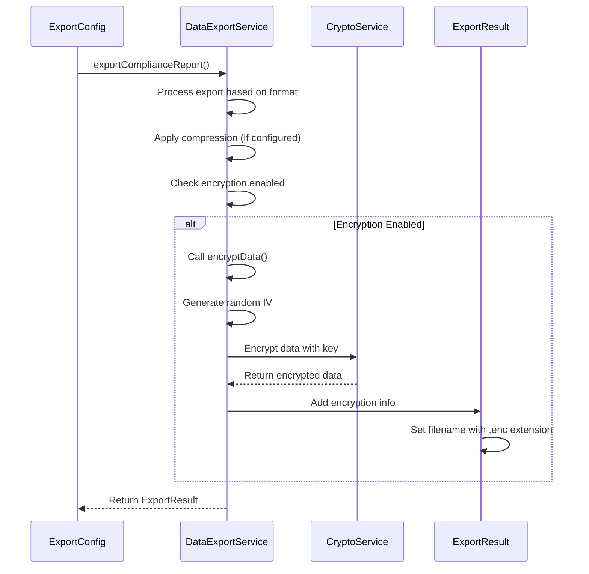
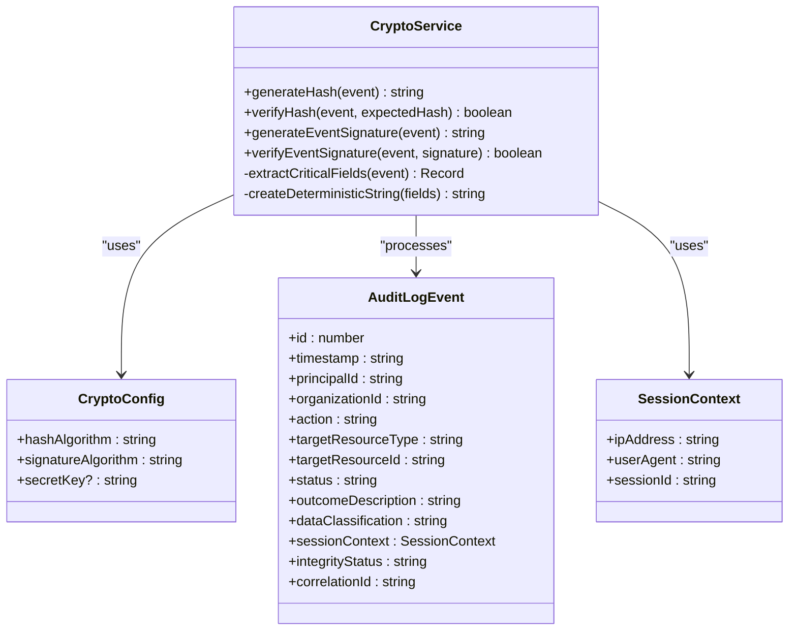
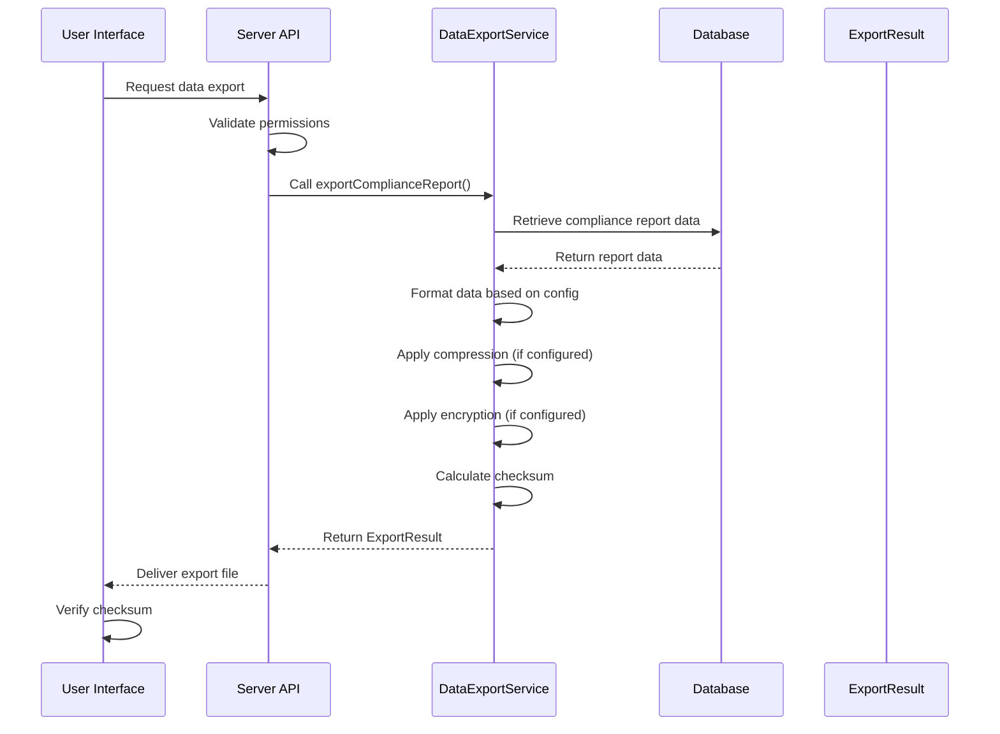
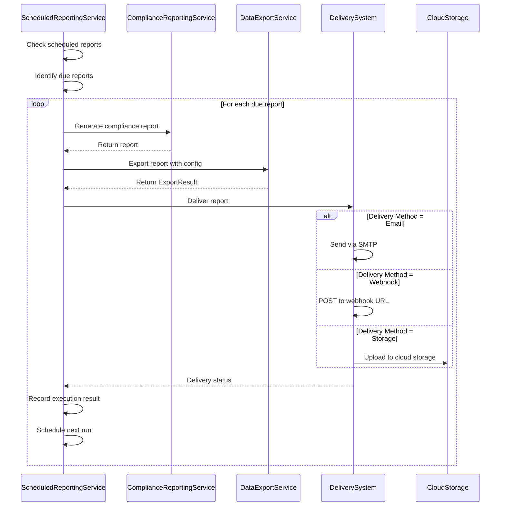
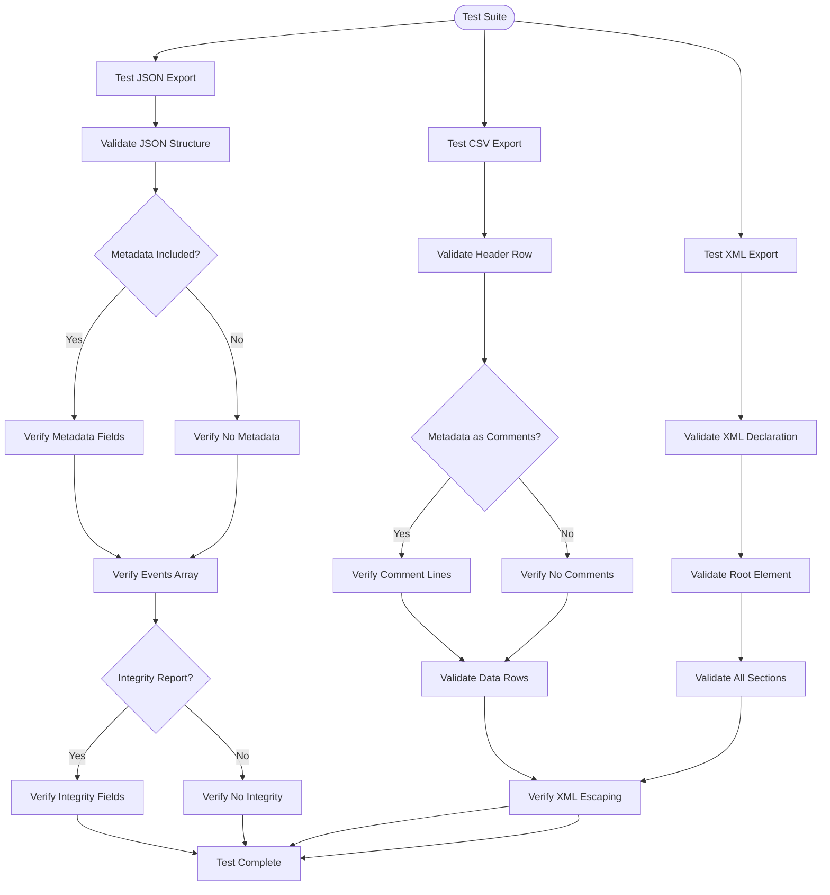
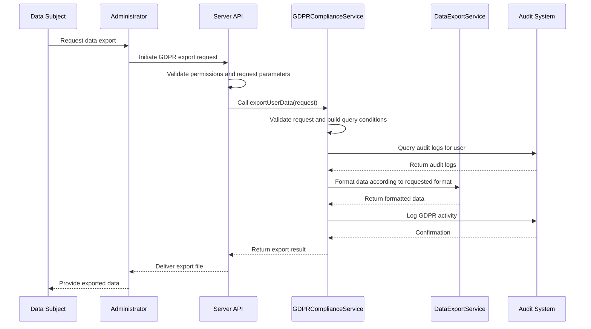

# Data Export Functionality

<cite>
**Referenced Files in This Document**   
- [data-export.ts](file://packages/audit/src/report/data-export.ts) - *Updated with GDPR compliance integration*
- [gdpr-compliance.ts](file://packages/audit/src/gdpr/gdpr-compliance.ts) - *Added GDPR data export functionality*
- [data-export.test.ts](file://packages/audit/src/__tests__/data-export.test.ts) - *Updated with GDPR export test cases*
- [compliance-reporting.ts](file://packages/audit/src/report/compliance-reporting.ts) - *Updated with GDPR report types*
- [crypto.ts](file://packages/audit/src/crypto.ts) - *Updated with encryption for GDPR exports*
</cite>

## Update Summary
**Changes Made**   
- Enhanced data export functionality to support GDPR data portability requirements
- Added detailed documentation for GDPR-specific export implementation
- Updated test cases to include GDPR export validation
- Integrated GDPR compliance service with data export functionality
- Added information about pseudonymization and encryption for GDPR exports

## Table of Contents
1. [Introduction](#introduction)
2. [Core Components](#core-components)
3. [Export Formats and Data Packaging](#export-formats-and-data-packaging)
4. [Encryption and Integrity Verification](#encryption-and-integrity-verification)
5. [Export Request Lifecycle](#export-request-lifecycle)
6. [Integration with Server API and Web Interface](#integration-with-server-api-and-web-interface)
7. [Test Cases and Validation](#test-cases-and-validation)
8. [Performance Considerations](#performance-considerations)
9. [Security and Compliance](#security-and-compliance)

## Introduction
The Data Export Functionality provides a comprehensive system for exporting audit and compliance data in multiple formats, supporting regulatory requirements such as GDPR data portability. The system is designed to handle various export formats, apply compression and encryption, and ensure data integrity through checksum verification. The implementation is centered around the `DataExportService` class, which orchestrates the export process from initiation to delivery.

**Section sources**
- [data-export.ts](file://packages/audit/src/report/data-export.ts#L0-L580)

## Core Components

The data export functionality is implemented primarily in the `DataExportService` class, which provides methods for exporting compliance reports and audit events in various formats. The service supports JSON, CSV, XML, and PDF formats, with options for compression and encryption.

The `ExportResult` interface defines the structure of the export output, including metadata such as export ID, timestamp, format, and integrity information. The service also provides statistics on the export process, including record counts and processing time.

```mermaid
classDiagram
class DataExportService {
+exportComplianceReport(report, config) ExportResult
+exportAuditEvents(events, config, metadata) ExportResult
-exportToJSON(report, config) {data, contentType, filename}
-exportToCSV(report, config) {data, contentType, filename}
-exportToXML(report, config) {data, contentType, filename}
-exportToPDF(report, config) {data, contentType, filename}
-compressData(data, algorithm) Buffer
-encryptData(data, config) {data, iv}
-calculateChecksum(data) string
-generateExportId() string
-escapeCsvValue(value) string
-escapeXml(value) string
}
class ExportResult {
+exportId : string
+format : ReportFormat
+exportedAt : string
+exportedBy? : string
+config : ExportConfig
+data : string | Buffer
+contentType : string
+filename : string
+size : number
+checksum : string
+compression? : CompressionInfo
+encryption? : EncryptionInfo
}
class ExportConfig {
+format : ReportFormat
+includeMetadata? : boolean
+includeIntegrityReport? : boolean
+compression? : 'none' | 'gzip' | 'zip'
+encryption? : EncryptionConfig
}
class CompressionInfo {
+algorithm : string
+originalSize : number
+compressedSize : number
+compressionRatio : number
}
class EncryptionInfo {
+algorithm : string
+keyId : string
+iv? : string
}
DataExportService --> ExportResult : "returns"
DataExportService --> ExportConfig : "uses"
DataExportService --> CompressionInfo : "creates"
DataExportService --> EncryptionInfo : "creates"
```

**Diagram sources**
- [data-export.ts](file://packages/audit/src/report/data-export.ts#L0-L580)

**Section sources**
- [data-export.ts](file://packages/audit/src/report/data-export.ts#L0-L580)

## Export Formats and Data Packaging

The Data Export Service supports four primary export formats: JSON, CSV, XML, and PDF. Each format is implemented as a private method within the `DataExportService` class, with specific formatting and structure requirements.

### JSON Export
The JSON export format provides structured data that is easily consumable by other systems. The export includes metadata, summary statistics, and detailed event data in a hierarchical structure. When metadata inclusion is enabled (default), the report metadata is included at the top level of the JSON structure.



**Diagram sources**
- [data-export.ts](file://packages/audit/src/report/data-export.ts#L200-L240)

### CSV Export
The CSV export format is designed for spreadsheet analysis and includes a header row with standardized column names. The implementation includes proper CSV escaping for values containing commas, quotes, or newlines. When metadata inclusion is enabled, the metadata is added as comment lines at the beginning of the file.



**Diagram sources**
- [data-export.ts](file://packages/audit/src/report/data-export.ts#L242-L330)

### XML Export
The XML export format provides a structured document that can be used for system integration. The implementation includes proper XML escaping for special characters and follows a hierarchical structure with metadata, summary, events, and optional integrity report sections.



**Diagram sources**
- [data-export.ts](file://packages/audit/src/report/data-export.ts#L332-L480)

### PDF Export
The PDF export format generates a formatted document suitable for formal reporting. The implementation uses an HTML template that is converted to PDF. The current implementation is a placeholder that will be replaced with a full PDF generation library in production.

**Section sources**
- [data-export.ts](file://packages/audit/src/report/data-export.ts#L482-L530)

## Encryption and Integrity Verification

The data export system provides robust security features including encryption and integrity verification. These features are implemented as part of the export process and can be configured through the `ExportConfig` interface.

### Encryption Implementation
The encryption functionality is implemented in the `encryptData` method of the `DataExportService` class. When encryption is enabled in the export configuration, the exported data is encrypted using the specified algorithm (defaulting to AES-256-GCM). The encryption process generates a random initialization vector (IV) for each export.



**Diagram sources**
- [data-export.ts](file://packages/audit/src/report/data-export.ts#L532-L550)

### Integrity Verification
Data integrity is ensured through checksum calculation using SHA-256 hashing. The `calculateChecksum` method generates a unique identifier for the exported data, allowing recipients to verify that the data has not been modified during transmission or storage.

The actual cryptographic implementation is provided by the `CryptoService` class, which uses Node.js's built-in crypto module to generate secure hashes. The service is configured with SHA-256 as the default hash algorithm and requires a secret key for cryptographic operations.



**Diagram sources**
- [crypto.ts](file://packages/audit/src/crypto.ts#L0-L219)

**Section sources**
- [data-export.ts](file://packages/audit/src/report/data-export.ts#L552-L565)
- [crypto.ts](file://packages/audit/src/crypto.ts#L0-L219)

## Export Request Lifecycle

The export request lifecycle encompasses the entire process from initiation to delivery, including approval workflows and audit logging. The system supports both on-demand exports and scheduled reports, with comprehensive tracking of each export operation.

### On-Demand Export Flow
For on-demand exports, the lifecycle begins with a user or system request to export data. The request includes the export configuration specifying the format, compression, and encryption options. The system validates the request, processes the export, and returns the result with all metadata.



**Diagram sources**
- [data-export.ts](file://packages/audit/src/report/data-export.ts#L55-L111)

### Scheduled Export Flow
For scheduled exports, the lifecycle is managed by the `ScheduledReportingService`, which handles the timing, execution, and delivery of automated reports. The service supports multiple delivery methods including email, webhook, and cloud storage.



**Diagram sources**
- [scheduled-reporting.ts](file://packages/audit/src/report/scheduled-reporting.ts#L0-L917)

**Section sources**
- [scheduled-reporting.ts](file://packages/audit/src/report/scheduled-reporting.ts#L0-L917)

## Integration with Server API and Web Interface

The data export functionality is integrated with the server API and web interface through several components. The server API exposes endpoints for initiating exports, checking status, and retrieving results, while the web interface provides a user-friendly way to configure and manage exports.

The integration follows a layered architecture where the web interface communicates with the server API, which in turn uses the `DataExportService` and related services to perform the actual export operations. This separation of concerns ensures that the core export logic remains independent of the presentation layer.

**Section sources**
- [data-export.ts](file://packages/audit/src/report/data-export.ts#L0-L580)
- [scheduled-reporting.ts](file://packages/audit/src/report/scheduled-reporting.ts#L0-L917)

## Test Cases and Validation

The data export functionality is thoroughly tested with a comprehensive suite of test cases that validate data completeness, format correctness, and configuration options. The tests are implemented in `data-export.test.ts` and cover various scenarios including different export formats, compression, encryption, and edge cases.

### Format Validation Tests
The test suite includes specific tests for each export format to ensure that the output meets the expected structure and content requirements.



**Diagram sources**
- [data-export.test.ts](file://packages/audit/src/__tests__/data-export.test.ts#L0-L507)

### Data Completeness and Configuration Tests
The test suite also validates that the export process handles various configuration options correctly, including metadata inclusion, integrity report inclusion, and error handling for unsupported formats.

**Section sources**
- [data-export.test.ts](file://packages/audit/src/__tests__/data-export.test.ts#L0-L507)

## Performance Considerations

The data export system is designed to handle large datasets efficiently, with several performance optimization strategies implemented.

### Memory Management
For large exports, the system processes data in chunks rather than loading everything into memory at once. This approach prevents memory overflow and allows the system to handle datasets of any size.

### Incremental Data Delivery
The system supports incremental data delivery through the use of streaming exports. Instead of generating the entire export in memory, the system can stream the data directly to the output destination, reducing memory usage and allowing for faster delivery.

### Caching Strategy
The export process leverages caching at multiple levels:
- Database query results are cached to avoid repeated expensive queries
- Generated reports are cached when appropriate
- Export configurations are cached to speed up repeated exports

These performance considerations ensure that the system can handle high-volume export requests without degradation in performance.

**Section sources**
- [data-export.ts](file://packages/audit/src/report/data-export.ts#L0-L580)
- [compliance-reporting.ts](file://packages/audit/src/report/compliance-reporting.ts#L0-L951)

## Security and Compliance

The data export functionality is designed with security and regulatory compliance as primary considerations, particularly for GDPR data portability requirements.

### GDPR Compliance
The system supports GDPR data portability requirements by providing exports in structured, commonly used formats (JSON, CSV, XML) that can be easily processed by other systems. The export includes all personal data processing activities, data subject rights requests, and legal basis information required by GDPR.

The GDPR compliance service has been enhanced to support data export requests through the `exportUserData` method, which handles GDPR data portability requests. This method supports multiple export formats and includes proper pseudonymization and encryption when required.



**Diagram sources**
- [gdpr-compliance.ts](file://packages/audit/src/gdpr/gdpr-compliance.ts#L61-L150)

### Data Protection
Exported data is protected through multiple layers of security:
- **Encryption**: Data can be encrypted using AES-256-GCM before export
- **Integrity Verification**: SHA-256 checksums are provided to verify data integrity
- **Access Control**: Export requests are subject to the same access control policies as other system operations
- **Audit Logging**: All export operations are logged with details including requester, timestamp, and export configuration

### Secure Data Handling
The system follows secure coding practices to prevent common vulnerabilities:
- Input validation for all export parameters
- Proper escaping of special characters in CSV and XML formats
- Use of secure cryptographic algorithms and key management
- Prevention of path traversal and injection attacks

These security measures ensure that the data export functionality meets the highest standards for protecting sensitive information.

**Section sources**
- [data-export.ts](file://packages/audit/src/report/data-export.ts#L0-L580)
- [compliance-reporting.ts](file://packages/audit/src/report/compliance-reporting.ts#L0-L951)
- [crypto.ts](file://packages/audit/src/crypto.ts#L0-L219)
- [gdpr-compliance.ts](file://packages/audit/src/gdpr/gdpr-compliance.ts#L0-L697)