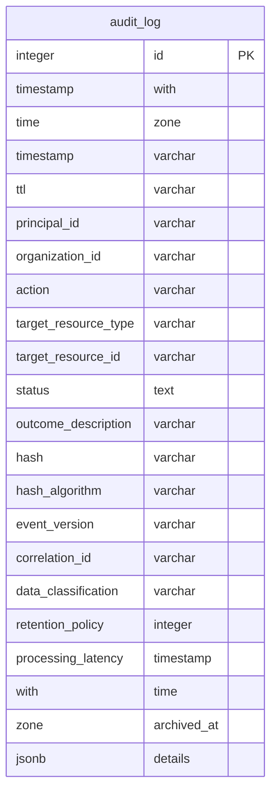
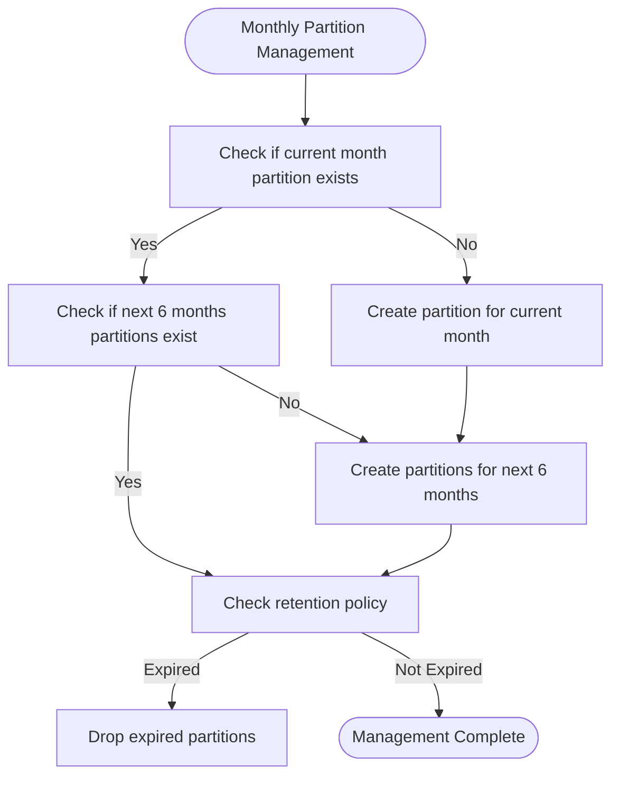
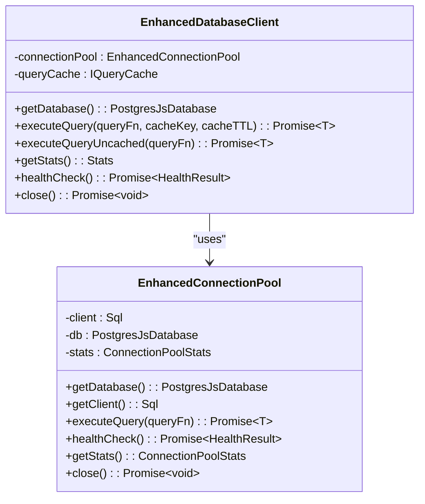
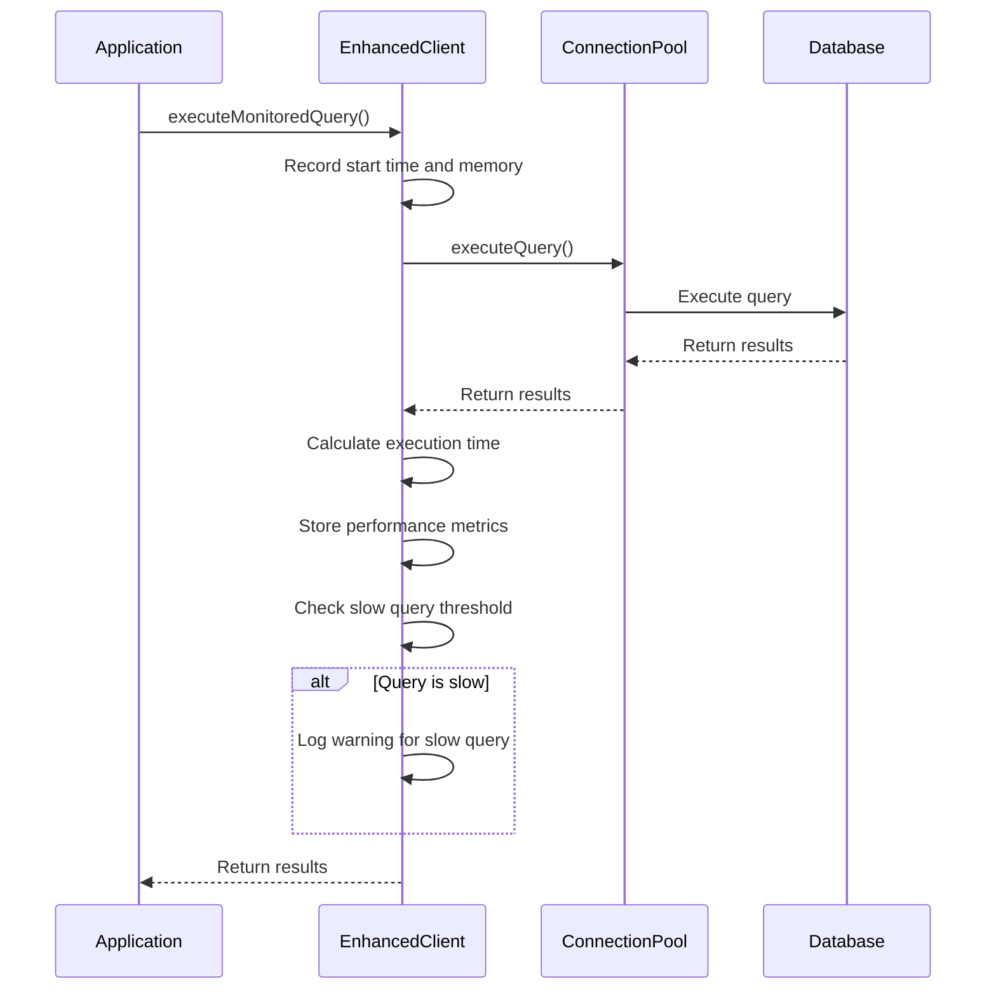
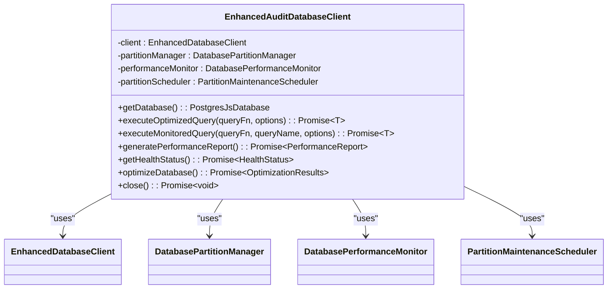

# Database Persistence Mechanism

<cite>
**Referenced Files in This Document**   
- [README.md](file://packages/audit-db/README.md)
- [PARTITIONING.md](file://packages/audit-db/PARTITIONING.md)
- [schema.ts](file://packages/audit-db/src/db/schema.ts)
- [connection-pool.ts](file://packages/audit-db/src/db/connection-pool.ts)
- [enhanced-client.ts](file://packages/audit-db/src/db/enhanced-client.ts)
</cite>

## Table of Contents
1. [Introduction](#introduction)
2. [Schema Design for Audit Events](#schema-design-for-audit-events)
3. [Partitioning Strategy](#partitioning-strategy)
4. [Connection Pooling and Resource Utilization](#connection-pooling-and-resource-utilization)
5. [Indexes and Query Optimization](#indexes-and-query-optimization)
6. [Transactional Integrity and Batch Operations](#transactional-integrity-and-batch-operations)
7. [Performance Monitoring and Optimization](#performance-monitoring-and-optimization)
8. [Enhanced Client and Observability](#enhanced-client-and-observability)
9. [Conclusion](#conclusion)

## Introduction

The `@repo/audit-db` package provides a robust database persistence mechanism for audit events in a PostgreSQL environment using Drizzle ORM. This system is designed to handle high-throughput write operations while maintaining data integrity, query performance, and compliance with regulatory requirements. The architecture incorporates time-based partitioning, connection pooling, comprehensive indexing, and observability features to ensure efficient and reliable audit logging.

**Section sources**
- [README.md](file://packages/audit-db/README.md)

## Schema Design for Audit Events

The audit event schema is defined in the `auditLog` table within the Drizzle ORM schema. This table captures comprehensive information about system events for compliance, security, and operational monitoring purposes.

### Core Fields

The `auditLog` table includes the following essential fields:

- **id**: Serial primary key for the log entry
- **timestamp**: Timestamp with timezone (stored as string), not null, representing when the event occurred
- **action**: Varchar(255), not null, describing the action performed (e.g., 'user.login', 'document.update')
- **status**: Varchar(50), not null, with type constraint to `AuditEventStatus` ('attempt', 'success', 'failure')
- **principalId**: Varchar(255), optional identifier of the user or system that initiated the action
- **organizationId**: Varchar(255), optional identifier for multi-tenancy support
- **targetResourceType**: Varchar(255), optional type of resource affected by the action
- **targetResourceId**: Varchar(255), optional identifier of the specific resource affected
- **outcomeDescription**: Text field for detailed description of the outcome
- **details**: JSONB field to store any additional properties as structured or unstructured data
- **ttl**: Varchar(255), optional time-to-live information
- **hash**: Varchar(64), cryptographic hash (SHA-256) for ensuring data immutability
- **dataClassification**: Varchar(20), with type constraint to `DataClassification` ('PUBLIC', 'INTERNAL', 'CONFIDENTIAL', 'PHI')
- **retentionPolicy**: Varchar(50), indicating the retention policy applied to this event
- **correlationId**: Varchar(255), for tracing related events across systems
- **processingLatency**: Integer, recording processing time in milliseconds
- **archivedAt**: Timestamp with timezone, indicating when the event was archived



**Diagram sources**
- [schema.ts](file://packages/audit-db/src/db/schema.ts#L45-L120)

**Section sources**
- [schema.ts](file://packages/audit-db/src/db/schema.ts#L45-L120)

## Partitioning Strategy

The audit log system implements a time-based partitioning strategy to optimize performance and manageability of large datasets.

### Partitioning Implementation

The `audit_log` table is partitioned using range partitioning on the `timestamp` column with monthly intervals. Each partition follows the naming convention `audit_log_YYYY_MM` (e.g., `audit_log_2025_08`, `audit_log_2025_09`).

The partitioning setup can be initialized through two methods:

1. **Fresh Database Setup**: Using the `pnpm audit-db:setup-partitions` script or directly executing `node scripts/setup-partitions.js` with a database URL.
2. **Migration of Existing Data**: Applying the `convert-to-partitioned.sql` migration script to convert an existing non-partitioned table.

### Automatic Partition Management

The system includes automated partition management features:

- **Auto-creation**: Partitions are automatically created for the current month plus six months ahead
- **Auto-cleanup**: Old partitions are dropped based on configured retention policies
- **Monitoring**: Built-in functions to analyze partition statistics and health



**Diagram sources**
- [PARTITIONING.md](file://packages/audit-db/PARTITIONING.md)
- [setup-partitions.js](file://packages/audit-db/scripts/setup-partitions.js)

**Section sources**
- [PARTITIONING.md](file://packages/audit-db/PARTITIONING.md)
- [setup-partitions.js](file://packages/audit-db/scripts/setup-partitions.js)

## Connection Pooling and Resource Utilization

The database persistence mechanism employs an enhanced connection pooling strategy to efficiently manage database resources and support high-throughput operations.

### Connection Pool Configuration

The `EnhancedConnectionPool` class manages database connections with configurable parameters:

- **minConnections**: Minimum number of connections to maintain in the pool
- **maxConnections**: Maximum number of connections allowed in the pool
- **idleTimeout**: Time in milliseconds before idle connections are closed
- **acquireTimeout**: Time in milliseconds to wait for a connection before timing out
- **retryAttempts**: Number of retry attempts for failed connection acquisitions
- **retryDelay**: Delay in milliseconds between retry attempts
- **ssl**: Boolean flag to enable SSL connections

### Connection Pool Implementation

The connection pool is implemented using `postgres.js` as the underlying PostgreSQL client, integrated with Drizzle ORM. Key features include:

- **Connection Monitoring**: Tracks connection statistics including total, active, and idle connections
- **Performance Metrics**: Measures connection acquisition time and maintains rolling averages
- **Health Checking**: Provides a health check endpoint that verifies connectivity with a simple `SELECT 1` query
- **Graceful Shutdown**: Properly closes all connections when the application terminates



**Diagram sources**
- [connection-pool.ts](file://packages/audit-db/src/db/connection-pool.ts#L50-L300)

**Section sources**
- [connection-pool.ts](file://packages/audit-db/src/db/connection-pool.ts)

## Indexes and Query Optimization

The audit database schema includes a comprehensive indexing strategy to optimize query performance for common access patterns.

### Primary Indexes

The following single-column indexes are created on frequently queried fields:

- `audit_log_timestamp_idx` on `timestamp`
- `audit_log_principal_id_idx` on `principalId`
- `audit_log_organization_id_idx` on `organizationId`
- `audit_log_action_idx` on `action`
- `audit_log_status_idx` on `status`
- `audit_log_target_resource_type_idx` on `targetResourceType`
- `audit_log_target_resource_id_idx` on `targetResourceId`
- `audit_log_correlation_id_idx` on `correlationId`
- `audit_log_data_classification_idx` on `dataClassification`
- `audit_log_retention_policy_idx` on `retentionPolicy`

### Composite Indexes

To optimize common query patterns, the following composite indexes are implemented:

- `audit_log_timestamp_status_idx` on `(timestamp, status)` - for time-range queries filtered by status
- `audit_log_principal_action_idx` on `(principalId, action)` - for user activity analysis
- `audit_log_classification_retention_idx` on `(dataClassification, retentionPolicy)` - for compliance queries
- `audit_log_resource_type_id_idx` on `(targetResourceType, targetResourceId)` - for resource-specific audit trails

```mermaid
erDiagram
audit_log {
integer id PK
timestamp with time zone timestamp
varchar ttl
varchar principal_id
varchar organization_id
varchar action
varchar target_resource_type
varchar target_resource_id
varchar status
text outcome_description
varchar hash
varchar hash_algorithm
varchar event_version
varchar correlation_id
varchar data_classification
varchar retention_policy
integer processing_latency
timestamp with time zone archived_at
jsonb details
}
index audit_log_timestamp_idx on audit_log(timestamp)
index audit_log_principal_id_idx on audit_log(principalId)
index audit_log_organization_id_idx on audit_log(organizationId)
index audit_log_action_idx on audit_log(action)
index audit_log_status_idx on audit_log(status)
index audit_log_timestamp_status_idx on audit_log(timestamp, status)
index audit_log_principal_action_idx on audit_log(principalId, action)
index audit_log_classification_retention_idx on audit_log(dataClassification, retentionPolicy)
```

**Diagram sources**
- [schema.ts](file://packages/audit-db/src/db/schema.ts#L75-L110)

**Section sources**
- [schema.ts](file://packages/audit-db/src/db/schema.ts#L75-L110)

## Transactional Integrity and Batch Operations

The database persistence mechanism ensures transactional integrity during audit event insertion, particularly for batch operations.

### Transaction Management

While the provided code does not explicitly show transaction management for batch inserts, Drizzle ORM supports transactional operations. A typical implementation for batch inserts would use:

```typescript
await db.transaction(async (tx) => {
  for (const event of events) {
    await tx.insert(auditLog).values(event);
  }
});
```

This ensures that either all events in a batch are successfully inserted, or none are, maintaining data consistency.

### Bulk Operations Optimization

For high-throughput write operations, the system is designed to handle bulk inserts efficiently through:

- **Connection Pooling**: Reusing database connections to minimize connection overhead
- **Prepared Statements**: Although disabled in the current configuration for better connection reuse, they could be enabled for specific high-frequency queries
- **Batch Processing**: While not explicitly shown, the architecture supports batch operations through the ORM's bulk insert capabilities

The combination of connection pooling and efficient query execution allows the system to handle high volumes of audit events with minimal latency.

**Section sources**
- [connection-pool.ts](file://packages/audit-db/src/db/connection-pool.ts)
- [enhanced-client.ts](file://packages/audit-db/src/db/enhanced-client.ts)

## Performance Monitoring and Optimization

The audit database includes comprehensive performance monitoring and optimization capabilities to maintain high performance under load.

### Performance Testing Insights

Based on the implementation, the system includes performance monitoring features that track:

- **Query Latency**: Execution time of database queries
- **Connection Acquisition Time**: Time to obtain a connection from the pool
- **Memory Usage**: Heap memory consumption during query execution
- **Cache Hit Ratio**: Effectiveness of query caching

The `executeMonitoredQuery` method in the enhanced client captures these metrics and logs slow queries that exceed a configurable threshold.

### Optimization Features

The system implements several optimization strategies:

- **Automatic Performance Reporting**: Generates performance reports at regular intervals (every 5 minutes)
- **Auto-optimization**: Performs automatic optimizations based on performance metrics, such as clearing cache when hit ratio is low
- **Maintenance Operations**: Runs database maintenance tasks like vacuum and analyze
- **Configuration Optimization**: Suggests optimal database configuration settings



**Diagram sources**
- [enhanced-client.ts](file://packages/audit-db/src/db/enhanced-client.ts#L250-L350)

**Section sources**
- [enhanced-client.ts](file://packages/audit-db/src/db/enhanced-client.ts)

## Enhanced Client and Observability

The `EnhancedAuditDatabaseClient` class serves as the primary interface for database operations, wrapping raw database functionality with observability, error handling, and performance optimization features.

### Client Architecture

The enhanced client integrates multiple components:

- **Connection Pooling**: Manages database connections efficiently
- **Query Caching**: Implements Redis-based query caching to reduce database load
- **Partition Management**: Automates the creation and maintenance of time-based partitions
- **Performance Monitoring**: Tracks and reports on database performance metrics
- **Health Checking**: Provides comprehensive health status for all components

### Key Features

#### Observability

The enhanced client provides extensive observability through:

- **Performance Reporting**: Regular generation of comprehensive performance reports
- **Health Status**: Detailed health checks for all components (connection pool, cache, partitions, performance)
- **Metric Collection**: Stores query metrics in Redis for aggregation and analysis
- **Alerting**: Detects and reports performance issues such as slow queries, low cache hit ratios, and connection problems

#### Error Handling

The client implements robust error handling:

- **Retry Logic**: Configurable retry attempts with delay for transient failures
- **Comprehensive Logging**: Detailed error logging with context
- **Graceful Degradation**: Continues operation with reduced functionality when non-critical components fail
- **Error Propagation**: Properly propagates errors to calling applications with relevant context

#### Configuration

The client is highly configurable through the `EnhancedClientConfig` interface, allowing customization of:

- Connection pool parameters
- Query cache settings
- Partitioning strategy and maintenance
- Performance monitoring thresholds
- Auto-optimization behavior



**Diagram sources**
- [enhanced-client.ts](file://packages/audit-db/src/db/enhanced-client.ts)

**Section sources**
- [enhanced-client.ts](file://packages/audit-db/src/db/enhanced-client.ts)

## Conclusion

The database persistence mechanism in `@repo/audit-db` provides a comprehensive solution for storing and managing audit events with high performance, reliability, and observability. The system leverages time-based partitioning to efficiently manage large volumes of time-series data, connection pooling to optimize resource utilization, and a sophisticated indexing strategy to ensure fast query performance.

The enhanced client architecture wraps raw database operations with comprehensive observability, error handling, and performance optimization features, making it suitable for high-throughput environments. The integration of automated partition management, query caching, and performance monitoring ensures that the system can maintain optimal performance under varying loads.

This architecture effectively balances the need for high write throughput with the requirements for data integrity, query performance, and operational observability, making it well-suited for audit logging in enterprise applications with strict compliance requirements.

**Section sources**
- [README.md](file://packages/audit-db/README.md)
- [PARTITIONING.md](file://packages/audit-db/PARTITIONING.md)
- [schema.ts](file://packages/audit-db/src/db/schema.ts)
- [connection-pool.ts](file://packages/audit-db/src/db/connection-pool.ts)
- [enhanced-client.ts](file://packages/audit-db/src/db/enhanced-client.ts)