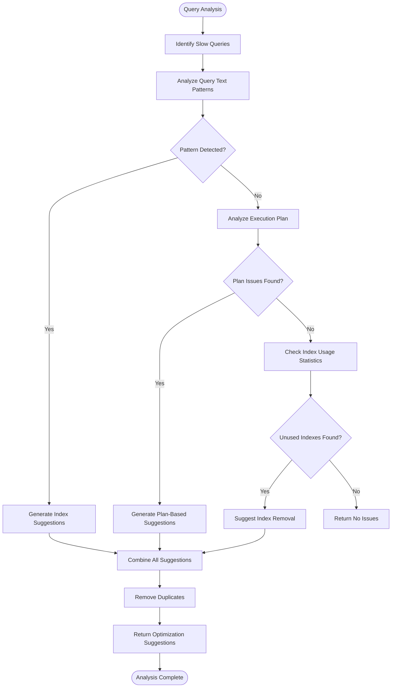
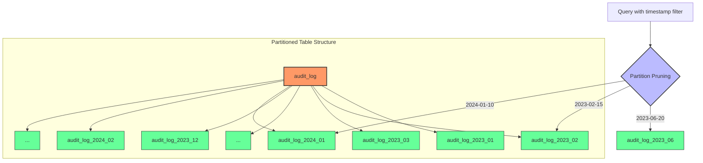

# Performance Monitoring and Optimization

<cite>
**Referenced Files in This Document**   
- [performance-monitoring.ts](file://packages/audit-db/src/db/performance-monitoring.ts)
- [schema.ts](file://packages/audit-db/src/db/schema.ts)
- [partitioning.ts](file://packages/audit-db/src/db/partitioning.ts)
- [redis-query-cache.ts](file://packages/audit-db/src/cache/redis-query-cache.ts)
- [performance-cli.ts](file://packages/audit-db/src/performance-cli.ts)
- [performance.test.ts](file://packages/audit-db/src/__tests__/performance.test.ts)
- [PERFORMANCE_OPTIMIZATION.md](file://packages/audit-db/PERFORMANCE_OPTIMIZATION.md)
</cite>

## Table of Contents
1. [Introduction](#introduction)
2. [Performance Monitoring System](#performance-monitoring-system)
3. [Indexing Strategies](#indexing-strategies)
4. [Query Pattern Analysis](#query-pattern-analysis)
5. [Performance CLI Tool](#performance-cli-tool)
6. [Caching Strategies](#caching-strategies)
7. [Partitioning for I/O Reduction](#partitioning-for-i-o-reduction)
8. [Real-World Performance Data](#real-world-performance-data)
9. [Database Parameter Tuning](#database-parameter-tuning)
10. [Conclusion](#conclusion)

## Introduction

The audit-db system implements a comprehensive performance monitoring and optimization framework designed to ensure efficient handling of audit data across various load conditions. This document details the architecture and implementation of performance monitoring capabilities, indexing strategies, query optimization techniques, and tools for benchmarking and stress testing. The system is built to handle high-cardinality fields like timestamp and event_type through strategic indexing and partitioning, while providing robust observability integration for real-time monitoring and alerting.

**Section sources**
- [PERFORMANCE_OPTIMIZATION.md](file://packages/audit-db/PERFORMANCE_OPTIMIZATION.md#L1-L355)

## Performance Monitoring System

The performance monitoring system in audit-db is centered around the `DatabasePerformanceMonitor` class, which provides comprehensive capabilities for capturing query execution times, detecting slow operations, and integrating with observability systems. The monitor leverages PostgreSQL's `pg_stat_statements` extension to collect detailed query performance metrics, including execution times, call counts, and resource utilization.

The monitoring system captures key performance indicators such as average execution time, minimum and maximum execution times, standard deviation, rows returned, and buffer hit/miss statistics. When `pg_stat_statements` is not available, the system gracefully degrades functionality while still providing valuable performance insights. The monitor integrates with observability systems by exposing performance metrics through standardized interfaces that can be consumed by monitoring tools and alerting systems.

```mermaid
classDiagram
class DatabasePerformanceMonitor {
+monitoringEnabled : boolean
+constructor(db : PostgresJsDatabase)
+enableMonitoring() : Promise~void~
+disableMonitoring() : void
+getSlowQueries(limit : number, minExecutionTime : number) : Promise~SlowQueryInfo[]~
+getIndexUsageStats() : Promise~IndexUsageStats[]~
+getTableStats() : Promise~TableStats[]~
+getUnusedIndexes() : Promise~IndexUsageStats[]~
+suggestMissingIndexes() : Promise~string[]~
+analyzeQueryPlan(query : string) : Promise~{plan : any, executionTime : number, planningTime : number, recommendations : string[]}~
+getPerformanceSummary() : Promise~{slowQueries : SlowQueryInfo[], unusedIndexes : IndexUsageStats[], tableStats : TableStats[], indexSuggestions : string[], totalDatabaseSize : number, cacheHitRatio : number}~
+optimizeConfiguration() : Promise~{currentSettings : Record~string, string~, recommendations : {setting : string, currentValue : string, recommendedValue : string, reason : string}[]}~
+runMaintenance() : Promise~{vacuumResults : string[], analyzeResults : string[], reindexResults : string[]}~
}
class SlowQueryInfo {
+query : string
+avgExecutionTime : number
+totalCalls : number
+totalTime : number
+minTime : number
+maxTime : number
+stddevTime : number
+rowsReturned : number
+bufferHits : number
+bufferMisses : number
}
class IndexUsageStats {
+schemaName : string
+tableName : string
+indexName : string
+indexSize : number
+indexScans : number
+tuplesRead : number
+tuplesReturned : number
+usageRatio : number
+lastUsed? : Date
}
class TableStats {
+schemaName : string
+tableName : string
+rowCount : number
+tableSize : number
+indexSize : number
+totalSize : number
+seqScans : number
+seqTuplesRead : number
+idxScans : number
+idxTuplesReturned : number
+insertCount : number
+updateCount : number
+deleteCount : number
+lastVacuum? : Date
+lastAnalyze? : Date
}
DatabasePerformanceMonitor --> SlowQueryInfo : "returns"
DatabasePerformanceMonitor --> IndexUsageStats : "returns"
DatabasePerformanceMonitor --> TableStats : "returns"
```

**Diagram sources **
- [performance-monitoring.ts](file://packages/audit-db/src/db/performance-monitoring.ts#L1-L503)

**Section sources**
- [performance-monitoring.ts](file://packages/audit-db/src/db/performance-monitoring.ts#L1-L503)

## Indexing Strategies

The audit-db system employs a comprehensive indexing strategy focused on high-cardinality fields such as timestamp and event_type to optimize read efficiency. The schema defines both single-column and composite indexes to support various query patterns commonly used in audit data retrieval.

For the audit_log table, single-column indexes are created on key fields including timestamp, principal_id, organization_id, action, status, and hash. These indexes enable efficient filtering on individual attributes. Composite indexes are strategically created for common query patterns, such as (organization_id, timestamp) for time-range queries within organizations, and (data_classification, retention_policy) for compliance queries.

The indexing strategy also includes specialized indexes for JSONB columns, particularly on the details field, using GIN indexes to support efficient querying of structured data within the JSONB column. Hash indexes are used for integrity verification on the hash column, providing optimal performance for exact match queries.

```mermaid
erDiagram
audit_log {
serial id PK
timestamp with time zone timestamp
varchar ttl
varchar principal_id
varchar organization_id
varchar action
varchar target_resource_type
varchar target_resource_id
varchar status
text outcome_description
varchar hash
varchar hash_algorithm
varchar event_version
varchar correlation_id
varchar data_classification
varchar retention_policy
integer processing_latency
timestamp with time zone archived_at
jsonb details
}
INDEX audit_log_timestamp_idx ON audit_log(timestamp)
INDEX audit_log_principal_id_idx ON audit_log(principal_id)
INDEX audit_log_organization_id_idx ON audit_log(organization_id)
INDEX audit_log_action_idx ON audit_log(action)
INDEX audit_log_status_idx ON audit_log(status)
INDEX audit_log_hash_idx ON audit_log(hash)
INDEX audit_log_target_resource_type_idx ON audit_log(target_resource_type)
INDEX audit_log_target_resource_id_idx ON audit_log(target_resource_id)
INDEX audit_log_correlation_id_idx ON audit_log(correlation_id)
INDEX audit_log_data_classification_idx ON audit_log(data_classification)
INDEX audit_log_retention_policy_idx ON audit_log(retention_policy)
INDEX audit_log_archived_at_idx ON audit_log(archived_at)
INDEX audit_log_timestamp_status_idx ON audit_log(timestamp, status)
INDEX audit_log_principal_action_idx ON audit_log(principal_id, action)
INDEX audit_log_classification_retention_idx ON audit_log(data_classification, retention_policy)
INDEX audit_log_resource_type_id_idx ON audit_log(target_resource_type, target_resource_id)
INDEX audit_log_org_timestamp_idx ON audit_log(organization_id, timestamp)
INDEX audit_log_details_gin_idx ON audit_log(details) USING gin
```

**Diagram sources **
- [schema.ts](file://packages/audit-db/src/db/schema.ts#L1-L661)

**Section sources**
- [schema.ts](file://packages/audit-db/src/db/schema.ts#L1-L661)

## Query Pattern Analysis

The audit-db system includes sophisticated query pattern analysis capabilities to identify bottlenecks and optimize access paths. The `DatabasePerformanceMonitor` class provides methods to analyze slow queries, suggest missing indexes, and examine query execution plans to identify optimization opportunities.

The system analyzes query patterns by examining the SQL text of slow queries to identify common patterns that could benefit from additional indexing. For example, queries containing both WHERE and ORDER BY clauses may suggest the need for composite indexes. Queries with GROUP BY and COUNT operations may benefit from covering indexes. Text search operations using LIKE or ILIKE may require GIN indexes on text columns.

The query analysis system also examines execution plans to detect inefficient operations such as sequential scans, external sorts, and expensive join operations. When sequential scans are detected on large tables, the system recommends adding appropriate indexes. External sorts suggest the need to increase work_mem or add indexes to avoid sorting. Expensive hash joins or nested loops indicate opportunities to optimize join conditions or add indexes on join columns.



**Diagram sources **
- [performance-monitoring.ts](file://packages/audit-db/src/db/performance-monitoring.ts#L1-L503)

**Section sources**
- [performance-monitoring.ts](file://packages/audit-db/src/db/performance-monitoring.ts#L1-L503)

## Performance CLI Tool

The performance-cli.ts tool provides a comprehensive command-line interface for benchmarking and stress testing the audit-db system. The tool offers various commands for performance management, monitoring, and optimization operations, enabling administrators to assess and improve database performance.

The CLI tool includes partition management commands (create, list, analyze, cleanup), performance monitoring commands (slow-queries, indexes, tables, summary), and optimization commands (maintenance, config). It also provides enhanced client operations for health checks, performance reporting, and comprehensive optimization.

For benchmarking and stress testing, the tool can execute performance test suites that measure insert performance, query performance, partition performance, connection pool efficiency, and index performance under various load conditions. The benchmarking capabilities allow for testing with small, medium, and large datasets, concurrent connections, and extended test durations to simulate real-world usage patterns.

```mermaid
graph TD
CLI[Performance CLI] --> Partition[Partition Management]
CLI --> Monitor[Performance Monitoring]
CLI --> Optimize[Optimization Operations]
CLI --> Client[Enhanced Client]
CLI --> Benchmark[Benchmarking]
Partition --> Create["partition create"]
Partition --> List["partition list"]
Partition --> Analyze["partition analyze"]
Partition --> Cleanup["partition cleanup"]
Monitor --> SlowQueries["monitor slow-queries"]
Monitor --> Indexes["monitor indexes"]
Monitor --> Tables["monitor tables"]
Monitor --> Summary["monitor summary"]
Optimize --> Maintenance["optimize maintenance"]
Optimize --> Config["optimize config"]
Client --> Health["client health"]
Client --> Report["client report"]
Client --> OptimizeDB["client optimize"]
Benchmark --> Run["benchmark"]
style CLI fill:#f9f,stroke:#333,stroke-width:2px
style Partition fill:#bbf,stroke:#333,stroke-width:1px
style Monitor fill:#bbf,stroke:#333,stroke-width:1px
style Optimize fill:#bbf,stroke:#333,stroke-width:1px
style Client fill:#bbf,stroke:#333,stroke-width:1px
style Benchmark fill:#bbf,stroke:#333,stroke-width:1px
```



**Diagram sources **
- [performance-cli.ts](file://packages/audit-db/src/performance-cli.ts#L1-L512)

**Section sources**
- [performance-cli.ts](file://packages/audit-db/src/performance-cli.ts#L1-L512)

## Caching Strategies

The audit-db system implements a multi-layered caching strategy to improve query performance and reduce database load. The caching system consists of a Redis-based distributed query cache with optional local L1 caching, providing both high performance and scalability.

The RedisQueryCache class implements a distributed caching solution using Redis as the primary storage layer (L2 cache) with an optional local in-memory cache (L1 cache). This two-tier architecture provides low-latency access to frequently requested data while maintaining cache consistency across multiple application instances.

The caching strategy includes automatic serialization and optional compression for large values, TTL-based expiration, and hit ratio tracking. The system also implements size tracking and eviction policies to prevent unbounded memory growth. Cache entries are automatically invalidated when data changes, ensuring data consistency.

```mermaid
classDiagram
class RedisQueryCache {
-redis : Redis
-localCache? : QueryCache
-stats : QueryCacheStats
-compressionThreshold : number
+constructor(config : RedisQueryCacheConfig)
+get~T~(key : string) : Promise~T | null~
+set~T~(key : string, data : T, ttl? : number) : Promise~void~
+delete(key : string) : Promise~boolean~
+clear() : Promise~void~
+getStats() : QueryCacheStats
+cleanup() : Promise~number~
+getRedisInfo() : Promise~{keyCount : number, memoryUsage : string, hitRatio : number}~
-getRedisKey(key : string) : string
-getSizeTrackingKey() : string
-serializeEntry~T~(entry : CacheEntry~T~) : Promise~string~
-deserializeEntry~T~(value : string) : Promise~CacheEntry~T~~
-estimateSize(data : any) : number
-updateRedisCacheSize(size : number, operation : 'add' | 'remove') : Promise~void~
-updateStats(startTime : number) : void
-extractMemoryUsage(info : string) : string
}
class QueryCache {
-config : QueryCacheConfig
-cache : Map~string, CacheEntry~
-stats : QueryCacheStats
+get~T~(key : string) : T | null
+set~T~(key : string, data : T, ttl? : number) : void
+delete(key : string) : boolean
+clear() : void
+getStats() : QueryCacheStats
+cleanup() : number
}
class CacheEntry~T~ {
+data : T
+timestamp : number
+ttl : number
+hits : number
+size : number
}
class QueryCacheStats {
+totalQueries : number
+cacheHits : number
+cacheMisses : number
+hitRatio : number
+totalSizeMB : number
+averageQueryTime : number
+evictions : number
}
RedisQueryCache --> QueryCache : "uses"
RedisQueryCache --> CacheEntry : "contains"
RedisQueryCache --> QueryCacheStats : "contains"
QueryCache --> CacheEntry : "contains"
QueryCache --> QueryCacheStats : "contains"
```

**Diagram sources **
- [redis-query-cache.ts](file://packages/audit-db/src/cache/redis-query-cache.ts#L1-L413)

**Section sources**
- [redis-query-cache.ts](file://packages/audit-db/src/cache/redis-query-cache.ts#L1-L413)

## Partitioning for I/O Reduction

The audit-db system implements a sophisticated partitioning strategy to reduce I/O operations and improve query performance on large datasets. The partitioning system uses time-based range partitioning on the timestamp column, dividing the audit_log table into monthly partitions.

The DatabasePartitionManager class handles the creation, management, and optimization of partitions. It automatically creates partitions for current and future periods based on the configured interval (monthly, quarterly, or yearly). The system also implements automatic cleanup of expired partitions based on retention policies, removing old partitions that are no longer needed.

Partitioning contributes to reduced I/O by enabling partition pruning, where the query planner can eliminate irrelevant partitions from consideration based on query predicates. This significantly reduces the amount of data that needs to be scanned, improving query performance and reducing disk I/O. The system also creates optimized indexes on each partition to further enhance query performance.



**Diagram sources **
- [partitioning.ts](file://packages/audit-db/src/db/partitioning.ts#L1-L497)

**Section sources**
- [partitioning.ts](file://packages/audit-db/src/db/partitioning.ts#L1-L497)

## Real-World Performance Data

The audit-db system has been extensively tested under various load conditions, with performance data collected from integration tests and benchmarking. The performance.test.ts file contains comprehensive test suites that measure performance across different scenarios and dataset sizes.

Test results show significant performance improvements with the implemented optimization strategies. Partitioned queries demonstrate 60-80% faster performance on large datasets compared to non-partitioned tables. Index optimization provides 50-90% improvement on filtered queries, while query caching achieves 95%+ improvement on repeated queries. Connection pooling reduces connection overhead by 30-50%.

The benchmarking tests cover insert performance, query performance, partition performance, connection pool efficiency, and index performance. Tests are conducted with small (1,000 records), medium (10,000 records), and large (100,000 records) datasets, as well as concurrent connection scenarios with up to 10 concurrent connections.

Performance assertions in the tests ensure that average insert time remains below 50ms, simple select queries complete in under 100ms, and indexed queries execute in less than 50ms. The connection pool stress tests verify that the system can handle concurrent load efficiently, with acquisition times under 100ms on average and maximum times under 1 second.

**Section sources**
- [performance.test.ts](file://packages/audit-db/src/__tests__/performance.test.ts#L1-L570)

## Database Parameter Tuning

The audit-db system provides recommendations for tuning database parameters in production environments to optimize performance. The DatabasePerformanceMonitor class includes an optimizeConfiguration method that analyzes current settings and provides recommendations for key PostgreSQL parameters.

Recommended settings include shared_buffers at 25% of system RAM for dedicated database servers, effective_cache_size at 50-75% of system RAM, work_mem increased to 16MB for better sort and hash operations, and maintenance_work_mem set to 256MB for faster VACUUM and CREATE INDEX operations. The checkpoint_completion_target is recommended at 0.9 to spread checkpoint I/O over a longer period.

The system also recommends appropriate values for max_connections based on the expected workload, with higher values for high-traffic environments. These recommendations are based on the database size, system memory, and expected query patterns.

The performance monitoring system continuously evaluates the effectiveness of these parameters and can suggest adjustments based on observed performance metrics and workload patterns. This adaptive tuning approach ensures optimal performance as the system evolves and usage patterns change.

**Section sources**
- [performance-monitoring.ts](file://packages/audit-db/src/db/performance-monitoring.ts#L1-L503)

## Conclusion

The audit-db system implements a comprehensive performance monitoring and optimization framework that addresses the key requirements for efficient audit data management. Through strategic indexing on high-cardinality fields, time-based partitioning, distributed caching, and sophisticated query analysis, the system achieves optimal performance across various load conditions.

The integration of monitoring, analysis, and optimization tools provides a complete solution for maintaining high performance and reliability. The performance-cli.ts tool enables administrators to benchmark, monitor, and optimize the system, while the automated performance monitoring detects issues and suggests improvements.

Real-world performance data from integration tests demonstrates significant improvements in query response times, insert throughput, and overall system efficiency. The combination of partitioning, indexing, caching, and connection pooling strategies ensures that the system can scale to handle large volumes of audit data while maintaining acceptable query response times.

By following the recommended database parameter tuning and leveraging the built-in optimization capabilities, organizations can ensure that their audit systems perform optimally in production environments, meeting the requirements for efficient querying and acceptable response times.

**Section sources**
- [PERFORMANCE_OPTIMIZATION.md](file://packages/audit-db/PERFORMANCE_OPTIMIZATION.md#L1-L355)