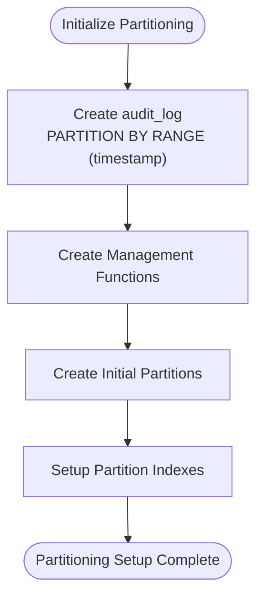

# Schema Design and Partitioning

<cite>
**Referenced Files in This Document**   
- [schema.ts](file://packages/audit-db/src/db/schema.ts)
- [partitioning.ts](file://packages/audit-db/src/db/partitioning.ts)
- [convert-to-partitioned.sql](file://packages/audit-db/src/db/migrations/convert-to-partitioned.sql)
- [setup-partitions.ts](file://packages/audit-db/src/db/setup-partitions.ts)
- [setup-partitions.js](file://packages/audit-db/scripts/setup-partitions.js)
- [PARTITIONING.md](file://packages/audit-db/PARTITIONING.md)
</cite>

## Table of Contents
1. [Introduction](#introduction)
2. [Audit Events Table Structure](#audit-events-table-structure)
3. [Partitioning Strategy](#partitioning-strategy)
4. [Partition Management Implementation](#partition-management-implementation)
5. [Migration Process](#migration-process)
6. [Query Performance and Partition Pruning](#query-performance-and-partition-pruning)
7. [Indexing Strategy](#indexing-strategy)
8. [Foreign Key Constraints](#foreign-key-constraints)
9. [Maintenance and Automation](#maintenance-and-automation)
10. [Best Practices](#best-practices)

## Introduction
This document details the schema design and partitioning strategy for the audit database system. The architecture is optimized for high-volume audit event storage, efficient time-based queries, and streamlined data lifecycle management. The core of this design is the `audit_log` table, which is partitioned by time to enhance performance and simplify maintenance operations.

**Section sources**
- [schema.ts](file://packages/audit-db/src/db/schema.ts#L1-L660)
- [PARTITIONING.md](file://packages/audit-db/PARTITIONING.md#L1-L112)

## Audit Events Table Structure
The `audit_log` table serves as the primary repository for all audit events, capturing comprehensive information about system activities. The table structure is designed to support compliance requirements, efficient querying, and data integrity.

### Core Fields
The table includes the following essential fields:

- **id**: Serial primary key for the log entry
- **timestamp**: Timestamp with time zone (stored as string), not null, representing when the event occurred
- **action**: Varchar(255), not null, describing the action performed (e.g., 'user.login', 'document.update')
- **status**: Varchar(50), not null, indicating the event status ('attempt', 'success', 'failure')
- **principalId**: Varchar(255), the identifier of the user or system that performed the action
- **organizationId**: Varchar(255), the identifier of the organization associated with the event
- **targetResourceType**: Varchar(255), the type of resource affected (e.g., 'Patient', 'Order')
- **targetResourceId**: Varchar(255), the specific ID of the resource affected
- **outcomeDescription**: Text field for detailed description of the event outcome
- **details**: Jsonb field for storing any additional structured or unstructured data
- **hash**: Varchar(64), cryptographic hash for ensuring data immutability
- **dataClassification**: Varchar(20), classification level ('PUBLIC', 'INTERNAL', 'CONFIDENTIAL', 'PHI')

### Compliance and Operational Fields
Additional fields support compliance requirements and operational monitoring:

- **hashAlgorithm**: Varchar(50), default 'SHA-256', specifying the hashing algorithm used
- **eventVersion**: Varchar(20), default '1.0', for versioning audit event schemas
- **correlationId**: Varchar(255), for linking related events across systems
- **retentionPolicy**: Varchar(50), default 'standard', defining data retention rules
- **processingLatency**: Integer, in milliseconds, tracking processing delay
- **archivedAt**: Timestamp with time zone, when the record was archived

**Section sources**
- [schema.ts](file://packages/audit-db/src/db/schema.ts#L1-L660)

## Partitioning Strategy
The audit_log table employs range partitioning by timestamp, with monthly partitions providing an optimal balance between query performance and maintenance overhead.

### Partition Design
The partitioning strategy is implemented as follows:

- **Partition Key**: timestamp column
- **Partition Type**: Range partitioning
- **Partition Interval**: Monthly
- **Partition Naming**: audit_log_YYYY_MM (e.g., audit_log_2025_08)
- **Partition Bounds**: FROM ('YYYY-MM-01') TO ('YYYY-MM+1-01')

This design ensures that queries filtering by time ranges only need to scan relevant partitions, significantly improving query performance for time-based searches.

### Benefits of Monthly Partitioning
Monthly partitioning offers several advantages:

- **Query Performance**: Time-range queries scan only relevant partitions, reducing I/O operations
- **Index Efficiency**: Smaller indexes per partition reduce index bloat and improve index scan performance
- **Data Lifecycle Management**: Entire months of data can be archived or deleted by dropping partitions
- **Maintenance Operations**: Vacuum, analyze, and backup operations can be performed on individual partitions
- **Storage Optimization**: Different partitions can use different storage tiers based on age

**Section sources**
- [partitioning.ts](file://packages/audit-db/src/db/partitioning.ts#L1-L496)
- [PARTITIONING.md](file://packages/audit-db/PARTITIONING.md#L1-L112)

## Partition Management Implementation
The partitioning system is implemented through a combination of database functions, TypeScript classes, and scripts that work together to manage the partitioned table.

### DatabasePartitionManager Class
The `DatabasePartitionManager` class provides the core functionality for managing partitions:

- **initializePartitionedTable**: Creates the partitioned audit_log table with appropriate structure
- **createAuditLogPartitions**: Creates new partitions based on the specified configuration
- **createPartition**: Creates a specific partition with defined date range
- **dropExpiredPartitions**: Removes partitions that exceed the retention period
- **getPartitionInfo**: Retrieves information about existing partitions
- **analyzePartitionPerformance**: Analyzes partition statistics and provides optimization recommendations

### Partition Creation Process
The partition creation process follows these steps:

1. Create the parent partitioned table using `PARTITION BY RANGE (timestamp)`
2. Create database functions for automated partition management
3. Generate monthly partitions for current and future periods
4. Create optimized indexes on each partition



**Diagram sources**
- [partitioning.ts](file://packages/audit-db/src/db/partitioning.ts#L1-L496)
- [setup-partitions.ts](file://packages/audit-db/src/db/setup-partitions.ts#L1-L49)

**Section sources**
- [partitioning.ts](file://packages/audit-db/src/db/partitioning.ts#L1-L496)
- [setup-partitions.ts](file://packages/audit-db/src/db/setup-partitions.ts#L1-L49)

## Migration Process
For existing databases with data in a non-partitioned audit_log table, a migration process is provided to convert the table to a partitioned structure without data loss.

### Migration Steps
The migration is performed through the `convert-to-partitioned.sql` script, which executes the following steps:

1. **Rename Existing Table**: ALTER TABLE audit_log RENAME TO audit_log_old
2. **Create Partitioned Table**: Create new audit_log table with PARTITION BY RANGE (timestamp)
3. **Create Initial Partitions**: Call create_audit_log_partitions() to generate monthly partitions
4. **Copy Data**: INSERT INTO audit_log SELECT * FROM audit_log_old
5. **Recreate Indexes**: Create all necessary indexes on the partitioned table
6. **Drop Old Table**: Remove the original table after successful migration

### Migration Considerations
Key considerations for the migration process:

- **Downtime**: The migration requires a maintenance window as the table is unavailable during conversion
- **Data Integrity**: The process preserves all existing data and constraints
- **Index Recreation**: All indexes must be recreated as they don't transfer automatically
- **Foreign Keys**: Any foreign key references to the audit_log table need to be handled separately

**Section sources**
- [convert-to-partitioned.sql](file://packages/audit-db/src/db/migrations/convert-to-partitioned.sql#L1-L65)

## Query Performance and Partition Pruning
The partitioning strategy significantly enhances query performance through PostgreSQL's partition pruning mechanism.

### Partition Pruning Mechanism
PostgreSQL automatically eliminates partitions that don't match the query conditions, scanning only relevant partitions. For example:

```sql
-- This query will only scan partitions containing data from 2025-08
SELECT * FROM audit_log 
WHERE timestamp >= '2025-08-01' 
AND timestamp < '2025-09-01';
```

### Query Examples with Performance Benefits
Queries that benefit from partition pruning include:

- **Time Range Queries**: 
```sql
SELECT count(*) FROM audit_log 
WHERE timestamp >= '2025-01-01' 
AND timestamp < '2025-02-01' 
AND status = 'failure';
```

- **Organization-Specific Time Queries**:
```sql
SELECT action, count(*) FROM audit_log 
WHERE organization_id = 'org-123' 
AND timestamp >= '2025-06-01' 
GROUP BY action;
```

- **Recent Activity Monitoring**:
```sql
SELECT * FROM audit_log 
WHERE timestamp >= NOW() - INTERVAL '24 hours' 
AND action LIKE 'user.%' 
ORDER BY timestamp DESC LIMIT 100;
```

These queries execute faster because PostgreSQL only needs to scan the partitions that contain data within the specified time ranges.

**Section sources**
- [partitioning.ts](file://packages/audit-db/src/db/partitioning.ts#L1-L496)
- [schema.ts](file://packages/audit-db/src/db/schema.ts#L1-L660)

## Indexing Strategy
The indexing strategy is designed to optimize both read and write performance while supporting common query patterns.

### Per-Partition Indexes
Each partition has the following indexes created:

- **Primary Performance Indexes**:
  - id_idx: On id column
  - timestamp_idx: On timestamp column
  - principal_id_idx: On principal_id column
  - organization_id_idx: On organization_id column
  - action_idx: On action column
  - status_idx: On status column

- **Compliance Query Indexes**:
  - data_classification_idx: On data_classification column
  - retention_policy_idx: On retention_policy column
  - correlation_id_idx: On correlation_id column

- **Composite Indexes**:
  - org_timestamp_idx: On (organization_id, timestamp)
  - principal_action_idx: On (principal_id, action)
  - classification_retention_idx: On (data_classification, retention_policy)
  - resource_type_id_idx: On (target_resource_type, target_resource_id)

### Specialized Indexes
Additional specialized indexes include:

- **Hash Index**: hash_idx using hash (hash) for integrity verification
- **GIN Index**: details_gin_idx using gin (details) for JSONB querying

The indexing strategy balances query performance with write overhead, ensuring that common query patterns are optimized while minimizing the impact on insert operations.

**Section sources**
- [partitioning.ts](file://packages/audit-db/src/db/partitioning.ts#L1-L496)
- [schema.ts](file://packages/audit-db/src/db/schema.ts#L1-L660)

## Foreign Key Constraints
The audit database design includes foreign key constraints to maintain referential integrity and support compliance requirements.

### Direct Foreign Keys
The report_executions table has a direct foreign key relationship:

- **reportConfigId**: References scheduledReports.id, ensuring that report executions are linked to valid scheduled reports

### Soft References
Other relationships are implemented as soft references through identifier fields:

- **organizationId**: Present in multiple tables (audit_log, audit_preset, alerts, etc.) for multi-tenant isolation
- **correlationId**: Used across tables to link related events and operations
- **principalId**: References user or system identifiers across the system

### Constraint Management in Partitioned Tables
Foreign key constraints on partitioned tables require special consideration:

- Constraints are inherited by partitions from the parent table
- Referential integrity is maintained across the entire partitioned table
- Performance considerations may lead to using soft references instead of hard foreign keys in high-write scenarios

The design balances data integrity requirements with performance needs, using hard constraints where critical and soft references where appropriate.

**Section sources**
- [schema.ts](file://packages/audit-db/src/db/schema.ts#L1-L660)

## Maintenance and Automation
The partitioning system includes automated maintenance features to ensure ongoing optimal performance.

### Automatic Partition Management
The system provides automated functions for partition management:

- **create_audit_log_partitions()**: PL/pgSQL function that creates partitions for the current month and next 6 months
- **drop_old_audit_partitions()**: Function that removes partitions older than the specified retention period
- **get_audit_partition_stats()**: Function that returns statistics about partition sizes and record counts

### PartitionMaintenanceScheduler
The TypeScript `PartitionMaintenanceScheduler` class provides:

- **Scheduled Maintenance**: Runs maintenance tasks at configurable intervals
- **Automatic Partition Creation**: Ensures future partitions are available
- **Automatic Cleanup**: Removes expired partitions based on retention policy
- **Performance Monitoring**: Tracks partition statistics and provides recommendations

### Setup Scripts
Two scripts facilitate partition setup:

- **setup-partitions.ts**: TypeScript module that initializes partitioning
- **setup-partitions.js**: CLI script that wraps the setup functionality for command-line use

These automation features ensure that the partitioning system requires minimal manual intervention while maintaining optimal performance.

**Section sources**
- [partitioning.ts](file://packages/audit-db/src/db/partitioning.ts#L1-L496)
- [setup-partitions.ts](file://packages/audit-db/src/db/setup-partitions.ts#L1-L49)
- [setup-partitions.js](file://packages/audit-db/scripts/setup-partitions.js#L1-L29)

## Best Practices
To maximize the benefits of the partitioning strategy, follow these best practices:

### Query Optimization
- Always include timestamp filters in queries when possible to leverage partition pruning
- Use indexed columns in WHERE clauses to maximize query performance
- Consider the partition boundaries when defining time ranges (e.g., use month boundaries)

### Data Management
- Monitor partition sizes and adjust the partition interval if partitions become too large
- Implement appropriate retention policies based on compliance requirements
- Consider using different storage tiers for older partitions

### Maintenance
- Regularly run the partition maintenance scheduler
- Monitor the partition statistics and address any performance recommendations
- Test the migration process in a staging environment before applying to production

### Monitoring
- Track query performance to ensure partition pruning is working correctly
- Monitor index sizes and consider reindexing if bloat becomes an issue
- Set up alerts for partition creation failures or other maintenance issues

Following these best practices will ensure that the audit database continues to perform optimally as data volumes grow over time.

**Section sources**
- [PARTITIONING.md](file://packages/audit-db/PARTITIONING.md#L1-L112)
- [partitioning.ts](file://packages/audit-db/src/db/partitioning.ts#L1-L496)