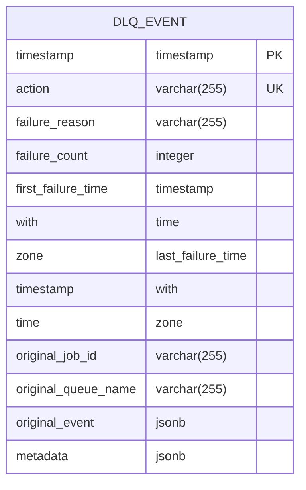
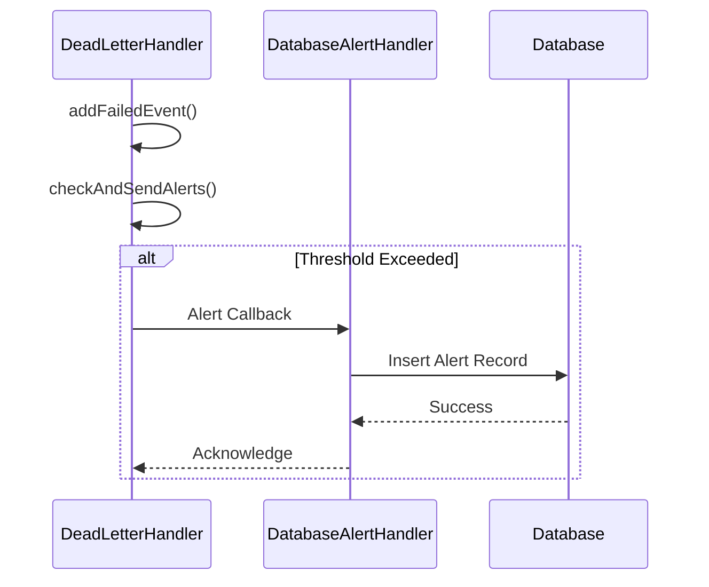

# Dead Letter Queue Handling

<cite>
**Referenced Files in This Document**   
- [dead-letter-queue.ts](file://packages/audit/src/queue/dead-letter-queue.ts)
- [database-error-logger.ts](file://packages/audit/src/error/database-error-logger.ts)
- [database-alert-handler.ts](file://packages/audit/src/monitor/database-alert-handler.ts)
- [archival-cli.ts](file://packages/audit/src/archival/archival-cli.ts)
- [error-handling.ts](file://packages/audit/src/error/error-handling.ts)
- [0004_snapshot.json](file://packages/audit-db/drizzle/migrations/meta/0004_snapshot.json)
</cite>

## Table of Contents
1. [Dead Letter Queue Overview](#dead-letter-queue-overview)
2. [DLQ Message Structure](#dlq-message-structure)
3. [Error Classification and DLQ Routing](#error-classification-and-dlq-routing)
4. [Alert Integration with Database Alert Handler](#alert-integration-with-database-alert-handler)
5. [Operational Procedures](#operational-procedures)
6. [Test Examples and Recovery Workflows](#test-examples-and-recovery-workflows)

## Dead Letter Queue Overview

The Dead Letter Queue (DLQ) system in the audit framework provides a critical safety net for events that fail processing after exhausting their retry attempts. When an audit event cannot be successfully processed due to persistent errors, it is routed to the dead-letter-queue for isolation, analysis, and potential recovery. This prevents the loss of important audit data and enables systematic troubleshooting of recurring issues.

The DLQ implementation is built on a robust queuing system that ensures failed events are preserved with comprehensive metadata about their failure context. The system automatically monitors the DLQ and can trigger alerts when failure thresholds are exceeded, enabling proactive incident response. Events in the DLQ are retained for analysis and can be manually reprocessed once the underlying issues have been resolved.

**Section sources**
- [dead-letter-queue.ts](file://packages/audit/src/queue/dead-letter-queue.ts#L1-L50)

## DLQ Message Structure

Dead letter queue messages contain comprehensive information about the failed event, including the original payload, failure details, retry history, and timestamps. This rich context enables effective analysis and troubleshooting of processing failures.

### DeadLetterEvent Interface

The structure of DLQ messages is defined by the `DeadLetterEvent` interface, which includes the following properties:

```typescript
export interface DeadLetterEvent {
	originalEvent: AuditLogEvent
	failureReason: string
	failureCount: number
	firstFailureTime: string
	lastFailureTime: string
	originalJobId?: string
	originalQueueName?: string
	metadata: DeadLetterEventMetadata
}
```

### Message Fields

The DLQ message structure includes the following key fields:

- **originalEvent**: The complete original audit event payload that failed processing
- **failureReason**: A descriptive string explaining why the event processing failed
- **failureCount**: The number of retry attempts that were made before routing to DLQ
- **firstFailureTime**: Timestamp of the first failure attempt (ISO 8601 format)
- **lastFailureTime**: Timestamp of the most recent failure attempt (ISO 8601 format)
- **originalJobId**: The identifier of the original processing job (optional)
- **originalQueueName**: The name of the original queue from which the event came (optional)
- **metadata**: Additional structured information about the failure

### Metadata Structure

The metadata field contains detailed diagnostic information in the `DeadLetterEventMetadata` interface:

```typescript
export interface DeadLetterEventMetadata {
	errorStack?: string
	retryHistory: Array<{
		attempt: number
		timestamp: string
		error: string
	}>
}
```

This includes:
- **errorStack**: The full stack trace of the error (when available)
- **retryHistory**: An array of objects documenting each retry attempt with attempt number, timestamp, and error message

### Database Schema

The DLQ events are also persisted in the database with the following schema structure:



**Diagram sources**
- [0004_snapshot.json](file://packages/audit-db/drizzle/migrations/meta/0004_snapshot.json#L448-L496)

**Section sources**
- [dead-letter-queue.ts](file://packages/audit/src/queue/dead-letter-queue.ts#L36-L45)
- [0004_snapshot.json](file://packages/audit-db/drizzle/migrations/meta/0004_snapshot.json#L448-L496)

## Error Classification and DLQ Routing

The decision to route an event to the DLQ is determined by the error classification system implemented in the audit framework. This system analyzes errors that occur during event processing and determines whether they are retryable or should result in DLQ routing.

### Error Classification Rules

The error classification logic is defined in the `DEFAULT_ERROR_CLASSIFICATION_RULES` constant, which contains a set of pattern-based rules for categorizing errors:

```typescript
export const DEFAULT_ERROR_CLASSIFICATION_RULES: ErrorClassificationRule[] = [
	// Database errors
	{
		pattern: /database.*connection|connection.*database/i,
		category: 'DATABASE_ERROR',
		severity: 'HIGH',
		retryable: true,
		troubleshooting: {
			possibleCauses: [
				'Database server is down or unreachable',
				'Network connectivity issues',
				'Database connection pool exhausted',
				'Firewall blocking database connections',
			],
			suggestedActions: [
				'Check database server status',
				'Verify network connectivity',
				'Review connection pool configuration',
				'Check firewall rules',
			],
			relatedDocumentation: ['https://docs.postgresql.org/current/runtime-config-connection.html'],
		},
	},
	{
		pattern: /deadlock|lock.*timeout|constraint.*violation/i,
		category: 'DATABASE_ERROR',
		severity: 'MEDIUM',
		retryable: true,
		troubleshooting: {
			possibleCauses: [
				'Concurrent transactions accessing the same resources',
				'Long-running transactions holding locks',
				'Insufficient lock timeout settings',
			],
			suggestedActions: [
				'Implement retry logic with exponential backoff',
				'Optimize transaction scope and duration',
				'Adjust lock timeout settings',
			],
		},
	},
	// Network errors
	{
		pattern: /network.*error|connection.*reset|timeout/i,
		category: 'NETWORK_ERROR',
		severity: 'HIGH',
		retryable: true,
		troubleshooting: {
			possibleCauses: [
				'Network connectivity issues',
				'Firewall or security group blocking traffic',
				'High network latency or packet loss',
				'Transient network outages',
			],
			suggestedActions: [
				'Check network connectivity and routing',
				'Verify firewall and security group rules',
				'Monitor network performance metrics',
				'Implement circuit breaker pattern',
			],
		},
	},
	// Validation errors
	{
		pattern: /validation.*failed|invalid.*data|schema.*error/i,
		category: 'VALIDATION_ERROR',
		severity: 'LOW',
		retryable: false,
		troubleshooting: {
			possibleCauses: [
				'Invalid data format or structure',
				'Missing required fields',
				'Data type mismatches',
				'Schema validation failures',
			],
			suggestedActions: [
				'Validate data format and structure',
				'Check for missing required fields',
				'Ensure data types match schema requirements',
				'Update schema if necessary',
			],
		},
	},
]
```

### Retryable vs Non-Retryable Errors

The classification system distinguishes between retryable and non-retryable errors:

- **Retryable errors**: Transient issues that may resolve with subsequent attempts (e.g., database connection issues, network timeouts)
- **Non-retryable errors**: Permanent issues that will not resolve with retries (e.g., validation errors, data corruption)

Events experiencing retryable errors are subject to multiple processing attempts according to the configured retry policy. When the maximum retry count is reached, the event is routed to the DLQ regardless of the error type.

### DLQ Routing Logic

The actual routing to the DLQ is handled by the `addFailedEvent` method in the `DeadLetterHandler` class:

```typescript
async addFailedEvent(
	originalEvent: AuditLogEvent,
	error: Error,
	jobId?: string,
	queueName?: string,
	retryHistory: Array<{ attempt: number; timestamp: string; error: string }> = []
): Promise<void> {
	const deadLetterEvent: DeadLetterEvent = {
		originalEvent,
		failureReason: error.message,
		failureCount: retryHistory.length,
		firstFailureTime: retryHistory[0]?.timestamp || new Date().toISOString(),
		lastFailureTime: new Date().toISOString(),
		originalJobId: jobId,
		originalQueueName: queueName,
		metadata: {
			errorStack: error.stack,
			retryHistory,
		},
	}

	try {
		await this.dlQueue.add('dead-letter-event', deadLetterEvent, {
			removeOnComplete: false,
			removeOnFail: false,
			delay: 0,
		})

		console.warn(
			`[DeadLetterHandler] Added failed audit event to DLQ: ${originalEvent.action} (${error.message})`
		)

		// Check if we should send alerts
		await this.checkAndSendAlerts()
	} catch (dlError) {
		console.error(`[DeadLetterHandler] Failed to add event to dead letter queue:`, dlError)
		throw new Error(
			`Critical: Failed to add audit event to dead letter queue: ${dlError instanceof Error ? dlError.message : String(dlError)}`
		)
	}
}
```

This method is called when an event has failed processing after exhausting all retry attempts. It constructs a `DeadLetterEvent` with all relevant failure context and adds it to the DLQ for isolation and analysis.

**Section sources**
- [error-handling.ts](file://packages/audit/src/error/error-handling.ts#L110-L162)
- [dead-letter-queue.ts](file://packages/audit/src/queue/dead-letter-queue.ts#L76-L117)

## Alert Integration with Database Alert Handler

The DLQ system integrates with the database alert handler to trigger alerts when sustained failure patterns are detected. This integration enables proactive monitoring and response to systemic issues affecting audit event processing.

### Alert Callback Mechanism

The DLQ handler exposes an event-driven alert system through the `onAlert` and `removeAlertCallback` methods:

```typescript
/**
 * Adds an alert callback for DLQ threshold breaches
 */
onAlert(callback: (metrics: DeadLetterMetrics) => void): void {
	this.alertCallbacks.push(callback)
}

/**
 * Removes an alert callback
 */
removeAlertCallback(callback: (metrics: DeadLetterMetrics) => void): void {
	const index = this.alertCallbacks.indexOf(callback)
	if (index > -1) {
		this.alertCallbacks.splice(index, 1)
	}
}
```

These methods allow other components to subscribe to DLQ threshold breaches and receive notifications when the number of failed events exceeds configured thresholds.

### Alert Triggering Logic

The alert system checks for threshold breaches whenever a new failed event is added to the DLQ:

```typescript
/**
 * Checks if alerts should be sent based on DLQ metrics
 */
private async checkAndSendAlerts(): Promise<void> {
	const now = Date.now()
	if (now - this.lastAlertTime < this.ALERT_COOLDOWN) {
		return // Still in cooldown period
	}

	const metrics = await this.getMetrics()

	if (metrics.totalEvents >= this.config.alertThreshold) {
		this.lastAlertTime = now

		// Notify all alert callbacks
		for (const callback of this.alertCallbacks) {
			try {
				callback(metrics)
			} catch (error) {
				console.error('[DeadLetterHandler] Alert callback error:', error)
			}
		}

		console.warn(
			`[DeadLetterHandler] ALERT: Dead letter queue has ${metrics.totalEvents} events (threshold: ${this.config.alertThreshold})`
		)
	}
}
```

The system implements a cooldown period to prevent alert flooding and only triggers alerts when the number of events in the DLQ exceeds the configured threshold.

### Database Alert Handler Integration

The database alert handler subscribes to DLQ alerts to create persistent alert records in the database:



**Diagram sources**
- [dead-letter-queue.ts](file://packages/audit/src/queue/dead-letter-queue.ts#L298-L346)
- [database-alert-handler.ts](file://packages/audit/src/monitor/database-alert-handler.ts#L431-L449)

**Section sources**
- [dead-letter-queue.ts](file://packages/audit/src/queue/dead-letter-queue.ts#L298-L346)

## Operational Procedures

This section outlines the operational procedures for monitoring, inspecting, and reprocessing messages in the dead letter queue.

### DLQ Monitoring

The DLQ can be monitored through several mechanisms:

1. **Metrics collection**: The `getMetrics` method provides comprehensive statistics about the current state of the DLQ:
   - Total number of events
   - Number of events that failed today
   - Oldest and newest failure timestamps
   - Top failure reasons with counts

2. **Alerting**: As described in the previous section, alerts are triggered when the DLQ size exceeds configured thresholds.

3. **Database queries**: Since DLQ events are persisted in the database, they can be queried directly using standard SQL queries with appropriate filtering.

### Message Inspection

Messages in the DLQ can be inspected through the archival CLI tool, which provides commands for retrieving and examining archived data:

```bash
# Retrieve archived data for investigation
audit-archival retrieve \
  --archive-id dlq-2023-01-01 \
  --date-range "2023-01-01,2023-01-02" \
  --classification DATABASE_ERROR \
  --output dlq-analysis.json
```

The retrieved data includes the complete original event payload, failure context, and retry history, enabling thorough analysis of the root cause.

### Manual Reprocessing

Failed events can be manually reprocessed once the underlying issues have been resolved. The archival CLI provides functionality for this:

```bash
# Process pending DLQ events
audit-archival process-pending-dlq
```

Alternatively, specific events can be retrieved and reprocessed programmatically:

```typescript
// Example of manual reprocessing workflow
const result = await archivalService.retrieveArchivedData({
  archiveId: 'dlq-2023-01-01',
  classification: 'DATABASE_ERROR',
})

for (const event of result.events) {
  try {
    // Attempt to reprocess the original event
    await auditService.processEvent(event.originalEvent)
    
    // If successful, mark as resolved in DLQ
    await dlqHandler.markAsResolved(event.id)
  } catch (error) {
    // Log the continued failure
    console.error(`Reprocessing failed for event ${event.id}:`, error)
  }
}
```

### Archival CLI Commands

The archival CLI provides several commands for DLQ management:

```bash
# Show archive statistics (including DLQ metrics)
audit-archival stats

# Validate archive integrity (including DLQ archives)
audit-archival validate

# Clean up old archives (including aged DLQ entries)
audit-archival cleanup --dry-run
```

**Section sources**
- [archival-cli.ts](file://packages/audit/src/archival/archival-cli.ts#L0-L357)

## Test Examples and Recovery Workflows

This section provides examples from test cases that demonstrate error scenarios leading to DLQ routing and the corresponding recovery workflows.

### Test Scenario: Database Timeout Errors

The following test demonstrates how database timeout errors lead to DLQ routing:

```typescript
it('should route events with database timeout errors to DLQ', async () => {
  // Mock a database timeout error
  const dbError = new Error('Database timeout after 30s')
  dbError.name = 'TimeoutError'
  
  // Simulate multiple processing attempts
  const retryHistory = [
    { attempt: 1, timestamp: '2023-01-01T10:00:00.000Z', error: 'Connection timeout' },
    { attempt: 2, timestamp: '2023-01-01T10:01:00.000Z', error: 'Query timeout' },
    { attempt: 3, timestamp: '2023-01-01T10:02:00.000Z', error: 'Transaction timeout' },
  ]
  
  // Add the failed event to DLQ
  await deadLetterHandler.addFailedEvent(mockAuditEvent, dbError, 'job-123', 'audit-queue', retryHistory)
  
  // Verify the event was added to DLQ
  const jobs = await deadLetterHandler.dlQueue.getJobs(['waiting'])
  expect(jobs).toHaveLength(1)
  
  // Verify the DLQ event structure
  const dlqEvent = jobs[0].data
  expect(dlqEvent.failureReason).toBe('Database timeout after 30s')
  expect(dlqEvent.failureCount).toBe(3)
  expect(dlqEvent.metadata.retryHistory).toEqual(retryHistory)
})
```

### Test Scenario: Validation Errors

The following test demonstrates how validation errors are handled:

```typescript
it('should handle validation errors in DLQ', async () => {
  const validationError = new Error('Validation failed: missing required field "userId"')
  
  await deadLetterHandler.addFailedEvent(invalidAuditEvent, validationError)
  
  const metrics = await deadLetterHandler.getMetrics()
  expect(metrics.topFailureReasons).toContainEqual({
    reason: 'Validation failed: missing required field "userId"',
    count: 1
  })
})
```

### Recovery Workflow

The following example demonstrates a complete recovery workflow:

```typescript
it('should support DLQ recovery workflow', async () => {
  // 1. Simulate failures that route events to DLQ
  for (let i = 0; i < 5; i++) {
    await deadLetterHandler.addFailedEvent(
      { ...mockAuditEvent, id: `event-${i}` },
      new Error('Database connection failed'),
      `job-${i}`
    )
  }
  
  // 2. Verify DLQ contains the failed events
  const metrics = await deadLetterHandler.getMetrics()
  expect(metrics.totalEvents).toBe(5)
  
  // 3. Simulate issue resolution (e.g., database restored)
  mockDatabase.reconnect()
  
  // 4. Retrieve and reprocess DLQ events
  const waitingJobs = await deadLetterHandler.dlQueue.getJobs(['waiting'])
  for (const job of waitingJobs) {
    try {
      // Attempt to reprocess the original event
      await auditProcessor.process(job.data.originalEvent)
      
      // Remove from DLQ if successful
      await job.remove()
    } catch (error) {
      // Log and keep in DLQ if still failing
      console.error(`Still failing:`, error)
    }
  }
  
  // 5. Verify DLQ is empty after successful recovery
  const finalMetrics = await deadLetterHandler.getMetrics()
  expect(finalMetrics.totalEvents).toBe(0)
})
```

### Alert Threshold Testing

The following test demonstrates the alert threshold mechanism:

```typescript
it('should trigger alerts when DLQ threshold is exceeded', async () => {
  const alertCallback = vi.fn()
  deadLetterHandler.onAlert(alertCallback)
  
  // Add events to exceed threshold
  for (let i = 0; i < 6; i++) {
    await deadLetterHandler.addFailedEvent(mockAuditEvent, new Error('Test error'))
  }
  
  // Verify alert was triggered
  expect(alertCallback).toHaveBeenCalledWith(
    expect.objectContaining({
      totalEvents: 6,
      topFailureReasons: [
        { reason: 'Test error', count: 6 }
      ]
    })
  )
})
```

These test examples illustrate the complete lifecycle of events in the DLQ system, from failure and routing to analysis and recovery.

**Section sources**
- [dead-letter-queue.test.ts](file://packages/audit/src/__tests__/dead-letter-queue.test.ts#L135-L184)
- [dead-letter-queue.test.ts](file://packages/audit/src/__tests__/dead-letter-queue.test.ts#L182-L231)
- [dead-letter-queue.test.ts](file://packages/audit/src/__tests__/dead-letter-queue.test.ts#L227-L269)