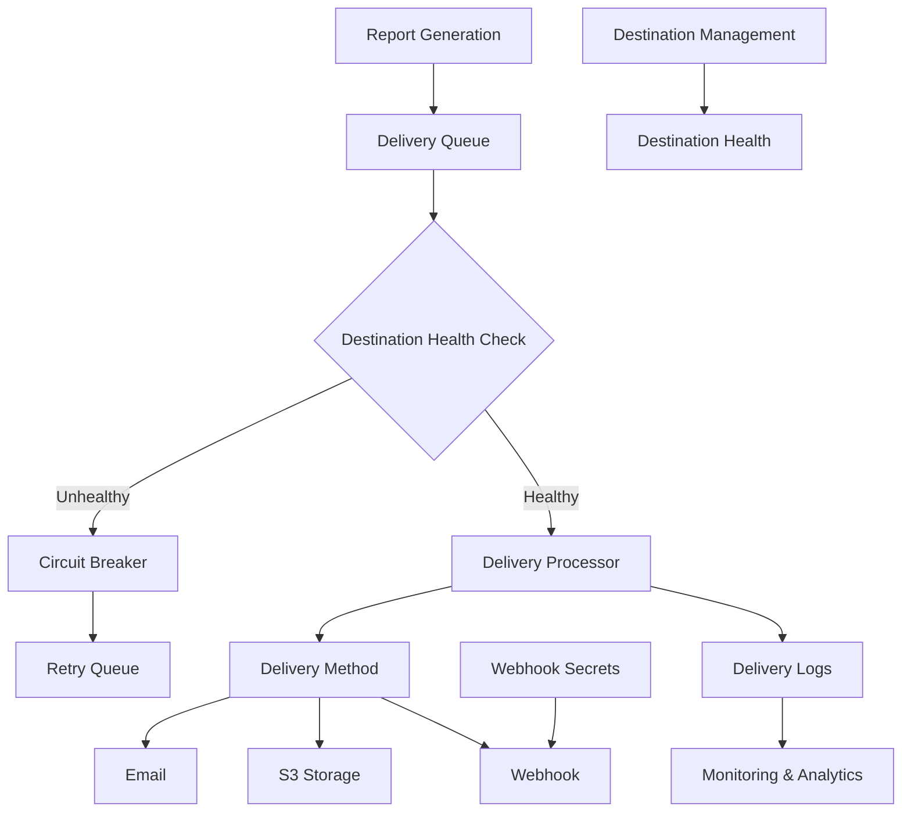
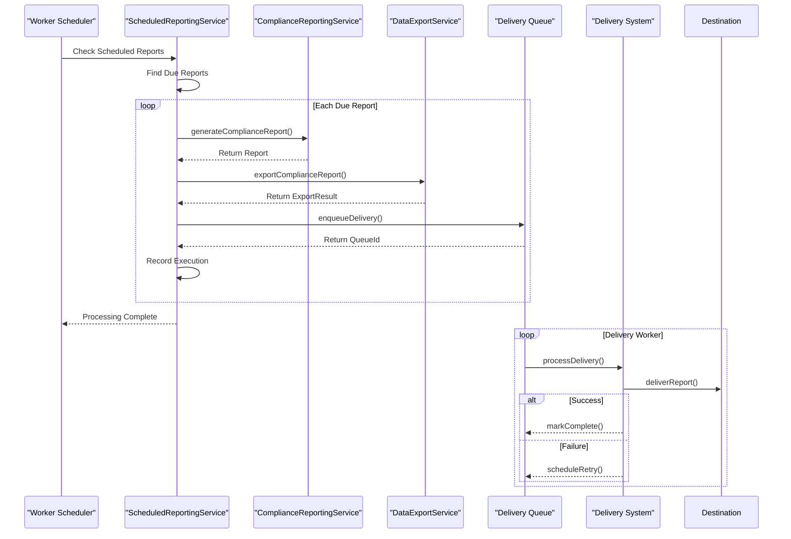

# Persistence Integration

<cite>
**Referenced Files in This Document**   
- [schema.ts](file://packages\audit-db\src\db\schema.ts) - *Updated in recent commit*
- [0017_past_bishop.sql](file://packages\audit-db\drizzle\migrations\0017_past_bishop.sql) - *Added in recent commit*
- [scheduled-reporting.ts](file://packages\audit\src\report\scheduled-reporting.ts) - *Updated in recent commit*
</cite>

## Update Summary
- Added documentation for new delivery system database schema and tables
- Updated compliance reporting system to reflect new delivery destinations and health monitoring
- Enhanced scheduled reporting section with delivery queue and health monitoring details
- Added new section on delivery system architecture and components
- Updated source tracking with new database schema files and migration scripts

## Table of Contents
1. [Introduction](#introduction)
2. [Delivery System Architecture](#delivery-system-architecture)
3. [Database Schema for Delivery System](#database-schema-for-delivery-system)
4. [Scheduled Reporting with Worker Services](#scheduled-reporting-with-worker-services)
5. [Compliance Reporting System](#compliance-reporting-system)

## Introduction
The Persistence Integration documentation has been updated to reflect recent changes in the audit system's delivery infrastructure. This update focuses on the new delivery system database schema, which enhances the compliance reporting capabilities with improved delivery tracking, health monitoring, and destination management. The changes support more robust scheduled reporting workflows and provide better visibility into delivery operations.

The new delivery system components were introduced through a database migration that added several tables for managing delivery destinations, tracking delivery logs, implementing a delivery queue, monitoring destination health, and managing webhook secrets. These changes enable more reliable and secure delivery of compliance reports and audit data exports.

**Section sources**
- [schema.ts](file://packages\audit-db\src\db\schema.ts) - *Updated in recent commit*
- [0017_past_bishop.sql](file://packages\audit-db\drizzle\migrations\0017_past_bishop.sql) - *Added in recent commit*

## Delivery System Architecture
The delivery system architecture has been enhanced with new components that provide reliable, secure, and monitored delivery of compliance reports and audit data. The system now includes destination management, delivery queuing, health monitoring, and secret management for secure webhook communications.

The architecture follows a queue-based pattern where delivery requests are processed asynchronously, allowing for retry mechanisms, priority handling, and circuit breaker patterns to ensure delivery reliability. Each delivery is tracked through its lifecycle from queuing to successful delivery or failure, with comprehensive logging and monitoring.



**Diagram sources**
- [schema.ts](file://packages\audit-db\src\db\schema.ts) - *Updated in recent commit*

## Database Schema for Delivery System
The delivery system database schema has been expanded with five new tables that provide comprehensive delivery management capabilities. These tables were added in migration `0017_past_bishop.sql` and are defined in the `schema.ts` file.

### Delivery Destinations
The `deliveryDestinations` table stores configuration for delivery destinations, supporting multiple delivery methods including email, S3, FTP, and webhooks.

```typescript
export const deliveryDestinations = pgTable(
	'delivery_destinations',
	{
		id: serial('id').primaryKey(),
		organizationId: varchar('organization_id', { length: 255 }).notNull(),
		type: varchar('type', { length: 50 }).notNull(), // e.g., 'email', 's3', 'ftp'
		label: varchar('label', { length: 255 }).notNull(), // Human-readable label
		description: text('description'),
		icon: varchar('icon', { length: 255 }), // URL or icon name
		instructions: text('instructions'), // Setup or usage instructions
		disabled: varchar('disabled', { length: 10 }).notNull().default('false'),
		disabledAt: timestamp('disabled_at', { withTimezone: true, mode: 'string' }),
		disabledBy: varchar('disabled_by', { length: 255 }),
		countUsage: integer('count_usage').notNull().default(0), // Usage count
		lastUsedAt: timestamp('last_used_at', { withTimezone: true, mode: 'string' }),
		config: jsonb('config').notNull(), // Configuration details as JSON
		createdAt: timestamp('created_at', { withTimezone: true, mode: 'string' })
			.notNull()
			.defaultNow(),
		updatedAt: timestamp('updated_at', { withTimezone: true, mode: 'string' })
			.notNull()
			.defaultNow(),
	},
	(table) => {
		return [
			index('delivery_destinations_type_idx').on(table.type),
			index('delivery_destinations_organization_id_idx').on(table.organizationId),
			index('delivery_destinations_disabled_idx').on(table.disabled),
			index('delivery_destinations_last_used_at_idx').on(table.lastUsedAt),
			uniqueIndex('delivery_destinations_org_label_unique').on(table.organizationId, table.label),
			index('delivery_destinations_created_at_idx').on(table.createdAt),
			index('delivery_destinations_updated_at_idx').on(table.updatedAt),
		]
	}
)
```

**Section sources**
- [schema.ts](file://packages\audit-db\src\db\schema.ts#L712-L753) - *Updated in recent commit*
- [0017_past_bishop.sql](file://packages\audit-db\drizzle\migrations\0017_past_bishop.sql) - *Added in recent commit*

### Delivery Logs
The `deliveryLogs` table tracks the status and history of all delivery attempts, providing audit trails and operational visibility.

```typescript
export const deliveryLogs = pgTable(
	'delivery_logs',
	{
		id: serial('id').primaryKey(),
		deliveryId: varchar('delivery_id', { length: 255 }).notNull(), // Global delivery identifier
		destinationId: integer('destination_id').notNull(),
		organizationId: varchar('organization_id', { length: 255 }).notNull(), // For organizational isolation
		objectDetails: jsonb('object_details').notNull(), // Details about the delivered object
		status: varchar('status', { length: 20 }).notNull(), // 'pending' | 'delivered' | 'failed' | 'retrying'
		attempts: jsonb('attempts').notNull().default('[]'), // Array of attempt timestamps
		lastAttemptAt: timestamp('last_attempt_at', { withTimezone: true, mode: 'string' }),
		deliveredAt: timestamp('delivered_at', { withTimezone: true, mode: 'string' }),
		failureReason: text('failure_reason'),
		crossSystemReference: varchar('cross_system_reference', { length: 255 }), // External tracking reference
		correlationId: varchar('correlation_id', { length: 255 }), // For request correlation
		idempotencyKey: varchar('idempotency_key', { length: 255 }), // For duplicate detection
		details: jsonb('details'), // Additional delivery details
		createdAt: timestamp('created_at', { withTimezone: true, mode: 'string' })
			.notNull()
			.defaultNow(),
		updatedAt: timestamp('updated_at', { withTimezone: true, mode: 'string' })
			.notNull()
			.defaultNow(),
	},
	(table) => {
		return [
			index('delivery_logs_delivery_id_idx').on(table.deliveryId),
			index('delivery_logs_destination_id_idx').on(table.destinationId),
			index('delivery_logs_organization_id_idx').on(table.organizationId),
			index('delivery_logs_status_idx').on(table.status),
			index('delivery_logs_attempts_idx').on(table.attempts),
			index('delivery_logs_last_attempt_at_idx').on(table.lastAttemptAt),
			index('delivery_logs_delivered_at_idx').on(table.deliveredAt),
			index('delivery_logs_cross_system_reference_idx').on(table.crossSystemReference),
			index('delivery_logs_correlation_id_idx').on(table.correlationId),
			index('delivery_logs_idempotency_key_idx').on(table.idempotencyKey),
			index('delivery_logs_created_at_idx').on(table.createdAt),
			index('delivery_logs_updated_at_idx').on(table.updatedAt),
			// Composite indexes for common queries
			index('delivery_logs_destination_status_idx').on(table.destinationId, table.status),
			index('delivery_logs_status_attempts_idx').on(table.status, table.attempts),
			index('delivery_logs_org_status_idx').on(table.organizationId, table.status),
			index('delivery_logs_org_created_idx').on(table.organizationId, table.createdAt),
		]
	}
)
```

**Section sources**
- [schema.ts](file://packages\audit-db\src\db\schema.ts#L755-L818) - *Updated in recent commit*

### Delivery Queue
The `deliveryQueue` table implements a queue-based processing system for deliveries, supporting priority handling and retry mechanisms.

```typescript
export const deliveryQueue = pgTable(
	'delivery_queue',
	{
		id: varchar('id', { length: 255 }).primaryKey(),
		organizationId: varchar('organization_id', { length: 255 }).notNull(),
		destinationId: integer('destination_id').notNull(),
		payload: jsonb('payload').notNull(),
		priority: integer('priority').notNull().default(0), // 0-10, higher = more priority
		scheduledAt: timestamp('scheduled_at', { withTimezone: true, mode: 'string' }).notNull(),
		processedAt: timestamp('processed_at', { withTimezone: true, mode: 'string' }),
		status: varchar('status', { length: 20 }).notNull().default('pending'), // pending, processing, completed, failed
		correlationId: varchar('correlation_id', { length: 255 }),
		idempotencyKey: varchar('idempotency_key', { length: 255 }),
		retryCount: integer('retry_count').notNull().default(0),
		maxRetries: integer('max_retries').notNull().default(5),
		nextRetryAt: timestamp('next_retry_at', { withTimezone: true, mode: 'string' }),
		metadata: jsonb('metadata').notNull().default('{}'),
		createdAt: timestamp('created_at', { withTimezone: true, mode: 'string' })
			.notNull()
			.defaultNow(),
		updatedAt: timestamp('updated_at', { withTimezone: true, mode: 'string' })
			.notNull()
			.defaultNow(),
	},
	(table) => {
		return [
			index('delivery_queue_organization_id_idx').on(table.organizationId),
			index('delivery_queue_destination_id_idx').on(table.destinationId),
			index('delivery_queue_status_idx').on(table.status),
			index('delivery_queue_priority_idx').on(table.priority),
			index('delivery_queue_scheduled_at_idx').on(table.scheduledAt),
			index('delivery_queue_next_retry_at_idx').on(table.nextRetryAt),
			index('delivery_queue_correlation_id_idx').on(table.correlationId),
			index('delivery_queue_idempotency_key_idx').on(table.idempotencyKey),
			index('delivery_queue_created_at_idx').on(table.createdAt),
			// Composite indexes for queue processing
			index('delivery_queue_status_priority_idx').on(table.status, table.priority),
			index('delivery_queue_status_scheduled_idx').on(table.status, table.scheduledAt),
			index('delivery_queue_org_status_idx').on(table.organizationId, table.status),
			index('delivery_queue_retry_scheduled_idx').on(table.nextRetryAt, table.status),
		]
	}
)
```

**Section sources**
- [schema.ts](file://packages\audit-db\src\db\schema.ts#L824-L866) - *Updated in recent commit*

### Destination Health
The `destinationHealth` table monitors the health and performance of delivery destinations, implementing circuit breaker patterns.

```typescript
export const destinationHealth = pgTable(
	'destination_health',
	{
		destinationId: integer('destination_id').primaryKey(),
		status: varchar('status', { length: 20 }).notNull(), // healthy, degraded, unhealthy, disabled
		lastCheckAt: timestamp('last_check_at', { withTimezone: true, mode: 'string' }).notNull(),
		consecutiveFailures: integer('consecutive_failures').notNull().default(0),
		totalFailures: integer('total_failures').notNull().default(0),
		totalDeliveries: integer('total_deliveries').notNull().default(0),
		successRate: varchar('success_rate', { length: 10 }).notNull().default('0'), // Percentage as string
		averageResponseTime: integer('average_response_time'), // milliseconds
		lastFailureAt: timestamp('last_failure_at', { withTimezone: true, mode: 'string' }),
		lastSuccessAt: timestamp('last_success_at', { withTimezone: true, mode: 'string' }),
		disabledAt: timestamp('disabled_at', { withTimezone: true, mode: 'string' }),
		disabledReason: text('disabled_reason'),
		circuitBreakerState: varchar('circuit_breaker_state', { length: 20 })
			.notNull()
			.default('closed'), // closed, open, half-open
		circuitBreakerOpenedAt: timestamp('circuit_breaker_opened_at', {
			withTimezone: true,
			mode: 'string',
		}),
		metadata: jsonb('metadata').notNull().default('{}'),
		updatedAt: timestamp('updated_at', { withTimezone: true, mode: 'string' })
			.notNull()
			.defaultNow(),
	},
	(table) => {
		return [
			index('destination_health_status_idx').on(table.status),
			index('destination_health_last_check_at_idx').on(table.lastCheckAt),
			index('destination_health_consecutive_failures_idx').on(table.consecutiveFailures),
			index('destination_health_success_rate_idx').on(table.successRate),
			index('destination_health_circuit_breaker_state_idx').on(table.circuitBreakerState),
			index('destination_health_last_failure_at_idx').on(table.lastFailureAt),
			index('destination_health_last_success_at_idx').on(table.lastSuccessAt),
			index('destination_health_disabled_at_idx').on(table.disabledAt),
			index('destination_health_updated_at_idx').on(table.updatedAt),
		]
	}
)
```

**Section sources**
- [schema.ts](file://packages\audit-db\src\db\schema.ts#L872-L912) - *Updated in recent commit*

### Webhook Secrets
The `webhookSecrets` table manages secure secrets for webhook deliveries, supporting secret rotation.

```typescript
export const webhookSecrets = pgTable(
	'webhook_secrets',
	{
		id: varchar('id', { length: 255 }).primaryKey(),
		destinationId: integer('destination_id').notNull(),
		secretKey: varchar('secret_key', { length: 255 }).notNull(), // encrypted
		algorithm: varchar('algorithm', { length: 50 }).notNull().default('HMAC-SHA256'),
		isActive: varchar('is_active', { length: 10 }).notNull().default('true'),
		isPrimary: varchar('is_primary', { length: 10 }).notNull().default('false'), // For rotation support
		expiresAt: timestamp('expires_at', { withTimezone: true, mode: 'string' }),
		rotatedAt: timestamp('rotated_at', { withTimezone: true, mode: 'string' }),
		usageCount: integer('usage_count').notNull().default(0),
		lastUsedAt: timestamp('last_used_at', { withTimezone: true, mode: 'string' }),
		createdAt: timestamp('created_at', { withTimezone: true, mode: 'string' })
			.notNull()
			.defaultNow(),
		createdBy: varchar('created_by', { length: 255 }),
	},
	(table) => {
		return [
			index('webhook_secrets_destination_id_idx').on(table.destinationId),
			index('webhook_secrets_is_active_idx').on(table.isActive),
			index('webhook_secrets_is_primary_idx').on(table.isPrimary),
			index('webhook_secrets_expires_at_idx').on(table.expiresAt),
			index('webhook_secrets_created_at_idx').on(table.createdAt),
			index('webhook_secrets_last_used_at_idx').on(table.lastUsedAt),
			// Composite indexes for secret management
			index('webhook_secrets_destination_active_idx').on(table.destinationId, table.isActive),
			index('webhook_secrets_destination_primary_idx').on(table.destinationId, table.isPrimary),
		]
	}
)
```

**Section sources**
- [schema.ts](file://packages\audit-db\src\db\schema.ts#L918-L949) - *Updated in recent commit*

## Scheduled Reporting with Worker Services
The scheduled reporting system has been enhanced to leverage the new delivery infrastructure, providing more reliable and observable report delivery.

### Architecture Updates
The scheduled reporting workflow now integrates with the delivery queue and health monitoring system:



**Diagram sources**
- [scheduled-reporting.ts](file://packages\audit\src\report\scheduled-reporting.ts) - *Updated in recent commit*
- [schema.ts](file://packages\audit-db\src\db\schema.ts) - *Updated in recent commit*

### Delivery Configuration
The delivery configuration in scheduled reports now supports the enhanced delivery system:

```typescript
interface DeliveryConfig {
    method: 'email' | 'webhook' | 'storage' | 'sftp' | 'download'
    email?: {
        smtpConfig: SMTPConfig
        from: string
        subject: string
        bodyTemplate: string
        attachmentName: string
        recipients: string[]
    }
    webhook?: {
        url: string
        method: 'POST' | 'PUT'
        headers: Record<string, string>
        timeout: number
        retryConfig: {
            maxRetries: number
            backoffMultiplier: number
            maxBackoffDelay: number
        }
        secretId?: string // References webhookSecrets.id
    }
    storage?: {
        type: 's3' | 'gcp' | 'azure'
        path: string
        region?: string
        bucket: string
    }
    sftp?: {
        host: string
        port: number
        username: string
        privateKey?: string
        remotePath: string
    }
}
```

**Section sources**
- [scheduled-reporting.ts](file://packages\audit\src\report\scheduled-reporting.ts) - *Updated in recent commit*

## Compliance Reporting System
The compliance reporting system has been updated to integrate with the new delivery infrastructure, enhancing reliability and observability.

### Report Delivery Enhancements
The reporting system now uses the delivery queue for asynchronous processing:

```typescript
async deliverReport(
    config: ScheduledReportConfig,
    reportResult: ExportResult,
    execution: ReportExecution
): Promise<void> {
    const deliveryAttempt: DeliveryAttempt = {
        attemptId: this.generateId('delivery'),
        timestamp: new Date().toISOString(),
        status: 'pending',
        method: config.delivery.method,
        target: this.getDeliveryTarget(config.delivery),
        retryCount: 0,
    }

    execution.deliveryAttempts.push(deliveryAttempt)

    try {
        // Enqueue delivery instead of direct delivery
        await this.queueDelivery(config, reportResult, deliveryAttempt)
        deliveryAttempt.status = 'queued'
    } catch (error) {
        deliveryAttempt.status = 'failed'
        deliveryAttempt.error = error instanceof Error ? error.message : 'Unknown error'
        throw error
    }
}
```

**Section sources**
- [scheduled-reporting.ts](file://packages\audit\src\report\scheduled-reporting.ts) - *Updated in recent commit*

### Health Monitoring Integration
The system checks destination health before attempting delivery:

```typescript
async checkDestinationHealth(destinationId: number): Promise<boolean> {
    const healthRecord = await this.db
        .select()
        .from(destinationHealth)
        .where(eq(destinationHealth.destinationId, destinationId))
        .limit(1)

    if (healthRecord.length === 0) {
        return true // Assume healthy if no record
    }

    const health = healthRecord[0]
    return health.status === 'healthy' && health.circuitBreakerState === 'closed'
}
```

**Section sources**
- [schema.ts](file://packages\audit-db\src\db\schema.ts) - *Updated in recent commit*