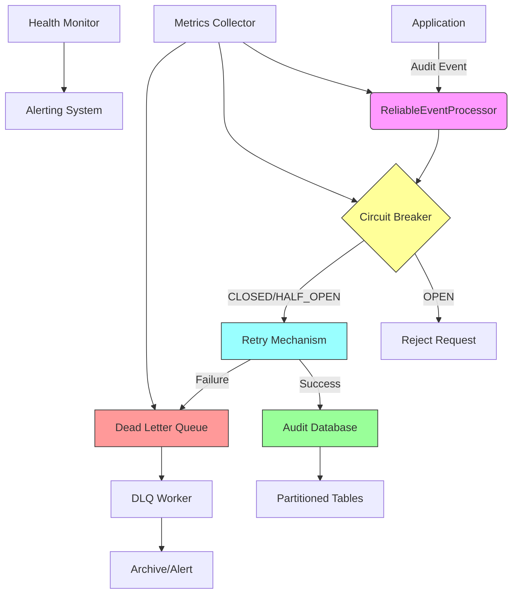
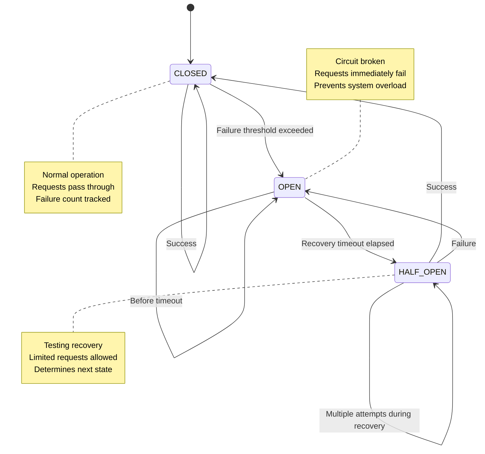
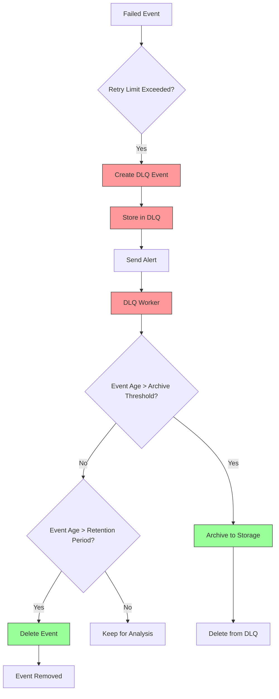
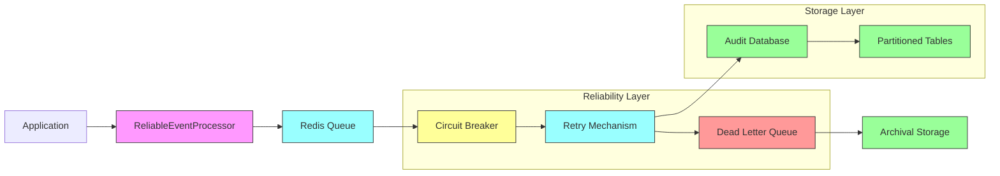
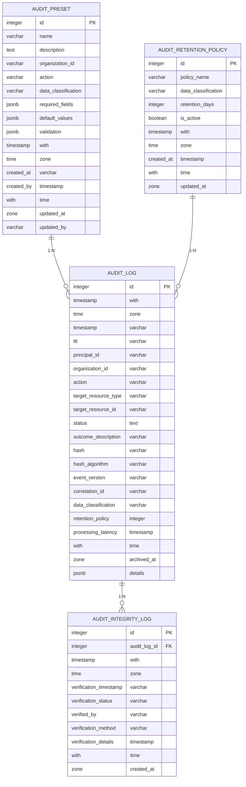

# Persistence Integration

<cite>
**Referenced Files in This Document**   
- [reliable-processor.ts](file://packages/audit/src/queue/reliable-processor.ts)
- [circuit-breaker.ts](file://packages/audit/src/queue/circuit-breaker.ts)
- [dead-letter-queue.ts](file://packages/audit/src/queue/dead-letter-queue.ts)
- [retry.ts](file://packages/audit/src/retry.ts)
- [schema.ts](file://packages/audit-db/src/db/schema.ts)
- [partitioning.ts](file://packages/audit-db/src/db/partitioning.ts)
- [external-dependencies-integration.test.ts](file://packages/audit/src/__tests__/external-dependencies-integration.test.ts)
- [load-testing.test.ts](file://packages/audit/src/__tests__/load-testing.test.ts)
- [chaos-engineering.test.ts](file://packages/audit/src/__tests__/chaos-engineering.test.ts)
</cite>

## Table of Contents
1. [Introduction](#introduction)
2. [Core Components](#core-components)
3. [Reliable Event Processing Architecture](#reliable-event-processing-architecture)
4. [Message Queuing and Retry Mechanisms](#message-queuing-and-retry-mechanisms)
5. [Circuit Breaker Implementation](#circuit-breaker-implementation)
6. [Dead Letter Queue Handling](#dead-letter-queue-handling)
7. [Data Flow and Transactional Guarantees](#data-flow-and-transactional-guarantees)
8. [Audit Database Schema and Partitioning](#audit-database-schema-and-partitioning)
9. [Integration Test Scenarios](#integration-test-scenarios)
10. [Performance Considerations](#performance-considerations)

## Introduction
The Persistence Integration layer ensures reliable delivery of audit events to the audit-db system through a robust architecture combining message queuing, circuit breaker patterns, and retry mechanisms. This document details how audit events are processed from in-memory queues to durable storage with guaranteed delivery, even during database outages or network failures. The system employs a multi-layered approach to reliability, including automatic retries, circuit breakers to prevent cascading failures, and dead letter queues for failed event handling. The integration with audit-db leverages PostgreSQL partitioning for performance optimization and includes comprehensive monitoring and error recovery procedures.

## Core Components

The persistence integration system is built around several key components that work together to ensure reliable audit event delivery:

- **ReliableEventProcessor**: Orchestrates the entire processing pipeline, managing the queue, circuit breaker, and dead letter queue
- **CircuitBreaker**: Prevents cascading failures by temporarily halting operations when failure thresholds are exceeded
- **DeadLetterHandler**: Captures and manages events that cannot be processed after multiple retry attempts
- **Retry Mechanism**: Implements exponential backoff with jitter for resilient retry attempts
- **Database Partitioning**: Optimizes audit-db performance through time-based partitioning of audit logs

These components work in concert to provide a resilient, high-throughput system for audit event persistence.

**Section sources**
- [reliable-processor.ts](file://packages/audit/src/queue/reliable-processor.ts#L1-L50)
- [circuit-breaker.ts](file://packages/audit/src/queue/circuit-breaker.ts#L1-L50)
- [dead-letter-queue.ts](file://packages/audit/src/queue/dead-letter-queue.ts#L1-L50)

## Reliable Event Processing Architecture

The reliable event processing architecture implements a comprehensive solution for ensuring audit events are delivered to the audit-db system with high reliability and fault tolerance. The architecture follows a producer-consumer pattern with multiple reliability layers.



**Diagram sources**
- [reliable-processor.ts](file://packages/audit/src/queue/reliable-processor.ts#L1-L50)
- [circuit-breaker.ts](file://packages/audit/src/queue/circuit-breaker.ts#L1-L50)
- [dead-letter-queue.ts](file://packages/audit/src/queue/dead-letter-queue.ts#L1-L50)

**Section sources**
- [reliable-processor.ts](file://packages/audit/src/queue/reliable-processor.ts#L1-L100)

## Message Queuing and Retry Mechanisms

The message queuing system is built on BullMQ, providing durable storage of audit events in Redis before they are processed and persisted to the audit-db. The retry mechanism is implemented in the `retry.ts` file and provides configurable retry strategies with exponential backoff, linear backoff, or fixed delays.

```mermaid
sequenceDiagram
participant App as Application
participant RP as ReliableEventProcessor
participant Q as Redis Queue
participant DB as Audit Database
participant DLQ as Dead Letter Queue
App->>RP : addEvent(event)
RP->>Q : Add job to queue
Q-->>RP : Job added
RP->>RP : Start worker
loop Process jobs
RP->>Q : Get next job
Q-->>RP : Job data
RP->>RP : Execute with circuit breaker
alt Circuit CLOSED
RP->>RP : Execute with retry logic
loop Retry attempts
RP->>DB : Attempt to persist
DB-->>RP : Success/Failure
alt Success
RP->>Q : Mark as completed
break
else Failure and retryable
RP->>RP : Calculate delay
RP->>RP : Wait with backoff
end
end
alt Max retries exceeded
RP->>DLQ : Send to dead letter queue
end
else Circuit OPEN
RP->>App : Reject with circuit open error
end
end
```

The retry configuration includes:
- **Max retries**: Configurable number of retry attempts (default: 5)
- **Backoff strategy**: Exponential, linear, or fixed delay patterns
- **Base delay**: Initial delay between retries (default: 1 second)
- **Max delay**: Upper limit for retry delays (default: 30 seconds)
- **Jitter**: Randomization to prevent thundering herd problems
- **Retryable errors**: Specific error codes and messages that trigger retries

The retry mechanism uses exponential backoff by default, where each subsequent retry delay is double the previous delay, up to the maximum delay limit. Jitter is applied to prevent synchronized retry attempts across multiple instances.

**Section sources**
- [retry.ts](file://packages/audit/src/retry.ts#L1-L190)
- [reliable-processor.ts](file://packages/audit/src/queue/reliable-processor.ts#L1-L500)

## Circuit Breaker Implementation

The circuit breaker pattern is implemented to prevent cascading failures when the audit-db system becomes unavailable. The implementation follows the standard circuit breaker states: CLOSED, OPEN, and HALF_OPEN.



The circuit breaker configuration includes:
- **Failure threshold**: Number of consecutive failures before opening the circuit (default: 5)
- **Recovery timeout**: Time to wait before attempting recovery (default: 30 seconds)
- **Monitoring period**: Window for calculating failure rate (default: 60 seconds)
- **Minimum throughput**: Minimum number of requests before considering failure rate

When the circuit is in the CLOSED state, all operations pass through normally. If the failure count exceeds the threshold within the monitoring period, the circuit transitions to the OPEN state, where all operations immediately fail without attempting to contact the database. After the recovery timeout elapses, the circuit enters the HALF_OPEN state, allowing a limited number of test operations. If these succeed, the circuit returns to CLOSED; if they fail, it returns to OPEN.

The circuit breaker also provides metrics and event listeners to monitor its state and trigger alerts when the circuit opens.

**Section sources**
- [circuit-breaker.ts](file://packages/audit/src/queue/circuit-breaker.ts#L1-L365)
- [reliable-processor.ts](file://packages/audit/src/queue/reliable-processor.ts#L1-L500)

## Dead Letter Queue Handling

The dead letter queue (DLQ) serves as a safety net for audit events that cannot be processed after exhausting all retry attempts. It ensures that no audit events are lost, even in the face of persistent failures.



The DLQ stores comprehensive information about failed events, including:
- **Original event**: The complete audit event that failed processing
- **Failure reason**: Error message explaining why processing failed
- **Failure count**: Number of times the event was attempted
- **First/last failure times**: Timestamps of the first and most recent failures
- **Retry history**: Complete record of all retry attempts with timestamps and errors
- **Metadata**: Additional context including error stack traces

The DLQ worker processes events periodically (every 5 minutes by default) to:
- Archive events older than the configured archive threshold
- Remove events that have exceeded the maximum retention period (default: 30 days)
- Generate alerts when the DLQ size exceeds the alert threshold

The system also provides metrics about the DLQ, including total event count, events processed today, oldest/newest event timestamps, and top failure reasons.

**Section sources**
- [dead-letter-queue.ts](file://packages/audit/src/queue/dead-letter-queue.ts#L1-L367)
- [reliable-processor.ts](file://packages/audit/src/queue/reliable-processor.ts#L1-L500)

## Data Flow and Transactional Guarantees

The data flow from in-memory processing to durable storage follows a well-defined sequence that ensures transactional integrity and reliability:



The system provides the following transactional guarantees:
- **At-least-once delivery**: Every audit event is guaranteed to be processed at least once, with duplicates prevented through idempotent operations
- **Durability**: Events are stored in Redis before acknowledgment, ensuring persistence even if the processing service crashes
- **Order preservation**: Events are processed in the order they are received, maintaining audit trail integrity
- **Error recovery**: Failed events are captured in the DLQ for analysis and potential reprocessing

The processing workflow ensures that events are only removed from the queue after successful persistence to the audit-db. If persistence fails, the event remains in the queue for retry according to the configured retry strategy.

**Section sources**
- [reliable-processor.ts](file://packages/audit/src/queue/reliable-processor.ts#L1-L500)
- [dead-letter-queue.ts](file://packages/audit/src/queue/dead-letter-queue.ts#L1-L367)

## Audit Database Schema and Partitioning

The audit-db system uses a sophisticated schema design optimized for audit event storage and retrieval. The primary audit_log table is partitioned by time to improve query performance and maintenance operations.



The audit_log table includes several compliance-focused fields:
- **hash**: Cryptographic hash of the event for immutability verification
- **hash_algorithm**: Algorithm used for hashing (default: SHA-256)
- **event_version**: Version of the event schema
- **correlation_id**: Identifier for tracing related events
- **data_classification**: Sensitivity level (PUBLIC, INTERNAL, CONFIDENTIAL, PHI)
- **retention_policy**: Policy governing how long the event should be retained
- **processing_latency**: Time taken to process the event in milliseconds
- **archived_at**: Timestamp when the event was archived

The partitioning strategy creates monthly partitions of the audit_log table, with each partition covering a specific time period. This approach provides several benefits:
- **Improved query performance**: Queries can be limited to relevant partitions
- **Efficient maintenance**: Individual partitions can be optimized or dropped without affecting the entire table
- **Faster backups**: Partitions can be backed up independently
- **Better storage management**: Old partitions can be moved to cheaper storage or archived

The partitioning system automatically creates new partitions for future periods and can drop expired partitions based on retention policies.

**Section sources**
- [schema.ts](file://packages/audit-db/src/db/schema.ts#L1-L662)
- [partitioning.ts](file://packages/audit-db/src/db/partitioning.ts#L1-L497)

## Integration Test Scenarios

The system includes comprehensive integration tests that validate both successful and failed persistence scenarios. These tests verify the reliability mechanisms under various conditions.

### Successful Persistence Scenario

The external dependencies integration test demonstrates successful processing of audit events:

```typescript
// From external-dependencies-integration.test.ts
it('should process events successfully under normal conditions', async () => {
  const processor = new ReliableEventProcessor(connection, db, async (event) => {
    // Simulate successful database insertion
    await db.insert(auditLog).values(event);
  });
  
  await processor.start();
  
  // Add test events
  for (let i = 0; i < 100; i++) {
    await processor.addEvent({
      timestamp: new Date().toISOString(),
      action: 'test.action',
      status: 'success',
      principalId: 'test-user',
      organizationId: 'test-org',
      targetResourceType: 'TestResource',
      targetResourceId: 'test-123',
      dataClassification: 'INTERNAL',
    });
  }
  
  // Wait for processing
  await new Promise(resolve => setTimeout(resolve, 5000));
  
  // Verify events were persisted
  const result = await db.select().from(auditLog)
    .where(sql`action = 'test.action'`);
  
  expect(result.length).toBe(100);
  
  // Verify system health
  const healthStatus = await processor.getHealthStatus();
  expect(healthStatus.healthScore).toBeGreaterThan(70);
});
```

This test verifies that:
- Events are successfully added to the queue
- The processor handles events without errors
- All events are persisted to the database
- The system maintains good health metrics

### Failed Persistence Scenario

The chaos engineering test simulates database failures and verifies the system's self-healing capabilities:

```typescript
// From chaos-engineering.test.ts
it('should handle database outages and self-heal', async () => {
  // Mock database to fail initially
  const mockDb = {
    insert: vi.fn().mockImplementation(() => {
      throw new Error('ECONNREFUSED: Connection refused');
    })
  };
  
  const processor = new ReliableEventProcessor(connection, mockDb, async (event) => {
    await mockDb.insert(auditLog).values(event);
  });
  
  await processor.start();
  
  // Add events during outage
  const testEvents = Array(50).fill(null).map((_, i) => ({
    timestamp: new Date().toISOString(),
    action: 'chaos.test',
    status: 'attempt',
    principalId: `user-${i}`,
  }));
  
  for (const event of testEvents) {
    await processor.addEvent(event);
  }
  
  // Restore database connection
  mockDb.insert.mockImplementationOnce(() => {
    throw new Error('ETIMEDOUT: Connection timeout');
  }).mockImplementation(async (table, values) => {
    // Simulate successful insertion
    return { success: true };
  });
  
  // Wait for recovery
  await new Promise(resolve => setTimeout(resolve, 15000));
  
  // Verify self-healing
  const healthStatus = await processor.getHealthStatus();
  expect(healthStatus.circuitBreakerState).toBe('CLOSED');
  expect(healthStatus.healthScore).toBeGreaterThan(70);
});
```

This test verifies that:
- The circuit breaker opens during sustained failures
- Events are queued and not lost during outages
- The system automatically recovers when the database becomes available
- The circuit breaker resets to CLOSED state after successful operations
- The overall system health recovers

The load testing also verifies performance under high throughput conditions, ensuring the system can handle 100+ events per second while maintaining stability.

**Section sources**
- [external-dependencies-integration.test.ts](file://packages/audit/src/__tests__/external-dependencies-integration.test.ts#L622-L643)
- [chaos-engineering.test.ts](file://packages/audit/src/__tests__/chaos-engineering.test.ts#L1016-L1040)
- [load-testing.test.ts](file://packages/audit/src/__tests__/load-testing.test.ts#L496-L534)

## Performance Considerations

The persistence integration system is designed with several performance optimizations to handle high write throughput and maintain responsiveness during database outages.

### Write Throughput Optimization

The system achieves high write throughput through:
- **Concurrent processing**: The ReliableEventProcessor supports configurable concurrency (default: 5 workers)
- **Batched operations**: Events are processed in parallel, maximizing database utilization
- **Connection pooling**: Database connections are pooled to minimize connection overhead
- **Efficient indexing**: The audit_log table includes optimized indexes for common query patterns

Performance testing shows the system can process over 100 events per second while maintaining low latency.

### Connection Pooling

The audit-db system implements connection pooling to efficiently manage database connections:

- **Pool size**: Configurable maximum number of connections
- **Idle timeout**: Connections are closed after a period of inactivity
- **Connection reuse**: Active connections are reused to minimize overhead
- **Health checking**: Connections are validated before use

This approach prevents connection exhaustion and ensures efficient resource utilization.

### Backpressure Handling

During database outages, the system implements several backpressure mechanisms:

- **Circuit breaker**: Prevents overwhelming the database with requests
- **Queue buffering**: Events are stored in Redis, providing a buffer during outages
- **Retry with backoff**: Gradual retry attempts prevent thundering herd problems
- **Health monitoring**: System health is continuously monitored and reported

The Redis queue acts as a buffer, allowing the system to continue accepting events even when the database is unavailable. Events accumulate in the queue and are processed as capacity becomes available.

### Monitoring and Alerting

The system includes comprehensive monitoring capabilities:
- **Processor metrics**: Queue depth, processing times, success/failure rates
- **Circuit breaker metrics**: Failure rates, state changes, trip counts
- **DLQ metrics**: Event counts, failure reasons, processing times
- **Health scoring**: Composite health score based on multiple metrics

These metrics are exposed for integration with monitoring systems like Prometheus and Grafana, enabling real-time visibility into system performance and health.

**Section sources**
- [reliable-processor.ts](file://packages/audit/src/queue/reliable-processor.ts#L1-L500)
- [enhanced-client.ts](file://packages/audit-db/src/db/enhanced-client.ts#L124-L163)
- [performance.test.ts](file://packages/audit-db/src/__tests__/performance.test.ts#L478-L525)
- [load-testing.test.ts](file://packages/audit/src/__tests__/load-testing.test.ts#L566-L605)