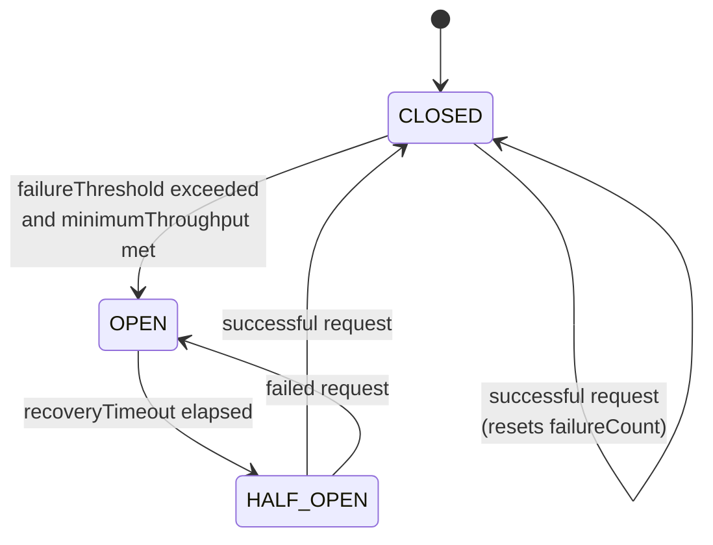
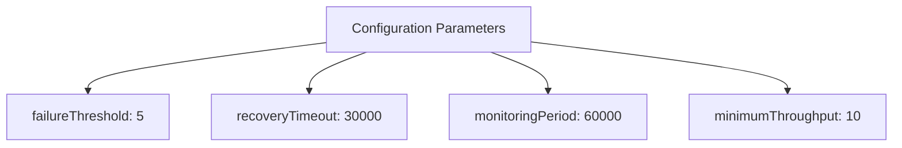
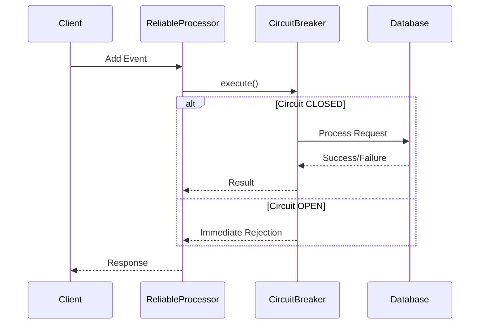
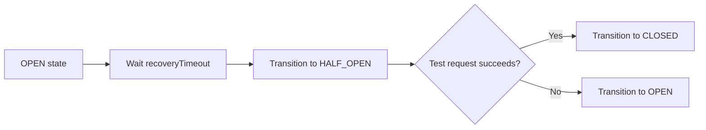
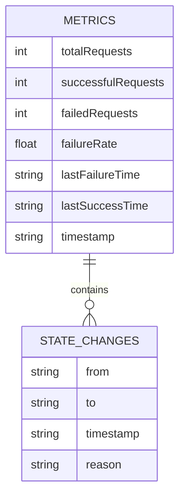

# Circuit Breaker Mechanism

<cite>
**Referenced Files in This Document**   
- [circuit-breaker.ts](file://packages/audit/src/queue/circuit-breaker.ts)
- [reliable-processor.ts](file://packages/audit/src/queue/reliable-processor.ts)
- [circuit-breaker.test.ts](file://packages/audit/src/__tests__/circuit-breaker.test.ts)
- [reliable-processor.test.ts](file://packages/audit/src/__tests__/reliable-processor.test.ts)
</cite>

## Table of Contents
1. [Introduction](#introduction)
2. [State Machine Design](#state-machine-design)
3. [Configuration Parameters](#configuration-parameters)
4. [Integration with Reliable Processor](#integration-with-reliable-processor)
5. [Test Examples](#test-examples)
6. [Metrics Collection and Observability](#metrics-collection-and-observability)
7. [Common Misconfigurations](#common-misconfigurations)
8. [Conclusion](#conclusion)

## Introduction
The Circuit Breaker mechanism is a critical resilience pattern implemented to prevent cascading failures in distributed systems, particularly during database outages. This document details the implementation of the circuit breaker pattern within the audit system, focusing on its state machine design, configuration parameters, integration with the reliable processor, test scenarios, metrics collection, and common misconfigurations. The implementation ensures system stability by isolating failing components and enabling graceful recovery.

**Section sources**
- [circuit-breaker.ts](file://packages/audit/src/queue/circuit-breaker.ts#L1-L50)

## State Machine Design
The circuit breaker operates using a finite state machine with three distinct states: CLOSED, OPEN, and HALF_OPEN. Each state governs the behavior of request handling and failure detection.

**Diagram sources**
- [circuit-breaker.ts](file://packages/audit/src/queue/circuit-breaker.ts#L39-L260)

### CLOSED State
In the CLOSED state, the circuit breaker allows all requests to pass through to the underlying service. It maintains a counter of consecutive failures. When a request succeeds, the failure counter is reset to zero. The circuit remains closed until the failure threshold is exceeded while meeting the minimum throughput requirement.

### OPEN State
When the failure threshold is exceeded, the circuit breaker transitions to the OPEN state. In this state, all incoming requests are immediately rejected without being forwarded to the underlying service. This prevents overwhelming a potentially degraded or unavailable database. The circuit remains open for a duration defined by the recovery timeout.

### HALF_OPEN State
After the recovery timeout elapses, the circuit breaker transitions to the HALF_OPEN state. In this state, a limited number of test requests are allowed to pass through to verify if the underlying service has recovered. If a test request succeeds, the circuit breaker transitions back to the CLOSED state. If a test request fails, the circuit returns to the OPEN state, and the recovery timeout is reset.

**Section sources**
- [circuit-breaker.ts](file://packages/audit/src/queue/circuit-breaker.ts#L39-L260)

## Configuration Parameters
The circuit breaker behavior is controlled by several configurable parameters that determine its sensitivity and recovery characteristics.

### Failure Threshold
The failure threshold defines the number of consecutive failures required to trip the circuit from CLOSED to OPEN state. The default value is 5 failures. This parameter should be set based on the expected error rate of the system and the desired sensitivity to failures.

### Recovery Timeout
The recovery timeout specifies the duration (in milliseconds) that the circuit remains OPEN before transitioning to HALF_OPEN state. The default value is 30,000 milliseconds (30 seconds). This timeout allows the underlying service time to recover from transient issues before test requests are sent.

### Minimum Throughput
The minimum throughput parameter sets the minimum number of requests required before the circuit breaker evaluates the failure rate. The default value is 10 requests. This prevents the circuit from opening due to a small number of initial failures when there isn't sufficient statistical significance.

### Success Threshold for HALF_OPEN
While not explicitly configured as a separate parameter, the success threshold for HALF_OPEN validation is implicitly set to require at least one successful request to close the circuit. The circuit breaker immediately returns to CLOSED state upon the first successful request in HALF_OPEN state.

**Diagram sources**
- [circuit-breaker.ts](file://packages/audit/src/queue/circuit-breaker.ts#L15-L30)

**Section sources**
- [circuit-breaker.ts](file://packages/audit/src/queue/circuit-breaker.ts#L15-L30)

## Integration with Reliable Processor
The circuit breaker is tightly integrated with the reliable processor to provide comprehensive protection for database operations during outages. This integration prevents overwhelming the database by implementing a multi-layered resilience strategy.

**Diagram sources**
- [reliable-processor.ts](file://packages/audit/src/queue/reliable-processor.ts#L150-L250)
- [circuit-breaker.ts](file://packages/audit/src/queue/circuit-breaker.ts#L100-L150)

The reliable processor wraps database operations with the circuit breaker's execute method. When the circuit is CLOSED, requests proceed normally with retry mechanisms. When the circuit is OPEN, requests are immediately rejected, preventing unnecessary load on the database. The integration also includes metrics collection and alerting when the circuit trips, enabling proactive monitoring of system health.

**Section sources**
- [reliable-processor.ts](file://packages/audit/src/queue/reliable-processor.ts#L150-L250)

## Test Examples
The implementation includes comprehensive tests that demonstrate the circuit breaker's behavior under various scenarios, including failure accumulation, trip conditions, and recovery behavior.

### Failure Accumulation and Trip Conditions
Tests verify that the circuit breaker accumulates failures and trips only when both the failure threshold and minimum throughput conditions are met. The circuit remains closed if the minimum throughput is not reached, even with multiple failures.

**Diagram sources**
- [circuit-breaker.test.ts](file://packages/audit/src/__tests__/circuit-breaker.test.ts#L150-L200)

### Recovery Behavior
Tests demonstrate the recovery process where the circuit transitions from OPEN to HALF_OPEN after the recovery timeout, allowing test requests to validate service availability. A successful test request closes the circuit, while a failure reopens it.

**Diagram sources**
- [circuit-breaker.test.ts](file://packages/audit/src/__tests__/circuit-breaker.test.ts#L250-L300)

**Section sources**
- [circuit-breaker.test.ts](file://packages/audit/src/__tests__/circuit-breaker.test.ts#L150-L300)

## Metrics Collection and Observability
The circuit breaker implementation includes comprehensive metrics collection to support system observability and monitoring. These metrics enable real-time monitoring of circuit state changes and system health.

### Metrics Collected
The following metrics are collected and stored in Redis for real-time access:

- **Total requests**: Count of all requests processed
- **Successful requests**: Count of successful operations
- **Failed requests**: Count of failed operations
- **Failure rate**: Percentage of failed requests
- **State changes**: History of state transitions with timestamps and reasons
- **Last failure time**: Timestamp of the most recent failure
- **Last success time**: Timestamp of the most recent success

**Diagram sources**
- [circuit-breaker.ts](file://packages/audit/src/queue/circuit-breaker.ts#L40-L260)

The metrics collector uses Redis as a backend, enabling distributed access and persistence across application restarts. State change history is limited to the most recent 100 entries to prevent unbounded growth.

**Section sources**
- [circuit-breaker.ts](file://packages/audit/src/queue/circuit-breaker.ts#L40-L260)

## Common Misconfigurations
Several common misconfigurations can impact the effectiveness of the circuit breaker and system resilience. Understanding these pitfalls is crucial for proper implementation.

### Too Low Failure Threshold
Setting the failure threshold too low can cause the circuit to trip prematurely during normal operational fluctuations. For example, setting a threshold of 2 failures might open the circuit during brief network glitches that would otherwise resolve quickly.

### Excessive Recovery Timeout
An overly long recovery timeout prevents the system from attempting recovery in a timely manner. A timeout of several minutes might keep the circuit open longer than necessary, affecting user experience even after the underlying service has recovered.

### Insufficient Minimum Throughput
Setting the minimum throughput too high can delay the circuit from opening when genuine issues occur. Conversely, setting it too low might cause the circuit to open based on insufficient data, leading to false positives.

### Inadequate Monitoring
Failing to monitor circuit breaker metrics can result in undetected issues. Without proper alerts on state changes, teams might not be aware of ongoing problems until users report them.

**Section sources**
- [circuit-breaker.ts](file://packages/audit/src/queue/circuit-breaker.ts#L15-L30)
- [circuit-breaker.test.ts](file://packages/audit/src/__tests__/circuit-breaker.test.ts#L350-L390)

## Conclusion
The circuit breaker mechanism provides a robust solution for enhancing system resilience during database outages. By implementing a state machine with CLOSED, OPEN, and HALF_OPEN states, the system can effectively isolate failing components and enable graceful recovery. The configurable parameters allow tuning the behavior to match specific operational requirements, while integration with the reliable processor ensures comprehensive protection. Comprehensive metrics collection supports observability, and understanding common misconfigurations helps maintain optimal system performance. This implementation significantly improves the overall reliability and user experience of the audit system.

[No sources needed since this section summarizes without analyzing specific files]